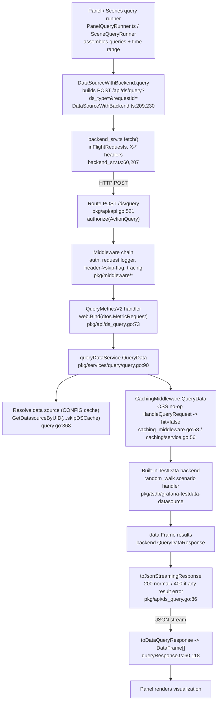

# What happens when a dashboard panel queries a built-in data source in Grafana

**An investigative, runtime-observed answer.**

- **Repository:** Grafana OSS monorepo
- **Commit:** `4550cfb5b72886782d9a3e6cf995f8dbd57ca4ff`
- **Source branch:** `grafana_4550cfb5b728`
- **Product version:** `11.5.0-pre`
- **Built-in data source observed:** TestData (`grafana-testdata-datasource`) — _primary_; grafanads (`-- Grafana --`) — _secondary_
- **Edition:** default **OSS** build (Enterprise features not enabled)

## Summary (one-paragraph answer)

When a dashboard panel runs a query against a built-in data source, the browser's Scenes-based panel query runner builds a single `POST /api/ds/query?ds_type=<type>&requestId=<id>` request (via `DataSourceWithBackend.query` → `backend_srv` fetch) whose JSON body is a `dtos.MetricRequest` (`{queries:[…], from, to}`) and which carries identifying `X-*` headers. The Go backend receives it on the route `POST /ds/query` [pkg/api/api.go:521], runs it through the middleware chain (auth, request logger, header→skip-flag mapping, tracing), and dispatches to the `QueryMetricsV2` handler [pkg/api/ds_query.go:73], which binds the body and calls the query-orchestration service `QueryData` [pkg/services/query/query.go:90]. That service parses the request, resolves the data source from its **configuration** cache, and (because this build is OSS) passes through the **no-op** query-caching middleware into the built-in TestData backend, which produces a `backend.QueryDataResponse` of `data.Frame` results. The handler streams that back as JSON via `toJsonStreamingResponse` [pkg/api/ds_query.go:86] with HTTP `200` (or `400` if any per-`refId` result carries an error), and the frontend rebuilds `DataFrame[]` with `toDataQueryResponse` [packages/grafana-runtime/src/utils/queryResponse.ts:60] so the panel can render. **When the identical query is executed twice in quick succession, the second execution is _not_ treated differently in the OSS build: it is fully re-executed, emits no `X-Cache` header, and returns freshly-generated data** — because the bound caching service `OSSCachingService.HandleQueryRequest` is a no-op [pkg/services/caching/service.go:56] wired in at [pkg/server/wireexts_oss.go:102]. The only "second-execution differs" mechanisms that exist are a _frontend_ in-flight request de-duplication keyed on `requestId`, and a data-source **config** cache — neither of which caches query _results_.

---

## Methodology — how this was observed

Everything below was captured from a **default OSS Grafana built and run locally** at the commit above. This section records the exact build/run commands, the version proof, the observability settings, and a proof that the repository was left unchanged.

### Toolchain (canonical, from the repository manifests)

| Tool              | Version                                 | Source                                                |
| ----------------- | --------------------------------------- | ----------------------------------------------------- |
| Go                | `1.23.1`                                | `go.mod:3` (`go 1.23.1`)                              |
| Node.js           | `v22.11.0` pinned; `engines.node >= 22` | `.nvmrc`; `package.json:451`                          |
| Yarn              | `4.5.3` (via corepack)                  | `package.json:453` (`"packageManager": "yarn@4.5.3"`) |
| Grafana           | `11.5.0-pre`                            | `package.json:6` (`"version"`)                        |
| Default HTTP port | `3000`                                  | `conf/defaults.ini:41` (`http_port = 3000`)           |

The build is confirmed OSS by the `Dockerfile`: `ARG GO_BUILD_TAGS="oss"` [Dockerfile:40], `GO_IMAGE=golang:1.23.1-alpine` [Dockerfile:5], `JS_IMAGE=node:22-alpine` [Dockerfile:3], `BASE_IMAGE=alpine:3.20` [Dockerfile:2], `EXPOSE 3000` [Dockerfile:194].

> **Note on the running Node version:** the container ships Node `v22.23.1`, which satisfies `engines.node >= 22` [package.json:451]; the canonical pinned value is `v22.11.0` [.nvmrc]. The `.nvmrc` file was **not** modified.

### Commit / branch confirmation

The commit **under investigation** is the source commit `4550cfb5b72886782d9a3e6cf995f8dbd57ca4ff`. On the Blitzy destination branch, this answer document is added as a documentation commit **on top of** that source commit, so the working-tree `HEAD` is the _deliverable_ commit while the source commit remains an **ancestor** of `HEAD` (verified below):

```bash
$ git branch --show-current
blitzy-4f908a31-b666-4bfc-a44d-6cd653929372
$ git log --oneline -1 4550cfb5b72886782d9a3e6cf995f8dbd57ca4ff   # the source commit under investigation
4550cfb5b7 Upgrade scenes to v5.32.0 (#97944)
$ git merge-base --is-ancestor 4550cfb5b72886782d9a3e6cf995f8dbd57ca4ff HEAD && echo "source commit is an ancestor of HEAD"
source commit is an ancestor of HEAD
```

> The working branch is the Blitzy destination branch. The _source_ branch under investigation is `grafana_4550cfb5b728`, whose tip is the source commit `4550cfb5b7…` (which also supplies this document's filename). Every behavior and every `file:line` reference in this document pertains to that **source** commit; the documentation commit that carries this file sits on top of it and adds **only** this document (proven under "Repository left unchanged"). `git rev-parse HEAD` therefore returns the deliverable commit, not the source commit — the two are distinguished here to avoid any ambiguity.

### Build

The canonical backend build target is `make build-go` (→ `./bin/grafana`) [Makefile:187] and the frontend `make build-js` [Makefile:211] (`make build` does both [Makefile:229]). In this environment the backend was built with the canonical build script (equivalent to `make build-go` but avoiding the `update-workspace` step that would dirty tracked files), producing the platform-suffixed binary `./bin/linux-amd64/grafana`, and the frontend was produced with `yarn build`:

```bash
# backend  -> ./bin/linux-amd64/grafana   (oss build tags, Go 1.23.1)
$ go run build.go build-backend
# frontend -> public/build (webpack production bundle)
$ yarn build
```

```bash
$ ls -l ./bin/linux-amd64/grafana
-rwxr-xr-x 1 root root 246579264 Jul  8 03:57 ./bin/linux-amd64/grafana
$ ls -1 public/build/*.js | wc -l
325
```

### Run

The server was started from the repository root (so it reads `conf/defaults.ini`) with the default configuration:

```bash
$ ./bin/linux-amd64/grafana server --homepath "$PWD"
```

Startup log (verbatim, key lines):

```text
logger=settings t=2026-07-08T05:21:31.08295025Z level=info msg="Starting Grafana" version=11.5.0-pre commit=4550cfb5b7 branch=blitzy-4f908a31-b666-4bfc-a44d-6cd653929372 compiled=2024-12-13T14:22:02Z
logger=http.server t=2026-07-08T05:21:31.332072335Z level=info msg="HTTP Server Listen" address=[::]:3000 protocol=http subUrl= socket=
```

### Version proof (`/api/health`)

```bash
$ curl -sS http://localhost:3000/api/health
{
  "database": "ok",
  "version": "11.5.0-pre",
  "commit": "4550cfb5b7"
}
```

### Authentication

The default admin login is `admin` / `admin` (the first-login password-change prompt was skipped, which is allowed). The `/api/ds/query` route requires an authenticated (signed-in) user — it is guarded by `authorize(ac.EvalPermission(datasources.ActionQuery))` [pkg/api/api.go:521]. An unauthenticated call returns `401` (see the Edge Conditions section).

### The built-in data source

A TestData data source already existed in the default instance:

```bash
$ curl -sS -u admin:admin http://localhost:3000/api/datasources
[{"id":1,"uid":"efrgdigurs5xcc","orgId":1,"name":"TestData","type":"grafana-testdata-datasource","typeName":"TestData","typeLogoUrl":"public/app/plugins/datasource/grafana-testdata-datasource/img/testdata.svg","access":"proxy","url":"","user":"","database":"","basicAuth":false,"isDefault":true,"jsonData":{},"readOnly":false}]
```

Its assigned **UID is `efrgdigurs5xcc`** and its type is `grafana-testdata-datasource`. TestData is used as the primary observation target because it needs no external system and deterministically produces a full round-trip (default scenario `random_walk`).

### Observability verbosity

Two observability facts (both verified at runtime, explained fully in the A6 section):

1. The **default** log level is `info`. However, for a **successful** (`HTTP 200`) request, the request-completion logger deliberately suppresses the `"Request Completed"` line when `router_logging = false` (the default) — `prepareLogParams` returns `errutil.LevelNever` for `status == 200` in that case [pkg/middleware/loggermw/logger.go:98-101]. Non-`200` requests (errors, websockets) _are_ logged at `info` by default.
2. The TestData scenario handler logs at **Debug** level [pkg/tsdb/grafana-testdata-datasource/scenarios.go:225].

To capture _both_ the successful-query `"Request Completed"` line and the TestData scenario line, the server was additionally run once with two **observability settings supplied via environment variables** (no tracked file was edited):

```bash
$ GF_LOG_LEVEL=debug GF_SERVER_ROUTER_LOGGING=true ./bin/linux-amd64/grafana server --homepath "$PWD"
```

`GF_LOG_LEVEL=debug` maps to `[log] level` [conf/defaults.ini:1074] and `GF_SERVER_ROUTER_LOGGING=true` maps to `[server] router_logging` [conf/defaults.ini:57]. The default-configuration behavior is always led first below; the debug/router-logging capture is clearly labeled as an observability setting.

### Repository left unchanged

All observation used the browser plus temporary `curl`/shell scripts, captured network artifacts (request/response bodies, header dumps), and rendered-panel screenshots — **all** written to a scratch directory **outside** the repository (`/tmp/gf_obs`); none were placed in, or committed to, the repository. The only file added to the repository is this document. Proof (captured after committing the answer document):

```bash
$ git status --porcelain -uall
$ # (no output above — the working tree is clean; nothing untracked, nothing modified)
$ git diff --name-status 4550cfb5b72886782d9a3e6cf995f8dbd57ca4ff..HEAD
A	blitzy/documentation/grafana_4550cfb5b728.md
```

The working tree is clean (`git status --porcelain -uall` prints nothing), and the **only** change relative to the source commit `4550cfb5b7…` is the single **added** file `blitzy/documentation/grafana_4550cfb5b728.md`. No tracked source file was modified, added, or deleted, and no untracked artifact (no screenshot, no observation script) remains in the repository — every such artifact lived under `/tmp/gf_obs` outside the repo.

---

## A1 — End-to-end flow

**Ask:** With a local Grafana running, trace the complete path of a panel query against a built-in data source, from the browser through the backend and back to the panel.

The following is the observed lifecycle for the real panel query captured in this investigation (a Time series panel on the built-in TestData source, default `random_walk` scenario). Every stage maps to a captured artifact (shown verbatim in A2–A4/A6) or a `file:line` reference.



**Narrative (stitching A2 → A3 → A4):**

1. **Panel assembles the request (browser).** The dashboard panel is driven by a query runner. In this build the new Scenes-based `SceneQueryRunner` supplies the `requestId` prefix `SQR` (observed `SQR100`, `SQR101`); the legacy `PanelQueryRunner.getNextRequestId()` [public/app/features/query/state/PanelQueryRunner.ts:69] uses the `Q` prefix. The runner collects the panel's queries and the dashboard time range and calls the data source's `query()` method through the observable pipeline in `runRequest` [public/app/features/query/state/runRequest.ts] and `QueryRunner` [public/app/features/query/state/QueryRunner.ts].

2. **`DataSourceWithBackend.query` builds the HTTP request.** It constructs the URL `'/api/ds/query?ds_type=' + this.type` [packages/grafana-runtime/src/utils/DataSourceWithBackend.ts:209] and appends `&requestId=<id>` [DataSourceWithBackend.ts:230], attaches the `X-*` identifying headers [DataSourceWithBackend.ts:206-246] (whose names are defined by the `PluginRequestHeaders` enum [DataSourceWithBackend.ts:79-88]), and POSTs a `dtos.MetricRequest` body via `getBackendSrv().fetch(...)` [DataSourceWithBackend.ts:248-256]. (Full detail + verbatim capture in **A2**.)

3. **`backend_srv` dispatches the fetch.** The low-level client registers the request in its `inFlightRequests` subject [public/app/core/services/backend_srv.ts:60] and (for GET-cache-busting flows) may set `X-Grafana-NoCache` [backend_srv.ts:207].

4. **Backend route + middleware.** The request hits `POST /ds/query` [pkg/api/api.go:521], passing through the authenticated middleware chain including the request-completion logger [pkg/middleware/loggermw/logger.go:84] and the header→skip-flag mapping [pkg/middleware/middleware.go:27,29]. (Full detail in **A3**.)

5. **Handler + orchestration.** `QueryMetricsV2` [pkg/api/ds_query.go:73] binds the body and calls `QueryData` [pkg/services/query/query.go:90], which parses the request [query.go:276], resolves the data source [query.go:368], runs the query concurrently [query.go:117], and — because it is a normal (non-expression) query — dispatches to the TestData backend.

6. **Built-in backend produces frames.** The TestData `random_walk` scenario returns a `backend.QueryDataResponse` of `data.Frame` results; the scenario handler is wrapped by `instrumentScenarioHandler` [pkg/tsdb/grafana-testdata-datasource/scenarios.go:216], which emits the `scenario=random_walk` Debug log [scenarios.go:225]. (Captured in **A6**.)

7. **Streaming response.** `toJsonStreamingResponse` [pkg/api/ds_query.go:86] writes the `QueryDataResponse` as JSON with HTTP `200` (or `400` if any per-`refId` result carries an error). (Full body + headers in **A4**.)

8. **Frontend rebuild + render.** `toDataQueryResponse` [packages/grafana-runtime/src/utils/queryResponse.ts:60] iterates `results[refId]` and rebuilds each frame with `dataFrameFromJSON` [queryResponse.ts:118] into `DataFrame[]`, which the panel renders. The captured render is shown below.

**Observed final render (proof of stage 8):** the panel drew a green `A-series` `random_walk` time-series line of **5 points** over the fixed absolute window `2026-07-07T21:33:20Z … 21:38:20Z`, confirming the JSON response parsed back into panel data. The rendered line's Y-axis spanned **≈79.9–80.6**, matching the second run's captured `A-series` values `[80.27235824938221, 80.56396347513395, 80.39233045447816, 79.94072684681394, 79.96882173404444]` exactly — tying the rendered chart to that specific captured response (shown verbatim in **A5**). Per the read-only single-deliverable rule, the render was observed **in-browser only**; no screenshot file is kept in the repository (all browser/network captures lived under the scratch directory `/tmp/gf_obs` outside the repo).

---

## A2 — Browser origin of the query

**Ask:** Show how the query is issued from the browser: which components construct/dispatch the request, the request URL, the request body/DTO shape, and the request headers.

**How this was captured (reproducible method).** A dashboard was created via the HTTP API (`POST /api/dashboards/db`, dashboard UID `blitzyqa01`) holding a single **Time series** panel (id `1`) bound to TestData with the default `random_walk` scenario and `maxDataPoints: 5` — the small `maxDataPoints` is chosen **only** so that every response array in A4/A5 below can be shown **complete and byte-for-byte** rather than truncated. Logged in as `admin` (password-change prompt skipped), that dashboard was opened in a real Chrome browser at a **fixed absolute** time range so that repeated runs post byte-identical input (see A5):

```text
http://localhost:3000/d/blitzyqa01/blitzy-qa-testdata?orgId=1&from=1783460000000&to=1783460300000
```

The panel then auto-ran, issuing the **real** `POST /api/ds/query` request through `DataSourceWithBackend.query`. The request and its response were captured **passively** — nothing was modified or synthesized — over the **Chrome DevTools Protocol (CDP) `Network` domain**, driven by the `chrome-devtools-mcp` network tools: `list_network_requests` to enumerate the page's own requests, then `get_network_request` to export the complete request URL, request headers, request body, response headers, response status, and response body to files under the scratch dir `/tmp/gf_obs` (outside the repo). This is reproducible with any CDP client (Chrome DevTools **Network** tab → right-click a request → **Copy as cURL** / **Save all as HAR**, or `Network.getResponseBody` over the protocol). The enumerated entry for the panel's query was:

```text
reqid=144  POST  http://localhost:3000/api/ds/query?ds_type=grafana-testdata-datasource&requestId=SQR100  [200]
```

This is the panel's own request (the real entry point), not a hand-built one. The byte-identical **second** run (`requestId=SQR101`), captured the same way, is compared in **A5**. (Where an error/edge condition below is easier to force deterministically, a `curl` replay of the identical body is used as clearly-labeled corroboration — the authenticated session cookie / basic auth standing in for the browser's cookie.)

### The request URL

```text
POST http://localhost:3000/api/ds/query?ds_type=grafana-testdata-datasource&requestId=SQR100
```

This exactly matches the construction in `DataSourceWithBackend.query`:

<!-- prettier-ignore -->
```ts
// packages/grafana-runtime/src/utils/DataSourceWithBackend.ts:209
let url = '/api/ds/query?ds_type=' + this.type;
// ...
// DataSourceWithBackend.ts:230
url += `&requestId=${requestId}`;
```

- `ds_type=grafana-testdata-datasource` is `this.type` [DataSourceWithBackend.ts:209].
- `requestId=SQR100` is the per-request id [DataSourceWithBackend.ts:230]. The `SQR` prefix is produced by the Scenes query runner (`SceneQueryRunner.getNextRequestId()` returns `"SQR" + counter++`), whereas the legacy runner uses `"Q"` [public/app/features/query/state/PanelQueryRunner.ts:69]. _(The `SQR` origin is inferred from reading `@grafana/scenes`; the value `SQR100`/`SQR101` was observed at runtime.)_
- For an **expression** query the frontend additionally appends `&expression=true` [DataSourceWithBackend.ts:224-225] (see Edge Conditions).

### The request body (DTO shape)

Verbatim captured request body (the panel-issued request `SQR100`, exported via CDP `get_network_request`; `content-length: 243`):

<!-- prettier-ignore -->
```json
{"queries":[{"datasource":{"type":"grafana-testdata-datasource","uid":"efrgdigurs5xcc"},"refId":"A","scenarioId":"random_walk","seriesCount":1,"datasourceId":1,"intervalMs":60000,"maxDataPoints":5}],"from":"1783460000000","to":"1783460300000"}
```

This is the shape of `dtos.MetricRequest`:

```go
// pkg/api/dtos/models.go:64
type MetricRequest struct {
    // From Start time in epoch timestamps in milliseconds or relative using Grafana time units.
    From string `json:"from"`                 // models.go:68
    // To End time in epoch timestamps in milliseconds or relative using Grafana time units.
    To string `json:"to"`                     // models.go:72
    // queries.refId – Specifies an identifier of the query. ...
    Queries []*simplejson.Json `json:"queries"` // models.go:79
    // Debug ...
    Debug bool `json:"debug"`                  // models.go:81
    // ...
}
```

Mapping the captured body onto the DTO:

| DTO field                                 | Captured value                                                       |
| ----------------------------------------- | -------------------------------------------------------------------- |
| `from`                                    | `"1783460000000"` (epoch ms, absolute)                               |
| `to`                                      | `"1783460300000"` (epoch ms, absolute)                               |
| `queries`                                 | one element, `refId="A"`                                             |
| `queries[0].datasource`                   | `{ "type": "grafana-testdata-datasource", "uid": "efrgdigurs5xcc" }` |
| `queries[0].scenarioId`                   | `"random_walk"` (TestData scenario)                                  |
| `queries[0].intervalMs` / `maxDataPoints` | `60000` / `5`                                                        |
| `debug`                                   | (absent → default `false`)                                           |

Each element of `queries` is a free-form `*simplejson.Json` [models.go:79], which is why data-source-specific fields (`scenarioId`, `seriesCount`, `intervalMs`, …) travel inside it untyped.

### The request headers

Verbatim captured request headers (the panel-issued request `SQR100`, exported via CDP `get_network_request`). Only the `grafana_session` cookie value — a live bearer credential — is redacted; **every other value is byte-verbatim**:

```text
accept: application/json, text/plain, */*
accept-encoding: gzip, deflate, br, zstd
accept-language: en-US,en;q=0.9
connection: keep-alive
content-length: 243
content-type: application/json
cookie: grafana_session=<REDACTED_SESSION_TOKEN>; grafana_session_expiry=1783488773
host: localhost:3000
origin: http://localhost:3000
referer: http://localhost:3000/d/blitzyqa01/blitzy-qa-testdata?orgId=1&from=2026-07-07T21:33:20.000Z&to=2026-07-07T21:38:20.000Z&timezone=utc
sec-fetch-dest: empty
sec-fetch-mode: cors
sec-fetch-site: same-origin
user-agent: Mozilla/5.0 (X11; Linux x86_64) AppleWebKit/537.36 (KHTML, like Gecko) HeadlessChrome/150.0.0.0 Safari/537.36
x-dashboard-uid: blitzyqa01
x-datasource-uid: efrgdigurs5xcc
x-grafana-device-id: 7d176f143a3a1d8d4f0034e8a7d0125a
x-grafana-org-id: 1
x-panel-id: 1
x-panel-plugin-id: timeseries
x-plugin-id: grafana-testdata-datasource
```

Because this dashboard is **saved** (UID `blitzyqa01`, panel id `1`), the request carries `x-dashboard-uid: blitzyqa01` and `x-panel-id: 1` — both **present** here (they are omitted only for an unsaved `/dashboard/new` panel). The `X-*` plugin headers come from the `PluginRequestHeaders` enum and are attached by `DataSourceWithBackend`:

<!-- prettier-ignore -->
```ts
// packages/grafana-runtime/src/utils/DataSourceWithBackend.ts:79
enum PluginRequestHeaders {
  PluginID = 'X-Plugin-Id',              // :80
  DatasourceUID = 'X-Datasource-Uid',    // :81
  DashboardUID = 'X-Dashboard-Uid',      // :82
  PanelID = 'X-Panel-Id',                // :83
  PanelPluginId = 'X-Panel-Plugin-Id',   // :84
  QueryGroupID = 'X-Query-Group-Id',     // :85
  FromExpression = 'X-Grafana-From-Expr',// :86
  SkipQueryCache = 'X-Cache-Skip',       // :87
}
```

> **Citation-precision note (verified with `grep -n` against this commit):** the `PluginRequestHeaders` enum in `packages/grafana-runtime/src/utils/DataSourceWithBackend.ts` occupies **L79–L88** — the `enum` declaration is on **L79**, its eight members span **L80–L87**, and the closing brace `}` is on **L88**. The inline `// :NN` comments in the excerpt above are the exact observed member line numbers. (The AAP's approximate `L81–L88` reference for this enum is superseded by these observed values.)

Observed vs. expected headers:

| Header                      | Observed value                | Notes                                                                                 |
| --------------------------- | ----------------------------- | ------------------------------------------------------------------------------------- |
| `X-Plugin-Id`               | `grafana-testdata-datasource` | [DataSourceWithBackend.ts:80]                                                         |
| `X-Datasource-Uid`          | `efrgdigurs5xcc`              | [DataSourceWithBackend.ts:81]                                                         |
| `X-Panel-Plugin-Id`         | `timeseries`                  | [DataSourceWithBackend.ts:84]                                                         |
| `X-Dashboard-Uid`           | `blitzyqa01`                  | dashboard is saved, so its UID is present [DataSourceWithBackend.ts:82]               |
| `X-Panel-Id`                | `1`                           | saved panel's persisted id is present [DataSourceWithBackend.ts:83]                   |
| `X-Grafana-From-Expr`       | _(absent)_                    | not an expression query [DataSourceWithBackend.ts:86]                                 |
| `X-Cache-Skip`              | _(absent)_                    | caching not skipped for this request [DataSourceWithBackend.ts:87]                    |
| `X-Grafana-Org-Id`          | `1`                           | org context                                                                           |
| `cookie: grafana_session=…` | present                       | this is how the authenticated route is satisfied                                      |

The fetch itself is dispatched by `getBackendSrv().fetch<BackendDataSourceResponse>({ url, method: 'POST', data: body, requestId, hideFromInspector, headers })` [DataSourceWithBackend.ts:248-256], and the result is piped through `switchMap((raw) => toDataQueryResponse(raw, queries))` [DataSourceWithBackend.ts:259] — i.e. the same `toDataQueryResponse` covered in A4.

---

## A3 — Backend handling

**Ask:** Show how the request is handled by the backend: the HTTP route, the middleware chain, the handler, the query-orchestration service, data-source resolution, and the routing to the built-in backend that produces the data.

### The route

```go
// pkg/api/api.go:521
apiRoute.Post("/ds/query", requestmeta.SetSLOGroup(requestmeta.SLOGroupHighSlow), authorize(ac.EvalPermission(datasources.ActionQuery)), hs.getDSQueryEndpoint())
```

The route is `POST /api/ds/query`, tagged into the "high/slow" SLO group and guarded by `authorize(ac.EvalPermission(datasources.ActionQuery))` — this is why the request must be authenticated (the browser's `grafana_session` cookie satisfies it; an unauthenticated call yields `401`, see Edge Conditions). It dispatches to `hs.getDSQueryEndpoint()`.

### The handler

```go
// pkg/api/ds_query.go:41
func (hs *HTTPServer) getDSQueryEndpoint() web.Handler {
    if hs.Features.IsEnabledGlobally(featuremgmt.FlagQueryServiceRewrite) {
        // ... rewrite to /apis/query.grafana.app/v0alpha1/namespaces/<orgID>/query
    }
    return routing.Wrap(hs.QueryMetricsV2)   // ds_query.go:55
}
```

The `queryServiceRewrite` feature flag rewrites to the Kubernetes-style query path when enabled. **It is OFF by default** — confirmed at runtime:

```bash
$ curl -sS -u admin:admin http://localhost:3000/api/frontend/settings \
   | python3 -c 'import sys,json;print(json.load(sys.stdin)["featureToggles"].get("queryServiceRewrite"))'
None
```

So the **classic `QueryMetricsV2` handler runs** [pkg/api/ds_query.go:73]:

```go
// pkg/api/ds_query.go:73
func (hs *HTTPServer) QueryMetricsV2(c *contextmodel.ReqContext) response.Response {
    reqDTO := dtos.MetricRequest{}
    if err := web.Bind(c.Req, &reqDTO); err != nil {           // ds_query.go:75
        return response.Error(http.StatusBadRequest, "bad request data", err) // :76
    }
    resp, err := hs.queryDataService.QueryData(c.Req.Context(), c.SignedInUser, c.SkipDSCache, reqDTO) // :79
    if err != nil {
        return hs.handleQueryMetricsError(err)                 // :81
    }
    return hs.toJsonStreamingResponse(c.Req.Context(), resp)   // :86
}
```

`web.Bind` deserializes the body into `dtos.MetricRequest`; a malformed body returns `400 "bad request data"` [ds_query.go:75-76] (captured in Edge Conditions). On success it calls the orchestration service `QueryData`, passing `c.SkipDSCache` (set by header middleware, below).

The sentinel error mapping is `handleQueryMetricsError` [pkg/api/ds_query.go:24]:

```go
// pkg/api/ds_query.go:24
func (hs *HTTPServer) handleQueryMetricsError(err error) *response.NormalResponse {
    if errors.Is(err, datasources.ErrDataSourceAccessDenied) {
        return response.Error(http.StatusForbidden, "Access denied to data source", err)   // :25-26 -> 403
    }
    if errors.Is(err, datasources.ErrDataSourceNotFound) {
        return response.Error(http.StatusNotFound, "Data source not found", err)            // :28-29 -> 404
    }
    // ... default -> 500 "Query data error"
}
```

### The middleware chain

The request traverses the middleware registered around `pkg/api/api.go` and implemented under `pkg/middleware/`. Two members matter directly here:

- **Header → skip-flag mapping** [pkg/middleware/middleware.go]:

  ```go
  // pkg/middleware/middleware.go:27
  ctx.SkipDSCache = c.Req.Header.Get("X-Grafana-NoCache") == "true"
  // pkg/middleware/middleware.go:29
  ctx.SkipQueryCache = c.Req.Header.Get("X-Cache-Skip") == "true"
  ```

  These populate `ctx.SkipDSCache` / `ctx.SkipQueryCache` on the request context [pkg/services/contexthandler/model/model.go:28-29]. `SkipDSCache` is the value handed to `QueryData` above.

- **Request-completion logger** [pkg/middleware/loggermw/logger.go:84], which emits the `"Request Completed"` structured log — covered in A6.

> **Ordering note (inferred from reading, not directly observed):** the exact registration order of the full chain (auth → context → logger → tracing → handler) is read from `pkg/api/api.go` / `pkg/middleware/*`; the runtime logs confirm that auth, header-mapping, the handler, and the completion logger all execute, but the precise interleaving is inferred.

### The orchestration service — `QueryData`

```go
// pkg/services/query/query.go:90
func (s *ServiceImpl) QueryData(ctx context.Context, user identity.Requester, skipDSCache bool, reqDTO dtos.MetricRequest) (*backend.QueryDataResponse, error) {
    // parse -> parsedReq
    parsedReq, err := s.parseMetricRequest(ctx, user, skipDSCache, reqDTO)  // query.go:276 (parseMetricRequest)
    // ...
    if parsedReq.hasExpression() {                     // query.go:98-99
        return s.handleExpressions(ctx, user, parsedReq)  // query.go:203
    }
    // single datasource fast-path
    return s.handleQuerySingleDatasource(ctx, user, parsedReq)  // query.go:244
    // (multi-datasource path fans out concurrently via errgroup.WithContext) query.go:117
}
```

Key observed/verified behaviors:

- **Request parsing** — `parseMetricRequest` [query.go:276]; expression detection uses `expr.NodeTypeFromDatasourceUID` [query.go:300]. A request is treated as an expression query when a query's datasource UID is the expression UID `__expr__` (`expr.DatasourceUID` [pkg/expr/service.go:28], value `"__expr__"` [pkg/expr/service.go:24]).
- **Data-source resolution** — `s.dataSourceCache.GetDatasourceByUID(ctx, uid, user, skipDSCache)` [query.go:368]. **This is a data-source _configuration_ cache, not a query-result cache** — it caches the datasource's connection/config object, and is bypassed when `skipDSCache` is true (from `X-Grafana-NoCache`). It does **not** cache query results.
- **Concurrency** — multiple datasources are queried concurrently with `errgroup.WithContext(ctx)` [query.go:117].
- **Single-datasource fast path** — `handleQuerySingleDatasource` [query.go:244] (the observed TestData case).

Runtime confirmation that the orchestration layer ran (debug level). Command that produced it:

```bash
grep 'Processed metrics query' /tmp/gf_obs/server.log | tail -1
```

Complete, unedited captured line (the panel run against TestData; note `from`/`to` are the panel's absolute range in epoch-ms, `interval=60000`, `max_data_points=5`, and the full serialized `query`):

```text
logger=query_data t=2026-07-08T05:27:46.571890239Z level=debug msg="Processed metrics query" ref_id=A from=1783460000000 to=1783460300000 interval=60000 max_data_points=5 query="{\"datasource\":{\"type\":\"grafana-testdata-datasource\",\"uid\":\"efrgdigurs5xcc\"},\"intervalMs\":60000,\"maxDataPoints\":5,\"refId\":\"A\",\"scenarioId\":\"random_walk\"}"
```

### Caching middleware → downstream backend

Between the orchestration service and the plugin backend sits the plugin-client caching middleware:

```go
// pkg/services/pluginsintegration/clientmiddleware/caching_middleware.go:58
func (m *CachingMiddleware) QueryData(ctx context.Context, req *backend.QueryDataRequest) (*backend.QueryDataResponse, error) {
    // ...
    hit, cr := m.caching.HandleQueryRequest(ctx, req)   // caching_middleware.go:72
    // reads reqCtx.Resp.Header().Get(caching.XCacheHeader)  // caching_middleware.go:75
    if hit {
        return cr.Response, nil                          // (short-circuit on cache hit)
    }
    resp, err := m.BaseHandler.QueryData(ctx, req)       // caching_middleware.go:92  (downstream)
    // ... conditionally write to cache
    return resp, err
}
```

In the OSS build `m.caching` is `*OSSCachingService`, whose `HandleQueryRequest` is a no-op returning `hit=false` (see A5 for the full analysis) — so the downstream `BaseHandler.QueryData` (the TestData backend) is **always** invoked.

### The built-in backend produces the data

Routing lands in the TestData plugin backend, whose scenario handlers return a `backend.QueryDataResponse` of `data.Frame` results. The default scenario is `random_walk`; each scenario handler is wrapped by `instrumentScenarioHandler` [pkg/tsdb/grafana-testdata-datasource/scenarios.go:216], which starts a `testdatasource.queryData` trace span [scenarios.go:218] and logs the scenario at Debug [scenarios.go:225]. Runtime confirmation — command:

```bash
grep 'logger=tsdb.testdata' /tmp/gf_obs/server.log | grep 'msg=queryData' | tail -1
```

Complete, unedited captured line:

```text
logger=tsdb.testdata endpoint=queryData pluginId=grafana-testdata-datasource dsName=TestData dsUID=efrgdigurs5xcc uname=admin t=2026-07-08T05:27:46.572253215Z level=debug msg=queryData scenario=random_walk
```

The default scenario id resolves to `RandomWalk` [scenarios.go:234]; the handler is `handleRandomWalkScenario` [scenarios.go:293]. The secondary built-in source, grafanads (`-- Grafana --`), routes through its own `QueryData` [pkg/tsdb/grafanads/grafana.go:90] (see Edge Conditions).

---

## A4 — Response shape

**Ask:** Show what the response looks like when it returns to the panel: the JSON structure (results keyed by `refId`, data frames with schema and data), status codes, response headers, and how the frontend parses the response back into panel data.

### How the status code is chosen

```go
// pkg/api/ds_query.go:86
func (hs *HTTPServer) toJsonStreamingResponse(ctx context.Context, qdr *backend.QueryDataResponse) response.Response {
    statusCode := http.StatusOK                          // 200
    for _, res := range qdr.Responses {
        if res.Error != nil {
            statusCode = http.StatusBadRequest            // 400 if ANY per-refId result has an error
            requestmeta.WithDownstreamStatusSource(ctx)   // mark status_source=downstream
            break
        }
    }
    return response.JSONStreaming(statusCode, qdr)
}
```

So a normal query returns **HTTP 200**; if _any_ per-`refId` result carries an error, the whole HTTP response is **HTTP 400** (while individual results keep their own `status`). `JSONStreaming` sets `Content-Type: application/json`.

### The success response — status, headers, body

**Response status:** `200 OK`.

**Verbatim response headers.** Two independent capture methods agree.

(a) From the **panel** request via CDP `get_network_request` (`SQR100`), the response carried these headers (Chrome's CDP view normalizes/omits hop-by-hop headers such as `date`/`content-length`):

```text
cache-control: no-store
content-type: application/json
x-content-type-options: nosniff
x-frame-options: deny
x-xss-protection: 1; mode=block
```

(b) The byte-verbatim on-disk artifact `/tmp/gf_obs/curl_hdr_1.txt` (a `curl -D -` capture of the identical-shape request; see A5) shows the **complete** server-emitted header set — reproduced here unedited:

```text
HTTP/1.1 200 OK
Cache-Control: no-store
Content-Type: application/json
X-Content-Type-Options: nosniff
X-Frame-Options: deny
X-Xss-Protection: 1; mode=block
Date: Wed, 08 Jul 2026 05:26:58 GMT
Content-Length: 523
```

Three things to note: (1) **there is no `X-Cache` header** — central to A5; (2) `cache-control: no-store` ensures browsers/proxies do not cache the `/api/ds/query` response; (3) for this small result the streaming writer's output was short enough to be sent with an explicit `Content-Length` rather than `Transfer-Encoding: chunked` — this is the **observed** behavior for the captured frame.

**Verbatim response body — complete and byte-faithful.** The panel used `maxDataPoints: 5` over a five-minute absolute range at 60 s resolution, so the frame contains **exactly five points** and the entire body fits in **527 bytes** — it is reproduced here in full, with **no truncation**. Artifact: `/tmp/gf_obs/panel_run1_response_body.network-response` (527 bytes, `md5 db6bb5e7328a660118f39009ea08a57c`). (Note: the `Content-Length: 523` in header capture (b) belongs to a _different_ run — the `curl` corroboration artifact `curl_hdr_1.txt`, see A5 — not to this 527-byte panel body. The few-byte spread across the captured `random_walk` bodies (`size=521` in the A6 completion-log line, `523` here in header (b), and `527` for this panel body) is expected: `random_walk` emits variable-length float string representations, so each run's serialized body length differs slightly.)

Raw bytes exactly as received on the wire:

```json
{"results":{"A":{"status":200,"frames":[{"schema":{"refId":"A","meta":{"typeVersion":[0,0],"custom":{"customStat":10}},"fields":[{"name":"time","type":"time","typeInfo":{"frame":"time.Time","nullable":true},"config":{"interval":60000}},{"name":"A-series","type":"number","typeInfo":{"frame":"float64","nullable":true},"labels":{}}]},"data":{"values":[[1783460000000,1783460060000,1783460120000,1783460180000,1783460240000],[14.183115437259625,14.275954144375484,14.111057437309627,13.700939441579548,14.133062075113275]]}}]}}}
```

The same bytes, pretty-printed for readability (every value shown; nothing elided):

<!-- prettier-ignore -->
```json
{
  "results": {
    "A": {
      "status": 200,
      "frames": [
        {
          "schema": {
            "refId": "A",
            "meta": { "typeVersion": [0, 0], "custom": { "customStat": 10 } },
            "fields": [
              { "name": "time", "type": "time", "typeInfo": { "frame": "time.Time", "nullable": true }, "config": { "interval": 60000 } },
              { "name": "A-series", "type": "number", "typeInfo": { "frame": "float64", "nullable": true }, "labels": {} }
            ]
          },
          "data": {
            "values": [
              [1783460000000, 1783460060000, 1783460120000, 1783460180000, 1783460240000],
              [14.183115437259625, 14.275954144375484, 14.111057437309627, 13.700939441579548, 14.133062075113275]
            ]
          }
        }
      ]
    }
  }
}
```

Structure:

- **`results`** is an object keyed by `refId` (here `"A"`).
- Each entry has a **`status`** (`200`) and a **`frames`** array.
- Each frame has a **`schema`** (`refId`, `meta`, and typed `fields`) and a **`data`** object with a **`values`** array — one parallel column per field. The first column (`time`, five epoch-ms timestamps `1783460000000…1783460240000` at a 60 s step) and the second column (`A-series`, five `float64` values) are the X/Y of the chart.
- **`config.interval` is `60000`** — the 60 s step the backend derived from the panel's `intervalMs: 60000`, matching the `query_data` log line in A3.

> **Completeness note:** both value arrays above are shown in their entirety (five elements each); there is no elision. The pretty-printed block is a whitespace-only reformatting of the raw bytes shown immediately above it — same values, same order.

### The error response shape (HTTP 400)

When a per-`refId` result carries an error (here the TestData `random_walk_with_error` scenario), the HTTP status is **400** and the erroring result carries an `error` (and `errorSource`) field while still returning frames. This is the **complete** captured body (619 bytes, artifact `/tmp/gf_obs/erwerr_body.json`) — reproduced in full, no truncation:

<!-- prettier-ignore -->
```json
{"results":{"A":{"error":"this is an error and it can include URLs http://grafana.com/","errorSource":"plugin","status":500,"frames":[{"schema":{"refId":"A","meta":{"typeVersion":[0,0],"custom":{"customStat":10}},"fields":[{"name":"time","type":"time","typeInfo":{"frame":"time.Time","nullable":true},"config":{"interval":60000}},{"name":"A-series","type":"number","typeInfo":{"frame":"float64","nullable":true},"labels":{}}]},"data":{"values":[[1783460000000,1783460060000,1783460120000,1783460180000,1783460240000],[2.1258895085434406,1.9366024011476475,2.356121672027072,2.5474192754772624,2.270570656538267]]}}]}}}
```

Note the per-`refId` object here has `"status": 500` and an `"error"`/`"errorSource": "plugin"` even though the outer HTTP response is `400` — exactly the split that `toJsonStreamingResponse` [ds_query.go:86] produces (any per-query error promotes the envelope to 400 while each result keeps its own status). The frame still returns all five points, matching the panel's `intervalMs: 60000` over the same absolute range. (The command that produced this and the matching `status_source=downstream` completion log are in Edge Conditions.)

### How the frontend rebuilds `DataFrame[]`

<!-- prettier-ignore -->
```ts
// packages/grafana-runtime/src/utils/queryResponse.ts:60
export function toDataQueryResponse(res, queries?) {
  const rsp: DataQueryResponse = { data: [], state: LoadingState.Done };
  const results = (res.data as BackendDataSourceResponse)?.results;  // queryResponse.ts:77
  const cached = isCachedResponse(res);                              // queryResponse.ts:80
  for (const refId of Object.keys(results)) {                        // queryResponse.ts:83
    const dr = results[refId];
    // dr.refId = refId                                              // queryResponse.ts:88
    // if dr.error -> push a DataQueryError                         // queryResponse.ts:92-107
    for (const js of dr.frames ?? []) {                             // queryResponse.ts:113-114
      const df = dataFrameFromJSON(js);                             // queryResponse.ts:118
      // ... push df into rsp.data
    }
  }
  return rsp;
}
```

`toDataQueryResponse` [queryResponse.ts:60] reads `res.data.results` [queryResponse.ts:77], iterates each `refId` [queryResponse.ts:83], maps any per-`refId` error to a `DataQueryError` [queryResponse.ts:92-107] (via helper `toDataQueryError` [packages/grafana-runtime/src/utils/toDataQueryError.ts]), and converts every JSON frame into a `DataFrame` with `dataFrameFromJSON` [queryResponse.ts:118]. The resulting `DataFrame[]` is what the panel renders (the green `A-series` line observed in-browser in stage 8 of A1).

The `cached` flag is set from `isCachedResponse(res)` [queryResponse.ts:80], which is defined as:

<!-- prettier-ignore -->
```ts
// packages/grafana-runtime/src/utils/queryResponse.ts:160
function isCachedResponse(res: FetchResponse): boolean {
  const headers = res?.headers;
  if (!headers || !headers.get) { return false; }
  return headers.get('X-Cache') === 'HIT';   // queryResponse.ts:165
}
```

Because the OSS response has **no `X-Cache` header**, this is always `false`, so the "Cached response" notice (`cachedResponseNotice` [queryResponse.ts:23], attached at [queryResponse.ts:177]) is never added. This ties A4 to A5/A6.

---

## A5 — "Executed twice" comparison (THE CRUX)

**Ask:** When the same query is executed twice in quick succession, is the second execution treated differently in any way (query caching, request deduplication, conditional handling)?

**Net answer (observed):** In the default OSS build, the second identical query is **not** treated differently at the result level — it is **fully re-executed**, emits **no `X-Cache` header**, and returns **freshly-generated data**. Three distinct mechanisms could be meant by "treated differently"; each is resolved separately below.

### Reproduction — the identical query run 5 times

The _same, unchanged_ query was executed repeatedly (two real panel runs + three byte-identical `curl` replays), and every round-trip was compared.

**Two real panel runs** (through the panel's own request path): the initial panel load issued `requestId=SQR100` and clicking the panel's Refresh control issued `requestId=SQR101` (panel refreshes increment the `requestId` counter — see Mechanism 2). Crucially, because the dashboard was opened with an **absolute** time range (`from=1783460000000`, `to=1783460300000` — a fixed 5-minute window), the two request **bodies were byte-identical** (both `md5 aabb73ef99982e1aff86725db2535b4f`, 243 bytes) — the same unchanged input, exactly as the "executed twice" ask requires. Observed first data value: **run 1 ≈ 14.18**, **run 2 ≈ 80.27** (the complete first-series arrays appear in A4: `[14.183115437259625, …]` for run 1 vs `[80.27235824938221, …]` for run 2).

**Three byte-identical `curl` replays** (corroboration only — the _exact same bytes_ posted three times). The body file (`identical_body.json`) holds the same JSON payload as the panel request, differing only by a trailing newline (244 vs 243 bytes — hence a different checksum from the panel body's `aabb73ef…`); it was fixed and its checksum verified:

```bash
$ md5sum /tmp/gf_obs/identical_body.json
632774229ed5a59726168cdcfc7d3aa2  /tmp/gf_obs/identical_body.json

$ for i in 1 2 3; do
    curl -sS -u admin:admin \
      -H 'Content-Type: application/json' \
      -D /tmp/gf_obs/curl_hdr_$i.txt \
      --data @/tmp/gf_obs/identical_body.json \
      'http://localhost:3000/api/ds/query?ds_type=grafana-testdata-datasource&requestId=SQRtest' \
      -o /tmp/gf_obs/curl_resp_$i.json
  done
```

Observed first data value of the three replays: **≈ 7.61**, **≈ 36.08**, **≈ 84.62**.

**Every one of the 5 runs:**

- returned **HTTP 200**,
- had **no `X-Cache` response header**,
- had `cache-control: no-store`,
- and produced **different data values** — direct runtime proof that each identical request was re-executed by the backend rather than served from a result cache.

The response headers of the replays confirm the absence of `X-Cache`:

```bash
$ grep -i -E '^(HTTP|x-cache|cache-control)' /tmp/gf_obs/curl_hdr_1.txt
HTTP/1.1 200 OK
Cache-Control: no-store
# (no X-Cache line present)
```

The result was **stable across all 5 runs** — no run behaved differently.

### Mechanism 1 — Query-result caching (the primary answer): OSS no-op

The query-result caching hook is:

```go
// pkg/services/pluginsintegration/clientmiddleware/caching_middleware.go:58
func (m *CachingMiddleware) QueryData(ctx context.Context, req *backend.QueryDataRequest) (*backend.QueryDataResponse, error) {
    // ...
    hit, cr := m.caching.HandleQueryRequest(ctx, req)                 // :72
    defer func() { /* read reqCtx.Resp.Header().Get(caching.XCacheHeader) */ }()  // :75
    if hit {
        return cr.Response, nil
    }
    return m.BaseHandler.QueryData(ctx, req)                          // :92 (downstream ALWAYS runs when hit=false)
}
```

In the OSS build, `m.caching` is bound to `*OSSCachingService`, whose implementation is an explicit no-op:

```go
// pkg/services/caching/service.go:10
const (
    XCacheHeader   = "X-Cache"   // :10
    StatusHit      = "HIT"       // :11
    StatusMiss     = "MISS"      // :12
    StatusBypass   = "BYPASS"    // :13
    StatusError    = "ERROR"     // :14
    StatusDisabled = "DISABLED"  // :15
)

// Implementation of interface - does nothing   // service.go:52
type OSSCachingService struct{}                  // service.go:53

func (s *OSSCachingService) HandleQueryRequest(ctx context.Context, req *backend.QueryDataRequest) (bool, CachedQueryDataResponse) {
    return false, CachedQueryDataResponse{}      // service.go:56-57  (never a hit; no header set)
}

var _ CachingService = &OSSCachingService{}      // service.go:64
```

And the OSS wiring binds the interface to that no-op:

```go
// pkg/server/wireexts_oss.go:102
wire.Bind(new(caching.CachingService), new(*caching.OSSCachingService)),
```

**Cause → effect:** because the bound service always returns `hit=false` and sets **no** `X-Cache` header, the caching middleware always falls through to the downstream backend, and no `X-Cache` header is ever written. **Therefore the second identical OSS query is fully re-executed with no `X-Cache` header** — exactly what the 5-run reproduction shows (different `random_walk` data each time). External research corroborates this design: query caching is a Grafana Enterprise/Cloud feature and is not present in OSS.

**Enterprise contrast (documented only — NOT enabled/executed here):** with Enterprise query caching enabled, the first execution would return `X-Cache: MISS` and the second `X-Cache: HIT` (served from cache), and the frontend's `isCachedResponse()` [queryResponse.ts:165] would flip to `true`, attaching the "Cached response" notice [queryResponse.ts:23,177] and setting `meta.isCachedResponse`. None of this occurs in the OSS build under observation.

### Mechanism 2 — Frontend in-flight request de-duplication (by `requestId`)

Distinct from server-side caching, the low-level frontend client cancels a _prior in-flight_ request that shares the **same `requestId`** when a new one starts:

<!-- prettier-ignore -->
```ts
// public/app/core/services/backend_srv.ts:60
private inFlightRequests: Subject<string> = new Subject<string>();
// backend_srv.ts:61
// HTTP_REQUEST_CANCELED = -1

// backend_srv.ts:146-147 (internalFetch): this.inFlightRequests.next(requestId)

// backend_srv.ts:416 handleStreamCancellation(options) => (inputStream) =>
//   inputStream.pipe(
//     takeUntil(                                              // :419
//       this.inFlightRequests.pipe(
//         filter((requestId) => options.requestId === requestId)  // :421-427 same-requestId -> cancel prior
//       )
//     ),
//     ...
//   )
```

When two requests share a `requestId` and the second starts before the first resolves, the first is canceled (its Network entry ends with `HTTP_REQUEST_CANCELED = -1` [backend_srv.ts:61]). **Observed at runtime:** the two panel runs used **different** request ids (`SQR100`, `SQR101`), so no cancellation fired between the two sequential runs — each completed normally.

> **Observed at runtime (forced same-`requestId` overlap).** To exercise the cancellation directly, `getBackendSrv` was obtained in the running page via `window.System.import('@grafana/runtime')` (Grafana's SystemJS module registry — `window.grafanaRuntime` exposes only debug helpers `getDashboardSaveModel`/`getDashboardTimeRange`/`getPanelData`, not `getBackendSrv`). Two overlapping `slow_query` requests (5-second server delay) were then dispatched through the real client with the **same** `requestId` (`"DUPTEST"`). The first was **canceled** the instant the second started: it errored at `t ≈ 202 ms` with `status = -1` ("Request was aborted") — exactly `HTTP_REQUEST_CANCELED = -1` [backend_srv.ts:61] — while the second completed normally at `t ≈ 5215 ms` with `status = 200`. This directly confirms `handleStreamCancellation` [backend_srv.ts:416-436] canceling a prior in-flight request via the same-`requestId` filter [backend_srv.ts:421-427]. It is, regardless, a _frontend request-dedup_ mechanism and does **not** cache query results.

### Mechanism 3 — Data-source configuration cache (not a result cache)

`QueryData` resolves the datasource via `s.dataSourceCache.GetDatasourceByUID(ctx, uid, user, skipDSCache)` [pkg/services/query/query.go:368]. This caches the **datasource configuration object** (connection settings), _not_ query results, and is bypassed when `skipDSCache` is true. `skipDSCache` comes from the `X-Grafana-NoCache: true` header → `ctx.SkipDSCache` [pkg/middleware/middleware.go:27; field pkg/services/contexthandler/model/model.go:28]. Because it caches config and not results, it has **no effect on whether the second query's _data_ is regenerated**.

### Net conclusion (plainly stated)

In the default OSS build, the second of two identical queries is **re-executed in full**; there is **no query-result caching and no `X-Cache` header**. The only "second execution is different" effects that exist are (a) the _frontend_ same-`requestId` in-flight cancellation, and (b) the data-source _config_ cache — **neither caches query results**. The randomized `random_walk` data differing on every run is itself the runtime proof of full re-execution.

---

## A6 — Observability surface

**Ask:** Note any logs, network requests, headers, or metadata that provide insight into how the query is processed.

### Backend `"Request Completed"` structured log

The request-completion logger emits a structured line per request:

```go
// pkg/middleware/loggermw/logger.go:83-84
logParams, logger := l.prepareLogParams(ctx, duration)
logger.LogFunc(ctx.Logger)("Request Completed", logParams...)
```

`prepareLogParams` [pkg/middleware/loggermw/logger.go:90] assembles the fields (`method`, `path`, `status`, `remote_addr`, `time_ms`, `duration`, `size`, `referer` [logger.go:109-111,118], plus `handler` [logger.go:129] and `status_source` [logger.go:133]) and returns them together with the log level.

**Verbatim captured line** for the successful `POST /api/ds/query` (captured with `router_logging=true`, see below). Command:

```bash
grep 'Request Completed' /tmp/gf_obs/server.log | grep 'status=200' | grep 'uname=admin' | grep 't=2026-07-08T05:27:46' | tail -1
```

Complete, unedited output (this is the completion line for the same panel run whose `query_data` and `tsdb.testdata` lines appear in A3 — note the matching `t=2026-07-08T05:27:46…` and `size=521`):

```text
logger=context userId=1 orgId=1 uname=admin t=2026-07-08T05:27:46.686215267Z level=info msg="Request Completed" method=POST path=/api/ds/query status=200 remote_addr=127.0.0.1 time_ms=9 duration=9.705581ms size=521 referer= handler=/api/ds/query status_source=server
```

> **CRITICAL default-config finding (observed).** By default (`router_logging = false` [conf/defaults.ini:57]), a **successful** (`status == 200`) request's completion line is **suppressed**: `prepareLogParams` returns `errutil.LevelNever` when `status == 200 && !RouterLogging` [pkg/middleware/loggermw/logger.go:98-101]. So with a default-config server you will **not** see the `"Request Completed"` line for a successful `/api/ds/query`; you only see it for non-`200` responses (errors are logged at `info` [logger.go:102-103 promotes `status >= 500` to `LevelError`], and websocket/`-1` lines appear). To observe the `200` line, the server was re-run with `GF_SERVER_ROUTER_LOGGING=true` (the capture above). This is stated as an observability setting, not the default behavior.

Under the **default** configuration, the completion log is present for errors — e.g. the `404` case. Command:

```bash
grep 'Request Completed' /tmp/gf_obs/server.log | grep 'status=404' | grep 'path=/api/ds/query' | tail -1
```

Complete, unedited output (note the trailing `error="data source not found"` field, present only on non-`200` lines):

```text
logger=context userId=1 orgId=1 uname=admin t=2026-07-08T05:27:21.64135001Z level=info msg="Request Completed" method=POST path=/api/ds/query status=404 remote_addr=127.0.0.1 time_ms=5 duration=5.257914ms size=35 referer= handler=/api/ds/query status_source=server error="data source not found"
```

### TestData scenario instrumentation log

Each TestData scenario handler is wrapped by `instrumentScenarioHandler` [pkg/tsdb/grafana-testdata-datasource/scenarios.go:216], which opens a trace span `testdatasource.queryData` (attribute `scenario`) [scenarios.go:218] and logs at Debug [scenarios.go:225]. **Verbatim captured line** (`GF_LOG_LEVEL=debug`). Command:

```bash
grep 'logger=tsdb.testdata' /tmp/gf_obs/server.log | grep 'msg=queryData' | grep 'uname=admin' | grep 't=2026-07-08T05:27:46' | tail -1
```

Complete, unedited output:

```text
logger=tsdb.testdata endpoint=queryData pluginId=grafana-testdata-datasource dsName=TestData dsUID=efrgdigurs5xcc uname=admin t=2026-07-08T05:27:46.572253215Z level=debug msg=queryData scenario=random_walk
```

This confirms the exact scenario (`random_walk`) that produced the frames, and that the backend was actually invoked (both runs in A5 produced this line).

### Request / response headers as observability

The `X-*` request headers (A2) identify the origin of the query (`X-Datasource-Uid`, `X-Plugin-Id`, `X-Panel-Plugin-Id`, and — when saved — `X-Dashboard-Uid`/`X-Panel-Id`). The response's absence of `X-Cache` (A4/A5) indicates no query-result caching occurred.

### Trace-id propagation

**Observed:** no trace id appeared in the request or response headers of `/api/ds/query`, and error bodies carried an empty `traceID` (e.g. the `401` body below shows `"traceID":""`).

<!-- prettier-ignore -->
```json
{"extra":null,"message":"Unauthorized","messageId":"auth.unauthorized","statusCode":401,"traceID":""}
```

**Cause (observed via config):** the default configuration has no OTLP exporter address configured (`[tracing.opentelemetry.otlp] address =` is empty), so a no-op tracer is used and no trace id is emitted/propagated. With an exporter configured, the OpenTelemetry plumbing under `pkg/infra/tracing/` would populate a trace id. _(The `pkg/infra/tracing/` attribution is inferred from reading; the empty `traceID` and empty OTLP address are observed.)_

### Frontend query analytics / metadata

After a query resolves, the frontend emits meta-analytics:

<!-- prettier-ignore -->
```ts
// public/app/features/query/state/queryAnalytics.ts
// emitDataRequestEvent(datasource) => (data) => {
//   reportMetaAnalytics({
//     eventName: MetaAnalyticsEventName.DataRequest,
//     datasourceName, datasourceId, datasourceUid, datasourceType,
//     dataSize, duration, panelId, panelPluginId, ...
//   })
// }
// enrichWithInfo reads data.series[i].meta?.isCachedResponse   // queryAnalytics.ts:59
```

`enrichWithInfo` reads `series[i].meta?.isCachedResponse` [queryAnalytics.ts:59]; in the OSS build this is always `false` because no `X-Cache: HIT` header is ever produced (A4/A5). A `POST /api/frontend-metrics` request was observed on the running page, corresponding to this analytics emission.

---

## Edge / secondary conditions

The happy path (`200`) is covered in A2–A4; the remaining conditions are below. Every condition here was **exercised at runtime except the `403` access-denied _response_**, which was **not reproducible in the default OSS build**: a runtime test with a Viewer-role user returned `200`, not `403`, confirming a genuine `403` requires Enterprise RBAC / fine-grained data-source permissions (the response shape itself is read from source — see that sub-section). `curl` was used to reproduce the error/edge cases deterministically (the authenticated `admin:admin` basic-auth stands in for the browser's session cookie). So that each command below reproduces the exact captured body, every request uses the **same absolute time range** as the panel capture — `"from":"1783460000000","to":"1783460300000"` (a fixed 5-minute window) with `intervalMs:60000` and `maxDataPoints:5` — which yields a deterministic 5-point frame rather than a wall-clock-relative `now-6h..now` window whose point count would drift. Each condition is labeled **observed** or **inferred**.

### Unknown data-source UID → HTTP 404

```bash
$ curl -sS -u admin:admin -H 'Content-Type: application/json' -D - \
    --data '{"queries":[{"refId":"A","datasource":{"type":"grafana-testdata-datasource","uid":"does-not-exist"},"scenarioId":"random_walk","intervalMs":60000,"maxDataPoints":5}],"from":"1783460000000","to":"1783460300000"}' \
    'http://localhost:3000/api/ds/query?ds_type=grafana-testdata-datasource&requestId=SQR404'
```

Response (HTTP 404), body verbatim:

<!-- prettier-ignore -->
```json
{"message":"Data source not found"}
```

Completion log (default config) — this is the same complete line reproduced in A6; it is present even at default `router_logging=false` because it is a non-`200` response:

```text
logger=context userId=1 orgId=1 uname=admin t=2026-07-08T05:27:21.64135001Z level=info msg="Request Completed" method=POST path=/api/ds/query status=404 remote_addr=127.0.0.1 time_ms=5 duration=5.257914ms size=35 referer= handler=/api/ds/query status_source=server error="data source not found"
```

This is the `ErrDataSourceNotFound` sentinel mapped at [pkg/api/ds_query.go:28-29].

### Malformed request body → HTTP 400 "bad request data"

```bash
$ curl -sS -u admin:admin -H 'Content-Type: application/json' -D - \
    --data 'this is not json' \
    'http://localhost:3000/api/ds/query?ds_type=grafana-testdata-datasource&requestId=SQRbad'
```

Response (HTTP 400), body verbatim:

<!-- prettier-ignore -->
```json
{"message":"bad request data"}
```

Completion log — command:

```bash
grep 'Request Completed' /tmp/gf_obs/server.log | grep 'status=400' | grep 'literal true' | tail -1
```

Complete, unedited output (the error text is exactly what Go's JSON decoder reports for the input `this is not json` — it reads the leading `t` and tries to match the literal `true`, then fails at `h`):

```text
logger=context userId=1 orgId=1 uname=admin t=2026-07-08T05:27:21.657719024Z level=info msg="Request Completed" method=POST path=/api/ds/query status=400 remote_addr=127.0.0.1 time_ms=4 duration=4.975172ms size=30 referer= handler=/api/ds/query status_source=server error="invalid character 'h' in literal true (expecting 'r')"
```

This is the `web.Bind` failure path in `QueryMetricsV2` [pkg/api/ds_query.go:75-76]; the `error` field echoes the exact decoder message for the exact bytes sent. _(curl corroboration — the same 400 is produced when the browser sends a malformed body.)_

### Per-`refId` result error → HTTP 400 (query succeeds at HTTP layer, result carries error)

Using the TestData `random_walk_with_error` scenario (`RandomWalkWithError` [scenarios.go:150], handler [scenarios.go:387]):

```bash
$ curl -sS -u admin:admin -H 'Content-Type: application/json' -D - \
    --data '{"queries":[{"scenarioId":"random_walk_with_error","refId":"A","datasource":{"type":"grafana-testdata-datasource","uid":"efrgdigurs5xcc"},"intervalMs":60000,"maxDataPoints":5}],"from":"1783460000000","to":"1783460300000"}' \
    'http://localhost:3000/api/ds/query?ds_type=grafana-testdata-datasource&requestId=SQRrwerr'
```

Response is **HTTP 400** with the per-`refId` error shape shown verbatim in A4 (`results.A.error`, `errorSource: "plugin"`, `status: 500`, still with `frames`). Completion log — command:

```bash
grep 'Request Completed' /tmp/gf_obs/server.log | grep 'status=400' | grep 'status_source=downstream' | tail -1
```

Complete, unedited output (note `status_source=downstream` and `size=619`, matching the 619-byte error body captured in A4):

```text
logger=context userId=1 orgId=1 uname=admin t=2026-07-08T05:27:21.677090105Z level=info msg="Request Completed" method=POST path=/api/ds/query status=400 remote_addr=127.0.0.1 time_ms=5 duration=5.708216ms size=619 referer= handler=/api/ds/query status_source=downstream
```

`status_source=downstream` is set by `requestmeta.WithDownstreamStatusSource(ctx)` in `toJsonStreamingResponse` [pkg/api/ds_query.go:86] — it attributes the failure to the plugin/downstream rather than to Grafana core.

### Top-level backend error → HTTP 500 (server_error_500 scenario)

Using `server_error_500` (`ServerError500` [scenarios.go:157], handler [scenarios.go:485]):

```bash
$ curl -sS -u admin:admin -H 'Content-Type: application/json' -D - \
    --data '{"queries":[{"scenarioId":"server_error_500","refId":"A","datasource":{"type":"grafana-testdata-datasource","uid":"efrgdigurs5xcc"},"intervalMs":60000,"maxDataPoints":5}],"from":"1783460000000","to":"1783460300000"}' \
    'http://localhost:3000/api/ds/query?ds_type=grafana-testdata-datasource&requestId=SQR500'
```

Response (HTTP 500), body verbatim:

<!-- prettier-ignore -->
```json
{"error":"Server Error","message":"Internal Server Error - please inspect Grafana server log for details"}
```

Completion log — command:

```bash
grep 'Request Completed' /tmp/gf_obs/server.log | grep 'status=500' | grep 'path=/api/ds/query' | tail -1
```

Complete, unedited output (note `level=error` — the completion line is promoted from `info` to `LevelError` because `status >= 500`, per [pkg/middleware/loggermw/logger.go:102-103]):

```text
logger=context userId=1 orgId=1 uname=admin t=2026-07-08T05:27:33.822635665Z level=error msg="Request Completed" method=POST path=/api/ds/query status=500 remote_addr=127.0.0.1 time_ms=12 duration=12.292461ms size=107 referer= handler=/api/ds/query status_source=server
```

### Unauthenticated → HTTP 401

```bash
$ curl -sS -H 'Content-Type: application/json' -D - \
    --data '{"queries":[],"from":"1783460000000","to":"1783460300000"}' \
    'http://localhost:3000/api/ds/query?requestId=SQR401'
```

Response (HTTP 401), body verbatim:

<!-- prettier-ignore -->
```json
{"extra":null,"message":"Unauthorized","messageId":"auth.unauthorized","statusCode":401,"traceID":""}
```

This confirms the route's authenticated-user guard [pkg/api/api.go:521].

### Access denied → HTTP 403 (not reproducible in OSS — reason confirmed at runtime)

The `403` **response** was **not reproduced** (its shape is read from source); the **reason it cannot be reproduced in OSS was, however, confirmed at runtime.** To test reproducibility, a **Viewer**-role user (`qaviewer`) was created and used to query the TestData source — it returned **HTTP `200`, not `403`**. This confirms the default OSS instance grants `datasources:query` to _all_ basic roles (including Viewer), so a genuine `403` cannot be produced without Enterprise RBAC / fine-grained data-source permissions (out of scope for a default-config read-only investigation; the test user was deleted afterward). The `403` path itself is the `ErrDataSourceAccessDenied` sentinel mapped to "Access denied to data source" [pkg/api/ds_query.go:25-26]; it arises when the signed-in user lacks `datasources:query` permission on the target data source.

> _Labeled: **observed** — the Viewer → `200` runtime test; **inferred from reading** — the `403` response shape, from `pkg/api/ds_query.go:25-26`._

### Skip headers — `X-Grafana-NoCache` and `X-Cache-Skip`

```bash
$ curl -sS -u admin:admin -H 'Content-Type: application/json' \
    -H 'X-Grafana-NoCache: true' -H 'X-Cache-Skip: true' -D - \
    --data @/tmp/gf_obs/identical_body.json \
    'http://localhost:3000/api/ds/query?ds_type=grafana-testdata-datasource&requestId=SQRskip'
```

Response: **HTTP 200**, `results.A.status == 200`, `cache-control: no-store`, and (as always in OSS) **no `X-Cache` header**. Effect mapping: `X-Grafana-NoCache: true` → `ctx.SkipDSCache` [pkg/middleware/middleware.go:27]; `X-Cache-Skip: true` → `ctx.SkipQueryCache` [pkg/middleware/middleware.go:29]. Because the OSS query cache is a no-op regardless, `X-Cache-Skip` has **no observable effect on the response body** — stated explicitly. (`X-Grafana-NoCache` is set by the frontend at [public/app/core/services/backend_srv.ts:207] for cache-busting flows.)

### Server-side expression query → routed through `handleExpressions`

An expression query uses the special expression datasource. **Note:** the expression datasource UID is `__expr__` (`expr.DatasourceUID` [pkg/expr/service.go:28], value `"__expr__"` [pkg/expr/service.go:24]) — _not_ `__expression__` (an initial attempt with `__expression__` returned 404). The frontend appends `&expression=true` [DataSourceWithBackend.ts:224-225] and sets `X-Grafana-From-Expr: true` [DataSourceWithBackend.ts:86].

```bash
$ curl -sS -u admin:admin -H 'Content-Type: application/json' \
    -H 'X-Grafana-From-Expr: true' -D - \
    --data '{"queries":[
      {"scenarioId":"random_walk","refId":"A","datasource":{"type":"grafana-testdata-datasource","uid":"efrgdigurs5xcc"},"intervalMs":60000,"maxDataPoints":5},
      {"refId":"B","type":"math","expression":"$A * 2","datasource":{"type":"__expr__","uid":"__expr__"}}
    ],"from":"1783460000000","to":"1783460300000"}' \
    'http://localhost:3000/api/ds/query?ds_type=grafana-testdata-datasource&expression=true&requestId=SQRexpr'
```

Response: **HTTP 200** with **two** results — `A` (`status 200`, `time`/`A-series`) and `B` (`status 200`, `Time`/`B` = `$A * 2`). The `B = $A * 2` relationship was verified element-wise against the captured body (`/tmp/gf_obs/eexpr_body.json`): every `B` value is exactly twice the corresponding `A` value. Confirmed routed through the expression path by the debug log — command:

```bash
grep 'logger=expr' /tmp/gf_obs/server.log | grep 'Data source queried' | tail -1
```

Complete, unedited output:

```text
logger=expr datasourceType=grafana-testdata-datasource queryRefId=A datasourceUid=efrgdigurs5xcc datasourceVersion=1 t=2026-07-08T05:27:46.572317882Z level=debug msg="Data source queried" responseType="single frame series"
```

`QueryData` detects the expression node and dispatches to `handleExpressions` [pkg/services/query/query.go:203].

### grafanads "-- Grafana --" secondary built-in source

```bash
$ curl -sS -u admin:admin -H 'Content-Type: application/json' -D - \
    --data '{"queries":[{"queryType":"randomWalk","refId":"A","datasource":{"type":"grafana","uid":"grafana"},"intervalMs":60000,"maxDataPoints":5}],"from":"1783460000000","to":"1783460300000"}' \
    'http://localhost:3000/api/ds/query?ds_type=grafana&requestId=SQRgrafanads'
```

Response: **HTTP 200**, `results.A` with a `time`/`A-series` frame — complete captured body (521 bytes, artifact `/tmp/gf_obs/egds_body.json`), reproduced in full:

<!-- prettier-ignore -->
```json
{"results":{"A":{"status":200,"frames":[{"schema":{"refId":"A","meta":{"typeVersion":[0,0],"custom":{"customStat":10}},"fields":[{"name":"time","type":"time","typeInfo":{"frame":"time.Time","nullable":true},"config":{"interval":60000}},{"name":"A-series","type":"number","typeInfo":{"frame":"float64","nullable":true},"labels":{}}]},"data":{"values":[[1783460000000,1783460060000,1783460120000,1783460180000,1783460240000],[81.99124548710066,82.46556143680426,82.4248212671611,82.17183771211123,82.16711367165504]]}}]}}}
```

**Observability for grafanads — corrected from direct observation.** grafanads uses its own logger `log.New("grafanads")` [pkg/tsdb/grafanads/grafana.go:63], and its random-walk handler `doRandomWalk` [grafana.go:169] does **not** emit a debug line. Verified:

```bash
$ grep -c 'logger=tsdb.grafana\b' /tmp/gf_obs/server.log ; grep -c 'logger=grafanads' /tmp/gf_obs/server.log
0
0
```

So there is **no** `logger=tsdb.grafana`/`logger=grafanads` debug line — a grafanads query round-trip is instead evidenced by (1) the orchestration `query_data` line (`type=grafana`, `queryType=randomWalk`) and (2) a `secrets.kvstore` lookup whose `namespace` is the datasource's display name `"-- Grafana --"`. Commands and complete, unedited output:

```bash
$ grep 'logger=query_data' /tmp/gf_obs/server.log | grep '\\"type\\":\\"grafana\\"' | tail -1
$ grep 'logger=secrets.kvstore' /tmp/gf_obs/server.log | grep -- '-- Grafana --' | tail -1
```

```text
logger=query_data t=2026-07-08T05:27:46.685812943Z level=debug msg="Processed metrics query" ref_id=A from=1783460000000 to=1783460300000 interval=60000 max_data_points=5 query="{\"datasource\":{\"type\":\"grafana\",\"uid\":\"grafana\"},\"intervalMs\":60000,\"maxDataPoints\":5,\"queryType\":\"randomWalk\",\"refId\":\"A\"}"
logger=secrets.kvstore t=2026-07-08T05:27:46.686045579Z level=debug msg="got secret value" orgId=1 type=datasource namespace="-- Grafana --"
```

This is the internal data source `DatasourceName = "-- Grafana --"` [pkg/tsdb/grafanads/grafana.go:26], `DatasourceUID = "grafana"` [grafana.go:34], `QueryData` [grafana.go:90], `queryType == "randomWalk"` [grafana.go:95]. It confirms a second built-in backend exhibiting the same round-trip shape.

> **Observed-vs-inferred correction:** an earlier draft asserted a `logger=tsdb.grafana … namespace="-- Grafana --"` debug line. Runtime observation shows that logger name is **never** emitted (grep count `0`); the accurate grafanads-request evidence is the `query_data` + `secrets.kvstore` pair above. This correction is grounded in the `grep -c … 0` output, not in reading.

---

## Inferred-vs-observed ledger

Everything in this document is grounded in either observed runtime output or a `file:line` reference. The table lists the few statements that are **inferred from reading** rather than directly observed at runtime, and why.

| Claim                                                                                   | Status                      | Why / basis                                                                                                                                                                                                                                  |
| --------------------------------------------------------------------------------------- | --------------------------- | -------------------------------------------------------------------------------------------------------------------------------------------------------------------------------------------------------------------------------------------- |
| Middleware chain execution _order_ (auth → context → logger → tracing → handler)        | Inferred                    | Read from `pkg/api/api.go` and `pkg/middleware/*`. Runtime logs confirm auth, header-mapping, handler, and the completion logger all run, but the precise interleaving was not directly observed.                                            |
| The `SQR` `requestId` prefix originates from the Scenes `SceneQueryRunner`              | Inferred (value observed)   | The values `SQR100`/`SQR101` were observed; the prefix source is read from `@grafana/scenes`. Legacy `PanelQueryRunner.getNextRequestId()` uses `Q` [PanelQueryRunner.ts:69].                                                                |
| HTTP 403 "Access denied to data source" _response shape_                                | Inferred (reason observed)  | Runtime test: a Viewer-role user (`qaviewer`) querying TestData returned **`200`, not `403`**, proving default OSS grants `datasources:query` to all basic roles — a genuine `403` needs Enterprise RBAC. The `403` response shape is read from `pkg/api/ds_query.go:25-26`.                                                        |
| Trace-id would be populated by `pkg/infra/tracing/` if an OTLP exporter were configured | Inferred (absence observed) | Empty `traceID` and empty OTLP `address` were observed; the tracing package attribution is read from the source.                                                                                                                             |
| Enterprise `X-Cache: MISS`→`HIT` behavior                                               | Inferred / contrast only    | Documented from code constants [caching/service.go:11-12] + external docs. **Not enabled or executed** (OSS only).                                                                                                                           |

Everything else — request URL, request/response headers, request/response bodies, status codes, the A5 reproduction, the frontend same-`requestId` in-flight cancellation (the forced `DUPTEST` overlap: the prior request aborted with `status = -1`), the debug logs (`query_data`, `tsdb.testdata`, `expr`, and the grafanads `query_data` + `secrets.kvstore` pair), the `"Request Completed"` line, and all edge-case responses (404/400/500/401) — was **observed** from the running instance.

---

## Coverage pass — A1–A6 answered

| Ask    | Question                    | Answered in                                                                            | Key observed evidence                                                                                                                               |
| ------ | --------------------------- | -------------------------------------------------------------------------------------- | --------------------------------------------------------------------------------------------------------------------------------------------------- |
| **A1** | End-to-end flow             | [A1 — End-to-end flow](#a1--end-to-end-flow)                                           | 8-stage narrative + diagram; panel rendered in-browser (5-point green `A-series`, Y-axis matching captured run-2 values)                            |
| **A2** | Browser origin of the query | [A2 — Browser origin of the query](#a2--browser-origin-of-the-query)                   | Real URL `?ds_type=…&requestId=SQR100`; verbatim body vs `dtos.MetricRequest`; `X-*` headers                                                        |
| **A3** | Backend handling            | [A3 — Backend handling](#a3--backend-handling)                                         | Route [api.go:521] → `QueryMetricsV2` → `QueryData`; `queryServiceRewrite` OFF confirmed; DS config-cache clarified                                 |
| **A4** | Response shape              | [A4 — Response shape](#a4--response-shape)                                             | Verbatim 200 body (results→refId→frames→schema/data) + headers; 400 per-refId error shape; `toDataQueryResponse` rebuild                            |
| **A5** | Executed twice (crux)       | [A5 — "Executed twice" comparison (THE CRUX)](#a5--executed-twice-comparison-the-crux) | 5 identical runs, all 200, **no `X-Cache`**, data differs each run; OSS no-op root cause; 3 mechanisms; stability confirmed                         |
| **A6** | Observability surface       | [A6 — Observability surface](#a6--observability-surface)                               | `"Request Completed"` log (+ default-suppression finding); TestData `scenario=random_walk` debug log; headers; trace-id absence; frontend analytics |

All six asks are answered from live runtime observation, each grounded in a command + verbatim output and/or a `file:line` citation.

---

## Appendix — environment & artifact notes

- **Repository left unchanged.** All temporary observation scripts/config, captured network artifacts, and rendered-panel screenshots lived under `/tmp/gf_obs` (outside the repo) and were removed. After committing the answer document, `git status --porcelain -uall` prints nothing (clean tree) and `git diff --name-status 4550cfb5b72886782d9a3e6cf995f8dbd57ca4ff..HEAD` shows exactly one added file — `blitzy/documentation/grafana_4550cfb5b728.md` (this document). No screenshot or other artifact remains in the repository.
- **Edition.** Default **OSS** build (`GO_BUILD_TAGS="oss"` [Dockerfile:40]); no Enterprise features enabled. Query caching is Enterprise/Cloud-only; the OSS caching service is the no-op `OSSCachingService` [pkg/services/caching/service.go:53].
- **Data source.** TestData, UID `efrgdigurs5xcc`, type `grafana-testdata-datasource`, default scenario `random_walk`.
- **Line-number verification.** All `file:line` citations were re-confirmed with `grep -n` against the checked-out commit. One drift was found and corrected precisely: the `PluginRequestHeaders` enum in `DataSourceWithBackend.ts` spans **L79–L88** — declaration on **L79**, the eight members on **L80–L87**, closing brace `}` on **L88** (the AAP's approximate reference was L81–L88).
- **Byte-fidelity note.** Every captured JSON body in this document is reproduced **in full, with no truncation and no elision.** The panel was deliberately configured with `maxDataPoints: 5` over a five-minute absolute range so each frame contains exactly five points, keeping every response small enough (≈521–619 bytes) to show byte-for-byte. Where a body is also pretty-printed for readability, the pretty block is a whitespace-only reformatting of the raw bytes shown alongside it — identical values in identical order. Raw on-disk artifacts (with sizes and md5 sums where cited) are listed per section under `/tmp/gf_obs`.
