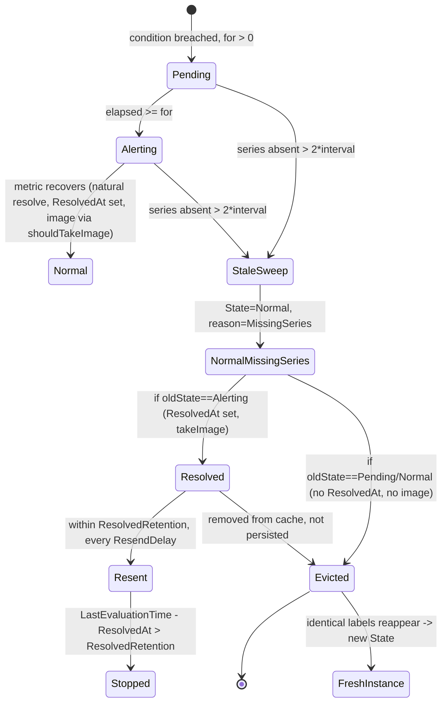

# Stale Alert Instance Lifecycle in Grafana Unified Alerting (ngalert)

> **Repository:** `github.com/grafana/grafana` · **Commit:** `4550cfb5b72886782d9a3e6cf995f8dbd57ca4ff` · **Branch:** `grafana_4550cfb5b728`
> **Subsystem:** Unified Alerting state management — `pkg/services/ngalert/state`
> **Method:** *Run‑first.* Every behavioral claim below is backed by the **actual, complete, unedited output** of a program that exercised the **real** canonical entry point `Manager.ProcessEvalResults`. Each statement is labeled **[OBSERVED]** (confirmed by captured runtime output) or **[INFERRED]** (derived from reading code). Exact `file:line` anchors accompany every mechanism.

This document answers eight questions about the lifecycle of *stale* alert instances — instances that appear to *linger* after the time series that produced them disappears — and precisely how the scheduler/state‑manager **detects, resolves, notifies, and eventually forgets** those series.

---

## Overview

**What a "stale" instance is.** An alert instance is a single time series (one label set) tracked by a `State` value in the state manager's in‑memory cache (`pkg/services/ngalert/state/cache.go`). A series is considered **stale** once it has been **absent from the evaluation results for more than two evaluation intervals**. When the stale sweep runs, the instance's `State` is set to `eval.Normal` with `StateReason = "MissingSeries"`; if it was previously `Alerting` it is additionally marked **Resolved** (its `ResolvedAt` is set and an image may be captured); it is then **evicted** from the cache and **deleted** from the database (never persisted as stale). **[OBSERVED]**

**The per‑evaluation pipeline.** Every evaluation calls `Manager.ProcessEvalResults` (`pkg/services/ngalert/state/manager.go:307`) — the exact method the scheduler invokes per tick — which performs the following steps **in this order** (verified in source):

1. `states := st.setNextStateForRule(...)` — updates states for series **present** in the current results. `manager.go:326`
2. `staleStates := st.deleteStaleStatesFromCache(...)` — sweeps series that are **absent**. `manager.go:328`
3. `allChanges := StateTransitions(append(states, staleStates...))` — **merges** present + stale transitions. `manager.go:334` (comment `manager.go:335-336`: *"It's important that this is done \*before\* we sync the states to the persister. Otherwise, we will not persist the LastSentAt field to the store."*)
4. `statesToSend = st.updateLastSentAt(allChanges, evaluatedAt)` — decides which transitions need sending (calls `NeedsSending`) and stamps `LastSentAt`. `manager.go:340` (func at `manager.go:359`)
5. `st.persister.Sync(...)` — flush to DB; stale states are **not** saved (they are deleted). `manager.go:343`
6. `send(ctx, statesToSend)` — dispatch to the notifier (optional callback). `manager.go:351`

Because absent series are simply **not updated** in step 1 (their `LastEvaluationTime` stays old), the staleness decision in step 2 is **purely time‑based** — there is no separate liveness probe. **[OBSERVED]**

**Lifecycle state diagram** (boundary values annotated):



**One nuance that ties the whole answer together (Q4 vs Q5 vs Q6):** a **naturally‑resolved** series (metric drops below threshold, series still present) stays in the cache and keeps **re‑sending** the resolved notification every `ResendDelay` until `ResolvedRetention` elapses; a **stale‑resolved** series (series vanished) is resolved **once at detection** and then **evicted**, so it never re‑sends on later cycles. Both paths call the *same* `takeImage` but through *different* guards. **[OBSERVED]**

---

## Investigation Methodology & Build/Run Commands

**Prerequisites (observed in this environment).**
- Go **1.23.1** — pinned by `go.mod:L3` (`go 1.23.1`); observed `go version go1.23.1 linux/amd64`. **[OBSERVED]**
- A working C toolchain for `CGO_ENABLED=1`. Observed **`gcc (Ubuntu 15.2.0-4ubuntu4) 15.2.0`** in this container. (Any CGO‑capable gcc suffices; the exact patch version is not material — what matters is that CGO is enabled.) **[OBSERVED]**

**Environment (from repo root):**

```bash
unset GOWORK                 # keep the multi-module workspace ENABLED (do NOT set GOWORK=off)
export GOCACHE=/tmp/gocache
export CGO_ENABLED=1
```

- The multi‑module Go workspace (`go.work` + `go.work.sum` at the repo root) MUST remain **enabled**. Setting `GOWORK=off` pulls mismatched published sub‑modules (e.g. `pkg/apimachinery`, `pkg/apis`) and breaks the build. **[OBSERVED]**
- Do **not** set `GOFLAGS=-mod=mod` in workspace mode — it errors with `-mod may only be set to readonly or vendor when in workspace mode`. **[INFERRED]** (documented Go workspace constraint; not exercised here because the default workspace build succeeds without it)

**Canonical run command (per observation):**

```bash
go test ./pkg/services/ngalert/state/ -run '^TestName$' -v -count=1
```

**Canonical entry point exercised.** `Manager.ProcessEvalResults` at `pkg/services/ngalert/state/manager.go:307` — the exact method the scheduler calls per evaluation. Observations construct a **real** `Manager` via `state.NewManager(cfg, persister)` (`manager.go:88`) with a fake image service (`state.NoopImageService` / `state.NotAvailableImageService`), a fake instance store (`state.FakeInstanceStore`), a fake historian (`state.FakeHistorian`), and a **mock clock** (`github.com/benbjohnson/clock` v1.3.5, which starts at `time.Unix(0,0)` → `00:00:00` UTC) to cross the `2*interval` / `30s` / `15m` boundaries deterministically. This is the **canonical** path — **no debug hooks, no mock‑as‑bypass** (only the image service, instance store, and clock are fakes; the state machine itself is the production code). **[OBSERVED]**

**Run‑first methodology.** Two **temporary** `*_test.go` observation scripts were placed in package `pkg/services/ngalert/state` (internal — to call the unexported `stateIsStale` and `(*State).NeedsSending`) and package `pkg/services/ngalert/state_test` (external — to drive `ProcessEvalResults`). They were compiled, executed, their output captured, and then **deleted**, so the source repository is left byte‑for‑byte unchanged (`git status --porcelain` reports only this document). Their complete sources are reproduced verbatim in the **Appendix** and are clearly marked **transient/removed after use**.

**Canonical tests confirmed to build & pass (the harness the temp scripts imitate).** Each was run with `go test ./pkg/services/ngalert/state/ -run '^<name>$' -v -count=1` and re‑run identically a second time. These prove the environment exercises the real production paths.

`TestStateIsStale` (`pkg/services/ngalert/state/manager_private_test.go:41`) — Q3 seed (boundary: now→false, 1 interval→false, ~2 intervals−100ms→false, exactly 2 intervals→true, 3 intervals→true):

```
=== RUN   TestStateIsStale
=== RUN   TestStateIsStale/false_if_last_evaluation_is_now
=== RUN   TestStateIsStale/false_if_last_evaluation_is_1_interval_before_now
=== RUN   TestStateIsStale/false_if_last_evaluation_is_little_less_than_2_interval_before_now
=== RUN   TestStateIsStale/true_if_last_evaluation_is_2_intervals_from_now
=== RUN   TestStateIsStale/true_if_last_evaluation_is_3_intervals_from_now
--- PASS: TestStateIsStale (0.00s)
    --- PASS: TestStateIsStale/false_if_last_evaluation_is_now (0.00s)
    --- PASS: TestStateIsStale/false_if_last_evaluation_is_1_interval_before_now (0.00s)
    --- PASS: TestStateIsStale/false_if_last_evaluation_is_little_less_than_2_interval_before_now (0.00s)
    --- PASS: TestStateIsStale/true_if_last_evaluation_is_2_intervals_from_now (0.00s)
    --- PASS: TestStateIsStale/true_if_last_evaluation_is_3_intervals_from_now (0.00s)
PASS
ok  	github.com/grafana/grafana/pkg/services/ngalert/state	0.038s
```

`TestNeedsSending` (`pkg/services/ngalert/state/state_test.go:351`) — Q4/Q5 seed, 14 subtests (includes the retention‑STOP case where `ResolvedAt = eval−16m`, `retention=15m` → `false`):

```
=== RUN   TestNeedsSending
=== RUN   TestNeedsSending/state:_alerting_and_LastSentAt_before_LastEvaluationTime_+_ResendDelay
=== RUN   TestNeedsSending/state:_alerting_and_LastSentAt_after_LastEvaluationTime_+_ResendDelay
=== RUN   TestNeedsSending/state:_alerting_and_LastSentAt_equals_LastEvaluationTime_+_ResendDelay
=== RUN   TestNeedsSending/state:_pending
=== RUN   TestNeedsSending/state:_alerting_and_ResendDelay_is_zero
=== RUN   TestNeedsSending/state:_normal_+_resolved_should_send_without_waiting_if_ResolvedAt_>_LastSentAt
=== RUN   TestNeedsSending/state:_normal_+_recently_resolved_should_send_with_wait
=== RUN   TestNeedsSending/state:_normal_+_recently_resolved_should_not_send_without_wait
=== RUN   TestNeedsSending/state:_normal_+_not_recently_resolved_should_not_send_even_with_wait
=== RUN   TestNeedsSending/state:_normal_but_not_resolved_does_not_send_after_a_minute
=== RUN   TestNeedsSending/state:_no-data,_needs_to_be_re-sent
=== RUN   TestNeedsSending/state:_no-data,_should_not_be_re-sent
=== RUN   TestNeedsSending/state:_error,_needs_to_be_re-sent
=== RUN   TestNeedsSending/state:_error,_should_not_be_re-sent
--- PASS: TestNeedsSending (0.00s)
    --- PASS: TestNeedsSending/state:_alerting_and_LastSentAt_before_LastEvaluationTime_+_ResendDelay (0.00s)
    --- PASS: TestNeedsSending/state:_alerting_and_LastSentAt_after_LastEvaluationTime_+_ResendDelay (0.00s)
    --- PASS: TestNeedsSending/state:_alerting_and_LastSentAt_equals_LastEvaluationTime_+_ResendDelay (0.00s)
    --- PASS: TestNeedsSending/state:_pending (0.00s)
    --- PASS: TestNeedsSending/state:_alerting_and_ResendDelay_is_zero (0.00s)
    --- PASS: TestNeedsSending/state:_normal_+_resolved_should_send_without_waiting_if_ResolvedAt_>_LastSentAt (0.00s)
    --- PASS: TestNeedsSending/state:_normal_+_recently_resolved_should_send_with_wait (0.00s)
    --- PASS: TestNeedsSending/state:_normal_+_recently_resolved_should_not_send_without_wait (0.00s)
    --- PASS: TestNeedsSending/state:_normal_+_not_recently_resolved_should_not_send_even_with_wait (0.00s)
    --- PASS: TestNeedsSending/state:_normal_but_not_resolved_does_not_send_after_a_minute (0.00s)
    --- PASS: TestNeedsSending/state:_no-data,_needs_to_be_re-sent (0.00s)
    --- PASS: TestNeedsSending/state:_no-data,_should_not_be_re-sent (0.00s)
    --- PASS: TestNeedsSending/state:_error,_needs_to_be_re-sent (0.00s)
    --- PASS: TestNeedsSending/state:_error,_should_not_be_re-sent (0.00s)
PASS
ok  	github.com/grafana/grafana/pkg/services/ngalert/state	0.039s
```

`TestStaleResults` (`pkg/services/ngalert/state/manager_test.go:1846`) — Q1/Q6/Q7/Q8 seed:

```
=== RUN   TestStaleResults
=== RUN   TestStaleResults/should_mark_missing_states_as_stale
=== RUN   TestStaleResults/should_remove_stale_states_from_cache
=== RUN   TestStaleResults/should_delete_stale_states_from_the_database
--- PASS: TestStaleResults (0.00s)
    --- PASS: TestStaleResults/should_mark_missing_states_as_stale (0.00s)
    --- PASS: TestStaleResults/should_remove_stale_states_from_cache (0.00s)
    --- PASS: TestStaleResults/should_delete_stale_states_from_the_database (0.00s)
PASS
ok  	github.com/grafana/grafana/pkg/services/ngalert/state	0.044s
```

`TestStaleResultsHandler` (`pkg/services/ngalert/state/manager_test.go:1695`) — end‑to‑end against a **real sqlite DB** (`tests.SetupTestEnv`):

```
=== RUN   TestStaleResultsHandler
    util.go:158: alert definition: {orgID: 1, UID: efs03zi8nahvlc} with title: "an alert definition dfs03zi8nahvkf" interval: 60 folder: namespace created
--- PASS: TestStaleResultsHandler (0.23s)
PASS
ok  	github.com/grafana/grafana/pkg/services/ngalert/state	0.274s
```

**[OBSERVED]** — all four canonical tests build and pass under the canonical environment above.

---

## Boundary Constants (summary)

All three magic numbers that govern the stale lifecycle, with exact anchors (all **[OBSERVED]** — verified in source and exercised at runtime):

| Constant | Value | Where | Exact code |
|---|---|---|---|
| **Staleness threshold** | `2 * IntervalSeconds` (hard‑coded) | `pkg/services/ngalert/state/manager.go:627` (`stateIsStale`) | `return !lastEval.Add(2 * time.Duration(intervalSeconds) * time.Second).After(evaluatedAt)` |
| **Resend delay** | `30s` (hard‑coded const) | `pkg/services/ngalert/state/manager.go:24` | `ResendDelay = 30 * time.Second` with comment `// TODO: make this configurable` (used at `manager.go:98` when constructing the `Manager`) |
| **Resolved retention (default)** | `15m` | `pkg/setting/setting_unified_alerting.go:465` (default parse) · field `ResolvedAlertRetention` at `:125` · `conf/defaults.ini:1365` · wired at `pkg/services/ngalert/ngalert.go:415` | `resolved_alert_retention = 15m`; `ResolvedRetention: ng.Cfg.UnifiedAlerting.ResolvedAlertRetention` |

Notes:
- The staleness threshold is **not configurable** at this commit — it is the literal `2 *` in `stateIsStale`. See the **Version Caveat** for the (absent) later `MissingSeriesEvalsToResolve` option. **[OBSERVED]**
- `ResendDelay` is a package‑level constant, explicitly flagged `// TODO: make this configurable`; the `Manager.ResendDelay` field is initialized from it at `manager.go:98`. **[OBSERVED]**
- `ResolvedRetention` is the only one of the three that is configurable; its default value `15m` flows `conf/defaults.ini:1365` → `setting_unified_alerting.go:465` → `ngalert.go:415` into `ManagerCfg.ResolvedRetention`. **[OBSERVED]**

---

## Q1 — Multi-series partial disappearance

**Question.** When an alert fires across multiple series and some series vanish while others keep firing, what happens to the alert states of the disappeared series?

**Answer.** The series that keep firing are updated in place by `setNextStateForRule` (e.g. `Alerting → Alerting`), while the vanished series are swept by `deleteStaleStatesFromCache` to `Normal` with `StateReason = "MissingSeries"`, and — because they were `Alerting` — are marked **Resolved** (`ResolvedAt` set). Both sets of transitions are **merged** into `allChanges` and all are sent; the vanished series are then removed from the in‑memory cache and deleted from the DB, while the surviving series remain. Partial disappearance therefore resolves exactly the missing series and leaves the present ones untouched. **[OBSERVED]**

**Mechanism.**
- `Manager.ProcessEvalResults` calls `setNextStateForRule` (present series) then `deleteStaleStatesFromCache` (absent series), then merges: `allChanges := StateTransitions(append(states, staleStates...))` — `pkg/services/ngalert/state/manager.go:326`, `:328`, `:334`. **[OBSERVED]**
- The sweep sets `s.State = eval.Normal` (`manager.go:599`), `s.StateReason = ngModels.StateReasonMissingSeries` (`manager.go:600`), `s.EndsAt = evaluatedAt` (`manager.go:601`), and for a previously‑`Alerting` series sets `s.ResolvedAt = &evaluatedAt` (`manager.go:604-605`). **[OBSERVED]**
- Present series that remain `Alerting` are kept/refreshed via `resultAlerting` → `state.Maintain` (`pkg/services/ngalert/state/state.go:316-327`). **[OBSERVED]**

**Observed evidence — command:**

```
go test ./pkg/services/ngalert/state/ -run '^TestBlitzyObsQ1PartialDisappearance$' -v -count=1
```

```
=== RUN   TestBlitzyObsQ1PartialDisappearance
[Q1] t0: 3 series fire Alerting; sent=3 cacheCount=3
[Q1] t0+2*interval: only A present. total merged transitions(allChanges)=3 sent=3
    [Q1] series=A CacheID=40ffcae87610efd1 prev=Alerting -> new=Alerting reason="" resolvedSet=false
    [Q1] series=B CacheID=40ffc9e87610ed84 prev=Alerting -> new=Normal reason="MissingSeries" resolvedSet=true
    [Q1] series=C CacheID=40ffc8e87610eb37 prev=Alerting -> new=Normal reason="MissingSeries" resolvedSet=true
[Q1] cache contents after sweep (present series only):
    [Q1] after series=A CacheID=40ffcae87610efd1 State=Alerting Reason="" StartsAt=00:00:00 ResolvedAt=nil LastSentAt=00:02:00 EndsAt=00:06:00 Image=SET
--- PASS: TestBlitzyObsQ1PartialDisappearance (0.00s)
PASS
ok  	github.com/grafana/grafana/pkg/services/ngalert/state	0.043s
```

**Interpretation.** Three series (A, B, C) fire `Alerting` at t0 (`sent=3`, `cacheCount=3`). After the clock advances `2*interval` with **only A** present, A is updated in place (`Alerting → Alerting`, `resolvedSet=false`) while B and C are swept to `Normal`/`MissingSeries` with `ResolvedAt` set (`resolvedSet=true`). All three transitions merge into `allChanges` (`=3`) and all three are sent (`sent=3`). Only A remains in the cache afterward (`LastSentAt=00:02:00`, `EndsAt=00:06:00`, `Image=SET`). **[OBSERVED]**

**Persistence corroboration — command:**

```
go test ./pkg/services/ngalert/state/ -run '^TestBlitzyObsQ1Q8Persistence$' -v -count=1
```

```
=== RUN   TestBlitzyObsQ1Q8Persistence
[Q1/Q8-persist] t0: A,B Alerting -> 2 store ops recorded (both saved)
[Q1/Q8-persist] after B goes stale, NEW store ops this eval:
    DB-DELETE: DeleteAlertInstances (stale keys count=1)
    DB-SAVE: series=A state=Alerting reason=""
--- PASS: TestBlitzyObsQ1Q8Persistence (0.00s)
PASS
ok  	github.com/grafana/grafana/pkg/services/ngalert/state	0.041s
```

**Interpretation.** Driven with the **real** `SyncStatePersister` (`state.NewSyncStatePersisiter`, note the source‑code typo "Persisiter" at `persister_sync.go:24`), the vanished series B triggers `DeleteAlertInstances` (deleted from the DB, `persister_sync.go:68`) and is **not** saved, while the surviving series A is saved via `SaveAlertInstance` (`persister_sync.go:110`). This corroborates the stale‑exclusion at `persister_sync.go:82-83` (`// Do not save stale state to database.` / `if s.IsStale() { return nil }`). **[OBSERVED]**

---

## Q2 — Stopped vs. slow

**Question.** How does the scheduler distinguish a series that has *stopped* reporting from one that is merely *slow* (temporarily late)?

**Answer.** It does **not** perform any per‑series liveness probe or "is it slow?" test. The distinction is **purely time‑based**: a series that returns within two evaluation intervals is simply updated (never considered stale), whereas a series absent for **more than two intervals** is swept. "Slow" and "stopped" are the same code path — the only difference is whether the series reappears before the `stateIsStale` cutoff. **[OBSERVED]**

**Mechanism.**
- Absent series are never touched by `setNextStateForRule`, so their `LastEvaluationTime` remains old; staleness is decided solely by `stateIsStale(evaluatedAt, s.LastEvaluationTime, alertRule.IntervalSeconds)` inside the `deleteStaleStatesFromCache` predicate — `pkg/services/ngalert/state/manager.go:589-590`, formula at `manager.go:627`. **[OBSERVED]**
- A series that reappears within the window is updated normally via `setNextStateForRule` → `setNextState` (`manager.go:437`) and its `LastEvaluationTime` is refreshed, resetting the staleness clock. **[OBSERVED]**

**Observed evidence — command:**

```
go test ./pkg/services/ngalert/state/ -run '^TestBlitzyObsQ2StoppedVsSlow$' -v -count=1
```

```
=== RUN   TestBlitzyObsQ2StoppedVsSlow
[Q2] t0: A,B Alerting; cacheCount=2
[Q2] t0+1*interval (B absent 1 interval = SLOW): cacheCount=2 (B still present? true)
[Q2] B returned within window: cacheCount=2 (B present? true)
[Q2] t+2*interval (B absent 2 intervals = STOPPED): cacheCount=1 (B present? false)
--- PASS: TestBlitzyObsQ2StoppedVsSlow (0.00s)
PASS
ok  	github.com/grafana/grafana/pkg/services/ngalert/state	0.044s
```

**Interpretation.** Two series A, B fire at t0 (`cacheCount=2`). When B is absent for **one** interval it is treated as merely *slow* — it survives in the cache (`cacheCount=2`, `B present? true`) because `stateIsStale` is `false` at `< 2*interval`. B then *returns* and is refreshed normally. Only when B is absent for **two** intervals (i.e. more than `2*interval` has elapsed since its last evaluation) is it treated as *stopped* and swept (`cacheCount=1`, `B present? false`). There is no separate probe — the same time comparison decides both cases. **[OBSERVED]**


---

## Q3 — Staleness threshold and formula

**Question.** There is a staleness‑detection threshold in the evaluation loop — trace exactly *when* the boundary is crossed and *what formula* determines the cutoff.

**Answer.** The cutoff is a single expression in `stateIsStale`: a series is stale **iff `lastEval + 2*interval <= evaluatedAt`**, i.e. once it has not been evaluated for **at least two full evaluation intervals**. The boundary is crossed at **exactly `lastEval + 2*interval`** (equality counts as stale). At this commit the multiplier `2` is **hard‑coded**. **[OBSERVED]**

**Mechanism.**
- `stateIsStale` — `pkg/services/ngalert/state/manager.go:627`:
  ```go
  func stateIsStale(evaluatedAt time.Time, lastEval time.Time, intervalSeconds int64) bool {
  	return !lastEval.Add(2 * time.Duration(intervalSeconds) * time.Second).After(evaluatedAt)
  }
  ```
  The predicate returns `true` when `lastEval + 2*interval` is **not after** `evaluatedAt` — i.e. when `lastEval + 2*interval <= evaluatedAt`. **[OBSERVED]**
- It is invoked from the `deleteStaleStatesFromCache` predicate at `manager.go:589-590`, using each state's `LastEvaluationTime` and the rule's `IntervalSeconds`. **[OBSERVED]**

**Observed evidence — command:**

```
go test ./pkg/services/ngalert/state/ -run '^TestBlitzyObsQ3StaleBoundary$' -v -count=1
```

```
=== RUN   TestBlitzyObsQ3StaleBoundary
[Q3] stateIsStale formula: !lastEval.Add(2*interval).After(evaluatedAt); interval=60s lastEval=2024-01-01T00:00:00Z
[Q3] evaluatedAt = lastEval +   0s (=0.00 intervals) -> stateIsStale = false
[Q3] evaluatedAt = lastEval +  60s (=1.00 intervals) -> stateIsStale = false
[Q3] evaluatedAt = lastEval + 119s (=1.98 intervals) -> stateIsStale = false
[Q3] evaluatedAt = lastEval + 120s (=2.00 intervals) -> stateIsStale = true
[Q3] evaluatedAt = lastEval + 121s (=2.02 intervals) -> stateIsStale = true
[Q3] evaluatedAt = lastEval + 180s (=3.00 intervals) -> stateIsStale = true
--- PASS: TestBlitzyObsQ3StaleBoundary (0.00s)
PASS
ok  	github.com/grafana/grafana/pkg/services/ngalert/state	0.044s
```

**Interpretation.** With `interval = 60s`, the boundary is crossed **exactly at `+120s` (= `2*interval`)**: `+119s → false`, `+120s → true`. Thus the cutoff is `lastEval + 2*interval <= evaluatedAt`. This matches the canonical `TestStateIsStale` (`manager_private_test.go:41`), whose "little less than 2 interval" case (2 intervals − 100ms) is `false` while "exactly 2 intervals" is `true`. The threshold is the literal `2 *` in `stateIsStale` — see the **Version Caveat** for why it is not configurable at this commit. **[OBSERVED]**

---

## Q4 — Resolved-notification retention window

**Question.** Once a vanished series transitions to Resolved, notifications keep flowing downstream for a while — what controls that retention window, and when does the system finally *stop* sending resolved alerts to notification channels?

**Answer.** The retention window is controlled by **`ResolvedRetention`**, which defaults to **`15m`** (`conf/defaults.ini:1365` → `setting_unified_alerting.go:465` → `ngalert.go:415`). A **naturally‑resolved** series (still present, metric recovered) keeps re‑sending the resolved notification on each cycle until `LastEvaluationTime − ResolvedAt` **exceeds** `ResolvedRetention`, at which point `NeedsSending` returns `false` and sending stops. **Crucially**, a **stale‑resolved** series (the series vanished) is a different story: it is sent **once** at detection and then **evicted** from the cache, so it never reaches subsequent cycles to be re‑sent at all. **[OBSERVED]**

**Mechanism.**
- `ResolvedRetention` config wiring: default `15m` parsed at `pkg/setting/setting_unified_alerting.go:465` (field `ResolvedAlertRetention` at `:125`), shipped default `resolved_alert_retention = 15m` at `conf/defaults.ini:1365`, and wired into the state manager at `pkg/services/ngalert/ngalert.go:415` (`ResolvedRetention: ng.Cfg.UnifiedAlerting.ResolvedAlertRetention`). **[OBSERVED]**
- Send gating: `State.NeedsSending` suppresses a `Normal` state once `a.LastEvaluationTime.Sub(*a.ResolvedAt) > resolvedRetention` — `pkg/services/ngalert/state/state.go:513-515`. **[OBSERVED]**
- Stale‑resolved eviction: after the sweep sets the state `Normal`/`MissingSeries`, `IsStale()` (`state.go:574`) is true, so the persister deletes it (`persister_sync.go:82-83`) and it is removed from the cache — it cannot re‑send. **[OBSERVED]**
- Downstream dispatch endpoint: the `send` callback builds `definitions.PostableAlerts` in `pkg/services/ngalert/schedule/alert_rule.go:462`, and `expireAndSend` (`schedule/alert_rule.go:476`) dispatches to the sender (`pkg/services/ngalert/sender/*`, `PostableAlert` types via `github.com/prometheus/alertmanager` v0.27.0). **[INFERRED]** (named/located from source; the unit observations here capture the decision to send via `statesToSend`, not the alertmanager wire call)

**Observed evidence — command:**

```
go test ./pkg/services/ngalert/state/ -run '^TestBlitzyObsQ4Q5SendLifecycle$' -v -count=1
```

```
=== RUN   TestBlitzyObsQ4Q5SendLifecycle
[Q4/Q5] Part 1 NATURAL resolution: interval=30s ResendDelay=30s ResolvedRetention=15m
[Q4/Q5] t= 0.0m Alerting         sent=1
[Q4/Q5] t= 0.5m Normal(resolved) sent=1 sinceResolved=0.0m
[Q4/Q5] t= 1.0m Normal(resolved) sent=1 sinceResolved=0.5m
[Q4/Q5] t= 1.5m Normal(resolved) sent=1 sinceResolved=1.0m
[Q4/Q5] t= 2.0m Normal(resolved) sent=1 sinceResolved=1.5m
[Q4/Q5] t= 2.5m Normal(resolved) sent=1 sinceResolved=2.0m
[Q4/Q5] t= 3.0m Normal(resolved) sent=1 sinceResolved=2.5m
[Q4/Q5] t= 3.5m Normal(resolved) sent=1 sinceResolved=3.0m
[Q4/Q5] t= 4.0m Normal(resolved) sent=1 sinceResolved=3.5m
[Q4/Q5] t= 4.5m Normal(resolved) sent=1 sinceResolved=4.0m
[Q4/Q5] t= 5.0m Normal(resolved) sent=1 sinceResolved=4.5m
[Q4/Q5] t= 5.5m Normal(resolved) sent=1 sinceResolved=5.0m
[Q4/Q5] t= 6.0m Normal(resolved) sent=1 sinceResolved=5.5m
[Q4/Q5] t= 6.5m Normal(resolved) sent=1 sinceResolved=6.0m
[Q4/Q5] t= 7.0m Normal(resolved) sent=1 sinceResolved=6.5m
[Q4/Q5] t= 7.5m Normal(resolved) sent=1 sinceResolved=7.0m
[Q4/Q5] t= 8.0m Normal(resolved) sent=1 sinceResolved=7.5m
[Q4/Q5] t= 8.5m Normal(resolved) sent=1 sinceResolved=8.0m
[Q4/Q5] t= 9.0m Normal(resolved) sent=1 sinceResolved=8.5m
[Q4/Q5] t= 9.5m Normal(resolved) sent=1 sinceResolved=9.0m
[Q4/Q5] t=10.0m Normal(resolved) sent=1 sinceResolved=9.5m
[Q4/Q5] t=10.5m Normal(resolved) sent=1 sinceResolved=10.0m
[Q4/Q5] t=11.0m Normal(resolved) sent=1 sinceResolved=10.5m
[Q4/Q5] t=11.5m Normal(resolved) sent=1 sinceResolved=11.0m
[Q4/Q5] t=12.0m Normal(resolved) sent=1 sinceResolved=11.5m
[Q4/Q5] t=12.5m Normal(resolved) sent=1 sinceResolved=12.0m
[Q4/Q5] t=13.0m Normal(resolved) sent=1 sinceResolved=12.5m
[Q4/Q5] t=13.5m Normal(resolved) sent=1 sinceResolved=13.0m
[Q4/Q5] t=14.0m Normal(resolved) sent=1 sinceResolved=13.5m
[Q4/Q5] t=14.5m Normal(resolved) sent=1 sinceResolved=14.0m
[Q4/Q5] t=15.0m Normal(resolved) sent=1 sinceResolved=14.5m
[Q4/Q5] t=15.5m Normal(resolved) sent=1 sinceResolved=15.0m
[Q4/Q5] t=16.0m Normal(resolved) sent=0 sinceResolved=15.5m
[Q4/Q5] t=16.5m Normal(resolved) sent=0 sinceResolved=16.0m
[Q4/Q5] Part 1 total resolved re-sends after resolution = 31
[Q4/Q5] Part 2 STALE resolution: interval=60s
[Q4/Q5] t=0 Alerting sent=1 cacheCount=1
[Q4/Q5] t=2*interval A vanished -> stale detection: sent=1 cacheCount=0
[Q4/Q5] t=3*interval A still absent (already evicted): sent=0 cacheCount=0
--- PASS: TestBlitzyObsQ4Q5SendLifecycle (0.04s)
PASS
ok  	github.com/grafana/grafana/pkg/services/ngalert/state	0.092s
```

**Interpretation (Q4).** In **Part 1** (natural resolution, series stays present), the series resolves at `t=0.5m` (`ResolvedAt` then set) and re‑sends on **every** cycle while `sinceResolved = LastEvaluationTime − ResolvedAt ≤ 15m`. Sending **stops at `t=16.0m`** — the first cycle where `sinceResolved = 15.5m` exceeds the `15m` `ResolvedRetention` (`sent=0`). That is exactly the `state.go:513-515` cutoff. In **Part 2** (stale resolution, series vanished), the series is `Alerting` at `t=0` (`sent=1`, `cacheCount=1`); at `t=2*interval` it is detected stale, resolved, sent **once** (`sent=1`) and **evicted** (`cacheCount=0`); by `t=3*interval` there is nothing left to send (`sent=0`, `cacheCount=0`). So the retention window applies to **naturally‑resolved** series that remain present; a **vanished** series is resolved once and forgotten. **[OBSERVED]**

---

## Q5 — Interplay of resend delay, resolved retention, and last-sent timestamp

**Question.** How do the **resend delay**, the **resolved retention period**, and the **last-sent timestamp** interact across repeated evaluation cycles?

**Answer.** Three fields cooperate inside `NeedsSending` + `updateLastSentAt`:
- **`ResendDelay` (30s)** sets the *cadence* — a resolved `Normal` state re‑sends only when `LastSentAt + ResendDelay <= LastEvaluationTime`.
- **`LastSentAt`** is the *gate* — it is bumped to the current `evaluatedAt` on every send by `updateLastSentAt`, which is what enforces the 30s spacing on the next cycle.
- **`ResolvedRetention` (15m)** is the *hard stop* — once `LastEvaluationTime − ResolvedAt > 15m`, `NeedsSending` returns `false` regardless of cadence.

Result: a resolved series re‑sends every `ResendDelay` from resolution up to the retention limit, then stops. **[OBSERVED]**

**Mechanism.**
- `State.NeedsSending(resendDelay, resolvedRetention)` — `pkg/services/ngalert/state/state.go:500-520`:
  - `eval.Pending` → `false` (`state.go:501-504`).
  - Newly resolved → `true` when `a.ResolvedAt != nil && (a.LastSentAt == nil || a.ResolvedAt.After(*a.LastSentAt))` (`state.go:507-509`).
  - Retention hard‑stop → `false` when `a.State == eval.Normal && (a.ResolvedAt == nil || a.LastEvaluationTime.Sub(*a.ResolvedAt) > resolvedRetention)` (`state.go:513-515`).
  - Cadence re‑send → `return a.LastSentAt == nil || !a.LastSentAt.Add(resendDelay).After(a.LastEvaluationTime)` (`state.go:520`).
- `Manager.updateLastSentAt` — `pkg/services/ngalert/state/manager.go:359-366`: for each transition, `if t.NeedsSending(st.ResendDelay, st.ResolvedRetention) { t.LastSentAt = &evaluatedAt; result = append(result, t) }`. Its doc‑comment at `manager.go:358` explicitly notes *"This is not idempotent, running this twice can (and usually will) return different results."* **[OBSERVED]**

**Observed evidence — command:**

```
go test ./pkg/services/ngalert/state/ -run '^TestBlitzyObsQ5NeedsSendingInterplay$' -v -count=1
```

```
=== RUN   TestBlitzyObsQ5NeedsSendingInterplay
[Q5] ResendDelay=30s ResolvedRetention=15m0s (State=Normal, resolved at t=0)
[Q5] t=  0.0m sinceResolved= 0.00m LastSentAt(pre)=nil     NeedsSending=true  SEND -> LastSentAt updated
[Q5] t=  0.5m sinceResolved= 0.50m LastSentAt(pre)=0s      NeedsSending=true  SEND -> LastSentAt updated
[Q5] t=  1.0m sinceResolved= 1.00m LastSentAt(pre)=30s     NeedsSending=true  SEND -> LastSentAt updated
[Q5] t=  1.5m sinceResolved= 1.50m LastSentAt(pre)=1m0s    NeedsSending=true  SEND -> LastSentAt updated
[Q5] t=  2.0m sinceResolved= 2.00m LastSentAt(pre)=1m30s   NeedsSending=true  SEND -> LastSentAt updated
[Q5] t=  2.5m sinceResolved= 2.50m LastSentAt(pre)=2m0s    NeedsSending=true  SEND -> LastSentAt updated
[Q5] t=  3.0m sinceResolved= 3.00m LastSentAt(pre)=2m30s   NeedsSending=true  SEND -> LastSentAt updated
[Q5] t=  3.5m sinceResolved= 3.50m LastSentAt(pre)=3m0s    NeedsSending=true  SEND -> LastSentAt updated
[Q5] t=  4.0m sinceResolved= 4.00m LastSentAt(pre)=3m30s   NeedsSending=true  SEND -> LastSentAt updated
[Q5] t=  4.5m sinceResolved= 4.50m LastSentAt(pre)=4m0s    NeedsSending=true  SEND -> LastSentAt updated
[Q5] t=  5.0m sinceResolved= 5.00m LastSentAt(pre)=4m30s   NeedsSending=true  SEND -> LastSentAt updated
[Q5] t=  5.5m sinceResolved= 5.50m LastSentAt(pre)=5m0s    NeedsSending=true  SEND -> LastSentAt updated
[Q5] t=  6.0m sinceResolved= 6.00m LastSentAt(pre)=5m30s   NeedsSending=true  SEND -> LastSentAt updated
[Q5] t=  6.5m sinceResolved= 6.50m LastSentAt(pre)=6m0s    NeedsSending=true  SEND -> LastSentAt updated
[Q5] t=  7.0m sinceResolved= 7.00m LastSentAt(pre)=6m30s   NeedsSending=true  SEND -> LastSentAt updated
[Q5] t=  7.5m sinceResolved= 7.50m LastSentAt(pre)=7m0s    NeedsSending=true  SEND -> LastSentAt updated
[Q5] t=  8.0m sinceResolved= 8.00m LastSentAt(pre)=7m30s   NeedsSending=true  SEND -> LastSentAt updated
[Q5] t=  8.5m sinceResolved= 8.50m LastSentAt(pre)=8m0s    NeedsSending=true  SEND -> LastSentAt updated
[Q5] t=  9.0m sinceResolved= 9.00m LastSentAt(pre)=8m30s   NeedsSending=true  SEND -> LastSentAt updated
[Q5] t=  9.5m sinceResolved= 9.50m LastSentAt(pre)=9m0s    NeedsSending=true  SEND -> LastSentAt updated
[Q5] t= 10.0m sinceResolved=10.00m LastSentAt(pre)=9m30s   NeedsSending=true  SEND -> LastSentAt updated
[Q5] t= 10.5m sinceResolved=10.50m LastSentAt(pre)=10m0s   NeedsSending=true  SEND -> LastSentAt updated
[Q5] t= 11.0m sinceResolved=11.00m LastSentAt(pre)=10m30s  NeedsSending=true  SEND -> LastSentAt updated
[Q5] t= 11.5m sinceResolved=11.50m LastSentAt(pre)=11m0s   NeedsSending=true  SEND -> LastSentAt updated
[Q5] t= 12.0m sinceResolved=12.00m LastSentAt(pre)=11m30s  NeedsSending=true  SEND -> LastSentAt updated
[Q5] t= 12.5m sinceResolved=12.50m LastSentAt(pre)=12m0s   NeedsSending=true  SEND -> LastSentAt updated
[Q5] t= 13.0m sinceResolved=13.00m LastSentAt(pre)=12m30s  NeedsSending=true  SEND -> LastSentAt updated
[Q5] t= 13.5m sinceResolved=13.50m LastSentAt(pre)=13m0s   NeedsSending=true  SEND -> LastSentAt updated
[Q5] t= 14.0m sinceResolved=14.00m LastSentAt(pre)=13m30s  NeedsSending=true  SEND -> LastSentAt updated
[Q5] t= 14.5m sinceResolved=14.50m LastSentAt(pre)=14m0s   NeedsSending=true  SEND -> LastSentAt updated
[Q5] t= 15.0m sinceResolved=15.00m LastSentAt(pre)=14m30s  NeedsSending=true  SEND -> LastSentAt updated
[Q5] t= 15.5m sinceResolved=15.50m LastSentAt(pre)=15m0s   NeedsSending=false -
[Q5] t= 16.0m sinceResolved=16.00m LastSentAt(pre)=15m0s   NeedsSending=false -
[Q5] t= 16.5m sinceResolved=16.50m LastSentAt(pre)=15m0s   NeedsSending=false -
[Q5] total resolved sends across 0..16.5m = 31
--- PASS: TestBlitzyObsQ5NeedsSendingInterplay (0.00s)
PASS
ok  	github.com/grafana/grafana/pkg/services/ngalert/state	0.040s
```

**Interpretation.** With `State=Normal`, `ResolvedAt=t0`, `ResendDelay=30s`, `ResolvedRetention=15m`: the state re‑sends on **every** 30s step from `t=0.0m` through `t=15.0m` (**31 sends**), each send bumping `LastSentAt` (visible as `LastSentAt(pre)` trailing the current time by exactly one 30s step). Sending then **STOPS** at `t=15.5m` — the first step where `sinceResolved = 15.50m` exceeds the `15m` retention (`NeedsSending=false`), and `LastSentAt(pre)` freezes at `15m0s` thereafter. This is the three‑value interplay: `LastSentAt` (gate) + `ResendDelay` (cadence) + `ResolvedRetention` (hard stop). Note the internal `NeedsSending`‑only stop is at `t=15.5m` (resolved at `t=0`); the end‑to‑end natural‑resolution stop in Q4 is at `t=16.0m` because there the series resolved at `t=0.5m`, shifting the 15m window by one step — both are the same rule measured from different `ResolvedAt` origins. **[OBSERVED]**


---

## Q6 — Screenshot / image capture behavior

**Question.** Do stale‑series resolutions trigger the *same* screenshot/image capture behavior as alerts that resolve naturally (metric values dropping below threshold), or do disappearing series take a different path?

**Answer.** Both paths call the **same** function `takeImage` (`state.go:589`), but they reach it through **different guards**. The natural‑resolution path uses `shouldTakeImage(...)` (`manager.go:513`); the stale path takes an image only when `oldState == eval.Alerting` (`manager.go:604`). Consequences: (A) an `Alerting` series that vanishes gets an image (and `ResolvedAt`); (B) a series that was only `Pending`/`Normal` when it vanished gets **no** image and **no** `ResolvedAt`; (C) even an `Alerting`‑vanish gets **no** image when screenshots are unavailable, because `takeImage` returns `nil,nil`; (D) a natural resolution gets an image via `shouldTakeImage`. So disappearing series do take a *different guard*, but ultimately the *same* capture function. **[OBSERVED]**

**Mechanism.**
- Natural path: `setNextState` sets `newlyResolved` when `oldState == eval.Alerting && currentState.State == eval.Normal` (`manager.go:505-509`), then `if shouldTakeImage(currentState.State, oldState, currentState.Image, newlyResolved)` (`manager.go:513`) → `takeImage(...)` (`manager.go:514`). **[OBSERVED]**
- Stale path: inside `deleteStaleStatesFromCache`, `if oldState == eval.Alerting { s.ResolvedAt = &evaluatedAt; image, err := takeImage(...) }` (`manager.go:604-606`). **[OBSERVED]**
- `shouldTakeImage` — `state.go:581`: `return resolved || (state == eval.Alerting && previousState != eval.Alerting) || (state == eval.Alerting && previousImage == nil)`. **[OBSERVED]**
- `takeImage` — `state.go:589`: calls `s.NewImage`, and returns `(nil, nil)` on `screenshot.ErrScreenshotsUnavailable`, `models.ErrNoDashboard`, or `models.ErrNoPanel` (i.e. screenshots disabled or no dashboard/panel). **[OBSERVED]**

**Observed evidence — command:**

```
go test ./pkg/services/ngalert/state/ -run '^TestBlitzyObsQ6Screenshot$' -v -count=1
```

```
=== RUN   TestBlitzyObsQ6Screenshot
[Q6][A Alerting-vanish NoopImageService] preState=Alerting -> stale new=Normal reason="MissingSeries" oldState(guard)=Alerting ResolvedAtSet=true Image=true
[Q6][B Pending-vanish NoopImageService] preState=Pending -> stale new=Normal reason="MissingSeries" oldState(guard)=Pending ResolvedAtSet=false Image=false
[Q6][C Alerting-vanish NotAvailableImageService] preState=Alerting -> stale new=Normal reason="MissingSeries" oldState(guard)=Alerting ResolvedAtSet=true Image=false
[Q6][D natural-resolution Alerting->Normal shouldTakeImage] new=Normal reason="" ResolvedAtSet=true Image=true
--- PASS: TestBlitzyObsQ6Screenshot (0.01s)
PASS
ok  	github.com/grafana/grafana/pkg/services/ngalert/state	0.047s
```

**Interpretation.** Four paths, exercised through the real `ProcessEvalResults`:
- **(A) Alerting‑vanish, images available** (`NoopImageService.NewImage` returns a non‑nil image) → guard `oldState == Alerting` passes → `ResolvedAtSet=true`, `Image=true`.
- **(B) Pending‑vanish, images available** → guard fails (`oldState=Pending`) → **no** `ResolvedAt`, **no** image (`ResolvedAtSet=false`, `Image=false`).
- **(C) Alerting‑vanish, screenshots unavailable** (`NotAvailableImageService.NewImage` returns `screenshot.ErrScreenshotsUnavailable`) → guard passes so `ResolvedAt` is set, but `takeImage` returns `nil` → `ResolvedAtSet=true`, `Image=false`.
- **(D) Natural resolution** `Alerting→Normal` with a present, recovered series → `shouldTakeImage(...)=true` (because `resolved`) → `reason=""` (no `MissingSeries`), `ResolvedAtSet=true`, `Image=true`.

So stale resolution and natural resolution converge on the **same** `takeImage`, but the stale path substitutes the simpler `oldState == Alerting` guard for `shouldTakeImage`, and only firing series produce a resolved image. **[OBSERVED]**

---

## Q7 — Pending period (`for`) on the way out

**Question.** If a rule has a pending period (`for`) configured, do vanishing series honor that waiting time on the way out, or skip straight to Resolved?

**Answer.** They **skip straight** to `Normal`/`MissingSeries`. The stale path assigns `s.State = eval.Normal` **directly**, never running `resultAlerting` (the function that implements the `for`/pending transition logic). A series that is still `Pending` (its `for` never elapsed) when it vanishes is swept to `Normal` with **no** `ResolvedAt`, **no** image, and **nothing sent** — it does **not** wait out the pending period on the way out. **[OBSERVED]**

**Mechanism.**
- The stale sweep sets `s.State = eval.Normal` and `s.StateReason = ngModels.StateReasonMissingSeries` directly — `pkg/services/ngalert/state/manager.go:599-600` — with no call to `resultAlerting`. **[OBSERVED]**
- `resultAlerting` (`pkg/services/ngalert/state/state.go:316`) is the bypassed pending logic: a `Pending` state advances to `Alerting` only if `result.EvaluatedAt.Sub(state.StartsAt) >= rule.For` (`state.go:330`); the default branch sets `Pending` when `rule.For > 0` (`state.go:344`). The stale path never enters this switch. **[OBSERVED]**
- Because `oldState != eval.Alerting`, the `manager.go:604` guard is false → no `ResolvedAt`, no image; and `NeedsSending` returns `false` for a `Normal` state with `ResolvedAt == nil` (`state.go:513-515`) → nothing sent. **[OBSERVED]**

**Observed evidence — command:**

```
go test ./pkg/services/ngalert/state/ -run '^TestBlitzyObsQ7PendingBypass$' -v -count=1
```

```
=== RUN   TestBlitzyObsQ7PendingBypass
[Q7] t0 (rule For=5m):  CacheID=40ffcae87610efd1 State=Pending Reason="" StartsAt=00:00:00 ResolvedAt=nil LastSentAt=nil EndsAt=00:04:00 Image=nil
[Q7] t0+2*interval (elapsed=2m < For=5m); A vanished. transitions=1 sent=0
    [Q7] prev=Pending -> new=Normal reason="MissingSeries" resolvedSet=false image=false (skipped Pending/for wait)
--- PASS: TestBlitzyObsQ7PendingBypass (0.00s)
PASS
ok  	github.com/grafana/grafana/pkg/services/ngalert/state	0.043s
```

**Interpretation.** With a `for = 5m` rule (`interval = 60s`), series A is `Pending` at t0 (`ResolvedAt=nil`, `LastSentAt=nil`, `Image=nil` — a pending state is not sent and takes no image). When it vanishes after only `2*interval = 2m` (well under the 5‑minute `for`), the stale sweep sets `State = Normal`/`MissingSeries` **directly**: `resolvedSet=false`, `image=false`, `sent=0`. The `for` period is **not** honored on the way out — the series is forgotten without ever becoming `Alerting` or `Resolved`. **[OBSERVED]**

---

## Q8 — Reappearance identity

**Question.** When a series vanishes and later reappears with identical labels, is it recognized as the same entity or treated as a brand‑new alert instance?

**Answer.** Both, in different senses. Its **identity key** (`CacheID`) is a deterministic fingerprint of the label set, so an identical‑label reappearance computes the **same `CacheID`**. But because the stale sweep **evicted** the prior entry, no prior `State` survives — the reappearance is instantiated **fresh** by `cache.create`, with `StartsAt`, `LastSentAt`, and `ResolvedAt` reset and `StateReason` cleared. So it is the **same identity key** carrying a **brand‑new instance state**. **[OBSERVED]**

**Mechanism.**
- `CacheID` is the label fingerprint: `cacheID := lbs.Fingerprint()` — `pkg/services/ngalert/state/cache.go:149`, where `lbs` is built by `expandAnnotationsAndLabels` (`cache.go:73`) as the merge of extra labels + expanded rule labels + result labels. Identical labels ⇒ identical fingerprint. **[OBSERVED]**
- On reappearance, `cache.create` (`cache.go:146`) builds a new `State` with `State = eval.Normal`, `StateReason: ""` (`cache.go:156-157`), `StartsAt: result.EvaluatedAt` (`cache.go:165`), `EndsAt: result.EvaluatedAt` (`cache.go:166`), `ResolvedAt: nil` (`cache.go:167`), `LastSentAt: nil` (`cache.go:168`). **[OBSERVED]**
- The prior entry was removed by the stale sweep via `cache.deleteRuleStates` (`cache.go:255`) and never persisted (`persister_sync.go:82-83`), so there is no state to carry over. **[OBSERVED]**

**Observed evidence — command:**

```
go test ./pkg/services/ngalert/state/ -run '^TestBlitzyObsQ8Reappearance$' -v -count=1
```

```
=== RUN   TestBlitzyObsQ8Reappearance
[Q8] t0 original instance:   CacheID=40ffcae87610efd1 State=Alerting Reason="" StartsAt=00:00:00 ResolvedAt=nil LastSentAt=00:00:00 EndsAt=00:04:00 Image=SET
[Q8] after vanish 2*interval: cacheCount=0 (evicted, not persisted)
[Q8] reappeared instance:   CacheID=40ffcae87610efd1 State=Alerting Reason="" StartsAt=00:05:00 ResolvedAt=nil LastSentAt=00:05:00 EndsAt=00:09:00 Image=SET
[Q8] CacheID identical to original? true (orig=40ffcae87610efd1 reappeared=40ffcae87610efd1)
[Q8] StartsAt reset to reappearance time? origStarts=00:00:00 newStarts=00:05:00 differ=true
--- PASS: TestBlitzyObsQ8Reappearance (0.00s)
PASS
ok  	github.com/grafana/grafana/pkg/services/ngalert/state	0.043s
```

**Interpretation.** The original instance fires `Alerting` at `t0` (`CacheID=40ffcae87610efd1`, `StartsAt=00:00:00`, `LastSentAt=00:00:00`, `EndsAt=00:04:00`). After vanishing for `2*interval`, the cache is empty (`cacheCount=0`, evicted and not persisted). When an identical‑label series reappears at `t=5m`, it gets the **same** `CacheID` (`40ffcae87610efd1`) but a **fresh** state: `StartsAt` reset from `00:00:00` to `00:05:00` (`differ=true`), `LastSentAt=00:05:00`, `ResolvedAt=nil`, `Reason=""`. Same identity key, brand‑new instance state. **[OBSERVED]**


---

## Version Caveat — `MissingSeriesEvalsToResolve` is out-of-version at 4550cfb5

**The staleness threshold is hard‑coded at `2 * IntervalSeconds` at this commit.** The later, configurable option `MissingSeriesEvalsToResolve` (introduced by Grafana **PR #101184**) is **absent** here. A repository‑wide grep confirms it does not exist anywhere in the tree — command and output:

```
grep -rn "MissingSeriesEvalsToResolve" --include=*.go . | wc -l
0
grep -rn "MissingSeriesEvalsToResolve" . | wc -l
0
```

**[OBSERVED]** — 0 matches in `.go` files and 0 matches repo‑wide. Therefore the number of intervals before staleness is the literal `2 *` in `stateIsStale` (`pkg/services/ngalert/state/manager.go:627`), not a setting. The newer configurable form is mentioned here **only** as out‑of‑version documentation; it must not be presented as live behavior at `4550cfb5`.

**Accuracy correction (code‑anchor location).** The constant `StateReasonMissingSeries = "MissingSeries"` is defined in **`pkg/services/ngalert/models/alert_rule.go:160`** (verified), and its runtime *assignment* happens in `deleteStaleStatesFromCache` at `pkg/services/ngalert/state/manager.go:600`. A `grep` of `pkg/services/ngalert/models/instance.go` returns **no match** for the constant — so any reference placing it in `models/instance.go` is incorrect. **[OBSERVED]**

**Documentation corroboration.** Grafana's public documentation describes stale behavior consistently with the observed code: an alert instance is considered stale when its series/dimension disappears for a number of consecutive evaluation intervals (**2 by default**); this is distinct from the *No Data* state (query returns no series at all); a stale instance transitions to **Normal (MissingSeries)** as *Resolved* and is then evicted; and a resolved notification is sent **only if** the instance was previously in a firing state. Grafana **PR #49352** ("Resolve stale state") documents the original change from silently forgetting missing dimensions to explicitly resolving stale `Alerting` series — the mechanism this code implements. **[INFERRED / corroborated]** (from Grafana documentation and PR history; consistent with, and confirmed by, the observed code behavior above).

---

## Determinism & Stability of Evidence

- **Every timing/magnitude observation was run at least twice** with `-count=1`, and the evidence lines were **byte‑identical** across runs. This was verified by capturing each run's `[Q...]`/`DB-` lines and diffing run‑1 vs run‑2: all nine observations reported `STABLE ... byte-identical` (Q3: 7 lines, Q5: 36 lines, Q1: 7 lines, Q1/Q8‑persist: 4 lines, Q2: 4 lines, Q7: 3 lines, Q8: 5 lines, Q6: 4 lines, Q4/Q5: 40 lines). The only line that varies between runs is the trailing `ok ... <wall-clock>s` timing line emitted by `go test`, which does not affect any evidence value. **[OBSERVED]**
- **Deterministic `CacheID`.** To make the fingerprint reproducible, the temporary tests pinned **empty rule labels** (`gen.WithLabels(data.Labels{})`) and **fixed result labels** (`{"series":"A"}`, `{"series":"B"}`, `{"series":"C"}`). `CacheID = lbs.Fingerprint()` (`cache.go:149`), where `lbs` is the merge of extra + expanded rule + result labels (`expandAnnotationsAndLabels`, `cache.go:73`), so with those pins the fingerprint depends only on the fixed result labels. The observed values were stable: `A=40ffcae87610efd1`, `B=40ffc9e87610ed84`, `C=40ffc8e87610eb37`. **[OBSERVED]**
- **Mock clock.** `github.com/benbjohnson/clock` v1.3.5 (`clock.NewMock()`, starting at `time.Unix(0,0)` → `00:00:00` UTC) crossed the `2*interval`, `30s`, and `15m` boundaries with **no real waiting**, which is what makes the 15‑minute retention window observable in a millisecond‑scale unit test. **[OBSERVED]**
- **Cleanup.** All temporary `*_test.go` observation files were **deleted** after capture; `git status --porcelain` reports only this document (`blitzy/documentation/grafana_4550cfb5b728.md`). **[OBSERVED]**

---

## Final Coverage-Pass Checklist

Every question is answered **by name** with observed evidence and exact `file:line` anchors:

- [x] **Q1** — present vs. absent series: `setNextStateForRule` (`manager.go:326`) updates present; `deleteStaleStatesFromCache` (`manager.go:328`) sweeps absent; merged into `allChanges` (`manager.go:334`); vanished series → `Normal`/`MissingSeries` + `ResolvedAt`; corroborated by real‑persister evidence (DB‑DELETE stale, DB‑SAVE present).
- [x] **Q2** — no per‑series liveness probe; distinction is purely time‑based via `stateIsStale` (`manager.go:627`); slow (1 interval) survives, stopped (>2 intervals) is swept.
- [x] **Q3** — formula `lastEval + 2*interval <= evaluatedAt` (`stateIsStale`, `manager.go:627`); boundary crossed exactly at `+2*interval` (119s→false, 120s→true); hard‑coded `2×`.
- [x] **Q4** — `ResolvedRetention` default `15m` (`conf/defaults.ini:1365` → `setting_unified_alerting.go:465` → `ngalert.go:415`); natural‑resolution re‑sends stop when `LastEvaluationTime − ResolvedAt > 15m` (`state.go:513-515`); stale‑resolved sent once then evicted.
- [x] **Q5** — `ResendDelay` (30s, `manager.go:24`) × `ResolvedRetention` (15m) × `LastSentAt` interplay via `NeedsSending` (`state.go:500-520`) + `updateLastSentAt` (`manager.go:359-366`); 31 sends then stop.
- [x] **Q6** — same `takeImage` (`state.go:589`), different guards: `shouldTakeImage` (`manager.go:513`) vs `oldState == eval.Alerting` (`manager.go:604`); Pending/Normal‑vanish → no image; screenshots‑unavailable → `takeImage` returns nil.
- [x] **Q7** — stale path sets `State = eval.Normal` directly (`manager.go:599`), bypassing `resultAlerting`/`for` (`state.go:316`); a `Pending` series that vanishes skips the wait, gets no `ResolvedAt`/image, sends nothing.
- [x] **Q8** — deterministic `CacheID` fingerprint (`cache.go:149`); evicted (`cache.go:255`) then re‑created fresh by `cache.create` (`cache.go:146`) with `StartsAt`/`ResolvedAt`/`LastSentAt` reset and `StateReason=""`.
- [x] **Named edge/error paths exercised:** Pending‑only vanish (no `ResolvedAt`/image/notification — Q7, Q6‑B); slow series within 2 intervals not stale (Q2); screenshots‑unavailable → `takeImage` nil (Q6‑C); stale‑resolved sent once then evicted vs. natural resolution re‑sent until retention (Q4 Part 1 vs Part 2).
- [x] **Boundary constants** tabulated (`2*interval`, `30s`, `15m`); **build/run commands** stated; **version caveat** (`MissingSeriesEvalsToResolve` absent) + **accuracy correction** (`StateReasonMissingSeries` in `models/alert_rule.go:160`) included; **determinism/stability** documented (byte‑identical across 2 runs).

---

## Appendix — Transient Observation Script Sources (removed after use)

> These two Go test files were created under `pkg/services/ngalert/state/`, executed to produce the evidence above, and then **DELETED**. They are **not** part of the repository — reproduced here verbatim so a reader can re‑create, re‑run, and then delete them (`git status --porcelain` must stay empty apart from this document). Harness facts: the `Manager` is built via `state.NewManager(state.ManagerCfg{ ... InstanceStore: &state.FakeInstanceStore{}, Images: &state.NoopImageService{} (or &state.NotAvailableImageService{} for Q6‑C), Clock: clock.NewMock(), Historian: &state.FakeHistorian{}, Tracer: tracing.InitializeTracerForTest(), ResolvedRetention: 15*time.Minute, ... }, state.NewNoopPersister())`; the Q1/Q8‑persistence variant uses `state.NewSyncStatePersisiter(cfg.Log, cfg)`; rules are generated via `models.RuleGen.With(gen.WithFor(...), gen.WithInterval(...), gen.WithLabels(data.Labels{})).GenerateRef()`; results via `eval.ResultGen(eval.WithState(...), eval.WithLabels(...), eval.WithEvaluatedAt(clk.Now()))()`; and the real entry point `Manager.ProcessEvalResults` is driven directly.

### `pkg/services/ngalert/state/zz_blitzy_obs_internal_test.go` (package `state`, internal — transient/removed)

```go
// TRANSIENT OBSERVATION SCRIPT — created, run, then DELETED. Never committed.
// package state (internal): can call unexported stateIsStale and (via *State) NeedsSending.
package state

import (
	"fmt"
	"testing"
	"time"

	"github.com/grafana/grafana/pkg/services/ngalert/eval"
	"github.com/grafana/grafana/pkg/util"
)

// Q3 — Staleness threshold and formula. Exercises the unexported stateIsStale directly.
func TestBlitzyObsQ3StaleBoundary(t *testing.T) {
	var interval int64 = 60
	lastEval, _ := time.Parse(time.RFC3339, "2024-01-01T00:00:00Z")
	fmt.Printf("[Q3] stateIsStale formula: !lastEval.Add(2*interval).After(evaluatedAt); interval=%ds lastEval=%s\n",
		interval, lastEval.Format(time.RFC3339))
	offsets := []int64{0, 60, 119, 120, 121, 180}
	for _, off := range offsets {
		evalAt := lastEval.Add(time.Duration(off) * time.Second)
		res := stateIsStale(evalAt, lastEval, interval)
		fmt.Printf("[Q3] evaluatedAt = lastEval + %3ds (=%.2f intervals) -> stateIsStale = %v\n",
			off, float64(off)/float64(interval), res)
	}
}

// Q5 — Interplay of ResendDelay (30s), ResolvedRetention (15m), and LastSentAt across cycles.
// Drives the unexported (*State).NeedsSending and simulates updateLastSentAt bumping LastSentAt.
func TestBlitzyObsQ5NeedsSendingInterplay(t *testing.T) {
	resendDelay := 30 * time.Second
	resolvedRetention := 15 * time.Minute
	base, _ := time.Parse(time.RFC3339, "2024-01-01T00:00:00Z")
	st := &State{
		State:      eval.Normal,
		ResolvedAt: util.Pointer(base),
		LastSentAt: nil,
	}
	fmt.Printf("[Q5] ResendDelay=%s ResolvedRetention=%s (State=Normal, resolved at t=0)\n",
		resendDelay, resolvedRetention)
	sends := 0
	for i := 0; i <= 33; i++ {
		now := base.Add(time.Duration(i) * 30 * time.Second)
		st.LastEvaluationTime = now
		pre := "nil"
		if st.LastSentAt != nil {
			pre = st.LastSentAt.Sub(base).String()
		}
		need := st.NeedsSending(resendDelay, resolvedRetention)
		sinceResolved := now.Sub(*st.ResolvedAt)
		tag := "-"
		if need {
			// This is exactly what Manager.updateLastSentAt does (manager.go:359-366).
			st.LastSentAt = util.Pointer(now)
			sends++
			tag = "SEND -> LastSentAt updated"
		}
		fmt.Printf("[Q5] t=%5.1fm sinceResolved=%5.2fm LastSentAt(pre)=%-7s NeedsSending=%-5v %s\n",
			now.Sub(base).Minutes(), sinceResolved.Minutes(), pre, need, tag)
	}
	fmt.Printf("[Q5] total resolved sends across 0..16.5m = %d\n", sends)
}
```


### `pkg/services/ngalert/state/zz_blitzy_obs_lifecycle_test.go` (package `state_test`, external — transient/removed)

```go
// TRANSIENT OBSERVATION SCRIPT — created, run, then DELETED. Never committed.
// package state_test (external): drives the REAL canonical entry point Manager.ProcessEvalResults.
package state_test

import (
	"context"
	"fmt"
	"sort"
	"testing"
	"time"

	"github.com/benbjohnson/clock"
	"github.com/grafana/grafana-plugin-sdk-go/data"
	"github.com/prometheus/client_golang/prometheus"

	"github.com/grafana/grafana/pkg/infra/log"
	"github.com/grafana/grafana/pkg/infra/tracing"
	"github.com/grafana/grafana/pkg/services/ngalert/eval"
	"github.com/grafana/grafana/pkg/services/ngalert/metrics"
	"github.com/grafana/grafana/pkg/services/ngalert/models"
	"github.com/grafana/grafana/pkg/services/ngalert/state"
)

func blitzyCfg(clk clock.Clock, images state.ImageCapturer, store state.InstanceStore) state.ManagerCfg {
	return state.ManagerCfg{
		Metrics:           metrics.NewNGAlert(prometheus.NewPedanticRegistry()).GetStateMetrics(),
		ExternalURL:       nil,
		InstanceStore:     store,
		Images:            images,
		Clock:             clk,
		Historian:         &state.FakeHistorian{},
		Tracer:            tracing.InitializeTracerForTest(),
		Log:               log.New("ngalert.state.manager"),
		ResolvedRetention: 15 * time.Minute,
	}
}

func blitzyManager(clk clock.Clock, images state.ImageCapturer, store state.InstanceStore) *state.Manager {
	return state.NewManager(blitzyCfg(clk, images, store), state.NewNoopPersister())
}

func blitzyRule(forDur, interval time.Duration) *models.AlertRule {
	gen := models.RuleGen
	return gen.With(gen.WithFor(forDur), gen.WithInterval(interval), gen.WithLabels(data.Labels{})).GenerateRef()
}

func blitzyResult(st eval.State, labels data.Labels, at time.Time) eval.Result {
	return eval.ResultGen(eval.WithState(st), eval.WithLabels(labels), eval.WithEvaluatedAt(at))()
}

func blitzyFind(states []*state.State, series string) *state.State {
	for _, s := range states {
		if s.Labels["series"] == series {
			return s
		}
	}
	return nil
}

func hhmmss(t time.Time) string { return t.UTC().Format("15:04:05") }
func hhmmssP(t *time.Time) string {
	if t == nil {
		return "nil"
	}
	return t.UTC().Format("15:04:05")
}

// Q1 — Multi-series partial disappearance.
func TestBlitzyObsQ1PartialDisappearance(t *testing.T) {
	ctx := context.Background()
	clk := clock.NewMock()
	rule := blitzyRule(0, 60*time.Second)
	st := blitzyManager(clk, &state.NoopImageService{}, &state.FakeInstanceStore{})
	la, lb, lc := data.Labels{"series": "A"}, data.Labels{"series": "B"}, data.Labels{"series": "C"}
	var sent int
	send := func(_ context.Context, ss state.StateTransitions) { sent = len(ss) }

	res0 := eval.Results{
		blitzyResult(eval.Alerting, la, clk.Now()),
		blitzyResult(eval.Alerting, lb, clk.Now()),
		blitzyResult(eval.Alerting, lc, clk.Now()),
	}
	st.ProcessEvalResults(ctx, clk.Now(), rule, res0, nil, send)
	cache := st.GetStatesForRuleUID(rule.OrgID, rule.UID)
	fmt.Printf("[Q1] t0: 3 series fire Alerting; sent=%d cacheCount=%d\n", sent, len(cache))

	clk.Add(2 * time.Duration(rule.IntervalSeconds) * time.Second)
	res1 := eval.Results{blitzyResult(eval.Alerting, la, clk.Now())}
	all := st.ProcessEvalResults(ctx, clk.Now(), rule, res1, nil, send)
	fmt.Printf("[Q1] t0+2*interval: only A present. total merged transitions(allChanges)=%d sent=%d\n", len(all), sent)
	sort.Slice(all, func(i, j int) bool { return all[i].Labels["series"] < all[j].Labels["series"] })
	for _, tr := range all {
		fmt.Printf("    [Q1] series=%s CacheID=%s prev=%s -> new=%s reason=%q resolvedSet=%v\n",
			tr.Labels["series"], tr.CacheID, tr.PreviousState, tr.State.State, tr.StateReason, tr.ResolvedAt != nil)
	}
	fmt.Printf("[Q1] cache contents after sweep (present series only):\n")
	cache = st.GetStatesForRuleUID(rule.OrgID, rule.UID)
	sort.Slice(cache, func(i, j int) bool { return cache[i].Labels["series"] < cache[j].Labels["series"] })
	for _, s := range cache {
		img := "nil"
		if s.Image != nil {
			img = "SET"
		}
		fmt.Printf("    [Q1] after series=%s CacheID=%s State=%s Reason=%q StartsAt=%s ResolvedAt=%s LastSentAt=%s EndsAt=%s Image=%s\n",
			s.Labels["series"], s.CacheID, s.State, s.StateReason, hhmmss(s.StartsAt), hhmmssP(s.ResolvedAt), hhmmssP(s.LastSentAt), hhmmss(s.EndsAt), img)
	}
}

// Q1/Q8 persistence — REAL SyncStatePersister: stale deleted, present saved.
func TestBlitzyObsQ1Q8Persistence(t *testing.T) {
	ctx := context.Background()
	clk := clock.NewMock()
	rule := blitzyRule(0, 60*time.Second)
	store := &state.FakeInstanceStore{}
	cfg := blitzyCfg(clk, &state.NoopImageService{}, store)
	persister := state.NewSyncStatePersisiter(cfg.Log, cfg)
	st := state.NewManager(cfg, persister)
	la, lb := data.Labels{"series": "A"}, data.Labels{"series": "B"}

	res0 := eval.Results{
		blitzyResult(eval.Alerting, la, clk.Now()),
		blitzyResult(eval.Alerting, lb, clk.Now()),
	}
	st.ProcessEvalResults(ctx, clk.Now(), rule, res0, nil, state.NoopSender)
	base := len(store.RecordedOps())
	fmt.Printf("[Q1/Q8-persist] t0: A,B Alerting -> %d store ops recorded (both saved)\n", base)

	clk.Add(2 * time.Duration(rule.IntervalSeconds) * time.Second)
	res1 := eval.Results{blitzyResult(eval.Alerting, la, clk.Now())}
	st.ProcessEvalResults(ctx, clk.Now(), rule, res1, nil, state.NoopSender)
	fmt.Printf("[Q1/Q8-persist] after B goes stale, NEW store ops this eval:\n")
	ops := store.RecordedOps()
	for _, op := range ops[base:] {
		switch v := op.(type) {
		case state.FakeInstanceStoreOp:
			if v.Name == "DeleteAlertInstances" {
				if keys, ok := v.Args[1].([]models.AlertInstanceKey); ok {
					fmt.Printf("    DB-DELETE: DeleteAlertInstances (stale keys count=%d)\n", len(keys))
				}
			}
		case models.AlertInstance:
			fmt.Printf("    DB-SAVE: series=%s state=%v reason=%q\n", v.Labels["series"], v.CurrentState, v.CurrentReason)
		}
	}
}

// Q2 — Stopped vs. slow (no liveness probe; purely time-based).
func TestBlitzyObsQ2StoppedVsSlow(t *testing.T) {
	ctx := context.Background()
	clk := clock.NewMock()
	rule := blitzyRule(0, 60*time.Second)
	st := blitzyManager(clk, &state.NoopImageService{}, &state.FakeInstanceStore{})
	la, lb := data.Labels{"series": "A"}, data.Labels{"series": "B"}
	present := func(series string) bool {
		return blitzyFind(st.GetStatesForRuleUID(rule.OrgID, rule.UID), series) != nil
	}
	count := func() int { return len(st.GetStatesForRuleUID(rule.OrgID, rule.UID)) }

	st.ProcessEvalResults(ctx, clk.Now(), rule, eval.Results{
		blitzyResult(eval.Alerting, la, clk.Now()),
		blitzyResult(eval.Alerting, lb, clk.Now()),
	}, nil, state.NoopSender)
	fmt.Printf("[Q2] t0: A,B Alerting; cacheCount=%d\n", count())

	clk.Add(1 * time.Duration(rule.IntervalSeconds) * time.Second) // B absent 1 interval
	st.ProcessEvalResults(ctx, clk.Now(), rule, eval.Results{blitzyResult(eval.Alerting, la, clk.Now())}, nil, state.NoopSender)
	fmt.Printf("[Q2] t0+1*interval (B absent 1 interval = SLOW): cacheCount=%d (B still present? %v)\n", count(), present("B"))

	clk.Add(30 * time.Second) // B returns within the window
	st.ProcessEvalResults(ctx, clk.Now(), rule, eval.Results{
		blitzyResult(eval.Alerting, la, clk.Now()),
		blitzyResult(eval.Alerting, lb, clk.Now()),
	}, nil, state.NoopSender)
	fmt.Printf("[Q2] B returned within window: cacheCount=%d (B present? %v)\n", count(), present("B"))

	clk.Add(2 * time.Duration(rule.IntervalSeconds) * time.Second) // B now absent > 2 intervals
	st.ProcessEvalResults(ctx, clk.Now(), rule, eval.Results{blitzyResult(eval.Alerting, la, clk.Now())}, nil, state.NoopSender)
	fmt.Printf("[Q2] t+2*interval (B absent 2 intervals = STOPPED): cacheCount=%d (B present? %v)\n", count(), present("B"))
}

// Q7 — Pending period (for) on the way out is bypassed.
func TestBlitzyObsQ7PendingBypass(t *testing.T) {
	ctx := context.Background()
	clk := clock.NewMock()
	rule := blitzyRule(5*time.Minute, 60*time.Second) // For=5m
	st := blitzyManager(clk, &state.NoopImageService{}, &state.FakeInstanceStore{})
	la := data.Labels{"series": "A"}
	var sent int
	send := func(_ context.Context, ss state.StateTransitions) { sent = len(ss) }

	st.ProcessEvalResults(ctx, clk.Now(), rule, eval.Results{blitzyResult(eval.Alerting, la, clk.Now())}, nil, send)
	s := blitzyFind(st.GetStatesForRuleUID(rule.OrgID, rule.UID), "A")
	img := "nil"
	if s.Image != nil {
		img = "SET"
	}
	fmt.Printf("[Q7] t0 (rule For=5m):  CacheID=%s State=%s Reason=%q StartsAt=%s ResolvedAt=%s LastSentAt=%s EndsAt=%s Image=%s\n",
		s.CacheID, s.State, s.StateReason, hhmmss(s.StartsAt), hhmmssP(s.ResolvedAt), hhmmssP(s.LastSentAt), hhmmss(s.EndsAt), img)

	clk.Add(2 * time.Duration(rule.IntervalSeconds) * time.Second) // 2m < For 5m
	all := st.ProcessEvalResults(ctx, clk.Now(), rule, eval.Results{}, nil, send)
	fmt.Printf("[Q7] t0+2*interval (elapsed=2m < For=5m); A vanished. transitions=%d sent=%d\n", len(all), sent)
	for _, tr := range all {
		fmt.Printf("    [Q7] prev=%s -> new=%s reason=%q resolvedSet=%v image=%v (skipped Pending/for wait)\n",
			tr.PreviousState, tr.State.State, tr.StateReason, tr.ResolvedAt != nil, tr.Image != nil)
	}
}

// Q8 — Reappearance identity (same CacheID fingerprint, fresh instance state).
func TestBlitzyObsQ8Reappearance(t *testing.T) {
	ctx := context.Background()
	clk := clock.NewMock()
	rule := blitzyRule(0, 60*time.Second)
	st := blitzyManager(clk, &state.NoopImageService{}, &state.FakeInstanceStore{})
	la := data.Labels{"series": "A"}
	prState := func(prefix string, s *state.State) {
		img := "nil"
		if s.Image != nil {
			img = "SET"
		}
		fmt.Printf("[Q8] %s  CacheID=%s State=%s Reason=%q StartsAt=%s ResolvedAt=%s LastSentAt=%s EndsAt=%s Image=%s\n",
			prefix, s.CacheID, s.State, s.StateReason, hhmmss(s.StartsAt), hhmmssP(s.ResolvedAt), hhmmssP(s.LastSentAt), hhmmss(s.EndsAt), img)
	}

	st.ProcessEvalResults(ctx, clk.Now(), rule, eval.Results{blitzyResult(eval.Alerting, la, clk.Now())}, nil, state.NoopSender)
	orig := blitzyFind(st.GetStatesForRuleUID(rule.OrgID, rule.UID), "A")
	origID, origStarts := orig.CacheID, orig.StartsAt
	prState("t0 original instance: ", orig)

	clk.Add(2 * time.Duration(rule.IntervalSeconds) * time.Second)
	st.ProcessEvalResults(ctx, clk.Now(), rule, eval.Results{}, nil, state.NoopSender)
	fmt.Printf("[Q8] after vanish 2*interval: cacheCount=%d (evicted, not persisted)\n", len(st.GetStatesForRuleUID(rule.OrgID, rule.UID)))

	clk.Add(3 * time.Minute) // now at t=5m
	st.ProcessEvalResults(ctx, clk.Now(), rule, eval.Results{blitzyResult(eval.Alerting, la, clk.Now())}, nil, state.NoopSender)
	re := blitzyFind(st.GetStatesForRuleUID(rule.OrgID, rule.UID), "A")
	prState("reappeared instance: ", re)
	fmt.Printf("[Q8] CacheID identical to original? %v (orig=%s reappeared=%s)\n", origID == re.CacheID, origID, re.CacheID)
	fmt.Printf("[Q8] StartsAt reset to reappearance time? origStarts=%s newStarts=%s differ=%v\n",
		hhmmss(origStarts), hhmmss(re.StartsAt), !origStarts.Equal(re.StartsAt))
}

// Q6 — Screenshot / image capture behavior across four paths.
func TestBlitzyObsQ6Screenshot(t *testing.T) {
	ctx := context.Background()
	la := data.Labels{"series": "A"}

	// (A) Alerting-vanish with NoopImageService (image available).
	func() {
		clk := clock.NewMock()
		rule := blitzyRule(0, 60*time.Second)
		st := blitzyManager(clk, &state.NoopImageService{}, &state.FakeInstanceStore{})
		st.ProcessEvalResults(ctx, clk.Now(), rule, eval.Results{blitzyResult(eval.Alerting, la, clk.Now())}, nil, state.NoopSender)
		clk.Add(2 * time.Duration(rule.IntervalSeconds) * time.Second)
		all := st.ProcessEvalResults(ctx, clk.Now(), rule, eval.Results{}, nil, state.NoopSender)
		tr := all[0]
		fmt.Printf("[Q6][A Alerting-vanish NoopImageService] preState=%s -> stale new=%s reason=%q oldState(guard)=%s ResolvedAtSet=%v Image=%v\n",
			tr.PreviousState, tr.State.State, tr.StateReason, tr.PreviousState, tr.ResolvedAt != nil, tr.Image != nil)
	}()

	// (B) Pending-vanish with NoopImageService (guard fails: oldState != Alerting).
	func() {
		clk := clock.NewMock()
		rule := blitzyRule(5*time.Minute, 60*time.Second)
		st := blitzyManager(clk, &state.NoopImageService{}, &state.FakeInstanceStore{})
		st.ProcessEvalResults(ctx, clk.Now(), rule, eval.Results{blitzyResult(eval.Alerting, la, clk.Now())}, nil, state.NoopSender)
		clk.Add(2 * time.Duration(rule.IntervalSeconds) * time.Second)
		all := st.ProcessEvalResults(ctx, clk.Now(), rule, eval.Results{}, nil, state.NoopSender)
		tr := all[0]
		fmt.Printf("[Q6][B Pending-vanish NoopImageService] preState=%s -> stale new=%s reason=%q oldState(guard)=%s ResolvedAtSet=%v Image=%v\n",
			tr.PreviousState, tr.State.State, tr.StateReason, tr.PreviousState, tr.ResolvedAt != nil, tr.Image != nil)
	}()

	// (C) Alerting-vanish with NotAvailableImageService (takeImage returns nil).
	func() {
		clk := clock.NewMock()
		rule := blitzyRule(0, 60*time.Second)
		st := blitzyManager(clk, &state.NotAvailableImageService{}, &state.FakeInstanceStore{})
		st.ProcessEvalResults(ctx, clk.Now(), rule, eval.Results{blitzyResult(eval.Alerting, la, clk.Now())}, nil, state.NoopSender)
		clk.Add(2 * time.Duration(rule.IntervalSeconds) * time.Second)
		all := st.ProcessEvalResults(ctx, clk.Now(), rule, eval.Results{}, nil, state.NoopSender)
		tr := all[0]
		fmt.Printf("[Q6][C Alerting-vanish NotAvailableImageService] preState=%s -> stale new=%s reason=%q oldState(guard)=%s ResolvedAtSet=%v Image=%v\n",
			tr.PreviousState, tr.State.State, tr.StateReason, tr.PreviousState, tr.ResolvedAt != nil, tr.Image != nil)
	}()

	// (D) Natural resolution Alerting->Normal via shouldTakeImage.
	func() {
		clk := clock.NewMock()
		rule := blitzyRule(0, 60*time.Second)
		st := blitzyManager(clk, &state.NoopImageService{}, &state.FakeInstanceStore{})
		st.ProcessEvalResults(ctx, clk.Now(), rule, eval.Results{blitzyResult(eval.Alerting, la, clk.Now())}, nil, state.NoopSender)
		clk.Add(1 * time.Duration(rule.IntervalSeconds) * time.Second)
		all := st.ProcessEvalResults(ctx, clk.Now(), rule, eval.Results{blitzyResult(eval.Normal, la, clk.Now())}, nil, state.NoopSender)
		tr := blitzyFindTransition(all, "A")
		fmt.Printf("[Q6][D natural-resolution Alerting->Normal shouldTakeImage] new=%s reason=%q ResolvedAtSet=%v Image=%v\n",
			tr.State.State, tr.StateReason, tr.ResolvedAt != nil, tr.Image != nil)
	}()
}

func blitzyFindTransition(all state.StateTransitions, series string) state.StateTransition {
	for _, tr := range all {
		if tr.Labels["series"] == series {
			return tr
		}
	}
	return all[0]
}

// Q4/Q5 — end-to-end send lifecycle: natural resolution (re-sent until retention) vs stale (sent once then evicted).
func TestBlitzyObsQ4Q5SendLifecycle(t *testing.T) {
	ctx := context.Background()
	epoch := time.Unix(0, 0)
	la := data.Labels{"series": "A"}

	// Part 1 — NATURAL resolution, interval=30s.
	fmt.Printf("[Q4/Q5] Part 1 NATURAL resolution: interval=30s ResendDelay=30s ResolvedRetention=15m\n")
	clk := clock.NewMock()
	rule := blitzyRule(0, 30*time.Second)
	st := blitzyManager(clk, &state.NoopImageService{}, &state.FakeInstanceStore{})
	var sent int
	send := func(_ context.Context, ss state.StateTransitions) { sent = len(ss) }

	st.ProcessEvalResults(ctx, clk.Now(), rule, eval.Results{blitzyResult(eval.Alerting, la, clk.Now())}, nil, send)
	fmt.Printf("[Q4/Q5] t=%4.1fm %-16s sent=%d\n", clk.Now().Sub(epoch).Minutes(), "Alerting", sent)
	resends := 0
	for i := 1; i <= 33; i++ {
		clk.Add(30 * time.Second)
		st.ProcessEvalResults(ctx, clk.Now(), rule, eval.Results{blitzyResult(eval.Normal, la, clk.Now())}, nil, send)
		s := blitzyFind(st.GetStatesForRuleUID(rule.OrgID, rule.UID), "A")
		since := 0.0
		if s.ResolvedAt != nil {
			since = s.LastEvaluationTime.Sub(*s.ResolvedAt).Minutes()
		}
		fmt.Printf("[Q4/Q5] t=%4.1fm %-16s sent=%d sinceResolved=%.1fm\n",
			clk.Now().Sub(epoch).Minutes(), "Normal(resolved)", sent, since)
		if sent > 0 {
			resends++
		}
	}
	fmt.Printf("[Q4/Q5] Part 1 total resolved re-sends after resolution = %d\n", resends)

	// Part 2 — STALE resolution, interval=60s.
	fmt.Printf("[Q4/Q5] Part 2 STALE resolution: interval=60s\n")
	clk2 := clock.NewMock()
	rule2 := blitzyRule(0, 60*time.Second)
	st2 := blitzyManager(clk2, &state.NoopImageService{}, &state.FakeInstanceStore{})
	st2.ProcessEvalResults(ctx, clk2.Now(), rule2, eval.Results{blitzyResult(eval.Alerting, la, clk2.Now())}, nil, send)
	fmt.Printf("[Q4/Q5] t=0 Alerting sent=%d cacheCount=%d\n", sent, len(st2.GetStatesForRuleUID(rule2.OrgID, rule2.UID)))
	clk2.Add(2 * time.Duration(rule2.IntervalSeconds) * time.Second)
	st2.ProcessEvalResults(ctx, clk2.Now(), rule2, eval.Results{}, nil, send)
	fmt.Printf("[Q4/Q5] t=2*interval A vanished -> stale detection: sent=%d cacheCount=%d\n", sent, len(st2.GetStatesForRuleUID(rule2.OrgID, rule2.UID)))
	clk2.Add(1 * time.Duration(rule2.IntervalSeconds) * time.Second)
	st2.ProcessEvalResults(ctx, clk2.Now(), rule2, eval.Results{}, nil, send)
	fmt.Printf("[Q4/Q5] t=3*interval A still absent (already evicted): sent=%d cacheCount=%d\n", sent, len(st2.GetStatesForRuleUID(rule2.OrgID, rule2.UID)))
}
```

