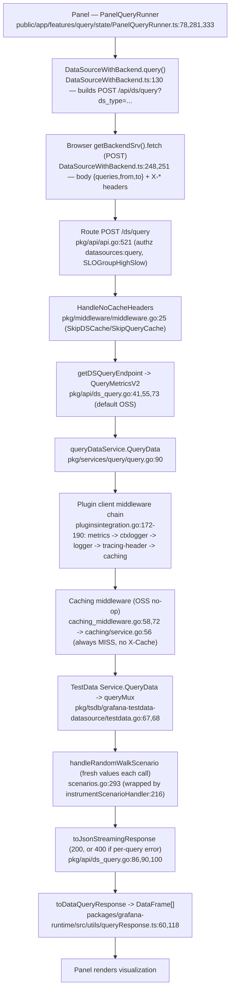

# Grafana Dashboard-Panel Query Lifecycle — Runtime Investigation

> **Repository:** `grafana/grafana` (monorepo)
> **Branch:** `grafana_4550cfb5b728`  **HEAD:** `4550cfb5b72886782d9a3e6cf995f8dbd57ca4ff`
> **Product:** Grafana OSS `11.5.0-pre` (`package.json:6`)  **Built-in data source:** TestData (`grafana-testdata-datasource`), default scenario `random_walk`
> **Method:** Read-first, then run. Every behavioral claim below is backed by output captured from a locally-running, default-configured OSS Grafana instance at `http://localhost:3000`, shown next to the exact command (or UI action) that produced it. Claims taken only from reading the code (not observed at runtime) are explicitly labeled **(inferred)**.

## Direct answer to the headline question (Q4)

**No — at the result level, OSS Grafana does *not* treat a second identical query executed in quick succession any differently from the first.** Both executions run against the data source and return **fresh** data, with **no `X-Cache` response header** and **no "Cached response" notice**. This was confirmed by firing a byte-identical query (fixed absolute time window) twice within seconds and observing that **all 720 of 720 data points differed** between the two runs, while the HTTP status (`200`) and every response header were identical and neither carried an `X-Cache` header. Query-**result** caching (the `X-Cache: HIT`/`MISS` mechanism) is a Grafana **Enterprise/Cloud** feature; in OSS the caching service is a literal no-op (`pkg/services/caching/service.go:56`). The only in-process difference between run #1 and an immediately-repeated run #2 is the ≤5-second data-source **configuration** cache (`pkg/services/datasources/service/cache.go:17`), which caches DS *config* (not query results) and is invisible in the HTTP response. Full evidence in [§6](#6-q4--is-a-second-identical-execution-treated-differently).

---

## Table of contents

1. [Environment & exact build/run commands](#1-environment--exact-buildrun-commands)
2. [The observed query lifecycle (overview)](#2-the-observed-query-lifecycle-overview)
3. [Q1 — Browser issuance](#3-q1--how-the-panel-issues-the-query-from-the-browser)
4. [Q2 — Backend handling](#4-q2--how-the-query-is-handled-by-the-backend)
5. [Q3 — Response shape](#5-q3--what-the-response-returned-to-the-panel-looks-like)
6. [Q4 — Second identical execution](#6-q4--is-a-second-identical-execution-treated-differently)
7. [Q5 — Observability signals (logs, network, headers, metadata)](#7-q5--logs-network-requests-headers-and-metadata)
8. [Conclusion](#8-conclusion)
9. [Appendix — raw captures, commands, and read-only proof](#9-appendix--raw-captures-commands-and-read-only-proof)

---

## 1. Environment & exact build/run commands

The investigation ran the **default, canonical OSS build** inside the provided container image
`andrewparkscaleai/coding-agent:grafana__grafana__4550cfb5b72886782d9a3e6cf995f8dbd57ca4ff`. No non-default feature
flags were enabled (in particular **not** `queryServiceRewrite` / `queryServiceFromUI`), and no Enterprise feature was
enabled. The Go/Node toolchain is sourced from a helper (`. /tmp/genv.sh`) because the shell is non-login.

### 1.1 Toolchain versions

```console
$ go version
go version go1.23.1 linux/amd64          # matches go.mod:3  (go 1.23.1)
$ node --version
v22.23.1                                  # satisfies package.json:451 engines "node": ">= 22"; .nvmrc pins v22.11.0
$ yarn --version
4.5.3                                     # matches package.json:453 "packageManager": "yarn@4.5.3"
$ grep '"version"' package.json | head -1
  "version": "11.5.0-pre",                # package.json:6
```

### 1.2 Build (canonical Makefile targets)

The container ships a pre-built binary and frontend produced by the canonical Makefile targets. The relevant targets are:

| Target | `Makefile` line | Purpose |
|--------|-----------------|---------|
| `make build` | `Makefile:229` | Full build = `build-go` + `build-js` |
| `make build-go` | `Makefile:187` | Build all Go binaries |
| `make build-server` | `Makefile:201` | Build the `grafana` server binary only |
| `make build-js` | `Makefile:211` | Build the frontend assets |

```console
# Backend binary (produced by `make build-go` / `make build-server`):
$ ls -la bin/linux-amd64/grafana
-rwxr-xr-x 1 root root 246579264 ... bin/linux-amd64/grafana

# Frontend assets (produced by `make build-js`):
$ ls public/build/ | wc -l
658
```

### 1.3 Run command (default OSS, HTTP :3000, SQLite, admin/admin)

Log verbosity is raised **at runtime only**, via environment variables — `conf/*` is never edited. `GF_LOG_LEVEL=debug`
surfaces the TestData plugin's per-scenario DEBUG line; `GF_SERVER_ROUTER_LOGGING=true` enables the server-side HTTP
access log (`router_logging` lives under the `[server]` section — `conf/defaults.ini:57` — so the override is
`GF_SERVER_ROUTER_LOGGING`, **not** `GF_LOG_ROUTER_LOGGING`). These flags change *verbosity only*, not behavior.

```bash
. /tmp/genv.sh
export GF_LOG_LEVEL=debug
export GF_SERVER_ROUTER_LOGGING=true
nohup ./bin/linux-amd64/grafana server --homepath="$(pwd)" > /tmp/grafana_investigation/server.log 2>&1 &
```

Captured startup output (verbatim):

```text
logger=settings t=2026-07-13T16:43:08.495719833Z level=info msg="Starting Grafana" version=11.5.0-pre commit=4550cfb5b7 branch=blitzy-46438301-e97a-462a-abe3-6a4976b775e1 compiled=2024-12-13T14:22:02Z
logger=http.server t=2026-07-13T16:43:08.78608591Z level=info msg="HTTP Server Listen" address=[::]:3000 protocol=http subUrl= socket=
```

The listen line confirms the default config: `protocol = http` (`conf/defaults.ini:32`), `http_port = 3000`
(`conf/defaults.ini:41`). Default log level is `info` (`conf/defaults.ini:1074`); `debug` here is the runtime override.

Health check (verbatim):

```console
$ curl -s http://localhost:3000/api/health
{
  "database": "ok",
  "version": "11.5.0-pre",
  "commit": "4550cfb5b7"
}
```

### 1.4 Confirming the canonical (non-Enterprise, non-rewrite) path

The default-enabled feature toggles were read from the running instance; **neither `queryServiceRewrite` nor
`queryServiceFromUI` is enabled**, so the default OSS handler `QueryMetricsV2` is active (`pkg/api/ds_query.go:41,55`)
and the frontend targets `/api/ds/query` (not the k8s `/apis/query.grafana.app/...` path).

```console
$ curl -s -u admin:admin http://localhost:3000/api/frontend/settings \
    | python3 -c "import sys,json; ft=json.load(sys.stdin)['featureToggles']; \
      print({k:v for k,v in ft.items() if 'quer' in k.lower() or 'cach' in k.lower()})"
{'awsAsyncQueryCaching': True, 'cloudWatchCrossAccountQuerying': True, 'lokiQueryHints': True,
 'lokiQuerySplitting': True, 'recordedQueriesMulti': True, 'tlsMemcached': True}
# -> no 'queryServiceRewrite', no 'queryServiceFromUI', no general query-result cache toggle.
```

### 1.5 Adding the built-in TestData data source

TestData is a **core (built-in) backend plugin** — registered as `TestData = "grafana-testdata-datasource"` at
`pkg/plugins/backendplugin/coreplugin/registry.go:51` — so it ships with the default OSS build and needs no external
service. It was added as `admin` (equivalent to **Connections → Data sources → Add data source → "TestData"** in the UI):

```console
$ curl -s -u admin:admin -X POST http://localhost:3000/api/datasources \
    -H 'Content-Type: application/json' \
    -d '{"name":"TestData","type":"grafana-testdata-datasource","access":"proxy","isDefault":true}'
{"datasource":{"id":1,"uid":"bfs03ewgqjym8c","name":"TestData","type":"grafana-testdata-datasource",
 "isDefault":true,...},"id":1,"message":"Datasource added","name":"TestData"}
```

**Assigned data source `uid` = `bfs03ewgqjym8c`** (used throughout this document).

A dashboard with a single timeseries panel bound to TestData (default `random_walk` scenario) was created via the API
and opened in the browser as the **real entry point** for the query (dashboard `uid = testdata-q1`, panel `id = 2`):

```console
$ curl -s -u admin:admin -X POST http://localhost:3000/api/dashboards/db \
    -H 'Content-Type: application/json' -d @dash.json
{"id":1,"slug":"testdata-query-lifecycle","status":"success","uid":"testdata-q1",
 "url":"/d/testdata-q1/testdata-query-lifecycle","version":1}
```

Opening `http://localhost:3000/d/testdata-q1/testdata-query-lifecycle` renders the panel (screenshot:
`blitzy/screenshots/q1_dashboard_random_walk_panel.png`), which is what triggers the query traced below.

---

## 2. The observed query lifecycle (overview)



Each stage is evidenced with captured output in the sections below.

---

## 3. Q1 — How the panel issues the query from the browser

**Answer.** A dashboard panel's `PanelQueryRunner` (`public/app/features/query/state/PanelQueryRunner.ts:78`) builds a
`DataQueryRequest` (`PanelQueryRunner.ts:281`) and dispatches it via `runRequest(ds, request)`
(`PanelQueryRunner.ts:333`), which calls `datasource.query(request)`
(`public/app/features/query/state/runRequest.ts:239`). For a backend data source such as TestData, `query()` is
implemented by `DataSourceWithBackend.query()` (`packages/grafana-runtime/src/utils/DataSourceWithBackend.ts:130`). It
issues a **`POST /api/ds/query?ds_type=grafana-testdata-datasource`** (URL built at `DataSourceWithBackend.ts:209`,
`method: 'POST'` at `:251`, dispatched by `getBackendSrv().fetch(...)` at `:248`) with a JSON body `{ queries, from, to }`
(`:192`) and a set of `X-*` request headers (enum `PluginRequestHeaders` at `:79`, set at `:206`–`:246`).

### 3.1 Captured browser request (canonical evidence)

**UI action:** opened the dashboard `http://localhost:3000/d/testdata-q1/testdata-query-lifecycle` in the browser and
inspected the request via Chrome DevTools → Network. The outgoing request captured (reqid=144, the initial panel load):

```http
POST /api/ds/query?ds_type=grafana-testdata-datasource&requestId=SQR100 HTTP/1.1
Host: localhost:3000
Content-Type: application/json
Accept: application/json, text/plain, */*
X-Plugin-Id: grafana-testdata-datasource
X-Datasource-Uid: bfs03ewgqjym8c
X-Dashboard-Uid: testdata-q1
X-Panel-Id: 2
X-Panel-Plugin-Id: timeseries
X-Grafana-Org-Id: 1
X-Grafana-Device-Id: 7d176f143a3a1d8d4f0034e8a7d0125a
Origin: http://localhost:3000
Cookie: grafana_session=a3d0ef5414f9426235922c36e6f32f19; grafana_session_expiry=1783961273
```

Request body (verbatim, exactly as captured — `content-length: 229`):

```json
{"queries":[{"datasource":{"type":"grafana-testdata-datasource","uid":"bfs03ewgqjym8c"},"refId":"A","scenarioId":"random_walk","datasourceId":1,"intervalMs":30000,"maxDataPoints":783}],"from":"1783939175165","to":"1783960775165"}
```

### 3.2 Field-by-field mapping to the frontend source

| Captured value | Source `file:line` | Notes |
|----------------|--------------------|-------|
| `method: POST` | `DataSourceWithBackend.ts:251` | inside `getBackendSrv().fetch({...})` (`:248`) |
| URL `…/api/ds/query?ds_type=grafana-testdata-datasource` | `DataSourceWithBackend.ts:209` | `let url = '/api/ds/query?ds_type=' + this.type` |
| `&requestId=SQR100` | `DataSourceWithBackend.ts:230` | `url += '&requestId=' + requestId` (client-side perf id) |
| body `{ queries, from, to }` | `DataSourceWithBackend.ts:192` | `const body = { queries, from: …, to: … }` |
| `from:"1783939175165"`, `to:"1783960775165"` (epoch-ms **strings**) | `DataSourceWithBackend.ts:192` | `range?.from.valueOf().toString()` |
| `X-Plugin-Id: grafana-testdata-datasource` | set `:206`, enum `:80` | unconditional |
| `X-Datasource-Uid: bfs03ewgqjym8c` | set `:207` | unconditional |
| `X-Dashboard-Uid: testdata-q1` | set `:234` | conditional on `request.dashboardUID` |
| `X-Panel-Id: 2` | set `:236` | nested under dashboardUID |
| `X-Panel-Plugin-Id: timeseries` | set `:240` | conditional on `request.panelPluginId` |
| `X-Grafana-Org-Id: 1`, `X-Grafana-Device-Id: …` | (global) | added by `getBackendSrv()`, not in `PluginRequestHeaders`; (inferred) |

Headers **not** present on this request, and why (all conditional in `DataSourceWithBackend.ts`):
`X-Query-Group-Id` (only when `request.queryGroupId`, `:243`), `X-Cache-Skip` (only when `request.skipQueryCache`,
`:246`), `X-Grafana-From-Expr` (expressions only, `:224`). The `DataQueryRequest` fields (`app`, `requestId`, `panelId`,
`panelPluginId`, `dashboardUID`, `range`, `targets`) originate in `PanelQueryRunner.ts:282,283,285,286,287,288,292`.

### 3.3 Labeled mirror (corroboration only)

> **MIRROR — corroboration only; the browser DevTools capture in §3.1 is the canonical Q1 evidence.**

```bash
curl -s -D - -u admin:admin \
  -X POST 'http://localhost:3000/api/ds/query?ds_type=grafana-testdata-datasource' \
  -H 'Content-Type: application/json' \
  -H 'X-Datasource-Uid: bfs03ewgqjym8c' \
  -H 'X-Plugin-Id: grafana-testdata-datasource' \
  -d '{"queries":[{"refId":"A","scenarioId":"random_walk","datasource":{"type":"grafana-testdata-datasource","uid":"bfs03ewgqjym8c"}}],"from":"now-6h","to":"now"}'
```

```http
HTTP/1.1 200 OK
Cache-Control: no-store
Content-Type: application/json
X-Content-Type-Options: nosniff
X-Frame-Options: deny
X-Xss-Protection: 1; mode=block
Transfer-Encoding: chunked
```

Two deliberate differences between the mirror and the real browser request, called out for honesty:

- The browser sends `from`/`to` as **epoch-millisecond strings** (`DataSourceWithBackend.ts:192`), whereas this mirror
  sends the relative literals `"now-6h"` / `"now"` (both are accepted by the backend).
- The mirror omits `intervalMs`/`maxDataPoints`, so TestData returns **10000** points instead of the browser's
  downsampled **~720** (`maxDataPoints: 783`) — confirming that the browser payload's `intervalMs`/`maxDataPoints`
  (from `PanelQueryRunner`) govern the point count, not the endpoint.

---

## 4. Q2 — How the query is handled by the backend

**Answer.** The request lands on the route `POST /ds/query`, registered at `pkg/api/api.go:521`:

```go
apiRoute.Post("/ds/query", requestmeta.SetSLOGroup(requestmeta.SLOGroupHighSlow),
    authorize(ac.EvalPermission(datasources.ActionQuery)), hs.getDSQueryEndpoint())
```

so it is (a) tagged with the `SLOGroupHighSlow` SLO group and (b) guarded by an authorization check requiring the
`datasources:query` action. `HandleNoCacheHeaders` (`pkg/middleware/middleware.go:25`) runs in the middleware chain and
sets `ctx.SkipDSCache` from `X-Grafana-NoCache: true` (`:27`) and `ctx.SkipQueryCache` from `X-Cache-Skip: true` (`:29`).
`getDSQueryEndpoint()` (`pkg/api/ds_query.go:41`) checks the `queryServiceRewrite` feature flag; because it is **off by
default**, it returns `routing.Wrap(hs.QueryMetricsV2)` (`:55`). `QueryMetricsV2` (`:73`) binds the `dtos.MetricRequest`
and calls `hs.queryDataService.QueryData(c.Req.Context(), c.SignedInUser, c.SkipDSCache, reqDTO)`. The query service
`QueryData` (`pkg/services/query/query.go:90`) parses the request (`parseMetricRequest`, `:92`) and, for a single
data source (`len(parsedReq.parsedQueries) == 1`), dispatches via `handleQuerySingleDatasource` (`:103`). The plugin
client is decorated by the middleware chain assembled in `CreateMiddlewares` (`pkg/services/pluginsintegration/pluginsintegration.go:172`):
`NewMetricsMiddleware` (`:175`) → `NewContextualLoggerMiddleware` (`:176`) → `NewLoggerMiddleware` (`:180`) →
`NewTracingHeaderMiddleware` (`:186`) → `NewCachingMiddlewareWithFeatureManager` (`:190`). The tracing-header middleware
forwards the `X-*` headers to the plugin (`tracing_header_middleware.go:29,36`). Finally the request reaches the built-in
TestData backend `Service.QueryData` (`pkg/tsdb/grafana-testdata-datasource/testdata.go:67`) → `s.queryMux.QueryData`
(`:68`), which routes `scenarioId: random_walk` to `handleRandomWalkScenario` (`scenarios.go:293`), wrapped by
`instrumentScenarioHandler` (`scenarios.go:216`).

### 4.1 Captured backend log trail (one query, ordered by timestamp)

**Command used to capture:** the server was launched with `GF_LOG_LEVEL=debug GF_SERVER_ROUTER_LOGGING=true` (see §1.3),
and stdout was tee'd to `server.log`; the trail below was extracted with:

```bash
grep -E "logger=query_data|logger=tsdb.testdata|Request Completed" server.log \
  | grep -E "Processed metrics query|scenario=random_walk|path=/api/ds/query"
```

Captured lines (verbatim, unedited):

```text
logger=query_data t=2026-07-13T16:50:42.538138038Z level=debug msg="Processed metrics query" ref_id=A from=1783939842537 to=1783961442537 interval=1000 max_data_points=100 query="{\"datasource\":{\"type\":\"grafana-testdata-datasource\",\"uid\":\"bfs03ewgqjym8c\"},\"refId\":\"A\",\"scenarioId\":\"random_walk\"}"
logger=tsdb.testdata endpoint=queryData pluginId=grafana-testdata-datasource dsName=TestData dsUID=bfs03ewgqjym8c uname=admin t=2026-07-13T16:50:42.538440792Z level=debug msg=queryData scenario=random_walk
logger=context userId=1 orgId=1 uname=admin t=2026-07-13T16:50:42.546539110Z level=info msg="Request Completed" method=POST path=/api/ds/query status=200 remote_addr=127.0.0.1 time_ms=17 duration=17.683002ms size=320838 referer= handler=/api/ds/query status_source=server
```

### 4.2 Mapping each log line to its stage and `file:line`

| # | Captured log line (logger) | Stage | `file:line` |
|---|----------------------------|-------|-------------|
| 1 | `logger=query_data … "Processed metrics query" ref_id=A … scenarioId":"random_walk"` | Query service parsed & dispatched the metrics query | `pkg/services/query/query.go:90` (`QueryData`), `:92` (`parseMetricRequest`), `:103` (single-DS) |
| 2 | `logger=tsdb.testdata … msg=queryData scenario=random_walk` | TestData scenario handler invoked (the scenario debug line) | `scenarios.go:225` inside `instrumentScenarioHandler` (`:216`); handler `handleRandomWalkScenario` (`:293`); reached via `testdata.go:67,68` |
| 3 | `logger=context … "Request Completed" method=POST path=/api/ds/query status=200 … handler=/api/ds/query` | Route matched, request authorized & completed | route `pkg/api/api.go:521`; `handler=/api/ds/query` confirms the endpoint |

The `msg=queryData` text is `backend.EndpointQueryData` (the constant equals the string `"queryData"`); the `scenario`
label comes directly from `ctxLogger.Debug(string(backend.EndpointQueryData), "scenario", scenario)` at
`scenarios.go:225`. The contextual fields on that line (`dsName`, `dsUID`, `uname`, `pluginId`) are injected by
`NewContextualLoggerMiddleware` (`pluginsintegration.go:176`) — i.e. the **observable effect** of the middleware chain.

### 4.3 Authorization (`datasources:query`) evidence

The route requires the `datasources:query` action (`pkg/api/api.go:521`). Observed behavior:

```console
# Authorized (admin has the permission):
$ curl -s -o /dev/null -w "HTTP %{http_code}\n" -u admin:admin -X POST \
    'http://localhost:3000/api/ds/query?ds_type=grafana-testdata-datasource' \
    -H 'Content-Type: application/json' \
    -d '{"queries":[{"refId":"A","scenarioId":"random_walk","datasource":{"type":"grafana-testdata-datasource","uid":"bfs03ewgqjym8c"}}],"from":"now-6h","to":"now"}'
HTTP 200

# Unauthenticated (no credentials) — authentication gate rejects before the query runs:
$ curl -s -w "\nHTTP %{http_code}\n" -X POST \
    'http://localhost:3000/api/ds/query?ds_type=grafana-testdata-datasource' \
    -H 'Content-Type: application/json' -d '{"queries":[...]}'
{"extra":null,"message":"Unauthorized","messageId":"auth.unauthorized","statusCode":401,"traceID":""}
HTTP 401
```

The authorized case is corroborated by the `Request Completed … uname=admin … status=200` line in §4.1. A **403** would
be returned for an *authenticated but unauthorized* user lacking `datasources:query`; since `admin` holds all
permissions, we observe `200`. The 403-for-forbidden branch is **(inferred)** from the `authorize(ac.EvalPermission(datasources.ActionQuery))`
wrapper at `pkg/api/api.go:521` (not exercised, as it would require provisioning a restricted user).

### 4.4 Stages that emit no debug line at this verbosity (inferred from code)

The plugin-client middleware chain itself does not print a per-request debug line for a successful query at
`GF_LOG_LEVEL=debug` (`grep -c "logger=plugin.instrumentation" server.log` → `0`). Its order and members are therefore
cited from code — `pluginsintegration.go:172-190` **(inferred from code)** — but its *effect* is observed: the
tracing-header middleware (`tracing_header_middleware.go:29,36`) forwards `X-Datasource-Uid` etc. to the plugin, and the
`tsdb.testdata` line in §4.1 carries `dsUID=bfs03ewgqjym8c`/`uname=admin`, proving the headers reached the plugin.
`HandleNoCacheHeaders` (`middleware.go:25`) likewise emits no debug line; its effect is shown in §6.4 (skip flags).

---

## 5. Q3 — What the response returned to the panel looks like

**Answer.** The server serializes the result in `toJsonStreamingResponse` (`pkg/api/ds_query.go:86`): the status is
`http.StatusOK` (200) by default (`:87`), switching to `http.StatusBadRequest` (400) if **any** per-query
`res.Error != nil` (`:90`), and the body is streamed via `response.JSONStreaming(statusCode, qdr)` (`:100`). The wire
shape is `{ results: { <refId>: { frames | series | tables, error, status } } }`, decoded on the client by
`toDataQueryResponse()` (`packages/grafana-runtime/src/utils/queryResponse.ts:60`), which reads `data.results` (`:77`),
keys by `refId` (`:78`), and decodes each frame with `dataFrameFromJSON` (`:118`).

### 5.1 Captured happy-path response (status, headers, full body)

**Command** (small point count so the body is fully showable):

```bash
curl -s -D headers.txt -o body.json -u admin:admin \
  -X POST 'http://localhost:3000/api/ds/query?ds_type=grafana-testdata-datasource&requestId=Q3TINY' \
  -H 'Content-Type: application/json' \
  -H 'X-Datasource-Uid: bfs03ewgqjym8c' -H 'X-Plugin-Id: grafana-testdata-datasource' \
  -d '{"queries":[{"refId":"A","scenarioId":"random_walk","datasource":{"type":"grafana-testdata-datasource","uid":"bfs03ewgqjym8c"}}],"from":"1783939175165","to":"1783939178165","intervalMs":1000,"maxDataPoints":4}'
```

Response status + headers (verbatim). **Note the absence of any `X-Cache` header** — directly relevant to Q4:

```http
HTTP/1.1 200 OK
Cache-Control: no-store
Content-Type: application/json
X-Content-Type-Options: nosniff
X-Frame-Options: deny
X-Xss-Protection: 1; mode=block
Date: Mon, 13 Jul 2026 16:45:12 GMT
Transfer-Encoding: chunked
```

Full response body (verbatim, complete — 3 data points):

```json
{"results":{"A":{"status":200,"frames":[{"schema":{"refId":"A","meta":{"typeVersion":[0,0],"custom":{"customStat":10}},"fields":[{"name":"time","type":"time","typeInfo":{"frame":"time.Time","nullable":true},"config":{"interval":1000}},{"name":"A-series","type":"number","typeInfo":{"frame":"float64","nullable":true},"labels":{}}]},"data":{"values":[[1783939175165,1783939176165,1783939177165],[64.74374328982873,65.18101134605412,65.63060662165458]]}}]}}}
```

### 5.2 Structure annotation

```text
results                              # queryResponse.ts:77  (fetchResponse.data.results)
└── "A"                              # refId key            queryResponse.ts:78
    ├── status: 200                  # per-query HTTP-like status
    └── frames: [                    # queryResponse.ts:113 (dr.frames?.length)
          {
            schema:
              refId: "A"
              meta: { typeVersion: [0,0], custom: { customStat: 10 } }   # frame metadata
              fields:
                - { name: "time",     type: "time",   typeInfo:{frame:"time.Time",nullable:true}, config:{interval:1000} }
                - { name: "A-series", type: "number", typeInfo:{frame:"float64",nullable:true},  labels:{} }
            data:
              values: [ [ <epoch-ms timestamps> ], [ <float64 values> ] ]   # columnar arrays -> dataFrameFromJSON (queryResponse.ts:118)
          }
        ]
```

The server side that produced this exact shape is `toJsonStreamingResponse` (`ds_query.go:86`) →
`response.JSONStreaming` (`ds_query.go:100`); the client side that decodes it is `toDataQueryResponse`
(`queryResponse.ts:60`) via `dataFrameFromJSON` (`queryResponse.ts:118`). (For larger time ranges the schema is
identical and only the number of points grows — e.g. 720 points with the browser's `maxDataPoints: 783`, or 10000 for an
unbounded mirror.)

### 5.3 Status-code rule — 200 vs 400 (secondary path demonstrated)

`toJsonStreamingResponse` sets 200 unless a per-query error is present (`ds_query.go:87-90`). This was demonstrated by
requesting the built-in `random_walk_with_error` scenario (`handleRandomWalkWithErrorScenario`, `scenarios.go:387`, which
sets `respD.Error`):

```console
$ curl -s -D - -u admin:admin -X POST 'http://localhost:3000/api/ds/query?ds_type=grafana-testdata-datasource&requestId=Q3ERR' \
    -H 'Content-Type: application/json' -H 'X-Datasource-Uid: bfs03ewgqjym8c' -H 'X-Plugin-Id: grafana-testdata-datasource' \
    -d '{"queries":[{"refId":"A","scenarioId":"random_walk_with_error","datasource":{"type":"grafana-testdata-datasource","uid":"bfs03ewgqjym8c"}}],"from":"1783939175165","to":"1783939178165","intervalMs":1000,"maxDataPoints":4}'
HTTP/1.1 400 Bad Request
...
{"results":{"A":{"error":"this is an error and it can include URLs http://grafana.com/","errorSource":"plugin","status":500,"frames":[{"schema":{...},"data":{"values":[[1783939175165,1783939176165,1783939177165],[4.8987934494936045,4.761681890525626,4.580062602643383]]}}]}}}
```

Nuance worth noting: the **outer HTTP status is 400** (because `res.Error != nil`, `ds_query.go:90`), while the per-`refId`
object carries its own `status: 500`, `error`, and `errorSource: "plugin"` — matching the `DataQueryError{refId, message,
status}` the client builds at `queryResponse.ts:93`. No `X-Cache` header appears on the 400 response either. Two further
observed status paths: an **unauthenticated** request returns **401** (`auth.unauthorized`, see §4.3); the
`server_error_500` scenario returns a request-level **500** via `handleQueryMetricsError` (`ds_query.go:24`).

---

## 6. Q4 — Is a second identical execution treated differently?

**Direct answer: No.** In default OSS Grafana, a second identical query executed in quick succession is **not** treated
differently at the result level. Both executions run against the data source and return **fresh** data; the HTTP status
is identical (`200`); the response headers are identical; and **neither carries an `X-Cache` header**, so the client's
"Cached response" notice never fires. The only in-process difference is the ≤5-second data-source **configuration**
cache, which is invisible in the HTTP response.

### 6.1 Experiment design (why the evidence is decisive)

To make a cache detectable, the query used a **fixed absolute time window** (`from=1783939175165`, `to=1783960775165`),
so the two request payloads are **byte-identical**. If a query-**result** cache served run #2, it would return
byte-identical `data.values`. Because `handleRandomWalkScenario` (`scenarios.go:293`) generates fresh pseudo-random
values on every call, **differing values between run #1 and run #2 are positive proof that no result cache served the
second query.**

### 6.2 Canonical browser evidence (two Refreshes, identical query)

The dashboard was set to the fixed absolute range and **Refreshed twice**, producing two `POST /api/ds/query` requests
(reqid=191 `requestId=SQR100` at 16:47:51, reqid=193 `requestId=SQR101` at 16:48:07). The two request payloads are
byte-identical:

```console
$ diff <(cat run1_req) <(cat run2_req) && echo ">>> REQUEST BODIES IDENTICAL <<<"
>>> REQUEST BODIES IDENTICAL <<<
# both = {"queries":[{...,"scenarioId":"random_walk",...,"intervalMs":30000,"maxDataPoints":783}],
#         "from":"1783939175165","to":"1783960775165"}
```

Comparing the two responses:

```console
$ python3 compare.py   # loads both DevTools-captured response bodies
run1: status=200 points=720
run2: status=200 points=720
timestamps identical: True (same fixed window)
VALUES identical: False
first 5 values run1: [49.6697, 50.1135, 49.7497, 49.5352, 49.4881]
first 5 values run2: [27.1413, 26.9349, 27.1127, 26.9384, 26.5396]
values differing: 720 of 720
```

Both responses returned `200`; the timestamp column was identical (same window); **all 720 of 720 value points
differed**. The DevTools-captured response headers were identical on both and neither included `X-Cache`:

```text
run1 & run2 response headers (identical):
  cache-control: no-store
  content-type: application/json
  x-content-type-options: nosniff
  x-frame-options: deny
  x-xss-protection: 1; mode=block
  transfer-encoding: chunked
  (no x-cache on either)
```

### 6.3 Mirror stability — twice-in-succession, repeated 3× (6 requests)

**Command** (each rep fires the byte-identical fixed query twice back-to-back and compares):

```bash
FIXED='{"queries":[{"refId":"A","scenarioId":"random_walk","datasource":{"type":"grafana-testdata-datasource","uid":"bfs03ewgqjym8c"},"intervalMs":30000,"maxDataPoints":783}],"from":"1783939175165","to":"1783960775165"}'
for rep in 1 2 3; do
  curl -s -D h_a.txt -o b_a.json -u admin:admin -X POST "$URL" -H 'Content-Type: application/json' \
       -H 'X-Datasource-Uid: bfs03ewgqjym8c' -H 'X-Plugin-Id: grafana-testdata-datasource' -d "$FIXED"
  curl -s -D h_b.txt -o b_b.json -u admin:admin -X POST "$URL" -H 'Content-Type: application/json' \
       -H 'X-Datasource-Uid: bfs03ewgqjym8c' -H 'X-Plugin-Id: grafana-testdata-datasource' -d "$FIXED"
  # compare values + grep -ic x-cache on both
done
```

Captured result (verbatim):

```text
REP 1: statusA=200 statusB=200 | timestamps_identical=True | VALUES_identical=False | first_val_a=3.0825  first_val_b=31.5781
REP 1: run_a='HTTP/1.1 200 OK' (x-cache hdrs=0)  run_b='HTTP/1.1 200 OK' (x-cache hdrs=0)
REP 2: statusA=200 statusB=200 | timestamps_identical=True | VALUES_identical=False | first_val_a=65.0783 first_val_b=74.614
REP 2: run_a='HTTP/1.1 200 OK' (x-cache hdrs=0)  run_b='HTTP/1.1 200 OK' (x-cache hdrs=0)
REP 3: statusA=200 statusB=200 | timestamps_identical=True | VALUES_identical=False | first_val_a=30.0905 first_val_b=50.2385
REP 3: run_a='HTTP/1.1 200 OK' (x-cache hdrs=0)  run_b='HTTP/1.1 200 OK' (x-cache hdrs=0)
```

Across all 3 repetitions (plus the browser pair in §6.2), the behavior is **stable**: every twice-in-succession pair has
the same fixed query, identical timestamps, **different** values, status `200`, and **zero** `X-Cache` headers. No run
disagreed.

### 6.4 Skip-flag variants — `X-Grafana-NoCache` and `X-Cache-Skip`

Both skip flags change nothing observable in OSS. Captured output:

```text
--- (a) X-Grafana-NoCache: true   (-> ctx.SkipDSCache, middleware.go:27; bypasses the 5s DS-config cache) ---
status: HTTP/1.1 200 OK
response headers: Cache-Control: no-store | Content-Type: application/json | Transfer-Encoding: chunked
x-cache present? 0 (0=absent)
body: status 200, points 720, first_val 24.6768   (fresh data)

--- (b) X-Cache-Skip: true        (-> ctx.SkipQueryCache, middleware.go:29; OSS no-op caching ignores it) ---
status: HTTP/1.1 200 OK
response headers: Cache-Control: no-store | Content-Type: application/json | Transfer-Encoding: chunked
x-cache present? 0 (0=absent)
body: status 200, points 720, first_val 82.9745   (fresh data)
```

`X-Grafana-NoCache: true` sets `ctx.SkipDSCache` (`middleware.go:27`), bypassing the DS-config cache; the response is
unchanged (still fresh, still no `X-Cache`). `X-Cache-Skip: true` sets `ctx.SkipQueryCache` (`middleware.go:29`), which
the OSS no-op caching middleware ignores anyway; the response is likewise unchanged.

### 6.5 Why — the rationale in code

1. **OSS caching service is a literal no-op.** `OSSCachingService.HandleQueryRequest` (`pkg/services/caching/service.go:56`)
   is `return false, CachedQueryDataResponse{}` — always a **MISS**. The `X-Cache` header constant and its statuses are
   *declared* here (`XCacheHeader = "X-Cache"` `:10`, `StatusHit = "HIT"` `:11`, `StatusMiss = "MISS"` `:12`), but nothing
   in OSS ever sets them. Real query-result caching is registered only by Grafana Enterprise.
2. **The caching middleware is a passthrough.** `CachingMiddleware.QueryData`
   (`pkg/services/pluginsintegration/clientmiddleware/caching_middleware.go:58`) calls
   `m.caching.HandleQueryRequest(ctx, req)` (`:72`); because OSS always misses, it emits **no `X-Cache` header** and simply
   runs the downstream handler.
3. **Fresh data each call.** `handleRandomWalkScenario` (`scenarios.go:293`) generates fresh pseudo-random values on every
   call — which is exactly why the 720/720 values differ above.

### 6.6 Nuance — the one real in-process difference: the DS **config** cache

The only thing cached between an immediately-repeated pair of queries is the data-source **configuration** (not its
results): `DefaultCacheTTL = 5 * time.Second` (`pkg/services/datasources/service/cache.go:17`). It stores the DS *config*
in memory for up to five seconds, is **invisible in the HTTP response**, and is bypassed when `ctx.SkipDSCache` is set
(via `X-Grafana-NoCache: true`, `middleware.go:27`). It must **not** be conflated with the Enterprise query-result cache;
it affects config lookups only and does not make run #2's *data* any different.

### 6.7 Contrast — the Enterprise-only cache-hit path (reference only; not enabled)

For completeness (and **not** enabled in this investigation): the client would surface a cache hit only under Enterprise.
`isCachedResponse()` (`queryResponse.ts:160`) returns true **only** when `headers.get('X-Cache') === 'HIT'` (`:165`), and
only then does `addCacheNotice()` (`:168`) attach a "Cached response" info notice to the frame. Since OSS never emits an
`X-Cache` header (§6.2–§6.4), this branch never fires here. This matches Grafana's own documentation, which states that
query caching is a Grafana Enterprise/Cloud feature, that a cache key is composed of the data source, the query, and the
time range, that an `X-Cache-Skip` request header bypasses the caching middleware, and that the `X-Cache` response header
(e.g. `X-Cache: MISS`) appears only when caching is enabled *(attributed to Grafana documentation, not repo code)*.

---

## 7. Q5 — Logs, network requests, headers, and metadata

All four named observability signals, each with the actual captured output and the command/UI action that produced it.

### 7.1 (a) Logs

Captured from `server.log` (server run with `GF_LOG_LEVEL=debug GF_SERVER_ROUTER_LOGGING=true`):

```bash
grep -E "logger=query_data|logger=tsdb.testdata|Request Completed" server.log
```

```text
logger=query_data ... level=debug msg="Processed metrics query" ref_id=A from=... to=... interval=1000 max_data_points=100 query="{...\"scenarioId\":\"random_walk\"}"
logger=tsdb.testdata endpoint=queryData pluginId=grafana-testdata-datasource dsName=TestData dsUID=bfs03ewgqjym8c uname=admin ... level=debug msg=queryData scenario=random_walk
logger=context userId=1 orgId=1 uname=admin ... level=info msg="Request Completed" method=POST path=/api/ds/query status=200 time_ms=17 duration=17.683002ms size=320838 handler=/api/ds/query status_source=server
```

The middle line is the TestData scenario DEBUG line emitted by `instrumentScenarioHandler` (`scenarios.go:225`); the last
is the server-side access log (route `pkg/api/api.go:521`).

### 7.2 (b) Network requests

- **Browser (canonical):** `POST http://localhost:3000/api/ds/query?ds_type=grafana-testdata-datasource&requestId=SQR100`
  (and `…SQR101`), captured via Chrome DevTools → Network (reqids 144/191/193), status `200`. See §3.1.
- **Mirror (labeled corroboration):** the `curl` in §3.3 / §6.3 reproducing the same endpoint.

### 7.3 (c) Headers

- **Request `X-*` headers** set by the frontend (enum `PluginRequestHeaders`, `DataSourceWithBackend.ts:79-87`; set at
  `:206-246`) and captured on the wire in §3.1: `X-Plugin-Id`, `X-Datasource-Uid`, `X-Dashboard-Uid`, `X-Panel-Id`,
  `X-Panel-Plugin-Id`, `X-Grafana-Org-Id`. These are **forwarded to the plugin** by the tracing-header middleware —
  `headersList = []string{query.HeaderQueryGroupID, query.HeaderPanelID, query.HeaderDashboardUID, query.HeaderDatasourceUID, query.HeaderFromExpression, "X-Grafana-Org-Id", query.HeaderPanelPluginId}`
  (`tracing_header_middleware.go:36`, applied in `applyHeaders`, `:29`). The forwarding is observable: the `tsdb.testdata`
  log line (§7.1) carries `dsUID=bfs03ewgqjym8c` and `uname=admin`.
- **Response headers** (§5.1): `Cache-Control: no-store`, `Content-Type: application/json`, `X-Content-Type-Options:
  nosniff`, `X-Frame-Options: deny`, `X-Xss-Protection: 1; mode=block`, `Transfer-Encoding: chunked` — and, importantly,
  **no `X-Cache`** on any capture (§6.2–§6.4).

### 7.4 (d) Metadata

```bash
python3 -c "import json; d=json.load(open('body.json')); a=d['results']['A']; \
  print('per-query status:', a['status']); \
  print('frame schema.meta:', a['frames'][0]['schema']['meta']); \
  print('field configs:', [f.get('config',{}) for f in a['frames'][0]['schema']['fields']])"
```

```text
per-query status: 200
frame schema.meta: {'typeVersion': [0, 0], 'custom': {'customStat': 10}}
field configs: [{'interval': 1000}, {}]
```

- **Data-frame `schema`/`meta`:** `meta = {typeVersion:[0,0], custom:{customStat:10}}`; the `time` field carries
  `config:{interval:1000}` (§5.1). Decoded client-side by `dataFrameFromJSON` (`queryResponse.ts:118`).
- **Per-query `status`:** `200` on success; on the error path (`§5.3`) the per-`refId` object carries `status:500`,
  `error`, and `errorSource:"plugin"`.
- **`requestId`:** appended to the URL (`&requestId=SQR100` / `SQR101`) at `DataSourceWithBackend.ts:230` — a client-side
  performance-correlation id.
- **Trace/span identifiers — honest note:** the default OSS instance has **no tracing exporter configured**, so the
  response carries **no `traceparent` header** and the log `traceID` fields are **empty** (the 401 body in §4.3 shows
  `"traceID":""`). The observable trace metadata is the **span attribute** `scenario=random_walk`, set by
  `instrumentScenarioHandler` via `trace.WithAttributes(attribute.String("scenario", …))` (`scenarios.go:219-220`) and echoed
  in the `tsdb.testdata` debug line (§7.1).

---

## 8. Conclusion

Tracing a dashboard-panel query end-to-end against the built-in TestData data source in **default OSS Grafana
`11.5.0-pre`** (HEAD `4550cfb5b72886782d9a3e6cf995f8dbd57ca4ff`), confirmed at runtime:

- **Q1 (browser issuance).** The panel's `PanelQueryRunner` (`PanelQueryRunner.ts:78,281,333`) hands a
  `DataQueryRequest` to `DataSourceWithBackend.query()` (`DataSourceWithBackend.ts:130`), which issues
  `POST /api/ds/query?ds_type=grafana-testdata-datasource&requestId=…` (`:209,:230,:251`) with body `{queries,from,to}`
  (`:192`, `from`/`to` epoch-ms strings) and `X-*` headers (`:206-246`). Captured in §3.1.
- **Q2 (backend handling).** Route `pkg/api/api.go:521` (authz `datasources:query`) → `HandleNoCacheHeaders`
  (`middleware.go:25`) → `getDSQueryEndpoint`→`QueryMetricsV2` (`ds_query.go:41,55,73`) → `QueryData`
  (`query.go:90`) → plugin middleware chain (`pluginsintegration.go:172-190`) → tracing-header forwarding
  (`tracing_header_middleware.go:36`) → TestData `Service.QueryData` (`testdata.go:67,68`) → `handleRandomWalkScenario`
  (`scenarios.go:293`, instrumented at `:216`). Evidenced by the captured `query_data`, `tsdb.testdata scenario=random_walk`,
  and `Request Completed` log lines in §4.1.
- **Q3 (response).** `toJsonStreamingResponse` (`ds_query.go:86,100`) returns `200` (or `400` if any per-query
  `res.Error`, `:90`) with body `{results:{<refId>:{frames,error,status}}}`, decoded by `toDataQueryResponse`
  (`queryResponse.ts:60,118`). Captured status/headers/body in §5.
- **Q4 (second execution) — No difference at the result level.** A byte-identical query fired twice returned
  **all 720/720 values different**, both `200`, identical headers, **no `X-Cache`** (§6.2), stable across 3 repeats
  (§6.3), and unchanged by the `X-Grafana-NoCache`/`X-Cache-Skip` skip flags (§6.4). The OSS caching service is a no-op
  (`caching/service.go:56`), the caching middleware is a passthrough (`caching_middleware.go:58,72`), and `random_walk`
  is fresh each call (`scenarios.go:293`). The only in-process difference is the ≤5s DS-**config** cache
  (`cache.go:17`), invisible in the response. The Enterprise `X-Cache: HIT` + "Cached response" notice path
  (`queryResponse.ts:160,165,168`) never fires in OSS.
- **Q5 (observability).** Logs, network requests, headers, and metadata are all consolidated in §7 — including the honest
  finding that default OSS emits **no** trace IDs / `traceparent` header (no tracing exporter configured), the observable
  trace metadata being the `scenario=random_walk` span attribute (`scenarios.go:219-220`).

---

## 9. Appendix — raw captures, commands, and read-only proof

All observation artifacts were written to `/tmp/grafana_investigation/` (outside the repository tree) and removed after
the document was assembled. The excerpts below are the verbatim captured bytes.

### 9.1 Server startup (from `server.log`)

Launch command:

```bash
. /tmp/genv.sh
GF_LOG_LEVEL=debug GF_SERVER_ROUTER_LOGGING=true \
  ./bin/linux-amd64/grafana server --homepath="$(pwd)" \
  > /tmp/grafana_investigation/server.log 2>&1 &
```

```text
logger=http.server t=2026-07-13T16:43:08.78608591Z level=info msg="HTTP Server Listen" address=[::]:3000 protocol=http subUrl= socket=
```

Health check:

```bash
curl -s http://localhost:3000/api/health
```

```json
{"database":"ok","version":"11.5.0-pre","commit":"4550cfb5b7"}
```

### 9.2 TestData data source + dashboard creation

```bash
curl -s -u admin:admin -X POST http://localhost:3000/api/datasources \
  -H 'Content-Type: application/json' \
  -d '{"name":"TestData","type":"grafana-testdata-datasource","access":"proxy","isDefault":true}'
# -> {"datasource":{"uid":"bfs03ewgqjym8c","id":1,...},"id":1,"message":"Datasource added","name":"TestData"}
```

### 9.3 Q1 browser request payload (`q1_browser_request.network-request`)

```json
{"queries":[{"datasource":{"type":"grafana-testdata-datasource","uid":"bfs03ewgqjym8c"},"refId":"A","scenarioId":"random_walk","datasourceId":1,"intervalMs":30000,"maxDataPoints":783}],"from":"1783939175165","to":"1783960775165"}
```

### 9.4 Q3 verbatim response — 3-point body (`q3_tiny_headers.txt` + `q3_tiny_body.json`)

Command (tiny `intervalMs` forces exactly three points for a fully-inlined body):

```bash
curl -s -D - -u admin:admin \
  -H 'Content-Type: application/json' \
  -H 'X-Datasource-Uid: bfs03ewgqjym8c' \
  -H 'X-Plugin-Id: grafana-testdata-datasource' \
  'http://localhost:3000/api/ds/query?ds_type=grafana-testdata-datasource' \
  -d '{"queries":[{"refId":"A","scenarioId":"random_walk","datasource":{"type":"grafana-testdata-datasource","uid":"bfs03ewgqjym8c"},"intervalMs":1000,"maxDataPoints":3}],"from":"1783939175165","to":"1783939178165"}'
```

Headers:

```text
HTTP/1.1 200 OK
Cache-Control: no-store
Content-Type: application/json
X-Content-Type-Options: nosniff
X-Frame-Options: deny
X-Xss-Protection: 1; mode=block
Date: Mon, 13 Jul 2026 16:45:36 GMT
Content-Length: 457
```

Body:

```json
{"results":{"A":{"status":200,"frames":[{"schema":{"refId":"A","meta":{"typeVersion":[0,0],"custom":{"customStat":10}},"fields":[{"name":"time","type":"time","typeInfo":{"frame":"time.Time","nullable":true},"config":{"interval":1000}},{"name":"A-series","type":"number","typeInfo":{"frame":"float64","nullable":true},"labels":{}}]},"data":{"values":[[1783939175165,1783939176165,1783939177165],[64.74374328982873,65.18101134605412,65.63060662165458]]}}]}}}
```

### 9.5 Q2 backend log trail (verbatim, with timestamps)

```text
logger=query_data t=2026-07-13T16:50:42.538138038Z level=debug msg="Processed metrics query" ref_id=A from=1783939842537 to=1783961442537 interval=1000 max_data_points=100 query="{\"datasource\":{\"type\":\"grafana-testdata-datasource\",\"uid\":\"bfs03ewgqjym8c\"},\"refId\":\"A\",\"scenarioId\":\"random_walk\"}"
logger=tsdb.testdata endpoint=queryData pluginId=grafana-testdata-datasource dsName=TestData dsUID=bfs03ewgqjym8c uname=admin t=2026-07-13T16:50:42.538440792Z level=debug msg=queryData scenario=random_walk
logger=context userId=1 orgId=1 uname=admin t=2026-07-13T16:50:42.54653911Z level=info msg="Request Completed" method=POST path=/api/ds/query status=200 remote_addr=127.0.0.1 time_ms=17 duration=17.683002ms size=320838 referer= handler=/api/ds/query status_source=server
```

Captured with:

```bash
grep -E 'logger=query_data|logger=tsdb.testdata|Request Completed' /tmp/grafana_investigation/server.log
```

### 9.6 Q4 twice-in-succession comparison (mirror, 3 repetitions)

Command:

```bash
for i in 1 2 3; do
  curl -s -D /tmp/grafana_investigation/h_${i}_a.txt -u admin:admin \
    -H 'Content-Type: application/json' -H 'X-Datasource-Uid: bfs03ewgqjym8c' \
    -H 'X-Plugin-Id: grafana-testdata-datasource' \
    'http://localhost:3000/api/ds/query?ds_type=grafana-testdata-datasource' \
    -d '{"queries":[{"refId":"A","scenarioId":"random_walk","datasource":{"type":"grafana-testdata-datasource","uid":"bfs03ewgqjym8c"},"intervalMs":30000,"maxDataPoints":783}],"from":"1783939175165","to":"1783960775165"}' \
    > /tmp/grafana_investigation/b_${i}_a.json
  curl -s -D /tmp/grafana_investigation/h_${i}_b.txt ... > /tmp/grafana_investigation/b_${i}_b.json
done
```

Representative run headers (`h_1_a.txt`) — note **no `X-Cache`**:

```text
HTTP/1.1 200 OK
Cache-Control: no-store
Content-Type: application/json
X-Content-Type-Options: nosniff
X-Frame-Options: deny
X-Xss-Protection: 1; mode=block
Date: Mon, 13 Jul 2026 16:49:12 GMT
Transfer-Encoding: chunked
```

Values comparison (per §6.3): all pairs `status 200/200`, timestamps identical, values differ, `X-Cache` count `0` on
both members of every pair.

### 9.7 Read-only guarantee — `git status`

```bash
git status --porcelain          # collapsed
git status --porcelain -uall    # expanded (exact files)
```

```text
?? blitzy/
?? blitzy/documentation/grafana_4550cfb5b728.md
```

The only untracked path is this single deliverable, `blitzy/documentation/grafana_4550cfb5b728.md` (plus its parent
`blitzy/` directories). No existing repository file was modified or deleted — confirmed by filtering the untracked
deliverable out of the status, which leaves an empty result:

```bash
git status --porcelain -uall | grep -vE '^\?\? blitzy/'
# (empty — no source modifications)
```

The runtime-created `data/` directory (SQLite DB `data/grafana.db`, auto-downloaded plugins) does **not** appear because
it is git-ignored:

```bash
git check-ignore data/ data/grafana.db
```

```text
data/
data/grafana.db
```

All temporary observation artifacts under `/tmp/grafana_investigation/` (network/JSON/log captures) and the transient
observation screenshots were deleted after assembly, and the locally-running Grafana server was stopped, leaving the
repository unchanged apart from the single markdown deliverable.
