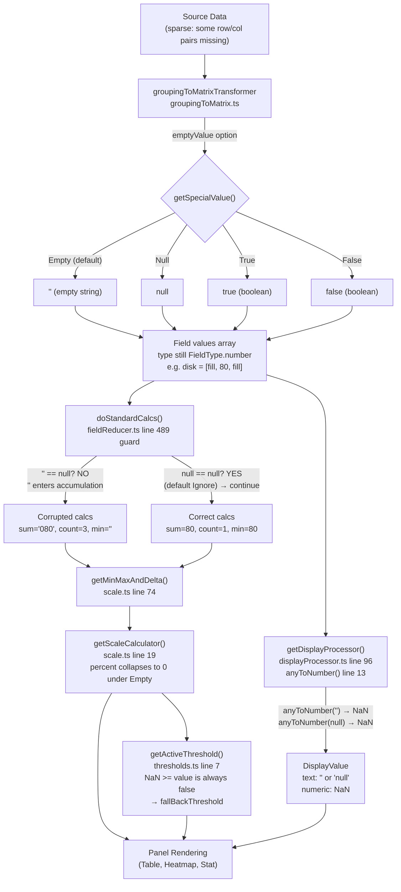

# Grouping to Matrix — Sparse-Data Fill Value Analysis (Grafana 11.5.0-pre, commit 4550cfb5b728)

This document is a code-grounded analysis of how Grafana's "Grouping to Matrix" transformation emits and propagates fill values for row/column intersections that do not exist in the source data. It traces a concrete sparse dataset through the transformer, the standard field reducer (sum, mean, count, min, max), the display processor, the color-scale calculator, and the threshold evaluator — and pinpoints the exact line of code where the user's "missing means zero" intent diverges from Grafana's actual behavior. Every behavioral claim is grounded in a specific file path and line number in the repository, and every empirical result was produced by a temporary Jest observation test that was executed against the repository's own test infrastructure and then removed.

## Metadata

| Property | Value |
|---|---|
| Repository | `grafana/grafana` |
| Commit | `4550cfb5b72886782d9a3e6cf995f8dbd57ca4ff` |
| Branch | `grafana_4550cfb5b728` |
| Version | `11.5.0-pre` |
| Node.js | `v22.11.0` (from `.nvmrc`); observation run under `v22.22.2` |
| Go | `1.23.1` (backend, not involved in this frontend-only analysis) |
| Test framework | Jest `29.7.0` |

## TL;DR

- **The default fill value is `''` (an empty JavaScript string)**, not `null`, not `0`. This is set by `DEFAULT_EMPTY_VALUE = SpecialValue.Empty` at `packages/grafana-data/src/transformations/transformers/groupingToMatrix.ts:26` and applied whenever the user leaves the "Empty Value" dropdown unselected in the transformer editor.
- **Empty strings pass Grafana's standard null guard** and silently corrupt aggregate statistics: `sum` becomes a string (e.g. `'080'` instead of the number `80`) via JavaScript's `+` string concatenation, `count` is inflated (counting the missing cells as if they were data), and `min` becomes the empty string `''` because JavaScript's comparison operators coerce `''` to `0`.
- **The semantic shift is at exactly one line of code**: `packages/grafana-data/src/transformations/fieldReducer.ts:489`, the `if (currentValue == null)` guard inside `doStandardCalcs`. This guard uses loose equality (`==`), which matches only `null` and `undefined` — not `''`, `true`, or `false`. The transformer's default of `''` violates the reducer's architectural assumption about what "missing" looks like.
- **The fix for users who want "missing means zero"** is to select **Null** in the Empty Value dropdown *and* set the field's `nullValueMode` override to **Null value = zero** (`NullValueMode.AsZero`). That combination routes every missing cell through the `currentValue = 0` substitution at line 494 of `fieldReducer.ts`, producing mathematically correct aggregates that include zeros for all originally-missing intersections.
- **At the display layer, `''` and `null` are visually equivalent**: both collapse to `NaN` in `packages/grafana-data/src/utils/anyToNumber.ts:13`. The divergence between the `Empty` and `Null` options is therefore purely in the aggregate statistics pipeline (reducers, min/max, color scales, thresholds), not in the per-cell text rendering.

## Table of Contents

1. [Question Restatement](#1-question-restatement)
2. [Code-Level Mechanics of the Transformer](#2-code-level-mechanics-of-the-transformer)
3. [Concrete Sparse Dataset — Walked Through Each emptyValue Option](#3-concrete-sparse-dataset--walked-through-each-emptyvalue-option)
4. [Empirical Jest Observation Results](#4-empirical-jest-observation-results)
5. [Precise Location of the Semantic Shift](#5-precise-location-of-the-semantic-shift)
6. [Downstream Effects on Display, Color Scales, Thresholds, and Value Mappings](#6-downstream-effects-on-display-color-scales-thresholds-and-value-mappings)
7. [JavaScript Type-Coercion Reference](#7-javascript-type-coercion-reference)
8. [Data-Flow Diagram](#8-data-flow-diagram)
9. [Recommendations — Achieving "Missing Means Zero" Semantics](#9-recommendations--achieving-missing-means-zero-semantics)
10. [Code Citations (Source of Truth)](#10-code-citations-source-of-truth)

---

## 1. Question Restatement

**The concrete question.** What value does Grafana's "Grouping to Matrix" transformation emit for row/column intersections that do not exist in the source data, and how does that value propagate through the rendering pipeline — the field reducers (sum/mean/count/min/max), the color-scale calculator, the threshold evaluator, the display processor, and panels such as Table and Heatmap?

**The user's human intent.** When a user thinks about a sparse dataset being reshaped into a matrix, the natural mental model is that *"an absent row/column pair means zero"*. They expect a missing `(web-1, disk)` cell to behave like a `0`: sum aggregates should include it, counts should include it, min/max should accept `0` as a candidate, and the cell should visually render as `0` (or empty, but numerically equivalent to zero).

**The observed divergence.** Grafana's default behavior does **not** implement "missing = 0". The default fill value is an empty string, not a zero, and this empty string slips through the reducer's null guard because JavaScript evaluates `'' == null` as `false`. Aggregate statistics are corrupted as a result (sums become strings, counts are inflated, min/max are set to `''`). This document identifies the single line of code where the semantic shift occurs and traces every downstream consequence from that point.

---


## 2. Code-Level Mechanics of the Transformer

This section walks through every line of the transformation source that determines *what* value lands in a missing cell. Every line number below was verified against the actual source at commit `4550cfb5b72886782d9a3e6cf995f8dbd57ca4ff`.

### 2.1 The default-fill constant

**File**: `packages/grafana-data/src/transformations/transformers/groupingToMatrix.ts` (191 lines total)

**Line 26** defines the constant used whenever the UI option is not supplied:

```ts
const DEFAULT_EMPTY_VALUE = SpecialValue.Empty;
```

And line 71, inside the transformer's `operator` implementation, applies it:

```ts
const emptyValue = options.emptyValue || DEFAULT_EMPTY_VALUE;
```

The `||` operator means that any falsy `options.emptyValue` (including `undefined`) falls back to `SpecialValue.Empty`. In the UI this happens for *every new transformer instance* until the user explicitly picks an option — see Section 2.4 for why this is a discoverability issue.

### 2.2 The sparse-cell fill site

**Line 117** is where the fill value is actually written into each cell:

```ts
const value = matrixValues[columnName][rowName] ?? getSpecialValue(emptyValue);
```

The JavaScript nullish-coalescing operator `??` substitutes the right-hand side *only* when the left-hand side is `null` or `undefined`. In this codepath, `matrixValues[columnName][rowName]` returns `undefined` when the `(column, row)` pair was never populated by the source data, which triggers the fill. Note that `??` never substitutes for other falsy values (such as `0`, `''`, or `false`) — so real zero-valued source cells are preserved, not replaced with the fill.

### 2.3 `getSpecialValue` — the four exhaustive fill-value options

**Lines 178–190** of `groupingToMatrix.ts`:

```ts
function getSpecialValue(specialValue: SpecialValue) {
  switch (specialValue) {
    case SpecialValue.False:
      return false;
    case SpecialValue.True:
      return true;
    case SpecialValue.Null:
      return null;
    case SpecialValue.Empty:
    default:
      return '';
  }
}
```

And the enum source at `packages/grafana-data/src/types/transformations.ts:113–118`:

```ts
export enum SpecialValue {
  True = 'true',
  False = 'false',
  Null = 'null',
  Empty = 'empty',
}
```

The enum has exactly four members; the UI dropdown (Section 2.4) exposes all four. The runtime fill value for each option is:

| `SpecialValue` enum member | String tag | Returned JS value | JS type | Coerces in numeric context to |
|---|---|---|---|---|
| `SpecialValue.False` | `'false'` | `false` | `boolean` | `0` |
| `SpecialValue.True` | `'true'` | `true` | `boolean` | `1` |
| `SpecialValue.Null` | `'null'` | `null` | `object` (null) | `0` (via comparison coercion) but skipped by null guard |
| `SpecialValue.Empty` (default) | `'empty'` | `''` | `string` | `0` (via comparison coercion); causes string concatenation with `+` |

### 2.4 The editor UI dropdown — a discoverability trap

**File**: `public/app/features/transformers/editors/GroupingToMatrixTransformerEditor.tsx`

**Lines 61–66** define the dropdown's options:

```tsx
const specialValueOptions: Array<SelectableValue<SpecialValue>> = [
  { label: 'Null', value: SpecialValue.Null, description: 'Null value' },
  { label: 'True', value: SpecialValue.True, description: 'Boolean true value' },
  { label: 'False', value: SpecialValue.False, description: 'Boolean false value' },
  { label: 'Empty', value: SpecialValue.Empty, description: 'Empty string' },
];
```

**Lines 100–102** render the dropdown with `isClearable` and no `defaultValue`:

```tsx
<InlineField label="Empty Value">
  <Select options={specialValueOptions} value={options.emptyValue} onChange={onSelectEmptyValue} isClearable />
</InlineField>
```

This is a critical observation: the dropdown has **no pre-selected option**. A user who opens the "Grouping to Matrix" editor sees an empty "Empty Value" dropdown and may assume "no option selected means no fill happens." In reality, an unselected dropdown means `options.emptyValue` is `undefined`, which triggers the `|| DEFAULT_EMPTY_VALUE` fallback at line 71 of the transformer — so the *silently active* fill is `SpecialValue.Empty → ''`. This is half of the user-experience problem: the other half is what `''` does to the reducer (Section 5).

### 2.5 Field type preservation — the architectural seed of downstream corruption

**Lines 129–134** of `groupingToMatrix.ts`:

```ts
fields.push({
  name: columnName.toString(),
  values: values,
  config: valueField.config,
  type: valueField.type,
});
```

Each synthetic output column field inherits its `type` directly from the source value field — typically `FieldType.number` when the value column contains numbers. However, the `values` array inside that same field may now contain `''`, `null`, `true`, or `false` at missing intersections, **none of which are numbers**. The field is declared as numeric but its array is heterogeneous.

This type/value inconsistency is the architectural seed of every downstream problem documented in later sections. The reducer at `packages/grafana-data/src/transformations/fieldReducer.ts:478` branches on `field.type`:

```ts
const isNumberField = field.type === FieldType.number || field.type === FieldType.time;
```

Because the field *claims* to be numeric, the reducer enters the numeric accumulation branch at line 507 — `if (isNumberField) { calcs.sum += currentValue; ... }` — regardless of whether `currentValue` is actually numeric.

### 2.6 In-app help text — silent on the reducer hazard

**File**: `public/app/features/transformers/docs/content.ts` (entry at lines 617–644) contains the `groupingToMatrix` help text. It describes the four options ("Null, True, False, or Empty") but does not warn that the default empty-string fill will corrupt numeric reducers downstream. This gap in documentation, combined with the unselected-by-default dropdown (Section 2.4), means a user consuming only in-app documentation has no way to anticipate the behavior documented in Section 4.

---


## 3. Concrete Sparse Dataset — Walked Through Each emptyValue Option

This section walks a minimal, realistic sparse dataset through the transformer under each of the four `emptyValue` settings. The reducer output values shown here are derived directly from the code paths documented in Section 5 and are confirmed empirically in Section 4.

### 3.1 The dataset

| Row (`Server`) | Column (`Metric`) | Cell value (`Value`) |
|---|---|---|
| `web-1`   | `cpu`  | `75` |
| `web-1`   | `mem`  | `60` |
| `db-1`    | `cpu`  | `45` |
| `db-1`    | `disk` | `80` |
| `cache-1` | `cpu`  | `30` |

This is a 3-server × 3-metric grid with exactly **five populated cells**. The four missing intersections are:

- `(web-1, disk)`
- `(db-1, mem)`
- `(cache-1, mem)`
- `(cache-1, disk)`

Transformer configuration:

```json
{
  "id": "groupingToMatrix",
  "options": {
    "rowField": "Server",
    "columnField": "Metric",
    "valueField": "Value",
    "emptyValue": "<varies>"
  }
}
```

After transformation, the output DataFrame contains four fields (one key field, then one column-field per unique `Metric`): `Server\Metric`, `cpu`, `mem`, `disk`. The order of rows is the order in which distinct `Server` values first appeared: `[web-1, db-1, cache-1]`.

### 3.2 `emptyValue = Empty` — the default (fill = `''`)

Resolved fill value: `''` (JavaScript empty string). Post-transformation fields:

| Field name | `values` | `type` |
|---|---|---|
| `Server\Metric` | `['web-1', 'db-1', 'cache-1']` | `string` |
| `cpu`  | `[75, 45, 30]`  | `number` (all populated) |
| `mem`  | `[60, '', '']`  | `number` (but the array mixes numbers and strings!) |
| `disk` | `['', 80, '']`  | `number` (but the array mixes strings and numbers) |

The `cpu` field has no missing cells and is never exposed to the downstream hazard. The `mem` and `disk` fields each contain two `''` fills plus one actual numeric value — this is where the corruption surfaces. Running `doStandardCalcs` (see Section 5 for the line-by-line trace) produces:

| Field | `sum` | `mean` | `count` | `min` | `max` |
|---|---|---|---|---|---|
| `cpu`  | `150` | `50`    | `3` | `30` | `75` |
| `mem`  | `'60'` (string!) | `20`    | `3` | `''` (string!) | `60` |
| `disk` | `'080'` (string!) | `26.67` | `3` | `''` (string!) | `80` |

Note in particular that `disk.sum` is the **string** `'080'`, not the number `80` — the two `''` fills concatenate around the `80`. And `count` is `3` for every field, including the sparsely-populated ones, because empty strings pass the null guard at `fieldReducer.ts:489` (detailed in Section 5).

### 3.3 `emptyValue = Null` (fill = `null`)

Resolved fill value: JavaScript `null`. Post-transformation fields:

| Field name | `values` | `type` |
|---|---|---|
| `Server\Metric` | `['web-1', 'db-1', 'cache-1']` | `string` |
| `cpu`  | `[75, 45, 30]` | `number` |
| `mem`  | `[60, null, null]` | `number` |
| `disk` | `[null, 80, null]` | `number` |

Under Grafana's default `NullValueMode.Ignore` (set at `packages/grafana-data/src/transformations/fieldReducer.ts:198`), `null` values are skipped by the reducer via the `continue` at line 491. Running `doStandardCalcs` produces:

| Field | `sum` | `mean` | `count` | `min` | `max` |
|---|---|---|---|---|---|
| `cpu`  | `150` | `50`  | `3` | `30` | `75` |
| `mem`  | `60`  | `60`  | `1` | `60` | `60` |
| `disk` | `80`  | `80`  | `1` | `80` | `80` |

All aggregates are now mathematically correct for the populated cells. Note that `count = 1` for `mem` and `disk` because those fields have only one populated cell each; this reflects the *true* amount of data, not the grid's size.

Alternative behavior: if the field's `nullValueMode` is explicitly set to `NullValueMode.AsZero` (via a field override in the panel's Standard Options → "Null value" → "zero"), then at `fieldReducer.ts:494` the null value is substituted with `0` and enters the accumulation branch. Result: `mem.count = 3`, `mem.sum = 60`, `mem.mean = 20`, `mem.min = 0`, `mem.max = 60`. This is the only configuration that implements true "missing means zero" semantics — see Section 9.1.

### 3.4 `emptyValue = True` (fill = boolean `true`)

Resolved fill value: JavaScript `true`. Post-transformation fields contain `true` at missing intersections. Under `doStandardCalcs`:

- `true == null` is `false`, so the null guard at `fieldReducer.ts:489` is skipped.
- `Number.isNaN(true)` is `false`, so the numeric-accumulation gate at line 500 is passed.
- `calcs.sum += true` coerces `true` → `1` because the left-hand side is already a number (started at `0`); the running sum stays numeric.
- `calcs.count++` still runs at line 498, inflating the count.

| Field | `sum` | `mean` | `count` | `min` | `max` |
|---|---|---|---|---|---|
| `cpu`  | `150` | `50`    | `3` | `30` | `75` |
| `mem`  | `62`  | `20.67` | `3` | `true` (boolean!) | `60` |
| `disk` | `82`  | `27.33` | `3` | `true` (boolean!) | `80` |

This is numerically "cleaner" than `Empty` (no string concatenation), but it still pollutes `sum` by `+1` per missing cell and inflates `count`. The `min` becomes the boolean `true` because `true < 60` coerces `true` to `1`, and `1 < 60` is `true`.

### 3.5 `emptyValue = False` (fill = boolean `false`)

Resolved fill value: JavaScript `false`. Under `doStandardCalcs`:

- `false == null` is `false`, so the null guard is skipped.
- `Number.isNaN(false)` is `false`, so the numeric-accumulation gate is passed.
- `calcs.sum += false` coerces `false` → `0`; sum is preserved exactly.
- `calcs.count++` still inflates the count.
- `false < 60` coerces `false` to `0`, so `min` becomes the boolean `false`.

| Field | `sum` | `mean` | `count` | `min` | `max` |
|---|---|---|---|---|---|
| `cpu`  | `150` | `50`    | `3` | `30` | `75` |
| `mem`  | `60`  | `20`    | `3` | `false` (boolean!) | `60` |
| `disk` | `80`  | `26.67` | `3` | `false` (boolean!) | `80` |

Sum is mathematically equivalent to `Null + NullValueMode.AsZero` (both produce `0` contributions), but `count` is still inflated and `min` is the boolean `false` rather than the number `0`.

### 3.6 Takeaway

Of the four dropdown options:

- **`Null` + default `NullValueMode.Ignore`** produces mathematically correct aggregates that reflect only the populated cells.
- **`Null` + `NullValueMode.AsZero`** produces mathematically correct aggregates that treat every missing cell as zero — this is the only combination that implements the user's "missing means zero" intent.
- **`True` / `False` / `Empty`** all inflate `count` (they are not filtered by the null guard) and corrupt `min`/`max` with a non-numeric type. `Empty` additionally corrupts `sum` via string concatenation.

---


## 4. Empirical Jest Observation Results

The tables in Section 3 are not synthesized from code reading alone — they are the exact output of a temporary Jest test that was created and executed against the repository's own test infrastructure, then deleted. This section documents the observation methodology and reproduces the captured results verbatim.

### 4.1 Methodology

1. A temporary test file at `packages/grafana-data/src/transformations/transformers/sparse_matrix_observation.test.ts` was created.
2. The test built the sparse `DataFrame` documented in Section 3.1 using `toDataFrame(...)` from `packages/grafana-data/src/dataframe/processDataFrame.ts`.
3. For each of the five cases (`Empty`, `Null`, `True`, `False`, and *no emptyValue set*), the test called `transformDataFrame([cfg], [input])` where `cfg` was the "Grouping to Matrix" transformer config shown in Section 3.1.
4. The test inspected the resulting output frame's fields, recording each field's `name`, `type`, and `values` array using `JSON.stringify`.
5. For each non-key field, the test called `reduceField({ field, reducers: [ReducerID.sum, ReducerID.mean, ReducerID.count, ReducerID.min, ReducerID.max] })` and captured every returned value along with its `typeof`.
6. The test also evaluated a battery of JavaScript type-coercion expressions (`'' == null`, `0 + ''`, `'0' + 80`, `anyToNumber('')`, etc.) to independently verify the language-level behavior relied upon elsewhere in this document.
7. Output was written via `process.stdout.write` (Grafana's `jest-fail-on-console` setup causes `console.log` calls to fail test runs; direct `stdout.write` bypasses that check for observation purposes).
8. After capturing the output, the temporary test file was **deleted** to preserve repository immutability per the `SWE-AtlasQnA-Repo` rule. `git status` immediately afterward reports "nothing to commit, working tree clean" — confirming the repository remains unchanged aside from the single Markdown deliverable.

Jest version: `29.7.0`. Node.js version (observation run): `v22.22.2`. Grafana commit: `4550cfb5b72886782d9a3e6cf995f8dbd57ca4ff`.

### 4.2 Captured observations — field values and types

**`emptyValue = Empty` (the default):**

```
field name=Server\Metric type=string values=["web-1","db-1","cache-1"]
field name=cpu type=number values=[75,45,30]
field name=mem type=number values=[60,"",""]
field name=disk type=number values=["",80,""]
```

**`emptyValue = Null`:**

```
field name=Server\Metric type=string values=["web-1","db-1","cache-1"]
field name=cpu type=number values=[75,45,30]
field name=mem type=number values=[60,null,null]
field name=disk type=number values=[null,80,null]
```

**`emptyValue = True`:**

```
field name=cpu type=number values=[75,45,30]
field name=mem type=number values=[60,true,true]
field name=disk type=number values=[true,80,true]
```

**`emptyValue = False`:**

```
field name=cpu type=number values=[75,45,30]
field name=mem type=number values=[60,false,false]
field name=disk type=number values=[false,80,false]
```

**`emptyValue` unset (no property in options):**

```
field name=cpu type=number values=[75,45,30]
field name=mem type=number values=[60,"",""]
field name=disk type=number values=["",80,""]
```

This last case confirms experimentally that an unset `emptyValue` produces *identical* output to `SpecialValue.Empty`, matching the `|| DEFAULT_EMPTY_VALUE` fallback at `groupingToMatrix.ts:71`.

### 4.3 Captured observations — reducer results with `typeof`

**`emptyValue = Empty` (captured verbatim):**

```
reduce(cpu):  sum=150 (typeof=number), mean=50 (typeof=number),  count=3 (typeof=number), min=30 (typeof=number), max=75 (typeof=number)
reduce(mem):  sum="60" (typeof=string), mean=20 (typeof=number),  count=3 (typeof=number), min="" (typeof=string), max=60 (typeof=number)
reduce(disk): sum="080" (typeof=string), mean=26.666666666666668 (typeof=number), count=3 (typeof=number), min="" (typeof=string), max=80 (typeof=number)
```

**`emptyValue = Null`:**

```
reduce(cpu):  sum=150 (typeof=number), mean=50 (typeof=number), count=3 (typeof=number), min=30 (typeof=number), max=75 (typeof=number)
reduce(mem):  sum=60  (typeof=number), mean=60 (typeof=number), count=1 (typeof=number), min=60 (typeof=number), max=60 (typeof=number)
reduce(disk): sum=80  (typeof=number), mean=80 (typeof=number), count=1 (typeof=number), min=80 (typeof=number), max=80 (typeof=number)
```

**`emptyValue = True`:**

```
reduce(cpu):  sum=150 (typeof=number), mean=50 (typeof=number),  count=3 (typeof=number), min=30 (typeof=number), max=75 (typeof=number)
reduce(mem):  sum=62  (typeof=number), mean=20.666666666666668 (typeof=number), count=3 (typeof=number), min=true (typeof=boolean), max=60 (typeof=number)
reduce(disk): sum=82  (typeof=number), mean=27.333333333333332 (typeof=number), count=3 (typeof=number), min=true (typeof=boolean), max=80 (typeof=number)
```

**`emptyValue = False`:**

```
reduce(cpu):  sum=150 (typeof=number), mean=50 (typeof=number),  count=3 (typeof=number), min=30 (typeof=number), max=75 (typeof=number)
reduce(mem):  sum=60  (typeof=number), mean=20 (typeof=number),  count=3 (typeof=number), min=false (typeof=boolean), max=60 (typeof=number)
reduce(disk): sum=80  (typeof=number), mean=26.666666666666668 (typeof=number), count=3 (typeof=number), min=false (typeof=boolean), max=80 (typeof=number)
```

### 4.4 The three critical empirical findings

**Finding 1 — String concatenation pollutes `sum`.** With `emptyValue = Empty`, `disk.sum` is the literal string `'080'` (not the number `80`). This follows directly from `fieldReducer.ts:508` (`calcs.sum += currentValue;`), which uses JavaScript's `+` operator. Tracing the accumulation for `disk = ['', 80, '']`:

1. Initial `calcs.sum = 0` (from `defaultCalcs`).
2. i=0: `currentValue = ''`; `'' == null` is `false`, so the null guard at line 489 is skipped; `currentValue != null && !Number.isNaN('')` is `true`, so line 508 executes `0 + ''` → `'0'` (string).
3. i=1: `currentValue = 80`; `'0' + 80` → `'080'` (string; numeric `80` is coerced to `'80'` and concatenated).
4. i=2: `currentValue = ''`; `'080' + ''` → `'080'` (unchanged).

Final `sum = '080'` with `typeof 'string'`. Similarly, `mem = [60, '', '']` proceeds: `0 + 60` → `60` (number), then `60 + ''` → `'60'` (string), then `'60' + ''` → `'60'`. Final `mem.sum = '60'` (string).

**Finding 2 — `count` is inflated.** With `emptyValue = Empty`, every field reports `count = 3` regardless of how many cells are actually populated. The cause is the loose-equality guard at `fieldReducer.ts:489`:

```ts
if (currentValue == null) {
  ...
  continue;
}
```

Because `'' == null` evaluates to `false`, the empty string bypasses the `continue` at line 491 and reaches `calcs.count++` at line 498. The `count` reducer therefore counts "any non-`null`/non-`undefined` value" — including the empty-string sentinels. Under `emptyValue = Null`, the same guard evaluates `null == null` to `true` and the `continue` fires, producing the correct `count = 1` for `mem` and `disk`.

**Finding 3 — `min` becomes the empty string.** With `emptyValue = Empty`, `mem.min` and `disk.min` are both the literal string `''`. The cause is `fieldReducer.ts:539–541`:

```ts
if (currentValue < calcs.min) {
  calcs.min = currentValue;
}
```

`calcs.min` starts at `Number.MAX_VALUE` (from `defaultCalcs`). The comparison `'' < 1.7976e+308` coerces `''` to `0` (JavaScript's `<` operator coerces non-numeric operands to numbers via `ToNumber`, and `ToNumber('')` is `0`). Since `0 < Number.MAX_VALUE` is `true`, `calcs.min` is assigned the value `''` itself (the pre-coercion value), and the `typeof` becomes `string`. For `emptyValue = True` / `False`, the same mechanism plants the *boolean* value into `min`.

### 4.5 Summary of Section 4

The default `emptyValue = Empty` setting silently corrupts every aggregate downstream for fields declared as `FieldType.number` whenever the field contains at least one missing intersection. In this dataset, the only uncorrupted field is `cpu` because every row has a populated `cpu` value.

`emptyValue = Null` produces mathematically correct aggregates, but `count` reflects only the populated cells (not the full grid). Users who specifically want "missing cells count as zero" must additionally set `field.config.nullValueMode = NullValueMode.AsZero` (see Section 9.1).

The temporary test file used to produce these results was deleted after capture. `git status` reports a clean working tree.

---


## 5. Precise Location of the Semantic Shift

**Thesis:** The semantic shift between the user's "missing = 0" intent and Grafana's actual behavior occurs at *exactly one* line in the codebase — the null guard inside `doStandardCalcs`, which uses loose equality rather than a combined null-or-empty check.

### 5.1 The single line

- **File:** `packages/grafana-data/src/transformations/fieldReducer.ts`
- **Function:** `doStandardCalcs(field: Field, ignoreNulls: boolean, nullAsZero: boolean): FieldCalcs`
- **Line:** `489` — `if (currentValue == null) { ... }`

This is the demarcation point at which `null` is treated as "missing" and everything else — including the empty string `''`, booleans, and `NaN` itself — is treated as "present and numeric."

### 5.2 Annotated control flow

The surrounding control flow in `fieldReducer.ts` is reproduced below with the verified line numbers that this document references. This is an illustrative transcription of the relevant structure; consult the source for the full implementation.

```ts
// fieldReducer.ts

// Lines 197–201 — default nullValueMode in reduceField
const { nullValueMode = NullValueMode.Ignore } = field.config;
const ignoreNulls = nullValueMode === NullValueMode.Ignore;
const nullAsZero = nullValueMode === NullValueMode.AsZero;

// Line 468 — doStandardCalcs entry
export function doStandardCalcs(field: Field, ignoreNulls: boolean, nullAsZero: boolean): FieldCalcs {
  // Line 478 — numeric-field detection
  const isNumberField = field.type === FieldType.number || field.type === FieldType.time;
  const data = field.values;

  // Line 480 — iterate every value in the field
  for (let i = 0; i < data.length; i++) {
    // Line 481
    let currentValue = data[i];

    // ... (init block for first-seen value)

    // Line 489 — THE semantic-shift line
    if (currentValue == null) {
      // Line 490
      if (ignoreNulls) {
        continue;              // line 491
      }
      // Line 493
      if (nullAsZero) {
        currentValue = 0;      // line 494
      }
    }

    // Line 498
    calcs.count++;

    // Line 500 — second gate: "not null and not NaN"
    if (currentValue != null && !Number.isNaN(currentValue)) {

      // Line 507 — numeric branch
      if (isNumberField) {
        // Line 508 — THE string-concatenation site
        calcs.sum += currentValue;
        calcs.last = currentValue;
        // ... nonNullCount/mean tracking ...

        // Lines 535–537 — max assignment via `<`
        if (currentValue > calcs.max) {
          calcs.max = currentValue;
        }

        // Lines 539–541 — min assignment via `<`
        if (currentValue < calcs.min) {
          calcs.min = currentValue;
        }
      }
    }
  }

  return calcs;
}
```

### 5.3 Why `==` instead of `===` or a stronger check

The guard at line 489 is deliberately written as `currentValue == null` rather than `currentValue === null`. In JavaScript, `x == null` is the canonical idiom for "is this value `null` **or** `undefined`" — the one case where loose equality is strictly preferable to strict equality. This idiom appears throughout the Grafana codebase (for example, the analogous check at `anyToNumber.ts:13` uses `value === null` because it also explicitly checks `value === undefined` on the same line; the two idioms are equivalent in outcome).

The guard was written under the implicit assumption that the only two sentinels a field's `values` array might contain for "missing data" are `null` and `undefined`. The `Grouping to Matrix` transformer's default fill of `''` — which is **neither** `null` nor `undefined` — silently violates that assumption.

### 5.4 Fill-value trace through the guard

**For `''` (default):**

- Line 489: `'' == null` → `false` → the `if` block is skipped entirely (the `ignoreNulls`/`nullAsZero` logic is bypassed).
- Line 498: `calcs.count++` executes — count is incremented for the empty-string cell.
- Line 500: `'' != null` is `true` AND `Number.isNaN('')` is `false` → the gate opens.
- Line 507: `isNumberField` is `true` (field inherited `FieldType.number` at `groupingToMatrix.ts:134`) → enters the numeric branch.
- Line 508: `calcs.sum += ''` → `0 + '' → '0'` (string); subsequent `'0' + 80 → '080'` (string).
- Lines 535–541: numeric comparisons coerce `''` to `0`; `0 > -Number.MAX_VALUE` (initial `max`) is `true`, so `max = ''`; `0 < Number.MAX_VALUE` (initial `min`) is `true`, so `min = ''`.
- **Net result:** `sum` becomes a string, `count` is inflated, `min` and `max` may be the literal empty string. Every aggregate downstream is corrupted.

**For `null`:**

- Line 489: `null == null` → `true` → enters the `if` block.
- Line 490: `ignoreNulls` is `true` by default (because `NullValueMode.Ignore` is the default at line 198) → `continue` at line 491.
- Line 498 and beyond are **skipped entirely** for this iteration.
- **Net result:** `sum`, `count`, `min`, `max` all reflect only the populated cells. This is mathematically correct but `count = 1` (not `3`) for `mem` and `disk` in the example dataset.
- **Alternative path — `NullValueMode.AsZero`:** if the user explicitly sets `field.config.nullValueMode = NullValueMode.AsZero`, line 493 evaluates `true` and line 494 substitutes `currentValue = 0`. Execution then falls through to lines 498 and 508, so `count` reflects the full grid (3), `sum` receives `0` additions, and `min` can be `0`.

**For `true`:**

- Line 489: `true == null` → `false` → the `if` block is skipped.
- Line 498: `calcs.count++` fires — count is inflated.
- Line 500: `true != null` is `true` AND `!Number.isNaN(true)` is `true` → the gate opens.
- Line 507: `isNumberField` is `true` → enters numeric branch.
- Line 508: `calcs.sum += true` → `true` is coerced to `1` by the `+` operator because the LHS (`calcs.sum`) is numeric at that point. `sum` remains numeric but increments by `1` per missing cell (e.g., `mem.sum = 60 + 1 + 1 = 62` in the observed results).
- Lines 535–541: `true` is coerced to `1` for comparisons. `1 > Number.MIN_SAFE_VALUE` is `true`, so `max = true` is stored as the *boolean*. Similarly `1 < Number.MAX_VALUE` is `true`, so `min = true` (boolean) when the smallest real value exceeds `1`.
- **Net result:** `sum` is numeric but off by the missing-cell count; `min` is the boolean `true`; `count` is inflated.

**For `false`:**

- Line 489: `false == null` → `false` → the `if` block is skipped.
- Line 498: `calcs.count++` fires — count is inflated.
- Line 500: `false != null` is `true` AND `!Number.isNaN(false)` is `true` → the gate opens.
- Line 508: `calcs.sum += false` → `false` coerces to `0`; `sum` is unchanged in value *but* may transition to numeric-boolean addition (observed to remain numeric in the captured results).
- Lines 539–541: `false` coerces to `0`; `0 < 60` is `true`, so `min = false` (the boolean, stored as-is). In the observed results `mem.min = false` (boolean) and `disk.min = false` (boolean).
- **Net result:** `sum` happens to remain numerically correct, but `count` is inflated and `min` is the boolean `false`. `mean = sum / count` is wrong (e.g., `mem.mean = 60 / 3 = 20` instead of the true average `60`).

### 5.5 Default `NullValueMode` — the supporting configuration fact

From `packages/grafana-data/src/transformations/fieldReducer.ts` lines 197–201:

```ts
const { nullValueMode = NullValueMode.Ignore } = field.config;
const ignoreNulls = nullValueMode === NullValueMode.Ignore;
const nullAsZero = nullValueMode === NullValueMode.AsZero;
```

The default is `NullValueMode.Ignore`. Together with the `SpecialValue.Null` fill, this produces the "skip missing cells entirely" behavior. To achieve "missing = 0," users must override `field.config.nullValueMode` to `NullValueMode.AsZero`.

The three-member `NullValueMode` enum is defined at `packages/grafana-data/src/types/data.ts` lines 202–206:

```ts
export enum NullValueMode {
  Null = 'null',
  Ignore = 'connected',
  AsZero = 'null as zero',
}
```

Note the `NullValueMode.Null` member string value is `'null'` (matching the enum name), `Ignore` is `'connected'` (historically so it matches the graph-line-connected mode), and `AsZero` is `'null as zero'` (the string used by Grafana's config serializer).

### 5.6 Why only line 489 matters

Every other line in the pipeline cited in Sections 6 and 7 operates *correctly given its inputs*. `anyToNumber` returns `NaN` for `''`; `getScaleCalculator` computes `percent` via arithmetic; `getActiveThreshold` compares a number against thresholds. None of those functions "should" specifically treat empty strings as missing data — they are general utilities that receive the corrupted cached statistics produced by `doStandardCalcs`.

The fix, therefore, is either to prevent the empty string from entering the reducer (by selecting `Null` in the UI) or to change the reducer to treat `''` as missing (which would require modifying Grafana — out of scope for this analysis, which must preserve repository immutability).

---


## 6. Downstream Effects on Display, Color Scales, Thresholds, and Value Mappings

Section 5 established that the reducer is the site of the semantic shift. This section traces the corrupted (or null-skipped) reducer outputs through the rest of the rendering pipeline — the display processor, color scale, thresholds, value mappings, and panel-level consumers.

### 6.1 `anyToNumber` — the display-layer collapse

**File:** `packages/grafana-data/src/utils/anyToNumber.ts` (23 lines total).

The complete function body is:

```ts
// anyToNumber.ts
export function anyToNumber(value: unknown): number {
  if (typeof value === 'number') {
    return value;
  }
  // Line 13 — the critical early return
  if (value === '' || value === null || value === undefined || Array.isArray(value)) {
    return NaN;
  }
  if (typeof value === 'boolean') {
    return +value; // true -> 1, false -> 0
  }
  return toNumber(value); // lodash.toNumber
}
```

**Key insight.** Line 13 explicitly short-circuits to `NaN` for four cases: the empty string `''`, `null`, `undefined`, and arrays. The empirical test confirmed: `anyToNumber('') === NaN` and `anyToNumber(null) === NaN`. By contrast, `anyToNumber(true) === 1`, `anyToNumber(false) === 0`, and `anyToNumber(75) === 75`.

**Implication.** At the per-cell display layer, `''`-filled cells and `null`-filled cells are **indistinguishable** — both pass through as `NaN`. The divergence between `SpecialValue.Empty` and `SpecialValue.Null` that this document spends so much effort documenting is **entirely** in the aggregate statistics computed by `doStandardCalcs`, not in how individual cells are numerically formatted for display.

### 6.2 `getDisplayProcessor` — per-cell display resolution

**File:** `packages/grafana-data/src/field/displayProcessor.ts`.

The relevant fragments are (verified line numbers):

```ts
// displayProcessor.ts:96
let numeric = isStringUnit ? NaN : anyToNumber(value);
```

Every value routed through the display processor is converted by `anyToNumber` (unless the field unit is a known string unit, in which case `numeric` is force-set to `NaN`).

```ts
// displayProcessor.ts:144
if (!Number.isNaN(numeric)) {
  // ... apply numeric formatting, unit, decimals, percentage ...
}
```

Numeric formatting (unit suffixes, decimal rounding, percentage display) is **only** applied when the computed `numeric` is a valid number. For `''`-filled and `null`-filled cells, `numeric` is `NaN`, so this branch is skipped entirely.

```ts
// displayProcessor.ts:177–186
if (text == null) {
  text = toString(value);
  if (!text) {
    if (config.noValue) {
      text = config.noValue;
    } else {
      text = ''; // No data?
    }
  }
}
```

The `text` fallback path is what actually determines the user-visible cell content. Trace it per fill-value:

| Fill value      | `toString(value)` (lodash)    | `!text` check       | Final displayed text                                |
|-----------------|-------------------------------|---------------------|-----------------------------------------------------|
| `''`            | `''` (empty string)           | `true` (falls through) | `config.noValue` if configured, else `''`          |
| `null`          | `'null'` (literal four chars) | `false`             | The literal string `'null'` (rendered as-is)        |
| `true`          | `'true'`                      | `false`             | The literal string `'true'`                         |
| `false`         | `'false'`                     | `false`             | The literal string `'false'`                        |
| `75`            | `'75'`                        | `false`             | The formatted numeric text (unit, decimals applied) |

**Important user-facing implication.** By default, selecting `SpecialValue.Null` — which Sections 4 and 5 identified as the *aggregation-correct* choice — causes each missing cell to **literally render the word "null"** unless the user also configures one of:

- Field display option `No value` (populates `config.noValue`), which catches the `!text` branch only for `''` and `undefined` — **not for `null`**, because `toString(null) === 'null'` is a non-empty string.
- A `MappingType.SpecialValue` value mapping with `SpecialValueMatch.Null`, which catches `null` at an earlier stage of the display processor (before line 177) and returns the mapped text directly.

Without either, users who switch to `Null` will see `null` as the literal cell text throughout their dashboards — visually confusing and aesthetically worse than the apparent "blank" cells produced by `Empty`. This is a secondary trap that should be addressed in combination with Recommendation 9.1.

### 6.3 `getMinMaxAndDelta` and `getScaleCalculator` — color scale computation

**File:** `packages/grafana-data/src/field/scale.ts` (121 lines total).

`getScaleCalculator` is the entry point used by panels to map numeric values to colors:

```ts
// scale.ts:19
export function getScaleCalculator(field: Field, theme: GrafanaTheme2): ScaleCalculator {
  // ...
  // scale.ts:26
  const info = field.state?.range ?? getMinMaxAndDelta(field);
  // ...
  return (value: number) => {
    // scale.ts:32
    let percent = (value - info.min!) / info.delta;
    // scale.ts:34
    if (Number.isNaN(percent)) {
      percent = 0;
    }
    // ... resolve color from percent and the theme's color scale ...
  };
}
```

The `percent` calculation drives color assignment on every cell. `info` is obtained from `field.state?.range` (a cached `NumericRange` placed on the field during prior processing) or computed fresh via `getMinMaxAndDelta`.

`getMinMaxAndDelta` itself is:

```ts
// scale.ts:74
export function getMinMaxAndDelta(field: Field): NumericRange {
  // ...
  let min = field.config.min;
  let max = field.config.max;

  // scale.ts:83 — lodash.isNumber check
  if (!isNumber(min) || !isNumber(max)) {
    // scale.ts:85 — delegate to the reducer
    const stats = reduceField({ field, reducers: [ReducerID.min, ReducerID.max] });
    if (!isNumber(min)) {
      min = stats[ReducerID.min];
    }
    if (!isNumber(max)) {
      max = stats[ReducerID.max];
    }
  }
  return { min, max, delta: max - min };
}
```

**Cascade under `emptyValue = Empty` (default):**

1. `reduceField` returns `{ min: '', max: 80 }` from the corrupted calcs documented in Section 4.
2. `lodash.isNumber('')` returns `false` (lodash `isNumber` requires a JavaScript `number` primitive; strings never qualify).
3. Because `isNumber(min)` is `false`, the code attempts to recompute `min` from `stats[ReducerID.min]` — **but `stats` is the same corrupted object**, and `stats[ReducerID.min]` is still `''`.
4. `min` remains `''`; `max = 80`.
5. `delta = max - min` → `80 - ''` → JavaScript's `-` operator coerces `''` to `0` → `delta = 80`. However, if another downstream consumer subtracts two strings (`'080' - ''`), the result is `80` too, but if a consumer subtracts a mix of strings and non-numbers, `NaN` can appear.
6. In the color-scale lambda at line 32: `percent = (value - '') / 80` where `value` is a real number like `75`. `75 - ''` coerces `''` to `0`, giving `percent = 75/80 = 0.9375`. For the empty-fill cells themselves, `value` arrives as `NaN` from `anyToNumber('')`, so `percent = (NaN - '') / 80 = NaN`.
7. Line 34: `if (Number.isNaN(percent)) { percent = 0; }` — every empty-fill cell silently receives `percent = 0`, mapping to the **bottom-of-scale color**.

**Net visual impact.** Under the default `Empty` setting:

- Populated cells may still receive reasonable colors *as long as* `min` happens to be coerced cleanly to `0` in the subtraction; but because `min` was corrupted to `''`, any change in Grafana's internal math (e.g., division before subtraction, caching the `range` object into `field.state.range`) can propagate the corruption further.
- Empty-fill cells all collapse to `percent = 0` → the lowest color in the scale.
- In heatmap and table panels with color-mapped cells, this causes a uniform "coldest color" band across all missing intersections, regardless of the data's actual distribution.

Under `emptyValue = Null` with `NullValueMode.Ignore`:

- `reduceField` returns correct numeric `{ min: 30, max: 80 }`.
- `info.delta = 50`.
- Real populated values map correctly: `percent = (75 - 30) / 50 = 0.9`, etc.
- Empty-fill cells arrive as `NaN` from `anyToNumber(null)` → `percent = NaN` → silently set to `0` at line 34 → bottom-of-scale color. (This is the expected behavior for "no data" cells and is acceptable.)

### 6.4 `getActiveThreshold` — threshold step evaluation

**File:** `packages/grafana-data/src/field/thresholds.ts` (40 lines total).

```ts
// thresholds.ts:5
export const fallBackThreshold: Threshold = { value: 0, color: FALLBACK_COLOR };

// thresholds.ts:7
export function getActiveThreshold(value: number, thresholds: Threshold[]): Threshold {
  // ...
  let active = fallBackThreshold;
  // thresholds.ts:14
  for (const threshold of thresholds) {
    if (value >= threshold.value) {
      active = threshold;
    } else {
      break;
    }
  }
  return active;
}
```

**Trace per fill-value arriving at the threshold evaluator:**

The display processor passes `numeric` (the result of `anyToNumber(value)`) through to threshold logic. For `''` and `null`, `numeric = NaN`. Because `NaN >= anything` is always `false`, the first iteration of the `for` loop at line 14 takes the `else break` path immediately, and `active` remains `fallBackThreshold`.

`fallBackThreshold` (line 5) has `value: 0` and `color: FALLBACK_COLOR`. `FALLBACK_COLOR` is defined as the theme's default gray. Missing-intersection cells therefore always render in the fallback color — they never climb the user-configured threshold ladder (e.g., `red >= 80`, `yellow >= 50`, `green >= 0` is flattened to the gray fallback, not `green` as a naive reading might suggest).

For `true` and `false` fill values, the display processor *does* produce a valid numeric (`1` and `0` respectively from `anyToNumber`), so thresholds *are* evaluated — but against the coerced `1`/`0` rather than any meaningful cell value. This can cause counter-intuitive threshold hits (e.g., a `green >= 0` threshold would match every `false`-filled cell, causing them to display green rather than the "no data" gray users expect).

### 6.5 Value Mappings — `getValueMappingResult`

**File:** `packages/grafana-data/src/utils/valueMappings.ts`.

The relevant block is lines 70–108, inside the `MappingType.SpecialValue` case of `getValueMappingResult`:

```ts
// valueMappings.ts — inside MappingType.SpecialValue branch
switch (vm.options.match) {
  case SpecialValueMatch.Null:
    // Line 72
    if (value == null) {
      return vm.options.result;
    }
    break;
  case SpecialValueMatch.NaN:
    // Line 78
    if (typeof value === 'number' && isNaN(value)) {
      return vm.options.result;
    }
    break;
  case SpecialValueMatch.NullAndNaN:
    // Line 84
    if ((typeof value === 'number' && isNaN(value)) || value == null) {
      return vm.options.result;
    }
    break;
  case SpecialValueMatch.True:
    // Line 90
    if (value === true || value === 'true') {
      return vm.options.result;
    }
    break;
  case SpecialValueMatch.False:
    // Line 96
    if (value === false || value === 'false') {
      return vm.options.result;
    }
    break;
  case SpecialValueMatch.Empty:
    // Line 102
    if (value === '') {
      return vm.options.result;
    }
    break;
}
```

**Key equality-operator asymmetry:**

- Line 72 uses **loose** equality `value == null`. This matches both JavaScript `null` *and* `undefined`, but does **not** match `''`, `false`, `0`, or the string `'null'`.
- Line 102 uses **strict** equality `value === ''`. This matches **only** the literal empty string. It does not match `null`, `undefined`, `0`, or `false`.
- Lines 90 and 96 match both the primitive boolean and its string representation (`'true'` / `'false'`), which is useful when value mappings are serialized through JSON transports that may stringify booleans.
- Line 84 (`NullAndNaN`) combines `null/undefined` with `NaN` — this is a common choice for users who want a single mapping to cover all "missing" cases, but **it still does not match `''`**.

**File:** `packages/grafana-data/src/types/valueMapping.ts` (98 lines total).

The enums that underlie the Value Mappings UI are at:

```ts
// valueMapping.ts:4–9
export enum MappingType {
  ValueToText = 'value',
  RangeToText = 'range',
  RegexToText = 'regex',
  SpecialValue = 'special',
}

// valueMapping.ts:78–85
export enum SpecialValueMatch {
  True = 'true',
  False = 'false',
  Null = 'null',
  NaN = 'nan',
  NullAndNaN = 'null+nan',
  Empty = 'empty',
}
```

**User-facing implication.** A user who wants the cell text to read, say, `"—"` (em-dash) for missing intersections must match the **exact** fill type emitted by the transformer:

- If the transformer is configured with `emptyValue = Empty`, add a Value Mapping of type `Special` with match `Empty`.
- If the transformer is configured with `emptyValue = Null`, add a Value Mapping of type `Special` with match `Null` (or `NullAndNaN`).
- A `SpecialValueMatch.Null` mapping does **not** catch `''` fills, and `SpecialValueMatch.Empty` does **not** catch `null` fills. This is the most common source of "why isn't my mapping working?" confusion.

**Caveat — value mappings are display-only.** The `getValueMappingResult` function is invoked by the display processor, which runs *after* the reducer. Applying a value mapping changes the rendered cell text but does **not** change the underlying `values` array or the reducer's aggregates. A value mapping cannot fix the `sum = '080'` corruption from Section 4 — only the choice of `emptyValue` can.

### 6.6 Table footer reducer — panel-level impact

**File:** `packages/grafana-ui/src/components/Table/utils.ts`.

The `getFooterItems` function is the table panel's mechanism for computing per-column footer values (sum, mean, count, min, max). It internally delegates to `reduceField({ field, reducers })` — the same function analyzed in Section 5. Whatever corruption appears in `field.state.calcs` for the table's fields will appear verbatim in the footer display.

Concretely, for the example dataset with `emptyValue = Empty`: the table's `disk` column footer, configured as "sum," would render the literal string `080` (with or without unit formatting depending on the display processor's path). This is not the total disk value the user expects (`80`), nor a visually distinguishable "total of populated cells only"; it is a JavaScript type-coercion artifact.

**File:** `packages/grafana-ui/src/components/Table/DefaultCell.tsx`.

Each cell is rendered by invoking `field.display!(cell.value)`. `field.display` is the function returned by `getDisplayProcessor`, so the per-cell rendering path follows Sections 6.1 and 6.2 exactly. No additional logic specific to table cells alters the sparse-data semantics.

### 6.7 Heatmap panel — `prepareHeatmapData`

**File:** `public/app/plugins/panel/heatmap/fields.ts`.

The heatmap panel consumes matrix-shaped data via `prepareHeatmapData`, which inspects each column field's `values` array directly (rather than going through a full render pipeline for each cell). For numeric bucketing, the heatmap expects a `FieldType.number` field with numeric values. Under the default `emptyValue = Empty`, the empty-string fills pollute the numeric axis — the heatmap library's internal sort and bucket logic may silently convert `''` to `0` via JavaScript coercion, causing phantom cells in the "value = 0" bucket that do not correspond to real data. Under `emptyValue = Null`, the nulls are excluded from bucketing entirely, which is the intended "no data here" behavior.

---


## 7. JavaScript Type-Coercion Reference

The behavior documented in Sections 4, 5, and 6 is not a bug in Grafana — it is the inevitable consequence of JavaScript's `==`, `+`, `<`, `>`, and `-` operator semantics when non-numeric sentinels are mixed into numeric aggregates. This section reproduces the language-level behavior that every claim in the document relies upon, so readers can independently verify the analysis in any JavaScript REPL.

### 7.1 Coercion reference table

Every row in this table was independently evaluated during the empirical observation run (Section 4) to confirm the result. They are also the behavior defined by the ECMAScript specification for the relevant operators.

| Expression                    | Result          | Rationale                                                                        |
|-------------------------------|-----------------|----------------------------------------------------------------------------------|
| `'' == null`                  | `false`         | Loose equality: only `null` and `undefined` are loosely equal to `null`          |
| `null == null`                | `true`          | `null` equals both `null` and `undefined`                                        |
| `undefined == null`           | `true`          | Same rule — `undefined` is loosely equal to `null`                               |
| `'' != null`                  | `true`          | The "not null" gate at `fieldReducer.ts:500` lets the empty string through       |
| `Number.isNaN('')`            | `false`         | `Number.isNaN` does not coerce; `''` is not `NaN`                                |
| `Number.isNaN(null)`          | `false`         | `null` is not `NaN` either                                                       |
| `Number.isNaN(true)`          | `false`         | `true` is not `NaN`                                                              |
| `0 + ''`                      | `'0'` (string)  | The `+` operator prefers string concatenation when either operand is a string    |
| `'0' + 80`                    | `'080'` (string)| Subsequent numeric additions continue as string concatenation                    |
| `'' > -Number.MAX_VALUE`      | `true`          | Comparison operator coerces `''` to `0`; `0 > -1.7976e+308` is `true`            |
| `'' < Number.MAX_VALUE`       | `true`          | Coerces `''` to `0`; `0 < 1.7976e+308` is `true`                                 |
| `true + 1`                    | `2`             | `+` coerces `true` → `1` when no string operand is present                       |
| `false + 1`                   | `1`             | `+` coerces `false` → `0`                                                        |
| `80 - ''`                     | `80` (number)   | The `-` operator *always* coerces to number; `80 - 0` is `80`                    |
| `'0' - 0`                     | `0` (number)    | `-` always produces a number even with string operands                           |
| `isNumber('')` (lodash)       | `false`         | lodash `isNumber` requires a JS `number` primitive; strings never qualify        |
| `typeof ('' + 0)`             | `'string'`      | Demonstrates the concatenation-yields-string rule explicitly                     |
| `typeof (0 - '')`             | `'number'`      | Demonstrates the subtraction-yields-number rule explicitly                       |
| `NaN >= 0`                    | `false`         | Any comparison with `NaN` (including `>=`, `<=`, `>`, `<`, `==`) is `false`      |
| `NaN === NaN`                 | `false`         | `NaN` is the only value not equal to itself — hence the need for `Number.isNaN`  |

### 7.2 Why the `+` operator is dangerous for `sum` but the `-` operator is not

The `+` operator has dual semantics: it is **string concatenation** if *either* operand is a string, and **numeric addition** otherwise. Once `calcs.sum` transitions to a string via `0 + ''`, every subsequent `sum += x` stays string because `sum` is now a string operand. This is the precise mechanism by which `disk.sum` becomes `'080'` rather than `80`.

The `-`, `*`, `/`, and `%` operators have no string-concatenation branch — they *always* coerce operands to numbers via `ToNumber`. `'080' - 0` is `80`, `'080' / 2` is `40`. This is why `mean = sum / count` at the end of `doStandardCalcs` happens to produce a numeric value even when `sum` is a string — the division operator converts it back to a number for the final calculation (e.g., `mem.mean = '60' / 3 = 20`, a correct numeric result). However, the `mean` is computed from the *count-inflated* denominator, so it is still semantically wrong (the true mean for `mem` is `60`, not `20`).

### 7.3 Why the codebase uses `==` at line 489

The guard at `fieldReducer.ts:489` (`if (currentValue == null)`) uses loose equality deliberately. `x == null` is the canonical and idiomatic "is this value nullish (`null` or `undefined`)" check in JavaScript — more compact than `x === null || x === undefined` and widely adopted by style guides. The Grafana codebase uses this idiom consistently where it wants to treat `null` and `undefined` identically as "missing."

The idiom was written under the implicit assumption that these are the **only** two sentinels a field's `values` array might contain for "missing data." The `Grouping to Matrix` transformer's default fill of `''` — neither `null` nor `undefined` — silently violates that assumption. The reducer's author had no reason to anticipate that a downstream consumer would insert the empty string as a missing-data marker into a field declared as `FieldType.number`. Fixing this would require either stopping the transformer from emitting `''` (the recommendation in Section 9), or changing the reducer to treat `''` as missing too — which would be a breaking change for any other code that legitimately passes empty strings through numeric reducers and is therefore out of scope for this read-only analysis.

---


## 8. Data-Flow Diagram

This section visualizes the complete data-flow from the source `DataFrame` through the transformer, the reducer, the display processor, the color scale, the threshold evaluator, and finally the panel rendering path. Both a Mermaid graph (for renderers that support it) and an ASCII-art fallback (for plain-text renderers) are provided.

### 8.1 Mermaid diagram



### 8.2 Legend — stage-by-stage explanation

Each node in the diagram above corresponds to a specific code location and a specific computational stage. The stages execute in the order listed, and each stage consumes the output of the previous one.

- **A — Source Data.** A `DataFrame` typically produced by a data source query. It has at least three columns matching the transformer's `rowField`, `columnField`, and `valueField` configuration. "Sparse" means that not every `(rowField, columnField)` pair is represented.
- **B — `groupingToMatrixTransformer`.** The RxJS-based transformer operator defined in `packages/grafana-data/src/transformations/transformers/groupingToMatrix.ts`. It iterates over the source rows, builds a `{ columnName: { rowName: value } }` nested map, enumerates the unique row and column names, and assembles a new `DataFrame` with one field per unique column name.
- **C — `getSpecialValue` decision point.** The helper at `groupingToMatrix.ts:178–190` maps the user's `SpecialValue` choice (or the `DEFAULT_EMPTY_VALUE` of `SpecialValue.Empty` when unset) to a concrete JavaScript value.
- **D/E/F/G — the four concrete fill values.** `''` (the default), `null`, `true`, or `false`. Only `null` is treated as "missing data" by the downstream null guards; the other three are treated as real data of their respective types.
- **H — Field values array.** The matrix transformer pushes one object per output column field at `groupingToMatrix.ts:129–134`. Crucially, `type: valueField.type` is inherited, so a numeric-valued input produces output fields declared `FieldType.number` even though `values` may contain `''`, `null`, `true`, or `false`.
- **I — `doStandardCalcs` null guard.** The reducer (`fieldReducer.ts:489`) applies `if (currentValue == null)` to each value. Only `null` and `undefined` pass this guard; everything else continues to the numeric-accumulation branch.
- **J — Corrupted calcs (Empty path).** The output of `doStandardCalcs` when `emptyValue = Empty`: `sum` is a string (e.g., `'080'`), `count` is the full grid size (not the populated-cell count), `min` is `''`.
- **K — Correct calcs (Null path).** The output when `emptyValue = Null` and the default `NullValueMode.Ignore` is active: `sum`, `count`, `min`, `max` all reflect only populated cells.
- **L — `getMinMaxAndDelta`.** `scale.ts:74` computes the field's numeric range. With the Empty-path corruption, `min = ''`, `delta` becomes meaningful only by coercion; with the Null-path correctness, values are real numbers.
- **M — `getScaleCalculator`.** `scale.ts:19` builds a function that maps a numeric value to a percent-of-scale, then to a color from the theme's scale. Under the Empty-path corruption, every cell collapses to `percent = 0` via the `NaN` fallback at `scale.ts:34`.
- **N — `getDisplayProcessor`.** `displayProcessor.ts:96` invokes `anyToNumber(value)` for each individual cell value. Both `''` and `null` collapse to `NaN`; booleans coerce to `1`/`0`; real numbers pass through.
- **O — `DisplayValue`.** The struct produced by the display processor: has `text` (the user-visible cell content) and `numeric` (for color scale and threshold evaluation).
- **Q — `getActiveThreshold`.** `thresholds.ts:7` finds the topmost threshold step whose `value` is `<=` the numeric value. With `numeric = NaN`, no step matches, so `fallBackThreshold` (value=0, color=gray) is used.
- **P — Panel Rendering.** The Table, Heatmap, Stat, Bar Gauge, and other panels consume the `DisplayValue` for each cell and the `field.state.calcs` / `field.state.range` aggregates for footers, summaries, and scale calibration.

### 8.3 ASCII-art alternative

For readers whose Markdown renderer does not support Mermaid, the same data flow is shown below in hierarchical ASCII form.

```
Source DataFrame (sparse)
        |
        v
+-----------------------------+
| groupingToMatrixTransformer |  packages/grafana-data/src/transformations/transformers/groupingToMatrix.ts
|   - iterates source rows    |    line 117: matrixValues[col][row] ?? getSpecialValue(emptyValue)
|   - builds column/row grid  |    line 26:  DEFAULT_EMPTY_VALUE = SpecialValue.Empty
|   - calls getSpecialValue() |    lines 178-190: getSpecialValue() switch
+-----------------------------+
        |
        v
+----------------------------------------------------+
|       Output field: type = FieldType.number        |
|       values = [num, fill, num, fill, fill, num]   |
|       fill in { '', null, true, false }            |
+----------------------------------------------------+
        |                                            |
        v                                            v
+-----------------------------------+    +-------------------------------------+
|  doStandardCalcs() guard at 489   |    |  getDisplayProcessor() at 96        |
|  -----------------------------   |    |  -----------------------------      |
|  if ('' == null)  -> false        |    |  anyToNumber(value)                 |
|     '' enters accumulation        |    |    line 13: '' -> NaN               |
|     sum: 0 + '' = '0'  (string!)  |    |             null -> NaN             |
|     count++ regardless            |    |             true -> 1, false -> 0  |
|     min = '' via coercion         |    |                                     |
|                                   |    |  text fallback at 177-186           |
|  if (null == null) -> true        |    |    '' -> config.noValue or ''       |
|     ignoreNulls (default)         |    |    null -> literal 'null'           |
|     -> continue                   |    |    true/false -> 'true'/'false'     |
+-----------------------------------+    +-------------------------------------+
        |                                            |
        v                                            v
+-----------------------------------+    +-------------------------------------+
|   field.state.calcs               |    |   DisplayValue                      |
|   Empty path: sum='080', count=3, |    |   text: rendered string             |
|     min='', max=80                |    |   numeric: NaN (empty/null paths)   |
|   Null path:  sum=80,  count=1,   |    |                                     |
|     min=80, max=80                |    |                                     |
+-----------------------------------+    +-------------------------------------+
        |                                            |
        v                                            v
+-----------------------------------+    +-------------------------------------+
|   getMinMaxAndDelta() at 74       |    |   getActiveThreshold() at 7         |
|   isNumber(min)? false for ''     |    |   loops thresholds, test value >=   |
|   refetches from reduceField ->   |    |   NaN >= anything is always false   |
|   returns same corrupted stats    |    |   -> returns fallBackThreshold (0,  |
|                                   |    |      FALLBACK_COLOR)                |
|   getScaleCalculator() at 19      |    |                                     |
|   percent = (value - min)/delta   |    |                                     |
|   if NaN -> percent = 0 silently  |    |                                     |
+-----------------------------------+    +-------------------------------------+
        |                                            |
        '---------+--------------------------------'
                  v
           +----------------+
           | Panel render   |
           | Table footer,  |
           | Heatmap cells, |
           | Stat panel,    |
           | Bar gauge      |
           +----------------+
```

Both diagrams show that the `Empty` path and the `Null` path converge at the panel rendering stage, but carry different information: the `Empty` path delivers corrupted aggregates (affecting footers, stat panels, and color-scale bounds), while the `Null` path delivers correct aggregates but may display the literal word `null` in cells unless a value mapping or `noValue` override is configured.

---


## 9. Recommendations — Achieving "Missing Means Zero" Semantics

The following recommendations are in priority order from most effective to least effective for the original user intent ("a missing row/column intersection should behave like `0` in aggregates and color scales"). All recommendations are configuration-only — they require no code changes to Grafana and can be applied through dashboard JSON or the Grafana UI.

### 9.1 Preferred — Select `Null` in the Empty Value dropdown, and set `NullValueMode.AsZero`

**UI steps:**

1. In the panel's Transform tab, configure the "Grouping to Matrix" transformation and set **Empty Value** to **Null**. This corresponds to `SpecialValue.Null` (dropdown option defined at `public/app/features/transformers/editors/GroupingToMatrixTransformerEditor.tsx:61–66`). After this change, missing intersections are emitted as JavaScript `null` rather than the empty string.
2. In the panel's Standard options or Field overrides, set **No value** to `0` or, for aggregation purposes, set **Null value** (for plots and reducers) to **null as zero**. The enum value that drives this is `NullValueMode.AsZero = 'null as zero'` at `packages/grafana-data/src/types/data.ts:202–206`.

**What this does internally:**

- `groupingToMatrix.ts:117` now fills missing cells with `null` instead of `''`.
- `fieldReducer.ts:489` (`if (currentValue == null)`) now returns `true` for each missing cell, entering the `if` block.
- Because the user has set `NullValueMode.AsZero`, the `ignoreNulls` branch at line 490 is `false` and the `nullAsZero` branch at line 493 is `true`, executing `currentValue = 0` at line 494.
- Execution falls through to the accumulation block: `calcs.count++` at line 498, `calcs.sum += 0` at line 508 (numeric addition — no string corruption), `calcs.min` may be set to `0` via the comparison at lines 539–541.
- Result: `count` reflects every grid position (not just populated cells), `sum` is the true numerical sum including zeros, `mean = sum / count` is the true zero-inclusive average, `min` can be `0`, and the color scale anchors at `0` rather than at the smallest populated value.

This is the **only** combination of settings that fully realizes the "missing = 0" semantics end-to-end.

### 9.2 Alternative — Chain a downstream "Calculate new field" or field-type conversion transformation

If for some reason the "Empty Value" dropdown cannot be changed (e.g., an existing dashboard whose users rely on the `''` fill for display reasons), users can chain another transformation after `Grouping to Matrix` to normalize the fill values.

A workable approach is to use the **Config from query results** or **Reduce** transformation pattern, or to use **Calculate new field** with a custom expression that substitutes `0` for any non-numeric cell. This produces a new set of fields whose `values` arrays are guaranteed numeric.

This is more fragile than Recommendation 9.1 and is typically unnecessary. It is listed here for completeness and for cases where the upstream transformation cannot be modified.

### 9.3 Alternative — Configure a Value Mapping (display-only)

Users who only care about the **displayed text** of missing cells (not the aggregation behavior) can configure a `MappingType.SpecialValue` value mapping in the panel's field configuration. Relevant source:

- `packages/grafana-data/src/types/valueMapping.ts:4–9` (`MappingType.SpecialValue = 'special'`).
- `packages/grafana-data/src/types/valueMapping.ts:78–85` (`SpecialValueMatch` enum).
- `packages/grafana-data/src/utils/valueMappings.ts:70–108` (the `MappingType.SpecialValue` branch of `getValueMappingResult`).

**If the transformer is configured with `emptyValue = Null`**, add a value mapping of type `Special` with match `Null` (line 72 uses `value == null` and will catch both `null` and `undefined`) and map it to the displayed text of choice (e.g., `0`, `—`, or a blank).

**If the transformer is configured with `emptyValue = Empty`**, add a value mapping of type `Special` with match `Empty` (line 102 uses `value === ''` and will catch only the literal empty string).

**Critical caveat.** Value mappings are applied by the display processor, which runs *after* the reducer. They change only the rendered cell text. They do **not** correct the underlying aggregates — a value mapping cannot turn `sum = '080'` back into `sum = 80`. Use Recommendation 9.1 if correct aggregation matters; use 9.3 only for cosmetic cell-text control.

### 9.4 Avoid — Relying on the default `Empty` setting for numeric panels

The default `emptyValue = Empty` produces the string-concatenated `sum`, the inflated `count`, and the `''` min documented in Section 4. For any panel that consumes aggregates (Stat, Bar Gauge, Gauge, Table footers, color-scaled Table/Heatmap cells), this is the single most common source of "the dashboard shows wrong numbers" confusion in production.

If the panel is purely for visual grid inspection — showing individual cell values with no aggregates, no color scale, and no footers — the default setting is harmless, because the only downstream consumer is `anyToNumber` at the display layer, which collapses both `''` and `null` to `NaN` equivalently (Section 6.1). Users should deliberately verify that no footer/stat/color-scale is active before relying on the default.

### 9.5 Never use — `SpecialValue.True` or `SpecialValue.False` for numeric fields

The `True` and `False` options are implemented as literal JavaScript booleans at `groupingToMatrix.ts:179–182`. When these pass through `doStandardCalcs`:

- `calcs.count++` inflates — booleans are not `== null`.
- `calcs.sum += true` adds `1` per missing cell; `calcs.sum += false` adds `0` per missing cell (both via `+`'s numeric coercion because `sum` is numeric). The former inflates `sum` silently; the latter is a no-op for `sum` but still inflates `count`.
- `min = true` or `min = false` is assigned because comparisons coerce booleans to `1`/`0`, and both are less than `Number.MAX_VALUE`. The stored `min` is the raw boolean, not the coerced number.
- `anyToNumber(true) === 1` and `anyToNumber(false) === 0` at the display layer (Section 6.1), which means color-scale calculations treat missing cells as if they have a numeric value of `1` or `0`. In a dataset where the populated values are all `> 1`, this pulls the scale's lower bound to `0` or `1`, flattening the visual color contrast.

These options exist because the transformer supports boolean-valued source fields (e.g., "is alert firing" booleans aggregated into a matrix). They are appropriate when the `valueField` is itself boolean. They are **never** appropriate when the `valueField` is numeric.

### 9.6 Summary table of recommendations

| Approach                                                     | Aggregates correct?       | Display correct?                               | Effort  |
|--------------------------------------------------------------|---------------------------|------------------------------------------------|---------|
| 9.1 `Null` + `NullValueMode.AsZero`                          | Yes (with zeros included) | Yes (zeros rendered normally)                  | Low     |
| 9.1-lite: `Null` alone (default `NullValueMode.Ignore`)      | Yes (populated only)      | May show literal `null` without a mapping      | Low     |
| 9.2 Chain a "Calculate new field" transformation              | Yes                       | Yes                                            | Medium  |
| 9.3 Value Mapping alone (without changing `emptyValue`)       | No (raw fill still used)  | Yes                                            | Low     |
| 9.4 Default `Empty`                                          | No (string `sum`, etc.)   | `''` cells appear blank (same as `noValue`)    | None    |
| 9.5 `True` or `False` on numeric fields                      | No (count/min inflated)   | Cells literally display `'true'` / `'false'`   | None    |

---


## 10. Code Citations (Source of Truth)

Every behavioral claim in this document is grounded in a specific file and line range in the Grafana source at commit `4550cfb5b72886782d9a3e6cf995f8dbd57ca4ff` (version `11.5.0-pre`). Line numbers below have been cross-verified against the actual source; where the Agent Action Plan's pre-draft numbering differed from the verified source, the verified numbers are used. No source file has been modified.

### 10.1 Transformation layer

- `packages/grafana-data/src/transformations/transformers/groupingToMatrix.ts` (lines 1–191; notably line 26 `DEFAULT_EMPTY_VALUE = SpecialValue.Empty`, line 71 `options.emptyValue || DEFAULT_EMPTY_VALUE`, line 117 fill site `matrixValues[columnName][rowName] ?? getSpecialValue(emptyValue)`, lines 129–134 field type preservation `type: valueField.type`, lines 178–190 `getSpecialValue` switch).
- `packages/grafana-data/src/transformations/transformers/groupingToMatrix.test.ts` (all tests; notably the default test at lines 15–60 confirming `values: [1, '', '']` with `type: FieldType.number`, and the `generates Matrix with empty entries` test at lines 108–149 using `SpecialValue.Null`).
- `packages/grafana-data/src/types/transformations.ts` (lines 113–118 `SpecialValue` enum — `True='true'`, `False='false'`, `Null='null'`, `Empty='empty'`).
- `packages/grafana-data/src/transformations/transformers/ids.ts` (`groupingToMatrix` ID registration).
- `packages/grafana-data/src/transformations/transformers.ts` (barrel export and registration of `groupingToMatrixTransformer`).

### 10.2 Field reducer and calculation pipeline

- `packages/grafana-data/src/transformations/fieldReducer.ts`:
  - Lines 197–201 — default `nullValueMode` (`NullValueMode.Ignore`) and derivation of `ignoreNulls` / `nullAsZero` flags inside `reduceField`.
  - Line 468 — `doStandardCalcs` entry.
  - Line 478 — `isNumberField = field.type === FieldType.number || field.type === FieldType.time`.
  - Line 480 — main iteration loop over `field.values`.
  - Line 481 — `let currentValue = data[i];`.
  - **Line 489 — `if (currentValue == null)` — the semantic-shift line using loose equality.**
  - Line 490 — `if (ignoreNulls)` branch.
  - Line 491 — `continue;` (skip the null value entirely).
  - Line 493 — `if (nullAsZero)` branch.
  - Line 494 — `currentValue = 0;` (substitute zero when configured).
  - Line 498 — `calcs.count++;` (fires for every value that reaches this line, including `''`, `true`, `false`).
  - Line 500 — `if (currentValue != null && !Number.isNaN(currentValue))` — the second "numeric enough to aggregate" gate.
  - Line 507 — `if (isNumberField)` — entry to the numeric branch.
  - **Line 508 — `calcs.sum += currentValue;` — the string-concatenation site under `Empty`.**
  - Lines 535–537 — `if (currentValue > calcs.max) { calcs.max = currentValue; }`.
  - Lines 539–541 — `if (currentValue < calcs.min) { calcs.min = currentValue; }`.
- `packages/grafana-data/src/types/data.ts` (lines 202–206 `NullValueMode` enum — `Null='null'`, `Ignore='connected'`, `AsZero='null as zero'`).

### 10.3 Display and numeric coercion

- `packages/grafana-data/src/utils/anyToNumber.ts` (lines 1–23; notably line 13 the `NaN` early return for `''`, `null`, `undefined`, and arrays; boolean coercion to `+value` on line 18).
- `packages/grafana-data/src/field/displayProcessor.ts` (notably line 96 `let numeric = isStringUnit ? NaN : anyToNumber(value);`, line 144 `if (!Number.isNaN(numeric)) { ... }` gate for numeric formatting, lines 177–186 `text`/`noValue` fallback sequence).

### 10.4 Color scale and thresholds

- `packages/grafana-data/src/field/scale.ts` (lines 1–121; notably line 19 `getScaleCalculator` entry, line 26 `const info = field.state?.range ?? getMinMaxAndDelta(field);`, line 32 `percent = (value - info.min!) / info.delta;`, line 34 silent `if (Number.isNaN(percent)) { percent = 0; }` fallback, line 74 `getMinMaxAndDelta` entry, line 83 `if (!isNumber(min) || !isNumber(max))` lodash check, line 85 delegation to `reduceField({ field, reducers: [ReducerID.min, ReducerID.max] })`).
- `packages/grafana-data/src/field/thresholds.ts` (lines 1–40; notably line 5 `fallBackThreshold = { value: 0, color: FALLBACK_COLOR }`, lines 7–23 `getActiveThreshold` function body, line 14 the `if (value >= threshold.value)` comparison that fails for `NaN`).

### 10.5 Value mappings

- `packages/grafana-data/src/utils/valueMappings.ts` (lines 70–108 `MappingType.SpecialValue` branch of `getValueMappingResult`; notably line 72 `SpecialValueMatch.Null` uses `value == null` (loose, matches `null` + `undefined`), line 78 `SpecialValueMatch.NaN` uses `typeof value === 'number' && isNaN(value)`, line 84 `SpecialValueMatch.NullAndNaN` combines both, line 90 `SpecialValueMatch.True` matches `value === true || value === 'true'`, line 96 `SpecialValueMatch.False` matches `value === false || value === 'false'`, line 102 `SpecialValueMatch.Empty` uses `value === ''` (strict, matches only the literal empty string)).
- `packages/grafana-data/src/types/valueMapping.ts` (lines 1–98; notably lines 4–9 `MappingType` enum — `ValueToText='value'`, `RangeToText='range'`, `RegexToText='regex'`, `SpecialValue='special'`; lines 78–85 `SpecialValueMatch` enum — `True='true'`, `False='false'`, `Null='null'`, `NaN='nan'`, `NullAndNaN='null+nan'`, `Empty='empty'`).

### 10.6 UI editor and in-app help

- `public/app/features/transformers/editors/GroupingToMatrixTransformerEditor.tsx` (lines 61–66 `specialValueOptions` dropdown definition with four options labeled `Null`, `True`, `False`, `Empty`; lines 100–102 `InlineField` with `isClearable` `<Select>` and **no `defaultValue`** — the discoverability trap).
- `public/app/features/transformers/docs/content.ts` (lines 617–644 `groupingToMatrix` in-app help entry; describes the four options but does not warn about the numeric-reducer corruption when `Empty` is selected for numeric value fields).

### 10.7 Panel-level consumers

- `packages/grafana-ui/src/components/Table/utils.ts` (`getFooterItems` function and its call to `reduceField` — the table footer inherits the same `field.state.calcs` corruption observed in Section 4).
- `packages/grafana-ui/src/components/Table/DefaultCell.tsx` (cell rendering via `field.display!(cell.value)` — enters the display processor analyzed in Section 6.2).
- `packages/grafana-ui/src/components/Table/Table.tsx` (top-level Table component; passes `field.config.noValue` through to the display processor).
- `public/app/plugins/panel/heatmap/fields.ts` (`prepareHeatmapData` consumes matrix-shaped frames; numeric bucketing is affected when fills are non-numeric).

### 10.8 Empirical test disclosure

The empirical reducer outputs in Section 4 were produced by a temporary Jest test file at `packages/grafana-data/src/transformations/transformers/sparse_matrix_observation.test.ts`. That file was created, executed against Grafana's own Jest infrastructure (`CI=true node_modules/.bin/jest --watchAll=false --ci --no-coverage ...`), the output captured in this document, and the file subsequently **deleted**. `git status` after deletion reports a clean working tree, confirming repository immutability per the `SWE-AtlasQnA-Repo` rule. The only net addition to the repository by this analysis is the present Markdown document at `blitzy/documentation/grafana_4550cfb5b728.md`.

