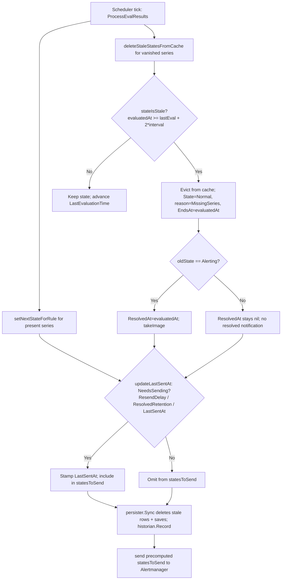

# Stale (Vanished) Alert Series Lifecycle in Grafana Unified Alerting

> **Branch:** `grafana_4550cfb5b728` &nbsp;|&nbsp; **Commit:** `4550cfb5b7` &nbsp;|&nbsp; **App version:** `11.5.0-pre`
>
> This document answers eight questions about how Grafana's unified alerting engine detects, resolves, notifies, and forgets *stale* (vanished) alert series. **The code at this exact commit is the source of truth.** Every behavioral claim carries a `file:line` citation, a short verbatim snippet, the reasoning behind it, and — where feasible — a matching line of runtime output captured by executing the package's own Go tests (`go test ./pkg/services/ngalert/state/...`). External Grafana documentation is used only to *corroborate* the code; where the public docs describe behavior newer than this commit, the divergence is flagged explicitly (see the [Version note](#version-note-code-vs-docs-divergence)).

---

## Overview: the evaluation → state → notification loop

Stale-series handling lives inside one scheduler tick. The scheduler calls `ProcessEvalResults`, which drives two **independent** code paths and then runs a shared send/persist tail:

1. **Present series** are advanced by `setNextStateForRule` — each series computes its next state (`Normal`/`Pending`/`Alerting`/`NoData`/`Error`) from the new evaluation results. Citation: `pkg/services/ngalert/state/manager.go:326`.
2. **Vanished series** are handled by `deleteStaleStatesFromCache` — series whose label set is no longer present in the results are tested against the staleness predicate; those that cross the threshold are transitioned to `Normal`/`MissingSeries` **and evicted from the in‑memory cache in the same pass**. Citation: `pkg/services/ngalert/state/manager.go:328`.
3. The two result sets are **merged** into one transition list: `allChanges := StateTransitions(append(states, staleStates...))`. Citation: `pkg/services/ngalert/state/manager.go:334`.
4. `updateLastSentAt` applies the `NeedsSending` gate to the merged set and stamps `LastSentAt` on every transition that qualifies — and it deliberately runs **before** `persister.Sync` so the new `LastSentAt` is persisted. Citation: `pkg/services/ngalert/state/manager.go:338-340` (guarded by `if send != nil`) with the ordering comment at `:335-337`.
5. `persister.Sync` mirrors the cache to the database: it **deletes** the stale rows, then saves the current states. Citation: `pkg/services/ngalert/state/persister_sync.go:38-47`.
6. `historian.Record` logs the transitions. Citation: `pkg/services/ngalert/state/manager.go:344-346`.
7. Finally, the scheduler's `send` callback converts the qualifying transitions to `PostableAlerts` and forwards them to the Alertmanager. Citation: `pkg/services/ngalert/state/manager.go:350-352` invoking the callback wired at `pkg/services/ngalert/schedule/alert_rule.go:441-455`.

The decisive entry point is `ProcessEvalResults` at `pkg/services/ngalert/state/manager.go:307-354`; the send callback is wired by the scheduler at `pkg/services/ngalert/schedule/alert_rule.go:441-455`.



Two structural facts from this loop drive most of the answers below:

- **Present and vanished series are processed by different functions.** Surviving series never enter the stale path; vanished series never enter `setNextStateForRule`. This is why one series resolving as `MissingSeries` cannot disturb its siblings (Q1).
- **The stale path both resolves *and* evicts in a single cycle.** A vanished series is removed from the cache at the moment it resolves, so it is evaluated — and therefore can notify — exactly once on its way out (the key to Q4, Q5, and Q8).

---

## Q1 — Fate of disappeared series' states in a multi-series rule

### 3.1.1 Question (verbatim)

> "When an alert fires across multiple series and some series vanish while others keep firing, what happens to the alert states of the disappeared series?"

### 3.1.2 Governing code

The two fates are decided by two different functions called from the same tick. Present series go through `setNextStateForRule`; vanished series go through `deleteStaleStatesFromCache`, which both **resolves** and **evicts** them.

`pkg/services/ngalert/state/manager.go:326-328`
```go
states := st.setNextStateForRule(ctx, alertRule, results, extraLabels, logger)

staleStates := st.deleteStaleStatesFromCache(ctx, logger, evaluatedAt, alertRule)
```

`pkg/services/ngalert/state/manager.go:589-591` (collect the stale series and evict them from the cache in one pass)
```go
staleStates := st.cache.deleteRuleStates(alertRule.GetKey(), func(s *State) bool {
    return stateIsStale(evaluatedAt, s.LastEvaluationTime, alertRule.IntervalSeconds)
})
```

`pkg/services/ngalert/state/manager.go:599-601` (the stale transition itself, applied to each evicted state inside the loop)
```go
s.State = eval.Normal
s.StateReason = ngModels.StateReasonMissingSeries
s.EndsAt = evaluatedAt
```

### 3.1.3 Rationale

A multi-dimensional rule keeps one `State` per series, keyed by the series' label fingerprint in the cache. When the query stops returning a given series, that series simply does **not** appear in `results`, so `setNextStateForRule` never touches it. Instead, `deleteStaleStatesFromCache` walks the rule's cached states and applies `stateIsStale` to each (`manager.go:589-591`). Series that cross the staleness threshold are transitioned to `eval.Normal` with `StateReason = MissingSeries` (`manager.go:599-600`) and simultaneously **removed from the cache** (the deletion happens inside `deleteRuleStates`, see Q8). Because surviving series are evaluated by an entirely separate function from new results, their states are **completely independent** — a vanished sibling resolving as `MissingSeries` has zero effect on a series that keeps firing. The merge at `manager.go:334` (`append(states, staleStates...)`) is the only point the two sets meet, and it merely concatenates them for persistence and notification.

### 3.1.4 Runtime evidence

`TestStaleResultsHandler` starts with two cached states and, after a series vanishes, ends with one — proving the vanished series is removed while the survivor is retained. `TestStaleResults` confirms the vanished series is marked `Normal`/`MissingSeries`.

```text
--- PASS: TestStaleResultsHandler (0.23s)
--- PASS: TestStaleResults (0.00s)
    --- PASS: TestStaleResults/should_mark_missing_states_as_stale (0.00s)
    --- PASS: TestStaleResults/should_remove_stale_states_from_cache (0.00s)
    --- PASS: TestStaleResults/should_delete_stale_states_from_the_database (0.00s)
ok  	github.com/grafana/grafana/pkg/services/ngalert/state	0.278s
```
(`TestStaleResultsHandler` asserts the starting state count of 2 collapses to a final count of 1; `pkg/services/ngalert/state/manager_test.go`.)

---

## Q2 — Distinguishing a stopped series from a merely slow one

### 3.2.1 Question (verbatim)

> "How does the scheduler distinguish a series that stopped reporting vs. one that is merely slow?"

### 3.2.2 Governing code

The distinction is a **two-evaluation-interval grace window** encoded in `stateIsStale`. The series' `LastEvaluationTime` is refreshed on every evaluation, so a slow-but-returning series keeps pushing the boundary forward.

`pkg/services/ngalert/state/manager.go:627-629`
```go
func stateIsStale(evaluatedAt time.Time, lastEval time.Time, intervalSeconds int64) bool {
    return !lastEval.Add(2 * time.Duration(intervalSeconds) * time.Second).After(evaluatedAt)
}
```

### 3.2.3 Rationale

There is no separate "slow" detector — the *same* predicate handles both cases by comparing wall-clock distance against `2 × interval`. Every time a series **does** return data, its state's `LastEvaluationTime` is updated to the current evaluation time (set during normal processing, and also at `manager.go:602` on the stale path). A series that is merely slow but reports at least once within any two-interval span keeps `lastEval` recent, so `lastEval + 2*interval` stays *after* `evaluatedAt` and `stateIsStale` returns **false** — it is never marked stale. Only a series that misses **two consecutive intervals** lets `evaluatedAt` reach `lastEval + 2*interval`, flipping the predicate to **true**. Thus "stopped" is operationally defined as "absent for at least two evaluation intervals," and "slow" is anything that returns inside that window.

### 3.2.4 Runtime evidence

`TestStateIsStale` exercises the grace window directly: an evaluation one interval old, or "a little less than 2 intervals" old, is **not** stale; only at/after two intervals does it become stale.

```text
--- PASS: TestStateIsStale (0.00s)
    --- PASS: TestStateIsStale/false_if_last_evaluation_is_now (0.00s)
    --- PASS: TestStateIsStale/false_if_last_evaluation_is_1_interval_before_now (0.00s)
    --- PASS: TestStateIsStale/false_if_last_evaluation_is_little_less_than_2_interval_before_now (0.00s)
    --- PASS: TestStateIsStale/true_if_last_evaluation_is_2_intervals_from_now (0.00s)
    --- PASS: TestStateIsStale/true_if_last_evaluation_is_3_intervals_from_now (0.00s)
ok  	github.com/grafana/grafana/pkg/services/ngalert/state	0.040s
```
(`TestStateIsStale`; `pkg/services/ngalert/state/manager_private_test.go`.) The `little_less_than_2_interval` case (last evaluation = `now − 2*interval + 100ms`) returning **false** is the proof that a series returning even 100 ms inside the window is treated as "slow," not "stopped."

---

## Q3 — The exact staleness formula and where the boundary is crossed

### 3.3.1 Question (verbatim)

> "There is a staleness detection threshold in the evaluation loop — trace exactly when the boundary is crossed and what FORMULA determines the cutoff."

### 3.3.2 Governing code

`pkg/services/ngalert/state/manager.go:627-629`
```go
func stateIsStale(evaluatedAt time.Time, lastEval time.Time, intervalSeconds int64) bool {
    return !lastEval.Add(2 * time.Duration(intervalSeconds) * time.Second).After(evaluatedAt)
}
```

### 3.3.3 Rationale

Read the predicate as the negation of a strict "after" comparison. `lastEval.Add(2*interval)` is the **expiry instant**. `expiry.After(evaluatedAt)` is true while we are still *before* the expiry; negating it means the series is stale exactly when the expiry instant is **not after** `evaluatedAt` — i.e.

```
stale  ⇔  evaluatedAt ≥ lastEval + 2 × intervalSeconds
```

This is a **strict** boundary because Go's `Time.After` is strict: at the precise instant `evaluatedAt == lastEval + 2*interval`, `After` returns false, so `!After` returns **true** → stale. The multiplier is the **hardcoded literal `2`** in the source; at this commit there is no configurable field that feeds it (see the [Version note](#version-note-code-vs-docs-divergence)). `intervalSeconds` is the rule's evaluation interval, `IntervalSeconds int64`, defined at `pkg/services/ngalert/models/alert_rule.go:254`.

**Worked timing example** (rule interval = 60 s, the interval used by the tests; `lastEval = T₀`):

| Evaluation time | `evaluatedAt − lastEval` | `evaluatedAt ≥ T₀ + 120s` ? | Stale? |
|---|---|---|---|
| `T₀ + 60s` (1 interval) | 60 s | no | **false** |
| `T₀ + 119.9s` (just under 2) | 119.9 s | no | **false** |
| `T₀ + 120s` (exactly 2) | 120 s | yes (equality) | **true** |
| `T₀ + 180s` (3 intervals) | 180 s | yes | **true** |

### 3.3.4 Runtime evidence

The boundary's strictness is proven by the pair of adjacent cases: `now − 2*interval + 100ms` → **false**, and exactly `now − 2*interval` → **true**.

```text
    --- PASS: TestStateIsStale/false_if_last_evaluation_is_little_less_than_2_interval_before_now (0.00s)
    --- PASS: TestStateIsStale/true_if_last_evaluation_is_2_intervals_from_now (0.00s)
```
(`TestStateIsStale`; `pkg/services/ngalert/state/manager_private_test.go`.)

---

## Q4 — What controls the resolved-notification retention window, and when it stops

### 3.4.1 Question (verbatim)

> "Once a vanished series transitions to resolved, notifications keep flowing downstream — what controls that retention window and when does the system stop sending resolved alerts to notification channels?"

### 3.4.2 Governing code

The retention window is `ResolvedRetention`, consumed by the `Normal`-state branch of `NeedsSending`. Sending stops once `LastEvaluationTime − ResolvedAt > resolvedRetention`.

`pkg/services/ngalert/state/state.go:513-514`
```go
if a.State == eval.Normal && (a.ResolvedAt == nil || a.LastEvaluationTime.Sub(*a.ResolvedAt) > resolvedRetention) {
    return false
}
```

`pkg/setting/setting_unified_alerting.go:465` (the 15-minute default)
```go
uaCfg.ResolvedAlertRetention, err = gtime.ParseDuration(valueAsString(ua, "resolved_alert_retention", (15 * time.Minute).String()))
```

### 3.4.3 Rationale

The full configuration chain is: declared as `ResolvedAlertRetention time.Duration` (`pkg/setting/setting_unified_alerting.go:125`) → defaulted to **15 minutes** via the `resolved_alert_retention` key (`setting_unified_alerting.go:465`) → wired into `ManagerCfg` (`pkg/services/ngalert/ngalert.go:415`) → set on the manager as `ResolvedRetention: cfg.ResolvedRetention` (`pkg/services/ngalert/state/manager.go:99`) → passed into every `NeedsSending` call by `updateLastSentAt` (`manager.go:362`). Inside `NeedsSending`, a state that is `Normal` (resolved) stops being sent the moment its `LastEvaluationTime − ResolvedAt` exceeds `resolvedRetention`; the same branch also returns `false` immediately if `ResolvedAt == nil` (a `Normal` state that was never firing has nothing to "resolve").

**Critical nuance — which series actually "keeps flowing":** a *vanished/stale* series is **evicted from the cache in the same cycle it resolves** (Q1/Q8), so it is never evaluated again and emits its resolved notification at most **once**. The behavior of resolved notifications that "keep flowing downstream for a while" therefore describes a **series that remains present** but has returned to `Normal`: it stays cached with `ResolvedAt` set and is re-sent on each cycle (gated by `ResendDelay`, see Q5) until `LastEvaluationTime − ResolvedAt` crosses the 15-minute `ResolvedRetention`, after which `NeedsSending` returns `false` and the channel goes quiet. So the retention window bounds the *present-and-resolved* case; the *vanished* case is bounded instead by eviction.

### 3.4.4 Runtime evidence

`TestNeedsSending` includes the decisive retention cases. A state resolved 16 minutes ago (beyond the 15-minute retention) is **not** sent even though the resend delay has elapsed; one resolved within the window still sends.

```text
    --- PASS: TestNeedsSending/state:_normal_+_not_recently_resolved_should_not_send_even_with_wait (0.00s)
    --- PASS: TestNeedsSending/state:_normal_+_recently_resolved_should_send_with_wait (0.00s)
    --- PASS: TestNeedsSending/state:_normal_but_not_resolved_does_not_send_after_a_minute (0.00s)
    --- PASS: TestNeedsSending/state:_normal_+_resolved_should_send_without_waiting_if_ResolvedAt_>_LastSentAt (0.00s)
ok  	github.com/grafana/grafana/pkg/services/ngalert/state	0.041s
```
(`TestNeedsSending`; `pkg/services/ngalert/state/state_test.go`. The "not recently resolved" case uses `ResolvedAt = now − 16m` against a 15-minute retention → expected `false`; the "recently resolved" case uses `ResolvedAt = now − 2m` → expected `true`.)

---

## Q5 — Interplay of ResendDelay, ResolvedRetention, and LastSentAt across cycles

### 3.5.1 Question (verbatim)

> "The interplay between the RESEND DELAY, the RESOLVED RETENTION PERIOD, and the LAST SENT TIMESTAMP during repeated evaluation cycles."

### 3.5.2 Governing code

`NeedsSending` reads all three values and applies three rules in order; `updateLastSentAt` stamps `LastSentAt` after a qualifying send and runs **before** persistence.

Each rule is shown below with its own citation. **(a) Resolved-since-last-notification** — `pkg/services/ngalert/state/state.go:507-509`:
```go
if a.ResolvedAt != nil && (a.LastSentAt == nil || a.ResolvedAt.After(*a.LastSentAt)) {
    return true
}
```

**(b) Retention cutoff for `Normal` states** — `pkg/services/ngalert/state/state.go:513-515`:
```go
if a.State == eval.Normal && (a.ResolvedAt == nil || a.LastEvaluationTime.Sub(*a.ResolvedAt) > resolvedRetention) {
    return false
}
```

**(c) The resend gate** — `pkg/services/ngalert/state/state.go:519`:
```go
return a.LastSentAt == nil || !a.LastSentAt.Add(resendDelay).After(a.LastEvaluationTime)
```

`pkg/services/ngalert/state/manager.go:362-363`
```go
if t.NeedsSending(st.ResendDelay, st.ResolvedRetention) {
    t.LastSentAt = &evaluatedAt
```

### 3.5.3 Rationale

`ResendDelay` is the package var `ResendDelay = 30 * time.Second` (`pkg/services/ngalert/state/manager.go:24`); `ResolvedRetention` defaults to 15 m (Q4). `NeedsSending` evaluates three short-circuiting rules:

- **(a) Resolved-since-last-notification** (`state.go:507-508`): if the state has a `ResolvedAt` that is newer than the last `LastSentAt` (or it has never been sent), send **immediately** — the user must learn of a resolution without waiting for the resend delay.
- **(b) Retention cutoff for Normal states** (`state.go:513-514`): a `Normal` state stops sending once it is past `resolvedRetention` (or was never resolved). This bounds how long resolved re-notifications continue.
- **(c) Resend gate** (`state.go:519`): otherwise (e.g., a still-`Alerting` state, or a resolved state inside the retention window) re-send only when `LastSentAt + resendDelay` is **not after** `LastEvaluationTime` — i.e., at least `resendDelay` has elapsed since the last send.

`updateLastSentAt` (`manager.go:359-368`) stamps `LastSentAt = evaluatedAt` for each transition that passes the gate, and its doc comment notes it is **not idempotent** — running it twice yields different results — which is why `ProcessEvalResults` calls it exactly once, *before* `persister.Sync`, so the new `LastSentAt` is persisted (`manager.go:335-340`).

**Multi-cycle example** (still-present series, interval = 1 m, `ResendDelay = 30 s`, `ResolvedRetention = 15 m`):

| Cycle | State | `ResolvedAt` | `LastSentAt` before | Rule hit | Send? | `LastSentAt` after |
|---|---|---|---|---|---|---|
| Firing at `T₀` | Alerting | – | nil | (c) (nil) | yes | `T₀` |
| `T₀+1m` still firing | Alerting | – | `T₀` | (c): `T₀+30s` not after `T₀+1m` | yes | `T₀+1m` |
| `T₁` resolves | Normal | `T₁` | `T₀+1m` | (a): `ResolvedAt > LastSentAt` | yes | `T₁` |
| `T₁+1m` | Normal | `T₁` | `T₁` | (b) passes (1m<15m); (c) sends | yes | `T₁+1m` |
| … each minute … | Normal | `T₁` | … | (c) (1m ≥ 30s) | yes | advances |
| `T₁+16m` | Normal | `T₁` | `T₁+15m` | (b): `16m > 15m` | **no** | unchanged |

The next re-send therefore lands on the **first evaluation cycle** that satisfies `LastSentAt + ResendDelay <= LastEvaluationTime`, so the effective cadence depends on how the evaluation ticks align with `ResendDelay` and is **not** simply `max(interval, ResendDelay)`. In the table above the interval (60 s) exceeds `ResendDelay` (30 s), so every tick passes the gate and the cadence equals the interval; but when the interval is **shorter** than `ResendDelay`, the next send lands on the first tick at or beyond `ResendDelay` — e.g. with a 20 s interval and the 30 s `ResendDelay`, the next send is 40 s after the prior one, not 30 s. The stream stops once retention is exceeded (rule (b)).

### 3.5.4 Runtime evidence

`TestNeedsSending`'s alerting cases exercise the resend gate `LastSentAt + ResendDelay <= LastEvaluationTime` (equivalently `LastSentAt <= LastEvaluationTime − ResendDelay`). With `ResendDelay = 1m` and `LastEvaluationTime = T`: a `LastSentAt` of `T − 2m` sends, a `LastSentAt` of exactly `T − 1m` still sends (the boundary is **inclusive** because the code uses `!After`), and a `LastSentAt` of `T` does not. The subtest names phrase the boundary as `LastEvaluationTime + ResendDelay`, but the code compares `LastSentAt + ResendDelay` against `LastEvaluationTime`.

```text
    --- PASS: TestNeedsSending/state:_alerting_and_LastSentAt_before_LastEvaluationTime_+_ResendDelay (0.00s)
    --- PASS: TestNeedsSending/state:_alerting_and_LastSentAt_after_LastEvaluationTime_+_ResendDelay (0.00s)
    --- PASS: TestNeedsSending/state:_alerting_and_LastSentAt_equals_LastEvaluationTime_+_ResendDelay (0.00s)
    --- PASS: TestNeedsSending/state:_alerting_and_ResendDelay_is_zero (0.00s)
    --- PASS: TestNeedsSending/state:_no-data,_needs_to_be_re-sent (0.00s)
    --- PASS: TestNeedsSending/state:_error,_should_not_be_re-sent (0.00s)
ok  	github.com/grafana/grafana/pkg/services/ngalert/state	0.041s
```
(`TestNeedsSending`, 14 subtests all passing; `pkg/services/ngalert/state/state_test.go`.)

---

## Q6 — Screenshot capture: stale resolution vs. natural resolution

### 3.6.1 Question (verbatim)

> "Do stale-series resolutions trigger the same SCREENSHOT capture behavior as alerts that resolve naturally via metric values dropping, or a different path?"

### 3.6.2 Governing code

Both paths end in the same `takeImage` → `NewImage` capture, but they **reach** it differently. Stale resolution calls `takeImage` **directly** and only when the prior state was `Alerting`:

`pkg/services/ngalert/state/manager.go:604-606`
```go
if oldState == eval.Alerting {
    s.ResolvedAt = &evaluatedAt
    image, err := takeImage(ctx, st.images, alertRule)
```

Natural resolution routes through the `shouldTakeImage` gate inside `setNextState`:

`pkg/services/ngalert/state/manager.go:513-514`
```go
if shouldTakeImage(currentState.State, oldState, currentState.Image, newlyResolved) {
    image, err := takeImage(ctx, st.images, alertRule)
```

`pkg/services/ngalert/state/state.go:581-585` (the gate predicate)
```go
func shouldTakeImage(state, previousState eval.State, previousImage *models.Image, resolved bool) bool {
    return resolved ||
        state == eval.Alerting && previousState != eval.Alerting ||
        state == eval.Alerting && previousImage == nil
}
```

### 3.6.3 Rationale

The **content** of the screenshot is identical because both routes call the same helper, `takeImage`, which delegates to `ScreenshotImageService.NewImage` (`pkg/services/ngalert/state/state.go:589-600`, calling `pkg/services/ngalert/image/service.go:120`). What differs is the **trigger path**:

- **Natural resolution** (a present series whose value drops below threshold) is detected in `setNextState`: when `oldState == Alerting && currentState.State == Normal`, `newlyResolved` is set (`manager.go:506-507`), and `shouldTakeImage(..., resolved=true)` returns true via its first disjunct, so an image is captured for the resolved transition.
- **Stale resolution** never enters `setNextState` (the series is gone). `deleteStaleStatesFromCache` instead calls `takeImage` inline, **guarded only by `oldState == eval.Alerting`** (`manager.go:604`). There is no `shouldTakeImage` call on this path.

Both routes converge on the same fallback semantics: `takeImage` returns `nil, nil` when rendering is unavailable or no dashboard/panel is associated — `ErrScreenshotsUnavailable` (`pkg/services/screenshot/screenshot.go:27`, returned by `ScreenshotUnavailableService.Take` at `:168-169`), `ErrNoDashboard`, and `ErrNoPanel` are swallowed (`state.go:592-595`). So when rendering is disabled, **both** paths produce no image, identically. In short: **same capture, same fallback, different gate.**

### 3.6.4 Runtime evidence

`TestShouldTakeImage` confirms the natural-resolution gate fires for a resolved state, and `TestTakeImage` confirms `takeImage` returns nil on `ErrScreenshotsUnavailable` (the shared fallback both paths inherit).

```text
    --- PASS: TestShouldTakeImage/should_take_image_for_resolved_state (0.00s)
    --- PASS: TestShouldTakeImage/should_not_take_image_for_normal_state (0.00s)
--- PASS: TestTakeImage (0.00s)
    --- PASS: TestTakeImage/ErrScreenshotsUnavailable_should_return_nil (0.00s)
    --- PASS: TestTakeImage/ErrNoDashboard_should_return_nil (0.00s)
    --- PASS: TestTakeImage/image_should_be_returned (0.00s)
```
(`TestShouldTakeImage` / `TestTakeImage`; `pkg/services/ngalert/state/state_test.go`.) Note that `TestStaleResultsHandler` constructs the manager with a `NoopImageService` (`pkg/services/ngalert/state/manager_test.go`), i.e. the stale path is exercised with image capture stubbed — the *path* difference is established from the code above, while the *capture/fallback* equivalence is established by `TestTakeImage`.

---

## Q7 — Does a configured pending period (`For`) gate the stale exit?

### 3.7.1 Question (verbatim)

> "If a rule has a PENDING PERIOD configured, do vanishing series honor that waiting time or skip straight to resolved?"

### 3.7.2 Governing code

`deleteStaleStatesFromCache` transitions a stale series straight to `Normal`/`MissingSeries` with **no `For`/pending check anywhere in the function**, and assigns `ResolvedAt` **only** when the prior state was `Alerting`.

`pkg/services/ngalert/state/manager.go:599-601` (immediate transition to `Normal`/`MissingSeries` — no `For`/pending check)
```go
s.State = eval.Normal
s.StateReason = ngModels.StateReasonMissingSeries
s.EndsAt = evaluatedAt
```

`pkg/services/ngalert/state/manager.go:604-605` (`ResolvedAt` is set only when the prior state was `Alerting`)
```go
if oldState == eval.Alerting {
    s.ResolvedAt = &evaluatedAt
```

### 3.7.3 Rationale

The pending period (`For`) governs the **entry** into `Alerting` — a breaching series sits in `Pending` until `For` elapses, then fires. It plays **no role on the way out via staleness.** `deleteStaleStatesFromCache` contains no reference to `For`, no `Pending` handling, and no timer beyond the `2 × interval` staleness threshold; once `stateIsStale` is true, the series is set to `Normal`/`MissingSeries` **immediately** and evicted. So vanishing series **skip straight to resolved** — they do not honor any additional waiting time beyond the two-interval staleness window itself.

A crucial corollary follows from the `oldState == eval.Alerting` guard (`manager.go:604`): `ResolvedAt` is set **only** for series that were actually `Alerting` when they vanished. A series that was still `Pending` (breaching but never having satisfied `For`, so it never fired) vanishes with `ResolvedAt` left `nil`. By Q4/Q5 rule (a)/(b), a `Normal` state with `ResolvedAt == nil` does **not** produce a resolved notification (`state.go:513-514` returns `false`). Hence a never-fired pending series resolves silently — no resolved alert is sent for it.

### 3.7.4 Runtime evidence

`TestStaleResults` constructs two `Alerting` series and one `Normal` series, lets them go missing, and asserts the immediate transition to `Normal`/`MissingSeries` with `ResolvedAt` set **only** for the formerly-`Alerting` instances — no extra waiting cycles.

```text
--- PASS: TestStaleResults/should_mark_missing_states_as_stale (0.00s)
--- PASS: TestStaleResultsHandler (0.23s)
ok  	github.com/grafana/grafana/pkg/services/ngalert/state	0.278s
```
(`TestStaleResults` asserts `eval.Normal`, `StateReasonMissingSeries`, and `EndsAt == clk.Now()` at the threshold, with `ResolvedAt` populated only for the series that were `Alerting`; `pkg/services/ngalert/state/manager_test.go`.)

---

## Q8 — Reappearance with identical labels: same entity or brand-new instance?

### 3.8.1 Question (verbatim)

> "When a vanished series later REAPPEARS with identical labels, is it recognized as the same entity or treated as a brand new alert instance?"

### 3.8.2 Governing code

Instance identity is the label **fingerprint** used as the cache key; but a stale series is **evicted** from that cache, so a later lookup misses and a fresh `State` is built.

`pkg/services/ngalert/state/cache.go:149` (identity)
```go
cacheID := lbs.Fingerprint()
```

`pkg/services/ngalert/state/cache.go:174-176` (miss → fresh state)
```go
existingState := c.get(alertRule.OrgID, alertRule.UID, cacheID)
if existingState == nil {
    return &newState
```

`pkg/services/ngalert/state/cache.go:248` (the eviction that caused the miss)
```go
delete(rs.states, id)
```

### 3.8.3 Rationale

Identity is **fingerprint-based**: two series with identical label sets hash to the same `cacheID` (`cache.go:149`), so in principle a reappearing series maps to the "same" key. **But history does not survive eviction.** When the series went stale, `deleteStaleStatesFromCache` called `cache.deleteRuleStates` (`manager.go:589`), which acquires the lock and calls `deleteStates`, deleting the entry from the per-rule map via `delete(rs.states, id)` (`cache.go:244-263`). When the identical-label series later reappears, the cache's `create` method (`cache.go:146`, invoked from `manager.go:412`) looks it up with `c.get(...)` (`cache.go:174`), the lookup **misses** (`existingState == nil`), and a brand-new `State` is returned (`cache.go:175-176`) with freshly initialized fields — `StartsAt`/`EndsAt`/`LastEvaluationTime` set to the new evaluation time and, critically, `ResolvedAt = nil` and `LastSentAt = nil` (the `newState` literal at `cache.go:165-170`). The eviction is mirrored to the database by the persister, which deletes stale rows before saving (`pkg/services/ngalert/state/persister_sync.go:38-47`), so there is no durable history to rehydrate either.

**Conclusion:** the reappearing series shares the **same identity key** but carries **no surviving state history** — it is, for all practical purposes (start time, resolved time, last-sent time, alerting duration), a **brand-new alert instance**.

### 3.8.4 Runtime evidence

`TestStaleResults` asserts the stale state is removed from the cache (and the DB), proving the entry is gone; therefore any later lookup with the same fingerprint must recreate it.

```text
    --- PASS: TestStaleResults/should_remove_stale_states_from_cache (0.00s)
    --- PASS: TestStaleResults/should_delete_stale_states_from_the_database (0.00s)
--- PASS: TestStaleResultsHandler (0.23s)
ok  	github.com/grafana/grafana/pkg/services/ngalert/state	0.278s
```
(`TestStaleResultsHandler`'s starting-count 2 → final-count 1 demonstrates the vanished entry is fully evicted; `pkg/services/ngalert/state/manager_test.go`.)

---

## Summary table

| Question | Mechanism | Governing code site |
|---|---|---|
| **Q1** — Fate of disappeared series in a multi-series rule | Vanished series are resolved to `Normal`/`MissingSeries` and evicted; surviving series are processed independently by a separate function | `pkg/services/ngalert/state/manager.go:326-328`, `:586-625` |
| **Q2** — Stopped vs. merely slow | Two-evaluation-interval grace window; `LastEvaluationTime` is refreshed whenever a series returns, so a slow series never crosses the threshold | `pkg/services/ngalert/state/manager.go:627-629` (+ `:602`) |
| **Q3** — Exact staleness formula & boundary | `stale ⇔ evaluatedAt ≥ lastEval + 2 × intervalSeconds`, a strict boundary; `2` is a hardcoded literal | `pkg/services/ngalert/state/manager.go:627-629` |
| **Q4** — Resolved-notification retention window | `ResolvedRetention` (default 15 m); `NeedsSending` returns `false` once `LastEvaluationTime − ResolvedAt > resolvedRetention` | `pkg/services/ngalert/state/state.go:513-514`; default `pkg/setting/setting_unified_alerting.go:465` |
| **Q5** — ResendDelay / ResolvedRetention / LastSentAt interplay | `NeedsSending` applies (a) resolved-since-last, (b) retention cutoff, (c) `LastSentAt + ResendDelay` resend gate; `updateLastSentAt` stamps `LastSentAt` before `Sync` | `pkg/services/ngalert/state/state.go:500-519`; `manager.go:359-368`, `:24` |
| **Q6** — Screenshot path for stale vs. natural resolution | Same `takeImage`→`NewImage` capture & fallback; stale calls `takeImage` directly (only `Alerting`→stale), natural routes through `shouldTakeImage` | `pkg/services/ngalert/state/manager.go:604-606` vs. `:513-514` + `state.go:581-585` |
| **Q7** — Does pending period (`For`) gate the stale exit? | No `For` check on the stale path — immediate transition to `Normal`/`MissingSeries`; `ResolvedAt` set only if `oldState == Alerting` | `pkg/services/ngalert/state/manager.go:586-625` (esp. `:604-605`) |
| **Q8** — Reappearance with identical labels | Same `Fingerprint` identity key, but the prior entry was evicted, so the lookup misses and a fresh `State` is created with no carried history | `pkg/services/ngalert/state/cache.go:149`, `:174-176`, `:244-263` |

---

## Constants table

| Constant | Value | Definition site | Notes |
|---|---|---|---|
| `ResendDelay` | `30 * time.Second` (30 s) | `pkg/services/ngalert/state/manager.go:24` | Package-level var; the wiring comment at `manager.go:98` reads `// TODO: make this configurable` — not configurable at this commit. |
| `ResolvedRetention` (resolved-notification retention) | default `15 * time.Minute` (15 m) | declared `pkg/setting/setting_unified_alerting.go:125`; default `:465` (key `resolved_alert_retention`); wired `pkg/services/ngalert/ngalert.go:415`; set on `Manager` `pkg/services/ngalert/state/manager.go:99` | Configurable via the `resolved_alert_retention` setting key. |
| Staleness threshold | `2 × IntervalSeconds` | `pkg/services/ngalert/state/manager.go:627-629` | The multiplier `2` is a **hardcoded literal**; there is no configurable field feeding it at this commit. |
| `StateReasonMissingSeries` | `"MissingSeries"` | `pkg/services/ngalert/models/alert_rule.go:160` | The `StateReason` annotation set on a stale-resolved instance. |

---

## Version note (code-vs-docs divergence)

At commit `4550cfb5b7`, the staleness multiplier is the **hardcoded literal `2`** inside `stateIsStale` (`pkg/services/ngalert/state/manager.go:627-629`), and there is **no** configurable "Missing series evaluations to resolve" field in the alert-rule model — the only relevant field is `IntervalSeconds` (`pkg/services/ngalert/models/alert_rule.go:254`), which feeds the formula but does not change the `2`.

Newer public Grafana documentation describes a configurable *Missing series evaluations to resolve* setting; per the Grafana docs the default is <q>2 by default</q>, which matches this commit's hardcoded value. A repository-wide search at this commit finds no `MissingSeriesEvalsToResolve` (or equivalent) configurable field on the `AlertRule` model, so the multiplier remains the literal `2`. The newer docs and the default-of-two it cites serve here as **corroboration only**; the binding answer is the code at `4550cfb5b7`, where the threshold is fixed at `2 × interval`. The same docs corroborate the `grafana_state_reason = MissingSeries` annotation and that a resolved notification is sent only if the instance was previously firing — both consistent with the `oldState == eval.Alerting` guard at `manager.go:604`.

---

## Appendix — the five critical nuances, restated

1. **Send-once-then-evicted vs. persistent resend (Q4/Q5).** A vanished/stale series is evicted in the same cycle it resolves (`cache.go:244-263` via `manager.go:589`), so its resolved notification fires **once**. A series that *remains present* but returns to `Normal` stays cached with `ResolvedAt` set and re-sends every `ResendDelay` (30 s) until `ResolvedRetention` (15 m) elapses (`state.go:500-519`) — this is what "keeps flowing downstream for a while."
2. **Two resolution paths diverge only on the image gate (Q6).** Natural resolution flows through `shouldTakeImage`; stale resolution calls `takeImage` directly and only for `Alerting`→stale. Same end capture (`NewImage`), same fallback, different trigger.
3. **Pending bypass (Q7).** The stale exit ignores `For`; a never-fired `Pending` series resolves without `ResolvedAt`, so no resolved notification is emitted for it.
4. **Identity persists, history does not (Q8).** The `Fingerprint` key is stable, but eviction means a reappearing identical-label series is created fresh, with no carried `StartsAt`/`ResolvedAt`/`LastSentAt`.
5. **`stateIsStale` boundary is strict and hardcoded (Q2/Q3).** `2 × interval`, literal `2`, no config field at this commit; the boundary is reached at exact equality because `time.After` is strict.

