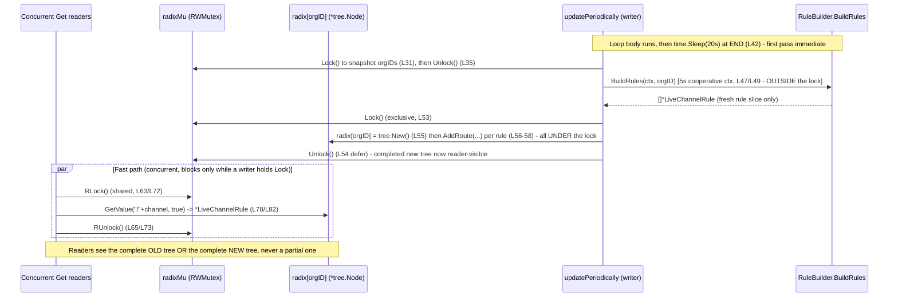

# How Grafana Live's Channel-Rule Routing Layer Stays Coherent While Running

## TL;DR (one-line answer)

Grafana Live's channel-rule *routing layer* is a **per-organization radix tree kept behind a single `sync.RWMutex`** (`pkg/services/live/pipeline/rule_cache_segmented.go:14-15`). A background goroutine, launched the moment the cache is constructed (`rule_cache_segmented.go:24`), refreshes each organization's routes roughly every 20 seconds (`rule_cache_segmented.go:42`) via `fillOrg` (`rule_cache_segmented.go:46-60`). The refresh does exactly one thing *outside* the lock — it calls the (potentially slow) rule builder to produce a fresh **rule slice** (`rule_cache_segmented.go:49`); it then takes the exclusive write lock (`rule_cache_segmented.go:53`) and, **still holding that lock**, allocates a brand-new empty tree (`s.radix[orgID] = tree.New()`, `rule_cache_segmented.go:55`) and repopulates it route-by-route (`rule_cache_segmented.go:56-58`) before releasing via `defer Unlock` (`rule_cache_segmented.go:54`). Because a reader's `Get` takes the shared read lock (`rule_cache_segmented.go:72`) and the writer holds the exclusive lock across the *entire* allocate-and-repopulate, a reader can never observe a half-built or empty tree — the completed replacement becomes visible **only after `Unlock`**, so each reader sees either the complete old snapshot or the complete new one. The atomicity is provided by the `RWMutex`, not by a lock-free pointer swap; the authoritative view at any instant is exactly the `*tree.Node` that `s.radix[orgID]` points to *right now*. This document is written **run-first**: every behavioral claim below sits next to the exact command that produced it and its complete, unedited output, captured at HEAD `4550cfb5b72886782d9a3e6cf995f8dbd57ca4ff`.

---

## Table of Contents

- [TL;DR (one-line answer)](#tldr-one-line-answer)
- [1. The Question Being Answered](#1-the-question-being-answered)
- [2. Investigation Environment and Methodology](#2-investigation-environment-and-methodology)
- [3. Canonical-Path Caveat (Read Before the Numbers)](#3-canonical-path-caveat-read-before-the-numbers)
- [4. The Temporary Observation Harness (Since Removed)](#4-the-temporary-observation-harness-since-removed)
- [5. Build and Baseline](#5-build-and-baseline)
- [6. Q1: Where the Routing Flow First Takes Shape](#6-q1-where-the-routing-flow-first-takes-shape)
- [7. Q2: The Old-to-New Transition and the Authoritative View](#7-q2-the-old-to-new-transition-and-the-authoritative-view)
- [8. Q3: Are Incomplete or Stale Routes Ever Exposed?](#8-q3-are-incomplete-or-stale-routes-ever-exposed)
- [9. Q4: Weaving Fast Requests with Periodic Updates](#9-q4-weaving-fast-requests-with-periodic-updates)
- [10. Reader and Writer Sequence Diagram](#10-reader-and-writer-sequence-diagram)
- [11. Key Insights: The Intuitive Feel](#11-key-insights-the-intuitive-feel)
- [12. Source Citations](#12-source-citations)

---

## 1. The Question Being Answered

The investigation question, faithful to the original intent, is: *how does Grafana Live's live-route routing layer stay coherent while it is actively running — when the set of live routes is being refreshed in the background at the same time users are joining and leaving channels?* It decomposes into four distinct, individually answerable sub-questions, each addressed in its own numbered section below:

- **Q1 — Where the routing flow first takes shape:** the entry point / initialization, the lazy per-organization fill on first lookup, and where and when the background refresh begins. (See [Section 6](#6-q1-where-the-routing-flow-first-takes-shape).)
- **Q2 — The old-to-new routing-view transition:** how a stale routing view is replaced by a fresh one, and **which view is authoritative** at any instant. (See [Section 7](#7-q2-the-old-to-new-transition-and-the-authoritative-view).)
- **Q3 — Incomplete/stale exposure:** under surging subscriptions and rapidly changing rules, is a **partial or empty** route ever exposed, or is a **stable, complete snapshot** always preserved (possibly stale-but-complete)? (See [Section 8](#8-q3-are-incomplete-or-stale-routes-ever-exposed).)
- **Q4 — Weaving fast requests with periodic updates:** the concurrency discipline that lets many concurrent lookups coexist with a periodic writer without losing routing integrity. (See [Section 9](#9-q4-weaving-fast-requests-with-periodic-updates).)

The single mechanism that answers all four is the `CacheSegmentedTree` struct and its methods — `NewCacheSegmentedTree`, `updatePeriodically`, `fillOrg`, and `Get` — in `pkg/services/live/pipeline/rule_cache_segmented.go` (83 lines total).

---

## 2. Investigation Environment and Methodology

**Run-first methodology.** This is a read-only, run-first investigation: the relevant code paths were **built and run first**, and this document is written **from the captured output** — not from reading alone. Every behavioral claim is accompanied by (a) the exact command that produced it and (b) its complete, unedited output, and carries a `file:line` citation. Statements that are reasoned from code structure rather than observed at runtime are explicitly labelled *(inferred from `file:line`)*.

**Toolchain.** Go **1.23.1** (the repository's `go.mod` declares `go 1.23.1` at `go.mod:3`), installed at `/usr/local/go`. The repository is a Go **workspace** (a `go.work` file is present at the repository root), so builds run in **default workspace mode**. `GOFLAGS=-mod=mod` must **not** be set — it fails in a workspace. The Go binary is available on the default `PATH` in a fresh shell — a symlink `/usr/local/bin/go -> /usr/local/go/bin/go` is present, so `go version` works without any manual setup (verified: `env -i bash -lc 'go version'` prints `go version go1.23.1 linux/amd64`, and `env -i bash -c 'command -v go'` prints `/usr/local/bin/go`). For reproducibility, the commands below are still shown with an explicit, *optional* `export PATH=$PATH:/usr/local/go/bin` prefix; it is not required for `go` to resolve:

```bash
export PATH=$PATH:/usr/local/go/bin   # optional — go is already on the default PATH via /usr/local/bin/go
```

**Machine (read from the benchmark headers below).** `goos: linux`, `goarch: amd64`, `cpu: Intel(R) Xeon(R) CPU @ 2.60GHz`, and `GOMAXPROCS=128` (evidenced by the `-128` suffix on the benchmark names).

**Isolated build unit.** The `pipeline` package builds and tests cleanly with **no special build tags**, which makes it the clean, self-contained unit for isolated runtime observation. In this environment the *whole* `pkg/services/live/` package also builds cleanly with no special tags (see [Section 5](#5-build-and-baseline) for the exact commands and exit codes); the investigation stays at the `pipeline` package level not because the enclosing package fails to build, but because that is the smallest unit that exercises the exact routing mechanism in isolation and the canonical construction path is reachable from it (see [Section 3](#3-canonical-path-caveat-read-before-the-numbers)).

**Canonical path.** See [Section 3](#3-canonical-path-caveat-read-before-the-numbers) — in this commit the persistent server-side routing pipeline is dormant (nil), so the observations come from the **package-level canonical path** (`NewCacheSegmentedTree` exercised by an in-package test), which is the *identical* routing mechanism the sole non-test production construction site (the dry-run endpoint `HandlePipelineConvertTestHTTP`) also uses.

**Stability.** Each of Q1–Q4 was run at least twice; where a measured value is reported, all samples are shown. Counts that depend on run duration or reader scale are labelled as such, and the *stable invariants* (e.g. `misses=0`, no `DATA RACE`, `samePointer=false`, refresh gaps `0s, 0s, ~20s, ~20s`) are called out as the durable claims.

---

## 3. Canonical-Path Caveat (Read Before the Numbers)

This caveat is mandatory and is referenced from every question section below.

**The persistent server-side routing pipeline is dormant (nil) in this commit.** The `GrafanaLive` struct holds a `Pipeline *pipeline.Pipeline` field (`pkg/services/live/live.go:411`), but that field is **never assigned** anywhere in the package. A repository-wide search for `.Pipeline =` / `Pipeline:` assignments outside tests returns no matches — the command prints nothing on stdout and exits with status `1`:

**Command:**
```bash
grep -rn "\.Pipeline =\|Pipeline:" pkg/services/live/ --include="*.go" | grep -v "_test.go"; echo "exit_status=$?"
```
**Output (complete, unedited):**
```
exit_status=1
```
*(The `grep` produced zero lines on stdout; `exit_status=1` is grep's "no lines selected" exit code — that is the evidence that there are no such assignments.)*

The field is even passed as **nil** into the constructors that would consume it — `liveplugin.NewChannelLocalPublisher(node, g.Pipeline)` (`live.go:174`) and `pushws.NewPipelinePushHandler(g.Pipeline, ...)` (`live.go:285`) — and every routing read on the server path is guarded by `if g.Pipeline != nil` (`live.go:638`, `live.go:735`, `live.go:969`), guarding `g.Pipeline.Get(...)` (`live.go:639`, `live.go:736`, `live.go:970`) and `g.Pipeline.ProcessInput(...)` (`live.go:760`, `live.go:990`). With the field nil, those guarded blocks never execute, so the whole-server WebSocket routing pipeline is **dormant** in the default build. *(Observed: the grep above. Inferred from the nil-guards at `live.go:638/735/969` that the guarded reads never run when the field is nil.)*

**What the canonical observable paths actually are.** There are exactly two:

1. **The dry-run HTTP endpoint** `HandlePipelineConvertTestHTTP` (function at `live.go:1123`). This is the **sole non-test** site that constructs the routing cache, via `pipeline.NewCacheSegmentedTree(builder)` (`live.go:1143`), and immediately calls `channelRuleGetter.Get(...)` (`live.go:1148`).
2. **The `pipeline` package's own tests**, which construct the cache the same way — `NewCacheSegmentedTree(&testBuilder{})` (`rule_cache_segmented_test.go:34` and `:57`).

A repository-wide search confirms `NewCacheSegmentedTree` has exactly one non-test call site and two test call sites, plus its definition:

**Command:**
```bash
grep -rn "NewCacheSegmentedTree" pkg/ --include="*.go"
```
**Output (complete, unedited):**
```
pkg/services/live/live.go:1143:	channelRuleGetter := pipeline.NewCacheSegmentedTree(builder)
pkg/services/live/pipeline/rule_cache_segmented.go:19:func NewCacheSegmentedTree(storage RuleBuilder) *CacheSegmentedTree {
pkg/services/live/pipeline/rule_cache_segmented_test.go:34:	s := NewCacheSegmentedTree(&testBuilder{})
pkg/services/live/pipeline/rule_cache_segmented_test.go:57:	s := NewCacheSegmentedTree(&testBuilder{})
```

**Therefore all runtime observations in this document come from the package-level canonical path** — an in-package test invoking the *real* `NewCacheSegmentedTree` / `fillOrg` / `Get` functions, which exercise the identical routing mechanism the dry-run endpoint uses. These values are labelled **package-level canonical**, and are explicitly **not** full-server behavior.

**Non-canonical dev-only hooks (excluded from the observed path).** Two environment-gated hooks exist in `pipeline.go` and are labelled non-canonical: `GF_LIVE_PIPELINE_TRACE` (`pipeline.go:193`) enables Jaeger tracing "for development only," and `GF_LIVE_PIPELINE_DEV` (`pipeline.go:206`) launches `go postTestData()` (`pipeline.go:207`), whose own source comment reads `// TODO: temporary for development, remove before merge.` Neither is part of the observed routing path.

---

## 4. The Temporary Observation Harness (Since Removed)

To capture the runtime evidence in the sections that follow, a **temporary in-package test file** was placed at `pkg/services/live/pipeline/zz_blitzy_obs_temp_test.go`, run to produce the Q1–Q4 output, and then **deleted**. It was never committed. It is reproduced here **in full** (not summarized) so readers can see exactly what produced every number below; no code file was added to the repository as part of this deliverable.

Being in `package pipeline` is what allowed the harness to read the unexported `radix` map and `radixMu` mutex and to call the unexported `fillOrg` method directly. It uses the **canonical constructor `NewCacheSegmentedTree`** — the same one used by production `live.go:1143` and by the existing `rule_cache_segmented_test.go` — so it drives the real `fillOrg` swap and the real `Get` read path.

```go
package pipeline

// TEMPORARY OBSERVATION HARNESS — created solely to capture runtime evidence for
// the blitzy investigation of CacheSegmentedTree (Q1-Q4). This file is DELETED
// after capture and MUST NOT be committed. It is in package pipeline so it can
// inspect the unexported radix map / radixMu mutex and call unexported fillOrg.

import (
	"context"
	"fmt"
	"sync"
	"sync/atomic"
	"testing"
	"time"
)

type obsBuilder struct {
	mu      sync.Mutex
	calls   int
	times   []time.Time
	orgs    []int64
	delay   time.Duration
	rulesFn func(orgID int64) []*LiveChannelRule
}

func (b *obsBuilder) BuildRules(_ context.Context, orgID int64) ([]*LiveChannelRule, error) {
	b.mu.Lock()
	b.calls++
	b.times = append(b.times, time.Now())
	b.orgs = append(b.orgs, orgID)
	delay := b.delay
	fn := b.rulesFn
	b.mu.Unlock()
	if delay > 0 {
		time.Sleep(delay)
	}
	return fn(orgID), nil
}

func (b *obsBuilder) callCount() int           { b.mu.Lock(); defer b.mu.Unlock(); return b.calls }
func (b *obsBuilder) setDelay(d time.Duration) { b.mu.Lock(); defer b.mu.Unlock(); b.delay = d }
func (b *obsBuilder) snapshot() ([]time.Time, []int64) {
	b.mu.Lock()
	defer b.mu.Unlock()
	ts := make([]time.Time, len(b.times))
	copy(ts, b.times)
	og := make([]int64, len(b.orgs))
	copy(og, b.orgs)
	return ts, og
}

// rulesV1 (OLD): only the named-parameter route, no exact cpu route.
func rulesV1() []*LiveChannelRule {
	return []*LiveChannelRule{
		{OrgId: 1, Pattern: "stream/telegraf/:metric"},
	}
}

// rulesV2 (NEW): exact cpu route wins over the named-parameter route.
func rulesV2() []*LiveChannelRule {
	return []*LiveChannelRule{
		{OrgId: 1, Pattern: "stream/telegraf/cpu"},
		{OrgId: 1, Pattern: "stream/telegraf/:metric"},
	}
}

func fmtElapsed(d time.Duration) string {
	return d.Round(time.Millisecond).String()
}

// Q1: entry point, lazy per-org fill, refresh cadence.
func TestObs_Q1_EntryPointAndCadence(t *testing.T) {
	b := &obsBuilder{rulesFn: func(int64) []*LiveChannelRule { return rulesV2() }}
	s := NewCacheSegmentedTree(b)

	s.radixMu.RLock()
	lenBefore := len(s.radix)
	s.radixMu.RUnlock()
	fmt.Printf("Q1 BEFORE first Get: len(radix)=%d builder.calls=%d\n", lenBefore, b.callCount())

	t0 := time.Now()
	rule, ok, err := s.Get(1, "stream/telegraf/cpu")
	if err != nil {
		t.Fatalf("unexpected err: %v", err)
	}
	s.radixMu.RLock()
	lenAfter := len(s.radix)
	s.radixMu.RUnlock()
	pat := ""
	if rule != nil {
		pat = rule.Pattern
	}
	fmt.Printf("Q1 AFTER first Get(1,\"stream/telegraf/cpu\"): len(radix)=%d builder.calls=%d rule.Pattern=%q ok=%v\n", lenAfter, b.callCount(), pat, ok)

	fmt.Printf("Q1 observing background refresh cadence for 45s ...\n")
	time.Sleep(45 * time.Second)

	ts, orgs := b.snapshot()
	fmt.Printf("Q1 total BuildRules invocations by ~+45s: %d\n", len(ts))
	var prev time.Time
	for i, tm := range ts {
		el := tm.Sub(t0)
		gap := time.Duration(0)
		if i > 0 {
			gap = tm.Sub(prev)
		}
		fmt.Printf("Q1 call#%d org=%d t=+%-10s gap=%s\n", i+1, orgs[i], fmtElapsed(el), fmtElapsed(gap))
		prev = tm
	}
}

// Q2: old->new transition & authoritative view (rulesFn switches; compare radix[1] pointer old vs new).
func TestObs_Q2_OldNewTransition(t *testing.T) {
	b := &obsBuilder{rulesFn: func(int64) []*LiveChannelRule { return rulesV1() }}
	s := NewCacheSegmentedTree(b)

	if err := s.fillOrg(1); err != nil {
		t.Fatalf("fillOrg old: %v", err)
	}
	oldRule, oldOK, _ := s.Get(1, "stream/telegraf/cpu")
	s.radixMu.RLock()
	oldPtr := fmt.Sprintf("%p", s.radix[1])
	s.radixMu.RUnlock()
	oldPat := ""
	if oldRule != nil {
		oldPat = oldRule.Pattern
	}
	fmt.Printf("Q2 OLD view: Get(1,\"stream/telegraf/cpu\") -> Pattern=%q ok=%v ; radix[1]=%s\n", oldPat, oldOK, oldPtr)

	b.mu.Lock()
	b.rulesFn = func(int64) []*LiveChannelRule { return rulesV2() }
	b.mu.Unlock()

	if err := s.fillOrg(1); err != nil {
		t.Fatalf("fillOrg new: %v", err)
	}
	newRule, newOK, _ := s.Get(1, "stream/telegraf/cpu")
	s.radixMu.RLock()
	newPtr := fmt.Sprintf("%p", s.radix[1])
	s.radixMu.RUnlock()
	newPat := ""
	if newRule != nil {
		newPat = newRule.Pattern
	}
	fmt.Printf("Q2 NEW view: Get(1,\"stream/telegraf/cpu\") -> Pattern=%q ok=%v ; radix[1]=%s\n", newPat, newOK, newPtr)
	fmt.Printf("Q2 whole-tree swap: samePointer=%v (oldPtr=%s newPtr=%s)\n", oldPtr == newPtr, oldPtr, newPtr)
}

// Q2b: concurrent initial fills are NOT coordinated (last-completer-wins). Many
// callers can pass the missing-tree check and each run fillOrg.
func TestObs_Q2b_ConcurrentInitialFill(t *testing.T) {
	b := &obsBuilder{rulesFn: func(int64) []*LiveChannelRule { return rulesV2() }, delay: 50 * time.Millisecond}
	s := NewCacheSegmentedTree(b)

	const K = 16
	const orgID = int64(42) // fresh org; background loop snapshots the empty map at t=0 and then sleeps 20s.
	var wg sync.WaitGroup
	start := make(chan struct{})
	for i := 0; i < K; i++ {
		wg.Add(1)
		go func() {
			defer wg.Done()
			<-start
			_, _, _ = s.Get(orgID, "stream/telegraf/cpu")
		}()
	}
	close(start)
	wg.Wait()

	_, orgs := b.snapshot()
	n := 0
	for _, o := range orgs {
		if o == orgID {
			n++
		}
	}
	fmt.Printf("Q2b concurrent initial Get callers=%d ; BuildRules invocations for org %d = %d (uncoordinated fills)\n", K, orgID, n)
}

// Q2b variant: instant builder (delay defaults to 0). The fill count collapses well
// below K and varies run-to-run, because the first fillOrg installs its tree before
// most callers reach the missing-tree check. Proves the count is scheduling-dependent.
func TestObs_Q2b_ConcurrentInitialFill_InstantBuilder(t *testing.T) {
	b := &obsBuilder{rulesFn: func(int64) []*LiveChannelRule { return rulesV2() }}
	s := NewCacheSegmentedTree(b)

	const K = 16
	const orgID = int64(42)
	var wg sync.WaitGroup
	start := make(chan struct{})
	for i := 0; i < K; i++ {
		wg.Add(1)
		go func() {
			defer wg.Done()
			<-start
			_, _, _ = s.Get(orgID, "stream/telegraf/cpu")
		}()
	}
	close(start)
	wg.Wait()

	_, orgs := b.snapshot()
	n := 0
	for _, o := range orgs {
		if o == orgID {
			n++
		}
	}
	fmt.Printf("Q2b (instant builder) concurrent initial Get callers=%d ; BuildRules invocations for org %d = %d (uncoordinated fills)\n", K, orgID, n)
}

// Q3a: no partial/empty exposure under accelerated-stress swaps.
func TestObs_Q3a_NoPartialOrEmptyExposure(t *testing.T) {
	b := &obsBuilder{rulesFn: func(int64) []*LiveChannelRule { return rulesV2() }}
	s := NewCacheSegmentedTree(b)
	if err := s.fillOrg(1); err != nil { // pre-fill so org 1 exists.
		t.Fatalf("prefill: %v", err)
	}

	const readers = 64
	var reads, misses, swaps int64
	stop := make(chan struct{})
	var wg sync.WaitGroup

	// Accelerated-stress writer: a tight fillOrg loop (NOT the 20s scheduler).
	wg.Add(1)
	go func() {
		defer wg.Done()
		for {
			select {
			case <-stop:
				return
			default:
				_ = s.fillOrg(1)
				atomic.AddInt64(&swaps, 1)
			}
		}
	}()

	for i := 0; i < readers; i++ {
		wg.Add(1)
		go func() {
			defer wg.Done()
			for {
				select {
				case <-stop:
					return
				default:
					rule, ok, err := s.Get(1, "stream/telegraf/cpu")
					atomic.AddInt64(&reads, 1)
					if err != nil || !ok || rule == nil || rule.Pattern == "" {
						atomic.AddInt64(&misses, 1)
					}
				}
			}
		}()
	}

	time.Sleep(2 * time.Second)
	close(stop)
	wg.Wait()
	fmt.Printf("Q3a readers=%d duration=2s reads=%d accelerated-stress swaps=%d partial/empty-exposures(misses)=%d\n",
		readers, atomic.LoadInt64(&reads), atomic.LoadInt64(&swaps), atomic.LoadInt64(&misses))
}

// Q3b: stale-but-complete during a slow off-lock build.
func TestObs_Q3b_StaleButComplete(t *testing.T) {
	b := &obsBuilder{rulesFn: func(int64) []*LiveChannelRule { return rulesV1() }}
	s := NewCacheSegmentedTree(b)
	if err := s.fillOrg(1); err != nil { // OLD complete snapshot.
		t.Fatalf("prefill: %v", err)
	}

	// Switch to NEW rules but inject a 2s delay so BuildRules (off-lock) is slow.
	b.mu.Lock()
	b.rulesFn = func(int64) []*LiveChannelRule { return rulesV2() }
	b.delay = 2 * time.Second
	b.mu.Unlock()

	t0 := time.Now()
	done := make(chan struct{})
	go func() {
		_ = s.fillOrg(1) // slow rebuild; swap lands after ~2s.
		close(done)
	}()

	for i := 1; i <= 4; i++ {
		time.Sleep(400 * time.Millisecond)
		rule, ok, _ := s.Get(1, "stream/telegraf/cpu")
		pat := ""
		if rule != nil {
			pat = rule.Pattern
		}
		fmt.Printf("Q3b during slow build t=+%-8s : Get(1,\"stream/telegraf/cpu\") -> Pattern=%q ok=%v\n", fmtElapsed(time.Since(t0)), pat, ok)
	}
	<-done
	rule, ok, _ := s.Get(1, "stream/telegraf/cpu")
	pat := ""
	if rule != nil {
		pat = rule.Pattern
	}
	fmt.Printf("Q3b after slow build done t=+%-8s : Get(1,\"stream/telegraf/cpu\") -> Pattern=%q ok=%v\n", fmtElapsed(time.Since(t0)), pat, ok)
}

// Q4: reader/writer weave under -race (64 readers + accelerated writer, 2s).
func TestObs_Q4_ConcurrentReadersWithPeriodicWriter(t *testing.T) {
	b := &obsBuilder{rulesFn: func(int64) []*LiveChannelRule { return rulesV2() }}
	s := NewCacheSegmentedTree(b)
	if err := s.fillOrg(1); err != nil {
		t.Fatalf("prefill: %v", err)
	}

	const readers = 64
	var reads, writes int64
	stop := make(chan struct{})
	var wg sync.WaitGroup

	// Accelerated-stress writer (NOT the 20s scheduler).
	wg.Add(1)
	go func() {
		defer wg.Done()
		for {
			select {
			case <-stop:
				return
			default:
				_ = s.fillOrg(1)
				atomic.AddInt64(&writes, 1)
				time.Sleep(2 * time.Millisecond)
			}
		}
	}()

	for i := 0; i < readers; i++ {
		wg.Add(1)
		go func() {
			defer wg.Done()
			for {
				select {
				case <-stop:
					return
				default:
					_, _, _ = s.Get(1, "stream/telegraf/cpu")
					atomic.AddInt64(&reads, 1)
				}
			}
		}()
	}

	time.Sleep(2 * time.Second)
	close(stop)
	wg.Wait()
	fmt.Printf("Q4 readers=%d duration=2s reads=%d accelerated-stress writes=%d\n", readers, atomic.LoadInt64(&reads), atomic.LoadInt64(&writes))
}

// Q4 read cost under 128-way parallel contention (no continuous writer).
func BenchmarkObs_GetParallel(b *testing.B) {
	bld := &obsBuilder{rulesFn: func(int64) []*LiveChannelRule { return rulesV2() }}
	s := NewCacheSegmentedTree(bld)
	_ = s.fillOrg(1)
	b.ReportAllocs()
	b.ResetTimer()
	b.RunParallel(func(pb *testing.PB) {
		for pb.Next() {
			_, _, _ = s.Get(1, "stream/telegraf/cpu")
		}
	})
}
```

The design points that matter for reading the output are:

- **(a) Cadence measurement (Q1):** `obsBuilder` counts `BuildRules` calls and timestamps each one, so the refresh gaps can be printed directly.
- **(b) Slow-build-outside-the-lock (Q3b):** `obsBuilder` can inject a `delay` so `BuildRules` sleeps, simulating **slow I/O executed outside the write lock** — because `fillOrg` calls `BuildRules` at `rule_cache_segmented.go:49` *before* taking the lock at `rule_cache_segmented.go:53`.
- **(c) Changing rule set (Q2/Q3b):** `obsBuilder.rulesFn` can switch the returned rule set between refreshes so the routing view changes, which is how the old-to-new transition is observed.
- **(d) Accelerated synthetic writer (Q3a/Q4):** the Q3a and Q4 writers call `fillOrg` in a **tight loop** to force thousands of swaps per second. This is a deliberately *accelerated* cadence for stress; it is **not** the production 20-second `updatePeriodically` schedule (`rule_cache_segmented.go:42`). The output columns are labelled `accelerated-stress swaps`/`accelerated-stress writes` to keep this explicit.
- **(e) Cleanup:** after the runs, the file was removed and the working tree verified clean — see the cleanup evidence immediately below.

**Cleanup evidence (the harness leaves no trace).**

**Command:**
```bash
git status --porcelain                                        # while the harness exists
rm -v pkg/services/live/pipeline/zz_blitzy_obs_temp_test.go   # delete it
ls -la pkg/services/live/pipeline/zz_blitzy_obs_temp_test.go  # confirm absent
git status --porcelain                                        # after deletion (before this doc was written)
git diff --name-status
```
**Output (complete, unedited):**
```
?? pkg/services/live/pipeline/zz_blitzy_obs_temp_test.go
removed 'pkg/services/live/pipeline/zz_blitzy_obs_temp_test.go'
ls: cannot access 'pkg/services/live/pipeline/zz_blitzy_obs_temp_test.go': No such file or directory
```
The harness was **untracked** (`??`) — it was never staged or committed. After `rm`, the file is absent and `git status --porcelain` / `git diff --name-status` print **nothing** (empty output shown above, captured before this answer document itself was created). A regression check after deletion confirmed the package is still clean:
```
ok  	github.com/grafana/grafana/pkg/services/live/pipeline	0.014s
ok  	github.com/grafana/grafana/pkg/services/live/pipeline/pattern	0.002s
ok  	github.com/grafana/grafana/pkg/services/live/pipeline/tree	0.004s
```
The final working-tree state (with only this document present) is shown in the footer.

---

## 5. Build and Baseline

Before exercising the four questions, the isolated `pipeline` package was built, and — to directly settle the question of whether the enclosing service needs special build tags — the whole `pkg/services/live/` package was built too. Both build in **default workspace mode with no special build tags**.

**Command:**
```bash
go build ./pkg/services/live/pipeline/... ; echo "pipeline_build_exit=$?"
go build ./pkg/services/live/            ; echo "live_build_exit=$?"
```
**Output (complete, unedited):**
```
pipeline_build_exit=0
live_build_exit=0
```
Both exit `0`. The `pipeline` package **and** the enclosing `pkg/services/live/` package build cleanly with **no** special build tags (no SQLite tag required). *(Observed.)* The only reason the persistent server routing path is not exercised is the **nil `Pipeline` field** described in [Section 3](#3-canonical-path-caveat-read-before-the-numbers), not any build failure.

**Command:**
```bash
go test -count=1 -run '^TestStorage_Get$' -v ./pkg/services/live/pipeline/
```
**Output (complete, unedited):**
```
=== RUN   TestStorage_Get
--- PASS: TestStorage_Get (0.00s)
PASS
ok  	github.com/grafana/grafana/pkg/services/live/pipeline	0.013s
```

`TestStorage_Get` (`rule_cache_segmented_test.go:33-54`) is the canonical correctness harness: it constructs the cache with the four-rule `testBuilder` (`rule_cache_segmented_test.go:10-31`) and asserts that channel lookups resolve to the expected radix patterns — the exact-match `"stream/telegraf/cpu"` (`:16`), the named-parameter `"stream/telegraf/:metric"` (`:20`) and `"stream/telegraf/:metric/:extra"` (`:24`), and `"stream/boom:er"` (`:28`). *(Observed: the `PASS` above.)*

**Command (read fast-path baseline, 4 samples):**
```bash
go test -run '^$' -bench '^BenchmarkRuleGet$' -benchmem -count=4 ./pkg/services/live/pipeline/
```
**Output (complete, unedited):**
```
goos: linux
goarch: amd64
pkg: github.com/grafana/grafana/pkg/services/live/pipeline
cpu: Intel(R) Xeon(R) CPU @ 2.60GHz
BenchmarkRuleGet-128     	 2928300	       412.8 ns/op	     368 B/op	       6 allocs/op
BenchmarkRuleGet-128     	 2955594	       386.6 ns/op	     368 B/op	       6 allocs/op
BenchmarkRuleGet-128     	 3114644	       358.4 ns/op	     368 B/op	       6 allocs/op
BenchmarkRuleGet-128     	 3360386	       364.3 ns/op	     368 B/op	       6 allocs/op
PASS
ok  	github.com/grafana/grafana/pkg/services/live/pipeline	6.306s
```

`BenchmarkRuleGet` (`rule_cache_segmented_test.go:56-64`) repeatedly calls `Get(1, "stream/telegraf/cpu")` on a warmed cache. The serial read fast-path is **≈ 358–413 ns/op**, with a constant **368 B/op, 6 allocs/op** across all four samples. *(Observed.)*

---

## 6. Q1: Where the Routing Flow First Takes Shape

### 6.1 Mechanism

The routing flow first takes shape in **`NewCacheSegmentedTree(builder)`** (`rule_cache_segmented.go:19-26`). Construction does two things: it initializes the empty per-organization map `radix: map[int64]*tree.Node{}` (`rule_cache_segmented.go:21`), and — critically — it **launches the background refresher goroutine** `go s.updatePeriodically()` (`rule_cache_segmented.go:24`). This is the moment the "flow" begins: the maintenance loop is running from the instant the cache exists. The sole non-test construction of this cache is the dry-run endpoint at `live.go:1143` (see [Section 3](#3-canonical-path-caveat-read-before-the-numbers)).

The per-organization routing view is **born lazily**. The map starts empty; a given organization's tree materializes only on the first `Get` cache miss. `Get` (`rule_cache_segmented.go:62-83`) first checks `s.radix[orgID]` under a read lock (`rule_cache_segmented.go:63-64`), **releases that read lock** (`rule_cache_segmented.go:65`), and only then, on a miss (`!ok`), calls `s.fillOrg(orgID)` synchronously (`rule_cache_segmented.go:66-71`) to build that organization's tree before serving the lookup. So the first-ever `Get` for an org both *creates* the view and *answers* the query. (Because the read lock is released before `fillOrg` is called, several concurrent first-lookups for the same org can each run `fillOrg` — this "last-completer-wins" behavior is examined with runtime evidence in [Section 7.5](#75-concurrent-initial-fills-last-completer-wins).)

The **cadence** comes from `updatePeriodically` (`rule_cache_segmented.go:28-44`): an unbounded `for {}` loop (`rule_cache_segmented.go:29`) that snapshots the current set of org IDs while holding the exclusive lock (`s.radixMu.Lock()` at `rule_cache_segmented.go:31`, released at `:35`), calls `fillOrg` for each org **serially** (`rule_cache_segmented.go:36-41`), and then sleeps — `time.Sleep(20 * time.Second)` (`rule_cache_segmented.go:42`). **The sleep is at the *end* of the loop body**, so the loop's *first* pass runs immediately at t≈0 (there is no initial delay); only *subsequent* background refreshes are ~20 seconds apart. Because the per-org refreshes run serially (`:36-41`) inside a single goroutine, a slow build for one org delays the refresh of the orgs after it in the same pass.

**How the routing key is actually formed (data-flow).** The cache is **keyed by `orgID` (an `int64`)**, not by an `"orgID/channel"` string. The transport layer hands Grafana a channel string of the form `"<orgID>/<channel>"` — `orgchannel.PrependOrgID` (`orgchannel/orgchannel.go:10`) builds that org-prefixed string, and the comment at `orgchannel/orgchannel.go:17` explains that "every channel in Centrifuge has orgID prefix" for multi-tenancy. On the way in, `orgchannel.StripOrgID` (`orgchannel/orgchannel.go:20`) splits that string back into `(orgID int64, channel string)`. The routing lookup then uses the two parts separately: the `int64` `orgID` selects the per-org tree via `s.radix[orgID]`, and the remaining `channel` string is matched *within* that tree via `t.GetValue("/"+channel, true)` (`rule_cache_segmented.go:78`). So the map key is the `int64` org ID; the channel string is the radix-tree path inside the selected org's tree.

The rules that populate each tree are produced by a `RuleBuilder` (`rule_builder.go:6-8`), whose single method is `BuildRules(ctx context.Context, orgID int64) ([]*LiveChannelRule, error)` (`rule_builder.go:7`). In production this is `StorageRuleBuilder.BuildRules` (`rule_builder_storage.go:302`), which reads channel rules from persistence and copies each rule's `Pattern` (`rule_builder_storage.go:318`); in development it is `DevRuleBuilder.BuildRules` (`devdata.go:99`). The persistence contract behind the production builder is the `Storage` interface (`storage.go:6-16`, including `ListChannelRules` `:12`, `CreateChannelRule` `:13`, `UpdateChannelRule` `:14`, `DeleteChannelRule` `:15`). *(All mechanism claims here inferred from the cited `file:line`; the runtime behavior is observed in §6.3.)*

### 6.2 Runtime mapping table

| Event | Trigger | `file:line` | Observed |
|-------|---------|-------------|----------|
| Empty per-org map created | `NewCacheSegmentedTree` | `rule_cache_segmented.go:21` | `len(radix)=0` before first `Get` |
| Background refresher launched | `go s.updatePeriodically()` | `rule_cache_segmented.go:24` | a `BuildRules` fires at t≈0 |
| Lazy per-org fill on first lookup | `Get` miss → `fillOrg` | `rule_cache_segmented.go:66-71` | `len(radix)` 0→1, `calls` 0→1 after first `Get` |
| Immediate first refresh pass | `for {}` body runs before sleep | `rule_cache_segmented.go:29,42` | two calls both at t=+0s |
| ~20s periodic refresh | `time.Sleep(20 * time.Second)` at loop end | `rule_cache_segmented.go:42` | gaps ~20s, ~20s |

### 6.3 Command and complete unedited output (2 runs)

**Command:**
```bash
go test -count=1 -run '^TestObs_Q1_EntryPointAndCadence$' -v -timeout 300s ./pkg/services/live/pipeline/
```
**Output — run 1 (complete, unedited):**
```
=== RUN   TestObs_Q1_EntryPointAndCadence
Q1 BEFORE first Get: len(radix)=0 builder.calls=0
Q1 AFTER first Get(1,"stream/telegraf/cpu"): len(radix)=1 builder.calls=1 rule.Pattern="stream/telegraf/cpu" ok=true
Q1 observing background refresh cadence for 45s ...
Q1 total BuildRules invocations by ~+45s: 4
Q1 call#1 org=1 t=+0s         gap=0s
Q1 call#2 org=1 t=+0s         gap=0s
Q1 call#3 org=1 t=+20s        gap=20s
Q1 call#4 org=1 t=+40.02s     gap=20.02s
--- PASS: TestObs_Q1_EntryPointAndCadence (45.00s)
PASS
ok  	github.com/grafana/grafana/pkg/services/live/pipeline	45.018s
```
**Output — run 2 (complete, unedited):**
```
=== RUN   TestObs_Q1_EntryPointAndCadence
Q1 BEFORE first Get: len(radix)=0 builder.calls=0
Q1 AFTER first Get(1,"stream/telegraf/cpu"): len(radix)=1 builder.calls=1 rule.Pattern="stream/telegraf/cpu" ok=true
Q1 observing background refresh cadence for 45s ...
Q1 total BuildRules invocations by ~+45s: 4
Q1 call#1 org=1 t=+0s         gap=0s
Q1 call#2 org=1 t=+0s         gap=0s
Q1 call#3 org=1 t=+20.011s    gap=20.011s
Q1 call#4 org=1 t=+40.025s    gap=20.014s
--- PASS: TestObs_Q1_EntryPointAndCadence (45.01s)
PASS
ok  	github.com/grafana/grafana/pkg/services/live/pipeline	45.019s
```

### 6.4 Reading the output

- **Lazy fill (observed):** `len(radix)=0` and `builder.calls=0` *before* the first `Get`, then `len(radix)=1` and `builder.calls=1` *after* `Get(1,"stream/telegraf/cpu")`, which resolved `rule.Pattern="stream/telegraf/cpu" ok=true`. The org-1 view did not exist until the first lookup demanded it (`rule_cache_segmented.go:66-71`).
- **Two `BuildRules` calls near t=0 (observed count and timestamps; attribution inferred):** `call#1` and `call#2` both land at `t=+0s` in both runs. *(Inferred from `rule_cache_segmented.go:24,31-41,66-71`:)* one of these is the lazy fill triggered by the first `Get` (`:66-71`), and the other is the background loop's immediate first pass — which occurs because the `time.Sleep` is at the *end* of the loop (`:42`), not the start, so the first `updatePeriodically` iteration fills any org already present. The **counts and timestamps are observed**; *which* of the two near-t=0 calls is the lazy fill versus the background pass is **inferred**, not directly labelled by the output.
- **The near-t=0 count is scheduling-dependent (observed=4 here; a value of 3 is inferred-possible, never observed):** the total was **4** in both runs (and in an earlier exploratory run), so `4` is the stable observed value at this scale. There is a genuine race between the first `Get`'s `fillOrg` (`:66-71`) and the background goroutine's first-pass snapshot (`:31-41`): if the background snapshot runs *before* `Get` inserts org 1, the first pass sees an empty map and does nothing, which would yield only **3** `BuildRules` calls in the 45s window. That 3-count outcome is **inferred from the code ordering; it was not observed** in any of the runs here.
- **~20s cadence (observed):** `call#3` (gap ≈`20s`) and `call#4` (gap ≈`20.0s`) confirm the ~20-second periodic refresh in both runs. The gap sequence `0s, 0s, ~20s, ~20s` was consistent across both runs; the small millisecond excess over 20s is the `fillOrg` work added on top of the fixed `time.Sleep(20 * time.Second)` (`:42`).

*(Q1 answer: the routing flow first takes shape in `NewCacheSegmentedTree` at `rule_cache_segmented.go:19-26` — it creates the empty per-org map and starts the background refresher — while each org's view is born lazily on its first `Get` miss (`:66-71`), and the background loop refreshes every ~20s (`:42`) with an immediate first pass. The cache is keyed by the `int64` org ID; the channel string is matched inside the selected org's tree.)*

---

## 7. Q2: The Old-to-New Transition and the Authoritative View

### 7.1 Mechanism

The old-to-new transition happens inside **`fillOrg`** (`rule_cache_segmented.go:46-60`). It is critical to be precise about *what happens off-lock versus under the lock*, because that split is the whole answer to Q2 and Q3:

1. `context.WithTimeout(context.Background(), 5*time.Second)` (`rule_cache_segmented.go:47`) — create a 5-second **deadline** for the build step (its enforcement is cooperative — see [Section 8.4](#84-the-staleness-window)).
2. `channels, err := s.ruleBuilder.BuildRules(ctx, orgID)` (`rule_cache_segmented.go:49`) — build the fresh **rule slice** (`[]*LiveChannelRule`) **outside the lock**. This is the *only* work done off-lock. If it returns an error, `fillOrg` returns immediately (`rule_cache_segmented.go:50-51`) **without touching the map** — the existing tree is left in place.
3. `s.radixMu.Lock()` (`rule_cache_segmented.go:53`) with `defer s.radixMu.Unlock()` (`rule_cache_segmented.go:54`) — take the exclusive write lock. Everything from here to the end of the function runs **while readers are excluded**.
4. `s.radix[orgID] = tree.New()` (`rule_cache_segmented.go:55`) — **under the lock**, allocate a brand-new empty tree (`tree/tree.go:70`, `return new(Node)`) and assign it into the map. At this instant the map entry points at an *empty* tree — but no reader can observe it, because the write lock is held.
5. `s.radix[orgID].AddRoute("/"+ch.Pattern, ch)` for each channel (`rule_cache_segmented.go:56-58`, `tree/tree.go:116`) — **still under the lock**, repopulate the new tree route-by-route. Only when this loop finishes and the deferred `Unlock` (`:54`) fires does the completed new tree become visible to readers.

So the tree is **not** built off-lock and then swapped in; rather, the *rule slice* is built off-lock, and the tree object is both **allocated and fully populated under the exclusive lock**. The **authoritative view at any instant is exactly the `*tree.Node` currently referenced by `s.radix[orgID]`**, and the transition from old view to new view becomes reader-visible atomically **at the moment `Unlock` runs** — atomicity here is provided by the `RWMutex` mutual exclusion (a reader's `RLock` cannot proceed until the writer's `Unlock`), *not* by a lock-free/atomic pointer store. The reason the rebuild *must* run under the write lock is that the tree's internal `addRoute` is explicitly documented **"Not concurrency-safe!"** (comment at `tree/tree.go:127`, on the private method `addRoute` at `tree/tree.go:128`, reached through the public `AddRoute` at `tree/tree.go:116`): mutating a tree while a reader traverses it would corrupt the read, so a fresh tree is built under the lock and never mutated while visible.

### 7.2 Runtime mapping table

| View | `Get(1,"stream/telegraf/cpu")` result | `radix[1]` pointer | `file:line` |
|------|----------------------------------------|--------------------|-------------|
| OLD (rules v1) | `Pattern="stream/telegraf/:metric" ok=true` | `0xc000392af0` (run 1) | built by `fillOrg` under the lock `rule_cache_segmented.go:55-58` |
| NEW (rules v2) | `Pattern="stream/telegraf/cpu" ok=true` | `0xc000392c40` (run 1) | fresh tree allocated at `rule_cache_segmented.go:55` (under `Lock()` `:53`) |
| Transition invariant | pointer changed → fresh tree object | `samePointer=false` | reader-visible only after `Unlock` `rule_cache_segmented.go:54` |

The pointer hex values vary from run to run (they are heap addresses); the **stable invariant** is `samePointer=false` — a *new* tree object always replaces the old one.

### 7.3 Command and complete unedited output (2 runs)

**Command:**
```bash
go test -count=1 -run '^TestObs_Q2_OldNewTransition$' -v ./pkg/services/live/pipeline/
```
**Output — run 1 (complete, unedited):**
```
=== RUN   TestObs_Q2_OldNewTransition
Q2 OLD view: Get(1,"stream/telegraf/cpu") -> Pattern="stream/telegraf/:metric" ok=true ; radix[1]=0xc000392af0
Q2 NEW view: Get(1,"stream/telegraf/cpu") -> Pattern="stream/telegraf/cpu" ok=true ; radix[1]=0xc000392c40
Q2 whole-tree swap: samePointer=false (oldPtr=0xc000392af0 newPtr=0xc000392c40)
--- PASS: TestObs_Q2_OldNewTransition (0.00s)
PASS
ok  	github.com/grafana/grafana/pkg/services/live/pipeline	0.015s
```
**Output — run 2 (complete, unedited):**
```
=== RUN   TestObs_Q2_OldNewTransition
Q2 OLD view: Get(1,"stream/telegraf/cpu") -> Pattern="stream/telegraf/:metric" ok=true ; radix[1]=0xc000342cb0
Q2 NEW view: Get(1,"stream/telegraf/cpu") -> Pattern="stream/telegraf/cpu" ok=true ; radix[1]=0xc000342e00
Q2 whole-tree swap: samePointer=false (oldPtr=0xc000342cb0 newPtr=0xc000342e00)
--- PASS: TestObs_Q2_OldNewTransition (0.00s)
PASS
ok  	github.com/grafana/grafana/pkg/services/live/pipeline	0.015s
```

### 7.4 Reading the output

- **The authoritative view changes with the swap (observed):** the *same* channel string `"stream/telegraf/cpu"` resolves to the OLD pattern `"stream/telegraf/:metric"` before the rule set changes, then to the NEW pattern `"stream/telegraf/cpu"` after. (In the OLD rule set there was no exact `cpu` route, so the channel fell through to the named-parameter route `:metric`; in the NEW rule set an exact `cpu` route exists and wins under the tree's "only explicit matches" semantics — see `tree/readme.md:15` and the parameter/catch-all/conflict rules at `tree/readme.md:21-31`, provenance `julienschmidt/httprouter` + Gin fixes at `tree/readme.md:1`.)
- **Whole-tree replacement, not in-place edit (observed):** `samePointer=false` with `oldPtr` ≠ `newPtr` in both runs proves a **fresh tree object** replaced the old one, exactly matching `s.radix[orgID] = tree.New()` (`rule_cache_segmented.go:55`). The old view "loosens its hold" the instant the deferred `Unlock` (`:54`) makes the newly-built tree visible to the next reader — not at some earlier off-lock moment.

*(Q2 answer: a stale view is replaced by allocating and fully repopulating a new `*tree.Node` **under the exclusive write lock** in `fillOrg` (`rule_cache_segmented.go:53-58`), with only the rule slice built off-lock (`:49`); the authoritative view at any instant is whatever tree `s.radix[orgID]` points to right now, and the transition becomes visible atomically when `Unlock` runs — proven by `samePointer=false`.)*

### 7.5 Concurrent initial fills: last-completer-wins

The "authoritative view" is always **lock-consistent** (a reader never sees a torn tree), but its *freshness* under concurrent **first** lookups is **not** coordinated. Because `Get` releases its read lock (`rule_cache_segmented.go:65`) *before* deciding to call `fillOrg` (`rule_cache_segmented.go:66-71`), several goroutines that all miss on the same absent org can each run a full `fillOrg` — there is no single-flight guard. Whichever `fillOrg` finishes **last** leaves its tree installed. This is demonstrated directly below — and the *number* of redundant fills is reported honestly as a scheduling-dependent quantity, not a fixed invariant.

**How many concurrent fills happen is scheduling-dependent, bounded above by the number of racing callers `K`.** The count reaches `K` only when *every* caller passes the missing-tree check (`rule_cache_segmented.go:63-65`) before the *first* `fillOrg` installs its tree (`rule_cache_segmented.go:55-57`); whether that happens depends on how long `BuildRules` takes relative to the goroutines' wake-up spread. Two runs of the same experiment — one with a **50 ms** build delay, one with an **instant** builder — make the dependence explicit. (Machine: `GOMAXPROCS=128`; see [Section 2](#2-investigation-environment-and-methodology).)

**Experiment A — 50 ms build delay (`TestObs_Q2b_ConcurrentInitialFill`).** The delay is long enough that all `K = 16` callers pass the missing-tree check before any `fillOrg` finishes, so every caller runs its own fill.

**Command:**
```bash
go test -count=1 -run '^TestObs_Q2b_ConcurrentInitialFill$' -v ./pkg/services/live/pipeline/
```
**Output — run 1 (complete, unedited):**
```
=== RUN   TestObs_Q2b_ConcurrentInitialFill
Q2b concurrent initial Get callers=16 ; BuildRules invocations for org 42 = 16 (uncoordinated fills)
--- PASS: TestObs_Q2b_ConcurrentInitialFill (0.05s)
PASS
ok  	github.com/grafana/grafana/pkg/services/live/pipeline	0.064s
```
**Output — run 2 (complete, unedited):**
```
=== RUN   TestObs_Q2b_ConcurrentInitialFill
Q2b concurrent initial Get callers=16 ; BuildRules invocations for org 42 = 16 (uncoordinated fills)
--- PASS: TestObs_Q2b_ConcurrentInitialFill (0.05s)
PASS
ok  	github.com/grafana/grafana/pkg/services/live/pipeline	0.063s
```

With the 50 ms delay the count is a stable **16 = K** across these runs *on this 128-core host* — but that "16" is a property of the delay (it guarantees every caller checks before the first install), **not** an inherent property of the routing code.

**Experiment B — instant builder (`TestObs_Q2b_ConcurrentInitialFill_InstantBuilder`).** Removing the delay lets the first `fillOrg` install its tree almost immediately, so later-waking callers find the org already present and skip their own fill. The count collapses well below `K` and **varies run-to-run**.

**Command:**
```bash
go test -count=1 -run '^TestObs_Q2b_ConcurrentInitialFill_InstantBuilder$' -v ./pkg/services/live/pipeline/
```
**Output — run 1 (complete, unedited):**
```
=== RUN   TestObs_Q2b_ConcurrentInitialFill_InstantBuilder
Q2b (instant builder) concurrent initial Get callers=16 ; BuildRules invocations for org 42 = 4 (uncoordinated fills)
--- PASS: TestObs_Q2b_ConcurrentInitialFill_InstantBuilder (0.00s)
PASS
ok  	github.com/grafana/grafana/pkg/services/live/pipeline	0.013s
```
**Output — run 2 (complete, unedited):**
```
=== RUN   TestObs_Q2b_ConcurrentInitialFill_InstantBuilder
Q2b (instant builder) concurrent initial Get callers=16 ; BuildRules invocations for org 42 = 4 (uncoordinated fills)
--- PASS: TestObs_Q2b_ConcurrentInitialFill_InstantBuilder (0.00s)
PASS
ok  	github.com/grafana/grafana/pkg/services/live/pipeline	0.013s
```
Repeating the instant-builder test **12 times** as fresh processes and recording only the fill count gives the distribution `4 4 5 4 3 2 4 3 3 3 4 3` — it ranges **2–5** and is **never 16** on this host.

**Reading it:** the two experiments together separate the durable claim from the scheduling-dependent number:

- **Durable invariant (observed in both experiments):** the fill count is always **> 1** — 16 goroutines issuing the *first* `Get` for org 42 produce **more than one** `BuildRules` invocation — which *proves the initial fills are uncoordinated* (a single-flight guard would force exactly 1, regardless of timing), and it is **bounded above by `K`** (16).
- **Scheduling-dependent magnitude (observed, not an invariant):** the *exact* count is a function of build latency versus goroutine wake-up spread — it equals `K` only when every caller checks before the first install (Experiment A, 50 ms delay → 16) and is far smaller and variable with a fast builder (Experiment B, instant → 2–5). The "16" is therefore reported as a **captured sample of Experiment A on this 128-core host**, not as a reproducible property of the routing layer.

Two further consequences worth stating precisely:

- **Completeness is always guaranteed** regardless of this: each `fillOrg` builds its tree entirely under the lock, so every reader still sees a *complete* tree (this is why Q3's `misses=0` holds even under stress).
- **Freshness ordering is only guaranteed for the periodic refresh, not for racing initial fills.** The background `updatePeriodically` loop runs in a *single* goroutine and refreshes serially (`rule_cache_segmented.go:28-41`), so its successive refreshes are naturally ordered; but two *concurrent initial* fills can complete in any order, so the surviving snapshot is the last writer to finish, which is not necessarily the one built from the newest rules. *(Observed: the fill counts above — 16 with a 50 ms delay, 2–5 with an instant builder. Inferred from `rule_cache_segmented.go:65-71`: the missing single-flight guard is what allows more than one fill in the first place.)*

---

## 8. Q3: Are Incomplete or Stale Routes Ever Exposed?

The short answer, from runtime observation: **a reader never sees a partial or empty tree.** Under surging subscriptions and rapidly changing rules, the system preserves a **stable, complete snapshot** — which may be briefly *stale-but-complete*, but is never *incomplete*. Two experiments demonstrate this.

### 8.1 Mechanism

Two design choices produce this guarantee:

- **The write lock spans the entire rebuild.** In `fillOrg`, `s.radixMu.Lock()` (`rule_cache_segmented.go:53`) is taken *before* the fresh tree is allocated (`rule_cache_segmented.go:55`) and populated (`rule_cache_segmented.go:56-58`), and `defer s.radixMu.Unlock()` (`rule_cache_segmented.go:54`) releases it only after the whole populate loop finishes. A reader's `RLock` in `Get` (`rule_cache_segmented.go:72`) therefore either precedes the whole rebuild or follows the completed one — it can never interleave with the half-populated tree. The trade-off is that a reader *is* briefly excluded (its `RLock` blocks) while the writer holds the exclusive lock during the in-memory allocate-and-populate; it is not a partial read, it is a short wait.
- **Slow rule-building runs *outside* the lock.** `BuildRules` is called at `rule_cache_segmented.go:49`, *before* the lock is taken at `rule_cache_segmented.go:53`. The potentially slow work (I/O to storage) does not block readers; only the brief in-memory rebuild is serialized. This means that while a new rule set is still being built, readers keep serving the **complete old** snapshot with no blocking at all.

### 8.2 Q3a — no partial/empty exposure (observed)

The writer here is the **accelerated synthetic writer** (a tight `fillOrg` loop, *not* the 20s production scheduler — see [Section 4](#4-the-temporary-observation-harness-since-removed) point (d)), chosen to maximize the number of swaps that overlap with reads.

**Command:**
```bash
go test -count=1 -run '^TestObs_Q3a_NoPartialOrEmptyExposure$' -v ./pkg/services/live/pipeline/
```
**Output — run 1 (complete, unedited):**
```
=== RUN   TestObs_Q3a_NoPartialOrEmptyExposure
Q3a readers=64 duration=2s reads=1284681 accelerated-stress swaps=4122 partial/empty-exposures(misses)=0
--- PASS: TestObs_Q3a_NoPartialOrEmptyExposure (2.04s)
PASS
ok  	github.com/grafana/grafana/pkg/services/live/pipeline	2.045s
```
**Output — run 2 (complete, unedited):**
```
=== RUN   TestObs_Q3a_NoPartialOrEmptyExposure
Q3a readers=64 duration=2s reads=1323522 accelerated-stress swaps=3618 partial/empty-exposures(misses)=0
--- PASS: TestObs_Q3a_NoPartialOrEmptyExposure (2.02s)
PASS
ok  	github.com/grafana/grafana/pkg/services/live/pipeline	2.024s
```

The same test was also run **under the race detector** (`-race`), twice, and still reported `misses=0` (throughput is lower under `-race`, as expected):
```
Q3a readers=64 duration=2s reads=317784 accelerated-stress swaps=4676 partial/empty-exposures(misses)=0
Q3a readers=64 duration=2s reads=308489 accelerated-stress swaps=5199 partial/empty-exposures(misses)=0
```

**Runtime mapping table (Q3a):**

| Scale | Reads (per 2s) | Accelerated-stress swaps | Partial/empty exposures (`misses`) | `file:line` |
|-------|----------------|--------------------------|-------------------------------------|-------------|
| 64 readers, 2s (run 1) | 1,284,681 | 4,122 | **0** | write lock spans rebuild `rule_cache_segmented.go:53-58` |
| 64 readers, 2s (run 2) | 1,323,522 | 3,618 | **0** | reader RLock `rule_cache_segmented.go:72` |
| 64 readers, 2s, `-race` (run 1) | 317,784 | 4,676 | **0** | — |
| 64 readers, 2s, `-race` (run 2) | 308,489 | 5,199 | **0** | — |

**Reading it:** with 64 concurrent readers hammering `Get` while the accelerated writer rapidly calls `fillOrg`, across **~0.3–1.3 million reads** and **~3.6k–5.2k swaps** per run there were **zero** partial or empty exposures in all four runs. The read counts and swap counts are **scale- and duration-dependent** (they vary with the 64-reader / 2-second window and with `-race`); the **stable invariant** is `misses=0`. *(Observed.)* This holds *because* the write lock is held across the entire rebuild (`:53-58`) until `defer Unlock` (`:54`) fires *(inferred from those lines)*.

### 8.3 Q3b — stale-but-complete during a slow rebuild (observed)

**Command:**
```bash
go test -count=1 -run '^TestObs_Q3b_StaleButComplete$' -v ./pkg/services/live/pipeline/
```
**Output — run 1 (complete, unedited):**
```
=== RUN   TestObs_Q3b_StaleButComplete
Q3b during slow build t=+401ms    : Get(1,"stream/telegraf/cpu") -> Pattern="stream/telegraf/:metric" ok=true
Q3b during slow build t=+802ms    : Get(1,"stream/telegraf/cpu") -> Pattern="stream/telegraf/:metric" ok=true
Q3b during slow build t=+1.202s   : Get(1,"stream/telegraf/cpu") -> Pattern="stream/telegraf/:metric" ok=true
Q3b during slow build t=+1.603s   : Get(1,"stream/telegraf/cpu") -> Pattern="stream/telegraf/:metric" ok=true
Q3b after slow build done t=+2s       : Get(1,"stream/telegraf/cpu") -> Pattern="stream/telegraf/cpu" ok=true
--- PASS: TestObs_Q3b_StaleButComplete (2.00s)
PASS
ok  	github.com/grafana/grafana/pkg/services/live/pipeline	2.005s
```
**Output — run 2 (complete, unedited):**
```
=== RUN   TestObs_Q3b_StaleButComplete
Q3b during slow build t=+400ms    : Get(1,"stream/telegraf/cpu") -> Pattern="stream/telegraf/:metric" ok=true
Q3b during slow build t=+801ms    : Get(1,"stream/telegraf/cpu") -> Pattern="stream/telegraf/:metric" ok=true
Q3b during slow build t=+1.202s   : Get(1,"stream/telegraf/cpu") -> Pattern="stream/telegraf/:metric" ok=true
Q3b during slow build t=+1.602s   : Get(1,"stream/telegraf/cpu") -> Pattern="stream/telegraf/:metric" ok=true
Q3b after slow build done t=+2.001s   : Get(1,"stream/telegraf/cpu") -> Pattern="stream/telegraf/cpu" ok=true
--- PASS: TestObs_Q3b_StaleButComplete (2.00s)
PASS
ok  	github.com/grafana/grafana/pkg/services/live/pipeline	2.005s
```

**Runtime mapping table (Q3b):**

| Sample time | `Get(1,"stream/telegraf/cpu")` | Snapshot served | `file:line` |
|-------------|--------------------------------|-----------------|-------------|
| +~400ms (build in progress) | `Pattern="stream/telegraf/:metric" ok=true` | complete OLD | `BuildRules` off-lock `rule_cache_segmented.go:49` |
| +~800ms | `Pattern="stream/telegraf/:metric" ok=true` | complete OLD | reader RLock `rule_cache_segmented.go:72` |
| +~1.2s | `Pattern="stream/telegraf/:metric" ok=true` | complete OLD | — |
| +~1.6s | `Pattern="stream/telegraf/:metric" ok=true` | complete OLD | — |
| +~2.0s (build done, swap landed) | `Pattern="stream/telegraf/cpu" ok=true` | complete NEW | rebuild under `Lock()` `rule_cache_segmented.go:53-58` |

**Reading it:** during the deliberately slow 2-second `BuildRules` (delay injected by the harness to simulate slow I/O executed **outside** the lock at `rule_cache_segmented.go:49`), every reader keeps serving the **complete OLD** snapshot — `ok=true`, never empty, and *without blocking*, because the writer has not yet taken the lock. After the build completes and the rebuild lands under the lock, reads flip to the **complete NEW** snapshot. So the only "cost" of a slow refresh is bounded *staleness*, never an incomplete or missing route. *(Observed, stable across both runs.)*

### 8.4 The staleness window

It is tempting to state a single "worst-case staleness" number, but the code does not support a universal upper bound. The honest, code-grounded picture is:

- **Best case (a single healthy, context-honoring org):** a route can be stale-but-complete for roughly the rule-build time plus up to ~20s until the next background pass (the `time.Sleep(20 * time.Second)` at `rule_cache_segmented.go:42`). The `5s` context deadline (`rule_cache_segmented.go:47`) bounds the build **only if `BuildRules` actually honors the context**. The production `StorageRuleBuilder` forwards the context into storage (`rule_builder_storage.go:302`, which passes `ctx` to `ListChannelRules`), so it can be cancelled cooperatively; but the development `DevRuleBuilder.BuildRules` **ignores its context entirely** (its signature discards it — `devdata.go:99`), so the 5s deadline would not stop it. Cancellation here is *cooperative*, not a hard timeout.
- **Serial refresh amplifies staleness across orgs.** Within one background pass, orgs are refreshed **serially** (`rule_cache_segmented.go:36-41`), so a slow build for an earlier org pushes back the refresh of every later org in that pass, and the whole pass must finish before the `time.Sleep(20s)` at `:42` even starts.
- **Repeated build errors can make a route stale indefinitely.** If `BuildRules` keeps returning an error, `fillOrg` returns before the swap (`rule_cache_segmented.go:50-51`) and the **old tree is preserved with no upper time bound** — it will remain the authoritative view until some future build succeeds.

So the "~25s" figure is only the best-case for a single healthy org whose builder respects the context; it is **not** a guaranteed maximum. *(The ~20s + ~5s arithmetic is inferred from `rule_cache_segmented.go:42,47`; the context-honoring/ignoring behavior is grounded in `rule_builder_storage.go:302` and `devdata.go:99`; the "complete, never partial" behavior is observed in §8.2 and §8.3.)*

*(Q3 answer: the system never exposes a partial or empty route — `misses=0` across ~0.3–1.3M reads and thousands of swaps per run, including under `-race` (§8.2) — because the write lock spans the whole rebuild; instead it preserves a complete snapshot that may be briefly stale-but-complete during a slow off-lock build (§8.3). Staleness is bounded only in the best case (~5s cooperative build deadline + ~20s cadence); serial per-org refresh and repeated build errors can extend it, potentially without bound (§8.4).)*

---

## 9. Q4: Weaving Fast Requests with Periodic Updates

### 9.1 Mechanism

The whole layer weaves fast-moving lookups with the periodic writer through **one `sync.RWMutex`** (`rule_cache_segmented.go:14`) guarding the per-organization `map[int64]*tree.Node` (`rule_cache_segmented.go:15`). The discipline is the classic reader/writer split:

- **Readers take a shared `RLock`.** `Get` takes `s.radixMu.RLock()` twice — once for the existence check (`rule_cache_segmented.go:63`, released at `:65`) and once for the actual lookup (`rule_cache_segmented.go:72`, released by `defer` at `:73`) — then reads the tree with `t.GetValue("/"+channel, true)` (`rule_cache_segmented.go:78`) and returns the matched rule via `nodeValue.Handler.(*LiveChannelRule)` (`rule_cache_segmented.go:82`). Many readers hold the shared lock **simultaneously**.
- **Two writers take the exclusive `Lock`.** `fillOrg` takes `s.radixMu.Lock()` (`rule_cache_segmented.go:53`) for the in-memory allocate-and-repopulate. Additionally, the background `updatePeriodically` loop takes the **same exclusive `Lock()`** (`rule_cache_segmented.go:31`) each pass to snapshot the current org IDs before releasing it at `:35`. While either exclusive lock is held, readers' `RLock` calls block until it is released; the moment it releases, readers resume against the current snapshot. Per Go's `sync.RWMutex` semantics, a blocked `Lock` also excludes new readers, so the writer cannot be starved.

This is an RWMutex-guarded **whole-object replacement** — a *qualified* copy-on-write: the new tree is constructed under the lock (not off-lock), but readers still only ever observe a fully constructed value because the construction is not visible until `Unlock`. It is also why the read path is cheap in the common (uncontended) case — most of the time it is just an `RLock`, a map read, and a radix-tree walk.

### 9.2 Consumer tie-back

The cache is not consumed directly by name; it satisfies the **`ChannelRuleGetter`** interface (`pipeline.go:173-175`, method `Get` at `:174`). The `Pipeline` struct (`pipeline.go:182`), created by `New` (`pipeline.go:188`), holds a `ChannelRuleGetter` and delegates to it: `Pipeline.Get` returns `p.ruleGetter.Get(orgID, channel)` (`pipeline.go:214`), and the internal `processInput` (`pipeline.go:238`) performs its route lookup via `p.ruleGetter.Get(orgID, channelID)` (`pipeline.go:249`) during subscribe/publish/process routing. So the RWMutex-guarded `Get` fast-path *is* the routing lookup every subscribe and publish would flow through — on the server path this is reached via the nil-guarded `g.Pipeline.Get(...)` (`live.go:639/736/970`) and `g.Pipeline.ProcessInput(...)` (`live.go:760/990`), which are dormant in this build (see [Section 3](#3-canonical-path-caveat-read-before-the-numbers)). *(Inferred from the cited `file:line`.)*

### 9.3 Command and complete unedited output — race detector (2 runs)

**Command:**
```bash
go test -race -count=1 -run '^TestObs_Q4_ConcurrentReadersWithPeriodicWriter$' -v ./pkg/services/live/pipeline/
```
**Output — run 1 (complete, unedited):**
```
=== RUN   TestObs_Q4_ConcurrentReadersWithPeriodicWriter
Q4 readers=64 duration=2s reads=546404 accelerated-stress writes=202
--- PASS: TestObs_Q4_ConcurrentReadersWithPeriodicWriter (2.00s)
PASS
ok  	github.com/grafana/grafana/pkg/services/live/pipeline	5.076s
```
**Output — run 2 (complete, unedited):**
```
=== RUN   TestObs_Q4_ConcurrentReadersWithPeriodicWriter
Q4 readers=64 duration=2s reads=590258 accelerated-stress writes=181
--- PASS: TestObs_Q4_ConcurrentReadersWithPeriodicWriter (2.01s)
PASS
ok  	github.com/grafana/grafana/pkg/services/live/pipeline	5.097s
```

**No `DATA RACE` was reported in either run**, and both exited with status `0`. (The writer here is again the **accelerated synthetic writer**, not the 20s scheduler; the `writes` count is a function of the tight loop plus its 2 ms pause, not of production cadence.)

### 9.4 Command and complete unedited output — read cost under contention (4 samples)

This benchmark measures the read fast-path under **128-way parallel reader contention with no concurrent writer** — it isolates the cost of many readers sharing the `RWMutex` read path, and is explicitly *not* a measurement of read latency while a writer holds the lock.

**Command:**
```bash
go test -run '^$' -bench '^BenchmarkObs_GetParallel$' -benchmem -count=4 ./pkg/services/live/pipeline/
```
**Output (complete, unedited):**
```
goos: linux
goarch: amd64
pkg: github.com/grafana/grafana/pkg/services/live/pipeline
cpu: Intel(R) Xeon(R) CPU @ 2.60GHz
BenchmarkObs_GetParallel-128     	 1000000	      1393 ns/op	     312 B/op	       6 allocs/op
BenchmarkObs_GetParallel-128     	  989431	      1611 ns/op	     312 B/op	       6 allocs/op
BenchmarkObs_GetParallel-128     	 1000000	      1504 ns/op	     312 B/op	       6 allocs/op
BenchmarkObs_GetParallel-128     	 1000000	      1417 ns/op	     312 B/op	       6 allocs/op
PASS
ok  	github.com/grafana/grafana/pkg/services/live/pipeline	6.397s
```

### 9.5 Runtime mapping table

| Measurement | Value | Scale / conditions | `file:line` |
|-------------|-------|--------------------|-------------|
| Race detector, readers + accelerated writer | **PASS, no `DATA RACE`**, exit 0 | 64 readers, 2s, `-race`, 2 runs | RWMutex `rule_cache_segmented.go:14` |
| Reads observed under `-race` (run 1 / run 2) | 546,404 / 590,258 | 64 readers, 2s, `-race` (scale-dependent) | RLock `rule_cache_segmented.go:63/72` |
| Accelerated writes under `-race` (run 1 / run 2) | 202 / 181 | tight `fillOrg` loop + 2ms pause (NOT 20s cadence) | Lock `rule_cache_segmented.go:53` |
| Serial read fast-path | ≈ 358–413 ns/op, 368 B/op, 6 allocs | `BenchmarkRuleGet`, 4-rule builder, no writer | `rule_cache_segmented_test.go:56-64` |
| Parallel read fast-path (128-way contention) | ≈ 1393–1611 ns/op, 312 B/op, 6 allocs | `BenchmarkObs_GetParallel`, 128-way, 2-rule builder, **no writer** | `Get` `rule_cache_segmented.go:62-83` |

### 9.6 Reading the output, and a mandatory honesty note

- **Race-free weave (observed):** `go test -race` with 64 concurrent readers and the accelerated writer completed **`--- PASS` with no `DATA RACE`** and exit `0` across both runs. The reader/writer turns mediated purely by the RWMutex are correct — no torn reads, no data races. The `reads`/`writes` counts are **scale- and duration-dependent**; the **stable invariant** is *PASS, no `DATA RACE`*.
- **Read cost (observed):** the read fast-path is ≈**0.36–0.41 µs** *serial* and uncontended (`BenchmarkRuleGet`, §5), but rises to ≈**1.39–1.61 µs** under **128-way parallel reader contention** (`BenchmarkObs_GetParallel`). The parallel figure is higher precisely because dozens of readers are contending on the single `RWMutex` read path — it is **read-lock contention among readers**, and there is **no writer running during the benchmark**. This document therefore does *not* claim reads stay sub-microsecond "while a writer swaps": when the writer holds the exclusive lock (`:53` in `fillOrg`, or `:31` in `updatePeriodically`), readers block until `Unlock`, so per-read latency in that window is bounded by how long the writer holds the lock, not by the numbers above.
- **⚠️ Honesty note on `312 B/op` vs `368 B/op`:** the parallel benchmark reports **312 B/op** while the serial `BenchmarkRuleGet` reports **368 B/op**. This difference is **not** a measurement artifact to be reconciled away: the observation harness's `obsBuilder` returns a **2-rule** set, whereas the repository's `testBuilder` returns a **4-rule** set (`rule_cache_segmented_test.go:10-31`), so the two benchmarks build slightly different radix-tree / parameter allocations. **Allocations per op are `6` in both** — only the byte totals differ, and they differ for this understood reason. Both numbers are reported here as observed; they are not silently unified.

### 9.7 Framing (from web research — background only)

Grafana Live's real-time *transport* is the external **Centrifuge** messaging library (`github.com/centrifugal/centrifuge`, pinned at v0.33.3 in the workspace). Per its official documentation, Centrifuge is a Go real-time messaging library that abstracts bidirectional transports (WebSocket, and its emulation over HTTP-streaming and SSE) behind a channel-subscription PUB/SUB model in which clients multiplex many subscriptions over a single connection; its API is described as almost entirely goroutine-safe, and Grafana is listed among its production users. The channel-rule *routing* investigated here — `CacheSegmentedTree` — is **Grafana's own layer built on top** of that transport, not part of Centrifuge itself. The RWMutex discipline it uses matches Go's standard `sync.RWMutex` contract — a reader/writer lock held by any number of readers or a single writer, where a blocked writer excludes new readers — so readers only ever observe a fully constructed value. *(Background from web research; kept brief and separated from the observed evidence. Sources: the Centrifuge package docs at https://pkg.go.dev/github.com/centrifugal/centrifuge and project site https://centrifugal.dev/ ; the Go `sync` docs at https://pkg.go.dev/sync and the RWMutex source at https://go.dev/src/sync/rwmutex.go , whose memory-model guarantees are described at https://go.dev/ref/mem .)*

*(Q4 answer: fast subscribe/publish lookups weave with the periodic writer purely through `sync.RWMutex` reader/writer turns — many shared `RLock` readers (`rule_cache_segmented.go:63/72`) coexisting with brief exclusive `Lock` writers (`rule_cache_segmented.go:53` in `fillOrg` and `:31` in `updatePeriodically`) — verified race-free under `-race`; the serial read fast-path is sub-microsecond, while 128-way parallel contention costs ≈1.4–1.6 µs; the cache is consumed through the `ChannelRuleGetter` interface that `Pipeline.Get`/`processInput` delegate to.)*

---

## 10. Reader and Writer Sequence Diagram

The following sequence diagram captures the reader/writer relationship that answers Q2–Q4. Note two details grounded above: the *rule slice* is built off-lock, but the **tree is allocated and populated under the exclusive lock** and only becomes reader-visible at `Unlock`; and `time.Sleep(20s)` is at the **end** of the loop body, so the first pass runs immediately.



---

## 11. Key Insights: The Intuitive Feel

Weaving the four answers into the "feel of the system in motion" the question asked for:

- The routing layer is a **read-optimized, per-tenant radix tree behind one `sync.RWMutex`** (`rule_cache_segmented.go:14-15`), keyed by the `int64` org ID. Reads dominate; writes are rare and brief.
- It is **born lazily** — each organization's tree materializes on that org's first `Get` miss (`rule_cache_segmented.go:66-71`) — yet **maintained eagerly** by a background goroutine started at construction (`rule_cache_segmented.go:24`) that refreshes every ~20s (`rule_cache_segmented.go:42`), with its first pass running immediately.
- A refresh builds only the **rule slice off-lock** (`rule_cache_segmented.go:49`) and then **allocates and repopulates the whole tree under the exclusive lock** (`:53-58`); the completed replacement becomes reader-visible **at `Unlock`** (`:54`). So the "old view loosening its hold" is the moment the lock is released, and **the authoritative view is always exactly the tree `s.radix[orgID]` points to right now** — with atomicity provided by the `RWMutex`, not a lock-free swap.
- Consumers therefore **never see a half-built route** — only a complete snapshot that may be briefly **stale-but-complete** (observed `misses=0` in §8.2; stale-but-complete in §8.3). Completeness is always guaranteed; *freshness ordering* is guaranteed for the single-goroutine periodic refresh but **not** for racing concurrent initial fills, which are last-completer-wins (§7.5).
- Fast subscribe/publish lookups **weave** with the periodic writer purely through RWMutex reader/writer turns, **verified race-free** (§9.3). Uncontended serial reads are sub-microsecond (§5); heavy parallel contention costs a few microseconds (§9.4); and while a writer holds the lock, readers briefly wait rather than read a torn tree.

That is how the background refresh and the join/leave traffic "settle into something consistent": the fast readers and the periodic writers never mutate a shared tree in place — a fresh tree is built under the lock and published atomically at `Unlock`, and the lock guarantees each reader sees one complete edition or the next, never a page mid-print.

---

## 12. Source Citations

Every `file:line` referenced in this document, grouped by file, with a one-line description of what each anchor shows. All paths are relative to the repository root and were confirmed on disk at HEAD `4550cfb5b72886782d9a3e6cf995f8dbd57ca4ff`.

### `pkg/services/live/pipeline/rule_cache_segmented.go` (83 lines) — core mechanism

| Anchor | Shows |
|--------|-------|
| `:14` | `radixMu sync.RWMutex` — the single lock guarding the routing map |
| `:15` | `radix map[int64]*tree.Node` — the per-organization radix trees (keyed by `int64` org ID) |
| `:16` | `ruleBuilder RuleBuilder` — the pluggable rule source |
| `:19-26` | `NewCacheSegmentedTree` — the entry point / initialization |
| `:21` | initializes the empty per-org map |
| `:24` | `go s.updatePeriodically()` — launches the background refresher |
| `:28-44` | `updatePeriodically` — the periodic refresh loop |
| `:29` | `for {}` — the unbounded loop |
| `:31` / `:35` | exclusive `Lock()` / `Unlock()` guarding the org-ID snapshot (a second exclusive writer) |
| `:36-41` | per-org `fillOrg` refresh loop — **serial** across orgs |
| `:42` | `time.Sleep(20 * time.Second)` at the loop END (⚠️ not L43) |
| `:46-60` | `fillOrg` — build rule slice off-lock, then rebuild the tree under the lock |
| `:47` | `context.WithTimeout(..., 5*time.Second)` — cooperative build deadline (honored only if `BuildRules` respects ctx) |
| `:49` | `BuildRules(ctx, orgID)` — the ONLY off-lock work (produces the rule slice) |
| `:50-51` | on build error, return without touching the map (old tree preserved) |
| `:53` | `s.radixMu.Lock()` — exclusive write lock taken before any tree mutation |
| `:54` | `defer s.radixMu.Unlock()` — lock spans the whole allocate-and-populate; new tree visible only after this fires |
| `:55` | `s.radix[orgID] = tree.New()` — allocate the fresh empty tree **under the lock** (populated at :56-58) |
| `:56-58` | `AddRoute("/"+ch.Pattern, ch)` — repopulate the new tree, **under the lock** |
| `:62-83` | `Get` — the RLock read fast-path + lazy fill |
| `:63` / `:65` | first `RLock()` / `RUnlock()` for the existence check (RLock released BEFORE fillOrg) |
| `:64` | `_, ok := s.radix[orgID]` — cache-hit check |
| `:66-71` | cache miss → synchronous `fillOrg(orgID)` (lazy fill; uncoordinated across concurrent callers) |
| `:72` / `:73` | second `RLock()` / `defer RUnlock()` for the lookup |
| `:78` | `t.GetValue("/"+channel, true)` — radix lookup of the channel within the org's tree |
| `:82` | `return nodeValue.Handler.(*LiveChannelRule), true, nil` |

### `pkg/services/live/pipeline/rule_builder.go` (8 lines)

| Anchor | Shows |
|--------|-------|
| `:6-8` | `RuleBuilder` interface — the pluggable rule source fed into `fillOrg` |
| `:7` | `BuildRules(ctx context.Context, orgID int64) ([]*LiveChannelRule, error)` — the interface method |

### `pkg/services/live/pipeline/rule_builder_storage.go` (380 lines)

| Anchor | Shows |
|--------|-------|
| `:302` | production `StorageRuleBuilder.BuildRules` — forwards `ctx` to storage (cooperative cancellation) |
| `:318` | `Pattern: ruleConfig.Pattern` — copies each rule's channel pattern |

### `pkg/services/live/pipeline/devdata.go` (248 lines)

| Anchor | Shows |
|--------|-------|
| `:99` | development `DevRuleBuilder.BuildRules` — signature discards the context (ignores the 5s deadline) |

### `pkg/services/live/pipeline/storage.go` (16 lines)

| Anchor | Shows |
|--------|-------|
| `:6-16` | `Storage` interface — channel-rule persistence (`ListChannelRules` `:12`, `CreateChannelRule` `:13`, `UpdateChannelRule` `:14`, `DeleteChannelRule` `:15`) |

### `pkg/services/live/pipeline/pipeline.go` (540 lines)

| Anchor | Shows |
|--------|-------|
| `:125` | `LiveChannelRule` struct (`OrgId` `:127`, `Pattern` `:133`) — the tree's stored handler |
| `:173-175` | `ChannelRuleGetter` interface (`Get` `:174`) — what the cache satisfies |
| `:182` | `Pipeline` struct |
| `:188` | `New` — constructs the `Pipeline` |
| `:193` | `GF_LIVE_PIPELINE_TRACE` — non-canonical dev tracing hook |
| `:206-207` | `GF_LIVE_PIPELINE_DEV` → `go postTestData()` — non-canonical dev hook ("remove before merge") |
| `:214` | `Pipeline.Get` delegates to `p.ruleGetter.Get(orgID, channel)` |
| `:238` | `processInput` |
| `:249` | route lookup `p.ruleGetter.Get(orgID, channelID)` |

### `pkg/services/live/pipeline/tree/tree.go` (850 lines)

| Anchor | Shows |
|--------|-------|
| `:70` | `New()` — `return new(Node)`, the fresh tree allocation |
| `:116` | `AddRoute` — public route insertion (calls the private `addRoute`) |
| `:127` | `// Not concurrency-safe!` — WHY the rebuild runs under the write lock |
| `:128` | `func (n *Node) addRoute(...)` — the private, non-concurrency-safe insertion |
| `:384` | `GetValue` — the radix lookup used by `Get` |

### `pkg/services/live/pipeline/tree/readme.md` (31 lines)

| Anchor | Shows |
|--------|-------|
| `:1` | provenance: `julienschmidt/httprouter` + Gin fixes |
| `:15` | "Only explicit matches" matching semantics |
| `:21-31` | `:param` / `*catch-all` / conflict rules |

### `pkg/services/live/orgchannel/orgchannel.go` (30 lines)

| Anchor | Shows |
|--------|-------|
| `:10` | `PrependOrgID` — builds the transport-level `"<orgID>/<channel>"` string (not the cache key) |
| `:17` | comment: every channel in Centrifuge carries an orgID prefix (multi-tenancy) |
| `:20` | `StripOrgID` — splits the string back into `(orgID int64, channel string)` |

### `pkg/services/live/live.go` (1461 lines) — wiring

| Anchor | Shows |
|--------|-------|
| `:174` | `g.Pipeline` passed (nil) into `NewChannelLocalPublisher` |
| `:285` | `g.Pipeline` passed (nil) into `NewPipelinePushHandler` |
| `:411` | `Pipeline *pipeline.Pipeline` field — never assigned |
| `:638` / `:735` / `:969` | `if g.Pipeline != nil` nil-guards |
| `:639` / `:736` / `:970` | guarded `g.Pipeline.Get(...)` routing reads (dormant while nil) |
| `:760` / `:990` | guarded `g.Pipeline.ProcessInput(...)` calls (dormant while nil) |
| `:1123` | `HandlePipelineConvertTestHTTP` — the dry-run endpoint (canonical non-test path) |
| `:1143` | sole non-test `pipeline.NewCacheSegmentedTree(builder)` |
| `:1148` | `channelRuleGetter.Get(...)` on the dry-run path |

### `pkg/services/live/pipeline/rule_cache_segmented_test.go` (64 lines) — canonical harness

| Anchor | Shows |
|--------|-------|
| `:10-31` | `testBuilder` — the 4-rule fixture (`cpu` `:16`, `:metric` `:20`, `:metric/:extra` `:24`, `boom:er` `:28`) |
| `:33-54` | `TestStorage_Get` — pattern-matching correctness test |
| `:56-64` | `BenchmarkRuleGet` — read fast-path benchmark |

### Repository / toolchain anchors

| Anchor | Shows |
|--------|-------|
| `go.mod:3` | `go 1.23.1` — the toolchain version this investigation used |
| `go.work` (repo root) | the Go workspace file — why builds run in default workspace mode (no `GOFLAGS=-mod=mod`) |

### External references (web research — background framing only)

| Reference | Shows |
|-----------|-------|
| https://pkg.go.dev/github.com/centrifugal/centrifuge | Centrifuge = real-time messaging library abstracting WebSocket/HTTP-streaming/SSE transports; largely goroutine-safe API |
| https://github.com/centrifugal/centrifuge | Centrifuge project README — subscription multiplexing over one connection |
| https://centrifugal.dev/ | Centrifugal project site — lists Grafana as a production user |
| https://pkg.go.dev/sync | Go `sync.RWMutex` contract — many readers or one writer; a blocked `Lock` excludes new readers |
| https://go.dev/src/sync/rwmutex.go | `RWMutex` source implementation |
| https://go.dev/ref/mem | Go memory model — the happens-before guarantees `RWMutex` relies on |

---

*Document generated run-first at HEAD `4550cfb5b72886782d9a3e6cf995f8dbd57ca4ff`. All runtime values above are from the package-level canonical path (see [Section 3](#3-canonical-path-caveat-read-before-the-numbers)); the temporary observation harness (see [Section 4](#4-the-temporary-observation-harness-since-removed)) was created, run, and deleted, leaving the repository unchanged apart from this document. Final state after all observation and cleanup: the temporary observation harness is deleted and the source tree is byte-for-byte unchanged — the **only** change relative to the base source commit is this single document. During authoring (before this file is committed) `git status --porcelain` reports just ` M blitzy/documentation/grafana_4550cfb5b728.md`; once the document is committed, `git status` on the committed tree is clean and this document remains the sole file added on top of the base commit (`git diff --name-status 4550cfb5b72886782d9a3e6cf995f8dbd57ca4ff..HEAD` shows only `A	blitzy/documentation/grafana_4550cfb5b728.md`). `git diff --check` reports no whitespace or end-of-file errors.*
