# Grafana dashboard-panel query lifecycle — a runtime investigation

**What this is.** An onboarding walkthrough of the complete end-to-end lifecycle of a Grafana dashboard-panel query issued against a built-in data source, written **from direct runtime observation** of a locally built-and-run, default-configured OSS Grafana instance. Every behavioral claim is paired with the actual captured output and the command that produced it; every claim about the code carries a `file:line` citation. Where a fact is derived from reading code rather than observed at runtime, it is explicitly labelled **inferred**.

**Instance under test.** OSS Grafana `11.5.0-pre`, built from this repository (working-branch `HEAD` `2749415797`, whose parent is the investigated source commit `4550cfb5b72886782d9a3e6cf995f8dbd57ca4ff`), run in its canonical default configuration (`http`, port `3000`, SQLite, `admin/admin`) and reached at `http://localhost:3000`. The built-in **TestData** data source (`grafana-testdata-datasource`) with its default **`random_walk`** scenario is the query target, driven from the real browser UI.

---

## Direct answer (read this first)

- **Q1 — How the browser issues the query.** A dashboard panel (rendered through the **dashboard scene**) drives a **`SceneQueryRunner`**, whose `runRequest` calls the data source's `query()`. For a backend data source that is `DataSourceWithBackend.query()`, which issues a single **`POST /api/ds/query?ds_type=grafana-testdata-datasource&requestId=SQR<n>`** with a JSON body `{ "queries": [ … ], "from", "to" }` and a set of `X-*` tracing headers. Observed request id **`SQR100`** (the `SQR` prefix is emitted by `SceneQueryRunner`, not the legacy `PanelQueryRunner`).
- **Q2 — How the backend handles it.** The route `POST /ds/query` (`pkg/api/api.go:521`, authorized for the `datasources:query` action) is served by **`QueryMetricsV2`** (`pkg/api/ds_query.go:73`), which calls the query service `QueryData` (`pkg/services/query/query.go:90`). For a single data source it dispatches through **twelve plugin-client middlewares** to `s.pluginClient.QueryData(…)` (`pkg/services/query/query.go:272`), reaching the built-in TestData backend (`pkg/tsdb/grafana-testdata-datasource/testdata.go:68`) and its `random_walk` handler. The full ordered chain was observed at runtime from a panic stack (Section 4).
- **Q3 — What comes back.** HTTP **200** with `Content-Type: application/json` and a body shaped `{ "results": { "A": { "status": 200, "frames": [ … ] } } }`. Status is **400** if any per-query result carries an error, and a request-level **500** if the handler itself fails (both observed in Section 5).
- **Q4 — Is a second identical execution treated differently? In OSS: no, not at the result level.** Fired twice within ~1.5 s, the second execution **re-runs against the data source and returns fresh, different data**, with the same 200 status and the same response headers except `Date`. There is **no `X-Cache` header** and no "Cached response" notice — query-result caching is an Enterprise/Cloud feature and is a no-op in OSS. The **only** internal difference is the ≤5-second data-source **config** cache: run #2's data-source SQL-store lookup is skipped (a config-cache hit), which is invisible in the HTTP response. Stable across two browser rounds and three curl mirrors (Section 6).
- **Q5 — The observability signals.** All four named items are captured with their producing command and raw output in Section 7: **logs** (the ordered `datasources → query_data → tsdb.testdata → context` trail), **network requests** (the `POST /api/ds/query` call), **headers** (request `X-*`; response headers, notably no `X-Cache`), and **metadata** (response `schema.meta`, and the structured fields on `Processed metrics query` and `Request Completed`). The per-scenario `scenario=random_walk` **log field** is observed; the equivalent tracing **span attribute** is **inferred** — no trace exporter is configured by default, so no span is emitted.

---

## Table of contents

1. [Environment, canonical build & run, and UI setup](#1-environment-canonical-build--run-and-ui-setup)
2. [The observed query lifecycle (diagram)](#2-the-observed-query-lifecycle)
3. [Q1 — Browser issuance of the query](#3-q1--browser-issuance-of-the-query)
4. [Q2 — Backend handling](#4-q2--backend-handling)
5. [Q3 — The response returned to the panel](#5-q3--what-the-response-returned-to-the-panel-looks-like)
6. [Q4 — Is a second identical execution treated differently?](#6-q4--is-a-second-identical-execution-treated-differently)
7. [Q5 — Logs, network requests, headers, and metadata](#7-q5--logs-network-requests-headers-and-metadata)
8. [Conclusion](#8-conclusion)
9. [Appendix — reproduction, cleanup, and sources](#9-appendix--reproduction-cleanup-and-sources)

---

## 1. Environment, canonical build & run, and UI setup

This investigation was run **first**, and the document written from what was observed. This section records the exact build/run commands and their real output, and the real UI actions used to create the data source and dashboard.

### 1.1 Toolchain (with the build environment sourced)

The container's build environment must be sourced (`. /tmp/genv.sh`) so Go and the Node build flags are on `PATH`; the bash tool uses non-login shells. Versions actually in use:

```bash
$ . /tmp/genv.sh
$ go version
go version go1.23.1 linux/amd64
$ node --version
v22.23.1
$ yarn --version
4.5.3
$ node -e "console.log(require('./package.json').version)"
11.5.0-pre
```

`go.mod` pins Go `1.23.1`; `.nvmrc`/`package.json` require Node `>= 22`; `package.json` sets `packageManager: yarn@4.5.3` and `version: 11.5.0-pre`.

### 1.2 Backend build (real command, real output)

```bash
$ . /tmp/genv.sh && time make build-go-fast
```

`make build-go-fast` runs `go run build.go build`. The real compiler invocations captured (the version/commit/branch are stamped in via ldflags):

```text
go run build.go    build
go build -ldflags -w -X main.version=11.5.0-pre -X main.commit=2749415797 -X main.buildstamp=1783962279 -X main.buildBranch=blitzy-46438301-e97a-462a-abe3-6a4976b775e1 -o ./bin/linux-amd64/grafana ./pkg/cmd/grafana
go build -ldflags -w -X main.version=11.5.0-pre -X main.commit=2749415797 -X main.buildstamp=1783962279 -X main.buildBranch=blitzy-46438301-e97a-462a-abe3-6a4976b775e1 -o ./bin/linux-amd64/grafana-server ./pkg/cmd/grafana-server
go build -ldflags -w -X main.version=11.5.0-pre -X main.commit=2749415797 -X main.buildstamp=1783962279 -X main.buildBranch=blitzy-46438301-e97a-462a-abe3-6a4976b775e1 -o ./bin/linux-amd64/grafana-cli ./pkg/cmd/grafana-cli
real	0m43.928s
```

Result: exit 0; the unified binary `bin/linux-amd64/grafana` is `246579264` bytes, ELF x86-64.

**Note on the stamped `commit`.** The ldflags stamp `main.commit=2749415797`, which is the current **working-branch** `HEAD` — the commit that adds _this_ document. Its parent is the investigated Grafana source commit `4550cfb5b72886782d9a3e6cf995f8dbd57ca4ff`. Because this is a read-only investigation that modifies **no** source file (only this document is added), the compiled code is byte-for-byte the code at `4550cfb5b728`; the stamp merely reflects the build-time `HEAD`.

### 1.3 Frontend build (real command, real output)

```bash
$ . /tmp/genv.sh && time yarn build
```

Driven by `nx` across the frontend + bundled core plugins; `webpack 5.95.0` compiled successfully (some asset-size **warnings** only — no errors), producing 325 JS assets under `public/build`:

```text
> nx run @grafana-plugins/zipkin:build  [local cache]
webpack 5.95.0 compiled successfully in 3213 ms
[the remaining ~12 per-plugin build lines are elided here; full transcript: build_js.log]
(asset size limit WARNINGS only; exit 0)
```

(The two representative lines above have their ANSI color codes stripped for readability; the elided lines are the repetitive per-plugin `nx run … [local cache]` / `webpack … compiled` pairs. Exit code 0.)

### 1.4 Run the default OSS server and confirm health

```bash
$ . /tmp/genv.sh && GF_LOG_LEVEL=debug GF_SERVER_ROUTER_LOGGING=true \
    nohup ./bin/linux-amd64/grafana server --homepath="$(pwd)" \
    > /tmp/grafana_investigation/server.log 2>&1 &
```

`GF_LOG_LEVEL=debug` and `GF_SERVER_ROUTER_LOGGING=true` raise verbosity **through configuration only** (no source edit); everything else is default (`conf/defaults.ini`: `protocol = http` `:32`, `http_port = 3000` `:41`, `level = info` `:1074`). All backend logs are **redirected** to the absolute path `/tmp/grafana_investigation/server.log` (outside the repository). Startup and health:

```text
logger=settings   t=2026-07-13T17:54:42.11Z level=info msg="Starting Grafana" version=11.5.0-pre commit=2749415797 branch=blitzy-46438301-e97a-462a-abe3-6a4976b775e1
logger=http.server t=2026-07-13T17:54:50.13Z level=info msg="HTTP Server Listen" address=[::]:3000 protocol=http subUrl= socket=
```

```bash
$ curl -s http://localhost:3000/api/health
{
  "database": "ok",
  "version": "11.5.0-pre",
  "commit": "2749415797"
}
```

### 1.5 Canonical path confirmed (no non-default feature flags)

The default OSS handler is `QueryMetricsV2`; the k8s-style `queryServiceRewrite` proxy path is off by default and must not be enabled or the observation would be non-canonical. Confirmed from the running instance's frontend settings:

```bash
$ curl -s -u admin:admin http://localhost:3000/api/frontend/settings \
    | python3 -c "import sys,json;t=json.load(sys.stdin)['featureToggles'];print('queryServiceRewrite',t.get('queryServiceRewrite'));print('queryServiceFromUI',t.get('queryServiceFromUI'))"
queryServiceRewrite None
queryServiceFromUI None
```

Both are absent → the frontend targets `/api/ds/query` (not `/apis/query.grafana.app/...`) and the backend selects `QueryMetricsV2` (`pkg/api/ds_query.go:55`).

### 1.6 UI setup — real browser actions (the canonical entry point)

Because the fresh SQLite DB starts empty, the data source and dashboard were created **through the Grafana UI** (not the REST API), so the observed query originates from the real front-end entry point.

- **Add the data source.** Logged in at `http://localhost:3000/login` as `admin`/`admin` (clicked **Skip** on the change-password prompt to keep defaults). Navigated **Connections → Data sources → Add data source**, chose **TestData** (a Core plugin listed under "Others"), and saved. Resulting data source: **UID `efs0ai8c7y41sf`**, numeric id `1`, marked default.
- **Build the dashboard/panel.** **New → New dashboard → Add visualization**, selected the TestData data source, kept the visualization type **Time series**, and left the query on the default **Random Walk** scenario; saved as "TestData Query Lifecycle". Resulting **dashboard UID `ffs0am3qsg1kwd`**, single panel **id `1`**.

These UIDs are what appear in the captured request/headers/logs throughout this document (e.g. `x-datasource-uid: efs0ai8c7y41sf`, `x-dashboard-uid: ffs0am3qsg1kwd`, `x-panel-id: 1`).

## 2. The observed query lifecycle

The diagram traces the path this investigation confirmed at runtime. The frontend origin is the **dashboard scene → `SceneQueryRunner`** (not the legacy `PanelQueryRunner`); the backend dispatch passes through twelve plugin-client middlewares observed from a panic stack (Section 4.4).

```mermaid
flowchart TD
    A["Dashboard panel (dashboard scene)<br/>SceneQueryRunner — getNextRequestId() => 'SQR'+n"] --> B["injected runRequest<br/>public/app/app.ts:190 setRunRequest(runRequest)"]
    B --> C["datasource.query() = DataSourceWithBackend.query()<br/>builds POST /api/ds/query?ds_type=...&requestId=SQR100"]
    C --> D["getBackendSrv().fetch (POST)<br/>body {queries, from, to} + X-* headers"]
    D --> E["Route POST /ds/query<br/>pkg/api/api.go:521 (authorize datasources:query)"]
    E --> F["Global middleware.HandleNoCacheHeaders<br/>pkg/api/http_server.go:649"]
    F --> G["QueryMetricsV2<br/>pkg/api/ds_query.go:73"]
    G --> H["queryDataService.QueryData<br/>pkg/services/query/query.go:90 -> :103"]
    H --> I["handleQuerySingleDatasource -> s.pluginClient.QueryData<br/>pkg/services/query/query.go:272"]
    I --> J["12 plugin-client middlewares<br/>tracing -> metrics -> contextual-logger -> tracing-header -> clear-auth -> oauth -> cookies -> caching -> forward-id -> use-alert-headers -> httpclient -> error-source"]
    J --> K["Caching middleware (OSS no-op)<br/>caching_middleware.go:92 -> OSSCachingService MISS"]
    K --> L["TestData QueryData -> queryMux<br/>pkg/tsdb/grafana-testdata-datasource/testdata.go:68"]
    L --> M["random_walk handler (fresh values each call)<br/>scenarios.go, RandomWalk seeded scenarios.go:696-697"]
    M --> N["toJsonStreamingResponse (200, or 400 on per-query error)<br/>pkg/api/ds_query.go:86"]
    N --> O["toDataQueryResponse -> DataFrame[]<br/>packages/grafana-runtime/src/utils/queryResponse.ts:60"]
    O --> P["Panel renders the time series"]
```



## 3. Q1 — Browser issuance of the query

### 3.1 The captured request (canonical transaction `SQR100`, reqid 399, 18:34:15)

This single real transaction is the anchor for Q1 (request side) and Q3 (response side). Captured from browser DevTools after a dashboard reload over a **fixed absolute** 6-hour time range (so the payload is deterministic).

**Method + URL** (note `requestId=SQR100`):

```text
POST http://localhost:3000/api/ds/query?ds_type=grafana-testdata-datasource&requestId=SQR100
```

**Request headers** (verbatim from the capture; the session cookie is redacted — this is a local, disposable instance):

```text
content-type: application/json
content-length: 245
accept: application/json, text/plain, */*
x-plugin-id: grafana-testdata-datasource
x-datasource-uid: efs0ai8c7y41sf
x-dashboard-uid: ffs0am3qsg1kwd
x-panel-id: 1
x-panel-plugin-id: timeseries
x-grafana-org-id: 1
x-grafana-device-id: 7d176f143a3a1d8d4f0034e8a7d0125a
origin: http://localhost:3000
referer: http://localhost:3000/d/ffs0am3qsg1kwd/testdata-query-lifecycle?orgId=1&from=2026-07-13T10:40:00.000Z&to=2026-07-13T16:40:00.000Z&timezone=browser
cookie: grafana_session=<REDACTED>; grafana_session_expiry=<REDACTED>
```

**Request body** (245 bytes, byte-complete). Note that `intervalMs` and `maxDataPoints` are **inside each query object**, while `from`/`to` are **top-level** epoch-millisecond strings:

```text
{"queries":[{"scenarioId":"random_walk","seriesCount":1,"datasource":{"type":"grafana-testdata-datasource","uid":"efs0ai8c7y41sf"},"refId":"A","datasourceId":1,"intervalMs":30000,"maxDataPoints":783}],"from":"1783939200000","to":"1783960800000"}
```

```bash
$ sha256sum canon_req_body.network-request
8780faec43e425b9f723027eb170722256707175044babc5c323277f300b8154  (245 bytes)
```

### 3.2 The frontend code path that produced it

The panel is rendered through the **dashboard scene**, so its data provider is a **`SceneQueryRunner`** (from `@grafana/scenes`), created in `public/app/features/dashboard-scene/utils/createPanelDataProvider.ts:20` (`new SceneQueryRunner({ … })`). `SceneQueryRunner`'s request-id generator returns `'SQR' + counter`, which is exactly the observed `SQR100` — distinguishing it from the legacy `PanelQueryRunner`, whose `getNextRequestId()` (`public/app/features/query/state/PanelQueryRunner.ts:69`) returns a `'Q'`-prefixed id that was **not** observed. The scene's `runRequest` function is injected at app start via `setRunRequest(runRequest)` (`public/app/app.ts:190`).

`SceneQueryRunner` calls the data source's `query()`. For a backend data source that is `DataSourceWithBackend.query()` in `packages/grafana-runtime/src/utils/DataSourceWithBackend.ts`, which builds exactly the request captured above:

- **URL**: `'/api/ds/query?ds_type=' + datasourceType` (`:209`), plus `'&requestId=' + request.requestId` (`:230`).
- **Body**: `{ queries, from, to }` (`:192`), with `from = range?.from.valueOf().toString()` (`:194`) — hence the epoch-ms strings `"1783939200000"` / `"1783960800000"`.
- **Method**: `POST`, dispatched via `getBackendSrv().fetch({ url, method: 'POST', … })` (`:251`).
- **Per-datasource `X-*` headers**: `X-Plugin-Id` (`:206`) and `X-Datasource-Uid` (`:207`) are set unconditionally; `X-Dashboard-Uid` (`:234`), `X-Panel-Id` (`:236`), `X-Panel-Plugin-Id` (`:240`), and `X-Query-Group-Id` (`:243`) are conditional (a query-group id is absent for a single panel, so `X-Query-Group-Id` was not sent); `X-Cache-Skip` (`:246`) is only added when the request sets `skipQueryCache`.
- **Global headers**: `X-Grafana-Device-Id` (`public/app/core/services/backend_srv.ts:162`) and `X-Grafana-Org-Id` (`backend_srv.ts:185,191-193`) are added by `getBackendSrv`, not by `DataSourceWithBackend` — which is why they appear on the wire alongside the per-datasource headers.

### 3.3 Header provenance (each observed header → where it is set)

| Observed request header | Value (this transaction)           | Set by (`file:line`)                                            |
| ----------------------- | ---------------------------------- | --------------------------------------------------------------- |
| `x-plugin-id`           | `grafana-testdata-datasource`      | `DataSourceWithBackend.ts:206`                                  |
| `x-datasource-uid`      | `efs0ai8c7y41sf`                   | `DataSourceWithBackend.ts:207`                                  |
| `x-dashboard-uid`       | `ffs0am3qsg1kwd`                   | `DataSourceWithBackend.ts:234` (conditional)                    |
| `x-panel-id`            | `1`                                | `DataSourceWithBackend.ts:236` (conditional)                    |
| `x-panel-plugin-id`     | `timeseries`                       | `DataSourceWithBackend.ts:240` (conditional)                    |
| `x-grafana-org-id`      | `1`                                | `backend_srv.ts:185,191-193` (global)                           |
| `x-grafana-device-id`   | `7d176f143a3a1d8d4f0034e8a7d0125a` | `backend_srv.ts:162` (global)                                   |
| (`x-query-group-id`)    | _absent_                           | `DataSourceWithBackend.ts:243` — only when a query group exists |
| (`x-cache-skip`)        | _absent_                           | `DataSourceWithBackend.ts:246` — only when `skipQueryCache`     |

## 4. Q2 — Backend handling

### 4.1 Route, global no-cache middleware, and authorization

The endpoint is registered at `pkg/api/api.go:521` as `POST /ds/query`, wrapped in an authorization check for the `datasources:query` action (`datasources.ActionQuery`) and tagged with the `SLOGroupHighSlow` SLO group. Before route handlers run, a **global** middleware `middleware.HandleNoCacheHeaders` is installed for every request at `pkg/api/http_server.go:649` (`m.Use(middleware.HandleNoCacheHeaders)`). It reads two request headers (`pkg/middleware/middleware.go:25`):

- `X-Grafana-NoCache: true` → sets `ctx.SkipDSCache` (`:27`) — bypass the data-source **config** cache.
- `X-Cache-Skip: true` → sets `ctx.SkipQueryCache` (`:29`) — bypass the (Enterprise) query-result cache.

### 4.2 The `QueryMetricsV2` handler and the request DTO

`getDSQueryEndpoint` (`pkg/api/ds_query.go:41`) returns `routing.Wrap(hs.QueryMetricsV2)` by default (`:55`) — the `queryServiceRewrite` path is off (Section 1.5). `QueryMetricsV2` (`:73`) binds the body into `dtos.MetricRequest`, whose fields are **only** `From`, `To`, `Queries []*simplejson.Json`, and `Debug` (`pkg/api/dtos/models.go:64-82`). There is no top-level `intervalMs`/`maxDataPoints`: those are **per-query** and are read out of each query object by the query service as `query.Get("maxDataPoints").MustInt64(100)` (`pkg/services/query/query.go:323`) and `query.Get("intervalMs").MustInt64(1000)` (`:324`). This is why the request body in Section 3.1 places them inside the query.

### 4.3 Query service dispatch to the plugin

`QueryMetricsV2` calls `hs.queryDataService.QueryData(...)` (`pkg/api/ds_query.go:79`). In `pkg/services/query/query.go`, `QueryData` (`:90`) parses the request; for a single data source it takes the single-DS branch and calls `handleQuerySingleDatasource` (`:103`), whose actual dispatch to the plugin is `return s.pluginClient.QueryData(ctx, req)` (`:272`). That `pluginClient` is the decorated client whose middleware chain is enumerated next.

### 4.4 The plugin-client middleware chain — observed at runtime

The middleware chain is assembled in `pkg/services/pluginsintegration/pluginsintegration.go` (`CreateMiddlewares`, from `:172`). Rather than assert the order from code alone, it was **observed** from the panic stack produced by the `server_error_500` scenario (Section 5.4). The stack shows every `QueryData` frame from the query service down to the TestData panic. Representative frames (innermost last), extracted from the captured stack:

```text
query.go:272   (*ServiceImpl).handleQuerySingleDatasource: return s.pluginClient.QueryData(ctx, req)
  clientmiddleware/tracing_middleware.go:86         (*TracingMiddleware).QueryData
  clientmiddleware/metrics_middleware.go:152/114/154 (*MetricsMiddleware).QueryData
  clientmiddleware/contextual_logger_middleware.go:47 (*ContextualLoggerMiddleware).QueryData
  clientmiddleware/tracing_header_middleware.go:53   (*TracingHeaderMiddleware).QueryData
  clientmiddleware/clear_auth_headers_middleware.go:48 (*ClearAuthHeadersMiddleware).QueryData
  clientmiddleware/oauthtoken_middleware.go:95       (*OAuthTokenMiddleware).QueryData
  clientmiddleware/cookies_middleware.go:95          (*CookiesMiddleware).QueryData
  clientmiddleware/caching_middleware.go:92          (*CachingMiddleware).QueryData
  clientmiddleware/forward_id_middleware.go:51       (*ForwardIDMiddleware).QueryData
  clientmiddleware/usealertingheaders_middleware.go:57 (*UseAlertHeadersMiddleware).QueryData
  clientmiddleware/httpclient_middleware.go:74       (*HTTPClientMiddleware).QueryData
  backend/error_source_middleware.go:40              (*ErrorSourceMiddleware).QueryData   [SDK, innermost]
testdata.go:68  (*Service).QueryData: return s.queryMux.QueryData(ctx, req)
query_type_mux.go:85 (*QueryTypeMux).QueryData
scenarios.go:280 (*Service).handleFallbackScenario
scenarios.go:227 instrumentScenarioHandler.func1: return fn(ctx, req)
scenarios.go:494 (*Service).handleServerError500Scenario: panic("Test Data Panic!")
```

So the runtime-confirmed execution order (outermost → innermost) is: **Tracing → Metrics → ContextualLogger → TracingHeader → ClearAuthHeaders → OAuthToken → Cookies → Caching → ForwardID → UseAlertHeaders → HTTPClient → ErrorSource**, matching the registration order at `pluginsintegration.go:174-207`. The optional `LoggerMiddleware` (`:180`) is **absent** — it is only added when `cfg.PluginLogBackendRequests` is true, which is false in default OSS; this was independently confirmed by `grep -c 'logger=plugin.instrumentation' server.log` → `0`. Two further optional middlewares (`NewUserHeaderMiddleware` `:196` when `SendUserHeader`; `NewHostedGrafanaACHeaderMiddleware` `:200` when `IPRangeACEnabled`) are likewise absent by default and did not appear in the stack.

### 4.5 The built-in TestData handler

`testdata.go:68` dispatches through the SDK `QueryTypeMux` to the scenario handler; for `random_walk` this is the registered handler (`scenarios.go:34` `registerScenarios`, random_walk registered at `:50`). Each handler is wrapped by `instrumentScenarioHandler` (`scenarios.go:216`), which starts a span and writes a debug log line (Section 7.4). `random_walk` seeds a fresh PRNG per call (`rand.New(rand.NewSource(time.Now().UnixNano() + int64(index)))`, `scenarios.go:696-697`) — the reason successive identical queries return different values (Section 6).

### 4.6 The observed happy-path log trail (same transaction as Section 3.1)

Extracted from the absolute log path for the `SQR100` transaction at `18:34:15`. Note the ordering — data-source lookup, query processing, TestData handler, request completion — and that `size=23689` matches the response body captured in Section 5.1 exactly (a coherence check that these lines belong to this one transaction):

```bash
$ grep -E 'msg="Processed metrics query"|msg=queryData|path=/api/ds/query|SQL store' /tmp/grafana_investigation/server.log | tail -4
```

```text
logger=datasources t=2026-07-13T18:34:15.558341706Z level=debug msg="Querying for data source via SQL store" uid=efs0ai8c7y41sf orgId=1
logger=query_data t=2026-07-13T18:34:15.558580606Z level=debug msg="Processed metrics query" ref_id=A from=1783939200000 to=1783960800000 interval=30000 max_data_points=783 query="{\"datasource\":{\"type\":\"grafana-testdata-datasource\",\"uid\":\"efs0ai8c7y41sf\"},\"datasourceId\":1,\"intervalMs\":30000,\"maxDataPoints\":783,\"refId\":\"A\",\"scenarioId\":\"random_walk\",\"seriesCount\":1}"
logger=tsdb.testdata endpoint=queryData pluginId=grafana-testdata-datasource dsName=grafana-testdata-datasource dsUID=efs0ai8c7y41sf uname=admin t=2026-07-13T18:34:15.558866734Z level=debug msg=queryData scenario=random_walk
logger=context userId=1 orgId=1 uname=admin t=2026-07-13T18:34:15.559396955Z level=info msg="Request Completed" method=POST path=/api/ds/query status=200 remote_addr=127.0.0.1 time_ms=1 duration=1.882707ms size=23689 referer="http://localhost:3000/d/ffs0am3qsg1kwd/testdata-query-lifecycle?from=2026-07-13T10%3A40%3A00.000Z&orgId=1&timezone=browser&to=2026-07-13T16%3A40%3A00.000Z" handler=/api/ds/query status_source=server
```

### 4.7 What the logs prove — and what is inferred (M5)

The `tsdb.testdata` line's `dsUID=efs0ai8c7y41sf` and `uname=admin` come from the **plugin context**, not from proving the HTTP headers reached the plugin: `ContextualLoggerMiddleware.instrumentContext` builds those fields from `backend.PluginContext` — `pluginId` (`contextual_logger_middleware.go:33`), `dsName` (`:36`), `dsUID` (`:37`), `uname` from `pCtx.User.Login` (`:40`) — and `QueryData` calls it with `req.PluginContext` (`:46`). So those values evidence the resolved data-source/user, **not** header forwarding.

Header forwarding itself is performed by `TracingHeaderMiddleware.applyHeaders` (`tracing_header_middleware.go:29`), which copies `X-Query-Group-Id`, `X-Panel-Id`, `X-Dashboard-Uid`, `X-Datasource-Uid`, `X-Grafana-From-Expr`, `X-Grafana-Org-Id`, and `X-Panel-Plugin-Id` (`headersList`, `:36`) onto the outgoing plugin request, invoked from `QueryData` (`:53`). The panic stack **confirms** `TracingHeaderMiddleware.QueryData` executed (frame `tracing_header_middleware.go:53`), but the header **values** placed on the plugin request are not themselves logged. Therefore: middleware execution is **observed**; the specific forwarded header values are **inferred from code** (not value-logged).

## 5. Q3 — What the response returned to the panel looks like

### 5.1 The response for the canonical transaction `SQR100`

Same single transaction as Sections 3.1 and 4.6 (reqid 399, `18:34:15`). HTTP status **200**. Response headers (verbatim from the capture):

```text
cache-control: no-store
content-type: application/json
date: Mon, 13 Jul 2026 18:34:15 GMT
transfer-encoding: chunked
x-content-type-options: nosniff
x-frame-options: deny
x-xss-protection: 1; mode=block
```

There is **no `X-Cache` header** — the OSS build emits none (Section 6). Large bodies are sent `Transfer-Encoding: chunked` (the small-body case in Section 5.3 carries `Content-Length` instead).

The body is `23689` bytes — matching `size=23689` in the paired `Request Completed` log (Section 4.6) — with **720 data points** in one frame. It is too large to inline readably, so the structural excerpt below is extracted from the captured bytes (**labelled excerpt, not the raw bytes**); the raw bytes are pinned by SHA-256:

```bash
$ sha256sum canon_resp_body.network-response
18dff14b2ad17628ab51e8238aa81f2c88f0cdf26d561371f63ba0bf756dfba8  (23689 bytes)
```

```text
results.A.status = 200
results.A.frames[0].schema.fields =
  [{"name":"time","type":"time","typeInfo":{"frame":"time.Time","nullable":true},"config":{"interval":30000}},
   {"name":"A-series","type":"number","typeInfo":{"frame":"float64","nullable":true},"labels":{}}]
results.A.frames[0].data.values[0][:3] (time, ms) = [1783939200000, 1783939230000, 1783939260000]
results.A.frames[0].data.values[1][:3] (A-series) = [94.54600584213365, 94.839933021802, 95.21084035484448]
num_points = 720
```

### 5.2 Body structure and how the client decodes it

The envelope is `{ "results": { "<refId>": { "status", "frames": [ { "schema", "data" } ] } } }`:

- `results` is keyed by **`refId`** (here `"A"`, matching the request's `refId:"A"`).
- Each entry carries a per-query **`status`** (200 here) and a `frames` array.
- Each frame has a **`schema`** (field names/types, optional `meta.custom`, per-field `config`) and **`data.values`** — column-oriented (column 0 = time in epoch-ms, column 1 = the series values).

Serialization is done backend-side by `toJsonStreamingResponse` (`pkg/api/ds_query.go:86`). The client decodes it in `toDataQueryResponse` (`packages/grafana-runtime/src/utils/queryResponse.ts:60`), which walks `results[refId]` and converts each frame via `dataFrameFromJSON` into the `DataFrame[]` the panel renders.

### 5.3 Full-inline response body (small mirror, byte-complete)

To show a **complete, unedited** body, a curl mirror requested a coarse interval (`intervalMs=2160000` over the 6-hour range → **10 points**). This is a **labelled curl mirror**, not the browser path. Command and full raw response body (693 bytes, byte-complete):

```bash
$ curl -s -u admin:admin http://localhost:3000/api/ds/query \
    -H 'Content-Type: application/json' \
    -d '{"queries":[{"scenarioId":"random_walk","datasource":{"type":"grafana-testdata-datasource","uid":"efs0ai8c7y41sf"},"refId":"A","datasourceId":1,"intervalMs":2160000,"maxDataPoints":10}],"from":"1783939200000","to":"1783960800000"}'
{"results":{"A":{"status":200,"frames":[{"schema":{"refId":"A","meta":{"typeVersion":[0,0],"custom":{"customStat":10}},"fields":[{"name":"time","type":"time","typeInfo":{"frame":"time.Time","nullable":true},"config":{"interval":2160000}},{"name":"A-series","type":"number","typeInfo":{"frame":"float64","nullable":true},"labels":{}}]},"data":{"values":[[1783939200000,1783941360000,1783943520000,1783945680000,1783947840000,1783950000000,1783952160000,1783954320000,1783956480000,1783958640000],[12.184353106478671,11.870903821932657,11.95715633329946,11.558070040228513,11.873716790445178,11.632524499546701,11.399405191000099,11.824278149623977,12.109828848711699,11.670027669803217]]}}]}}}
```

```bash
$ sha256sum q3_small_body.json
133aac3716ff06e99024594870119088845f2c38cc683dc452db0a54f013580a  (693 bytes)
```

Its headers carry `Content-Length: 693` (not chunked):

```text
HTTP/1.1 200 OK
Cache-Control: no-store
Content-Type: application/json
X-Content-Type-Options: nosniff
X-Frame-Options: deny
X-Xss-Protection: 1; mode=block
Date: Mon, 13 Jul 2026 18:11:52 GMT
Content-Length: 693
```

The paired backend line confirms the per-query fields were received (`interval=2160000 max_data_points=10`) with an empty `referer=` (curl, not the browser).

### 5.4 Status codes and the error contract (all observed)

`toJsonStreamingResponse` defaults to **HTTP 200** (`pkg/api/ds_query.go:87`, `statusCode := http.StatusOK`) and switches to **HTTP 400** when any per-query result carries an error (`:90`, `statusCode = http.StatusBadRequest`). A request-level **500** is produced when the handler itself fails (e.g. a plugin panic). All three observed:

**(a) Success — HTTP 200** (Sections 5.1/5.3): `status_source=server`, per-query `status:200`.

**(b) `random_walk_with_error` — HTTP 400, per-query status 500.** Full raw body (byte-complete), then its headers and SHA:

```bash
$ curl -s -u admin:admin http://localhost:3000/api/ds/query \
    -H 'Content-Type: application/json' \
    -d '{"queries":[{"scenarioId":"random_walk_with_error","datasource":{"type":"grafana-testdata-datasource","uid":"efs0ai8c7y41sf"},"refId":"A","datasourceId":1,"intervalMs":2160000,"maxDataPoints":10}],"from":"1783939200000","to":"1783960800000"}'
{"results":{"A":{"error":"this is an error and it can include URLs http://grafana.com/","errorSource":"plugin","status":500,"frames":[{"schema":{"refId":"A","meta":{"typeVersion":[0,0],"custom":{"customStat":10}},"fields":[{"name":"time","type":"time","typeInfo":{"frame":"time.Time","nullable":true},"config":{"interval":2160000}},{"name":"A-series","type":"number","typeInfo":{"frame":"float64","nullable":true},"labels":{}}]},"data":{"values":[[1783939200000,1783941360000,1783943520000,1783945680000,1783947840000,1783950000000,1783952160000,1783954320000,1783956480000,1783958640000],[25.18493798190126,25.60649979803568,25.18155359875644,25.679890822785445,25.951505168733824,25.69391979256984,25.624387918081595,25.819305613338575,26.222266298110874,26.696694106343624]]}}]}}}
```

```text
HTTP/1.1 400 Bad Request
Content-Type: application/json
Content-Length: 784
$ sha256sum q3_err400_body.json
4dc9d855877a8fdf43d00bb1fe0f012e411ebd03e3bef0722d0c33356deeeed3
```

Outer HTTP status **400**; per-query `status:500`, `errorSource:"plugin"`, human-readable `error` — yet a full frame is still present. The paired trail shows `status=400 … status_source=downstream`. This exercises the `:90` branch that flips the outer status to 400.

**(c) `server_error_500` — request-level HTTP 500.** The scenario panics (`panic("Test Data Panic!")` at `pkg/tsdb/grafana-testdata-datasource/scenarios.go:494`, taken when the string input is empty). Full raw body (byte-complete, 107 bytes) and headers:

```bash
$ curl -s -u admin:admin http://localhost:3000/api/ds/query \
    -H 'Content-Type: application/json' \
    -d '{"queries":[{"scenarioId":"server_error_500","datasource":{"type":"grafana-testdata-datasource","uid":"efs0ai8c7y41sf"},"refId":"A","datasourceId":1,"intervalMs":2160000,"maxDataPoints":10}],"from":"1783939200000","to":"1783960800000"}'
{"error":"Server Error","message":"Internal Server Error - please inspect Grafana server log for details"}
```

```text
HTTP/1.1 500 Internal Server Error
Content-Type: application/json; charset=UTF-8
Content-Length: 107
$ sha256sum q3_err500_body.json
048e665d1f3b6b6dd8905acd42837db1fc705e173a739bc0d98d362ffe814496
```

Outer status **500**; note the `charset=UTF-8` suffix on the content type (absent on the 200/400 cases); the trail shows `status=500 … status_source=server`. This panic produced the full middleware stack used in Section 4.4 — i.e. the error path is exactly what makes the runtime middleware order observable.

## 6. Q4 — Is a second identical execution treated differently?

### 6.1 Experiment design

To answer honestly the byte-identical query must be fired twice **within the 5-second data-source config-cache TTL** and the two runs compared across body, status, headers, and logs. Firing >5 s apart would miss the only in-process difference. The canonical evidence is the browser path (`SceneQueryRunner` refresh); curl mirrors then reproduce it with controlled timing and the skip-header variants.

A capture subtlety, discovered and corrected: after a refresh the dashboard toolbar **re-renders**, so a cached DOM handle to the refresh button becomes stale. An early attempt clicked a detached node and produced only **one** backend request; the corrected procedure **re-selects** the button immediately before each click (verified `sameButtonNode:false`), guaranteeing two live executions. (This was a capture artifact, **not** `SceneQueryRunner` de-duplication.)

### 6.2 Canonical browser evidence — two rounds, both < 5 s apart

Both rounds fired the identical query via two re-selected refresh clicks ~1.5 s apart. Times are the backend execution timestamps:

| Round | Run | requestId (reqid) | Backend exec time        | Δ vs run #1 | Status | `X-Cache`? |
| ----- | --- | ----------------- | ------------------------ | ----------- | ------ | ---------- |
| 1     | #1  | `SQR103` (346)    | 2026-07-13T18:05:04.614Z | —           | 200    | absent     |
| 1     | #2  | `SQR104` (348)    | 2026-07-13T18:05:06.108Z | **1.494 s** | 200    | absent     |
| 2     | #1  | `SQR105` (351)    | 2026-07-13T18:06:35.901Z | —           | 200    | absent     |
| 2     | #2  | `SQR106` (353)    | 2026-07-13T18:06:37.372Z | **1.471 s** | 200    | absent     |

**Round 1** (full evidence in `q4_round1_headers.txt`):

- **Request bodies — BYTE-IDENTICAL:** both `sha256 = 8780faec43e425b9f723027eb170722256707175044babc5c323277f300b8154` (the same fixed-window query used throughout).
- **Response bodies — DIFFER (fresh data):** run #1 `sha256 = 4d107e7ddf83af0dcf02c471b37dd02d633c779f778f1582fa1c8a2703ac9d8e`; run #2 `sha256 = dbdd56bf4fb38769be6fffb66fcc94d9be6ea105266b2f9435587883597d05a4`. Both 720 points on an identical time axis; first A-series value run #1 `38.456084948555656`, run #2 `68.06074410733287`.
- **Response headers — semantically identical, only `Date` differs:**

```text
RUN #1 (SQR103)                          RUN #2 (SQR104)
  cache-control: no-store                  cache-control: no-store
  content-type: application/json           content-type: application/json
  date: Mon, 13 Jul 2026 18:05:04 GMT      date: Mon, 13 Jul 2026 18:05:06 GMT   <-- ONLY DIFFERENCE
  transfer-encoding: chunked               transfer-encoding: chunked
  x-content-type-options: nosniff          x-content-type-options: nosniff
  x-frame-options: deny                    x-frame-options: deny
  x-xss-protection: 1; mode=block          x-xss-protection: 1; mode=block
  (NO x-cache header)                      (NO x-cache header)
```

**Round 2** confirms stability: request bodies again byte-identical (`8780faec…`); response bodies differ (run #1 `73a306d773a67355061c068ff7d0c374c4b1c0bec3b7e8cd5d849dba6b691fca`, first value `81.09034883729677`; run #2 `ab140ffeb52e183232aab3302f58b3ce76954ee006c0df23c833715a1e4bda44`, first value `26.795770752701724`); headers identical apart from `Date`; no `X-Cache`.

**Direct answer:** the second execution returns **fresh, different data** with the same 200 status and the same headers (bar `Date`). It is **not** served from any result cache.

### 6.3 The one internal difference — the ≤5 s data-source config cache

Although the HTTP response is (semantically) the same, the backend logs reveal exactly one internal difference. For the **first** run of each pair the `datasources` logger emits `Querying for data source via SQL store` (config-cache **miss**); for the **second** run of each pair — within the 5 s TTL — that line is **absent** (config-cache **hit**). Both runs still emit `Processed metrics query` and `tsdb.testdata … queryData`, i.e. both fully execute the query.

This is the `DefaultCacheTTL = 5 * time.Second` config cache at `pkg/services/datasources/service/cache.go:17`; the SQL-store lookup + log line are at `:58` (by-id) / `:105` (by-uid), reached only on a miss. Full correlation of all 10 executions in this session (`q4_cache_correlation.txt`):

```text
exec  time(Z)         requestId  Δprev     SQL-store line   => config-cache
  1   18:00:29.x      SQR100     —         PRESENT             MISS
  2   18:01:59.x      SQR101     ~90s      PRESENT             MISS
  3   18:02:56.x      SQR102     ~57s      PRESENT             MISS
  4   18:04:xx.x      (baseline) >5s       PRESENT             MISS
  5   18:04:xx.x      (baseline) >5s       PRESENT             MISS
  6   18:04:xx.x      (baseline) >5s       PRESENT             MISS
  7   18:05:04.614    SQR103     >5s       PRESENT             MISS
  8   18:05:06.108    SQR104     1.494s    ABSENT              HIT   (<5s)
  9   18:06:35.901    SQR105     >5s       PRESENT             MISS
 10   18:06:37.372    SQR106     1.471s    ABSENT              HIT   (<5s)
```

Only executions 8 and 10 — the second of each <5 s pair — hit the config cache. This difference is invisible in the HTTP response (body/status/headers unchanged) and does not affect the query result.

### 6.4 Skip-header variants (curl mirrors, full captures)

Three labelled mirrors, discriminated by distinct `maxDataPoints` so their log lines are unambiguous. (Note: `random_walk` **ignores** `maxDataPoints` and always steps the range by `intervalMs`, so the point count stays 720 regardless — the value only serves to distinguish the log lines.)

**Mirror A — baseline (no skip header), two runs 1.5 s apart.** Reproduces the browser result: run #1 (`18:08:51.344`) SQL-store line **PRESENT** (miss); run #2 (`18:08:52.863`) **ABSENT** (hit within 5 s). Both HTTP 200, no `X-Cache`, values differ (`18.504…` vs `84.577…`).

**Mirror B — `X-Grafana-NoCache: true`, two runs 1.5 s apart.** The header sets `ctx.SkipDSCache` (`pkg/middleware/middleware.go:27`), bypassing the 5 s config cache — so **both** runs re-hit the SQL store:

```bash
$ curl -s -u admin:admin http://localhost:3000/api/ds/query \
    -H 'Content-Type: application/json' -H 'X-Grafana-NoCache: true' \
    -d '{"queries":[{"scenarioId":"random_walk","datasource":{"uid":"efs0ai8c7y41sf"},"refId":"A","datasourceId":1,"intervalMs":30000,"maxDataPoints":7}],"from":"1783939200000","to":"1783960800000"}' \
    -o /dev/null -w "%{http_code}\n"      # repeated once ~1.5s later
```

Observed: run #1 (`18:09:40.983`) SQL-store **PRESENT**; run #2 (`18:09:42.502`) SQL-store **PRESENT** (contrast Mirror A run #2, which was ABSENT). Both HTTP 200, no `X-Cache`. This proves the header reached and altered the config-cache path.

**Mirror C — `X-Cache-Skip: true`, single run.** The header sets `ctx.SkipQueryCache` (`pkg/middleware/middleware.go:29`), which the caching middleware would honour — but in OSS `QueryData` (`pkg/services/pluginsintegration/clientmiddleware/caching_middleware.go:58`) calls the no-op `OSSCachingService.HandleQueryRequest`, so there is **no observable effect**: the query executes normally (`18:10:01.141`), HTTP 200, no `X-Cache`. This is the concrete demonstration that the query-result cache does not exist in OSS.

### 6.5 Three distinct caches — and why OSS emits no `X-Cache`

The investigation deliberately separates three mechanisms that are easy to conflate:

1. **Query-result cache (Enterprise/Cloud only).** Would key on data source + query + time range and, on a hit, return the stored result **and set `X-Cache: HIT`** (the client's `isCachedResponse()` checks `headers.get('X-Cache') === 'HIT'` at `packages/grafana-runtime/src/utils/queryResponse.ts:165` and attaches a "Cached response" notice via `addCacheNotice()` at `:168`). **Not present in this OSS build** — no `X-Cache` header appeared in any of the 10 executions or 3 mirrors.
2. **OSS caching middleware = passthrough.** `pkg/services/caching/service.go` defines `OSSCachingService` whose `HandleQueryRequest` always returns a miss and does nothing; the `X-Cache` status constants (`HIT`/`MISS`/`BYPASS`/…) are declared here but never set in OSS. The middleware (`caching_middleware.go`) therefore executes downstream and emits no header.
3. **Data-source _config_ cache (present in OSS).** `DefaultCacheTTL = 5s` (`pkg/services/datasources/service/cache.go:17`) — caches the data-source **configuration**, not results. This is the only run#1-vs-run#2 difference (Section 6.3) and never surfaces in the HTTP response.

**Authoritative Grafana sources** corroborating that (1) is Enterprise/Cloud-only and that the skip header behaves as observed (full URLs in Section 9.4):

- Grafana docs — _Data source management_: an `X-Cache-Skip` request header makes Grafana skip the caching middleware and not search the cache, explicitly noted as useful when debugging with cURL; query caching is listed as available in Grafana Enterprise and Grafana Cloud.
- Grafana docs — _Configure Grafana Enterprise_: query caching temporarily stores data-source query results; backends are in-memory/Redis/Memcached; the default TTL is `1m`.
- Grafana Labs blog — _query caching in Grafana Cloud_: repeated identical queries return from cache and the panel shows a cached-response indicator.
- Grafana GitHub issue #44437: `X-Cache-Skip` is described as a custom header for Grafana Enterprise.

These confirm the contrast: the `X-Cache: HIT` / "Cached response" path is an Enterprise/Cloud feature; in this OSS instance the second identical execution simply re-runs and returns fresh data.

## 7. Q5 — Logs, network requests, headers, and metadata

All four named signals, each with the command that produced it and its raw output.

### 7.1 Logs

Backend logs are **redirected** to the absolute path `/tmp/grafana_investigation/server.log` (the server was launched with `> /tmp/grafana_investigation/server.log 2>&1`, Section 1.4) — they are not tee'd, and every grep below targets that absolute path. The ordered per-query trail is the four lines already shown in Section 4.6: `logger=datasources` (SQL-store lookup) → `logger=query_data` (`Processed metrics query`) → `logger=tsdb.testdata` (`msg=queryData scenario=random_walk`) → `logger=context` (`Request Completed`). The command that extracts it:

```bash
$ grep -E 'msg="Processed metrics query"|msg=queryData|path=/api/ds/query|SQL store' \
    /tmp/grafana_investigation/server.log | tail -4
```

### 7.2 Network requests

Captured from browser DevTools. The one data-loading call is the `POST /api/ds/query`; the request-id counter increments per `SceneQueryRunner` run (`SQR100`, `SQR103`, …):

```text
reqid=399 POST http://localhost:3000/api/ds/query?ds_type=grafana-testdata-datasource&requestId=SQR100 [200]
```

The other requests on a dashboard load are metadata/config GETs (`/api/dashboards/uid/…`, `/api/annotations`, `/api/user/orgs`, …), none of which fetch panel data.

### 7.3 Headers

- **Request `X-*`** (Section 3.1): `x-plugin-id`, `x-datasource-uid`, `x-dashboard-uid`, `x-panel-id`, `x-panel-plugin-id`, `x-grafana-org-id`, `x-grafana-device-id`. Absent for a single panel: `x-query-group-id`; absent unless requested: `x-cache-skip`.
- **Response** (Sections 5.1/6.2): `cache-control: no-store`, `content-type: application/json` (`; charset=UTF-8` on the framework 500), `x-content-type-options: nosniff`, `x-frame-options: deny`, `x-xss-protection: 1; mode=block`, `date`, and `transfer-encoding: chunked` (large) or `content-length` (small). **No `X-Cache` header** in any capture — the definitive Q4 signal.

### 7.4 Metadata

- **Response metadata**: each frame's `schema.meta` (e.g. `{"typeVersion":[0,0],"custom":{"customStat":10}}` in Section 5.3) and per-field `config` (e.g. `interval`).
- **Structured log metadata**: `Processed metrics query` carries `ref_id`, `from`, `to`, `interval`, `max_data_points`, and the serialized `query`; `Request Completed` carries `status`, `status_source` (`server` vs `downstream`), `time_ms`, `duration`, `size`, `handler`, `referer`; the `tsdb.testdata` contextual logger carries `endpoint`, `pluginId`, `dsName`, `dsUID`, `uname`.

**Observed log field vs inferred span attribute (M10).** The per-scenario instrumentation in `instrumentScenarioHandler` does two different things:

- `scenarios.go:225` — `ctxLogger.Debug(string(backend.EndpointQueryData), "scenario", scenario)` — writes a **log field**. This is **observed**: `logger=tsdb.testdata … msg=queryData scenario=random_walk`.
- `scenarios.go:220` — `attribute.String("scenario", string(scenario))` on the span started at `:218` — sets a **tracing span attribute**. This is **inferred from code, not observed**: default OSS configures **no** trace exporter, so the span is never emitted.

Proof no exporter/trace context exists at runtime:

```bash
$ grep -ic traceid /tmp/grafana_investigation/server.log
0
```

```text
conf/defaults.ini:
  [tracing.jaeger]          address =        (empty)   # line 1623
  [tracing.opentelemetry.otlp] address =     (empty)   # line 1670
```

With both exporter addresses empty and zero `traceID` occurrences in the log, the `scenario` **span attribute** is correctly labelled inferred, while the `scenario` **log field** is observed.

## 8. Conclusion

- **Q1.** The panel (dashboard scene) drives a `SceneQueryRunner` whose injected `runRequest` calls `DataSourceWithBackend.query()`, issuing `POST /api/ds/query?ds_type=grafana-testdata-datasource&requestId=SQR100` with body `{queries,[…intervalMs,maxDataPoints per query…], from, to}` and the `X-*` headers of Section 3. Observed request id `SQR100` confirms the `SceneQueryRunner` origin (`createPanelDataProvider.ts:20`, `app.ts:190`), not the legacy `PanelQueryRunner`.
- **Q2.** `POST /ds/query` (`api.go:521`, authz `datasources:query`) → global `HandleNoCacheHeaders` (`http_server.go:649`) → `QueryMetricsV2` (`ds_query.go:73`) → `queryDataService.QueryData` (`query.go:90`) → `handleQuerySingleDatasource` → `s.pluginClient.QueryData` (`query.go:272`) through the twelve middlewares observed in the panic stack → TestData `queryMux` (`testdata.go:68`) → `random_walk`. Per-query `intervalMs`/`maxDataPoints` are read at `query.go:323-324`.
- **Q3.** HTTP 200 with `{results:{A:{status:200,frames:[…]}}}`; 400 when any per-query result errors (`ds_query.go:90`); request-level 500 on a handler panic. Frames decode client-side via `toDataQueryResponse` (`queryResponse.ts:60`).
- **Q4 — the plain answer is "no difference at the result level" in OSS.** A second identical execution within ~1.5 s re-runs and returns fresh, different data at HTTP 200, with identical response headers except `Date` and **no `X-Cache`**. The only internal difference is the ≤5 s data-source **config** cache (run #2 skips the SQL-store lookup), which never surfaces in the response. Enterprise/Cloud query-result caching (`X-Cache: HIT` + "Cached response" notice) is absent from this OSS build. Stable across two browser rounds and three curl mirrors.
- **Q5.** Logs, network requests, headers, and metadata are all captured (Section 7); the `scenario` log field is observed, the equivalent span attribute is inferred (no exporter).

## 9. Appendix — reproduction, cleanup, and sources

### 9.1 One-shot reproduction

```bash
# 1. Build (backend + frontend), default/canonical
. /tmp/genv.sh
make build-go-fast
yarn build

# 2. Run default OSS (http :3000, sqlite, admin/admin); redirect logs to an absolute path
mkdir -p /tmp/grafana_investigation
GF_LOG_LEVEL=debug GF_SERVER_ROUTER_LOGGING=true \
  nohup ./bin/linux-amd64/grafana server --homepath="$(pwd)" \
  > /tmp/grafana_investigation/server.log 2>&1 &
curl -s http://localhost:3000/api/health

# 3. In the browser (real entry point): log in admin/admin, add the TestData data source,
#    build a Time series panel on the Random Walk scenario, then reload the dashboard.
#    Capture POST /api/ds/query from DevTools (method, URL, headers, body, response).

# 4. Second-execution comparison: refresh twice within ~1.5s (re-select the refresh button
#    before each click), diff the two response bodies and headers, and correlate the
#    'Querying for data source via SQL store' line across both runs.
```

### 9.2 Evidence file inventory (transient)

All raw captures live **outside** the repository under `/tmp/grafana_investigation/` (build logs; `q1_*`, `canon_*` canonical transaction; `q3_*` success/400/500; `q4_*` two rounds + cache correlation; `mirror{A,B,C}_*` skip variants; `q3_err500_stack_raw.txt` the panic stack). They are observation artifacts only and are removed afterward (Section 9.3).

### 9.3 Cleanup and read-only verification

This investigation is read-only: no existing source file was modified, and the only file added to the repository is this document. After observation, the running server was stopped (by its exact PID), the transient capture directory `/tmp/grafana_investigation/` and the transient screenshots under `blitzy/screenshots/` were removed, and the fresh runtime state under `data/` (SQLite DB, logs, plugin dirs — all git-ignored) was cleared. The definitive read-only proof is the diff of this working branch against the investigated **source** commit `4550cfb5b728`: exactly one file is **A**dded and no source file is modified or deleted:

```bash
$ git diff --name-status 4550cfb5b72886782d9a3e6cf995f8dbd57ca4ff -- .
A	blitzy/documentation/grafana_4550cfb5b728.md
```

```bash
$ # No path under pkg/ public/ packages/ conf/ (nor Makefile, go.mod, package.json) appears — zero source changes.
$ git status --porcelain | grep -E ' (pkg/|public/|packages/|conf/)' | wc -l
0
```

Only the new documentation file is present; no source file is modified or deleted.

### 9.4 Sources

Runtime evidence in this document was produced by the commands shown inline against the locally built OSS instance. The Enterprise/Cloud caching contrast (Section 6.5) is grounded in Grafana's own documentation:

- Data source management (query caching availability; `X-Cache-Skip` request header): `https://grafana.com/docs/grafana/latest/administration/data-source-management/`
- Configure Grafana Enterprise (query caching TTL/backends; default `1m`): `https://grafana.com/docs/grafana/latest/setup-grafana/configure-grafana/enterprise-configuration/`
- Query caching in Grafana Cloud (cached-response indicator, repeated-query behavior): `https://grafana.com/blog/reduce-costs-and-increase-performance-with-query-caching-in-grafana-cloud/`
- `X-Cache-Skip` as an Enterprise header (GitHub issue #44437): `https://github.com/grafana/grafana/issues/44437`

---

_Document generated from runtime observation of OSS Grafana `11.5.0-pre` (build-time `HEAD` `2749415797`, parent source commit `4550cfb5b72886782d9a3e6cf995f8dbd57ca4ff`), default configuration, built-in TestData data source, `random_walk` scenario._
