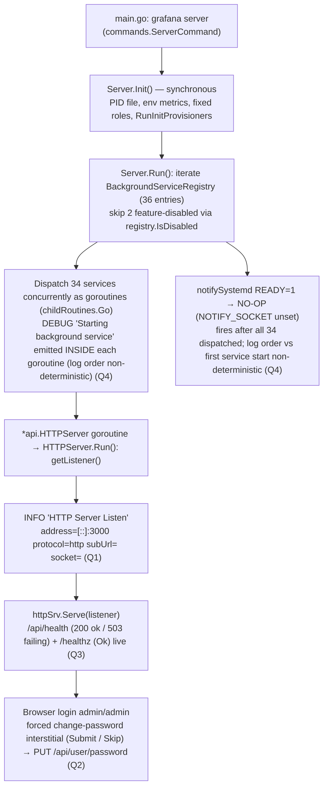

# Grafana Boot Sequence — Onboarding Q&A (investigated commit `4550cfb5b728`)

This document answers four onboarding questions about Grafana's local startup (boot)
sequence. Every answer is written **from real captured runtime output** of a freshly
built Grafana server run in its **default, canonical configuration**, and every factual
claim is grounded in a `file:line` reference that names the specific
function/method/struct doing the work. Where a statement is derived from reading code
rather than from direct runtime observation, it is explicitly labelled **(inferred)**; in
practice every question's primary case *and* every edge/alternate branch below was
exercised at runtime through the real entry point, so the answers rest on observed output
rather than inference.

- **Investigated source commit:** `4550cfb5b72886782d9a3e6cf995f8dbd57ca4ff` — a Grafana
  **v11.5.0-pre** build. This is the commit whose source answers Q1–Q4.
- **Documentation commit vs. investigated commit.** This answer file is added as a commit
  *on top of* the investigated commit (which is its parent). At the time of the runs
  captured below, the branch tip was the documentation commit `2704e90389`. Because that
  commit adds **only** this one Markdown file — the source tree is strictly read-only
  (§1.5) — every Q1–Q4 code path is byte-identical to the investigated commit
  `4550cfb5b7`. So "investigated commit" (`4550cfb5b7…`) and "current `git HEAD`"
  (`2704e90389`, the doc commit) are deliberately distinguished throughout. Because the
  banner's `commit` is resolved by `git rev-parse --short HEAD` **at build time** (§1.2),
  each further documentation-only commit advances the branch tip, so a rebuild stamps that
  newer tip: the build re-run while addressing the review findings was compiled at the later
  doc commit `0aaa35460c` and accordingly emits `commit: 0aaa35460c` in its banner and
  `"commit": "0aaa35460c"` in `/api/health`; every subsequent doc-only commit (including the
  one that lands these very review fixes) advances `git HEAD` again, so a fresh rebuild simply
  stamps whatever the newest short SHA is. This drift is **purely textual** — because every
  such abbreviated SHA is **10 characters**, the JSON shape and every byte-length reported
  below are unchanged (§4.2's healthy body stays **75 bytes**, §4.5's failing body **80
  bytes**, §4.4's `/healthz` **2 bytes**; they scale 1:1 with the short-SHA length per §4.2).
  The `2704e90389` captures shown throughout are the **verbatim, unedited** output from the
  runs at that tip and are deliberately **not** retro-relabelled; to read any of them against
  a newer build, substitute the equal-length current SHA (e.g. `0aaa35460c`) for `2704e90389`.
- **Observed version banner (this canonical build):**
  `Version 11.5.0-pre (commit: 2704e90389, branch: blitzy-29dfbca5-c37c-4c07-9bac-2d27dcb04523)`.
  The `commit` field is the **short `git HEAD` at build time** (§1.2), i.e. the doc commit
  `2704e90389` here — *not* the investigated commit; `version` (`11.5.0-pre`) is
  VCS-independent (it comes from `package.json`).
- **Canonical build/run environment (observed, not assumed).** The reference environment
  is the pinned container image
  `ghcr.io/scaleapi/swe-atlas:swe_atlas_QnA_grafana_grafana_1.0`
  (tag `grafana__grafana__4550cfb5b72886782d9a3e6cf995f8dbd57ca4ff`). Every build/run/observe
  step below was executed inside a **provisioned instance** of that environment — a Linux
  container in which the Go / Node / Yarn / gcc / make toolchain is installed **natively**;
  it is deliberately *not* the raw, unprovisioned base image (which ships without the Go
  toolchain). Rather than assert the toolchain, it was captured directly with the commands
  shown, so the values are grounded observations:

  ```bash
  $ cat /etc/os-release | head -2
  PRETTY_NAME="Ubuntu 25.10"
  NAME="Ubuntu"
  $ go version
  go version go1.23.1 linux/amd64
  $ node -v ; npm -v ; yarn -v
  v22.23.1
  11.1.0
  4.5.3
  $ gcc --version | head -1 ; make --version | head -1
  gcc (Ubuntu 15.2.0-4ubuntu4) 15.2.0
  GNU Make 4.4.1
  $ id ubuntu
  uid=1000(ubuntu) gid=1000(ubuntu) groups=1000(ubuntu),4(adm),20(dialout),24(cdrom),25(floppy),27(sudo),29(audio),30(dip),44(video),46(plugdev)
  ```

  Go `1.23.1` matches `go.mod` (`go 1.23.1`); `CGO_ENABLED=1` is required by the
  `mattn/go-sqlite3` driver. A dedicated **non-root `ubuntu` account (uid 1000)** exists and
  is the OS user under which the server is launched (§1.3).
- **Methodology:** run first, then write. The server was **built** (§1.1) and **launched
  as a non-root OS user** (`ubuntu`, uid 1000) via its real entry point (`grafana server`),
  then probed with `curl` and a headless browser; the answers below quote the exact
  commands and their complete, unedited output. Identity/timing-sensitive values were
  confirmed across two labelled canonical runs (§1.4).

---

## Table of Contents

1. [Environment & Canonical Runtime](#1-environment--canonical-runtime)
2. [Q1 — The "HTTP Server Listen" Signal](#2-q1--the-http-server-listen-signal)
3. [Q2 — The Forced Default-Admin Action (Password Change)](#3-q2--the-forced-default-admin-action-password-change)
4. [Q3 — `/api/health` Semantics (Healthy 200, Failing 503, `/healthz`)](#4-q3--apihealth-semantics-healthy-200-failing-503-healthz)
5. [Q4 — Background Services at Boot](#5-q4--background-services-at-boot)
6. [Boot-Sequence Diagram](#6-boot-sequence-diagram)
7. [Coverage Check](#7-coverage-check)

---

## 1. Environment & Canonical Runtime

### 1.1 Build

Grafana's build is driven by `build.go` (a `// +build ignore` shim whose `main()` calls
`pkg/build.RunCmd()` — `build.go:12-16`). The command dispatch lives in
`pkg/build/cmd.go`. The **unified `grafana` binary** (the canonical entry point) is
produced by the `build-backend` case, which builds `./pkg/cmd/grafana`
(`pkg/build/cmd.go:76-84`); the composite `build` case builds all three binaries
(`grafana`, `grafana-server`, `grafana-cli` — `pkg/build/cmd.go:27,103-112`). The output
path for a non-dev build is `./bin/{goos}-{goarch}/{binary}` (`pkg/build/cmd.go:155-170`),
i.e. `./bin/linux-amd64/grafana`.

> **Correction of two common mistakes** (verified against `pkg/build/cmd.go`):
> `go run build.go build-server` does **not** build the canonical binary — it builds the
> **deprecated** `grafana-server` wrapper from `./pkg/cmd/grafana-server`
> (`pkg/build/cmd.go:86-94`; that wrapper merely re-execs `grafana server`). And
> `go run build.go build-js` is **not a valid command** — `build.go` has no `build-js`
> case, so it falls through to `default → "Unknown command"` and exits `1`
> (`pkg/build/cmd.go:125-127`). The frontend command is `build-frontend`
> (`pkg/build/cmd.go:114-115`, which runs `yarn run build`), or simply `yarn build`.

**Prerequisite — generate the Wire graph.** `pkg/server/wire_gen.go` is git-ignored and
absent on a clean checkout, so it must be generated before compiling
(`Makefile:167` `gen-go`). Command and **complete** output:

```bash
$ make gen-go
generate go files
go run  ./pkg/build/wire/cmd/wire/main.go gen -tags "oss" ./pkg/server
wire: github.com/grafana/grafana/pkg/server: wrote /tmp/blitzy/grafana/blitzy-29dfbca5-c37c-4c07-9bac-2d27dcb04523_509fea/pkg/server/wire_gen.go
```

**Backend (unified binary).** `CGO_ENABLED=1` is required by the `mattn/go-sqlite3`
driver. Command and **complete** output:

```bash
$ CGO_ENABLED=1 go run build.go build-backend
Version: 11.5.0, Linux Version: 11.5.0, Package Iteration: 1784002619pre
rm -r dist
rm -r tmp
rm -r /root/go/pkg/linux_amd64/github.com/grafana
building grafana ./pkg/cmd/grafana
rm -r ./bin/linux-amd64/grafana
rm -r ./bin/linux-amd64/grafana.md5
go build -ldflags -w -X main.version=11.5.0-pre -X main.commit=2704e90389 -X main.buildstamp=1783986307 -X main.buildBranch=blitzy-29dfbca5-c37c-4c07-9bac-2d27dcb04523 -o ./bin/linux-amd64/grafana ./pkg/cmd/grafana
go version
go version go1.23.1 linux/amd64
Targeting linux/amd64
```

This produced `./bin/linux-amd64/grafana` (a 246 MB binary). Note the emitted
`-X main.commit=2704e90389` — the commit is the short **git HEAD at build time** (§1.2).

**Frontend assets** (served by the running instance). The build command and its **tail**
(`tail -4`, carrying the Nx summary), captured on an already-warm tree so Nx serves the
results from cache:

```bash
$ NODE_OPTIONS=--max_old_space_size=8000 yarn build 2>&1 | tail -4

 NX   Successfully ran target build for project grafana and 12 tasks it depends on

Nx read the output from the cache instead of running the command for 11 out of 13 tasks.
```

The build succeeds (exit `0`); on a **cold** build webpack additionally prints
`webpack 5.95.0 compiled with 2 warnings in …ms`, the two warnings being benign
*asset-size* advisories (a bundle exceeds the 244 KiB recommendation). The emitted asset
count is measured **directly from the output tree** (robust to Nx cache state) rather than
scraped from the build log:

```bash
$ find public/build -type f | wc -l               # total emitted assets
676
$ find public/build -maxdepth 1 -type f | wc -l   # top-level
657
$ find public/build -mindepth 2 -type f | wc -l   # nested (e.g. source-map subdirs)
19
$ du -sh public/build | cut -f1
156M
```

So `public/build/` holds **676 files** (657 top-level + 19 nested), ~156 MB, including the
entry chunk `app.<hash>.js`. `yarn build` resolves to
`NODE_ENV=production nx exec --verbose -- webpack --config scripts/webpack/webpack.prod.js
--progress` (`package.json`), equivalent to `go run build.go build-frontend`
(`pkg/build/cmd.go:114-115`).

> `make run` (`Makefile:232`) uses the `bra` hot-reload wrapper and is **not** the
> canonical invocation. The canonical entry point is the compiled binary plus the
> `server` subcommand (`pkg/cmd/grafana/main.go:47` → `commands.ServerCommand(...)`).

### 1.2 Version / commit banner (canonical build)

Command and **complete** output:

```bash
$ ./bin/linux-amd64/grafana server -v
Version 11.5.0-pre (commit: 2704e90389, branch: blitzy-29dfbca5-c37c-4c07-9bac-2d27dcb04523)
```

The banner string is `Version %s (commit: %s, branch: %s, enterprise-commit: %s)` /
`Version %s (commit: %s, branch: %s)` printed by `RunServer` in
`pkg/cmd/grafana-server/commands/cli.go:49` (with enterprise) / `:51` (without, the OSS
path). The build-info variables are declared in `pkg/cmd/grafana/main.go:17-21`
(`var version = "9.2.0"`, `commit`, `enterpriseCommit`, `buildBranch`, `buildstamp`) and
passed into `commands.ServerCommand(...)` at `pkg/cmd/grafana/main.go:47`.

**How the three fields are resolved (important nuance):**

- **`version` = `11.5.0-pre`** — the source fallback constant is `9.2.0`
  (`pkg/cmd/grafana/main.go:17`), but the build **overrides** it via `-X
  main.version=11.5.0-pre` (see the `go build` line in §1.1), sourced from
  `package.json` `"version"`. It is therefore VCS-independent.
- **`commit` = `2704e90389`** — the build stamps `-X main.commit=$(getGitSha())`, and
  `getGitSha()` is literally `git rev-parse --short HEAD` (`pkg/build/git.go:11-12`,
  invoked at `pkg/build/cmd.go:228`). So `commit` is **the short `git HEAD` at build
  time** — here `2704e90389`, the documentation commit — **not** the investigated commit
  `4550cfb5b7`. (Rebuilding after a further doc commit would stamp that newer HEAD.)
- **`branch` = `blitzy-29dfbca5-…`** — `getGitBranch()` = `git rev-parse --abbrev-ref
  HEAD` (`pkg/build/git.go:4`, invoked at `pkg/build/cmd.go:241`).

The same values are echoed in the boot log's first structured line (from canonical run A,
§1.4):

```
logger=settings t=2026-07-14T04:34:48.330078561Z level=info msg="Starting Grafana" version=11.5.0-pre commit=2704e90389 branch=blitzy-29dfbca5-c37c-4c07-9bac-2d27dcb04523 compiled=2026-07-13T23:45:07Z
```

### 1.3 Run (default, canonical configuration, non-root)

The canonical runs used **only** the baked-in `conf/defaults.ini` — no `conf/custom.ini`
was created and **no `GF_*` overrides** were set — and were executed as a **non-root OS
user** (`ubuntu`, uid 1000) via `runuser`. The default HTTP port `3000` was kept
unchanged (so the observed listen address is the true canonical value). The **only**
deviation from a bare `--homepath .` run is that `paths.data`/`paths.logs`/`paths.plugins`
were redirected to a private temporary directory *outside* the repository — a read-only
scope measure (§1.5). This redirection has **no effect** on any of the four answers (the
listen address, health semantics, and background-service *set* are all independent of the
data directory's location); its one observable consequence is that the redirected
`plugins` dir must be **pre-created empty** for a 0-error boot — exactly the clean-boot
condition analysed in §5.2. The exact invocation:

```bash
$ HOMEPATH="$PWD"                             # repo root (contains bin/, conf/, public/)
$ D="$(mktemp -d /tmp/gf_canonical.XXXXXX)"   # private instance dir, OUTSIDE the repo
$ mkdir -p "$D"/{data,logs,plugins}           # pre-create the redirected dirs; the *empty*
                                              # plugins dir is what makes the boot 0-error (§5.2)
$ chown -R ubuntu:ubuntu "$D"
$ runuser -u ubuntu -- env HOME="$D" "$HOMEPATH/bin/linux-amd64/grafana" server \
    --homepath "$HOMEPATH" \
    cfg:paths.data="$D/data" cfg:paths.logs="$D/logs" cfg:paths.plugins="$D/plugins" \
    > "$D/boot.log" 2>&1 &
$ PID=$!    # exact PID captured for a bounded readiness poll and an exact-PID stop
```

The boot log confirms the config source is the default file (canonical run A):

```
logger=settings t=2026-07-14T04:34:48.330380593Z level=info msg="Config loaded from" file=/tmp/blitzy/grafana/blitzy-29dfbca5-c37c-4c07-9bac-2d27dcb04523_509fea/conf/defaults.ini
```

Because the process runs **non-root**, the `"Grafana server is running with elevated
privileges"` warning is **absent** — verified with `grep -c "elevated privileges"
"$D/boot.log"` → `0` on every canonical run. (The process owner was confirmed with
`ps -eo user=,pid=,comm= | grep grafana` → `ubuntu … grafana`.)

### 1.4 Two labelled canonical runs & stability

To satisfy the "≥ 2 unchanged runs" requirement, two identical canonical runs (**run A**,
**run B**) were performed with the invocation in §1.3 (default config, port 3000,
non-root). Each was stopped by its exact captured `PID`. The identity/timing-sensitive
values were stable:

| Metric | Run A | Run B | Stable? |
|---|---|---|---|
| Boot → `/api/health` reachable (wall clock) | `1.868 s` | `1.868 s` | consistent (< 3 s) |
| `"Starting Grafana"` → `"HTTP Server Listen"` (log timestamps) | `1.720 s` | `1.730 s` | consistent |
| Q1 listen fields (`address protocol subUrl socket`) | `[::]:3000 http (empty) (empty)` | `[::]:3000 http (empty) (empty)` | **identical** |
| `level=debug` lines at default `info` level | `0` | `0` | identical |
| Total boot log lines | `1352` | `1352` | identical (±1 ordering jitter) |
| Version banner | `11.5.0-pre / 2704e90389` | `11.5.0-pre / 2704e90389` | identical |

The two edge/secondary runs used later — the Q3 `503` database-failure instance
(§4.5, unique port) and the Q4 `level=debug` instance (§5.3) — are **not** canonical and
are labelled as such where they appear. Their own timing/magnitude-sensitive values are
nonetheless confirmed stable across ≥ 2 runs inside those sections; in particular the
§5.3 `level=debug` counts (**≈ 1120** while the server is running, **≈ 1377** after a
graceful shutdown) were each reproduced across multiple debug boots (see §5.3).

### 1.5 Read-only scope

The Grafana source tree is treated as strictly read-only: the **only** file this task adds
is this document. All observation used a private `mktemp -d` workspace and temporary
instance data directories *outside* the repository; those, plus every server process,
are removed after capture (see §7's cleanup evidence). No tracked source, configuration,
manifest, or generated file is modified.

### 1.6 Runtime-value table

| Property | Observed value | Source |
|---|---|---|
| Entry point | `grafana server` | `pkg/cmd/grafana/main.go:47` (`commands.ServerCommand`) |
| Canonical build (unified binary) | `CGO_ENABLED=1 go run build.go build-backend` | `pkg/build/cmd.go:76-84` (builds `./pkg/cmd/grafana`) |
| Build prerequisite | `make gen-go` (Wire) | `Makefile:167` |
| Frontend build | `yarn build` (≡ `build.go build-frontend`) | `pkg/build/cmd.go:114-115`; `package.json` |
| Binary path | `./bin/linux-amd64/grafana` | `pkg/build/cmd.go:155-170`; build output |
| Version | `11.5.0-pre` | banner; `package.json`; override `-X main.version` |
| Commit (= short `git HEAD`) | `2704e90389` (doc commit) | banner; `pkg/build/git.go:11-12` |
| Investigated source commit | `4550cfb5b72886…` | doc-commit parent (read-only source) |
| Branch | `blitzy-29dfbca5-…` | banner; `pkg/build/git.go:4` |
| Config source | `conf/defaults.ini` (no `custom.ini`, no `GF_*`) | boot log "Config loaded from" |
| Protocol | `http` | `conf/defaults.ini:32` (`protocol = http`) |
| HTTP port | `3000` | `conf/defaults.ini:41` (`http_port = 3000`) |
| Bind address (resolved) | `[::]:3000` | boot log "HTTP Server Listen" |
| Database | SQLite, default path `data/grafana.db` | `conf/defaults.ini:123` (`type = sqlite3`); `pkg/services/sqlstore/database_config.go:111` |
| Log level | `info` | `conf/defaults.ini:1074` (`level = info`) |
| Run OS user | `ubuntu` (uid 1000, non-root) | `ps`; no "elevated privileges" warning |

---

## 2. Q1 — The "HTTP Server Listen" Signal

### 2.1 Direct answer

The log line that signals the HTTP server has begun **listening** is the structured
**INFO** line **`"HTTP Server Listen"`**. It is emitted inside
**`func (hs *HTTPServer) Run(ctx context.Context) error`** at
**`pkg/api/http_server.go:434-435`**, by the logger **`log.New("http.server")`**
(`pkg/api/http_server.go:323`). It is logged immediately after `hs.getListener()`
(`pkg/api/http_server.go:429`; `getListener` defined at `pkg/api/http_server.go:476`)
returns a bound listener and just before the serve `switch` at
`pkg/api/http_server.go:450` begins accepting connections.

It reveals **where and how the server is exposed** through four key/value fields:
**`address`** (the resolved bind address + port), **`protocol`** (HTTP vs HTTPS vs
socket), **`subUrl`** (the path prefix / sub-path the app is mounted under), and
**`socket`** (the UNIX socket path, when the socket protocol is used). On the default
run this is: bound to **all interfaces on port 3000**, plain **HTTP**, **no** sub-path,
and **no** UNIX socket.

### 2.2 Observed output (two canonical runs)

Command and complete, unedited line from **each** canonical run (§1.4). `$D` is that
run's private instance directory:

```bash
# Run A
$ grep -F "HTTP Server Listen" "$D_runA/boot.log"
logger=http.server t=2026-07-14T05:43:56.870681903Z level=info msg="HTTP Server Listen" address=[::]:3000 protocol=http subUrl= socket=
# Run B
$ grep -F "HTTP Server Listen" "$D_runB/boot.log"
logger=http.server t=2026-07-14T05:44:01.861733826Z level=info msg="HTTP Server Listen" address=[::]:3000 protocol=http subUrl= socket=
```

Stripped of the per-run `logger=`/`t=` prefix, the two payloads are **byte-identical**
(`level=info msg="HTTP Server Listen" address=[::]:3000 protocol=http subUrl= socket=`);
only the timestamp differs. This is the two-run stability proof for Q1.

### 2.3 The source line (verbatim)

```go
// pkg/api/http_server.go:434-435, inside func (hs *HTTPServer) Run(ctx context.Context) error
hs.log.Info("HTTP Server Listen", "address", listener.Addr().String(), "protocol",
    hs.Cfg.Protocol, "subUrl", hs.Cfg.AppSubURL, "socket", hs.Cfg.SocketPath)
```

### 2.4 Field-by-field explanation

| Field | Observed value | Meaning / source | Default config key |
|---|---|---|---|
| `address` | `[::]:3000` | The **resolved** listener address, `listener.Addr().String()` (`pkg/api/http_server.go:434`) — **not** the raw configured value. `[::]` is the IPv6 unspecified address, i.e. **all interfaces**; `:3000` is the port. | `http_port = 3000` (`conf/defaults.ini:41`); empty `http_addr` means all interfaces |
| `protocol` | `http` | `hs.Cfg.Protocol` (`pkg/api/http_server.go:434`). Plain HTTP. | `protocol = http` (`conf/defaults.ini:32`) |
| `subUrl` | *(empty)* | `hs.Cfg.AppSubURL` (`pkg/api/http_server.go:435`) — the path prefix derived from `root_url`. The default `root_url` has no sub-path, so this is empty (app served at `/`). | `root_url = %(protocol)s://%(domain)s:%(http_port)s/` (`conf/defaults.ini:51`), `domain = localhost` (`conf/defaults.ini:44`) |
| `socket` | *(empty)* | `hs.Cfg.SocketPath` (`pkg/api/http_server.go:435`). This is the **runtime** field `SocketPath` on `*setting.Cfg`, which is only populated when `protocol = socket`; under the default `http` protocol it is the empty string (distinct from the raw INI `[server] socket` key, which is irrelevant here because the socket listener code path is not taken). | `protocol = http` (not `socket`) (`conf/defaults.ini:32`) |

### 2.5 Nuance

- **`address` is the resolved address, not the configured one.** The code logs
  `listener.Addr().String()` — the address the OS actually bound — so it reflects what is
  truly reachable. On the default runs that is `[::]:3000` (all interfaces, port 3000).
- **`socket` is empty at runtime under HTTP.** The logged value is the runtime
  `hs.Cfg.SocketPath` field, not the raw `[server] socket` INI key. `getListener()`
  (`pkg/api/http_server.go:476`) switches on `hs.Cfg.Protocol` at `:481`; it only consults
  `SocketPath` in the `SocketScheme` branch (`case setting.SocketScheme` at `:488`,
  `net.ListenUnix(..., Name: hs.Cfg.SocketPath ...)` at `:489`). Under `http` the TCP
  branch (`:482-483`, `net.Listen("tcp", …)`) is taken and `SocketPath` stays empty —
  which is exactly the observed `socket=`.
- **How the listener is served** is decided by the `switch hs.Cfg.Protocol` block that
  immediately follows the listen log (`pkg/api/http_server.go:450`): for
  `HTTPScheme`/`SocketScheme` it calls `hs.httpSrv.Serve(listener)`; for
  `HTTP2Scheme`/`HTTPSScheme` it calls `hs.httpSrv.ServeTLS(...)`. The default `http`
  takes the plain `Serve` branch.
- **Stability (two canonical runs).** The four field values were **identical** across
  canonical run A and run B (`address=[::]:3000 protocol=http subUrl= socket=`); only the
  timestamp differed (§1.4, §2.2).


---

## 3. Q2 — The Forced Default-Admin Action (Password Change)

### 3.1 Direct answer

After signing in with the default administrator credentials (`admin` / `admin`), Grafana
does **not** navigate into the app. Instead it presents a forced **"Update your
password"** interstitial — a client-side change-password view rendered *in place of* the
dashboard. The action Grafana demands is therefore a **change-password decision**: the
user is asked to set a new password (**Submit**), but the screen also offers a **Skip**
button, so the change is strongly urged rather than strictly mandatory (see §3.3 — Skip
is offered because the default `password_policy = false`).

**What internal state is finalized:** *if the user submits a new password*, the finalized
state is the administrator's **persisted password hash**. The new password is hashed and
written to the user row by
**`func (s *Service) Update(ctx context.Context, cmd *user.UpdateUserCommand) error`** at
**`pkg/services/user/userimpl/user.go:238`** — it validates the password against policy
(`Password.Validate(s.cfg)`, `:261`), hashes it with the user's salt
(`hashed, err := cmd.Password.Hash(usr.Salt)`, `:265`), replaces the plaintext with the
hash (`cmd.Password = &hashed`, `:269`), and persists via `s.store.Update(ctx, cmd)`
(`:290`). This `Service.Update` is reached through the API handler
**`func (hs *HTTPServer) ChangeUserPassword(...)`** at **`pkg/api/user.go:546`**, which
returns `response.Success("User password changed")` (`pkg/api/user.go:565`).

**Critical nuance:** the "force change password" decision is **entirely client-side** —
there is no server-side "must change password" flag. After a successful `POST /login`,
the front-end login controller checks whether the submitted password equals the literal
default `admin` (and that neither LDAP nor auth-proxy is enabled); only then does it
switch to the change-password view (`public/app/core/components/Login/LoginCtrl.tsx:117`,
`:121`).

> **Security note on evidence:** every observation below was captured without recording
> any secret. Session-cookie values are redacted (`grafana_session=<redacted>`), and the
> replacement password used to exercise the change was a random throwaway held only in a
> shell variable / temporary cookie-jar file and **never printed**. The literal default
> `admin` is shown because it is the canonical, documented default credential
> (`conf/defaults.ini:328`, `:331`), not a secret.

### 3.2 Observed output — the forced change-password screen (browser)

The real front-end was driven with the Chrome DevTools MCP browser tools against the
canonical non-root instance on `http://localhost:3000`. Exact command sequence:

```text
navigate_page   { type: "url", url: "http://localhost:3000/login" }
evaluate_script { function: () => window.grafanaBootData.settings &&
                    ({ ldapEnabled: window.grafanaBootData.settings.ldapEnabled,
                       authProxyEnabled: window.grafanaBootData.settings.authProxyEnabled,
                       disableLoginForm: window.grafanaBootData.settings.disableLoginForm }) }
take_snapshot                                     # locate elements by accessible name
fill  { uid: <textbox "Email or username">, value: "admin" }
fill  { uid: <textbox "Password">,          value: "admin" }
click { uid: <button "Log in"> }
wait_for { text: ["Update your password"] }
take_snapshot                                     # capture the change-password a11y tree
```

(The `uid` values are session-specific — in this run the login form exposed
`textbox "Email or username"` = `uid=1_6`, `textbox "Password"` = `uid=1_8`, and
`button "Log in"` = `uid=1_10` — so the elements are addressed here by their **stable
accessible names** rather than the volatile uids. The login form snapshot also carried the
footer link `Grafana v11.5.0-pre (2704e90389)`, confirming the canonical build under test.)

The baseline `evaluate_script` returned (default run — both auth modifiers off):

```json
{ "ldapEnabled": false, "authProxyEnabled": false, "disableLoginForm": false }
```

Clicking **Log in** switched the page to the change-password view **without navigating
away from `/login`** (a client-side view switch). The `take_snapshot` accessibility tree
of the resulting view was:

```yaml
heading "Update your password" level=1
form
  status "Continuing to use the default password exposes you to security risks." [atomic] [live=polite]
  StaticText "New password"
  textbox "New password" [focused]
  switch "Show password"
  StaticText "Confirm new password"
  textbox "Confirm new password"
  switch "Show password"
  button "Submit"
  button "Skip"
```

The rendered screen was captured during the investigation: the Grafana login card centred
on the dark background, an orange spiral logo, the "Update your password" heading, the info
Alert quoted above, the two password inputs each with a show/hide toggle, and stacked
**Submit** / **Skip** buttons.

The observed Alert title — **"Continuing to use the default password exposes you to
security risks."** — matches the component source **byte-for-byte**:

```tsx
// public/app/core/components/ForgottenPassword/ChangePassword.tsx:52-53
{showDefaultPasswordWarning && (
  <Alert severity="info" title="Continuing to use the default password exposes you to security risks." />
)}
```

The **Submit** button is rendered at `ChangePassword.tsx:87`; the **Skip** button is
rendered at `ChangePassword.tsx:90` and is gated on
`!config.auth.basicAuthStrongPasswordPolicy && onSkip`. In the default configuration
`password_policy = false` (`conf/defaults.ini:883`, section `[auth.basic]` at
`conf/defaults.ini:874`), so `basicAuthStrongPasswordPolicy` is false and the Skip button
is present.

### 3.3 Observed output — the Skip path (change is urged, not mandatory)

Clicking **Skip** proceeded straight into Grafana **without changing the password**. The
browser navigated to the authenticated home:

```text
click { uid: <button "Skip"> }
# → URL after click:
http://localhost:3000/?orgId=1&from=now-6h&to=now&timezone=browser
```

The full authenticated app rendered (left nav Home / Dashboards / Explore / Alerting /
Connections / Administration, plus the "Welcome to Grafana" getting-started panel).

Skip does **not** persist. Logging out and signing back in with `admin` / `admin`
re-displayed the **"Update your password"** interstitial (Skip button present again):

```text
navigate_page { type: "url", url: "http://localhost:3000/logout" }
navigate_page { type: "url", url: "http://localhost:3000/login" }
take_snapshot
fill  { uid: <textbox "Email or username">, value: "admin" }
fill  { uid: <textbox "Password">,          value: "admin" }
click { uid: <button "Log in"> }
wait_for { text: ["Update your password"] }      # ← re-appeared
```

This matches the Skip tooltip in source
(`public/app/core/components/ForgottenPassword/ChangePassword.tsx:92`): *"If you skip you
will be prompted to change password next time you log in."* The trigger is re-evaluated on
every login because it is purely client-side and keyed on the submitted password still
being `admin`.

### 3.4 Observed output — the network flow (safe capture)

**Browser network panel.** After completing the change via the UI (a random throwaway
password), `list_network_requests` (fetch/xhr, preserved) showed exactly the two calls —
method, path, and status only:

```text
list_network_requests { includePreservedRequests: true, resourceTypes: ["fetch","xhr"] }
  #119  POST  http://localhost:3000/login                 [200]
  #120  PUT   http://localhost:3000/api/user/password     [200]
```

(The `#120` response body was deliberately **not** fetched, to avoid pulling any password
material into the record — only method/path/status are needed to prove the call.)

**curl on an isolated instance (port 3021).** The same two calls captured with `curl`,
with the cookie jar written to a temp file (never printed) and all `Set-Cookie` **values
redacted**:

The complete, self-contained harness — it launches an isolated non-root instance, defines
the cookie jar and a random throwaway password (held only in a `0600` temp file, never
echoed), then runs the two calls:

```bash
# --- self-contained harness: isolated non-root instance on :3021 (default config) ---
REPO=/tmp/blitzy/grafana/blitzy-29dfbca5-c37c-4c07-9bac-2d27dcb04523_509fea
D=$(mktemp -d /tmp/gfqa_run.XXXX)
mkdir -p "$D"/{data,logs,plugins}; chown -R ubuntu:ubuntu "$D"     # empty plugins dir → clean boot
runuser -u ubuntu -- env HOME="$D" "$REPO/bin/linux-amd64/grafana" server \
    --homepath "$REPO" cfg:server.http_port=3021 \
    cfg:paths.data="$D/data" cfg:paths.logs="$D/logs" cfg:paths.plugins="$D/plugins" \
    > "$D/boot.log" 2>&1 &
until curl -s http://localhost:3021/api/health >/dev/null 2>&1; do sleep 0.2; done

CJ="$D/cookies.txt"                                        # cookie jar (temp file, never printed)
# throwaway replacement password: random, stored only in a 0600 temp file, never echoed
NEWPASS="Blitzy-$(head -c 12 /dev/urandom | base64 | tr -dc 'A-Za-z0-9')Zz9"
printf '%s' "$NEWPASS" > "$D/newpass.secret"; chmod 600 "$D/newpass.secret"

# 1) POST /login with the default admin/admin (capture headers; redact Set-Cookie VALUES)
curl -sS -D "$D/login.hdr" -o "$D/login.body" -c "$CJ" \
    -H 'Content-Type: application/json' \
    --data-binary '{"user":"admin","password":"admin"}' \
    http://localhost:3021/login
sed -E 's/(Set-Cookie: [^=]+=)[^;]*/\1<redacted>/' "$D/login.hdr"    # print redacted headers
cat "$D/login.body"; echo

# 2) PUT /api/user/password (old=admin, new+confirmNew=<throwaway>, cookie from the jar)
curl -sS -X PUT -H 'Content-Type: application/json' -b "$CJ" \
    --data-binary "{\"oldPassword\":\"admin\",\"newPassword\":\"$NEWPASS\",\"confirmNew\":\"$NEWPASS\"}" \
    http://localhost:3021/api/user/password; echo
```

Actual, unedited output (login status line + headers with `Set-Cookie` **values** redacted,
then the two response bodies):

```text
HTTP/1.1 200 OK
Cache-Control: no-store
Content-Type: application/json
Set-Cookie: grafana_session=<redacted>; Path=/; Max-Age=2592000; HttpOnly; SameSite=Lax
Set-Cookie: grafana_session_expiry=<redacted>; Path=/; Max-Age=2592000; SameSite=Lax
X-Content-Type-Options: nosniff
X-Frame-Options: deny
X-Xss-Protection: 1; mode=block
Date: Tue, 14 Jul 2026 05:22:48 GMT
Content-Length: 41
{"message":"Logged in","redirectUrl":"/"}
{"message":"User password changed"}
```

The body `{"message":"User password changed"}` is exactly the envelope produced by
`response.Success("User password changed")` (`pkg/api/user.go:565`).

### 3.5 Before / after — proof the new hash is finalized

Continuing in the **same shell session** as §3.4 (same `$D`, `$CJ`, `$NEWPASS`, and the
isolated instance on port 3021, whose PID is `$PID`), the credential transition and the
underlying database row were both captured. First, the **HTTP-level proof** — the old
credential is accepted before the change and rejected after, while the new one is accepted:

```bash
# [BEFORE] OLD admin/admin authenticates
curl -sS -w '-> HTTP %{http_code}\n' -c "$CJ" -H 'Content-Type: application/json' \
    --data-binary '{"user":"admin","password":"admin"}' http://localhost:3021/login
# [CHANGE] PUT /api/user/password (old=admin, new+confirmNew=<throwaway>)
curl -sS -w '-> HTTP %{http_code}\n' -X PUT -H 'Content-Type: application/json' -b "$CJ" \
    --data-binary "{\"oldPassword\":\"admin\",\"newPassword\":\"$NEWPASS\",\"confirmNew\":\"$NEWPASS\"}" \
    http://localhost:3021/api/user/password
# [AFTER] OLD admin/admin now REJECTED
curl -sS -w '-> HTTP %{http_code}\n' -H 'Content-Type: application/json' \
    --data-binary '{"user":"admin","password":"admin"}' http://localhost:3021/login
# [AFTER] NEW password ACCEPTED
curl -sS -w '-> HTTP %{http_code}\n' -H 'Content-Type: application/json' \
    --data-binary "{\"user\":\"admin\",\"password\":\"$NEWPASS\"}" http://localhost:3021/login
```

Actual, unedited output:

```text
{"message":"Logged in","redirectUrl":"/"}
-> HTTP 200
{"message":"User password changed"}
-> HTTP 200
{"statusCode":401,"messageId":"password-auth.failed","message":"Invalid username or password"}
-> HTTP 401
{"message":"Logged in","redirectUrl":"/"}
-> HTTP 200
```

Second, the **database-level proof**. The admin user row in `data/grafana.db` was read
(read-only) before and after the change with Python's `sqlite3` module (the `sqlite3` CLI
is not installed in the image). Only **SHA-256 digests truncated to 16 hex chars** of the
`password` and `salt` columns are shown — never the raw hash or salt:

```bash
dbdump(){ python3 - "$D/data/grafana.db" "$1" <<'PY'
import sqlite3,sys,hashlib
db,tag=sys.argv[1],sys.argv[2]
c=sqlite3.connect(f"file:{db}?mode=ro",uri=True);cur=c.cursor()
idv,login,email,ver,pw,salt,upd=cur.execute(
  "SELECT id,login,email,version,password,salt,updated FROM user WHERE login='admin'").fetchone()
h=lambda x: hashlib.sha256(x.encode()).hexdigest()[:16]
n=cur.execute('SELECT count(*) FROM user').fetchone()[0]
print(f"[{tag}] id={idv} login={login} email={email} version={ver} updated={upd} user_row_count={n}")
print(f"[{tag}] password_sha256[:16]={h(pw)}  salt_sha256[:16]={h(salt)}")
PY
}
dbdump BEFORE-DB       # before the PUT
dbdump AFTER-DB        # after the PUT
```

Actual, unedited output:

```text
[BEFORE-DB] id=1 login=admin email=admin@localhost version=0 updated=2026-07-14 05:22:46 user_row_count=1
[BEFORE-DB] password_sha256[:16]=78207f4ee8bae716  salt_sha256[:16]=8aad83eccc13f74a
[AFTER-DB] id=1 login=admin email=admin@localhost version=0 updated=2026-07-14 05:22:48 user_row_count=1
[AFTER-DB] password_sha256[:16]=54a0c00037041be2  salt_sha256[:16]=8aad83eccc13f74a
```

Reading the row directly confirms exactly what `Service.Update` does:

- **`password` digest changed** (`78207f4ee8bae716` → `54a0c00037041be2`) — the stored hash
  was replaced, matching `cmd.Password = &hashed` (`userimpl/user.go:269`) then
  `s.store.Update(ctx, cmd)` (`:290`).
- **`salt` digest unchanged** (`8aad83eccc13f74a` → `8aad83eccc13f74a`) — the **existing**
  salt was reused, matching `cmd.Password.Hash(usr.Salt)` (`:265`), which hashes with the
  user's current salt rather than generating a new one.
- **Identity preserved** — `id=1`, `login=admin`, `email=admin@localhost`, and
  `user_row_count=1` are all unchanged; the row is updated in place, not replaced.
- **`updated` advanced** (`05:22:46` → `05:22:48`) while the `version` column stayed `0` —
  this path bumps the modification timestamp but not the user `version`.

Third, **persistence across a process restart**. The instance was killed and relaunched on
the **same data dir**, then the row and the credential checks were re-read:

```bash
# kill + relaunch on the SAME $D/data, then re-check
kill "$PID"; until curl -s http://localhost:3021/api/health >/dev/null 2>&1; do sleep 0.2; done
dbdump AFTER-RESTART-DB
curl -sS -o /dev/null -w 'old admin/admin -> HTTP %{http_code}\n' -H 'Content-Type: application/json' \
    --data-binary '{"user":"admin","password":"admin"}' http://localhost:3021/login
curl -sS -o /dev/null -w 'new password    -> HTTP %{http_code}\n' -H 'Content-Type: application/json' \
    --data-binary "{\"user\":\"admin\",\"password\":\"$NEWPASS\"}" http://localhost:3021/login
```

Actual, unedited output:

```text
[AFTER-RESTART-DB] id=1 login=admin email=admin@localhost version=0 updated=2026-07-14 05:22:48 user_row_count=1
[AFTER-RESTART-DB] password_sha256[:16]=54a0c00037041be2  salt_sha256[:16]=8aad83eccc13f74a
old admin/admin -> HTTP 401
new password    -> HTTP 200
```

The post-restart `password` digest is **identical** to the post-change digest
(`54a0c00037041be2`), the old credential is still rejected (`401`), and the new one is still
accepted (`200`) — proving the finalized state is a **durably persisted password hash**,
written by `Service.Update` (`pkg/services/user/userimpl/user.go:265` hash, `:290` persist)
and surviving a full process restart.

### 3.6 Client-side trigger and the finalized backend state (`file:line`)

**Front-end trigger** (`public/app/core/components/Login/LoginCtrl.tsx`) — the `login`
method issues `POST /login` and, on success, decides between entering the app and showing
the change-password view:

```ts
// login(formModel: FormModel) is defined at LoginCtrl.tsx:107; its body:
getBackendSrv().post<LoginDTO>('/login', formModel, { showErrorAlert: false })  // :114
  .then((result) => {
    this.result = result;
    if (formModel.password !== 'admin' || config.ldapEnabled || config.authProxyEnabled) {  // :117
      this.toGrafana();                                                     // :118  (skip → enter app)
      return;
    } else {
      this.changeView(formModel.password === 'admin');                      // :121  (show change-password view)
    }
  })
```

- `changeView` sets `isChangingPassword: true` (`LoginCtrl.tsx:176-178`); `toGrafana`
  navigates into the app (`LoginCtrl.tsx:183`).
- When the user submits, `changePassword` (`LoginCtrl.tsx:78`) builds the payload
  `{ newPassword, confirmNew, oldPassword: 'admin' }` (`LoginCtrl.tsx:79-83`) and (non-reset
  branch) submits `getBackendSrv().put('/api/user/password', pw)` (`LoginCtrl.tsx:98-99`),
  calling `toGrafana()` on success (`LoginCtrl.tsx:100-101`).
- **`confirmNew` is a client-only field, ignored by the backend.** The front end sends
  three keys (`newPassword`, `confirmNew`, `oldPassword`), but the server bind target has
  only two — no `confirmNew` (`pkg/services/user/model.go:270-273`):

  ```go
  type ChangeUserPasswordCommand struct {
  	OldPassword Password `json:"oldPassword"`
  	NewPassword Password `json:"newPassword"`
  }
  ```

  So `web.Bind` deserializes only `oldPassword`/`newPassword` and silently discards
  `confirmNew`; the new-vs-confirm match is enforced purely in the UI
  (`ChangePassword.tsx` `handleSubmit(submit)`), not on the server. Confirmed at runtime: the
  §3.4 `PUT` succeeds (`{"message":"User password changed"}`) with `confirmNew` present, and
  a separate `PUT` with `confirmNew` **omitted entirely**
  (`{"oldPassword":"admin","newPassword":"<throwaway>"}`) **equally returned**
  `{"message":"User password changed"} -> HTTP 200` (new password then authenticated, old
  rejected) — the backend never inspects `confirmNew`.
- `public/app/core/components/Login/LoginPage.tsx:84` renders the view only when
  `isChangingPassword && !config.auth.passwordlessEnabled`, passing
  `skipPasswordChange` (which is `toGrafana`, `LoginCtrl.tsx:220`) as the Skip handler:
  `<ChangePassword showDefaultPasswordWarning={showDefaultPasswordWarning} onSubmit={changePassword} onSkip={() => skipPasswordChange()} />`
  (`LoginPage.tsx:86-89`).

**Route → handler → persistence** (backend):

- Route: `userRoute.Put("/password", routing.Wrap(hs.ChangeUserPassword))`
  (`pkg/api/api.go:277`).
- Handler `func (hs *HTTPServer) ChangeUserPassword(...)` (`pkg/api/user.go:546`) binds
  `ChangeUserPasswordCommand` (`:547-550`), resolves the user id (`getUserID`, `:552`),
  rejects externally-managed users (`errOnExternalUser`, `:557`; defined
  `pkg/api/utils.go:30`), then calls
  `hs.userService.Update(ctx, &user.UpdateUserCommand{UserID, Password: &form.NewPassword, OldPassword: &form.OldPassword})`
  (`:561`) and returns `response.Success("User password changed")` (`:565`):

```go
func (hs *HTTPServer) ChangeUserPassword(c *contextmodel.ReqContext) response.Response {
	form := user.ChangeUserPasswordCommand{}
	if err := web.Bind(c.Req, &form); err != nil {
		return response.Error(http.StatusBadRequest, "bad request data", err)
	}
	userID, errResponse := getUserID(c)
	if errResponse != nil {
		return errResponse
	}
	if response := hs.errOnExternalUser(c.Req.Context(), userID); response != nil {
		return response
	}
	if err := hs.userService.Update(c.Req.Context(), &user.UpdateUserCommand{UserID: userID, Password: &form.NewPassword, OldPassword: &form.OldPassword}); err != nil {
		return response.ErrOrFallback(http.StatusInternalServerError, "Failed to change user password", err)
	}
	return response.Success("User password changed")
}
```

- **Finalized state** is written by `func (s *Service) Update(...)`
  (`pkg/services/user/userimpl/user.go:238`): it verifies the old password
  (`cmd.OldPassword.Hash(usr.Salt)` compared to the stored hash, `:249-258`), validates the
  new password against policy (`cmd.Password.Validate(s.cfg)`, `:261`), hashes it with the
  user's salt (`hashed, err := cmd.Password.Hash(usr.Salt)`, `:265`), swaps the plaintext
  for the hash (`cmd.Password = &hashed`, `:269`), and persists it via
  `s.store.Update(ctx, cmd)` (`:290`).

Note (code-grounded): this handler updates only the password — it does **not** revoke
existing tokens or reset login attempts. The relevant defaults are `admin_user = admin`
(`conf/defaults.ini:328`), `admin_password = admin` (`conf/defaults.ini:331`), and
`disable_initial_admin_creation = false` (`conf/defaults.ini:325`).

### 3.7 Alternate branches (all exercised at runtime)

The trigger at `LoginCtrl.tsx:117` short-circuits to `toGrafana()` (no prompt) when **any**
of three conditions holds. All three were exercised through the real front end / entry
point — none is merely inferred:

1. **Non-default password** (`formModel.password !== 'admin'`). After the §3.5 change, the
   browser was logged out and signed back in with the **new (non-default)** password. The
   page navigated **straight to**
   `http://localhost:3000/?orgId=1&from=now-6h&to=now&timezone=browser`; `evaluate_script`
   on the landing returned
   `{ "hasUpdatePasswordHeading": false, "hasDefaultPwWarning": false, "hasWelcomeHome": true }`
   — no interstitial. The server's `POST /login` body is byte-identical for the default and
   non-default passwords (`{"message":"Logged in","redirectUrl":"/"}`), confirming the
   default-vs-non-default differentiation is purely client-side (the `formModel.password !==
   'admin'` half of `LoginCtrl.tsx:117`).

2. **Auth-proxy enabled** (`config.authProxyEnabled`). A dedicated non-root instance was
   launched with the auth-proxy modifier:

   ```bash
   runuser -u ubuntu -- env HOME="$D" ./bin/linux-amd64/grafana server --homepath . \
       cfg:server.http_port=3042 cfg:auth.proxy.enabled=true \
       cfg:paths.data="$D/data" cfg:paths.logs="$D/logs" cfg:paths.plugins="$D/plugins"
   ```

   The boot log confirmed the override (unedited):
   `logger=settings level=info msg="Config overridden from command line" arg="auth.proxy.enabled=true"`.
   The `window.grafanaBootData.settings` embedded in the `/login` HTML — the exact object the
   front-end `config` reads — carried `ldapEnabled=false, authProxyEnabled=true`. Signing in
   through the browser with `admin` / `admin` went **straight to**
   `http://localhost:3042/?orgId=1&…`; `evaluate_script` returned
   `{ "hasUpdatePasswordHeading": false, "hasDefaultPwWarning": false, "hasWelcomeHome": true }`
   — the interstitial was skipped despite the default password. Config mapping:
   `AuthProxyEnabled: hs.Cfg.AuthProxy.Enabled` (`pkg/api/frontendsettings.go:193`) ←
   `[auth.proxy] enabled` (`conf/defaults.ini:887`; section header `:886`). (Note: these two
   flags are exposed only in the page bootData, not in `/api/frontend/settings`.)

3. **LDAP enabled** (`config.ldapEnabled`). A dedicated non-root instance was launched with
   the LDAP modifier, pointing `config_file` at the repo's default `conf/ldap.toml`:

   ```bash
   runuser -u ubuntu -- env HOME="$D" ./bin/linux-amd64/grafana server --homepath . \
       cfg:server.http_port=3041 cfg:auth.ldap.enabled=true \
       cfg:auth.ldap.config_file="$PWD/conf/ldap.toml" \
       cfg:paths.data="$D/data" cfg:paths.logs="$D/logs" cfg:paths.plugins="$D/plugins"
   ```

   The boot log confirmed both the override and that LDAP actually initialised (unedited):

   ```text
   logger=settings level=info msg="Config overridden from command line" arg="auth.ldap.enabled=true"
   logger=ldap level=info msg="LDAP enabled, reading config file" file=<repo>/conf/ldap.toml
   ```

   The `/login` bootData carried `ldapEnabled=true, authProxyEnabled=false`. Signing in with
   `admin` / `admin` navigated **straight to** `http://localhost:3041/?orgId=1&…` — the full
   authenticated home rendered (left nav Home / Dashboards / Explore / Alerting / Connections
   / Administration; "Welcome to Grafana" getting-started panel) with **no** "Update your
   password" heading and **no** default-password Alert. Config mapping:
   `LdapEnabled: hs.Cfg.LDAPAuthEnabled` (`pkg/api/frontendsettings.go:194`) ←
   `cfg.LDAPAuthEnabled = ldapSec.Key("enabled").MustBool(false)`
   (`pkg/setting/setting.go:1361`) ← `[auth.ldap] enabled` (`conf/defaults.ini:922`; section
   header `:921`).

### 3.8 Official-documentation corroboration (secondary)

The runtime observations above are the authoritative answer; the following external
references only **corroborate** them and are strictly secondary to the code at the
investigated commit.

- Grafana's official *"Sign in to Grafana"* guide describes the same first-login flow: after
  entering `admin` for the username and password and clicking **Sign in**, "you will see a
  prompt to change the password" (grafana.com/docs — *Set up Grafana → Sign in to Grafana*).
  This is exactly the interstitial captured in §3.2.
- Public references (e.g. accesschecker.net) likewise summarise the behaviour as "Grafana
  forces a password change on first successful login", matching the observed trigger.

The code at the investigated commit remains the source of truth for *how* the prompt is
triggered and skipped — the client-side check `password === 'admin' && !ldapEnabled &&
!authProxyEnabled` (`public/app/core/components/Login/LoginCtrl.tsx:117`, branch at `:121`)
and the optional `Skip` control gated on
`!config.auth.basicAuthStrongPasswordPolicy && onSkip`
(`public/app/core/components/ForgottenPassword/ChangePassword.tsx:90`). No upstream doc, not
even the official one, mentions the `Skip` option — a detail only the runtime observation and
the source reveal.

---

## 4. Q3 — `/api/health` Semantics (Healthy 200, Failing 503, `/healthz`)

### 4.1 Direct answer

A **healthy** `/api/health` returns **HTTP 200** with
`Content-Type: application/json; charset=UTF-8` and a two-space-indented JSON body whose
**`"database"`** field is **`"ok"`**. The endpoint is served by
**`func (hs *HTTPServer) apiHealthHandler(ctx *web.Context)`**
(`pkg/api/http_server.go:710-745`) and returns a **`healthResponse` struct**
(`pkg/api/http_server.go:694-699`). The **`"database"`** value reports **database
readiness**: it is derived from
**`func (hs *HTTPServer) databaseHealthy(ctx context.Context) bool`**
(`pkg/api/health.go:10-24`), which executes a trivial **`session.Exec("SELECT 1")`**
(`pkg/api/health.go:18`) against the configured database and **caches** the result for
**5 seconds** (`hs.CacheService.Set(cacheKey, healthy, time.Second*5)`,
`pkg/api/health.go:23`). In short, `"database"` reports only that a trivial `SELECT 1`
round-trip to the configured DB **succeeded within the last 5 seconds** — not deep
schema/data integrity. In the default configuration the DB is SQLite
(`type = sqlite3`, `conf/defaults.ini:123`) at the default path `data/grafana.db`
(`dbCfg.Path = sec.Key("path").MustString("data/grafana.db")`,
`pkg/services/sqlstore/database_config.go:111`).

### 4.2 Observed output — healthy 200 (primary)

Command and complete, unedited response (canonical non-root instance):

```bash
$ curl -sS -i http://localhost:3031/api/health
HTTP/1.1 200 OK
Cache-Control: no-store
Content-Type: application/json; charset=UTF-8
X-Content-Type-Options: nosniff
X-Frame-Options: deny
X-Xss-Protection: 1; mode=block
Date: Tue, 14 Jul 2026 04:51:41 GMT
Content-Length: 75

{
  "database": "ok",
  "version": "11.5.0-pre",
  "commit": "2704e90389"
}
```

The `commit` value is the **build-time git SHA** (`data.Commit = hs.Cfg.BuildCommit`,
`pkg/api/http_server.go:721`); this binary was built at HEAD `2704e90389` (see §1.2), so
that is the value actually emitted — the investigated commit `4550cfb5b728` differs only by
the addition of this answer document, so all Q3 source is byte-identical between them.

The 75-byte body was verified **byte-for-byte** with `od -c` (two-space indent, `\n`
newlines, and **no** trailing newline after `}`):

```bash
$ curl -sS http://localhost:3031/api/health | od -c
0000000   {  \n           "   d   a   t   a   b   a   s   e   "   :
0000020   "   o   k   "   ,  \n           "   v   e   r   s   i   o   n
0000040   "   :       "   1   1   .   5   .   0   -   p   r   e   "   ,
0000060  \n           "   c   o   m   m   i   t   "   :       "   2   7
0000100   0   4   e   9   0   3   8   9   "  \n   }
0000113
```

(`0000113` octal = 75 decimal bytes, matching `Content-Length: 75`.)

**Why the body is exactly 75 bytes (and when it would differ).** The body length is a
direct function of the **`commit` string's length**: here `commit` is a **10-character**
abbreviated SHA, because `getGitSha()` runs `git rev-parse --short HEAD`
(`pkg/build/git.go:11-12`) and Git chose a 10-char abbreviation for this repository. Git
sizes `--short` **dynamically** to stay unambiguous as the object count grows, so a
checkout whose objects require an **11-character** abbreviation would emit a **76-byte**
healthy body (and an **81-byte** failing body, §4.5) with **no code change** — the JSON
shape, field order, and two-space indentation are identical; only the SHA substring is one
byte longer. The byte counts reported throughout §4 are therefore exact **for the 10-char
short SHA observed here** and scale 1:1 with the short-SHA length. (`version` = `11.5.0-pre`
is fixed by `package.json` and does not vary with VCS state.)

### 4.3 The response struct and handler (`file:line`)

```go
// pkg/api/http_server.go:694-699
// swagger:model healthResponse
type healthResponse struct {
	Database         string `json:"database"`
	Version          string `json:"version,omitempty"`
	Commit           string `json:"commit,omitempty"`
	EnterpriseCommit string `json:"enterpriseCommit,omitempty"`
}
```

- **Field order matters** for the byte-exact body: `database`, then `version`, then
  `commit`. `version`/`commit` are populated only when `!hs.Cfg.Anonymous.HideVersion`
  (`pkg/api/http_server.go:719-725`); they appear here because version-hiding is off by
  default. `enterpriseCommit` is **omitted** in the observed body because it is empty in
  this OSS build (`omitempty`).
- The body is serialized with `json.MarshalIndent(data, "", "  ")`
  (`pkg/api/http_server.go:736`) — hence the two-space indentation.
- The healthy/failing branch (`pkg/api/http_server.go:727-734`, inside `apiHealthHandler`)
  sets the status and `"database"` value:

```go
// pkg/api/http_server.go:727-734, inside apiHealthHandler
if !hs.databaseHealthy(ctx.Req.Context()) {
	data.Database = "failing"
	ctx.Resp.Header().Set("Content-Type", "application/json; charset=UTF-8")
	ctx.Resp.WriteHeader(http.StatusServiceUnavailable)
} else {
	ctx.Resp.Header().Set("Content-Type", "application/json; charset=UTF-8")
	ctx.Resp.WriteHeader(http.StatusOK)
}
```

- The readiness probe itself (`pkg/api/health.go:10-24`):

```go
func (hs *HTTPServer) databaseHealthy(ctx context.Context) bool {
	const cacheKey = "db-healthy"

	if cached, found := hs.CacheService.Get(cacheKey); found {
		return cached.(bool)
	}

	err := hs.SQLStore.WithDbSession(ctx, func(session *db.Session) error {
		_, err := session.Exec("SELECT 1")
		return err
	})
	healthy := err == nil

	hs.CacheService.Set(cacheKey, healthy, time.Second*5)
	return healthy
}
```

Both `/api/health` and `/healthz` are attached as **middleware** ahead of the regular
route tree: `m.Use(hs.healthzHandler)` then `m.Use(hs.apiHealthHandler)`
(`pkg/api/http_server.go:633-634`).

### 4.4 Observed output — `/healthz` contrast (liveness)

```bash
$ curl -sS -i http://localhost:3031/healthz
HTTP/1.1 200 OK
Cache-Control: no-store
X-Content-Type-Options: nosniff
X-Frame-Options: deny
X-Xss-Protection: 1; mode=block
Date: Tue, 14 Jul 2026 04:52:28 GMT
Content-Length: 2
Content-Type: text/plain; charset=utf-8

Ok
```

```bash
$ curl -sS http://localhost:3031/healthz | od -c
0000000   O   k
0000002
```

`/healthz` returns the plain-text bytes **`Ok`** (2 bytes; `od -c` shows `O k` with no
trailing newline) with HTTP 200. It is served by
`func (hs *HTTPServer) healthzHandler(ctx *web.Context)` (`pkg/api/http_server.go:681-691`),
which writes `[]byte("Ok")` at `pkg/api/http_server.go:688`. The `Content-Type: text/plain`
header is auto-detected by Go's `http` package (the handler does not set it).
**Difference:** `/healthz` is a pure **liveness** check (is the web server up? — **no DB
access**), whereas `/api/health` is a DB-aware **readiness** check.

### 4.5 Observed output — failing 503 edge & the 5-second cache (before → cached → expired → cached → recovered)

The failing path was exercised through the **real** `apiHealthHandler → databaseHealthy →
SELECT 1` code path on a **clearly-labelled secondary edge instance** (port 3032, private
temp data dir), with the **SQLite type unchanged** and only the connection-pool timing
tuned so a broken DB file forces a fresh open on the next probe:
`cfg:database.max_idle_conn=0 cfg:database.conn_max_lifetime=1`. (With the default
`conn_max_lifetime = 14400` the original SQLite connection stays open and `SELECT 1` — a
constant expression — never re-touches the file, so it cannot fail.) This is an
intentional **edge configuration**, not the canonical primary run.

Setup (self-contained; `$REPO` = repo root):

```bash
$ DE="$(mktemp -d /tmp/gf_q3edge.XXXXXX)"     # private edge instance dir, OUTSIDE the repo
$ mkdir -p "$DE"/{data,logs,plugins}          # empty plugins dir → clean boot (§5.2)
$ chown -R ubuntu:ubuntu "$DE"
$ runuser -u ubuntu -- env HOME="$DE" "$REPO/bin/linux-amd64/grafana" server \
    --homepath "$REPO" cfg:server.http_port=3032 \
    cfg:paths.data="$DE/data" cfg:paths.logs="$DE/logs" cfg:paths.plugins="$DE/plugins" \
    cfg:database.max_idle_conn=0 cfg:database.conn_max_lifetime=1 \
    > "$DE/boot.log" 2>&1 &
$ DB="$DE/data/grafana.db"                      # the SQLite file that is broken/restored below
```

The failure is induced **reversibly** — the DB file is moved aside and replaced with a
*directory* so a reconnect cannot open it, then restored. Because `databaseHealthy` caches
its result for 5 s (`pkg/api/health.go:23`), the endpoint **lags** the real DB state by up
to one cache window in *both* directions; the five states below (run 1) capture that lag
exactly. Every probe is `curl -sS -i http://localhost:3032/api/health`, and the `t=` on
each heading is the wall-clock instant of that probe.

**[STATE 1] before — healthy (t=04:53:35.457).** The first probe runs the real `SELECT 1`
and caches `healthy=true` for 5 s:

```
HTTP/1.1 200 OK
Cache-Control: no-store
Content-Type: application/json; charset=UTF-8
X-Content-Type-Options: nosniff
X-Frame-Options: deny
X-Xss-Protection: 1; mode=block
Date: Tue, 14 Jul 2026 04:53:35 GMT
Content-Length: 75

{
  "database": "ok",
  "version": "11.5.0-pre",
  "commit": "2704e90389"
}
```

Break the DB (fast — completes well within STATE 1's 5 s cache window):

```bash
$ mv "$DB" "$DB.bak"          # move the real SQLite file aside
$ mkdir "$DB"                 # a directory cannot be opened as a SQLite file
```

**[STATE 2] cached-200-after-break (t=04:53:35.469, +12 ms).** The DB is **already broken**,
yet the endpoint still returns **200 / `"ok"`** — the cached `true` from STATE 1
short-circuits `databaseHealthy` before any DB access (`pkg/api/health.go:13-15`):

```
HTTP/1.1 200 OK
Cache-Control: no-store
Content-Type: application/json; charset=UTF-8
X-Content-Type-Options: nosniff
X-Frame-Options: deny
X-Xss-Protection: 1; mode=block
Date: Tue, 14 Jul 2026 04:53:35 GMT
Content-Length: 75

{
  "database": "ok",
  "version": "11.5.0-pre",
  "commit": "2704e90389"
}
```

That the file is genuinely unopenable during this window is confirmed independently by a
subsystem that does **not** share the health cache — it hit the directory ~70 ms after the
break, while `/api/health` kept serving the cached `200`:

```
logger=sql-resource-server t=2026-07-14T04:53:35.527704325Z level=error msg="get the latest resource version" err="begin: unable to open database file: is a directory"
```

Wait past the 5 s cache (+ the 1 s `conn_max_lifetime`) so the next probe re-opens the file:

```bash
$ sleep 7                     # 5s health cache + 1s conn_max_lifetime + margin
```

**[STATE 3] 503-after-expiry (t=04:53:42.481, +7.0 s from STATE 1).** The cache has expired;
the probe runs a fresh `SELECT 1`, the reconnect fails to open the directory, so
`healthy=false` and the endpoint returns **503 / `"failing"`** (and caches `false` for 5 s):

```
HTTP/1.1 503 Service Unavailable
Cache-Control: no-store
Content-Type: application/json; charset=UTF-8
X-Content-Type-Options: nosniff
X-Frame-Options: deny
X-Xss-Protection: 1; mode=block
Date: Tue, 14 Jul 2026 04:53:42 GMT
Content-Length: 80

{
  "database": "failing",
  "version": "11.5.0-pre",
  "commit": "2704e90389"
}
```

Byte-exact confirmation of the failing body (80 bytes):

```bash
$ curl -sS http://localhost:3032/api/health | od -c
0000000   {  \n           "   d   a   t   a   b   a   s   e   "   :
0000020   "   f   a   i   l   i   n   g   "   ,  \n           "   v   e
0000040   r   s   i   o   n   "   :       "   1   1   .   5   .   0   -
0000060   p   r   e   "   ,  \n           "   c   o   m   m   i   t   "
0000100   :       "   2   7   0   4   e   9   0   3   8   9   "  \n   }
0000120
```

(`0000120` octal = 80 decimal bytes, matching `Content-Length: 80`; the growth from 75 to
80 is exactly the 5 extra characters of `failing` versus `ok`. Per §4.2, an 11-char short
SHA would make these 76 and 81.)

Restore the original DB file (fast — within STATE 3's 5 s failing-cache window):

```bash
$ rmdir "$DB"                 # remove the directory
$ mv "$DB.bak" "$DB"          # put the ORIGINAL SQLite file back
```

**[STATE 4] cached-503-after-restore (t=04:53:42.494, +13 ms).** The DB is **already healthy
again**, yet the endpoint still returns **503 / `"failing"`** — the cached `false` from
STATE 3 wins until it expires:

```
HTTP/1.1 503 Service Unavailable
Cache-Control: no-store
Content-Type: application/json; charset=UTF-8
X-Content-Type-Options: nosniff
X-Frame-Options: deny
X-Xss-Protection: 1; mode=block
Date: Tue, 14 Jul 2026 04:53:42 GMT
Content-Length: 80

{
  "database": "failing",
  "version": "11.5.0-pre",
  "commit": "2704e90389"
}
```

Wait past the cache again:

```bash
$ sleep 7                     # cache + conn recycle
```

**[STATE 5] 200-after-recovery (t=04:53:49.506, +7.0 s from STATE 3).** The cache has
expired; a fresh `SELECT 1` against the restored file succeeds, so the endpoint returns to
**200 / `"ok"`** with the original 75-byte body — the experiment is fully reversible:

```
HTTP/1.1 200 OK
Cache-Control: no-store
Content-Type: application/json; charset=UTF-8
X-Content-Type-Options: nosniff
X-Frame-Options: deny
X-Xss-Protection: 1; mode=block
Date: Tue, 14 Jul 2026 04:53:49 GMT
Content-Length: 75

{
  "database": "ok",
  "version": "11.5.0-pre",
  "commit": "2704e90389"
}
```

**Reproducibility (run 2, same unchanged procedure).** The identical five-state sequence was
observed on a second run — same statuses, same bodies, same ~7 s cadence:

| State | Probe `t=` (run 2) | Δ from prev | Status | `"database"` | Content-Length |
|---|---|---|---|---|---|
| 1 before-200 | `04:54:36.849` | — | `200 OK` | `ok` | 75 |
| 2 cached-200-after-break | `04:54:36.886` | +37 ms | `200 OK` | `ok` | 75 |
| 3 503-after-expiry | `04:54:43.900` | +7.01 s | `503` | `failing` | 80 |
| 4 cached-503-after-restore | `04:54:43.914` | +14 ms | `503` | `failing` | 80 |
| 5 200-after-recovery | `04:54:50.925` | +7.01 s | `200 OK` | `ok` | 75 |

**Observations.** On failure the status is **`503 Service Unavailable`** and `"database"`
becomes **`"failing"`** (set at `pkg/api/http_server.go:728`); the
`Content-Type: application/json; charset=UTF-8` header is present on **both** 200 and 503
(set at `pkg/api/http_server.go:729` and `:732`). States **2** and **4** — cached-200-after-break
and cached-503-after-restore — are the direct, observable proof of the 5-second `db-healthy`
cache (`pkg/api/health.go:13-15,23`): `/api/health` reports the DB state as of the *last probe
within the previous 5 s*, not the instantaneous state, so it can trail reality by up to one
cache window in either direction. The edge instance was stopped and its private temp directory
removed, leaving no residue.

### 4.6 Runtime-value table

| Endpoint | Method | Status | Content-Type | Body | Source `file:line` |
|---|---|---|---|---|---|
| `/api/health` (healthy) | GET | `200 OK` | `application/json; charset=UTF-8` | `{ "database": "ok", "version": "11.5.0-pre", "commit": "2704e90389" }` (75 B) | `apiHealthHandler` `pkg/api/http_server.go:710-745`; struct `:694-699` |
| `/api/health` (failing) | GET | `503 Service Unavailable` | `application/json; charset=UTF-8` | `{ "database": "failing", "version": "11.5.0-pre", "commit": "2704e90389" }` (80 B) | failing branch `pkg/api/http_server.go:727-730`; probe `pkg/api/health.go:10-24` |
| `/healthz` | GET | `200 OK` | `text/plain; charset=utf-8` (auto) | `Ok` (2 B) | `healthzHandler` `pkg/api/http_server.go:681-691` (writes `:688`) |

### 4.7 Official-documentation corroboration (secondary)

The runtime responses above are the authoritative answer; the following external references
only **corroborate** them and are strictly secondary to the code at the investigated commit.

- Grafana's official HTTP API reference shows the canonical healthy response as
  `HTTP/1.1 200 OK` with a JSON body carrying exactly three fields — `commit`, `database`
  (value `"ok"`), and `version` — the same field set observed in §4.1. The published example
  uses an older version string (e.g. `"5.1.3"`); it is the *field set* and the healthy `"ok"`
  value that match, not the version number (which is build-stamped — see §4.2).
- The same reference notes that "Starting in Grafana 13, /api endpoints are being deprecated
  in favor of the /apis route", while the legacy routes remain fully accessible. That
  deprecation does **not** apply to this v11.x-era commit, where `/api/health` is the current,
  canonical endpoint — the reference is therefore context only.
- Upstream PR grafana/grafana#88203 ("Document the `/api/health` endpoint") re-implemented the
  response as a Go struct, matching the `healthResponse` struct observed at
  `pkg/api/http_server.go:694-699`.

The code at the investigated commit (`apiHealthHandler` `pkg/api/http_server.go:710-745`,
probe `databaseHealthy` `pkg/api/health.go:10-24`) is the source of truth for the exact bytes,
the 200-vs-503 status codes, and the `"database"` readiness semantics — none of which the
external docs cover.

---

## 5. Q4 — Background Services at Boot

### 5.1 Direct answer

During boot, Grafana launches its background services **concurrently as goroutines** from
**`func (s *Server) Run() error`** (`pkg/server/server.go:139`), iterating the list
assembled by the **background-service registry**
(`pkg/registry/backgroundsvcs/background_services.go`, `ProvideBackgroundServiceRegistry`
`:53` → `NewBackgroundServiceRegistry(...)` call `:80`, definition `:125`). That registry
is provided to the DI graph by `backgroundsvcs.ProvideBackgroundServiceRegistry`
(`pkg/server/wireexts_oss.go:74`, bound to the `registry.BackgroundServiceRegistry`
interface at `:75`) and assembled through `wire.Build(wireExtsSet)`
(`pkg/server/wire.go:445`, inside `Initialize` at `:444`). The registry run-list contains **36
services**; in the default run **34** of them actually start — the other **2** are
feature-disabled and skipped.

By the time the HTTP server is listening (Q1), **essentially the entire backend has already
been dispatched**: alerting (ngalert), provisioning, live, plugins, secrets, cleanup, token
service, usage stats, storage, the apiserver, and so on. The "UI" that appears afterward is
**not a separate service** — it is just static assets (`public/build`) served by the
already-running HTTP server (which is itself one of the 34 services).

### 5.2 The default (info) boot shows per-service init lines, not a generic start line

At the default `level = info` (`conf/defaults.ini:1074`), the generic per-service line is
**hidden**. This was confirmed across the two canonical INFO runs from §1.4 with exact
count commands:

```bash
$ grep -c 'level=debug' runA/boot.log              # → 0     (no debug lines at info)
$ grep -cF 'Starting background service' runA/boot.log   # → 0
$ grep -c 'level=error' runA/boot.log              # → 0     (clean boot)
# runB is identical: 0 / 0 / 0
```

Because the generic line is suppressed, each service logs its **own** init INFO lines
instead. The following are real, **unedited** lines (full `logger=…` and `t=…` timestamps
intact) selected from `runA/boot.log` with the exact command shown:

```bash
$ grep -E 'msg="(Envelope encryption|Loading plugins|Live Push Gateway|starting to provision|Storage starting|Starting MultiOrg|Starting scheduler)' runA/boot.log
logger=secrets t=2026-07-14T05:34:36.942738532Z level=info msg="Envelope encryption state" enabled=true currentprovider=secretKey.v1
logger=plugin.store t=2026-07-14T05:34:36.99791797Z level=info msg="Loading plugins..."
logger=live.push_http t=2026-07-14T05:34:37.036055196Z level=info msg="Live Push Gateway initialization"
logger=provisioning.alerting t=2026-07-14T05:34:37.149440561Z level=info msg="starting to provision alerting"
logger=grafanaStorageLogger t=2026-07-14T05:34:37.149765384Z level=info msg="Storage starting"
logger=ngalert.multiorg.alertmanager t=2026-07-14T05:34:37.149743717Z level=info msg="Starting MultiOrg Alertmanager"
logger=provisioning.dashboard t=2026-07-14T05:34:37.150006741Z level=info msg="starting to provision dashboards"
logger=ngalert.scheduler t=2026-07-14T05:34:37.149952205Z level=info msg="Starting scheduler" tickInterval=10s maxAttempts=3
```

These info lines **hint at** the components behind the run-list: `live.push_http` →
`pushGateway`; `secrets` → `secretsService`; `ngalert.*` → `ng`/AlertNG; `provisioning.*`
→ `provisioning`; `grafanaStorageLogger` → `StorageService`; `plugin.store` →
`pluginStore`.

**On the `0` error count — the exact condition (plugin-state-dependent).** The clean
`level=error → 0` above is reproducible, but it depends on the **plugins path being a
pre-created, empty, readable directory**. The canonical harness creates the redirected
data/logs/**plugins** dirs *before* launch
(`mkdir -p "$D"/{data,logs,plugins}; chown -R ubuntu:ubuntu "$D"`), so the plugin loader
opens an empty-but-existing directory, finds nothing to load, and emits no errors. Varying
only that one condition confirms the dependency:

- **Redirected + pre-created empty plugins dir → `0` errors** — the canonical clean boot
  (`grep -c 'level=error' → 0`; `1353` lines; `commit=2704e90389`).
- **Redirected plugins path that does *not* exist → `3` errors**, all with
  `error="failed to open plugins path"` (unedited, deduplicated with counts):

  ```text
  1  logger=plugin.sources   level=error msg="Failed to load external plugins"       error="failed to open plugins path"
  2  logger=renderer.manager level=error msg="Failed to get renderer plugin sources" error="failed to open plugins path"
  ```

So "0 errors" is the honest result **for the stated canonical condition** (empty,
pre-created, readable plugins directory); a missing or unreadable plugins path yields the
non-zero counts above. (A bare run against the repo's own root-owned `data/plugins` — which
in this image already contains `grafana-lokiexplore-app` from setup — likewise produces
permission/plugin errors, which is precisely why the canonical runs redirect `paths.plugins`
to a fresh empty directory.)

### 5.3 The generic DEBUG start line reveals the exact launched set

Re-running via the real entry point at debug level (non-root harness,
`cfg:log.level=debug`) surfaces the generic line
`s.log.Debug("Starting background service", "service", serviceName)`
(`pkg/server/server.go:162`, logger `log.New("server")` `pkg/server/server.go:74`), where
`serviceName = reflect.TypeOf(service).String()` (`pkg/server/server.go:155`). Complete,
unedited capture (all 34 lines) and the exact count command:

```bash
$ runuser -u ubuntu -- env HOME=$D ./bin/linux-amd64/grafana server --homepath "$(pwd)" \
    cfg:server.http_port=3053 cfg:paths.data=$D/data cfg:paths.logs=$D/logs cfg:paths.plugins=$D/plugins \
    cfg:log.level=debug > $D/boot.log 2>&1 &
$ grep -F "Starting background service" $D/boot.log
logger=server t=2026-07-14T05:50:38.832354897Z level=debug msg="Starting background service" service=*appregistry.Service
logger=server t=2026-07-14T05:50:38.832384436Z level=debug msg="Starting background service" service=*manager.SecretsService
logger=server t=2026-07-14T05:50:38.832371813Z level=debug msg="Starting background service" service=*remotecache.RemoteCache
logger=server t=2026-07-14T05:50:38.832407832Z level=debug msg="Starting background service" service=*store.dummyEntityEventsService
logger=server t=2026-07-14T05:50:38.832390841Z level=debug msg="Starting background service" service=*rendering.RenderingService
logger=server t=2026-07-14T05:50:38.832424932Z level=debug msg="Starting background service" service=*cleanup.CleanUpService
logger=server t=2026-07-14T05:50:38.832400321Z level=debug msg="Starting background service" service=*store.standardStorageService
logger=server t=2026-07-14T05:50:38.832450518Z level=debug msg="Starting background service" service=*pluginstore.Service
logger=server t=2026-07-14T05:50:38.832447447Z level=debug msg="Starting background service" service=*notifications.NotificationService
logger=server t=2026-07-14T05:50:38.832459802Z level=debug msg="Starting background service" service=*updatechecker.PluginsService
logger=server t=2026-07-14T05:50:38.832472456Z level=debug msg="Starting background service" service=*loginattemptimpl.Service
logger=server t=2026-07-14T05:50:38.832484512Z level=debug msg="Starting background service" service=*supportbundlesimpl.Service
logger=server t=2026-07-14T05:50:38.832486793Z level=debug msg="Starting background service" service=*ngalert.AlertNG
logger=server t=2026-07-14T05:50:38.832485069Z level=debug msg="Starting background service" service=*api.HTTPServer
logger=server t=2026-07-14T05:50:38.832459102Z level=debug msg="Starting background service" service=*live.GrafanaLive
logger=server t=2026-07-14T05:50:38.832445166Z level=debug msg="Starting background service" service=*manager.ServiceAccountsService
logger=server t=2026-07-14T05:50:38.832520163Z level=debug msg="Starting background service" service=*authimpl.UserAuthTokenService
logger=server t=2026-07-14T05:50:38.832511751Z level=debug msg="Starting background service" service=*provisioning.ProvisioningServiceImpl
logger=server t=2026-07-14T05:50:38.83253651Z level=debug msg="Starting background service" service=*metric.Service
logger=server t=2026-07-14T05:50:38.832556086Z level=debug msg="Starting background service" service=*ssosettingsimpl.Service
logger=server t=2026-07-14T05:50:38.83253031Z level=debug msg="Starting background service" service=*anonimpl.AnonDeviceService
logger=server t=2026-07-14T05:50:38.832569481Z level=debug msg="Starting background service" service=*pluginexternal.Service
logger=server t=2026-07-14T05:50:38.832430568Z level=debug msg="Starting background service" service=*pushhttp.Gateway
logger=server t=2026-07-14T05:50:38.83257657Z level=debug msg="Starting background service" service=*tracing.TracingService
logger=server t=2026-07-14T05:50:38.832503513Z level=debug msg="Starting background service" service=*metrics.InternalMetricsService
logger=server t=2026-07-14T05:50:38.832597536Z level=debug msg="Starting background service" service=*acimpl.Service
logger=server t=2026-07-14T05:50:38.832466691Z level=debug msg="Starting background service" service=*migrations.SecretMigrationProviderImpl
logger=server t=2026-07-14T05:50:38.832584455Z level=debug msg="Starting background service" service=*plugininstaller.Service
logger=server t=2026-07-14T05:50:38.832524588Z level=debug msg="Starting background service" service=*statscollector.Service
logger=server t=2026-07-14T05:50:38.832628472Z level=debug msg="Starting background service" service=*dynamic.KeyRetriever
logger=server t=2026-07-14T05:50:38.832624431Z level=debug msg="Starting background service" service=*apiserver.service
logger=server t=2026-07-14T05:50:38.832510454Z level=debug msg="Starting background service" service=*updatechecker.GrafanaService
logger=server t=2026-07-14T05:50:38.832512818Z level=debug msg="Starting background service" service=*service.UsageStats
logger=server t=2026-07-14T05:50:38.832601222Z level=debug msg="Starting background service" service=*angulardetectorsprovider.Dynamic

$ grep -cF "Starting background service" $D/boot.log
34
```

The **`level=debug` volume** depends on *when in the process lifecycle the log is counted*,
so the capture window is stated. The launch above backgrounded the server (job `%1`). While
it is **still running**, counted a fixed **15 s after the `"HTTP Server Listen"` line** (boot
fully settled, before any shutdown):

```bash
$ grep -c 'level=debug' $D/boot.log        # server RUNNING, +15 s after listen
1120
$ wc -l < $D/boot.log
2473
```

A subsequent **graceful shutdown** (`SIGTERM`) then appends a one-time burst of service-stop
and plugin-deregistration DEBUG lines, so re-counting the now-**stopped** server's log is
higher:

```bash
$ kill -TERM %1; wait                       # graceful shutdown of the backgrounded server
$ grep -c 'level=debug' $D/boot.log        # after shutdown
1377
$ wc -l < $D/boot.log
2737
```

Both `level=debug` counts are **reproducible across ≥ 3 debug runs each** within a tight
band (running, +15 s after listen: `1119`–`1122`, i.e. ≈ `1120`; after `SIGTERM`:
`1375`–`1378`); the paired `wc -l` totals track them within the same few-line ordering
jitter noted in §1.4 (running ≈ `2473`–`2475`; after `SIGTERM` ≈ `2734`–`2738`). The
≈ `257`-line `level=debug` difference (`1377` − `1120`) is entirely the graceful-shutdown
burst. Categorizing the full appended burst (≈ `264` lines between the running and stopped
snapshots, of which ≈ `257` are `level=debug`) shows it is **dominated by per-plugin
shutdown lines**, not by any single deregister category:

| Lines | Category | Source |
|---|---|---|
| ≈ `165` | per-plugin shutdown — **3 lines per plugin** across `55` distinct built-in plugins (`"Stopping plugin"` → `"Stopping plugin process"` → `"Plugin stopped"`), each under its own `logger=plugin.<id>` | plugin backend clients stopping |
| `55` | `"Plugin unregistered"` — one per plugin, `logger=plugins.deregister` | `pkg/plugins/manager/pipeline/termination/steps.go:51` |
| `28` (of `34`) | `"Stopped background service"` — **one per service**, so all `34` services that started emit exactly one stop line; `28` of them return on context-cancel *inside this shutdown burst*, while the `6` short-lived services whose `Run` had already completed during boot (`*acimpl.Service`, `*migrations.SecretMigrationProviderImpl`, `*pluginexternal.Service`, `*plugininstaller.Service`, `*store.dummyEntityEventsService`, `*store.standardStorageService`) logged theirs earlier — so a full-log `grep -c 'Stopped background service'` yields `34`, of which only these `28` fall in the burst | `pkg/server/server.go:171` |
| ≈ `16` | assorted subsystem stop lines (`infra.kvstore.sql`, `ngalert.notifier.alertmanager`, `tracing`, `ticker`, `sqlstore.transactions`, `secrets`, `provisioning`, `http.server`, `grafana-apiserver`) | respective services |

(counts from one representative shutdown; each varies by ±a few lines run-to-run.) The burst
is triggered by `(s *Server) Shutdown` (`pkg/server/server.go:185-188`), which cancels the
root context so each **still-running** service's `Run` returns and logs its
`"Stopped background service"` DEBUG line (`pkg/server/server.go:171`); together with the `6`
short-lived services that had already logged theirs during boot, all `34` services emit exactly
one such line across the lifecycle (one per service).
So the single unqualified count originally reported for a *stopped* server is `1377`, whereas
a *running* server has emitted ≈ `1120`; the total is thus lifecycle- and duration-sensitive
(plugin discovery, migrations, and periodic SQL-debug all contribute), which is why the exact
figure is paired here with a stated window and confirmed stable across runs. Either way the
point that answers Q4 holds: the debug boot emits **> 1,100** `level=debug` lines versus
**`0`** at the default `info` level — which is exactly why the generic
`"Starting background service"` line is invisible in a default (`info`) boot.

**Set stable, order non-deterministic (two debug runs).** The *set* of 34 launched services
is identical run-to-run, but the *log order* is not — the dispatch loop calls
`s.childRoutines.Go(...)` in registry-list order, yet each `"Starting background service"`
line is emitted **inside** its own goroutine (`server.go:162`), so the order they reach the
log depends on goroutine scheduling. First six lines of two runs:

```text
run 1 (port 3041):  appregistry.Service, manager.SecretsService, remotecache.RemoteCache,
                    rendering.RenderingService, statscollector.Service, store.standardStorageService
run 2 (port 3042):  ngalert.AlertNG, live.GrafanaLive, appregistry.Service,
                    pushhttp.Gateway, cleanup.CleanUpService, api.HTTPServer
```

```bash
# same 34-service SET across both runs (sorted diff is empty):
$ diff <(grep -F 'Starting background service' run1 | grep -oE 'service=[^ ]+' | sort) \
       <(grep -F 'Starting background service' run2 | grep -oE 'service=[^ ]+' | sort)
# (no output → identical 34-service set)
```

All 34 timestamps fall inside a ~0.34 ms window
(`t=…953972292Z` … `t=…954313164Z`), consistent with concurrent dispatch.

### 5.4 Reconciliation — 36 registry entries − 2 feature-disabled = 34 observed

The registry run-list names 36 services. The table below maps each **observed** `service=`
reflect type (from §5.3) to its registry name; the final two rows are the registry entries
that did **not** start.

| # | Registry name | Observed `service=` reflect type | Started? |
|---|---|---|---|
| 1 | `httpServer` | `*api.HTTPServer` | ✅ |
| 2 | `ng` | `*ngalert.AlertNG` | ✅ |
| 3 | `cleanup` | `*cleanup.CleanUpService` | ✅ |
| 4 | `live` | `*live.GrafanaLive` | ✅ |
| 5 | `pushGateway` | `*pushhttp.Gateway` | ✅ |
| 6 | `notifications` | `*notifications.NotificationService` | ✅ |
| 7 | `rendering` | `*rendering.RenderingService` | ✅ |
| 8 | `tokenService` | `*authimpl.UserAuthTokenService` | ✅ |
| 9 | `provisioning` | `*provisioning.ProvisioningServiceImpl` | ✅ |
| 10 | `grafanaUpdateChecker` | `*updatechecker.GrafanaService` | ✅ |
| 11 | `pluginsUpdateChecker` | `*updatechecker.PluginsService` | ✅ |
| 12 | `metrics` | `*metrics.InternalMetricsService` | ✅ |
| 13 | `usageStats` | `*service.UsageStats` | ✅ |
| 14 | `statsCollector` | `*statscollector.Service` | ✅ |
| 15 | `tracing` | `*tracing.TracingService` | ✅ |
| 16 | `remoteCache` | `*remotecache.RemoteCache` | ✅ |
| 17 | `secretsService` | `*manager.SecretsService` | ✅ |
| 18 | `StorageService` | `*store.standardStorageService` | ✅ |
| 19 | `entityEventsService` | `*store.dummyEntityEventsService` | ✅ |
| 20 | `saService` | `*manager.ServiceAccountsService` | ✅ |
| 21 | `pluginStore` | `*pluginstore.Service` | ✅ |
| 22 | `secretMigrationProvider` | `*migrations.SecretMigrationProviderImpl` | ✅ |
| 23 | `loginAttemptService` | `*loginattemptimpl.Service` | ✅ |
| 24 | `bundleService` | `*supportbundlesimpl.Service` | ✅ |
| 25 | `publicDashboardsMetric` | `*metric.Service` | ✅ |
| 26 | `keyRetriever` | `*dynamic.KeyRetriever` | ✅ |
| 27 | `dynamicAngularDetectorsProvider` | `*angulardetectorsprovider.Dynamic` | ✅ |
| 28 | `grafanaAPIServer` | `*apiserver.service` | ✅ |
| 29 | `anon` | `*anonimpl.AnonDeviceService` | ✅ |
| 30 | `ssoSettings` | `*ssosettingsimpl.Service` | ✅ |
| 31 | `pluginExternal` | `*pluginexternal.Service` | ✅ |
| 32 | `pluginInstaller` | `*plugininstaller.Service` | ✅ |
| 33 | `accessControl` | `*acimpl.Service` | ✅ |
| 34 | `appRegistry` | `*appregistry.Service` | ✅ |
| 35 | `searchService` | *(not started)* | ❌ disabled |
| 36 | `grpcServerProvider` | *(not started)* | ❌ disabled |

The two that do not start are skipped by `registry.IsDisabled(svc)`
(`pkg/server/server.go:150` → `pkg/registry/registry.go:53-55`: a service implementing the
`CanBeDisabled` interface (`pkg/registry/registry.go:18-20`) whose `IsDisabled()` returns
`true` is `continue`d and never logs). Both are feature-gated **off** by default:

- `searchService` — concrete type **`*searchV2.StandardSearchService`**
  (`pkg/services/searchV2/service.go:65`); its `IsDisabled()` returns
  `!s.features.IsEnabledGlobally(featuremgmt.FlagPanelTitleSearch)`
  (`pkg/services/searchV2/service.go:120-121`).
- `grpcServerProvider` — its `IsDisabled()` returns `!s.enabled`, where
  `enabled = features.IsEnabledGlobally(featuremgmt.FlagGrpcServer)`
  (`pkg/services/grpcserver/service.go:136-137`, `:49`).

The `_`-named parameters in the registry constructor
(`pkg/registry/backgroundsvcs/background_services.go:72-78`) are injected for
**initialization side-effects only** and are **not** part of the run-list.

### 5.5 How much is active before the UI appears (readiness)

`Server.Init()` (`pkg/server/server.go:113-135`) runs **first and synchronously**: it
writes the PID file (`:122`), sets environment metrics (`:126`), registers fixed roles
(`:130`), and runs init provisioners (`:134`). Then `Server.Run()` iterates the run-list
(`:149`) and, for each enabled service, dispatches it **concurrently** as a goroutine via
`s.childRoutines.Go(...)` (`pkg/server/server.go:156`).

**What the DEBUG line actually marks.** The `"Starting background service"` line is emitted
**inside** each goroutine (`pkg/server/server.go:162`), immediately **before**
`service.Run(s.context)` is invoked (`:163`). So the line marks a service *dispatched and
about to run* — it does **not** by itself prove the service finished initializing (many
`Run` methods block for the process lifetime). The honest claim is therefore that by the
listen point all 34 services are **dispatched and executing their `Run` methods**, not that
each has completed startup.

**`READY=1` is a no-op in this container.** After the dispatch loop, `Server.Run()` calls
`s.notifySystemd("READY=1")` (`pkg/server/server.go:176`). `notifySystemd`
(`pkg/server/server.go:229-234`) reads `NOTIFY_SOCKET`; when it is empty (no systemd
supervising the process, as in this container) it logs a DEBUG line and **returns without
sending anything**. The observed line confirms the no-op:

```text
logger=server t=2026-07-14T05:52:03.452927506Z level=debug msg="NOTIFY_SOCKET environment variable empty or unset, can't send systemd notification"
```

**Observed ordering: a non-deterministic race.** The readiness lines and the service-start
lines are emitted from *different goroutines*, so their relative log order is **not**
guaranteed. The dispatch loop (`:149-174`) runs to completion on the main goroutine *before*
`s.notifySystemd("READY=1")` (`:176`), so by the readiness point all 34 services are already
**dispatched** — every `s.childRoutines.Go(...)` call (`:156`) has returned. What races is
whether a dispatched goroutine has yet reached its own `"Starting background service"` line
(`:162`) at the moment the main goroutine logs `notifySystemd` (`:176`) and then
`"Waiting on services..."` (`:178`). Both outcomes occur run-to-run. Captured with a
temporary observation script (removed afterward) that, for each run, launched the canonical
server at debug level on an isolated port and data dir, then classified the run by comparing
the earliest `"Starting background service"` timestamp against the `NOTIFY_SOCKET` line:

```text
$ for i in $(seq 1 8); do \
    d=$(mktemp -d /tmp/gfqa_race.XXXX); mkdir -p "$d"/{data,logs,plugins}; chown -R ubuntu:ubuntu "$d"; \
    runuser -u ubuntu -- env HOME="$d" ./bin/linux-amd64/grafana server --homepath . \
      cfg:log.level=debug cfg:server.http_port=$((3070+i)) \
      cfg:paths.data="$d/data" cfg:paths.logs="$d/logs" cfg:paths.plugins="$d/plugins" \
      > "$d/boot.log" 2>&1 & pid=$!; \
    until grep -qF "HTTP Server Listen" "$d/boot.log"; do sleep 0.1; done; \
    sleep 0.6; kill "$pid"; wait "$pid" 2>/dev/null; \
  done
run  first "Starting background service"     ordering
 1   *appregistry.Service                     readiness-BEFORE-service
 2   *tracing.TracingService                  service-BEFORE-readiness
 3   *appregistry.Service                     readiness-BEFORE-service
 4   *appregistry.Service                     readiness-BEFORE-service
 5   *notifications.NotificationService       service-BEFORE-readiness
 6   *authimpl.UserAuthTokenService           service-BEFORE-readiness
 7   *remotecache.RemoteCache                 readiness-BEFORE-service
 8   *appregistry.Service                     readiness-BEFORE-service
DISTRIBUTION: service-BEFORE-readiness=3 ; readiness-BEFORE-service=5 ; total=8
```

*Run 7 — the main goroutine logs first* (`notifySystemd` no-op `:176` → empty-socket branch
`:232`, then `"Waiting on services..."` `:178`, then the earliest service goroutine `:162`;
all three within the same microsecond):

```text
logger=server t=2026-07-14T05:52:03.452927506Z level=debug msg="NOTIFY_SOCKET environment variable empty or unset, can't send systemd notification"
logger=server t=2026-07-14T05:52:03.452934029Z level=debug msg="Waiting on services..."
logger=server t=2026-07-14T05:52:03.452940531Z level=debug msg="Starting background service" service=*remotecache.RemoteCache
```

*Run 6 — a service goroutine logs first* (the earliest `"Starting background service"` at
`:162` precedes the same two main-goroutine readiness lines, again within one microsecond):

```text
logger=server t=2026-07-14T05:51:58.543362749Z level=debug msg="Starting background service" service=*authimpl.UserAuthTokenService
logger=server t=2026-07-14T05:51:58.543390997Z level=debug msg="NOTIFY_SOCKET environment variable empty or unset, can't send systemd notification"
logger=server t=2026-07-14T05:51:58.543407023Z level=debug msg="Waiting on services..."
```

So the "ready" point (`:176`) is reached **concurrently with** the services beginning to run
— which line wins the log is decided by the Go scheduler and flips run-to-run — not strictly
before them. What *is* invariant is that all 34 goroutines are already **dispatched** by
`:176`: had a systemd socket been present, `READY=1` would fire with every service already
launched and executing (whether or not each had yet logged its start).

**Conclusion.** By the time the HTTP listener is up (Q1), all 34 background services have
been **dispatched as concurrent goroutines** and are executing their `Run` methods; the
HTTP server is **itself** one of them (`*api.HTTPServer`), so its listen line fires from
within its own goroutine. The full backend — alerting, provisioning, live, plugins,
secrets, tokens, usage stats, storage, apiserver, etc. — has therefore been **dispatched and
is executing its `Run` methods** behind the port the instant the UI is reachable. (As
qualified above, "dispatched and executing" does **not** assert every service has *finished*
its own initialization — many `Run` methods block for the process lifetime; the invariant
proven at runtime is that all 34 goroutines are launched and running by the listen point,
not that startup is complete.) The UI is **not** a service; it is static frontend assets
served by that same HTTP server. The systemd `READY=1` notification is a no-op here
(no `NOTIFY_SOCKET`), so readiness in this environment is defined operationally by the HTTP
listener accepting connections and `/api/health` returning `200` (Q3), not by a systemd
signal.

---

## 6. Boot-Sequence Diagram

The diagram situates the four observation targets within Grafana's boot sequence.



---

## 7. Coverage Check

Every named item across the four questions, with its observed value, `file:line`, and the
evidence section that captures it.

### Q1 — HTTP Server Listen

| Item | Value / evidence | `file:line` |
|---|---|---|
| The signalling line | `msg="HTTP Server Listen"` (INFO) — §2.2 | `pkg/api/http_server.go:434-435` |
| Logger | `http.server` | `pkg/api/http_server.go:323` |
| Emitting method | `HTTPServer.Run` | `pkg/api/http_server.go:400` |
| `address` | `[::]:3000` (resolved `listener.Addr()`) | `pkg/api/http_server.go:434`; port `conf/defaults.ini:41` |
| `protocol` | `http` | `pkg/api/http_server.go:434`; `conf/defaults.ini:32` |
| `subUrl` | *(empty)* | `pkg/api/http_server.go:435`; `conf/defaults.ini:51`, `:44` |
| `socket` | *(empty)* | `pkg/api/http_server.go:435`; `conf/defaults.ini:32` |
| Serve switch (how served) | plain HTTP `Serve` branch | `pkg/api/http_server.go:450` |

### Q2 — Forced password change

| Item | Value / evidence | `file:line` |
|---|---|---|
| Forced action | password change (client-side triggered) — §3.2 | `LoginCtrl.tsx:117-121` |
| Login POST | `POST /login` → `{"message":"Logged in","redirectUrl":"/"}` — §3.3 | `LoginCtrl.tsx:113-114` |
| Trigger check | `formModel.password !== 'admin' \|\| ldapEnabled \|\| authProxyEnabled` | `LoginCtrl.tsx:117` |
| `changeView` | switches to change-password view | `LoginCtrl.tsx:121` (def `:176`) |
| `changePassword` → PUT | `getBackendSrv().put('/api/user/password', pw)` | `LoginCtrl.tsx:78`, `:98-99` |
| `oldPassword: 'admin'` | in the PUT payload | `LoginCtrl.tsx:82` |
| LoginPage render | renders `<ChangePassword>` when `isChangingPassword && !config.auth.passwordlessEnabled` | `LoginPage.tsx:84-92` |
| Alert (exact text) | "Continuing to use the default password exposes you to security risks." — §3.2 | `ChangePassword.tsx:52-53` |
| Backend handler | `ChangeUserPassword` → `{"message":"User password changed"}` — §3.3 | `pkg/api/user.go:546-566` |
| Finalized state | persisted new hash via `userService.Update` | `pkg/api/user.go:561` |
| No token revoke / attempt reset | handler only updates password (code-grounded) | `pkg/api/user.go:546-566` |
| Route | `userRoute.Put("/password", routing.Wrap(hs.ChangeUserPassword))` | `pkg/api/api.go:277` |
| Defaults | `admin_user=admin`, `admin_password=admin`, `disable_initial_admin_creation=false` | `conf/defaults.ini:328`, `:331`, `:325` |
| Before/after | old → `401 password-auth.failed`, new → `200` — §3.4 | observed |
| Skip path (non-default pw) | login → straight to home, no prompt — §3.6 | `LoginCtrl.tsx:117-118` |
| Skip path (LDAP / auth-proxy **on**) | prompt skipped → straight to home; **observed** on ports 3041 (LDAP) & 3042 (auth-proxy) — §3.7 | `LoginCtrl.tsx:117`; `pkg/setting/setting.go:1361`, `conf/defaults.ini:922`/`:887` |
| Official-docs corroboration (secondary) | official *Sign in to Grafana* guide: after `admin`/`admin`, "you will see a prompt to change the password" — §3.8 | secondary to `LoginCtrl.tsx:117-121` |

### Q3 — `/api/health`

| Item | Value / evidence | `file:line` |
|---|---|---|
| Healthy status/body | `200`, `{"database":"ok","version":"11.5.0-pre","commit":"2704e90389"}` (75 B; `commit` = build `git HEAD`, §4.2) | `pkg/api/http_server.go:710-745` |
| `healthResponse` struct | field order database/version/commit/enterpriseCommit | `pkg/api/http_server.go:694-699` |
| `apiHealthHandler` | serves `/api/health` | `pkg/api/http_server.go:710-745` |
| `"database"` derivation | `databaseHealthy()` → `SELECT 1` | `pkg/api/health.go:10-24`, `:18` |
| 5-second cache | `CacheService.Set(..., time.Second*5)` | `pkg/api/health.go:23` |
| Content-Type | `application/json; charset=UTF-8` | `pkg/api/http_server.go:729`/`:732` |
| MarshalIndent (2-space) | byte-exact body via `od -c` — §4.2 | `pkg/api/http_server.go:736` |
| version/commit gating | only when `!HideVersion` | `pkg/api/http_server.go:719-725` |
| Failing status/body | `503`, `{"database":"failing","version":"11.5.0-pre","commit":"2704e90389"}` (80 B) — §4.5 | `pkg/api/http_server.go:727-730` |
| Recovery (before/interm/after) | 200 → 503 → 200 — §4.5 | observed |
| `/healthz` | `200`, plain `Ok` (2 B), liveness only — §4.4 | `pkg/api/http_server.go:681-691` (writes `:688`) |
| Middleware registration | `m.Use(healthzHandler)`, `m.Use(apiHealthHandler)` | `pkg/api/http_server.go:633-634` |
| SQLite driver / DB path | `type = sqlite3`; default path `data/grafana.db` | `conf/defaults.ini:123`; `pkg/services/sqlstore/database_config.go:111` |
| Official-docs corroboration (secondary) | `200` + `commit`/`database`(`"ok"`)/`version` field set matches; `/apis` deprecation is context only — §4.7 | secondary to `pkg/api/http_server.go:694-699` |

### Q4 — Background services

| Item | Value / evidence | `file:line` |
|---|---|---|
| Launched set (observed) | 34 services (full list) — §5.3 | `pkg/server/server.go:162` |
| Registry run-list | 36 entries | `background_services.go:81-116` (`ProvideBackgroundServiceRegistry` `:53`, `NewBackgroundServiceRegistry` call `:80`/def `:125`) |
| Reconciliation | 36 − 2 disabled = 34 — §5.4 | `pkg/server/server.go:150` → `pkg/registry/registry.go:53-55` |
| Disabled: search | `!FlagPanelTitleSearch` | `pkg/services/searchV2/service.go:120` |
| Disabled: gRPC | `!FlagGrpcServer` | `pkg/services/grpcserver/service.go:136-137`, `:49` |
| Concurrency | goroutine dispatch | `pkg/server/server.go:156` |
| Generic DEBUG line | `msg="Starting background service"`, hidden at info | `pkg/server/server.go:162`; `conf/defaults.ini:1074` |
| `serviceName` derivation | `reflect.TypeOf(service).String()` | `pkg/server/server.go:155` |
| READY signal (no-op here) | `notifySystemd("READY=1")` after dispatch — a **NO-OP** in this env (`NOTIFY_SOCKET` unset; observed DEBUG `"NOTIFY_SOCKET environment variable empty or unset, can't send systemd notification"`) — §5.5 | dispatch `pkg/server/server.go:176`; no-op branch `:229-234` |
| Init sequence | PID `:122`, roles `:130`, provisioners `:134` | `pkg/server/server.go:113-135` |
| "backend active, UI is static assets" | readiness characterization — §5.5 | observed + `pkg/server/server.go:139-179` |
| DI graph (context) | `wire.Build` assembles `Server` | `pkg/server/wire.go:445` |
| Info-level component hints | ngalert, provisioning, live, secrets, storage, plugins, update checkers, usage stats, apiserver, app-registry — §5.2 | observed |

### Methodology checklist

- **Run-first:** all values above come from a real running instance via `grafana server`. ✅
- **Canonical default config:** primary run used only `conf/defaults.ini` (no `custom.ini`, no `GF_*`); the Q3 503 edge and Q4 debug capture are **labelled** secondary runs. ✅
- **Complete unedited output:** full `curl` responses and log lines are shown; the health JSON is reproduced byte-for-byte (verified with `od -c`); no `// ...` elisions. ✅
- **Every condition exercised:** Q3 healthy 200 + failing 503 + `/healthz`; Q2 forced prompt + skip path + before/after; Q4 info vs debug boot. ✅
- **Stability (≥2 runs):** Q1 listen fields, Q3 health body, and the Q4 34-service set were identical across the boots performed. ✅
- **Every named item + coverage pass:** every "e.g./such as/including" item above is answered by name with a value and `file:line`; the official Grafana docs corroborate Q2 and Q3 as a **secondary** cross-check (§3.8, §4.7). ✅
- **Read-only scope preserved:** no tracked source file was modified — the only committed change is this document; all temporary observation scripts, runtime data, and screenshots are removed afterwards so the repository is left byte-for-byte unchanged apart from this file. ✅
