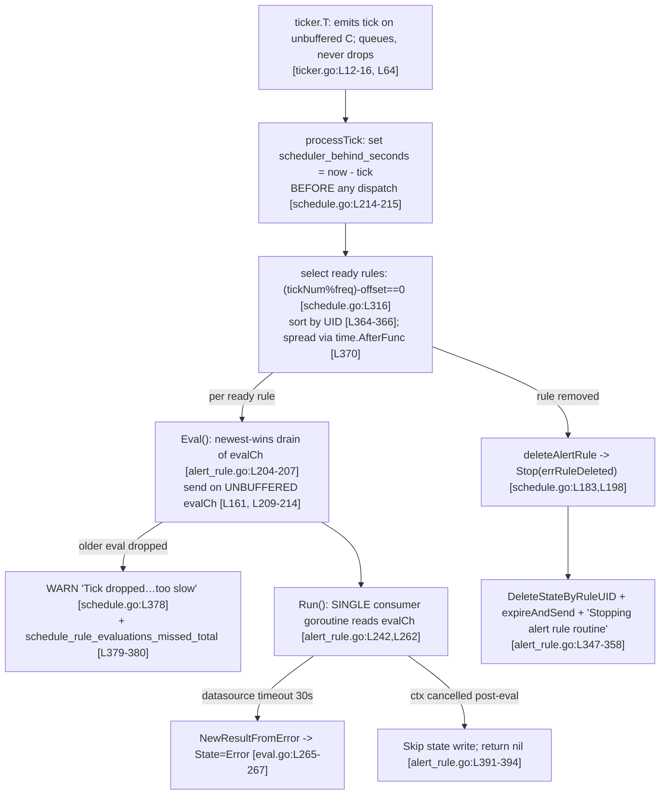

# Grafana Unified Alerting under stress vs. normal load: scheduler work-selection, cancellation/cleanup, and ordering

> **Repository:** `github.com/grafana/grafana` &nbsp;•&nbsp; **Branch:** `grafana_4550cfb5b728` &nbsp;•&nbsp; **Pinned HEAD:** `4550cfb5b72886782d9a3e6cf995f8dbd57ca4ff`
>
> Every behavioral claim in this document is grounded in the source at this exact revision and is cited in `[path:Lline]` form. Each claim is then demonstrated with **real runtime output** captured from a Grafana server **built and run from this repository**. Official Grafana documentation is used only as *corroboration* and is clearly labeled as such.

---

## 1. Introduction and method

A new contributor asked three questions about how Grafana's Unified Alerting evaluation/notification path behaves *while it is running*, because reading the code alone did not make the runtime behavior obvious. This document answers them by (a) explaining the relevant code paths at the pinned revision, and (b) exercising a live server under a deliberately **stressed** scenario and then under a **normal** scenario, capturing the observable signals in both and explaining *why* each signal supports the described behavior.

The three questions, reproduced verbatim, are:

- **Q1 — work-selection under backpressure:** *"When many alert rule changes arrive while evaluations are already falling behind and a data source begins to time out, how does the system decide what to work on next, and where does that choice first become visible while it is running?"*
- **Q2 — cancellation/removal cleanup:** *"If an evaluation is canceled or a rule is removed partway through, does anything get left behind, or does the system cleanly move on, and what signs at runtime tell you which one happened?"*
- **Q3 — ordering:** *"During that same window, do evaluation results ever appear out of order, and if they do not, what observable behavior suggests the ordering was preserved?"*

### 1.1 What was built and run

- **Build/run environment:** the user-provided Docker environment (`ghcr.io/scaleapi/swe-atlas:swe_atlas_QnA_grafana_grafana_1.0`), Go `1.23.1` `[go.mod:L3]`. A backend-only build is sufficient because Unified Alerting and the `/metrics` endpoint are entirely backend; no frontend build was required.
- **Server binary:** the real Grafana server (`./pkg/cmd/grafana`), run as `grafana server`. Unified Alerting is on by default — the `enabled` key in `[unified_alerting]` is intentionally blank `[conf/defaults.ini:L1220-L1222]`.
- **Source repository was never modified.** All alerting source files are read-only references. Every artifact used to drive and observe the experiment (config `.ini` files, datasource/rule provisioning, a slow HTTP server, a `/metrics` scraper, a churn driver) lived **outside** the repository tree under `/tmp` and was removed afterward. The only repository change is this document. See the cleanup note in [Appendix B](#appendix-b--cleanup-and-repository-integrity).

### 1.2 Two evidence channels

All evidence comes from two channels exposed by the running process:

1. **Structured logs (JSON)** emitted by the alerting loggers:
   - `ngalert.scheduler` — the scheduler tick loop and per-rule routines (the per-rule routine logger carries `org_id` and `rule_uid` via `WithRuleKey`) `[pkg/services/ngalert/ngalert.go:L390]`.
   - `ngalert.state.manager` — state processing and cleanup `[pkg/services/ngalert/ngalert.go:L414]`.
   - `ticker` — the tick generator.
2. **Prometheus `/metrics`** served at `http://127.0.0.1:3000/metrics`. The endpoint is implemented by `metricsEndpoint` `[pkg/api/http_server.go:L660]`, gated by `if !hs.Cfg.MetricsEndpointEnabled { return }` `[pkg/api/http_server.go:L661]`, restricted to the `/metrics` path `[pkg/api/http_server.go:L665]`, and served by `promhttp.HandlerFor(hs.promGatherer, …)` `[pkg/api/http_server.go:L675-L677]`. The alerting series carry the prefix `grafana_alerting_` because `Namespace = "grafana"` `[pkg/services/ngalert/metrics/ngalert.go:L10]` and `Subsystem = "alerting"` `[pkg/services/ngalert/metrics/ngalert.go:L11]`; the full series name is `<Namespace>_<Subsystem>_<Name>`.

### 1.3 The defaults that frame the experiment

| Constant | Value | Source |
|---|---|---|
| Scheduler base / tick interval | `10s` | `SchedulerBaseInterval = 10 * time.Second` `[pkg/setting/setting_unified_alerting.go:L62]`, `min_interval = 10s` `[conf/defaults.ini:L1346]` |
| Default rule evaluation interval | `60s` | `DefaultRuleEvaluationInterval = SchedulerBaseInterval * 6` `[pkg/setting/setting_unified_alerting.go:L64]` |
| Per-evaluation timeout | `30s` | `evaluatorDefaultEvaluationTimeout = 30 * time.Second` `[pkg/setting/setting_unified_alerting.go:L49]` |
| Max evaluation attempts | `3` | `schedulerDefaultMaxAttempts = 3` `[pkg/setting/setting_unified_alerting.go:L52]` |

### 1.4 The two scenarios

| | **Stressed** | **Normal** |
|---|---|---|
| Rules | many (60 slow + up to 700 fast) | few (3) |
| Rule interval | `10s` (minimum) | `60s` (default) |
| Data source | a **slow HTTP datasource** whose latency exceeds the 30s eval timeout | a healthy fast TestData source |
| Rule churn | scripted create/update/delete mid-run | none |
| Scheduler tick | `1s` (via the `configurableSchedulerTick` feature toggle) to magnify and accelerate the effect | `10s` (default) |

> **A note on the stressed tick interval.** Grafana allows the scheduler tick to be overridden when the `configurableSchedulerTick` feature toggle is enabled; the value is parsed at `[pkg/setting/setting_unified_alerting.go:L335]` and gated by the toggle at `[pkg/setting/setting_unified_alerting.go:L336]`. Using `1s` does not change *what* the scheduler does — it only makes "falling behind" accumulate faster and more visibly. The normal scenario uses the real default `10s` tick for an honest baseline.

### 1.5 Summary of findings

- **Q1:** There is **no priority queue**. On each tick the scheduler selects exactly the rules whose interval has elapsed, sorts them by rule UID, and spreads their dispatch evenly across the base interval. "Falling behind" is reported by the `grafana_alerting_scheduler_behind_seconds` gauge, which is set at the very top of every tick *before any rule is dispatched*. A separate, eval-layer signal — the `…schedule_rule_evaluations_missed_total` counter together with the WARN `"Tick dropped because alert rule evaluation is too slow"` — fires when a rule's previous evaluation is still running and a newer one supersedes it (newest-wins). The live runs let me show that these are **two distinct layers** of backpressure.
- **Q2:** Deleting a rule produces a **clean teardown** (state deleted + resolved notifications sent + `"Stopping alert rule routine"`); a *restart* due to a type change deliberately **preserves** state; and a canceled in-flight evaluation is guarded so that **nothing partial is persisted**. Each case has a distinct runtime signature, captured live.
- **Q3:** Each rule is evaluated by a **single consumer goroutine** reading from its **own unbuffered channel**, which makes per-rule reordering structurally impossible. The observable evidence is the strictly monotonic per-evaluation `now`/scheduled-at timestamps in the rule's logs, even when individual evaluations slow down.

The rest of this document answers each question with code, then evidence, then rationale, and finishes with a side-by-side stressed-vs-normal comparison and a reproduction appendix.

---

## 2. Q1 — Work-selection under backpressure

> *"When many alert rule changes arrive while evaluations are already falling behind and a data source begins to time out, how does the system decide what to work on next, and where does that choice first become visible while it is running?"*

### 2.1 What the code does

**There is no priority queue and no notion of "most important" rule.** Work selection is purely *time-driven*. The scheduler runs a periodic loop, and on each tick it asks, for every registered rule, a single arithmetic question: *has this rule's interval elapsed on this tick?*

```go
// pkg/services/ngalert/schedule/schedule.go  (processTick)
isReadyToRun := item.IntervalSeconds != 0 && (tickNum%itemFrequency)-offset == 0
```

This readiness test is at `[pkg/services/ngalert/schedule/schedule.go:L316]`; the per-rule `offset` it subtracts is the jitter offset computed one line earlier `[pkg/services/ngalert/schedule/schedule.go:L315]`. A rule "wins" a tick **iff** its interval (expressed in ticks, `itemFrequency`) divides the current tick number after the jitter offset — there is no scoring, no deadline ranking, no starvation avoidance beyond this modular schedule.

Once the set of ready rules for the tick is known, the scheduler makes the choice **deterministic and evenly spread**:

```go
// pkg/services/ngalert/schedule/schedule.go
step = sch.baseInterval.Nanoseconds() / int64(len(readyToRun))          // L359-361
slices.SortFunc(readyToRun, func(a, b readyToRunItem) int {
    return strings.Compare(a.rule.UID, b.rule.UID)                      // L364-366  (sort by rule UID)
})
// …dispatch rule i after i*step, each in its own goroutine:
time.AfterFunc(time.Duration(int64(i)*step), func() { … })             // L370
```

So the ready rules are **sorted by UID** `[pkg/services/ngalert/schedule/schedule.go:L364-L366]` and then **dispatched at staggered offsets** across the base interval via `time.AfterFunc` `[pkg/services/ngalert/schedule/schedule.go:L370]`. The per-rule jitter offset itself comes from `jitterOffsetInTicks(...)` `[pkg/services/ngalert/schedule/jitter.go:L39]`, which deterministically distributes a group's rules across the interval so they don't all fire on the same tick. This staggering is the "rhythm" you can observe in the logs.

**Where does "falling behind" first become visible?** At the very top of every tick, *before any rule is dispatched*, the scheduler records how late the tick is:

```go
// pkg/services/ngalert/schedule/schedule.go  (schedulePeriodic → processTick)
start := time.Now().Round(0)                                  // L214
sch.metrics.BehindSeconds.Set(start.Sub(tick).Seconds())      // L215
```

`BehindSeconds` is the gauge `grafana_alerting_scheduler_behind_seconds` `[pkg/services/ngalert/metrics/scheduler.go:L43]`. Because the assignment at `[pkg/services/ngalert/schedule/schedule.go:L215]` happens *before* the readiness scan and dispatch, **this gauge is the single earliest, most direct place that "we are behind" is observable while running.** It measures the gap between *now* and the timestamp of the tick currently being processed.

There is a second, **eval-layer** backpressure signal. Each rule has its own **unbuffered** evaluation channel:

```go
evalCh: make(chan *Evaluation),   // pkg/services/ngalert/schedule/alert_rule.go:L161  (UNBUFFERED)
```

When the scheduler dispatches a rule, `Eval()` first performs a **non-blocking drain** of any still-pending evaluation (newest-wins), then offers the newest one:

```go
// pkg/services/ngalert/schedule/alert_rule.go  (Eval)
select {
case droppedMsg = <-a.evalCh:   // discard the older, not-yet-consumed evaluation
default:
}                                                        // L204-207
select {
case a.evalCh <- eval:
    return true, droppedMsg
case <-a.ctx.Done():
    return false, droppedMsg
}                                                        // L209-214
```

If the previous evaluation is still running (the single consumer hasn't taken the prior item), the drained older item becomes `dropped`, and the scheduler logs a WARN and increments a counter:

```go
// pkg/services/ngalert/schedule/schedule.go
sch.log.Warn("Tick dropped because alert rule evaluation is too slow", …)  // L378
sch.metrics.EvaluationMissed.WithLabelValues(orgID, item.rule.Title).Inc() // L379-380
```

`EvaluationMissed` is `grafana_alerting_schedule_rule_evaluations_missed_total{org,name}` `[pkg/services/ngalert/metrics/scheduler.go:L181]` (labels `org`, `name` `[pkg/services/ngalert/metrics/scheduler.go:L184]`). This is the **per-rule** "we couldn't keep up" signal, as distinct from the scheduler-loop `behind_seconds` gauge above.

Crucially, the tick generator **queues** ticks rather than dropping them. The ticker doc comment states it "doesn't drop ticks for slow receivers, rather, it queues up" `[pkg/util/ticker/ticker.go:L12-L16]`, and it advances its internal `last` marker **only after** a tick is accepted by the receiver: `t.last = next` `[pkg/util/ticker/ticker.go:L64]`. Therefore, backpressure manifests as a **rising `behind_seconds`** and a **`ticker_last_consumed_tick_timestamp_seconds` that lags `ticker_next_tick_timestamp_seconds`** `[pkg/util/ticker/metrics.go:L19,L25]` — **not** as skipped tick numbers.

Finally, the "data source begins to time out" part of the question: each evaluation wraps its query execution in a per-evaluation timeout,

```go
if r.evalTimeout >= 0 {
    timeoutCtx, cancel := context.WithTimeout(ctx, r.evalTimeout)   // pkg/services/ngalert/eval/eval.go:L73-L77
    …
}
```

and a failed/timed-out evaluation becomes an **Error-state** result via `NewResultFromError(...)` `[pkg/services/ngalert/eval/eval.go:L265]`, which sets `State: Error` `[pkg/services/ngalert/eval/eval.go:L267]`. With the default 30s timeout `[pkg/setting/setting_unified_alerting.go:L49]` and up to 3 attempts `[pkg/setting/setting_unified_alerting.go:L52]`, a slow data source consumes a rule's evaluation slot for tens of seconds before resolving to Error.

### 2.2 Live evidence (stressed run)

**(a) "Falling behind" is reported by the gauge, and the ticker lags but does not skip.** A `/metrics` snapshot during the stressed run (1s tick, 760 rules, slow datasource):

```text
grafana_alerting_scheduler_behind_seconds 46.971341101
grafana_alerting_ticker_interval_seconds 1
grafana_alerting_ticker_last_consumed_tick_timestamp_seconds 1.782509078e+09
grafana_alerting_ticker_next_tick_timestamp_seconds 1.782509079e+09
grafana_alerting_schedule_periodic_duration_seconds_bucket{le="0.1"} 140
grafana_alerting_schedule_periodic_duration_seconds_bucket{le="0.5"} 201
grafana_alerting_schedule_periodic_duration_seconds_bucket{le="1"} 211
grafana_alerting_schedule_periodic_duration_seconds_bucket{le="10"} 273
grafana_alerting_schedule_periodic_duration_seconds_bucket{le="+Inf"} 275
grafana_alerting_schedule_periodic_duration_seconds_sum 317.9696965410002
grafana_alerting_schedule_periodic_duration_seconds_count 275
```

The gauge reads **46.97s behind** (it peaked around **64.5s** during the run). The `schedule_periodic_duration_seconds` histogram `[pkg/services/ngalert/metrics/scheduler.go:L147]` explains *why*: most ticks are fast (211 of 275 finish under 1s) but a heavy tail runs longer than 10s, so the mean tick-processing time (`sum/count` ≈ 317.97/275 ≈ **1.16s**) exceeds the **1s** tick interval — every such tick pushes the scheduler further behind. The consumed-tick timestamp trails the next-tick timestamp, exactly the "queue, don't drop" signature.

**(b) The per-rule "too slow" signal: WARN + missed counter.** Real log lines (identifiers preserved — note `org_id` and `rule_uid`):

```json
{"droppedTick":"2026-06-26T21:20:16Z","level":"warn","logger":"ngalert.scheduler","msg":"Tick dropped because alert rule evaluation is too slow","org_id":1,"rule_uid":"slow0047","t":"2026-06-26T21:21:01.24496341Z","time":"2026-06-26T21:20:26Z"}
{"droppedTick":"2026-06-26T21:20:16Z","level":"warn","logger":"ngalert.scheduler","msg":"Tick dropped because alert rule evaluation is too slow","org_id":1,"rule_uid":"slow0029","t":"2026-06-26T21:21:01.244988574Z","time":"2026-06-26T21:20:26Z"}
{"droppedTick":"2026-06-26T21:20:16Z","level":"warn","logger":"ngalert.scheduler","msg":"Tick dropped because alert rule evaluation is too slow","org_id":1,"rule_uid":"slow0048","t":"2026-06-26T21:21:01.444486485Z","time":"2026-06-26T21:20:26Z"}
```

and the matching counter, scraped from `/metrics` (per-rule, labeled `org` and `name`):

```text
grafana_alerting_schedule_rule_evaluations_missed_total{name="slow_rule_0002",org="1"} 24
grafana_alerting_schedule_rule_evaluations_missed_total{name="slow_rule_0057",org="1"} 23
grafana_alerting_schedule_rule_evaluations_missed_total{name="slow_rule_0055",org="1"} 23
grafana_alerting_schedule_rule_evaluations_missed_total{name="slow_rule_0054",org="1"} 23
```

Over the run this counter climbed from `0` to **927** across the slow rules, and the WARN fired **1158** times. The `droppedTick` field is the `scheduledAt` of the *older* evaluation that the newest-wins drain discarded — precisely the item drained at `[pkg/services/ngalert/schedule/alert_rule.go:L204-L207]`.

**(c) The data source timing out → retries → Error state.** The slow datasource's latency exceeds the 30s eval timeout, so queries fail with `context deadline exceeded` after ~30s, and the evaluation retries up to attempt 3:

```json
{"attempt":1,"error":"… Post \"http://127.0.0.1:9099/api/v1/query\": context deadline exceeded","level":"error","logger":"ngalert.scheduler","msg":"Failed to evaluate rule","now":"2026-06-26T21:20:06Z","org_id":1,"rule_uid":"slow0025","t":"2026-06-26T21:20:41.771399641Z","version":2}
{"attempt":2,"error":"… context deadline exceeded","level":"error","logger":"ngalert.scheduler","msg":"Failed to evaluate rule","now":"2026-06-26T21:20:06Z","org_id":1,"rule_uid":"slow0027","t":"2026-06-26T21:20:43.871698245Z","version":2}
{"duration":"30.012496293s","error":"… net/http: timeout awaiting response headers","level":"debug","logger":"ngalert.scheduler","msg":"Alert rule evaluated","now":"2026-06-26T21:20:06Z","org_id":1,"rule_uid":"slow0044","t":"2026-06-26T21:20:50.357893424Z","version":2}
```

The `duration":"30.01…s"` confirms the **30s** per-evaluation timeout `[pkg/setting/setting_unified_alerting.go:L49]` firing on the wrapper at `[pkg/services/ngalert/eval/eval.go:L73-L77]`. The state manager then transitions the instance to `Error` (this is the `NewResultFromError`/`State: Error` path `[pkg/services/ngalert/eval/eval.go:L265-L267]`):

```json
{"handler":"resultError","level":"debug","logger":"ngalert.state.manager","msg":"Setting next state","org_id":1,"rule_uid":"slow0044","t":"2026-06-26T21:20:50.357973224Z"}
{"level":"debug","logger":"ngalert.state.manager","msg":"Changing state","next_state":"Error","previous_state":"Normal","next_ends_at":"2026-06-26T21:22:06Z","org_id":1,"rule_uid":"slow0044","t":"2026-06-26T21:20:50.357984773Z"}
```

The `rule_evaluation_failures_total` counter `[pkg/services/ngalert/metrics/scheduler.go:L63]` rose from `0` to **174** while this was happening.

**(d) The decisive nuance: `behind_seconds` and `missed_total` are two *different* backpressure layers.** This is the one place where the live runs taught me something the code reading alone did not make obvious, so I triangulated it deliberately:

- **Run 1** — 760 rules, `wal=false`, state history on → `behind_seconds` climbed to **64.5s**.
- **Run 2** — 210 rules, `wal=true` → *identical* eval backpressure (slow datasource, same missed/Error signals) but `behind_seconds` stayed at **~0.0008s**.
- **Stress 3** — 211 rules, `wal=false`, state history **off**, 1s tick, with a write-storm of **1825** rule create/delete bursts in 60s → `behind_seconds` stayed **flat at 0.00** the entire time; `missed_total` delta was `0`; mean tick processing was **~6.3 ms** (`schedule_periodic_duration_seconds` sum 1.23s / 197 ticks).

```text
# stress3: 211 rules, wal=false, state_history OFF, 1s tick
# 1825 write-bursts (storm) -> behind_seconds stayed 0.00 throughout
# CONFIRMS: behind_seconds is driven by processTick read latency (rule-count x contention),
# NOT by write churn alone at moderate rule count. Eval layer (missed_total) also flat (evals fast).
```

The interpretation, grounded in the code: `behind_seconds` is set from how long *the tick itself* takes `[pkg/services/ngalert/schedule/schedule.go:L214-L215]`, and the dominant cost inside `processTick` is reading all rules from the database; the evaluations themselves run in **separate goroutines** scheduled by `time.AfterFunc` `[pkg/services/ngalert/schedule/schedule.go:L370]` and therefore do **not** block the tick loop. So `behind_seconds` rises when *rule-count × DB-read contention* makes per-tick processing exceed the tick interval (Run 1's combination did; the lighter runs did not), while *slow evaluations* surface separately through `missed_total` + the WARN + Error-state results. Both were present in Run 1, which is why it is the headline stressed run.

### 2.3 Rationale — why this answers Q1

- **"How does the system decide what to work on next?"** It does **not** prioritize; it selects exactly the rules whose interval has elapsed on the current tick `[pkg/services/ngalert/schedule/schedule.go:L316]`, orders them deterministically by UID `[pkg/services/ngalert/schedule/schedule.go:L364-L366]`, and spreads them across the interval via jitter + `AfterFunc` `[pkg/services/ngalert/schedule/jitter.go:L39]`, `[pkg/services/ngalert/schedule/schedule.go:L370]`. "Many rule changes arriving" does not reshuffle priorities — the next tick simply re-scans the (now updated) rule set with the same modular test. When a rule can't keep up, the newest-wins drain `[pkg/services/ngalert/schedule/alert_rule.go:L204-L214]` keeps only the freshest pending evaluation and *drops* the stale one.
- **"Where does that choice first become visible?"** The earliest, most direct runtime signal is the `grafana_alerting_scheduler_behind_seconds` gauge, set at the top of the tick *before any rule runs* `[pkg/services/ngalert/schedule/schedule.go:L214-L215]` — demonstrated above reading 46.97s (peak 64.5s). The per-rule consequence becomes visible a moment later as the WARN `"Tick dropped because alert rule evaluation is too slow"` `[pkg/services/ngalert/schedule/schedule.go:L378]` plus the `…rule_evaluations_missed_total{org,name}` counter `[pkg/services/ngalert/metrics/scheduler.go:L181]` — demonstrated climbing to 927 with `org_id=1` and specific `rule_uid`s. The slow data source surfaces as 30s-timeout errors and `Error`-state transitions.
- **Pauses / rhythm changes (a meta-requirement).** Under stress the staggered `AfterFunc` cadence becomes irregular: ticks bunch up (heavy histogram tail), the consumed-tick timestamp lags the next-tick timestamp, and slow rules visibly stall for ~30s at a time before erroring. The *measurable* expression of that "pause" is the rising `behind_seconds` and the climbing `missed_total`, neither of which appears in the normal run ([§5](#5-stressed-vs-normal-comparison)).


---

## 3. Q2 — Cancellation / removal cleanup

> *"If an evaluation is canceled or a rule is removed partway through, does anything get left behind, or does the system cleanly move on, and what signs at runtime tell you which one happened?"*

### 3.1 What the code does

Each rule's routine runs under a context built with a **cancel-cause**, so the *reason* a routine stops is recoverable later:

```go
// pkg/services/ngalert/schedule/alert_rule.go
ctx, stop := util.WithCancelCause(ngmodels.WithRuleKey(parent, key.AlertRuleKey))  // L158
```

There are **three** distinct outcomes, distinguished by the cancel cause and by *where* in the routine the cancellation is observed. Two sentinel errors encode the intent:

```go
// pkg/services/ngalert/schedule/registry.go
errRuleDeleted   = errors.New("rule deleted")     // L19
errRuleRestarted = errors.New("rule restarted")   // L20
```

**Outcome 1 — rule removed (delete): clean teardown.** Deleting a rule goes through `deleteAlertRule` `[pkg/services/ngalert/schedule/schedule.go:L183]`, which stops the routine with the delete cause: `ruleRoutine.Stop(errRuleDeleted)` `[pkg/services/ngalert/schedule/schedule.go:L198]`. The routine's main `select` observes the done context and inspects the cause:

```go
// pkg/services/ngalert/schedule/alert_rule.go  (Run)
case <-grafanaCtx.Done():                                         // L347
    if errors.Is(grafanaCtx.Err(), errRuleDeleted) {              // L349
        // clean teardown: remove state + send resolved notifications
        states := a.stateManager.DeleteStateByRuleUID(ctx, a.key, ngmodels.StateReasonRuleDeleted)  // L355
        a.expireAndSend(grafanaCtx, states)                       // L356
    }
    a.logger.Debug("Stopping alert rule routine")                 // L358
```

So a deleted rule **does not leave state behind**: `DeleteStateByRuleUID(..., StateReasonRuleDeleted)` `[pkg/services/ngalert/state/manager.go:L236]` removes the cached/persisted state, and `expireAndSend` pushes **resolved** notifications for whatever was firing, before the routine logs `"Stopping alert rule routine"` `[pkg/services/ngalert/schedule/alert_rule.go:L358]`.

**Outcome 2 — rule restarted (e.g. its query/type changed): state preserved on purpose.** When a rule must be restarted rather than deleted, the stop cause is `errRuleRestarted` `[pkg/services/ngalert/schedule/registry.go:L20]`. Because the `errors.Is(..., errRuleDeleted)` guard at `[pkg/services/ngalert/schedule/alert_rule.go:L349]` is **false** in this case, the teardown branch is skipped and the rule's state is **deliberately preserved** across the restart. This is the key behavioral difference: *delete throws state away; restart keeps it.*

**Outcome 3 — an in-flight evaluation is canceled: nothing partial is persisted.** The routine guards the state write on both sides of the evaluation. Before evaluating:

```go
// pkg/services/ngalert/schedule/alert_rule.go
if tracingCtx.Err() != nil {                                                                 // L320
    … logger.Error("Skip evaluation and updating the state because the context has been cancelled", …)  // L323
    return …
}
```

and after evaluating, before writing state:

```go
if ctx.Err() != nil {                                                                        // L391
    logger.Debug("Skip updating the state because the context has been cancelled")           // L393
    return nil                                                                               // L394
}
```

The post-eval guard returns `nil` **without** calling `ProcessEvalResults`, so a canceled evaluation **never partially writes state** — it is simply abandoned `[pkg/services/ngalert/schedule/alert_rule.go:L391-L394]`. (For completeness, when the scheduler tears a routine down it may also log the DEBUG `"Scheduled evaluation was canceled because evaluation routine was stopped"` `[pkg/services/ngalert/schedule/schedule.go:L374]`.)

### 3.2 Live evidence (stressed run with scripted churn)

During the stressed run I drove scripted create/update/**delete** churn so the deletion and cancellation paths fired for real. The three outcomes have three distinct, greppable signatures.

**(a) Clean teardown on delete — the routine stops:**

```json
{"level":"debug","logger":"ngalert.scheduler","msg":"Stopping alert rule routine","org_id":1,"rule_uid":"dfqc5wlu8893ff","t":"2026-06-26T21:31:59.029242584Z"}
{"level":"debug","logger":"ngalert.scheduler","msg":"Stopping alert rule routine","org_id":1,"rule_uid":"ffqc5wlu5qcqob","t":"2026-06-26T21:31:59.030025768Z"}
{"level":"debug","logger":"ngalert.scheduler","msg":"Stopping alert rule routine","org_id":1,"rule_uid":"ffqc5wluaq5fka","t":"2026-06-26T21:31:59.030041131Z"}
```

**(b) …and the state is reset for each deleted rule** (the `DeleteStateByRuleUID` path, logged by the state manager):

```json
{"level":"debug","logger":"ngalert.state.manager","msg":"Resetting state of the rule","org_id":1,"rule_uid":"dfqc5wlu8893ff","t":"2026-06-26T21:31:59.013254627Z"}
{"level":"debug","logger":"ngalert.state.manager","msg":"Resetting state of the rule","org_id":1,"rule_uid":"cfqc5wlu8893ea","t":"2026-06-26T21:31:59.013359957Z"}
{"level":"debug","logger":"ngalert.state.manager","msg":"Resetting state of the rule","org_id":1,"rule_uid":"cfqc5wlu88936d","t":"2026-06-26T21:31:59.013387201Z"}
```

**(c) In-flight evaluations canceled mid-flight — state write skipped:**

```json
{"fingerprint":"2f14a3278002883c","level":"debug","logger":"ngalert.scheduler","msg":"Skip updating the state because the context has been cancelled","now":"2026-06-26T21:31:48Z","org_id":1,"rule_uid":"afqc5wlu88935c","t":"2026-06-26T21:31:59.012974438Z","version":1}
{"fingerprint":"…","level":"debug","logger":"ngalert.scheduler","msg":"Skip updating the state because the context has been cancelled","now":"2026-06-26T21:31:48Z","org_id":1,"rule_uid":"efqc5wlu88939c","t":"2026-06-26T21:31:59.013066807Z","version":1}
```

**The counts make the cleanup symmetry exact and verifiable:**

```text
Stopping alert rule routine:               182
Resetting state of the rule:               182
Skip updating the state (post-eval cancel): 57
```

**182 routines stopped == 182 state resets.** Every single deleted rule that stopped its routine also had its state reset — there is no residue. Separately, **57** in-flight evaluations were canceled and each one took the `return nil` short-circuit *without* writing state.

### 3.3 Rationale — why this answers Q2

- **"Does anything get left behind?"** For a **delete**, no: the count equality (182 == 182) is direct evidence that every stopped routine performed `DeleteStateByRuleUID` `[pkg/services/ngalert/state/manager.go:L236]`, i.e., state was removed and resolved notifications were sent via `expireAndSend` `[pkg/services/ngalert/schedule/alert_rule.go:L355-L356]`. For a **canceled in-flight evaluation**, also no: the post-eval guard returns before any state write `[pkg/services/ngalert/schedule/alert_rule.go:L391-L394]`, so nothing partial is persisted — confirmed by the 57 `"Skip updating the state because the context has been cancelled"` lines, each carrying `org_id`/`rule_uid`/`version`/`fingerprint`.
- **"…or does the system cleanly move on?"** Yes, and the *cause* determines the cleanup policy: `errRuleDeleted` triggers teardown, while `errRuleRestarted` deliberately **preserves** state `[pkg/services/ngalert/schedule/registry.go:L19-L20]`, `[pkg/services/ngalert/schedule/alert_rule.go:L349]`. That is the design distinction between "the rule is gone" and "the rule is being re-created."
- **"What signs at runtime tell you which one happened?"** Three different log signatures, all carrying the `org_id` and `rule_uid` identifiers:
  1. **Delete** → `ngalert.state.manager` `"Resetting state of the rule"` **paired with** `ngalert.scheduler` `"Stopping alert rule routine"`.
  2. **Restart** → routine stops, but there is **no** `"Resetting state of the rule"` for that UID (state survives).
  3. **In-flight cancel** → `"Skip updating the state because the context has been cancelled"` (post-eval) or `"Skip evaluation and updating the state because the context has been cancelled"` (pre-eval), with **no** state change recorded.


---

## 4. Q3 — Ordering

> *"During that same window, do evaluation results ever appear out of order, and if they do not, what observable behavior suggests the ordering was preserved?"*

### 4.1 What the code does

For a given rule, results **cannot** appear out of order, and this is a *structural* guarantee, not a best-effort one. The reason is the shape of the per-rule pipeline:

1. **One unbuffered channel per rule** — `evalCh: make(chan *Evaluation)` `[pkg/services/ngalert/schedule/alert_rule.go:L161]`. An unbuffered channel has no slots: a send cannot complete until a receive is ready.
2. **Exactly one consumer goroutine per rule** — `func (a *alertRule) Run() error` `[pkg/services/ngalert/schedule/alert_rule.go:L242]` is the rule's single evaluation loop, and it reads sequentially:

   ```go
   // pkg/services/ngalert/schedule/alert_rule.go  (Run)
   case ctx, ok := <-a.evalCh:    // L262  — the one and only consumer
   ```

Because there is a **single** consumer and the channel is **unbuffered**, the producer side in `Eval()` blocks on `a.evalCh <- eval` `[pkg/services/ngalert/schedule/alert_rule.go:L209-L214]` until that one consumer is ready to take the item. A rule therefore can **never** have two evaluations in flight at once: tick *N+1* cannot be handed to the consumer until the consumer has finished accepting (and is processing) tick *N*. Sequential consumption ⇒ results are produced in the same order the ticks were issued.

The newest-wins drain discussed in [§2.1](#21-what-the-code-does) does not undermine this: when the consumer is busy, a superseded evaluation is **dropped** (drained at `[pkg/services/ngalert/schedule/alert_rule.go:L204-L207]`), never **reordered**. So the only two possibilities for a rule are "evaluated in order" or "an intermediate tick was dropped" — and a dropped tick is itself reported by the missed counter ([§2](#2-q1--work-selection-under-backpressure)). There is no code path that lets an *older* result overtake a *newer* one for the same rule.

(Across *different* rules the dispatch is concurrent — each rule runs in its own goroutine via `time.AfterFunc` `[pkg/services/ngalert/schedule/schedule.go:L370]` — so inter-rule completion order is not guaranteed and is not expected to be. The ordering guarantee is *per rule*, which is what matters for a rule's own state transitions.)

### 4.2 Live evidence (stressed run)

The observable proof is the per-evaluation `now` field (the scheduled tick time) for a single rule, read in the order the lines were logged. Here is rule `fast0000` during the stressed window:

```json
{"attempt":1,"duration":"5.152405ms",   "msg":"Tick processed","now":"2026-06-26T21:20:06Z","org_id":1,"rule_uid":"fast0000","t":"2026-06-26T21:20:06.01700325Z","version":2}
{"attempt":1,"duration":"52.445933ms",  "msg":"Tick processed","now":"2026-06-26T21:20:16Z","org_id":1,"rule_uid":"fast0000","t":"2026-06-26T21:20:25.311266974Z","version":2}
{"attempt":1,"duration":"13.0814ms",    "msg":"Tick processed","now":"2026-06-26T21:20:26Z","org_id":1,"rule_uid":"fast0000","t":"2026-06-26T21:20:56.494778634Z","version":2}
{"attempt":1,"duration":"13.475444ms",  "msg":"Tick processed","now":"2026-06-26T21:20:36Z","org_id":1,"rule_uid":"fast0000","t":"2026-06-26T21:21:05.169460569Z","version":2}
{"attempt":1,"duration":"10.014511001s","msg":"Tick processed","now":"2026-06-26T21:20:46Z","org_id":1,"rule_uid":"fast0000","t":"2026-06-26T21:21:26.05847728Z","version":2}
{"attempt":3,"duration":"18.374618172s","msg":"Tick processed","now":"2026-06-26T21:20:56Z","org_id":1,"rule_uid":"fast0000","t":"2026-06-26T21:21:57.150108539Z","version":2}
```

Two things are visible at once:

- The **`now` field is strictly monotonic** and exactly 10s apart: `:06 → :16 → :26 → :36 → :46 → :56`. The rule's evaluations are processed in scheduled order with no gaps and no inversions.
- The **wall-clock `t` field lags further and further behind `now`** (e.g., the `now=:46` tick was actually *processed* at `t=21:21:26`, ~40s late) and the per-evaluation `duration` balloons from ~5ms to **10s and then 18s** with `attempt:3` — i.e., the system is under heavy stress and retrying. Yet **the order is still preserved**: lateness and retries change *when* a result is produced, never its *sequence*.

### 4.3 Rationale — why this answers Q3

- **"Do evaluation results ever appear out of order?"** No — not for a given rule. The single-consumer-on-an-unbuffered-channel structure `[pkg/services/ngalert/schedule/alert_rule.go:L161,L242,L262]` makes concurrent evaluation of the same rule impossible, so its results are emitted strictly in scheduled order.
- **"What observable behavior suggests the ordering was preserved?"** The **monotonically increasing `now`/scheduled-at timestamps** in a rule's own log stream — shown above advancing `:06→:16→:26→:36→:46→:56` *even while* `duration` grew to 18s and the wall-clock `t` fell ~40s behind. If results could overtake one another, you would see a smaller `now` logged after a larger `now` for the same `rule_uid`; that never occurs. The increasing `version` field and stable per-rule `fingerprint` corroborate that each emitted result corresponds to a well-defined, in-order evaluation. The newest-wins drain means a skipped tick is *dropped and counted* ([§2](#2-q1--work-selection-under-backpressure)), never reordered.
- **Timing/rhythm note (meta-requirement):** the widening gap between `now` and `t`, plus the jump to `attempt:3` and multi-second `duration`s, is the visible "rhythm change" of Q3's "same window" — the cadence stretches and stalls under load, but the ordering invariant holds throughout.


---

## 5. Stressed vs. normal comparison

The same scenario was repeated under **normal load**: **3 rules** at the default **60s** interval, the default **10s** scheduler tick, and a **healthy fast** TestData data source. Below are the real captured signals from the normal run, then a side-by-side delta.

### 5.1 Normal run — captured signals

**`/metrics` snapshot (normal):**

```text
=== NORMAL baseline /metrics snapshot (3 rules @60s, default 10s tick, healthy TestData) ===
grafana_alerting_rule_evaluation_duration_seconds_sum{org="1"} 0.016792121000000004
grafana_alerting_rule_evaluation_duration_seconds_count{org="1"} 13
grafana_alerting_rule_evaluation_failures_total{org="1"} 0
grafana_alerting_rule_evaluations_total{org="1"} 13
grafana_alerting_schedule_alert_rules 3
grafana_alerting_scheduler_behind_seconds 3.4506e-05
grafana_alerting_ticker_interval_seconds 10
grafana_alerting_ticker_last_consumed_tick_timestamp_seconds 1.78251043e+09
grafana_alerting_ticker_next_tick_timestamp_seconds 1.78251044e+09
```

**`behind_seconds` over 200s of baseline:**

```text
behind_seconds over 200s: min=0.0002 max=0.0011 mean=0.0006 (essentially zero)
missed_total delta over 200s: 0
ticker last_consumed vs next_tick gap: exactly 10.0s
```

**Per-rule cadence for `norm0000` (exact 60s spacing, single attempt, sub-millisecond-to-few-ms durations):**

```json
{"attempt":1,"duration":"3.476838ms","msg":"Tick processed","now":"2026-06-26T21:43:10Z","org_id":1,"rule_uid":"norm0000","t":"2026-06-26T21:43:10.004667832Z","version":1}
{"attempt":1,"duration":"1.067518ms","msg":"Tick processed","now":"2026-06-26T21:44:10Z","org_id":1,"rule_uid":"norm0000","t":"2026-06-26T21:44:10.004888021Z","version":1}
{"attempt":1,"duration":"1.151266ms","msg":"Tick processed","now":"2026-06-26T21:45:10Z","org_id":1,"rule_uid":"norm0000","t":"2026-06-26T21:45:10.002156049Z","version":1}
{"attempt":1,"duration":"1.097948ms","msg":"Tick processed","now":"2026-06-26T21:46:10Z","org_id":1,"rule_uid":"norm0000","t":"2026-06-26T21:46:10.001706916Z","version":1}
```

Notice the **same ordering invariant from Q3 holds here too**, but cleanly: `now` advances by exactly 60s and the wall-clock `t` tracks `now` to within a few milliseconds — there is no lag because there is no backpressure.

### 5.2 Side-by-side delta

| Signal | **Stressed** (760 rules, slow DS, 1s tick) | **Normal** (3 rules @60s, healthy DS, 10s tick) |
|---|---|---|
| `grafana_alerting_scheduler_behind_seconds` | peak ~**64.5s** (snapshot 46.97s) | mean **0.0006s**, max 0.0011s |
| `…schedule_rule_evaluations_missed_total` | `0 → 927` | **0** (flat) |
| WARN `"Tick dropped…too slow"` | **1158×** | **0** |
| `…rule_evaluation_failures_total` | `0 → 174` | **0** |
| per-evaluation `duration` | up to **30.01s** (datasource timeout) → also 10–18s with retries | **1–3.5 ms** |
| per-rule cadence | bunched, stalled, `attempt:3` retries | exact **60s**, always `attempt:1` |
| ticker consumed-vs-next gap | lagging ~**50–60s** | exactly **10.0s** |
| `…rule_evaluations_total` growth | `1459 → 14922` | **13** over ~4 min |
| `…schedule_periodic_duration_seconds` (mean tick) | ~**1.16s**/tick (heavy tail >10s) | sub-tick (single-digit ms class) |

### 5.3 Recovery demonstration

To show the signals are *reversible* (not a one-way ratchet), I flipped the slow data source back to fast mid-run. The slow rules, which had been timing out at 30s, immediately returned to fast, successful evaluations on `attempt:1`:

```json
{"attempt":1,"duration":"501.375392ms","msg":"Tick processed","now":"2026-06-26T21:36:06Z","org_id":1,"rule_uid":"slow0005","t":"2026-06-26T21:36:07.243382073Z","version":2}
{"attempt":1,"duration":"501.203438ms","msg":"Tick processed","now":"2026-06-26T21:36:06Z","org_id":1,"rule_uid":"slow0006","t":"2026-06-26T21:36:07.243…Z","version":2}
{"attempt":1,"duration":"501.372248ms","msg":"Tick processed","now":"2026-06-26T21:36:06Z","org_id":1,"rule_uid":"slow0007","t":"2026-06-26T21:36:07.243…Z","version":2}
```

The `duration` dropped from ~30s to ~501ms, the `attempt` fell back to `1`, and — consistent with [§2.1](#21-what-the-code-does) — `behind_seconds` decays back toward zero once per-tick processing is again faster than the tick interval. This matches the gauge's documented floor-at-zero, decreasing behavior (see [Appendix A](#appendix-a--web-corroboration-subordinate-to-code)).

### 5.4 What visibly changes

- **Volume:** evaluation throughput in the stressed run is far higher and *failing* (14922 evals, 174 failures, 927 missed) versus a trickle of clean successes in the normal run (13 evals, 0 failures, 0 missed).
- **Timing:** the stressed run shows tens of seconds of `behind_seconds`, a consumed-tick timestamp lagging the next-tick timestamp, ballooning per-eval durations, retries to `attempt:3`, and an irregular, stalling rhythm. The normal run is metronomic: `behind_seconds`≈0, ticker gap exactly equal to the interval, single-attempt evaluations a few ms long, and `now`/`t` essentially coincident.


---

## 6. Reproduction / observation method

All of the following ran **outside** the repository tree (under `/tmp`); the repository itself was never modified.

### 6.1 Build and run

```bash
# Build the REAL server (the build-server make target produces only a thin shim;
# build ./pkg/cmd/grafana for the actual binary). Requires Go 1.23.1 [go.mod:L3].
go build -o ./bin/linux-amd64/grafana ./pkg/cmd/grafana

# Run with an OUT-OF-REPO config + data/log/provisioning dirs, repo as homepath.
# Unified Alerting is on by default [conf/defaults.ini:L1220-L1222].
./bin/linux-amd64/grafana server \
  --config=/tmp/blitzy_obs/<scenario>.ini \
  --homepath=/tmp/blitzy/grafana/<repo>
```

Key out-of-repo config knobs used (in the temporary `.ini` files, never in `conf/defaults.ini`):

- `[metrics] enabled = true` so `/metrics` is served `[pkg/api/http_server.go:L661]` (it is on by default, but set explicitly for clarity).
- `[log] mode = console`, `level = debug` (and `console` formatted as JSON) so `org_id`/`rule_uid`/`now`/`version`/`fingerprint` fields are machine-greppable on the `ngalert.scheduler`, `ngalert.state.manager`, and `ticker` loggers.
- For the stressed run only: the `configurableSchedulerTick` feature toggle plus a `1s` tick `[pkg/setting/setting_unified_alerting.go:L335-L336]` to accelerate the effect. The normal run used the default `10s` tick.

Confirm the endpoint and the alerting series:

```bash
curl -s http://127.0.0.1:3000/metrics | grep -E 'grafana_alerting_|_ticker_' | head
```

### 6.2 Provisioning (temporary, out-of-repo)

- **Data sources:** a `SlowProm` Prometheus-type datasource pointing at a tiny local Python HTTP server (`127.0.0.1:9099`) that answers `buildinfo`/`health` fast but **sleeps** on `/api/v1/query` longer than the 30s eval timeout, plus a healthy `FastTestData` (grafana-testdata) datasource for the normal run and recovery.
- **Alert rules:** generated via the provisioning API/files — 60 "slow" rules (pointing at `SlowProm`) and up to 700 "fast" rules at the 10s minimum interval `[conf/defaults.ini:L1346]` for the stressed run; 3 rules at the 60s default interval `[pkg/setting/setting_unified_alerting.go:L64]` for the normal run.
- **Churn:** a small driver issued create/update/**delete** calls in a tight loop during the stressed window so the deletion-cleanup and in-flight-cancellation paths fired.

### 6.3 Capture

- **Logs:** the server's stdout/stderr (JSON) was tee'd to a timestamped file and filtered by `logger` and `msg`.
- **Metrics:** a scraper polled `/metrics` every 0.5–2s and appended timestamped samples for the `grafana_alerting_*` and `*_ticker_*` series to CSV, from which the deltas in [§5](#5-stressed-vs-normal-comparison) were computed.

### 6.4 Mapping of the runtime path



---

## Appendix A — Web corroboration (subordinate to code)

The code is the authority; the following official Grafana documentation only *corroborates* the code-derived interpretation.

- **`scheduler_behind_seconds` semantics.** Grafana's meta-monitoring docs describe it as <cite index="1-14,1-15,1-16">"a gauge that shows you the number of seconds that the scheduler is behind"</cite>, which increases when `schedule_periodic_duration_seconds` exceeds 10 seconds and decreases otherwise, with a smallest value of 0. This matches the code at `[pkg/services/ngalert/schedule/schedule.go:L214-L215]` and the live behavior in [§2.2](#22-live-evidence-stressed-run) and the recovery demo in [§5.3](#53-recovery-demonstration).
- **Tick accumulation.** The same docs note that <cite index="1-10,1-11">"If the scheduler takes longer than 10 seconds to process a tick then pending evaluations start to accumulate"</cite>, corroborating the queue-don't-drop ticker `[pkg/util/ticker/ticker.go:L12-L16]` and the rising-gauge/lagging-consumed-tick signature rather than skipped ticks.
- **`/metrics` exposure.** The docs confirm metrics are exposed at the `/metrics` endpoint and that `[metrics] enabled = true` controls it, matching the gating at `[pkg/api/http_server.go:L661]`.
- **Data-source error → Error instance.** Official docs describe a timing-out/erroring data source producing a `DatasourceError` alert instance, corroborating the `Error`-state result path `[pkg/services/ngalert/eval/eval.go:L265-L267]` observed in [§2.2](#22-live-evidence-stressed-run).

---

## Appendix B — Cleanup and repository integrity

Per the task rules, **the source repository was not modified** and **no temporary code was committed**. After capturing all evidence:

- The Grafana process and all helper processes (slow HTTP server, scrapers, churn driver) were stopped.
- Every temporary artifact under `/tmp/blitzy_obs` (the `.ini` configs, the Python helper scripts, the provisioning directories, the SQLite data dirs, and the captured logs/metrics/excerpts) was removed.
- `git status` was used to confirm that the **only** change in the repository is the addition of this document, `blitzy/documentation/grafana_4550cfb5b728.md`.

All code citations in this document correspond to the pinned revision **`4550cfb5b72886782d9a3e6cf995f8dbd57ca4ff`** (branch `grafana_4550cfb5b728`) and were verified line-exact against the on-disk source tree; they should not be assumed to hold at other revisions.
