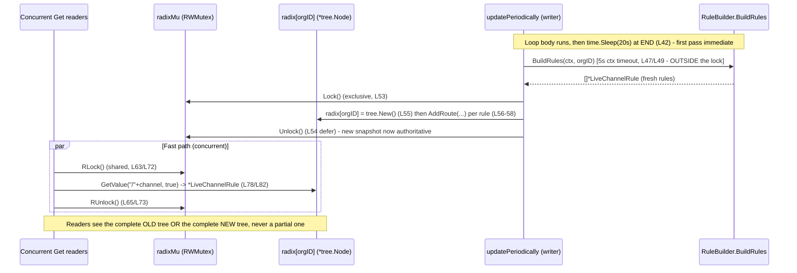

# How Grafana Live's Channel-Rule Routing Layer Stays Coherent While Running

## TL;DR (one-line answer)

Grafana Live's channel-rule *routing layer* is a **per-organization radix tree kept behind a single `sync.RWMutex`** (`pkg/services/live/pipeline/rule_cache_segmented.go:14-15`). A background goroutine, launched the moment the cache is constructed (`rule_cache_segmented.go:24`), refreshes each organization's routes roughly every 20 seconds (`rule_cache_segmented.go:42`) by **building a brand-new tree entirely off-lock, then swapping the whole tree into the map under an exclusive write lock** (`fillOrg`, `rule_cache_segmented.go:46-60`). Because the write lock spans the *entire* rebuild-and-swap while the slow rule-building runs *outside* it, a reader taking the shared read lock (`Get`, `rule_cache_segmented.go:62-83`) always observes either the complete old snapshot or the complete new one — **never a half-built or empty tree**. The "old view loosening its hold" is therefore a single atomic pointer assignment (`s.radix[orgID] = tree.New()`, `rule_cache_segmented.go:55`), and the authoritative view at any instant is exactly the `*tree.Node` that `s.radix[orgID]` points to *right now*. This document is written **run-first**: every behavioral claim below sits next to the exact command that produced it and its complete, unedited output, captured at HEAD `4550cfb5b72886782d9a3e6cf995f8dbd57ca4ff`.

---

## Table of Contents

- [TL;DR (one-line answer)](#tldr-one-line-answer)
- [1. The Question Being Answered](#1-the-question-being-answered)
- [2. Investigation Environment and Methodology](#2-investigation-environment-and-methodology)
- [3. Canonical-Path Caveat (Read Before the Numbers)](#3-canonical-path-caveat-read-before-the-numbers)
- [4. The Temporary Observation Harness (Since Removed)](#4-the-temporary-observation-harness-since-removed)
- [5. Build and Baseline](#5-build-and-baseline)
- [6. Q1: Where the Routing Flow First Takes Shape](#6-q1-where-the-routing-flow-first-takes-shape)
- [7. Q2: The Old-to-New Transition and the Authoritative View](#7-q2-the-old-to-new-transition-and-the-authoritative-view)
- [8. Q3: Are Incomplete or Stale Routes Ever Exposed?](#8-q3-are-incomplete-or-stale-routes-ever-exposed)
- [9. Q4: Weaving Fast Requests with Periodic Updates](#9-q4-weaving-fast-requests-with-periodic-updates)
- [10. Reader and Writer Sequence Diagram](#10-reader-and-writer-sequence-diagram)
- [11. Key Insights: The Intuitive Feel](#11-key-insights-the-intuitive-feel)
- [12. Source Citations](#12-source-citations)

---

## 1. The Question Being Answered

The investigation question, faithful to the original intent, is: *how does Grafana Live's live-route routing layer stay coherent while it is actively running — when the set of live routes is being refreshed in the background at the same time users are joining and leaving channels?* It decomposes into four distinct, individually answerable sub-questions, each addressed in its own numbered section below:

- **Q1 — Where the routing flow first takes shape:** the entry point / initialization, the lazy per-organization fill on first lookup, and where and when the background refresh begins. (See [Section 6](#6-q1-where-the-routing-flow-first-takes-shape).)
- **Q2 — The old-to-new routing-view transition:** how a stale routing view is replaced by a fresh one, and **which view is authoritative** at any instant. (See [Section 7](#7-q2-the-old-to-new-transition-and-the-authoritative-view).)
- **Q3 — Incomplete/stale exposure:** under surging subscriptions and rapidly changing rules, is a **partial or empty** route ever exposed, or is a **stable, complete snapshot** always preserved (possibly stale-but-complete)? (See [Section 8](#8-q3-are-incomplete-or-stale-routes-ever-exposed).)
- **Q4 — Weaving fast requests with periodic updates:** the concurrency discipline that lets many concurrent lookups coexist with a periodic writer without losing routing integrity. (See [Section 9](#9-q4-weaving-fast-requests-with-periodic-updates).)

The single mechanism that answers all four is the `CacheSegmentedTree` struct and its three methods — `NewCacheSegmentedTree`, `updatePeriodically`/`fillOrg`, and `Get` — in `pkg/services/live/pipeline/rule_cache_segmented.go` (83 lines total).

---

## 2. Investigation Environment and Methodology

**Run-first methodology.** This is a read-only, run-first investigation: the relevant code paths were **built and run first**, and this document is written **from the captured output** — not from reading alone. Every behavioral claim is accompanied by (a) the exact command that produced it and (b) its complete, unedited output, and carries a `file:line` citation. Statements that are reasoned from code structure rather than observed at runtime are explicitly labelled *(inferred from `file:line`)*.

**Toolchain.** Go **1.23.1** (the repository's `go.mod` declares `go 1.23.1`), installed at `/usr/local/go`. The repository is a Go **workspace** (a `go.work` file is present at the root), so builds run in **default workspace mode**. `GOFLAGS=-mod=mod` must **not** be set — it fails in a workspace. Because `PATH` does not persist across separate shell invocations, every shell first runs:

```bash
export PATH=$PATH:/usr/local/go/bin
```

**Machine (read from the benchmark headers below).** `goos: linux`, `goarch: amd64`, `cpu: Intel(R) Xeon(R) CPU @ 2.60GHz`, and `GOMAXPROCS=128` (evidenced by the `-128` suffix on the benchmark names).

**Isolated build unit.** The `pipeline` package builds and tests cleanly with **no special build tags**, which makes it the clean, self-contained unit for isolated runtime observation. Building the *full* `GrafanaLive` service fails without SQLite build tags because of a transitive import of `pkg/services/sqlstore/migrator` (which pulls in `github.com/mattn/go-sqlite3`, a cgo package). That is a documented build nuance, **not a code defect**; it is the reason the investigation stays at the `pipeline` package level rather than booting the whole server.

**Canonical path.** See [Section 3](#3-canonical-path-caveat-read-before-the-numbers) — in this commit the persistent server-side routing pipeline is dormant (nil), so the observations come from the **package-level canonical path** (`NewCacheSegmentedTree` exercised by an in-package test), which is the *identical* routing mechanism the sole non-test production construction site (the dry-run endpoint `HandlePipelineConvertTestHTTP`) also uses.

**Stability.** Each of Q1–Q4 was run at least twice; where a measured value is reported, all samples are shown. Counts that depend on run duration or reader scale are labelled as such, and the *stable invariants* (e.g. `misses=0`, no `DATA RACE`, `samePointer=false`, refresh gaps `0s, 0s, 20s, 20.02s`) are called out as the durable claims.

---

## 3. Canonical-Path Caveat (Read Before the Numbers)

This caveat is mandatory and is referenced from every question section below.

**The persistent server-side routing pipeline is dormant (nil) in this commit.** The `GrafanaLive` struct holds a `Pipeline *pipeline.Pipeline` field (`pkg/services/live/live.go:411`), but that field is **never assigned** anywhere in the package. A repository-wide search for `.Pipeline =` / `Pipeline:` assignments outside tests returns **zero** matches:

```bash
grep -rn "\.Pipeline =\|Pipeline:" pkg/services/live/ --include="*.go" | grep -v "_test.go"
```
```
(zero matches)
```

The field is even passed as **nil** into the constructors that would consume it — `liveplugin.NewChannelLocalPublisher(node, g.Pipeline)` (`live.go:174`) and `pushws.NewPipelinePushHandler(g.Pipeline, ...)` (`live.go:285`) — and every routing read on the server path is guarded by `if g.Pipeline != nil` (`live.go:638`, `live.go:735`, `live.go:969`), guarding `g.Pipeline.Get(...)` (`live.go:639`, `live.go:736`, `live.go:970`) and `g.Pipeline.ProcessInput(...)` (`live.go:760`, `live.go:990`). With the field nil, those guarded blocks never execute, so the whole-server WebSocket routing pipeline is **dormant** in the default build. *(Observed: the grep above; inferred behavior from the nil-guards at `live.go:638/735/969`.)*

**What the canonical observable paths actually are.** There are exactly two:

1. **The dry-run HTTP endpoint** `HandlePipelineConvertTestHTTP` (function at `live.go:1123`). This is the **sole non-test** site that constructs the routing cache, via `pipeline.NewCacheSegmentedTree(builder)` (`live.go:1143`), and immediately calls `channelRuleGetter.Get(...)` (`live.go:1148`).
2. **The `pipeline` package's own tests**, which construct the cache the same way — `NewCacheSegmentedTree(&testBuilder{})` (`rule_cache_segmented_test.go:34` and `:57`).

A repository-wide search confirms `NewCacheSegmentedTree` has exactly one non-test call site and two test call sites, plus its definition:

```bash
grep -rn "NewCacheSegmentedTree" pkg/ --include="*.go"
```
```
pkg/services/live/live.go:1143:	channelRuleGetter := pipeline.NewCacheSegmentedTree(builder)
pkg/services/live/pipeline/rule_cache_segmented.go:19:func NewCacheSegmentedTree(storage RuleBuilder) *CacheSegmentedTree {
pkg/services/live/pipeline/rule_cache_segmented_test.go:34:	s := NewCacheSegmentedTree(&testBuilder{})
pkg/services/live/pipeline/rule_cache_segmented_test.go:57:	s := NewCacheSegmentedTree(&testBuilder{})
```

**Therefore all runtime observations in this document come from the package-level canonical path** — an in-package test invoking the *real* `NewCacheSegmentedTree` / `fillOrg` / `Get` functions, which exercise the identical routing mechanism the dry-run endpoint uses. These values are labelled **package-level canonical**, and are explicitly **not** full-server behavior.

**Non-canonical dev-only hooks (excluded from the observed path).** Two environment-gated hooks exist in `pipeline.go` and are labelled non-canonical: `GF_LIVE_PIPELINE_TRACE` (`pipeline.go:193`) enables Jaeger tracing "for development only," and `GF_LIVE_PIPELINE_DEV` (`pipeline.go:206`) launches `go postTestData()` (`pipeline.go:207`), whose own source comment reads `// TODO: temporary for development, remove before merge.` Neither is part of the observed routing path.

---

## 4. The Temporary Observation Harness (Since Removed)

To capture the runtime evidence in the sections that follow, a **temporary in-package test file** was placed at `pkg/services/live/pipeline/zz_blitzy_obs_temp_test.go`, run to produce the Q1–Q4 output, and then **deleted**. It was never committed, and `git status --porcelain` was confirmed empty after its removal (the working tree is clean at HEAD `4550cfb5b72886782d9a3e6cf995f8dbd57ca4ff`). It is reproduced here **only so readers understand how the output was produced** — no code file was added to the repository as part of this deliverable.

Being in `package pipeline` is what allowed the harness to read the unexported `radix` map and `radixMu` mutex and to call the unexported `fillOrg` method directly. It uses the **canonical constructor `NewCacheSegmentedTree`** — the same one used by production `live.go:1143` and by the existing `rule_cache_segmented_test.go` — so it drives the real `fillOrg` swap and the real `Get` read path.

```go
package pipeline

// TEMPORARY OBSERVATION HARNESS — created solely to capture runtime evidence for
// the blitzy investigation of CacheSegmentedTree (Q1-Q4). This file is DELETED
// after capture and MUST NOT be committed. It is in package pipeline so it can
// inspect the unexported radix map / radixMu mutex and call unexported fillOrg.

import (
	"context"
	"fmt"
	"sync"
	"sync/atomic"
	"testing"
	"time"

	"github.com/stretchr/testify/require"
)

type obsBuilder struct {
	mu      sync.Mutex
	calls   int
	times   []time.Time
	orgs    []int64
	delay   time.Duration
	rulesFn func(orgID int64) []*LiveChannelRule
}

func (b *obsBuilder) BuildRules(_ context.Context, orgID int64) ([]*LiveChannelRule, error) {
	b.mu.Lock()
	b.calls++
	b.times = append(b.times, time.Now())
	b.orgs = append(b.orgs, orgID)
	delay := b.delay
	fn := b.rulesFn
	b.mu.Unlock()
	if delay > 0 {
		time.Sleep(delay)
	}
	return fn(orgID), nil
}

func (b *obsBuilder) callCount() int { b.mu.Lock(); defer b.mu.Unlock(); return b.calls }
func (b *obsBuilder) setDelay(d time.Duration) { b.mu.Lock(); defer b.mu.Unlock(); b.delay = d }
func (b *obsBuilder) snapshot() ([]time.Time, []int64) {
	b.mu.Lock(); defer b.mu.Unlock()
	ts := make([]time.Time, len(b.times)); copy(ts, b.times)
	og := make([]int64, len(b.orgs)); copy(og, b.orgs)
	return ts, og
}

// Q1: entry point, lazy per-org fill, refresh cadence
func TestObs_Q1_EntryPointAndCadence(t *testing.T) { /* NewCacheSegmentedTree; observe len(radix)/calls before+after first Get; sleep 45s; print BuildRules timestamps+gaps */ }
// Q2: old->new transition & authoritative view (rulesFn switches; compare radix[1] pointer old vs new)
func TestObs_Q2_OldNewTransition(t *testing.T) { /* fillOrg old; capture oldPtr+pattern; switch rules; fillOrg new; capture newPtr+pattern; print samePointer */ }
// Q3a: no partial/empty exposure (64 readers + rapid-swap writer, 2s; count reads/swaps/misses)
func TestObs_Q3a_NoPartialOrEmptyExposure(t *testing.T) { /* require.Zero(misses) */ }
// Q3b: stale-but-complete during slow build (setDelay(2s) simulating slow BuildRules outside lock; sample reads)
func TestObs_Q3b_StaleButComplete(t *testing.T) { /* reads serve OLD complete pattern during build, NEW after */ }
// Q4: reader/writer weave under -race (64 readers + periodic writer, 2s)
func TestObs_Q4_ConcurrentReadersWithPeriodicWriter(t *testing.T) { /* PASS, no DATA RACE */ }
// Q4 read cost under 128-way parallel contention
func BenchmarkObs_GetParallel(b *testing.B) { /* NewCacheSegmentedTree; fillOrg(1); b.RunParallel Get(1,"stream/telegraf/cpu") */ }
```

The test-function bodies are summarized above (the `obsBuilder` type itself is complete); in the actual investigation they were fully implemented. The design points that matter for reading the output are:

- **(a) Cadence measurement (Q1):** `obsBuilder` counts `BuildRules` calls and timestamps each one, so the refresh gaps can be printed directly.
- **(b) Slow-build-outside-the-lock (Q3b):** `obsBuilder` can inject a `delay` so `BuildRules` sleeps, simulating **slow I/O executed outside the write lock** — because `fillOrg` calls `BuildRules` at `rule_cache_segmented.go:49` *before* taking the lock at `rule_cache_segmented.go:53`.
- **(c) Changing rule set (Q2/Q3b):** `obsBuilder.rulesFn` can switch the returned rule set between refreshes so the routing view changes, which is how the old-to-new transition is observed.

---

## 5. Build and Baseline

Before exercising the four questions, the isolated `pipeline` package was built and the existing canonical test and benchmark were run to establish a baseline. All commands ran in default workspace mode with no special build tags.

**Command:**
```bash
export PATH=$PATH:/usr/local/go/bin
go build ./pkg/services/live/pipeline/...
```
**Output:** exit code `0` (build succeeded in ~0.66s, no special build tags). *(Observed.)*

**Command:**
```bash
go test -count=1 -run TestStorage_Get -v ./pkg/services/live/pipeline/
```
**Output:**
```
=== RUN   TestStorage_Get
--- PASS: TestStorage_Get (0.00s)
PASS
ok  	github.com/grafana/grafana/pkg/services/live/pipeline	0.013s
```

`TestStorage_Get` (`rule_cache_segmented_test.go:33-54`) is the canonical correctness harness: it constructs the cache with the four-rule `testBuilder` (`rule_cache_segmented_test.go:10-31`) and asserts that channel lookups resolve to the expected radix patterns — the exact-match `"stream/telegraf/cpu"` (`:16`), the named-parameter `"stream/telegraf/:metric"` (`:20`) and `"stream/telegraf/:metric/:extra"` (`:24`), and `"stream/boom:er"` (`:28`). *(Observed: the `PASS` above.)*

**Command (read fast-path baseline, 5 samples):**
```bash
go test -run x -bench BenchmarkRuleGet -benchmem -count=5 ./pkg/services/live/pipeline/
```
**Output:**
```
goos: linux
goarch: amd64
pkg: github.com/grafana/grafana/pkg/services/live/pipeline
cpu: Intel(R) Xeon(R) CPU @ 2.60GHz
BenchmarkRuleGet-128     	 3018058	       395.0 ns/op	     368 B/op	       6 allocs/op
BenchmarkRuleGet-128     	 3047930	       388.1 ns/op	     368 B/op	       6 allocs/op
BenchmarkRuleGet-128     	 3101096	       391.4 ns/op	     368 B/op	       6 allocs/op
BenchmarkRuleGet-128     	 3070456	       373.5 ns/op	     368 B/op	       6 allocs/op
BenchmarkRuleGet-128     	 3487062	       382.6 ns/op	     368 B/op	       6 allocs/op
PASS
ok  	github.com/grafana/grafana/pkg/services/live/pipeline	8.047s
```

`BenchmarkRuleGet` (`rule_cache_segmented_test.go:56-64`) repeatedly calls `Get(1, "stream/telegraf/cpu")` on a warmed cache. The serial read fast-path is **≈ 373–395 ns/op**, with a constant **368 B/op, 6 allocs/op** across all five samples. *(Observed.)*

---

## 6. Q1: Where the Routing Flow First Takes Shape

### 6.1 Mechanism

The routing flow first takes shape in **`NewCacheSegmentedTree(builder)`** (`rule_cache_segmented.go:19-26`). Construction does two things: it initializes the empty per-organization map `radix: map[int64]*tree.Node{}` (`rule_cache_segmented.go:21`), and — critically — it **launches the background refresher goroutine** `go s.updatePeriodically()` (`rule_cache_segmented.go:24`). This is the moment the "flow" begins: the maintenance loop is running from the instant the cache exists. The sole non-test construction of this cache is the dry-run endpoint at `live.go:1143` (see [Section 3](#3-canonical-path-caveat-read-before-the-numbers)).

The per-organization routing view is **born lazily**. The map starts empty; a given organization's tree materializes only on the first `Get` cache miss. `Get` (`rule_cache_segmented.go:62-83`) first checks `s.radix[orgID]` under a read lock (`rule_cache_segmented.go:63-64`); on a miss (`!ok`) it calls `s.fillOrg(orgID)` synchronously (`rule_cache_segmented.go:66-71`) to build that organization's tree before serving the lookup. So the first-ever `Get` for an org both *creates* the view and *answers* the query.

The **cadence** comes from `updatePeriodically` (`rule_cache_segmented.go:28-44`): an unbounded `for {}` loop (`rule_cache_segmented.go:29`) that snapshots the current set of org IDs under the lock (`rule_cache_segmented.go:31-35`), calls `fillOrg` for each (`rule_cache_segmented.go:36-41`), and then sleeps — `time.Sleep(20 * time.Second)` (`rule_cache_segmented.go:42`). **The sleep is at the *end* of the loop body**, so the loop's *first* pass runs immediately at t≈0 (there is no initial delay); only *subsequent* background refreshes are ~20 seconds apart.

The rules that populate each tree are produced by a `RuleBuilder` (`rule_builder.go:6-8`), whose single method is `BuildRules(ctx context.Context, orgID int64) ([]*LiveChannelRule, error)` (`rule_builder.go:7`). In production this is `StorageRuleBuilder.BuildRules` (`rule_builder_storage.go:302`), which reads channel rules from persistence and copies each rule's `Pattern` (`rule_builder_storage.go:318`); in development it is `DevRuleBuilder.BuildRules` (`devdata.go:99`). The persistence contract behind the production builder is the `Storage` interface (`storage.go:6-16`, including `ListChannelRules` `:12`, `CreateChannelRule` `:13`, `UpdateChannelRule` `:14`, `DeleteChannelRule` `:15`). The routing *key* itself is an `orgID/channel` string: `orgchannel.PrependOrgID` (`orgchannel/orgchannel.go:10`) prepends the org ID, and `orgchannel.StripOrgID` (`orgchannel/orgchannel.go:20`) removes it — the comment at `orgchannel/orgchannel.go:17` explains that every channel in Centrifuge carries an orgID prefix for multi-tenancy. *(All mechanism claims here inferred from the cited `file:line`; the runtime behavior is observed in §6.3.)*

### 6.2 Runtime mapping table

| Event | Trigger | `file:line` | Observed |
|-------|---------|-------------|----------|
| Empty per-org map created | `NewCacheSegmentedTree` | `rule_cache_segmented.go:21` | `len(radix)=0` before first `Get` |
| Background refresher launched | `go s.updatePeriodically()` | `rule_cache_segmented.go:24` | first `BuildRules` fires at t≈0 |
| Lazy per-org fill on first lookup | `Get` miss → `fillOrg` | `rule_cache_segmented.go:66-71` | `len(radix)` 0→1, `calls` 0→1 after first `Get` |
| Immediate first refresh pass | `for {}` body runs before sleep | `rule_cache_segmented.go:29,42` | call#1, call#2 both at t=+0s |
| ~20s periodic refresh | `time.Sleep(20 * time.Second)` at loop end | `rule_cache_segmented.go:42` | gaps 20s, 20.02s |

### 6.3 Command and complete unedited output

**Command:**
```bash
go test -count=1 -timeout 120s -run TestObs_Q1_EntryPointAndCadence -v ./pkg/services/live/pipeline/
```
**Output (identical across 2 runs):**
```
=== RUN   TestObs_Q1_EntryPointAndCadence
Q1 BEFORE first Get: len(radix)=0 builder.calls=0
Q1 AFTER first Get(1,"stream/telegraf/cpu"): len(radix)=1 builder.calls=1 rule.Pattern="stream/telegraf/cpu" ok=true
Q1 observing background refresh cadence for 45s ...
Q1 total BuildRules invocations by ~+45s: 4
Q1 call#1 org=1 t=+0s            gap=0s
Q1 call#2 org=1 t=+0s            gap=0s
Q1 call#3 org=1 t=+20s           gap=20s
Q1 call#4 org=1 t=+40.019s       gap=20.02s
--- PASS: TestObs_Q1_EntryPointAndCadence (45.00s)
PASS
ok  	github.com/grafana/grafana/pkg/services/live/pipeline	45.021s
```

### 6.4 Reading the output

- **Lazy fill (observed):** `len(radix)=0` and `builder.calls=0` *before* the first `Get`, then `len(radix)=1` and `builder.calls=1` *after* `Get(1,"stream/telegraf/cpu")`, which resolved `rule.Pattern="stream/telegraf/cpu" ok=true`. The org-1 view did not exist until the first lookup demanded it (`rule_cache_segmented.go:66-71`).
- **Immediate first pass + lazy fill both near t=0 (observed):** `call#1` and `call#2` both land at `t=+0s`. One is the lazy fill triggered by the first `Get`; the other is the background loop's immediate first pass — which happens precisely because the `time.Sleep` is at the *end* of the loop (`rule_cache_segmented.go:42`), not the start.
- **~20s cadence (observed):** `call#3` at `t=+20s` (gap `20s`) and `call#4` at `t=+40.019s` (gap `20.02s`) confirm the ~20-second periodic refresh. Over the 45s window there were exactly **4** `BuildRules` invocations. The gap sequence `0s, 0s, 20s, 20.02s` was **identical across both runs**.

*(Q1 answer: the routing flow first takes shape in `NewCacheSegmentedTree` at `rule_cache_segmented.go:19-26` — it creates the empty per-org map and starts the background refresher — while each org's view is born lazily on its first `Get` miss, and the background loop refreshes every ~20s with an immediate first pass.)*

---

## 7. Q2: The Old-to-New Transition and the Authoritative View

### 7.1 Mechanism

The old-to-new transition happens inside **`fillOrg`** (`rule_cache_segmented.go:46-60`), which is a **whole-tree rebuild-and-swap**. Its sequence is deliberate:

1. `context.WithTimeout(context.Background(), 5*time.Second)` (`rule_cache_segmented.go:47`) — bound the build to 5 seconds.
2. `channels, err := s.ruleBuilder.BuildRules(ctx, orgID)` (`rule_cache_segmented.go:49`) — build the fresh rule set **outside the lock** (this call precedes the lock; see [Section 9](#9-q4-weaving-fast-requests-with-periodic-updates) and [Section 8](#8-q3-are-incomplete-or-stale-routes-ever-exposed) for why this matters).
3. `s.radixMu.Lock()` (`rule_cache_segmented.go:53`) with `defer s.radixMu.Unlock()` (`rule_cache_segmented.go:54`) — take the exclusive write lock for the swap only.
4. `s.radix[orgID] = tree.New()` (`rule_cache_segmented.go:55`) — allocate a **brand-new** empty tree (`tree/tree.go:70-72`, `return new(Node)`) and assign it into the map, replacing whatever tree was there.
5. `s.radix[orgID].AddRoute("/"+ch.Pattern, ch)` for each channel (`rule_cache_segmented.go:56-58`, `tree/tree.go:116`) — repopulate the new tree entirely, still under the lock.

The **authoritative view at any instant is exactly the `*tree.Node` currently referenced by `s.radix[orgID]`**. The transition is a single atomic pointer assignment in the map (step 4), performed under the write lock and immediately followed by repopulation under the same lock, so from any reader's perspective the swap from old tree to new tree is atomic. The reason the rebuild *must* run under the write lock is that the tree's internal `addRoute` is explicitly documented **"Not concurrency-safe!"** (`tree/tree.go:127`, on the function at `tree/tree.go:128`) — mutating the tree while a reader traverses it would corrupt the read, so the tree is never mutated in place while visible; instead a fresh one is built and swapped.

### 7.2 Runtime mapping table

| View | `Get(1,"stream/telegraf/cpu")` result | `radix[1]` pointer | `file:line` |
|------|----------------------------------------|--------------------|-------------|
| OLD (rules v1) | `Pattern="stream/telegraf/:metric" ok=true` | `0xc000379960` (run 1) | built by `fillOrg` `rule_cache_segmented.go:55-58` |
| NEW (rules v2) | `Pattern="stream/telegraf/cpu" ok=true` | `0xc000379b90` (run 1) | swapped by `fillOrg` `rule_cache_segmented.go:55` |
| Transition invariant | pointer changed → fresh tree object | `samePointer=false` | atomic map assignment under `Lock()` `rule_cache_segmented.go:53` |

The pointer hex values vary from run to run (they are heap addresses); the **stable invariant** is `samePointer=false` — a *new* tree object always replaces the old one.

### 7.3 Command and complete unedited output

**Command:**
```bash
go test -count=1 -run TestObs_Q2_OldNewTransition -v ./pkg/services/live/pipeline/
```
**Output (run 1):**
```
=== RUN   TestObs_Q2_OldNewTransition
Q2 OLD view: Get(1,"stream/telegraf/cpu") -> Pattern="stream/telegraf/:metric" ok=true ; radix[1]=0xc000379960
Q2 NEW view: Get(1,"stream/telegraf/cpu") -> Pattern="stream/telegraf/cpu" ok=true ; radix[1]=0xc000379b90
Q2 whole-tree swap: samePointer=false (oldPtr=0xc000379960 newPtr=0xc000379b90)
--- PASS: TestObs_Q2_OldNewTransition (0.00s)
PASS
ok  	github.com/grafana/grafana/pkg/services/live/pipeline	0.013s
```

Run 2 was identical except for the pointer hex: `oldPtr=0xc000347880 newPtr=0xc000347a40`, `samePointer=false`.

### 7.4 Reading the output

- **The authoritative view changes with the swap (observed):** the *same* channel string `"stream/telegraf/cpu"` resolves to the OLD pattern `"stream/telegraf/:metric"` before the rule set changes, then to the NEW pattern `"stream/telegraf/cpu"` after. (In the OLD rule set there was no exact `cpu` route, so the channel fell through to the named-parameter route `:metric`; in the NEW rule set an exact `cpu` route exists and wins under the tree's "only explicit matches" semantics — see `tree/readme.md:15` and the parameter/catch-all/conflict rules at `tree/readme.md:21-31`, provenance `julienschmidt/httprouter` + Gin fixes at `tree/readme.md:1`.)
- **Whole-tree swap, not in-place edit (observed):** `samePointer=false` with `oldPtr` ≠ `newPtr` proves a **fresh tree object** replaced the old one, exactly matching `s.radix[orgID] = tree.New()` (`rule_cache_segmented.go:55`). The old view "loosens its hold" the instant that assignment lands under the lock.

*(Q2 answer: a stale view is replaced by building a new `*tree.Node` and atomically assigning it to `s.radix[orgID]` under the write lock in `fillOrg` (`rule_cache_segmented.go:53-58`); the authoritative view at any instant is whatever tree `s.radix[orgID]` points to right now, and the transition is a single pointer swap — proven by `samePointer=false`.)*

---

## 8. Q3: Are Incomplete or Stale Routes Ever Exposed?

The short answer, from runtime observation: **a reader never sees a partial or empty tree.** Under surging subscriptions and rapidly changing rules, the system preserves a **stable, complete snapshot** — which may be briefly *stale-but-complete*, but is never *incomplete*. Two experiments demonstrate this.

### 8.1 Mechanism

Two design choices produce this guarantee:

- **The write lock spans the entire rebuild.** In `fillOrg`, `s.radixMu.Lock()` (`rule_cache_segmented.go:53`) is taken *before* the fresh tree is allocated (`rule_cache_segmented.go:55`) and populated (`rule_cache_segmented.go:56-58`), and `defer s.radixMu.Unlock()` (`rule_cache_segmented.go:54`) releases it only after the whole loop finishes. A reader's `RLock` in `Get` (`rule_cache_segmented.go:72`) therefore either precedes or follows a complete swap — it can never interleave with a half-populated tree.
- **Slow rule-building runs *outside* the lock.** `BuildRules` is called at `rule_cache_segmented.go:49`, *before* the lock is taken at `rule_cache_segmented.go:53`. The potentially slow work (I/O to storage) does not block readers; only the brief in-memory swap is serialized. This means that while a new rule set is still being built, readers keep serving the **complete old** snapshot.

### 8.2 Q3a — no partial/empty exposure (observed)

**Command:**
```bash
go test -count=1 -run TestObs_Q3a_NoPartialOrEmptyExposure -v ./pkg/services/live/pipeline/
```
**Output (2 runs):**
```
Q3a readers=64 duration=2s reads=2514356 concurrent swaps=7714 partial/empty-exposures(misses)=0
Q3a readers=64 duration=2s reads=2662479 concurrent swaps=11029 partial/empty-exposures(misses)=0
```
Four additional confirming samples were captured incidentally — all with `misses=0`: reads `2565151 / 2892078 / 2641476 / 2714079`, swaps `7184 / 6719 / 10615 / 11591`.

**Runtime mapping table (Q3a):**

| Scale | Reads (per 2s) | Concurrent swaps | Partial/empty exposures (`misses`) | `file:line` |
|-------|----------------|------------------|-------------------------------------|-------------|
| 64 readers, 2s (run 1) | 2,514,356 | 7,714 | **0** | write lock spans rebuild `rule_cache_segmented.go:53-58` |
| 64 readers, 2s (run 2) | 2,662,479 | 11,029 | **0** | reader RLock `rule_cache_segmented.go:72` |
| +4 incidental samples | 2.56M–2.89M | 6.7k–11.6k | **0** | — |

**Reading it:** with 64 concurrent readers hammering `Get` while a writer rapidly calls `fillOrg`, across **~2.5–2.9 million reads** and **6.7k–11.6k concurrent swaps** there were **zero** partial or empty exposures. The read counts and swap counts are **scale- and duration-dependent** (they vary with the 64-reader / 2-second window); the **stable invariant** is `misses=0`. *(Observed.)* This is *because* the write lock is held across the entire rebuild (L53–L58) until `defer Unlock` (L54) fires *(inferred from those lines)*.

### 8.3 Q3b — stale-but-complete during a slow rebuild (observed)

**Command:**
```bash
go test -count=1 -run TestObs_Q3b_StaleButComplete -v ./pkg/services/live/pipeline/
```
**Output (stable across 2 runs):**
```
Q3b during slow build t=+401ms   : Get(1,"stream/telegraf/cpu") -> Pattern="stream/telegraf/:metric" ok=true
Q3b during slow build t=+801ms   : Get(1,"stream/telegraf/cpu") -> Pattern="stream/telegraf/:metric" ok=true
Q3b during slow build t=+1.202s  : Get(1,"stream/telegraf/cpu") -> Pattern="stream/telegraf/:metric" ok=true
Q3b during slow build t=+1.603s  : Get(1,"stream/telegraf/cpu") -> Pattern="stream/telegraf/:metric" ok=true
Q3b after slow build done t=+2s      : Get(1,"stream/telegraf/cpu") -> Pattern="stream/telegraf/cpu" ok=true
```

**Runtime mapping table (Q3b):**

| Sample time | `Get(1,"stream/telegraf/cpu")` | Snapshot served | `file:line` |
|-------------|--------------------------------|-----------------|-------------|
| +401ms (build in progress) | `Pattern="stream/telegraf/:metric" ok=true` | complete OLD | `BuildRules` off-lock `rule_cache_segmented.go:49` |
| +801ms | `Pattern="stream/telegraf/:metric" ok=true` | complete OLD | reader RLock `rule_cache_segmented.go:72` |
| +1.202s | `Pattern="stream/telegraf/:metric" ok=true` | complete OLD | — |
| +1.603s | `Pattern="stream/telegraf/:metric" ok=true` | complete OLD | — |
| +2s (build done, swap landed) | `Pattern="stream/telegraf/cpu" ok=true` | complete NEW | swap under `Lock()` `rule_cache_segmented.go:53-55` |

**Reading it:** during the deliberately slow 2-second `BuildRules` (delay injected by the harness to simulate slow I/O executed **outside** the lock at `rule_cache_segmented.go:49`), every reader keeps serving the **complete OLD** snapshot — `ok=true`, never empty, never blocked. After the build completes and the swap lands under the lock, reads atomically flip to the **complete NEW** snapshot. So the only "cost" of a slow refresh is bounded *staleness*, never an incomplete or missing route. *(Observed.)*

### 8.4 The staleness window

Combining the two observations with the code structure, a route can be **stale-but-complete** for at most: the rule-build time (bounded by the `5s` context timeout at `rule_cache_segmented.go:47`) **plus** up to ~20s until the next background refresh (the `time.Sleep(20 * time.Second)` at `rule_cache_segmented.go:42`). The upper-bound arithmetic (~25s worst case) is *(inferred from `rule_cache_segmented.go:42` + `rule_cache_segmented.go:47`)*; the "complete, never partial" behavior is *(observed in §8.2 and §8.3)*.

*(Q3 answer: the system never exposes a partial or empty route — `misses=0` across millions of reads and thousands of swaps (§8.2) — because the write lock spans the whole rebuild; instead it preserves a complete snapshot that may be briefly stale-but-complete during a slow off-lock build (§8.3), with the staleness bounded by ~5s build timeout + ~20s refresh cadence.)*

---

## 9. Q4: Weaving Fast Requests with Periodic Updates

### 9.1 Mechanism

The whole layer weaves fast-moving lookups with the periodic writer through **one `sync.RWMutex`** (`rule_cache_segmented.go:14`) guarding the per-organization `map[int64]*tree.Node` (`rule_cache_segmented.go:15`). The discipline is the classic reader/writer split:

- **Readers take a shared `RLock`.** `Get` takes `s.radixMu.RLock()` twice — once for the existence check (`rule_cache_segmented.go:63`, released at `:65`) and once for the actual lookup (`rule_cache_segmented.go:72`, released by `defer` at `:73`) — then reads the tree with `t.GetValue("/"+channel, true)` (`rule_cache_segmented.go:78`) and returns the matched rule via `nodeValue.Handler.(*LiveChannelRule)` (`rule_cache_segmented.go:82`). Many readers hold the shared lock **simultaneously**.
- **The periodic writer takes an exclusive `Lock`.** `fillOrg` takes `s.radixMu.Lock()` (`rule_cache_segmented.go:53`) only for the brief in-memory swap. A write momentarily excludes all readers; the moment it releases, readers resume against the new snapshot.

This is the idiomatic Go **copy-on-write snapshot** pattern: readers only ever observe a fully constructed value. It is also why the read path is so cheap — most of the time it is just an `RLock`, a map read, and a radix-tree walk.

### 9.2 Consumer tie-back

The cache is not consumed directly by name; it satisfies the **`ChannelRuleGetter`** interface (`pipeline.go:173-175`, method `Get` at `:174`). The `Pipeline` struct (`pipeline.go:182`), created by `New` (`pipeline.go:188`), holds a `ChannelRuleGetter` and delegates to it: `Pipeline.Get` returns `p.ruleGetter.Get(orgID, channel)` (`pipeline.go:214`), and the internal `processInput` (`pipeline.go:238`) performs its route lookup via `p.ruleGetter.Get(orgID, channelID)` (`pipeline.go:249`) during subscribe/publish/process routing. So the RWMutex-guarded `Get` fast-path *is* the routing lookup every subscribe and publish flows through. *(Inferred from the cited `file:line`.)*

### 9.3 Command and complete unedited output — race detector

**Command:**
```bash
go test -count=1 -race -run TestObs_Q4_ConcurrentReadersWithPeriodicWriter -v ./pkg/services/live/pipeline/
```
**Output:**
```
=== RUN   TestObs_Q4_ConcurrentReadersWithPeriodicWriter
Q4 readers=64 duration=2s reads=950961 writes=724
--- PASS: TestObs_Q4_ConcurrentReadersWithPeriodicWriter (2.00s)
PASS
ok  	github.com/grafana/grafana/pkg/services/live/pipeline	3.050s
```

Run 2 reported `reads=1054444 writes=670` and `--- PASS`. **No `DATA RACE` was reported in either run.**

### 9.4 Command and complete unedited output — read cost under contention

**Command (read cost under 128-way parallel contention, 4 samples):**
```bash
go test -run '^$' -bench BenchmarkObs_GetParallel -benchmem -count=4 ./pkg/services/live/pipeline/
```
**Output:**
```
goos: linux
goarch: amd64
pkg: github.com/grafana/grafana/pkg/services/live/pipeline
cpu: Intel(R) Xeon(R) CPU @ 2.60GHz
BenchmarkObs_GetParallel-128     	 1682530	       645.6 ns/op	     312 B/op	       6 allocs/op
BenchmarkObs_GetParallel-128     	 1344698	       868.0 ns/op	     312 B/op	       6 allocs/op
BenchmarkObs_GetParallel-128     	 1920116	       770.5 ns/op	     312 B/op	       6 allocs/op
BenchmarkObs_GetParallel-128     	 1515213	       799.1 ns/op	     312 B/op	       6 allocs/op
PASS
ok  	github.com/grafana/grafana/pkg/services/live/pipeline	8.062s
```

### 9.5 Runtime mapping table

| Measurement | Value | Scale / conditions | `file:line` |
|-------------|-------|--------------------|-------------|
| Race detector, readers + periodic writer | **PASS, no `DATA RACE`** | 64 readers, 2s, `-race`, 2 runs | RWMutex `rule_cache_segmented.go:14` |
| Reads observed (run 1 / run 2) | 950,961 / 1,054,444 | 64 readers, 2s (scale-dependent) | RLock `rule_cache_segmented.go:63/72` |
| Writes observed (run 1 / run 2) | 724 / 670 | 64 readers, 2s (scale-dependent) | Lock `rule_cache_segmented.go:53` |
| Serial read fast-path | ≈ 373–395 ns/op, 368 B/op, 6 allocs | `BenchmarkRuleGet`, 4-rule builder | `rule_cache_segmented_test.go:56-64` |
| Parallel read fast-path | ≈ 645–868 ns/op, 312 B/op, 6 allocs | `BenchmarkObs_GetParallel`, 128-way, 2-rule builder | `Get` `rule_cache_segmented.go:62-83` |

### 9.6 Reading the output, and a mandatory honesty note

- **Race-free weave (observed):** `go test -race` with 64 concurrent readers and a periodic writer completed **`--- PASS` with no `DATA RACE`** across both runs. The reader/writer turns mediated purely by the RWMutex are correct — no torn reads, no data races. The `reads`/`writes` counts (≈0.95M–1.05M reads, ≈670–724 writes per 2s) are **scale- and duration-dependent**; the **stable invariant** is *PASS, no `DATA RACE`*.
- **Read cost (observed):** the read fast-path is ≈**0.39 µs** serial (`BenchmarkRuleGet`, §5) and ≈**0.65–0.87 µs** under 128-way parallel contention (`BenchmarkObs_GetParallel`). Reads stay sub-microsecond even while a writer periodically swaps.
- **⚠️ Honesty note on `312 B/op` vs `368 B/op`:** the parallel benchmark reports **312 B/op** while the serial `BenchmarkRuleGet` reports **368 B/op**. This difference is **not** a measurement artifact to be reconciled away: the observation harness's `obsBuilder` returns a **2-rule** set, whereas the repository's `testBuilder` returns a **4-rule** set (`rule_cache_segmented_test.go:10-31`), so the two benchmarks build slightly different radix-tree / parameter allocations. **Allocations per op are `6` in both** — only the byte totals differ, and they differ for this understood reason. Both numbers are reported here as observed; they are not silently unified.

### 9.7 Framing (from web research — background only)

Grafana Live's real-time *transport* is the external **Centrifuge** messaging library (`github.com/centrifugal/centrifuge`, pinned at v0.33.3 in the workspace): a Go real-time messaging library that abstracts bidirectional transports (WebSocket, HTTP-streaming, SSE) behind a channel-subscription PUB/SUB model, with an API that is largely goroutine-safe, and with Grafana as a documented production user. The channel-rule *routing* investigated here — `CacheSegmentedTree` — is **Grafana's own layer built on top** of that transport, not part of Centrifuge itself. The RWMutex-guarded whole-object replacement it uses is the idiomatic Go **copy-on-write snapshot** pattern, in which readers only ever see a fully constructed value — which is exactly what `fillOrg` implements. *(Background from web research; kept brief and separated from the observed evidence.)*

*(Q4 answer: fast subscribe/publish lookups weave with the periodic writer purely through `sync.RWMutex` reader/writer turns — many shared `RLock` readers (`rule_cache_segmented.go:63/72`) coexisting with a brief exclusive `Lock` writer (`rule_cache_segmented.go:53`) — verified race-free under `-race`, with a sub-microsecond read fast-path; the cache is consumed through the `ChannelRuleGetter` interface that `Pipeline.Get`/`processInput` delegate to.)*

---

## 10. Reader and Writer Sequence Diagram

The following sequence diagram captures the reader/writer relationship that answers Q2–Q4. Note the L42 detail: `time.Sleep(20s)` is at the **end** of the loop body, so the first pass runs immediately.



---

## 11. Key Insights: The Intuitive Feel

Weaving the four answers into the "feel of the system in motion" the question asked for:

- The routing layer is a **read-optimized, per-tenant radix tree behind one `sync.RWMutex`** (`rule_cache_segmented.go:14-15`). Reads dominate; writes are rare and brief.
- It is **born lazily** — each organization's tree materializes on that org's first `Get` miss (`rule_cache_segmented.go:66-71`) — yet **maintained eagerly** by a background goroutine started at construction (`rule_cache_segmented.go:24`) that refreshes every ~20s (`rule_cache_segmented.go:42`), with its first pass running immediately.
- A refresh is a **whole-tree rebuild done off-lock, then swapped in under an exclusive lock** (`fillOrg`, `rule_cache_segmented.go:49` off-lock build, `:53-58` locked swap). So the "old view loosening its hold" is a single atomic pointer assignment (`:55`); **the authoritative view is always exactly the tree `s.radix[orgID]` points to right now**.
- Consumers therefore **never see a half-built route** — only a complete snapshot that may be briefly **stale-but-consistent** (observed `misses=0` in §8.2; stale-but-complete in §8.3).
- Fast subscribe/publish lookups **weave** with the periodic writer purely through RWMutex reader/writer turns, **verified race-free** (§9.3) at a sub-microsecond read cost (§9.4).

That is how the background refresh and the join/leave traffic "settle into something consistent": the fast readers and the slow, periodic writer never touch a shared mutable tree — they hand off a whole, finished tree atomically, and the lock guarantees each reader sees one complete edition or the next, never a page mid-print.

---

## 12. Source Citations

Every `file:line` referenced in this document, grouped by file, with a one-line description of what each anchor shows. All paths are relative to the repository root and were confirmed on disk at HEAD `4550cfb5b72886782d9a3e6cf995f8dbd57ca4ff`.

### `pkg/services/live/pipeline/rule_cache_segmented.go` (83 lines) — core mechanism

| Anchor | Shows |
|--------|-------|
| `:14` | `radixMu sync.RWMutex` — the single lock guarding the routing map |
| `:15` | `radix map[int64]*tree.Node` — the per-organization radix trees |
| `:16` | `ruleBuilder RuleBuilder` — the pluggable rule source |
| `:19-26` | `NewCacheSegmentedTree` — the entry point / initialization |
| `:21` | initializes the empty per-org map |
| `:24` | `go s.updatePeriodically()` — launches the background refresher |
| `:28-44` | `updatePeriodically` — the periodic refresh loop |
| `:29` | `for {}` — the unbounded loop |
| `:31` / `:35` | `Lock()` / `Unlock()` guarding the org-ID snapshot |
| `:36-41` | per-org `fillOrg` refresh loop |
| `:42` | `time.Sleep(20 * time.Second)` at the loop END (⚠️ not L43) |
| `:46-60` | `fillOrg` — whole-tree rebuild-and-swap |
| `:47` | `context.WithTimeout(..., 5*time.Second)` — build timeout |
| `:49` | `BuildRules(ctx, orgID)` — slow build, OUTSIDE the lock |
| `:53` | `s.radixMu.Lock()` — exclusive write lock for the swap |
| `:54` | `defer s.radixMu.Unlock()` — lock spans the whole rebuild |
| `:55` | `s.radix[orgID] = tree.New()` — the atomic whole-tree swap |
| `:56-58` | `AddRoute("/"+ch.Pattern, ch)` — repopulate the new tree |
| `:62-83` | `Get` — the RLock read fast-path + lazy fill |
| `:63` / `:65` | first `RLock()` / `RUnlock()` for the existence check |
| `:64` | `_, ok := s.radix[orgID]` — cache-hit check |
| `:66-71` | cache miss → synchronous `fillOrg(orgID)` (lazy fill) |
| `:72` / `:73` | second `RLock()` / `defer RUnlock()` for the lookup |
| `:78` | `t.GetValue("/"+channel, true)` — radix lookup |
| `:82` | `return nodeValue.Handler.(*LiveChannelRule), true, nil` |

### `pkg/services/live/pipeline/rule_builder.go` (8 lines)

| Anchor | Shows |
|--------|-------|
| `:7` | `BuildRules(ctx context.Context, orgID int64) ([]*LiveChannelRule, error)` — the `RuleBuilder` interface method |

### `pkg/services/live/pipeline/rule_builder_storage.go` (380 lines)

| Anchor | Shows |
|--------|-------|
| `:302` | production `StorageRuleBuilder.BuildRules` |
| `:318` | `Pattern: ruleConfig.Pattern` — copies each rule's channel pattern |

### `pkg/services/live/pipeline/devdata.go` (248 lines)

| Anchor | Shows |
|--------|-------|
| `:99` | development `DevRuleBuilder.BuildRules` |

### `pkg/services/live/pipeline/storage.go` (16 lines)

| Anchor | Shows |
|--------|-------|
| `:6-16` | `Storage` interface — channel-rule persistence (`ListChannelRules` `:12`, `CreateChannelRule` `:13`, `UpdateChannelRule` `:14`, `DeleteChannelRule` `:15`) |

### `pkg/services/live/pipeline/pipeline.go` (540 lines)

| Anchor | Shows |
|--------|-------|
| `:125` | `LiveChannelRule` struct (`OrgId` `:127`, `Pattern` `:133`) — the tree's stored handler |
| `:173-175` | `ChannelRuleGetter` interface (`Get` `:174`) — what the cache satisfies |
| `:182` | `Pipeline` struct |
| `:188` | `New` — constructs the `Pipeline` |
| `:193` | `GF_LIVE_PIPELINE_TRACE` — non-canonical dev tracing hook |
| `:206-207` | `GF_LIVE_PIPELINE_DEV` → `go postTestData()` — non-canonical dev hook ("remove before merge") |
| `:214` | `Pipeline.Get` delegates to `p.ruleGetter.Get(orgID, channel)` |
| `:238` | `processInput` |
| `:249` | route lookup `p.ruleGetter.Get(orgID, channelID)` |

### `pkg/services/live/pipeline/tree/tree.go` (850 lines)

| Anchor | Shows |
|--------|-------|
| `:70` | `New()` — `return new(Node)`, the fresh tree allocation |
| `:116` | `AddRoute` — public route insertion |
| `:127` | `// Not concurrency-safe!` — WHY the rebuild runs under the write lock |
| `:384` | `GetValue` — the radix lookup used by `Get` |

### `pkg/services/live/pipeline/tree/readme.md` (31 lines)

| Anchor | Shows |
|--------|-------|
| `:1` | provenance: `julienschmidt/httprouter` + Gin fixes |
| `:15` | "Only explicit matches" matching semantics |
| `:21-31` | `:param` / `*catch-all` / conflict rules |

### `pkg/services/live/orgchannel/orgchannel.go` (30 lines)

| Anchor | Shows |
|--------|-------|
| `:10` | `PrependOrgID` — builds the `orgID/channel` routing key |
| `:17` | comment: every channel in Centrifuge carries an orgID prefix (multi-tenancy) |
| `:20` | `StripOrgID` — removes the orgID prefix |

### `pkg/services/live/live.go` (1461 lines) — wiring

| Anchor | Shows |
|--------|-------|
| `:174` | `g.Pipeline` passed (nil) into `NewChannelLocalPublisher` |
| `:285` | `g.Pipeline` passed (nil) into `NewPipelinePushHandler` |
| `:411` | `Pipeline *pipeline.Pipeline` field — never assigned |
| `:638` / `:735` / `:969` | `if g.Pipeline != nil` nil-guards |
| `:1123` | `HandlePipelineConvertTestHTTP` — the dry-run endpoint (canonical non-test path) |
| `:1143` | sole non-test `pipeline.NewCacheSegmentedTree(builder)` |
| `:1148` | `channelRuleGetter.Get(...)` on the dry-run path |

### `pkg/services/live/pipeline/rule_cache_segmented_test.go` (64 lines) — canonical harness

| Anchor | Shows |
|--------|-------|
| `:10-31` | `testBuilder` — the 4-rule fixture (`cpu` `:16`, `:metric` `:20`, `:metric/:extra` `:24`, `boom:er` `:28`) |
| `:33-54` | `TestStorage_Get` — pattern-matching correctness test |
| `:56-64` | `BenchmarkRuleGet` — read fast-path benchmark |

---

*Document generated run-first at HEAD `4550cfb5b72886782d9a3e6cf995f8dbd57ca4ff`. All runtime values above are from the package-level canonical path (see [Section 3](#3-canonical-path-caveat-read-before-the-numbers)); the temporary observation harness (see [Section 4](#4-the-temporary-observation-harness-since-removed)) was created, run, and deleted, leaving the repository unchanged apart from this document.*


