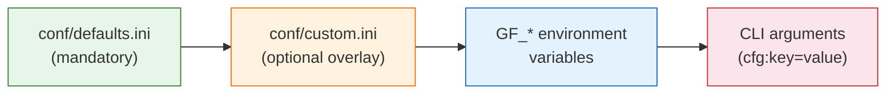
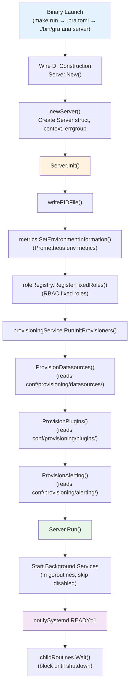
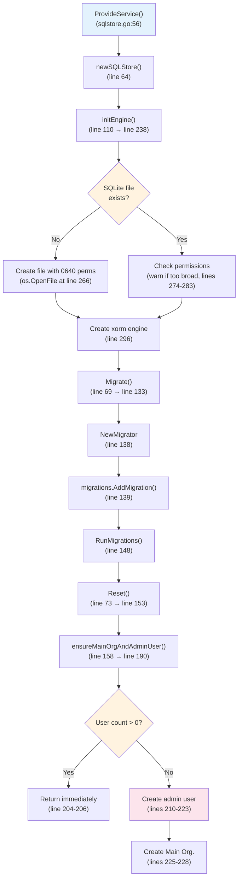
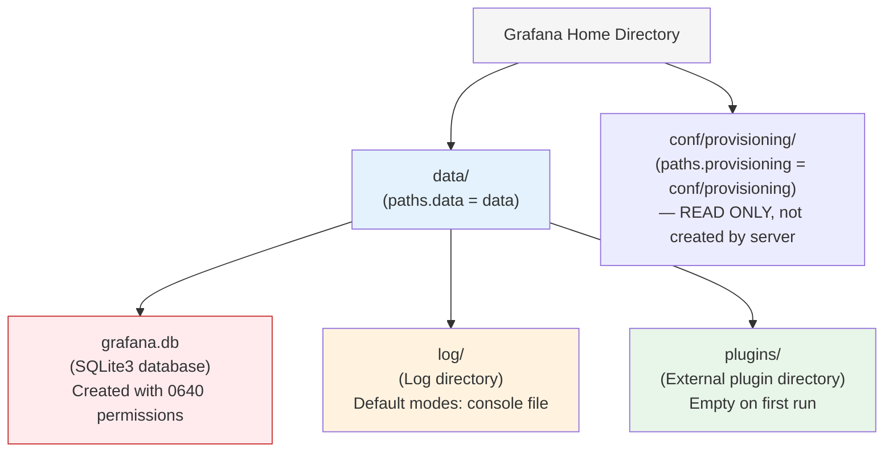
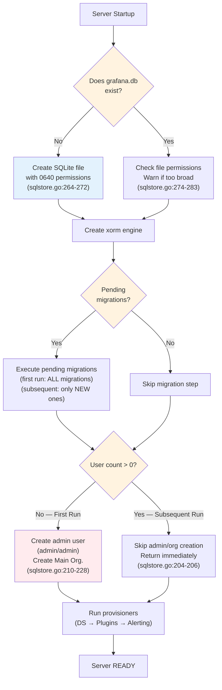

# Grafana First-Run Initialization: A Code-Level Investigation

> **Applies to:** Grafana `v11.5.0-pre` · Go `1.23.1` · Node `v22.11.0`
>
> **Source versions:** `go.mod` line 3 (`go 1.23.1`), `.nvmrc` line 1 (`v22.11.0`), `package.json` line 6 (`"version": "11.5.0-pre"`)
>
> **Methodology:** Every claim in this document is grounded in the source code as the single source of truth — not in existing documentation or assumptions. File paths and line numbers reference the Grafana repository at the version stated above.

---

## Scope and Purpose

This document bridges a critical gap between Grafana's existing architecture documentation and the **observable first-run behavior** of the server. It answers five core questions that existing developer guides leave unanswered:

1. **What actually happens** when you start Grafana from a completely clean state?
2. **What security defaults** are in effect when no configuration is provided?
3. **What files and databases** are created on the filesystem during first run?
4. **How are plugins and data sources** discovered and loaded without any configuration?
5. **How does the first run differ** from subsequent runs?

Existing documentation — the project README, `contribute/developer-guide.md`, and `contribute/architecture/` — tells you to run `make run` and log in with `admin`/`admin`, but does not explain the cascade of automatic initialization that makes this possible. This document traces the actual code paths.

---

## 1. Configuration Loading Chain

### Overview

Grafana's "zero configuration" startup works because of a four-layer configuration cascade. The server loads a mandatory defaults file, then optionally overlays a custom config, environment variables, and command-line arguments — in that exact order. If the custom config file does not exist, the system silently proceeds with defaults alone.

### The Four-Layer Cascade



**Layer 1 — `conf/defaults.ini` (mandatory):**
The entry point is `Cfg.Load()` at `pkg/setting/setting.go:1046`, which calls `loadConfiguration()`. At line 883, this constructs the path `conf/defaults.ini` relative to the home directory. If the file does not exist, the server exits immediately with a fatal error (lines 887–889: `os.Stat` check followed by `os.Exit(1)`). The file is parsed via `ini.Load(defaultConfigFile)` at line 893.

*Source: `pkg/setting/setting.go:881–898`*

**Layer 2 — `conf/custom.ini` (optional overlay):**
At line 906, `loadSpecifiedConfigFile()` is called. This method (lines 840–879) checks if the specified config file path is empty — if so, it defaults to `conf/custom.ini` (defined as `customInitPath` at line 57). At line 844, `pathExists(configFile)` is called: if the file does not exist, the method **returns nil** (no error, no warning), allowing the server to proceed with defaults alone. If it does exist, every non-empty key-value pair from the custom file is overlaid onto the defaults (lines 859–874).

*Source: `pkg/setting/setting.go:840–879`*

**Rationale — Why "zero config" works:** The critical insight is at line 844. The `loadSpecifiedConfigFile` method intentionally treats a missing `custom.ini` as a non-error condition. This design choice means a developer can run Grafana directly after compilation without creating any configuration file.

**Layer 3 — `GF_*` environment variable overrides:**
At line 917, `applyEnvVariableOverrides()` is called. This method (lines 666–681) iterates all sections and keys in the merged INI file and checks for environment variables matching the pattern `GF_<SECTION>_<KEY>`. If a matching env var is found with a non-empty value, it overwrites the config value (line 674).

*Source: `pkg/setting/setting.go:666–681`*

**Layer 4 — CLI argument overrides:**
At line 923, `applyCommandLineProperties()` applies any `cfg:section.key=value` arguments passed on the command line. These take final precedence. At line 926, `expandConfig()` evaluates any remaining `${ENV_VAR}` references embedded inside config values.

*Source: `pkg/setting/setting.go:923–926`*

### Key Path Defaults

The following table lists the critical path and database defaults that determine where Grafana creates state on disk. All values are from `conf/defaults.ini`:

| Section | Key | Default Value | Line | Description |
|---------|-----|--------------|------|-------------|
| `[paths]` | `data` | `data` | 15 | Base data directory (relative to working dir) |
| `[paths]` | `logs` | `data/log` | 21 | Log file directory |
| `[paths]` | `plugins` | `data/plugins` | 24 | External plugin scan directory |
| `[paths]` | `provisioning` | `conf/provisioning` | 27 | Provisioning config directory |
| `[database]` | `type` | `sqlite3` | 123 | Database engine type |
| `[database]` | `path` | `grafana.db` | 164 | SQLite database filename (relative to data dir) |
| `[remote_cache]` | `type` | `database` | 190 | Cache backend — falls back to same SQLite DB |

*Source: `conf/defaults.ini:15, 21, 24, 27, 123, 164, 190`*

These paths are resolved to absolute paths in `parseINIFile()` at `pkg/setting/setting.go:1095–1099`, using `makeAbsolute()` relative to the Grafana home directory.

---

## 2. First-Run Initialization Sequence

### Overview

Starting Grafana from a clean state triggers a carefully orchestrated initialization pipeline: the Go binary is compiled and launched, Wire dependency injection constructs the full service graph, the server initializes through three distinct phases (construction → initialization → execution), and during this process the SQLite database is created, all schema migrations are applied, and the default admin user and organization are bootstrapped — all automatically, without any human intervention.

### Step-by-Step Startup Flow



#### Phase 1: Binary Launch

The development workflow starts with `make run` (Makefile line 232), which invokes the `bra` file watcher. The `.bra.toml` configuration (lines 2–6) defines the `init_cmds` sequence:

1. `GO_BUILD_DEV=1 make build-go` — compiles the Go backend binary to `./bin/grafana`
2. `make gen-jsonnet` — generates jsonnet artifacts
3. `./bin/grafana server -profile -profile-addr=127.0.0.1 -profile-port=6000 ...` — launches the compiled binary with development flags and `cfg:app_mode=development`

*Source: `.bra.toml:2–6`, `Makefile:232–233`*

#### Phase 2: Wire DI Construction — `Server.New()`

Wire-generated code (from `pkg/server/wire.go`) calls `Server.New()` at `pkg/server/server.go:40`. This function receives all injected dependencies: `cfg`, `httpServer`, `roleRegistry`, `provisioningService`, `backgroundServiceProvider`, `usageStatsProvidersRegistry`, `statsCollectorService`, and `promReg`.

At line 46, `newServer()` is called, which (lines 58–84):
- Creates a root context with cancel function (line 62)
- Creates an errgroup for child goroutine management (line 63)
- Constructs the `Server` struct with all service references (lines 65–81)

At line 51, `s.Init()` is called immediately after construction.

*Source: `pkg/server/server.go:40–56, 58–84`*

#### Phase 3: Server Initialization — `Server.Init()`

The `Init()` method (line 113) is idempotent — it checks `isInitialized` at lines 117–119 and returns immediately if already initialized. On first call, it executes four steps in sequence:

1. **PID file** (lines 122–124): `writePIDFile()` writes the process ID to a file if configured. In default development mode, no PID file is configured, so this is a no-op.

2. **Prometheus metrics** (lines 126–128): `metrics.SetEnvironmentInformation()` registers environment information (version, commit) as Prometheus metrics for monitoring.

3. **RBAC fixed roles** (lines 130–132): `roleRegistry.RegisterFixedRoles()` registers all built-in RBAC roles (Viewer, Editor, Admin, etc.) in the access control system.

4. **Provisioning** (line 134): `provisioningService.RunInitProvisioners()` executes the init provisioners. This is detailed below.

*Source: `pkg/server/server.go:113–135`*

#### Phase 4: Server Execution — `Server.Run()`

The `Run()` method (line 139) first calls `Init()` again (idempotent guard at line 142), then:

- **Background services** (lines 149–174): Iterates all registered background services, starting each in a separate goroutine via the errgroup. Disabled services (checked via `registry.IsDisabled()`) are skipped.
- **systemd notification** (line 176): `notifySystemd("READY=1")` signals to systemd (if running under it) that the server is fully initialized and ready to accept connections.
- **Wait** (line 179): `childRoutines.Wait()` blocks the main goroutine until all background services complete or a shutdown signal is received.

*Source: `pkg/server/server.go:139–179`*

### Database Initialization Sub-Flow

The database initialization occurs during Wire's service construction phase, **before** `Server.New()` is called. The SQL store is a dependency that Wire resolves early.



**Step 1 — `ProvideService()`** (`sqlstore.go:56–79`): This is the Wire provider for the SQL store. It calls `newSQLStore()` at line 64, which internally calls `initEngine()` to create the database connection.

**Step 2 — `initEngine()`** (`sqlstore.go:238–340`): For SQLite databases (lines 256–284):
- Checks if the database file exists at `dbCfg.Path` (line 258: `fs.Exists()`)
- If **not found**: creates the file with `0640` permissions (line 266: `os.OpenFile(path, os.O_CREATE|os.O_RDWR, 0640)`)
- If **found**: checks permissions and warns if they are broader than `0640` (lines 274–283)
- Creates an xorm database engine (line 296: `xorm.NewEngine()`)

*Source: `pkg/services/sqlstore/sqlstore.go:238–340`*

**Step 3 — `Migrate()`** (`sqlstore.go:133–149`): At line 69, `Migrate()` is called with the migration locking configuration. This method:
- Creates a new `Migrator` (line 138)
- Adds all registered migrations (line 139: `ss.migrations.AddMigration(migrator)`)
- Executes all pending migrations (line 148: `migrator.RunMigrations()`)

On first run, **all** migrations execute, creating the complete database schema. On subsequent runs, only new (unapplied) migrations execute.

*Source: `pkg/services/sqlstore/sqlstore.go:133–149`*

**Step 4 — `Reset()` → `ensureMainOrgAndAdminUser()`** (`sqlstore.go:153–235`): At line 73, `Reset()` is called, which delegates to `ensureMainOrgAndAdminUser(false)` at line 158. This function (lines 190–235):

1. **User count guard** (lines 196–206): Executes `SELECT COUNT(id) AS Count FROM "user"` (line 200). If the count is greater than 0, the function returns immediately — this is the key guard that differentiates first-run from subsequent-run behavior.

2. **Admin user creation** (lines 210–223): If `DisableInitAdminCreation` is false (default: `conf/defaults.ini` line 325: `disable_initial_admin_creation = false`), calls `createUser()` with:
   - Login: value of `cfg.AdminUser` → `admin` (from `conf/defaults.ini` line 328: `admin_user = admin`)
   - Email: value of `cfg.AdminEmail` → `admin@localhost` (from line 334: `admin_email = admin@localhost`)
   - Password: value of `cfg.AdminPassword` → `admin` (from line 331: `admin_password = admin`)
   - IsAdmin: `true`

3. **Organization creation** (lines 225–228): Calls `getOrCreateOrg(sess, mainOrgName)` where `mainOrgName` is the constant `"Main Org."` (defined at `user.go:16`).

*Source: `pkg/services/sqlstore/sqlstore.go:190–235`, `pkg/services/sqlstore/user.go:16`*

### Admin User Creation Detail

The `createUser()` function (`user.go:42–131`) performs the following:

1. **Organization resolution** (line 44): Calls `getOrgIDForNewUser()`, which delegates to `getOrCreateOrg()` (line 31).
2. **Duplicate check** (lines 53–63): Queries for existing users with the same email or login.
3. **User struct construction** (lines 66–74): Creates a `User` with a generated UID, email, login, timestamps, and `IsAdmin: true`.
4. **Password hashing** (lines 77–94):
   - Generates a random 10-character salt (line 77: `util.GetRandomString(10)`)
   - Encodes the password with the salt (line 89: `util.EncodePassword(string(args.Password), usr.Salt)`)
   - The password is stored as a salted hash — **never plaintext** in the database
5. **Database insert** (lines 98–100): Inserts the user record.
6. **Org membership** (lines 110–128): Creates an `OrgUser` record linking the user to the organization with `org.RoleAdmin` (line 113).

*Source: `pkg/services/sqlstore/user.go:42–131`*

### Organization Bootstrap Detail

The `getOrCreateOrg()` function (`user.go:145–193`) handles organization creation:

- With `AutoAssignOrg = true` (default: `conf/defaults.ini` line 489: `auto_assign_org = true`), it looks for an org with `id = AutoAssignOrgId` (default: `1`, from line 492: `auto_assign_org_id = 1`) — lines 148–155.
- If no org with ID 1 exists and `AutoAssignOrgId == 1`, it creates a new organization named `"Main Org."` with `ID = 1` (lines 165–176).
- The org name comes from the constant `mainOrgName = "Main Org."` at `user.go:16`.

*Source: `pkg/services/sqlstore/user.go:145–193`*

### Provisioning Execution

The `RunInitProvisioners()` method (`provisioning.go:169–189`) executes three provisioners in strict sequence:

1. **Datasource provisioning** (line 170): `ProvisionDatasources()` reads YAML files from `conf/provisioning/datasources/` (line 228: `filepath.Join(ps.Cfg.ProvisioningPath, "datasources")`).
2. **Plugin provisioning** (line 176): `ProvisionPlugins()` reads from `conf/provisioning/plugins/` (line 238: `filepath.Join(ps.Cfg.ProvisioningPath, "plugins")`).
3. **Alerting provisioning** (line 182): `ProvisionAlerting()` reads from `conf/provisioning/alerting/` (line 269: `filepath.Join(ps.Cfg.ProvisioningPath, "alerting")`).

**Default behavior:** In a clean checkout, the provisioning directories contain only `sample.yaml` files with all entries commented out. The provisioners find no actionable configuration and complete without creating any resources. This is why the Grafana UI starts with no pre-configured datasources or dashboards.

Dashboard provisioning is handled separately in `Run()` (line 191) as a background service with continuous polling for changes.

*Source: `pkg/services/provisioning/provisioning.go:169–189, 191–225, 227–235, 237–245, 268–313`*

---

## 3. Default Security Posture

### Overview

When Grafana starts with no custom configuration, it applies a comprehensive set of security defaults. The most critical for a new developer to understand: the server creates a well-known admin account (`admin`/`admin`), uses a static signing key shared across all default installations, enables basic authentication and brute-force protection, but disables HTTPS-related features (since it assumes a development or proxied environment).

### Security Defaults Table

The following table catalogs every security-relevant default from `conf/defaults.ini`:

#### Admin Account Defaults

| Setting | Section | Value | Line | Implication |
|---------|---------|-------|------|-------------|
| `disable_initial_admin_creation` | `[security]` | `false` | 325 | Admin user **IS** created on first run |
| `admin_user` | `[security]` | `admin` | 328 | Default admin login name |
| `admin_password` | `[security]` | `admin` | 331 | Default admin password (stored salted+hashed, **not** plaintext in DB) |
| `admin_email` | `[security]` | `admin@localhost` | 334 | Default admin email address |

*Source: `conf/defaults.ini:325, 328, 331, 334`*

#### Encryption and Signing

| Setting | Section | Value | Line | Implication |
|---------|---------|-------|------|-------------|
| `secret_key` | `[security]` | `SW2YcwTIb9zpOOhoPsMm` | 337 | **⚠️ Static well-known key** — shared across ALL default installations. Used for signing. **Must be changed in production.** |
| `encryption_provider` | `[security]` | `secretKey.v1` | 340 | Envelope encryption uses the static `secret_key` above |

*Source: `conf/defaults.ini:337, 340`*

**Rationale — Why this matters:** The `secret_key` is a hardcoded string visible in the public repository. Any Grafana instance using the default value has its signing keys known to any attacker who reads the source code. This is acceptable for local development but is a critical security risk in production.

#### Authentication Mechanisms

| Setting | Section | Value | Line | Implication |
|---------|---------|-------|------|-------------|
| `enabled` | `[auth.basic]` | `true` | 875 | HTTP Basic Authentication **IS** enabled |
| `enabled` | `[auth.anonymous]` | `false` | 650 | Anonymous access **IS NOT** enabled |
| `disable_login` | `[auth]` | `false` | 564 | Login functionality **IS** active |
| `disable_login_form` | `[auth]` | `false` | 576 | Login form **IS** visible |
| `login_cookie_name` | `[auth]` | `grafana_session` | 561 | Session cookie name |
| `token_rotation_interval_minutes` | `[auth]` | `10` | 573 | Auth token rotated every 10 minutes |

*Source: `conf/defaults.ini:875, 650, 564, 576, 561, 573`*

All external OAuth/SSO providers (GitHub, GitLab, Google, Azure AD, Okta, generic OAuth) are **disabled** by default — each has `enabled = false` in its respective section.

#### Brute-Force Protection

| Setting | Section | Value | Line | Implication |
|---------|---------|-------|------|-------------|
| `disable_brute_force_login_protection` | `[security]` | `false` | 352 | Brute-force protection **IS** enabled |
| `brute_force_login_protection_max_attempts` | `[security]` | `5` | 355 | Account locks after **5** failed login attempts |

*Source: `conf/defaults.ini:352, 355`*

#### Cookie and Transport Security

| Setting | Section | Value | Line | Implication |
|---------|---------|-------|------|-------------|
| `cookie_secure` | `[security]` | `false` | 358 | Cookies **NOT** restricted to HTTPS (appropriate for HTTP dev) |
| `cookie_samesite` | `[security]` | `lax` | 361 | SameSite=Lax prevents CSRF on cross-origin GET requests |
| `allow_embedding` | `[security]` | `false` | 364 | `<iframe>` embedding **IS** disabled |
| `strict_transport_security` | `[security]` | `false` | 368 | HSTS **IS NOT** enabled (no HTTPS by default) |
| `csrf_always_check` | `[security]` | `false` | 410 | CSRF not checked for cookieless (API token) requests |

*Source: `conf/defaults.ini:358, 361, 364, 368, 410`*

#### Content Security Headers

| Setting | Section | Value | Line | Implication |
|---------|---------|-------|------|-------------|
| `x_content_type_options` | `[security]` | `true` | 382 | X-Content-Type-Options: nosniff **IS** enabled |
| `x_xss_protection` | `[security]` | `true` | 386 | X-XSS-Protection header **IS** enabled |
| `content_security_policy` | `[security]` | `false` | 390 | CSP **IS NOT** enabled |
| `angular_support_enabled` | `[security]` | `false` | 407 | Angular plugin support **IS** disabled |

*Source: `conf/defaults.ini:382, 386, 390, 407`*

#### User Management Defaults

| Setting | Section | Value | Line | Implication |
|---------|---------|-------|------|-------------|
| `allow_sign_up` | `[users]` | `false` | 483 | Self-registration **IS** disabled |
| `auto_assign_org` | `[users]` | `true` | 489 | New users auto-assigned to default org |
| `auto_assign_org_id` | `[users]` | `1` | 492 | Auto-assign to org ID 1 ("Main Org.") |
| `auto_assign_org_role` | `[users]` | `Viewer` | 495 | New non-admin users get Viewer role |

*Source: `conf/defaults.ini:483, 489, 492, 495`*

### Admin Password Storage Chain

Although the password is configured as plaintext `admin` in `conf/defaults.ini`, it is **never stored as plaintext** in the database. The storage chain in `user.go:77–93`:

1. A random 10-character salt is generated (`util.GetRandomString(10)` at line 77)
2. A random 10-character "rands" value is generated (line 82)
3. The password is encoded with the salt (`util.EncodePassword(string(args.Password), usr.Salt)` at line 89)
4. The encoded (hashed) password is stored in the `usr.Password` field (line 93)

*Source: `pkg/services/sqlstore/user.go:77–93`*

---

## 4. Persistent State Map

### Overview

On first run, Grafana creates a set of filesystem artifacts under the `data/` directory (configurable via `[paths] data`). The most significant is the SQLite database (`grafana.db`), which contains the complete schema for all Grafana subsystems. This section catalogs every artifact and the database tables created.

### Filesystem Layout



#### Artifact Inventory

| Artifact | Path | Source Config | Created By | Permissions |
|----------|------|--------------|------------|-------------|
| Data directory | `data/` | `conf/defaults.ini:15` — `data = data` | Runtime (mkdir if needed) | Directory |
| SQLite database | `data/grafana.db` | `conf/defaults.ini:164` — `path = grafana.db` | `initEngine()` at `sqlstore.go:266` | `0640` |
| Log directory | `data/log/` | `conf/defaults.ini:21` — `logs = data/log` | Logging subsystem | Directory |
| Plugin directory | `data/plugins/` | `conf/defaults.ini:24` — `plugins = data/plugins` | Plugin manager (mkdir if needed) | Directory |

*Source: `conf/defaults.ini:15, 21, 24, 164`, `pkg/services/sqlstore/sqlstore.go:263–272`*

**Important note:** The `conf/provisioning/` directory is **NOT** under `data/`. It lives at the repository root (configured at `conf/defaults.ini:27` — `provisioning = conf/provisioning`). The provisioning system reads from this directory but does not create state there.

### Remote Cache Default

The remote cache defaults to the database backend (`conf/defaults.ini:190` — `type = database`), meaning the caching layer uses the **same SQLite database** rather than requiring Redis or Memcached. This eliminates a dependency for development but means cache operations share I/O with all other database operations.

*Source: `conf/defaults.ini:190`*

### Database Schema — Migration Registry

The SQLite database schema is created by executing all migrations registered in `pkg/services/sqlstore/migrations/migrations.go`. The `AddMigration()` method (lines 31–144) calls over 50 migration functions in sequence. Each function adds one or more table creation and alteration migrations. The first function called is `mg.AddCreateMigration()` (line 32), which creates the `migration_log` table itself — the table that tracks which migrations have been applied.

The complete migration registry (in execution order):

| Migration Function | Tables Created/Modified | Line |
|---|---|---|
| `mg.AddCreateMigration()` | `migration_log` (migration tracking) | 32 |
| `addUserMigrations(mg)` | `user` | 33 |
| `addTempUserMigrations(mg)` | `temp_user` | 34 |
| `addStarMigrations(mg)` | `star` | 35 |
| `addOrgMigrations(mg)` | `org`, `org_user` | 36 |
| `addDashboardMigration(mg)` | `dashboard` | 37 |
| `addDashboardUIDStarMigrations(mg)` | Star UID updates | 38 |
| `addDataSourceMigration(mg)` | `data_source` | 39 |
| `addApiKeyMigrations(mg)` | `api_key` | 40 |
| `addDashboardSnapshotMigrations(mg)` | `dashboard_snapshot` | 41 |
| `addQuotaMigration(mg)` | `quota` | 42 |
| `addAppSettingsMigration(mg)` | `app_setting` | 43 |
| `addSessionMigration(mg)` | `session` | 44 |
| `addPlaylistMigrations(mg)` | `playlist`, `playlist_item` | 45 |
| `addPreferencesMigrations(mg)` | `preferences` | 46 |
| `addAlertMigrations(mg)` | Alert tables | 47 |
| `addAnnotationMig(mg)` | Annotation tables | 48 |
| `addTestDataMigrations(mg)` | Test data tables | 49 |
| `addDashboardVersionMigration(mg)` | `dashboard_version` | 50 |
| `addTeamMigrations(mg)` | `team`, `team_member` | 51 |
| `addDashboardACLMigrations(mg)` | `dashboard_acl` | 52 |
| `addTagMigration(mg)` | `tag` | 53 |
| `addLoginAttemptMigrations(mg)` | `login_attempt` | 54 |
| `addUserAuthMigrations(mg)` | `user_auth` | 55 |
| `addServerlockMigrations(mg)` | `server_lock` | 56 |
| `addUserAuthTokenMigrations(mg)` | `user_auth_token` | 57 |
| `addCacheMigration(mg)` | `cache_data` | 58 |
| `addShortURLMigrations(mg)` | `short_url` | 59 |
| `ualert.AddTablesMigrations(mg)` | Unified alerting tables | 60 |
| `addLibraryElementsMigrations(mg)` | `library_element`, `library_element_connection` | 61 |
| `addSecretsMigration(mg)` | Secrets tables | 64 |
| `addKVStoreMigrations(mg)` | `kv_store` | 65 |
| `accesscontrol.AddMigration(mg)` | `permission`, `role` tables | 67 |
| `addQueryHistoryMigrations(mg)` | Query history tables | 68 |
| `addCorrelationsMigrations(mg)` | `correlation` | 77 |
| `addPublicDashboardMigration(mg)` | `dashboard_public` | 81 |
| `addDbFileStorageMigration(mg)` | File storage tables | 82 |
| `addFolderMigrations(mg)` | `folder` | 98 |
| `anonservice.AddMigration(mg)` | Anonymous service tables | 100 |
| `signingkeys.AddMigration(mg)` | Signing keys tables | 101 |
| `ssosettings.AddMigration(mg)` | SSO settings tables | 108 |
| `addCloudMigrationsMigrations(mg)` | Cloud migration tables | 117 |
| `externalsession.AddMigration(mg)` | External session tables | 141 |

*Source: `pkg/services/sqlstore/migrations/migrations.go:31–144`*

### Migration State Tracking

The `migration_log` table is the cornerstone of Grafana's idempotent migration system. Each time a migration is successfully applied, a record is inserted into this table. On subsequent startups, the migrator queries `migration_log` to determine which migrations have already been applied and skips them. This is how the system avoids re-executing schema changes.

*Source: `pkg/services/sqlstore/sqlstore.go:133–149` (Migrate method), `pkg/services/sqlstore/migrations/migrations.go:32` (AddCreateMigration)*

---

## 5. Plugin and Data Source Ecosystem

### Overview

Grafana's plugin system assembles plugins from three distinct sources: **core** plugins compiled into the application, **bundled** plugins shipped alongside it, and **external** plugins installed by users. On a fresh installation with default configuration, only the core plugins are available — bundled externals are empty, and the external plugin directory contains nothing.

### Three-Tier Plugin Source Hierarchy

```mermaid
flowchart TD
    L["sources.List()\n(sources.go:24)"] --> CORE["Core Plugins\n(ClassCore)"]
    L --> BUNDLED["Bundled Plugins\n(ClassBundled)"]
    L --> EXT["External Plugins\n(ClassExternal)"]
    L --> SETTINGS["Plugin Settings Sources"]

    CORE --> CORE_DS["public/app/plugins/datasource/\n(11 datasource plugins)"]
    CORE --> CORE_PANEL["public/app/plugins/panel/\n(30+ panel plugins)"]

    BUNDLED --> BUNDLED_PATH["plugins-bundled/\n(cfg.BundledPluginsPath)"]
    BUNDLED_PATH --> BUNDLED_JSON["external.json\n= {\"plugins\": []}\n(EMPTY by default)"]

    EXT --> EXT_PATH["data/plugins/\n(cfg.PluginsPath)"]
    EXT_PATH --> EXT_EMPTY["Empty directory\non first run"]

    SETTINGS --> SETTINGS_INI["[plugin.&lt;id&gt;] path=...\n(custom config sections)"]

    style CORE fill:#e8f5e9
    style BUNDLED fill:#fff3e0
    style EXT fill:#e3f2fd
    style SETTINGS fill:#f3e5f5
```

The `Service.List()` method in `pkg/plugins/manager/sources/sources.go:24–32` assembles the complete plugin source list:

#### Tier 1: Core Plugins (ClassCore)

Core plugins are part of the Grafana source tree and are compiled into the frontend build. The `corePluginPaths()` function (lines 64–68) returns two directories:

- `filepath.Join(staticRootPath, "app/plugins/datasource")` — line 65
- `filepath.Join(staticRootPath, "app/plugins/panel")` — line 66

These resolve to `public/app/plugins/datasource/` and `public/app/plugins/panel/` respectively (since `static_root_path = public` from `conf/defaults.ini:60`).

*Source: `pkg/plugins/manager/sources/sources.go:64–68`, `conf/defaults.ini:60`*

#### Tier 2: Bundled Plugins (ClassBundled)

Bundled plugins come from `cfg.BundledPluginsPath`, which is set to `plugins-bundled/` (resolved by `makeAbsolute("plugins-bundled", cfg.HomePath)` at `pkg/setting/setting.go:1097`).

The manifest file `plugins-bundled/external.json` contains:
```json
{"plugins": []}
```
This is an **empty array** — no bundled external plugins are shipped by default.

*Source: `pkg/plugins/manager/sources/sources.go:27`, `pkg/setting/setting.go:1097`, `plugins-bundled/external.json:1–3`*

#### Tier 3: External Plugins (ClassExternal)

External plugins are discovered from `cfg.PluginsPath`, which resolves to `data/plugins/` (from `conf/defaults.ini:24` — `plugins = data/plugins`, resolved at `pkg/setting/setting.go:1096`).

The `externalPluginSources()` method (lines 34–47) calls `DirAsLocalSources()` to scan this directory for plugin subdirectories. On a fresh installation, this directory is empty, so no external plugins are loaded.

*Source: `pkg/plugins/manager/sources/sources.go:34–47`, `pkg/setting/setting.go:1095–1096`*

#### Tier 4: Plugin Settings Sources

The `pluginSettingSources()` method (lines 49–61) checks for custom plugin paths defined in `[plugin.<id>]` configuration sections. If a section has a `path` key, that path is added as an external plugin source. By default, no such sections exist.

*Source: `pkg/plugins/manager/sources/sources.go:49–61`*

### Frontend Built-In Plugin Registry

On the frontend side, `public/app/features/plugins/built_in_plugins.ts` defines the complete registry of core plugins that are lazy-loaded via webpack dynamic imports. Each plugin is an async function returning a dynamic `import()` call, meaning the plugin code is split into separate webpack chunks and loaded on demand.

**Core Datasources (11 plugins, lines 1–21 / registry lines 79–89):**

| Plugin ID | Import Path |
|-----------|-------------|
| `graphite` | `app/plugins/datasource/graphite/module` |
| `cloudwatch` | `app/plugins/datasource/cloudwatch/module` |
| `dashboard` | `app/plugins/datasource/dashboard/module` |
| `elasticsearch` | `app/plugins/datasource/elasticsearch/module` |
| `opentsdb` | `app/plugins/datasource/opentsdb/module` |
| `grafana` | `app/plugins/datasource/grafana/module` |
| `influxdb` | `app/plugins/datasource/influxdb/module` |
| `loki` | `app/plugins/datasource/loki/module` |
| `mixed` | `app/plugins/datasource/mixed/module` |
| `prometheus` | `app/plugins/datasource/prometheus/module` |
| `alertmanager` | `app/plugins/datasource/alertmanager/module` |

*Source: `public/app/features/plugins/built_in_plugins.ts:1–21, 79–89`*

**Core Panels (32 plugins, lines 23–76 / registry lines 91–123):**

text, timeseries, trend, state-timeline, status-history, candlestick, graph, xychart, geomap, canvas, dashlist, alertlist, annolist, heatmap, table, table-old, news, live, stat, datagrid, debug, flamegraph, gettingstarted, gauge, piechart, bargauge, barchart, logs, traces, welcome, nodeGraph, histogram

*Source: `public/app/features/plugins/built_in_plugins.ts:23–76, 91–123`*

**What appears in the UI without any installation:** All 11 core datasources and 32 core panels listed above are available immediately in a fresh Grafana instance. These are compiled into the frontend webpack bundle and do not require any plugin installation.

### Plugin Preinstall Configuration

The `[plugins]` section of `conf/defaults.ini` (line 1766) defines `preinstall =` as an **empty value**. The comments (lines 1764–1765) indicate that `grafana-lokiexplore-app` is the default preinstalled plugin, but this is controlled by the startup logic rather than the INI value itself. The `preinstall_async = true` setting (line 1768) means preinstallation runs in the background without blocking startup.

*Source: `conf/defaults.ini:1764–1770`*

---

## 6. Build vs. Runtime Behavior

### Overview

Grafana requires a build step before it can run. The Go backend must be compiled into a binary, and the frontend assets must be bundled by webpack. This section explains the relationship between build artifacts and runtime behavior, and when recompilation is required.

### The `make run` Workflow

The primary development workflow uses the `bra` file watcher:

1. `make run` (Makefile line 232): The target depends on the `$(BRA)` binary and executes `$(BRA) run` (line 233).

2. `.bra.toml` init commands (lines 2–6): On initial startup, bra executes three commands:
   - `GO_BUILD_DEV=1 make build-go` — compiles the Go backend
   - `make gen-jsonnet` — generates jsonnet artifacts
   - `./bin/grafana server -profile -profile-addr=127.0.0.1 -profile-port=6000 -profile-block-rate=1 -profile-mutex-rate=5 -packaging=dev cfg:app_mode=development` — launches the server binary

3. On file changes (`.bra.toml` lines 18–21): bra watches `pkg/`, `public/views/`, `conf/`, and `devenv/dev-dashboards/` for changes to `.go`, `.ini`, `.toml`, and `.template.html` files. On change, it runs `build-go-fast` (faster incremental rebuild) then relaunches the server.

*Source: `Makefile:232–233`, `.bra.toml:1–22`*

### `make build-go`

The `build-go` target (Makefile line 187):
```
build-go: gen-go update-workspace
    $(GO) run build.go $(GO_BUILD_FLAGS) build
```

This depends on `gen-go` (which runs code generation including Wire) and `update-workspace` (syncing Go workspace), then runs the `build.go` build script to compile the main Grafana binary to `./bin/grafana`.

*Source: `Makefile:187–189`*

### `make run-go` — Direct Go Run

For a simpler workflow without the file watcher, `make run-go` (Makefile lines 236–238) uses `go run` directly with the race detector enabled:
```
$(GO) run -race ./pkg/cmd/grafana -- server -profile ... cfg:app_mode=development
```

This skips the binary compilation step by using `go run`, which compiles and runs in one step. The `-race` flag enables Go's race condition detector for development.

*Source: `Makefile:236–238`*

### Frontend Build

`make build-js` (Makefile lines 211–214) runs:
```
yarn run build
yarn run plugins:build-bundled
```

The `build` script in `package.json` (line 9) invokes webpack with the production configuration: `NODE_ENV=production nx exec --verbose -- webpack --config scripts/webpack/webpack.prod.js --progress`.

The `public/` directory with webpack-bundled frontend assets **must exist** for the server to serve the UI. These are build artifacts — without running `yarn run build` (or `yarn dev` for development), the server will start but the web interface will not render correctly.

*Source: `Makefile:211–214`, `package.json:9`*

### Wire-Generated Dependency Injection

Grafana uses Google Wire for compile-time dependency injection. The `pkg/server/wire.go` file declares the dependency graph (which services depend on which providers). During `gen-go` (part of `build-go`), Wire generates `wire_gen.go` with concrete provider calls that construct the entire service graph.

This means the dependency injection graph is resolved at **compile time**, not runtime. If a new service is added or dependencies change, the Wire code must be regenerated and the binary recompiled.

*Source: `Makefile:187` (gen-go prerequisite)*

### When Recompilation Is Required

| Change Type | Requires Go Build? | Requires Frontend Build? |
|---|---|---|
| Go source code changes (`.go` files) | **Yes** | No |
| Configuration changes (`.ini` files) | No (read at startup) | No |
| Frontend source changes (`.ts`, `.tsx`) | No | **Yes** |
| New Wire dependencies | **Yes** (gen-go + build) | No |
| Plugin additions (external) | No | No |
| provisioning YAML changes | No (read at startup) | No |

---

## 7. First Run vs. Subsequent Run Differences

### Overview

The key behavioral differences between first and subsequent runs stem from three mechanisms: **SQLite file existence**, **migration state tracking**, and the **user count guard** in `ensureMainOrgAndAdminUser()`. Together, these create two distinct startup paths.

### Decision Flow



### Divergence Point 1: SQLite File Handling

In `initEngine()` at `sqlstore.go:256–284`:

| Condition | First Run | Subsequent Run |
|-----------|-----------|----------------|
| File exists check (line 258) | `false` — file not found | `true` — file found |
| Action taken | `os.OpenFile(path, os.O_CREATE\|os.O_RDWR, 0640)` creates the file (line 266) | `os.Lstat()` checks permissions, warns if mode is broader than `0640` (lines 274–283) |

*Source: `pkg/services/sqlstore/sqlstore.go:256–284`*

### Divergence Point 2: Migration Execution

In `Migrate()` at `sqlstore.go:133–149`:

The migrator checks the `migration_log` table to determine which migrations have already been applied.

| Condition | First Run | Subsequent Run |
|-----------|-----------|----------------|
| `migration_log` table | Does not exist (created by first migration) | Exists with records of all previous migrations |
| Migrations to execute | **ALL** migrations (~50+ functions creating dozens of tables) | Only **NEW** migrations added since last run (usually zero for same version) |
| Duration | Several seconds (creating full schema) | Near-instant (no pending migrations) |

*Source: `pkg/services/sqlstore/sqlstore.go:133–149`, `pkg/services/sqlstore/migrations/migrations.go:31–144`*

### Divergence Point 3: Admin User and Organization Creation

In `ensureMainOrgAndAdminUser()` at `sqlstore.go:190–235`:

The pivotal check is at lines 200–206:
```go
rawSQL := `SELECT COUNT(id) AS Count FROM ` + ss.dialect.Quote("user")
// ...
if stats.Count > 0 {
    return nil  // ← Subsequent runs exit here
}
```

| Condition | First Run | Subsequent Run |
|-----------|-----------|----------------|
| User count (line 200–204) | `0` — empty database | `> 0` — admin user exists |
| Admin creation (lines 210–223) | Executes: creates user `admin` with password `admin`, email `admin@localhost`, `IsAdmin=true` | **Skipped entirely** — function returns at line 205 |
| Org creation (lines 225–228) | Executes: creates "Main Org." with ID 1 | **Skipped entirely** — function returns before reaching this code |

*Source: `pkg/services/sqlstore/sqlstore.go:190–235`*

**Rationale:** This guard is intentionally simple — it checks for **any** user, not specifically an admin user. This means if you manually delete the admin user but other users exist, the automatic admin creation will **not** re-trigger. The guard protects against creating duplicate admin accounts on every restart.

### Divergence Point 4: Provisioning Behavior

The `RunInitProvisioners()` method (`provisioning.go:169–189`) runs on **every** startup, regardless of whether it's a first or subsequent run. The provisioners read YAML files from `conf/provisioning/` and reconcile with database state:

| Condition | First Run | Subsequent Run |
|-----------|-----------|----------------|
| Provisioning YAML files | Default sample.yaml (all commented out) | Same unless modified by user |
| Resources created | None (no actionable config in samples) | None, or reconciled with DB state if config changed |
| Dashboard polling | Starts continuous polling in `Run()` | Same — starts fresh polling cycle |

*Source: `pkg/services/provisioning/provisioning.go:169–189, 191–225`*

### Summary Table

| Component | First Run | Subsequent Run | Persists? |
|-----------|-----------|----------------|-----------|
| `data/grafana.db` file | Created (0640 perms) | Opened, permissions checked | **Yes** |
| Database schema | All migrations run | Only new migrations (if any) | **Yes** (schema persists) |
| `migration_log` entries | All created fresh | Checked to skip applied migrations | **Yes** |
| Admin user (`admin`/`admin`) | Created in database | Already exists, creation skipped | **Yes** |
| "Main Org." (ID: 1) | Created in database | Already exists, creation skipped | **Yes** |
| Provisioned resources | None (default sample configs) | Reconciled with YAML files | **Yes** (in DB) |
| RBAC fixed roles | Registered in memory | Registered in memory (same) | **No** (re-registered each run) |
| Background services | Started in goroutines | Started in goroutines (same) | **No** (re-started each run) |
| PID file | Written if configured | Overwritten if configured | **Overwritten** each run |
| Log files | Created in `data/log/` | Appended to existing files | **Yes** (accumulated) |

---

## Source Citations

All source files referenced in this document, with their purpose and key sections cited:

| File | Purpose | Key Lines Referenced |
|------|---------|---------------------|
| `conf/defaults.ini` | All default configuration values | 15, 21, 24, 27, 60, 123, 164, 190, 325, 328, 331, 334, 337, 340, 352, 355, 358, 361, 364, 368, 382, 386, 390, 407, 410, 483, 489, 492, 495, 561, 564, 573, 576, 650, 875, 1071, 1074, 1766, 1876 |
| `pkg/server/server.go` | Server lifecycle — Init, Run, Shutdown | 40–56, 58–84, 113–135, 139–179, 176, 205–226, 229–256 |
| `pkg/services/sqlstore/sqlstore.go` | Database engine creation, migration, admin bootstrap | 56–79, 93–128, 133–149, 153–159, 190–235, 238–340 |
| `pkg/services/sqlstore/user.go` | Admin user and organization creation logic | 16, 18–32, 42–131, 145–193 |
| `pkg/services/sqlstore/migrations/migrations.go` | Complete migration registry | 31–144 |
| `pkg/plugins/manager/sources/sources.go` | Plugin source hierarchy — core, bundled, external | 24–32, 34–47, 49–61, 64–68 |
| `pkg/services/provisioning/provisioning.go` | Provisioning orchestration — DS, plugins, alerting | 40–93, 169–189, 191–225, 227–245, 268–313 |
| `pkg/setting/setting.go` | Configuration loading chain | 57, 666–681, 840–879, 881–942, 1046–1070, 1095–1099 |
| `public/app/features/plugins/built_in_plugins.ts` | Frontend built-in plugin registry | 1–21 (datasources), 23–76 (panels), 77–123 (registry), 125 (export) |
| `Makefile` | Build targets and dev workflow | 187–189, 211–214, 232–233, 236–238 |
| `.bra.toml` | Dev runner configuration — init commands, watch dirs | 1–22 |
| `go.mod` | Go version (1.23.1) | 3 |
| `.nvmrc` | Node.js version (v22.11.0) | 1 |
| `package.json` | Project version (11.5.0-pre), build scripts | 6, 9 |
| `plugins-bundled/external.json` | Bundled external plugin manifest (empty) | 1–3 |
