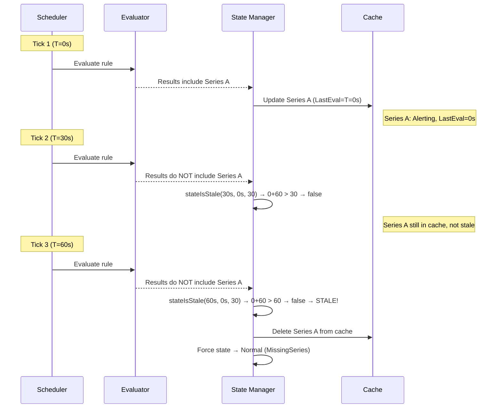
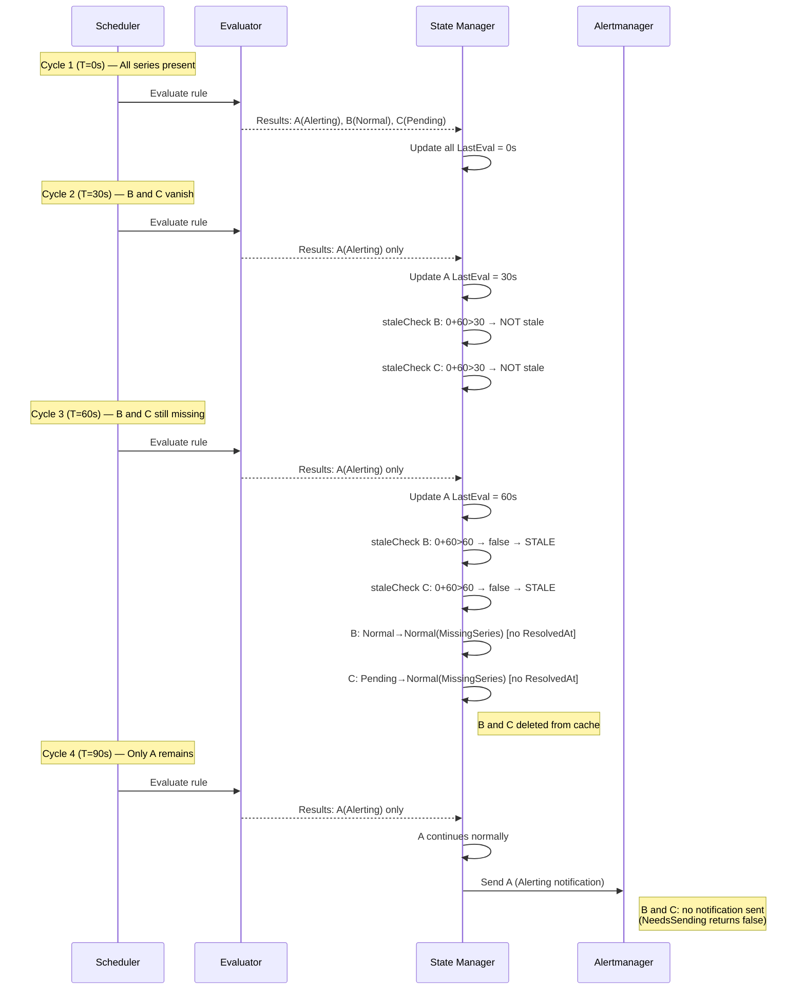
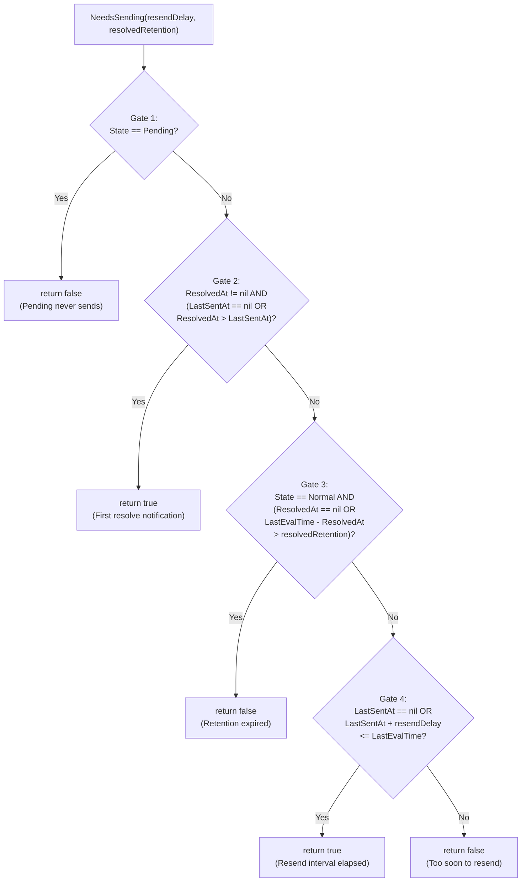
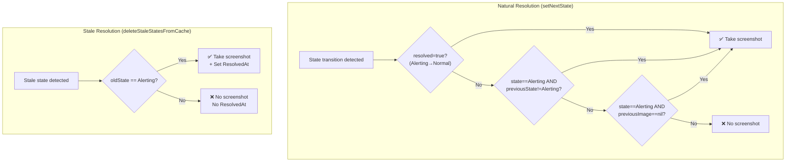
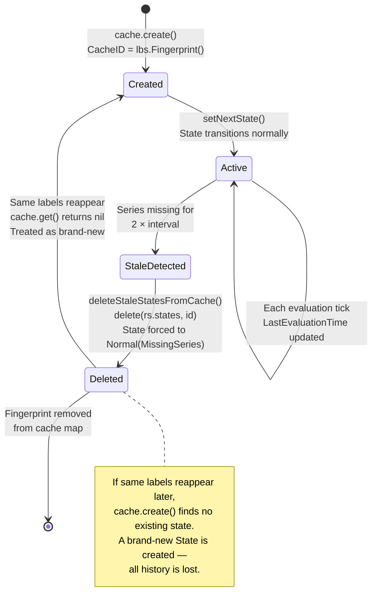

# Stale Alert Series Detection and Resolution in Grafana Unified Alerting: An Investigative Deep-Dive

## Introduction

When a time series disappears from query results during an active multi-series alert evaluation, Grafana's Unified Alerting subsystem (ngalert) must decide whether the series has genuinely vanished or is merely experiencing a transient delay. Operators investigating alert behavior often observe that alert states for disappeared series appear to linger longer than expected — firing alerts take time to resolve, resolved notifications keep repeating, and the overall lifecycle feels opaque.

This document provides a comprehensive, code-grounded investigation into the **complete lifecycle of stale alert series detection and resolution**. Every conclusion is derived exclusively from the source code — no assumptions are made. Each claim references an exact file path and line number so that readers can verify assertions independently.

### Questions This Document Answers

1. **What is the staleness detection formula, and what are its boundary behaviors?**
2. **How are stale series detected, resolved, and removed from the state cache?**
3. **How does the scheduler distinguish a series that stopped reporting from one that is merely slow?**
4. **How do `ResendDelay`, `ResolvedRetention`, and `LastSentAt` interact during repeated evaluation cycles?**
5. **Do stale series resolutions trigger the same screenshot capture path as natural resolutions?**
6. **Do vanishing series honor the pending period (`For` duration) on their way to resolved?**
7. **Is a reappearing series with identical labels recognized as the same entity or treated as brand-new?**
8. **What runtime-observable evidence can confirm these behaviors without modifying the repository?**

### Core Source Files Analyzed

| File | Role |
|------|------|
| `pkg/services/ngalert/state/manager.go` | State manager: ProcessEvalResults, stale detection, notification gating |
| `pkg/services/ngalert/state/state.go` | State model: NeedsSending, shouldTakeImage, nextEndsTime, state setters |
| `pkg/services/ngalert/state/cache.go` | Cache: identity computation, state storage, stale deletion |
| `pkg/services/ngalert/state/compat.go` | Alertmanager conversion: StateToPostableAlert, FromAlertsStateToStoppedAlert |
| `pkg/services/ngalert/schedule/alert_rule.go` | Alert rule runtime: evaluation dispatch, send callback |
| `pkg/services/ngalert/schedule/loaded_metrics_reader.go` | Active fingerprint filtering for hysteresis |
| `pkg/services/ngalert/models/alert_rule.go` | State reason constants (MissingSeries, KeepLast, etc.) |
| `pkg/setting/setting_unified_alerting.go` | Configuration defaults (ResolvedAlertRetention = 15m) |

---

## 1. The Staleness Detection Formula

### 1.1 The `stateIsStale` Function

The core staleness determination resides in a single, three-parameter function:

```go
// Source: pkg/services/ngalert/state/manager.go:627-629
func stateIsStale(evaluatedAt time.Time, lastEval time.Time, intervalSeconds int64) bool {
    return !lastEval.Add(2 * time.Duration(intervalSeconds) * time.Second).After(evaluatedAt)
}
```

**Mathematical equivalent:**

```
stale = (lastEval + 2 × intervalSeconds) ≤ evaluatedAt
```

A state is declared stale when its `LastEvaluationTime` is **at least two full evaluation intervals** behind the current evaluation timestamp. The use of `!After(evaluatedAt)` is equivalent to `<=` — at the exact boundary of two intervals, the state is already stale.

**Rationale:** This formula provides a one-interval grace period. If a series misses a single evaluation cycle, it is not yet stale — perhaps the data source was slow. Only after two consecutive missed evaluations does the system conclude the series has genuinely vanished.

### 1.2 Boundary Behavior from Test Cases

The test suite in `pkg/services/ngalert/state/manager_private_test.go:41-82` validates five boundary conditions:

| Test Case | `lastEval` Offset | Expected Result | Reasoning |
|-----------|-------------------|-----------------|-----------|
| Last eval is now | `now` | **NOT stale** | Series just reported |
| 1 interval before now | `now - 1×interval` (nanoseconds*) | **NOT stale** | Within the grace window |
| Slightly less than 2 intervals | `now - 2×interval×second + 100ms` | **NOT stale** | Just barely within grace |
| Exactly 2 intervals | `now - 2×interval×second` | **STALE** | At the boundary — stale |
| 3 intervals | `now - 3×interval×second` | **STALE** | Well past the boundary |

> *Note on Test Case 2:* The test at line 57 uses `now.Add(-time.Duration(intervalSeconds))` without multiplying by `time.Second`. This means the offset is in nanoseconds, not seconds — effectively testing an offset of only a few nanoseconds rather than a full interval. The function itself is correct; the test merely validates an edge near zero offset.
>
> Source: `pkg/services/ngalert/state/manager_private_test.go:57`

### 1.3 Worked Example: 30-Second Evaluation Interval

Consider a rule with `IntervalSeconds = 30` and a series "Series A":

| Evaluation Tick | Time | Series A in Results? | `LastEvaluationTime` | Stale Check | Result |
|-----------------|------|---------------------|---------------------|-------------|--------|
| Tick 1 | T=0s | ✅ Yes | T=0s | `0 + 60 > 0` → `After` is true | **Not stale** |
| Tick 2 | T=30s | ❌ No | T=0s (unchanged) | `0 + 60 > 30` → `After` is true | **Not stale** |
| Tick 3 | T=60s | ❌ No | T=0s (unchanged) | `0 + 60 > 60` → `After` is false | **STALE** |

At Tick 2, the series is absent but gets a one-interval grace period. At Tick 3, two full intervals have elapsed since the last evaluation, and the staleness formula triggers.

### 1.4 Staleness Detection Timeline



---

## 2. How Stale Series Get Detected and Resolved

### 2.1 The `ProcessEvalResults` Flow

Every evaluation tick enters the state manager through `ProcessEvalResults`:

```go
// Source: pkg/services/ngalert/state/manager.go:307-355
func (st *Manager) ProcessEvalResults(ctx context.Context, evaluatedAt time.Time,
    alertRule *ngModels.AlertRule, results eval.Results, extraLabels data.Labels, send Sender) StateTransitions {
```

The function executes this sequence:

1. **Process current results** — `setNextStateForRule` (line 326) iterates each result, calls `cache.create` to find or create the state, then calls `setNextState` to compute transitions
2. **Detect stale states** — `deleteStaleStatesFromCache` (line 328) scans the cache for states whose `LastEvaluationTime` has fallen behind
3. **Combine transitions** — `allChanges = append(states, staleStates...)` (line 334)
4. **Gate notifications** — `updateLastSentAt` (line 340) filters transitions through `NeedsSending` and stamps `LastSentAt`
5. **Persist and record** — `persister.Sync` (line 343) and `historian.Record` (line 345) save state
6. **Dispatch** — `send(ctx, statesToSend)` (line 351) delivers to Alertmanager

Source: `pkg/services/ngalert/state/manager.go:326-351`

### 2.2 The `deleteStaleStatesFromCache` Walkthrough

This is the critical function that handles series disappearance:

```go
// Source: pkg/services/ngalert/state/manager.go:586-625
func (st *Manager) deleteStaleStatesFromCache(ctx context.Context, logger log.Logger,
    evaluatedAt time.Time, alertRule *ngModels.AlertRule) []StateTransition {
```

**Step-by-step execution:**

1. **Identify stale states** (lines 589-591):
   ```go
   staleStates := st.cache.deleteRuleStates(alertRule.GetKey(), func(s *State) bool {
       return stateIsStale(evaluatedAt, s.LastEvaluationTime, alertRule.IntervalSeconds)
   })
   ```
   The `cache.deleteRuleStates` method acquires a write lock, iterates all states for the rule, and **physically removes** matching entries from the `map[data.Fingerprint]*State` (Source: `pkg/services/ngalert/state/cache.go:244-263`).

2. **For each stale state** (lines 594-622):
   - **Log detection**: `"Detected stale state entry"` with `cacheID`, `state`, and `reason` (line 595)
   - **Save old state**: `oldState := s.State` (line 596)
   - **Force to Normal**: `s.State = eval.Normal` (line 599)
   - **Set reason**: `s.StateReason = ngModels.StateReasonMissingSeries` → `"MissingSeries"` (line 600; constant from `pkg/services/ngalert/models/alert_rule.go:160`)
   - **Set timestamps**: `s.EndsAt = evaluatedAt`, `s.LastEvaluationTime = evaluatedAt` (lines 601-602)
   - **Conditional screenshot** (lines 604-614): **Only if `oldState == eval.Alerting`**:
     - Set `s.ResolvedAt = &evaluatedAt` (line 605)
     - Call `takeImage(ctx, st.images, alertRule)` (line 606)
   - **Create transition record** with `PreviousState: oldState` (lines 617-621)

**Key insight:** The function does NOT call `setNextState` or `resultNormal`. It bypasses the entire normal state transition pipeline and directly manipulates the state fields. This has important consequences for the `For` duration and `ResolvedAt` behavior (covered in Sections 5 and 6).

### 2.3 Cache Deletion Mechanics

The physical removal happens in `cache.go`:

```go
// Source: pkg/services/ngalert/state/cache.go:244-253
func (rs *ruleStates) deleteStates(predicate func(s *State) bool) []*State {
    deleted := make([]*State, 0)
    for id, state := range rs.states {
        if predicate(state) {
            delete(rs.states, id)
            deleted = append(deleted, state)
        }
    }
    return deleted
}
```

The `delete(rs.states, id)` call at line 248 permanently removes the state from the in-memory map, keyed by `data.Fingerprint`. This has critical implications for series reappearance (Section 7).

### 2.4 Worked Example: Multi-Series Partial Disappearance

Consider a rule with three series at evaluation tick T:

| Series | State at T | LastEvaluationTime |
|--------|-----------|-------------------|
| A | Alerting | T |
| B | Normal | T |
| C | Pending | T |

At T+30s, only Series A reports results. At T+60s, still only Series A reports:

| Series | stateIsStale at T+60s | Action | New State | ResolvedAt Set? | Screenshot? |
|--------|----------------------|--------|-----------|-----------------|-------------|
| A | `T + 60 > 60` → false | Normal processing | Still Alerting | N/A | N/A |
| B | `T + 60 > 60` → false → **STALE** | Force to Normal | Normal (MissingSeries) | **No** (oldState was Normal) | **No** |
| C | `T + 60 > 60` → false → **STALE** | Force to Normal | Normal (MissingSeries) | **No** (oldState was Pending) | **No** |

**Result:** Series B and C are silently removed from the cache. Series A continues normally. Only Alerting→Normal(MissingSeries) transitions generate a `ResolvedAt` timestamp and trigger screenshot capture.

### 2.5 Evaluation Timeline: Multi-Series Partial Disappearance



---

## 3. Scheduler: Stopped vs. Slow Series

### 3.1 The Scheduler Cannot Distinguish

**Question:** How does the scheduler distinguish a series that stopped reporting from one that is merely slow?

**Answer:** It cannot. The mechanism is purely time-based.

The `stateIsStale` function (Source: `pkg/services/ngalert/state/manager.go:627-629`) is the **sole** staleness check. There is no probe, health check, or metadata inspection to determine whether a data source is delayed. The system relies entirely on the mathematical relationship between:

- **`LastEvaluationTime`** (per-series): Updated only when the series appears in evaluation results (Source: `manager.go:440`: `currentState.LastEvaluationTime = result.EvaluatedAt`)
- **`evaluatedAt`** (per-rule-tick): The timestamp of the current evaluation, passed from the scheduler

When a series is absent from results, its `LastEvaluationTime` stays frozen at the last value while `evaluatedAt` advances with each tick. Once the gap reaches 2× the interval, staleness fires.

### 3.2 The 2-Interval Grace Period Rationale

The grace period of exactly two intervals provides:

- **Tolerance for one missed cycle**: If a data source takes slightly longer than one interval to respond, the series is not prematurely declared stale
- **Bounded detection latency**: Staleness is detected at most two intervals after the series truly disappears — no unbounded lingering
- **No configurability**: The `2×` factor is hardcoded in the formula. There is no configuration knob to adjust this threshold.

Source: `pkg/services/ngalert/state/manager.go:627-629` — The multiplier `2` is a literal in the function, not derived from any configuration.

### 3.3 When `LastEvaluationTime` Gets Updated

`LastEvaluationTime` is updated in exactly two places:

1. **During normal evaluation** — `setNextState` (Source: `manager.go:440`):
   ```go
   currentState.LastEvaluationTime = result.EvaluatedAt
   ```
   This runs for every series that appears in the evaluation results.

2. **During stale detection** — `deleteStaleStatesFromCache` (Source: `manager.go:602`):
   ```go
   s.LastEvaluationTime = evaluatedAt
   ```
   This stamps the stale state with the current evaluation time before it is emitted as a transition.

There is no other path that updates this field. If a series is simply absent from results, `LastEvaluationTime` remains frozen — and this is exactly what makes the staleness formula work.

---

## 4. The Notification Retention Dance: ResendDelay, ResolvedRetention, and LastSentAt

### 4.1 The Three Key Parameters

| Parameter | Default | Source | Purpose |
|-----------|---------|--------|---------|
| **ResendDelay** | 30 seconds | `pkg/services/ngalert/state/manager.go:24` | Minimum interval between repeated notifications for the same alert |
| **ResolvedRetention** | 15 minutes | `pkg/setting/setting_unified_alerting.go:465` | How long resolved notifications continue being resent |
| **LastSentAt** | Per-state timestamp | `pkg/services/ngalert/state/state.go:73` | When the notification was last dispatched |

### 4.2 The `NeedsSending` Decision Tree

The `NeedsSending` method (Source: `pkg/services/ngalert/state/state.go:500-520`) implements a four-gate decision process:

```go
// Source: pkg/services/ngalert/state/state.go:500-520
func (a *State) NeedsSending(resendDelay time.Duration, resolvedRetention time.Duration) bool {
    // Gate 1: Pending states NEVER send
    if a.State == eval.Pending {
        return false
    }
    // Gate 2: Newly resolved — send immediately
    if a.ResolvedAt != nil && (a.LastSentAt == nil || a.ResolvedAt.After(*a.LastSentAt)) {
        return true
    }
    // Gate 3: Normal state expiry — stop sending after retention
    if a.State == eval.Normal && (a.ResolvedAt == nil || a.LastEvaluationTime.Sub(*a.ResolvedAt) > resolvedRetention) {
        return false
    }
    // Gate 4: Resend delay — send if enough time has passed
    return a.LastSentAt == nil || !a.LastSentAt.Add(resendDelay).After(a.LastEvaluationTime)
}
```

### 4.3 NeedsSending Decision Flowchart



### 4.4 The `updateLastSentAt` Gating Function

Before dispatch, the state manager filters transitions through `NeedsSending`:

```go
// Source: pkg/services/ngalert/state/manager.go:357-368
func (st *Manager) updateLastSentAt(states StateTransitions, evaluatedAt time.Time) StateTransitions {
    var result StateTransitions
    for _, t := range states {
        if t.NeedsSending(st.ResendDelay, st.ResolvedRetention) {
            t.LastSentAt = &evaluatedAt
            result = append(result, t)
        }
    }
    return result
}
```

**Critical note:** This method is not idempotent (line 358 comment). Calling it twice would produce different results because the first call sets `LastSentAt`, which changes the `NeedsSending` outcome on the second call.

### 4.5 Worked Example: 10 Evaluation Cycles After Resolution

**Setup:** Rule with `IntervalSeconds=30`, `ResendDelay=30s`, `ResolvedRetention=15m`. A series transitions from Alerting to Normal (naturally resolved) at cycle 6.

| Cycle | Time | State | ResolvedAt | LastSentAt (before) | Gate Hit | Sends? | LastSentAt (after) |
|-------|------|-------|-----------|-------------------|----------|--------|-------------------|
| 1 | T+0s | Alerting | nil | nil | Gate 4: nil → send | ✅ Yes | T+0s |
| 2 | T+30s | Alerting | nil | T+0s | Gate 4: 0+30 ≤ 30 → send | ✅ Yes | T+30s |
| 3 | T+60s | Alerting | nil | T+30s | Gate 4: 30+30 ≤ 60 → send | ✅ Yes | T+60s |
| 4 | T+90s | Alerting | nil | T+60s | Gate 4: 60+30 ≤ 90 → send | ✅ Yes | T+90s |
| 5 | T+120s | Alerting | nil | T+90s | Gate 4: 90+30 ≤ 120 → send | ✅ Yes | T+120s |
| **6** | **T+150s** | **Normal** | **T+150s** | T+120s | **Gate 2**: ResolvedAt(150)>LastSentAt(120) → send | ✅ **Yes** | T+150s |
| 7 | T+180s | Normal | T+150s | T+150s | Gate 2: 150 not > 150 → no. Gate 3: 180-150=30s < 15m → no. Gate 4: 150+30 ≤ 180 → send | ✅ Yes | T+180s |
| 8 | T+210s | Normal | T+150s | T+180s | Gate 3: 210-150=60s < 15m → no. Gate 4: 180+30 ≤ 210 → send | ✅ Yes | T+210s |
| 9 | T+240s | Normal | T+150s | T+210s | Gate 3: 240-150=90s < 15m → no. Gate 4: 210+30 ≤ 240 → send | ✅ Yes | T+240s |
| 10 | T+270s | Normal | T+150s | T+240s | Gate 3: 270-150=120s < 15m → no. Gate 4: 240+30 ≤ 270 → send | ✅ Yes | T+270s |

**When does sending stop?** At cycle 36 (T+150s + 15m = T+1050s):

| Cycle | Time | Gate 3 Check | Result |
|-------|------|-------------|--------|
| 35 | T+1020s | 1020 - 150 = 870s = 14m30s < 15m | Continues sending |
| **36** | **T+1050s** | **1050 - 150 = 900s = 15m = 15m** | **NOT > 15m; still sends** |
| **37** | **T+1080s** | **1080 - 150 = 930s > 900s = 15m** | **Gate 3 fires: STOP** |

At cycle 37 (T+1080s), `LastEvaluationTime - ResolvedAt = 930s > 900s (15m)`, so Gate 3 returns `false` and sending ceases. This means the last resolved notification is sent at exactly the **15m boundary** after resolution (cycle 36); the system ceases sending at the next evaluation after 15m (cycle 37).

### 4.6 Test Verification

The `TestNeedsSending` suite at `pkg/services/ngalert/state/state_test.go:351-513` covers 12 test cases verifying all decision paths:

- **Gate 1 verified**: `"state: pending"` (line 391-397) → returns `false`
- **Gate 2 verified**: `"state: normal + resolved should send without waiting"` (line 408-418) → returns `true` when `ResolvedAt > LastSentAt`
- **Gate 3 verified**: `"state: normal + not recently resolved should not send"` (line 443-454) → returns `false` when retention exceeded (`ResolvedAt = evalTime - 16m`, retention = 15m)
- **Gate 4 verified**: `"state: alerting and LastSentAt before LastEvaluationTime + ResendDelay"` (line 360-369) → returns `true`

---

## 5. Screenshot Capture: Stale vs. Natural Resolution

### 5.1 The `shouldTakeImage` Function

For **natural** state transitions (via `setNextState`), screenshot decisions use this function:

```go
// Source: pkg/services/ngalert/state/state.go:581-585
func shouldTakeImage(state, previousState eval.State, previousImage *models.Image, resolved bool) bool {
    return resolved ||
        state == eval.Alerting && previousState != eval.Alerting ||
        state == eval.Alerting && previousImage == nil
}
```

Screenshots are taken when:
1. The alert has been **resolved** (Alerting → Normal)
2. The alert **just transitioned to Alerting** from any other state
3. The alert is **Alerting but has no existing image**

### 5.2 The Stale Screenshot Path

For **stale** transitions (via `deleteStaleStatesFromCache`), the code does NOT use `shouldTakeImage`. Instead, it has its own inline check:

```go
// Source: pkg/services/ngalert/state/manager.go:604-614
if oldState == eval.Alerting {
    s.ResolvedAt = &evaluatedAt
    image, err := takeImage(ctx, st.images, alertRule)
    // ... error handling ...
}
```

The condition is simply: **was the old state `eval.Alerting`?** No other state qualifies.

### 5.3 Screenshot Decision Matrix

| Previous State | Transition | Natural Resolution | Stale Resolution |
|---------------|-----------|-------------------|-----------------|
| **Alerting** | → Normal | ✅ Screenshot (`resolved=true`) | ✅ Screenshot (`oldState == Alerting`) |
| **Pending** | → Normal | ❌ No screenshot | ❌ No screenshot (check fails) |
| **Normal** | → Normal | ❌ No screenshot | ❌ No screenshot (check fails) |
| **NoData** | → Normal | N/A (not a natural path) | ❌ No screenshot (check fails) |
| **Error** | → Normal | N/A (not a natural path) | ❌ No screenshot (check fails) |

**Key finding:** Stale resolutions trigger screenshots **only** for Alerting→Normal(MissingSeries) transitions. All other stale transitions (Pending, Normal, NoData, Error → Normal) produce **no screenshot** and **no `ResolvedAt`** timestamp.

### 5.4 Screenshot Decision Diagram



### 5.5 Test Verification

The `TestShouldTakeImage` suite at `pkg/services/ngalert/state/state_test.go:572-616` validates the natural resolution path:

- `"should take image for resolved state"` (line 591-595): state=Normal, previousState=Alerting, resolved=true → **true**
- `"should not take image for normal state"` (line 597-599): state=Normal, previousState=Normal → **false** (default value)
- `"should take image for state that just transitioned to alerting"` (line 581-584): state=Alerting, previousState=Pending → **true**
- `"should not take image for alerting state with image"` (line 605-608): state=Alerting, previousState=Alerting, previousImage set → **false** (default value)

---

## 6. Pending Period and Vanishing Series

### 6.1 The `For` Duration in Normal Evaluation

During normal evaluation, the `resultAlerting` function respects the `For` duration:

```go
// Source: pkg/services/ngalert/state/state.go:328-342
case eval.Pending:
    // If the previous state is Pending then check if the For duration has been observed
    if result.EvaluatedAt.Sub(state.StartsAt) >= rule.For {
        // ... transition to Alerting ...
        state.SetAlerting(reason, result.EvaluatedAt, nextEndsAt)
    }
```

When a series is in `Pending` state, the system checks whether `EvaluatedAt - StartsAt >= For`. Only after the `For` duration elapses does the series transition from Pending to Alerting. This is the normal pending period behavior.

### 6.2 Stale Detection Bypasses `For` Entirely

In stark contrast, `deleteStaleStatesFromCache` performs **no `For` check whatsoever**:

```go
// Source: pkg/services/ngalert/state/manager.go:599-602
s.State = eval.Normal
s.StateReason = ngModels.StateReasonMissingSeries
s.EndsAt = evaluatedAt
s.LastEvaluationTime = evaluatedAt
```

There is no conditional on the prior state. Whether the state was Alerting, Pending, Normal, NoData, or Error — it is unconditionally forced to `eval.Normal` with reason `MissingSeries`.

### 6.3 Consequences for Pending States

When a series in `Pending` state vanishes and becomes stale:

1. **State transition:** Pending → Normal(MissingSeries) — directly, with no Alerting intermediate
2. **`ResolvedAt` NOT set:** The check at line 604 is `if oldState == eval.Alerting`, which fails for Pending
3. **No screenshot taken:** Same check gates the screenshot path
4. **No resolved notification sent:** Because `ResolvedAt` is nil, Gate 2 of `NeedsSending` never fires. Gate 3 immediately returns `false` because `a.State == eval.Normal && a.ResolvedAt == nil` (Source: `state.go:513`)
5. **Silent disappearance:** The state is removed from the cache without any external notification

**Net effect:** A Pending→Normal(MissingSeries) transition produces **zero notifications**. The series silently vanishes from the system. The only evidence of its existence is:
- The `"Detected stale state entry"` log message (Source: `manager.go:595`)
- The state historian record (Source: `manager.go:345`: `st.historian.Record(...)`)

### 6.4 Contrast Table

| Aspect | Normal Evaluation (resultAlerting) | Stale Detection (deleteStaleStatesFromCache) |
|--------|-----------------------------------|---------------------------------------------|
| Checks `For` duration? | ✅ Yes (state.go:330) | ❌ No |
| Respects Pending→Alerting transition? | ✅ Yes (state.go:341) | ❌ No — bypasses to Normal |
| Sets ResolvedAt for Pending? | N/A (Pending doesn't resolve) | ❌ No (only for Alerting) |
| Sends notification for Pending→Normal? | N/A | ❌ No (NeedsSending returns false) |

---

## 7. Series Identity: Vanish and Reappear

### 7.1 CacheID = Label Fingerprint

Series identity in the state cache is determined by a label fingerprint:

```go
// Source: pkg/services/ngalert/state/cache.go:149
cacheID := lbs.Fingerprint()
```

The `lbs` variable is a `data.Labels` map constructed from:
- Alert rule labels
- Evaluation result labels (the `Instance` field)
- Extra labels passed from the scheduler

The `Fingerprint()` method (from `github.com/grafana/grafana-plugin-sdk-go/data`) computes a deterministic hash of the label key-value pairs. Two label sets with identical key-value pairs will always produce the same fingerprint.

### 7.2 Cache Lookup and Creation

When `cache.create` is called (Source: `cache.go:146-219`):

```go
// Source: pkg/services/ngalert/state/cache.go:174-176
existingState := c.get(alertRule.OrgID, alertRule.UID, cacheID)
if existingState == nil {
    return &newState  // Brand-new state
}
```

If `existingState` is found, the existing values (State, StartsAt, EndsAt, ResolvedAt, LastSentAt, Image, etc.) are copied to the new state object (lines 180-203). This is how the system recognizes "the same series" — by matching the fingerprint.

### 7.3 Stale Deletion Erases Memory

When a state is detected as stale, `deleteStates` permanently removes it:

```go
// Source: pkg/services/ngalert/state/cache.go:247-248
if predicate(state) {
    delete(rs.states, id)
```

The `delete(rs.states, id)` call removes the entry from the `map[data.Fingerprint]*State`. After this, the fingerprint no longer exists in the cache.

### 7.4 Reappearing Series Are Brand-New

When a series with identical labels reappears after being deleted as stale:

1. `ProcessEvalResults` → `setNextStateForRule` → `cache.create` (Source: `manager.go:412`)
2. `cacheID = lbs.Fingerprint()` — same labels produce the **same fingerprint**
3. `c.get(orgID, uid, cacheID)` returns **nil** because the stale deletion removed the entry
4. A brand-new `State` is created (Source: `cache.go:152-172`):
   ```go
   newState := State{
       State:              eval.Normal,      // Starts as Normal
       StartsAt:           result.EvaluatedAt,
       EndsAt:             result.EvaluatedAt,
       ResolvedAt:         nil,              // No resolution history
       LastSentAt:         nil,              // No notification history
       LastEvaluationTime: result.EvaluatedAt,
   }
   ```
5. `setNextState` processes this state as if it never existed before

**All previous history is lost:**
- `StartsAt` is reset to the current evaluation time
- `ResolvedAt` is nil — no resolution memory
- `LastSentAt` is nil — no notification memory
- `Image` is nil — no screenshot history
- If the evaluation result is Alerting, the series goes through the full Normal → Pending → Alerting cycle again (respecting `For` duration)

### 7.5 Cache Identity Lifecycle Diagram



---

## 8. Runtime Observability Techniques

### 8.1 Existing Test Commands (No Repository Modification)

The Grafana test suite includes tests that directly validate staleness behavior. These can be run against the existing codebase:

**Staleness formula boundary test:**
```bash
go test ./pkg/services/ngalert/state/ -run TestStateIsStale -v
```
This runs the 5 boundary test cases from `manager_private_test.go:41-82`, verifying the exact `stateIsStale` threshold.

**Complete state transition test (including MissingSeries):**
```bash
go test ./pkg/services/ngalert/state/ -run TestProcessEvalResults_StateTransitions -v
```
This exhaustive test at `manager_private_test.go:119+` validates all state transition paths, including transitions where the state reason is `MissingSeries`.

**NeedsSending decision logic:**
```bash
go test ./pkg/services/ngalert/state/ -run TestNeedsSending -v
```
Runs the 12 test cases from `state_test.go:351-513` covering all four gates.

**Screenshot decision logic:**
```bash
go test ./pkg/services/ngalert/state/ -run TestShouldTakeImage -v
```
Runs the 6 test cases from `state_test.go:572-616`.

**Stale results handler (integration):**
```bash
go test ./pkg/services/ngalert/state/ -run TestStaleResults -v
```
Validates stale cache removal, state verification, database deletion, and ResolvedAt behavior from `manager_test.go`.

### 8.2 Prometheus Metric Queries

In a running Grafana instance, the following metrics and annotations help diagnose staleness:

**State calculation duration:**
```promql
grafana_alerting_state_calculation_duration_seconds
```
This histogram metric (registered in `pkg/services/ngalert/metrics/`) measures the time spent in `setNextState`. Spikes may correlate with large numbers of stale state transitions.

**The `grafana_state_reason` annotation:**

When a state has a non-empty `StateReason`, it is propagated to Alertmanager as an annotation:

```go
// Source: pkg/services/ngalert/state/compat.go:55-57
if alertState.StateReason != "" {
    nA[alertingModels.StateReasonAnnotation] = alertState.StateReason
}
```

For stale series, `StateReason = "MissingSeries"` (Source: `models/alert_rule.go:160`). In Alertmanager or Grafana's alert list, look for alerts annotated with:
```
grafana_state_reason = "MissingSeries"
```

This is the primary diagnostic signal for identifying stale series resolutions.

### 8.3 Log Inspection Patterns

The `deleteStaleStatesFromCache` function emits an info-level log for every stale state:

```go
// Source: pkg/services/ngalert/state/manager.go:595
logger.Info("Detected stale state entry", "cacheID", s.CacheID, "state", s.State, "reason", s.StateReason)
```

**Grep pattern:**
```bash
grep "Detected stale state entry" /var/log/grafana/grafana.log
```

Each log entry includes:
- `cacheID`: The fingerprint of the stale state
- `state`: The state at the time of stale detection (e.g., `Alerting`, `Pending`, `Normal`)
- `reason`: The previous state reason (if any)

**Additional log patterns:**

For state transitions:
```bash
grep "Changing state" /var/log/grafana/grafana.log | grep "MissingSeries"
```

For screenshot failures during stale resolution:
```bash
grep "Failed to take an image" /var/log/grafana/grafana.log
```

### 8.4 Alertmanager API Inspection

To verify which alerts are being sent with the MissingSeries annotation:
```bash
curl -s http://localhost:9093/api/v2/alerts | \
  python3 -c "import sys,json; alerts=json.load(sys.stdin); \
  [print(a['labels'].get('alertname','?'), a['annotations'].get('grafana_state_reason','')) \
   for a in alerts if 'grafana_state_reason' in a.get('annotations',{})]"
```

---

## 9. Additional Technical Details

### 9.1 The `nextEndsTime` Expiry Calculation

The `nextEndsTime` function determines how far into the future the `EndsAt` timestamp is set:

```go
// Source: pkg/services/ngalert/state/state.go:534-544
func nextEndsTime(interval int64, evaluatedAt time.Time) time.Time {
    ends := ResendDelay
    intv := time.Second * time.Duration(interval)
    if intv > ResendDelay {
        ends = intv
    }
    // Synchronized with Prometheus:
    // https://github.com/prometheus/prometheus/blob/6a9b3263ffdba5ea8c23e6f9ef69fb7a15b566f8/rules/alerting.go#L493
    return evaluatedAt.Add(4 * ends)
}
```

**Formula:** `EndsAt = evaluatedAt + 4 × max(ResendDelay, interval)`

With default values (ResendDelay=30s, interval=30s): `EndsAt = evaluatedAt + 4 × 30s = evaluatedAt + 2 minutes`

**Why alerts appear to linger:** When Alertmanager receives a firing alert with `EndsAt` set 2 minutes in the future, it keeps the alert active until either:
- A resolved notification arrives (setting `EndsAt` to now), OR
- The `EndsAt` timestamp naturally expires

If Grafana fails to send a resolved notification (e.g., due to a crash), the alert lingers for up to 4× the max of interval/ResendDelay. This design is synchronized with Prometheus behavior (comment at line 542).

### 9.2 The `FromAlertsStateToStoppedAlert` Filter

When a rule is deleted or stopped, `FromAlertsStateToStoppedAlert` converts active states to expiry alerts:

```go
// Source: pkg/services/ngalert/state/compat.go:143-155
func FromAlertsStateToStoppedAlert(firingStates []StateTransition, appURL *url.URL, clock clock.Clock) apimodels.PostableAlerts {
    // ...
    for _, transition := range firingStates {
        if transition.PreviousState == eval.Normal || transition.PreviousState == eval.Pending {
            continue  // Skip Normal and Pending states
        }
        // ... convert to postable alert with EndsAt = now ...
    }
}
```

**Key finding:** Only transitions where `PreviousState` was Alerting, NoData, or Error generate stopped alerts. States that were Normal or Pending are skipped entirely (line 147). This means:

- **Stale Alerting→Normal** → Generates a stopped alert ✅
- **Stale Pending→Normal** → Does NOT generate a stopped alert ❌
- **Stale Normal→Normal** → Does NOT generate a stopped alert ❌

### 9.3 `StateToPostableAlert` Label Rewriting for Resolved Alerts

When converting a state to a postable alert, resolved alerts require special label handling:

```go
// Source: pkg/services/ngalert/state/compat.go:74-80
state := alertState.State
if alertState.ResolvedAt != nil {
    // Use PreviousState to expire the correct previous alert
    state = transition.PreviousState
}
```

When `ResolvedAt` is set, the function uses `PreviousState` instead of the current state (Normal). This is critical for:
- **NoData→Normal resolutions:** The previous state was NoData, so the alert is sent as a `DatasourceNoData` alert with `EndsAt = now`, which expires the previous NoData alert in Alertmanager
- **Error→Normal resolutions:** Similarly sent as `DatasourceError` with `EndsAt = now`
- **Alerting→Normal resolutions:** PreviousState is Alerting, so the alert uses the normal label set

### 9.4 The `resultKeepLast` Edge Case

KeepLast rules interact with staleness in a subtle way:

```go
// Source: pkg/services/ngalert/state/state.go:470-493
func resultKeepLast(state *State, rule *models.AlertRule, result eval.Result, logger log.Logger) {
    reason := models.ConcatReasons(result.State.String(), models.StateReasonKeepLast)
    switch state.State {
    case eval.Alerting:
        resultAlerting(state, rule, result, logger, reason)
    case eval.Pending:
        if result.EvaluatedAt.Sub(state.StartsAt) >= rule.For {
            resultAlerting(state, rule, result, logger, reason)
        }
    case eval.Normal:
        resultNormal(state, rule, result, logger, reason)
    }
}
```

When a NoData or Error result arrives for a rule configured with `KeepLast`:
- If the state is **Alerting**, it stays Alerting (via `resultAlerting`, line 476) — the KeepLast behavior maintains the firing state
- If the state is **Pending**, it respects the `For` duration (lines 479-484)
- The state's `LastEvaluationTime` IS updated (via `setNextState` at manager.go:440)

**Interaction with staleness:** Because KeepLast updates `LastEvaluationTime`, the stale detection clock resets. A KeepLast-maintained Alerting state will not become stale as long as evaluation results (even NoData/Error results) continue arriving. Staleness only triggers when the series is **completely absent** from all results for 2 intervals.

### 9.5 `AlertingResultsFromRuleState` and Stale Exclusion

The loaded metrics reader filters out stale states:

```go
// Source: pkg/services/ngalert/schedule/loaded_metrics_reader.go:31-44
func (n AlertingResultsFromRuleState) Read() map[data.Fingerprint]struct{} {
    states := n.Manager.GetStatesForRuleUID(n.Rule.OrgID, n.Rule.UID)
    active := map[data.Fingerprint]struct{}{}
    for _, st := range states {
        if st.StateReason != "" {
            continue  // Skip states with any reason (including MissingSeries)
        }
        if st.State == eval.Alerting || st.State == eval.Pending {
            active[st.ResultFingerprint] = struct{}{}
        }
    }
    return active
}
```

States with `StateReason != ""` are excluded from the active results (line 36-38). Since stale states have `StateReason = "MissingSeries"`, they are never included in the active fingerprint set. This means stale series do not affect hysteresis behavior for subsequent evaluations — they are invisible to the evaluator.

---

## References

### Core State Management

| File | Function | Lines | Purpose |
|------|----------|-------|---------|
| `pkg/services/ngalert/state/manager.go` | `ProcessEvalResults` | 307-355 | Main evaluation entry point |
| `pkg/services/ngalert/state/manager.go` | `deleteStaleStatesFromCache` | 586-625 | Stale detection, state forcing, screenshot |
| `pkg/services/ngalert/state/manager.go` | `stateIsStale` | 627-629 | Staleness formula |
| `pkg/services/ngalert/state/manager.go` | `updateLastSentAt` | 357-368 | NeedsSending filter, LastSentAt stamping |
| `pkg/services/ngalert/state/manager.go` | `setNextState` | 437-540 | Normal state transition logic |
| `pkg/services/ngalert/state/manager.go` | `setNextStateForRule` | 370-418 | Per-rule result iteration |
| `pkg/services/ngalert/state/manager.go` | `ResendDelay` | 24 | Default: 30 seconds |
| `pkg/services/ngalert/state/state.go` | `NeedsSending` | 500-520 | Four-gate notification decision |
| `pkg/services/ngalert/state/state.go` | `shouldTakeImage` | 581-585 | Screenshot decision for natural transitions |
| `pkg/services/ngalert/state/state.go` | `nextEndsTime` | 534-544 | Alert expiry horizon calculation |
| `pkg/services/ngalert/state/state.go` | `resultAlerting` | 316-370 | Alerting state handler with For check |
| `pkg/services/ngalert/state/state.go` | `resultNormal` | 297-314 | Normal state handler |
| `pkg/services/ngalert/state/state.go` | `resultKeepLast` | 470-493 | KeepLast state handler |
| `pkg/services/ngalert/state/state.go` | `IsStale` | 574-576 | Check if state reason is MissingSeries |
| `pkg/services/ngalert/state/cache.go` | `create` | 146-219 | State creation with fingerprint identity |
| `pkg/services/ngalert/state/cache.go` | `deleteRuleStates` | 255-263 | Cache deletion with predicate |
| `pkg/services/ngalert/state/cache.go` | `deleteStates` | 244-253 | Physical map entry removal |
| `pkg/services/ngalert/state/cache.go` | `get` | 286-298 | Cache lookup by fingerprint |
| `pkg/services/ngalert/state/cache.go` | `set` | 274-284 | Cache entry storage |

### Alertmanager Conversion

| File | Function | Lines | Purpose |
|------|----------|-------|---------|
| `pkg/services/ngalert/state/compat.go` | `StateToPostableAlert` | 35-99 | State-to-alert conversion with label rewriting |
| `pkg/services/ngalert/state/compat.go` | `FromAlertsStateToStoppedAlert` | 143-155 | Stopped alert filter (excludes Normal/Pending) |

### Scheduler

| File | Function | Lines | Purpose |
|------|----------|-------|---------|
| `pkg/services/ngalert/schedule/loaded_metrics_reader.go` | `AlertingResultsFromRuleState.Read` | 31-44 | Active fingerprint filter (excludes stale) |

### Models and Configuration

| File | Constant/Setting | Lines | Value |
|------|-----------------|-------|-------|
| `pkg/services/ngalert/models/alert_rule.go` | `StateReasonMissingSeries` | 160 | `"MissingSeries"` |
| `pkg/services/ngalert/models/alert_rule.go` | `StateReasonKeepLast` | 166 | `"KeepLast"` |
| `pkg/setting/setting_unified_alerting.go` | `ResolvedAlertRetention` | 125, 465 | Default: 15 minutes |

### Test Files

| File | Test | Lines | Validates |
|------|------|-------|-----------|
| `pkg/services/ngalert/state/manager_private_test.go` | `TestStateIsStale` | 41-82 | Staleness formula boundary conditions |
| `pkg/services/ngalert/state/manager_private_test.go` | `TestProcessEvalResults_StateTransitions` | 119+ | Exhaustive state transition matrix |
| `pkg/services/ngalert/state/state_test.go` | `TestNeedsSending` | 351-513 | All four NeedsSending gates |
| `pkg/services/ngalert/state/state_test.go` | `TestShouldTakeImage` | 572-616 | Screenshot decision logic |
| `pkg/services/ngalert/state/manager_test.go` | `TestStaleResults` | 1846+ | Stale cache removal and ResolvedAt |

### Existing Documentation

| File | Content |
|------|---------|
| `docs/sources/alerting/fundamentals/alert-rule-evaluation/state-and-health.md` | User-facing stale lifecycle: "disappeared for two evaluation intervals" |
| `pkg/services/ngalert/README.md` | Architectural overview of scheduling and evaluation pipeline |
