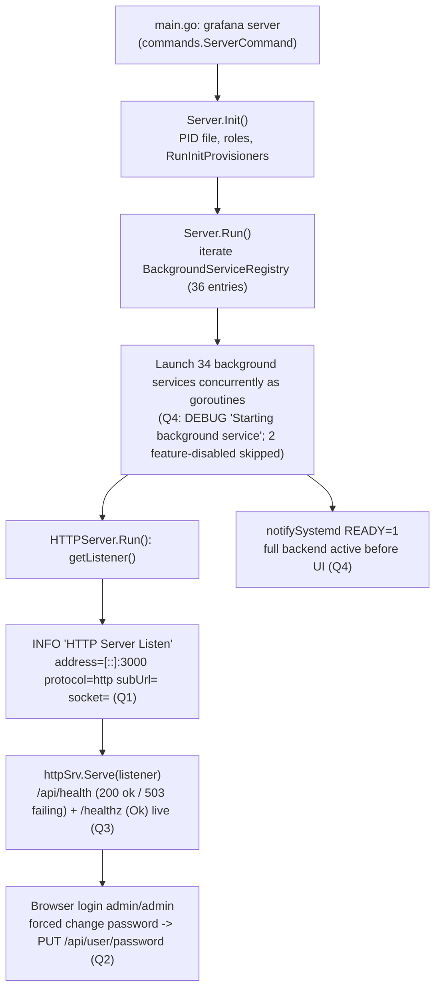

# Grafana Boot Sequence — Onboarding Q&A (commit `4550cfb5b728`)

This document answers four onboarding questions about Grafana's local startup (boot)
sequence. Every answer is written **from real captured runtime output** of a freshly
built Grafana server run in its **default, canonical configuration**, and every factual
claim is grounded in a `file:line` reference that names the specific
function/method/struct doing the work. Statements derived from reading code rather than
from observation are explicitly labelled **(inferred)**.

- **Repository HEAD:** `4550cfb5b72886782d9a3e6cf995f8dbd57ca4ff` (a Grafana **v11.x-era** build).
- **Observed version banner:** `Version 11.5.0-pre (commit: 4550cfb5b7, branch: blitzy-29dfbca5-c37c-4c07-9bac-2d27dcb04523)`
- **Methodology:** run first, then write. The server was built, launched via its real
  entry point (`grafana server`), and probed with `curl` and a headless browser; the
  answers below quote the exact commands and their complete, unedited output.

---

## Table of Contents

1. [Environment & Canonical Runtime](#1-environment--canonical-runtime)
2. [Q1 — The "HTTP Server Listen" Signal](#2-q1--the-http-server-listen-signal)
3. [Q2 — The Forced Default-Admin Action (Password Change)](#3-q2--the-forced-default-admin-action-password-change)
4. [Q3 — `/api/health` Semantics (Healthy 200, Failing 503, `/healthz`)](#4-q3--apihealth-semantics-healthy-200-failing-503-healthz)
5. [Q4 — Background Services at Boot](#5-q4--background-services-at-boot)
6. [Boot-Sequence Diagram](#6-boot-sequence-diagram)
7. [Coverage Check](#7-coverage-check)

---

## 1. Environment & Canonical Runtime

### 1.1 Build

Grafana's build is driven by `build.go` (a `// +build ignore` shim whose `main()` calls
`pkg/build.RunCmd()`), which the `Makefile` wraps in the `build-server` target
(`Makefile:201`) and the composite `build` target (`Makefile:229` → `build-go`
`Makefile:187` + `build-js` `Makefile:211`). The canonical build commands are:

```bash
# Backend (unified `grafana` binary) — Makefile build-server @L201 wraps this:
go run build.go build-server
# Frontend assets served by the running instance — Makefile build-js @L211:
go run build.go build-js      # (equivalently: yarn build)
```

> Note: `make run` (`Makefile:232`) uses the `bra` hot-reload wrapper and is **not** the
> canonical invocation. The canonical entry point is the compiled binary plus the
> `server` subcommand (`pkg/cmd/grafana/main.go` → `commands.ServerCommand(...)`
> `pkg/cmd/grafana/main.go:47`). `grafana-server` is a deprecated stub that re-execs
> `grafana`.

The build produced the binary at `./bin/linux-amd64/grafana`.

### 1.2 Version / commit banner (canonical build)

Command and complete output:

```bash
$ ./bin/linux-amd64/grafana server -v
Version 11.5.0-pre (commit: 4550cfb5b7, branch: blitzy-29dfbca5-c37c-4c07-9bac-2d27dcb04523)
```

The banner string is `Version %s (commit: %s, branch: %s, enterprise-commit: %s)` /
`Version %s (commit: %s, branch: %s)` printed by `RunServer` in
`pkg/cmd/grafana-server/commands/cli.go:49` (with enterprise) / `:51` (without). The
build-info variables (`version`, `commit`, `buildBranch`, `buildstamp`) are declared in
`pkg/cmd/grafana/main.go:17-21` and passed into `commands.ServerCommand(...)` at
`pkg/cmd/grafana/main.go:47`. The `version` fallback constant in source is `9.2.0`
(`pkg/cmd/grafana/main.go:17`), but the canonical build **stamps** it to `11.5.0-pre`
(matching `package.json` `"version": "11.5.0-pre"`), with `commit` and `branch` stamped
from the git checkout. The same version string is echoed in the boot log's first
structured line:

```
logger=settings t=2026-07-13T16:43:18.452282897Z level=info msg="Starting Grafana" version=11.5.0-pre commit=4550cfb5b7 branch=blitzy-29dfbca5-c37c-4c07-9bac-2d27dcb04523 compiled=2024-12-13T14:22:02Z
```

### 1.3 Run (default, canonical configuration)

The primary run used **only** the baked-in `conf/defaults.ini` — no `conf/custom.ini`
was created and **no `GF_*` overrides** were set:

```bash
$ ./bin/linux-amd64/grafana server --homepath "$(pwd)" > /tmp/grafana_boot_info.log 2>&1 &
```

`--homepath` points at the repository root so that `conf/defaults.ini`, `public/`, and
`data/` resolve. The boot log confirms the config source is the default file:

```
logger=settings t=2026-07-13T16:43:18.452561335Z level=info msg="Config loaded from" file=/tmp/blitzy/grafana/blitzy-29dfbca5-c37c-4c07-9bac-2d27dcb04523_509fea/conf/defaults.ini
```

A non-fatal warning is printed first because the container runs as root:
`Grafana server is running with elevated privileges. This is not recommended`. This does
not affect any of the four answers.

### 1.4 Runtime-value table

| Property | Observed value | Source |
|---|---|---|
| Entry point | `grafana server` | `pkg/cmd/grafana/main.go:47` (`commands.ServerCommand`) |
| Canonical build | `go run build.go build-server` | `Makefile:201` (`build-server`) |
| Binary path | `./bin/linux-amd64/grafana` | build output |
| Version | `11.5.0-pre` | banner; `package.json` `version`; `pkg/cmd/grafana/main.go:17` |
| Commit / branch | `4550cfb5b7` / `blitzy-29dfbca5-…` | banner (git-stamped) |
| Config source | `conf/defaults.ini` (no `custom.ini`, no `GF_*`) | boot log "Config loaded from" |
| Protocol | `http` | `conf/defaults.ini:32` (`protocol = http`) |
| HTTP port | `3000` | `conf/defaults.ini:41` (`http_port = 3000`) |
| Bind address (resolved) | `[::]:3000` | boot log "HTTP Server Listen" |
| Database | SQLite at `data/grafana.db` | `conf/defaults.ini:123` (`type = sqlite3`) |
| Log level | `info` | `conf/defaults.ini:1074` (`level = info`) |

---

## 2. Q1 — The "HTTP Server Listen" Signal

### 2.1 Direct answer

The log line that signals the HTTP server has begun **listening** is the structured
**INFO** line **`"HTTP Server Listen"`**. It is emitted inside
**`func (hs *HTTPServer) Run(ctx context.Context) error`** at
**`pkg/api/http_server.go:434-435`**, by the logger **`log.New("http.server")`**
(`pkg/api/http_server.go:323`). It is logged immediately after `hs.getListener()`
(`pkg/api/http_server.go:429`; `getListener` defined at `pkg/api/http_server.go:476`)
returns a bound listener and just before the serve `switch` at
`pkg/api/http_server.go:450` begins accepting connections.

It reveals **where and how the server is exposed** through four key/value fields:
**`address`** (the resolved bind address + port), **`protocol`** (HTTP vs HTTPS vs
socket), **`subUrl`** (the path prefix / sub-path the app is mounted under), and
**`socket`** (the UNIX socket path, when the socket protocol is used). On the default
run this is: bound to **all interfaces on port 3000**, plain **HTTP**, **no** sub-path,
and **no** UNIX socket.

### 2.2 Observed output

Command and complete, unedited line (from the primary default-config boot):

```bash
$ grep -F "HTTP Server Listen" /tmp/grafana_boot_info.log
logger=http.server t=2026-07-13T16:43:20.299939796Z level=info msg="HTTP Server Listen" address=[::]:3000 protocol=http subUrl= socket=
```

### 2.3 The source line (verbatim)

```go
// pkg/api/http_server.go:434-435, inside func (hs *HTTPServer) Run(ctx context.Context) error
hs.log.Info("HTTP Server Listen", "address", listener.Addr().String(), "protocol",
    hs.Cfg.Protocol, "subUrl", hs.Cfg.AppSubURL, "socket", hs.Cfg.SocketPath)
```

### 2.4 Field-by-field explanation

| Field | Observed value | Meaning / source | Default config key |
|---|---|---|---|
| `address` | `[::]:3000` | The **resolved** listener address, `listener.Addr().String()` (`pkg/api/http_server.go:434`) — **not** the raw configured value. `[::]` is the IPv6 unspecified address, i.e. **all interfaces**; `:3000` is the port. | `http_port = 3000` (`conf/defaults.ini:41`); empty `http_addr` means all interfaces |
| `protocol` | `http` | `hs.Cfg.Protocol` (`pkg/api/http_server.go:434`). Plain HTTP. | `protocol = http` (`conf/defaults.ini:32`) |
| `subUrl` | *(empty)* | `hs.Cfg.AppSubURL` (`pkg/api/http_server.go:435`) — the path prefix derived from `root_url`. The default `root_url` has no sub-path, so this is empty (app served at `/`). | `root_url = %(protocol)s://%(domain)s:%(http_port)s/` (`conf/defaults.ini:51`), `domain = localhost` (`conf/defaults.ini:44`) |
| `socket` | *(empty)* | `hs.Cfg.SocketPath` (`pkg/api/http_server.go:435`) — used only when `protocol = socket`. Empty by default. | `protocol = http` (not `socket`) (`conf/defaults.ini:32`) |

### 2.5 Nuance

- **`address` is the resolved address, not the configured one.** The code logs
  `listener.Addr().String()` — the address the OS actually bound — so it reflects what is
  truly reachable. On this default run that is `[::]:3000` (all interfaces, port 3000).
- **How the listener is served** is decided by the `switch hs.Cfg.Protocol` block that
  immediately follows (`pkg/api/http_server.go:450`): for `HTTPScheme`/`SocketScheme` it
  calls `hs.httpSrv.Serve(listener)`; for `HTTP2Scheme`/`HTTPSScheme` it calls
  `hs.httpSrv.ServeTLS(...)`. The default `http` takes the plain `Serve` branch.
- **Stability:** the four field values were identical across all three boots performed
  (`address=[::]:3000 protocol=http subUrl= socket=`); only the timestamp differed.


---

## 3. Q2 — The Forced Default-Admin Action (Password Change)

### 3.1 Direct answer

After signing in with the default administrator credentials (`admin` / `admin`), Grafana
immediately forces a **password change** before the user can proceed. The **internal
state being finalized** is the user's **persisted new password hash**, written by the
backend handler
**`func (hs *HTTPServer) ChangeUserPassword(c *contextmodel.ReqContext) response.Response`**
at **`pkg/api/user.go:546-566`**, which calls **`hs.userService.Update(...)`** with the
new and old passwords at **`pkg/api/user.go:561`** and returns
`response.Success("User password changed")` at `pkg/api/user.go:565`.

**Critical nuance:** the "force change password" decision is **entirely client-side** —
there is no server-side "must change password" flag. After a successful `POST /login`,
the front-end login controller checks whether the submitted password equals the literal
default `admin`; only then does it switch to the change-password view.

### 3.2 Observed output — the forced change-password screen (browser)

Driving the real front-end (`http://localhost:3000/login`) with `admin` / `admin` and
clicking **Log in** switched the page to the change-password view **without navigating
away from `/login`** (a client-side view switch). The exact rendered DOM was extracted
live with `evaluate_script`:

```json
{
  "url": "http://localhost:3000/login",
  "heading": "Update your password",
  "alertText": "Continuing to use the default password exposes you to security risks.",
  "buttons": ["Submit", "Skip"],
  "fieldLabels": ["New password", "Confirm new password"]
}
```

The observed Alert title — **"Continuing to use the default password exposes you to
security risks."** — matches the component source **byte-for-byte**:

```tsx
// public/app/core/components/ForgottenPassword/ChangePassword.tsx:52-53
{showDefaultPasswordWarning && (
  <Alert severity="info" title="Continuing to use the default password exposes you to security risks." />
)}
```

### 3.3 Observed output — the network flow (curl)

The change is submitted as `PUT /api/user/password`. Captured with full request payloads
and complete responses:

```bash
$ curl -i -s -c /tmp/cookies.txt -H 'Content-Type: application/json' \
    -d '{"user":"admin","password":"admin"}' http://localhost:3000/login
HTTP/1.1 200 OK
Cache-Control: no-store
Content-Type: application/json
Set-Cookie: grafana_session=ba4f0303ca7ef8f05e60a016ad88ae18; Path=/; Max-Age=2592000; HttpOnly; SameSite=Lax
Set-Cookie: grafana_session_expiry=1783962157; Path=/; Max-Age=2592000; SameSite=Lax
X-Content-Type-Options: nosniff
X-Frame-Options: deny
X-Xss-Protection: 1; mode=block
Date: Mon, 13 Jul 2026 16:52:42 GMT
Content-Length: 41

{"message":"Logged in","redirectUrl":"/"}
```

```bash
$ curl -i -s -b /tmp/cookies.txt -X PUT -H 'Content-Type: application/json' \
    -d '{"oldPassword":"admin","newPassword":"newAdminPass123","confirmNew":"newAdminPass123"}' \
    http://localhost:3000/api/user/password
HTTP/1.1 200 OK
Cache-Control: no-store
Content-Type: application/json
X-Content-Type-Options: nosniff
X-Frame-Options: deny
X-Xss-Protection: 1; mode=block
Date: Mon, 13 Jul 2026 16:52:42 GMT
Content-Length: 35

{"message":"User password changed"}
```

The body `{"message":"User password changed"}` is exactly the envelope produced by
`response.Success("User password changed")` (`pkg/api/user.go:565`).

### 3.4 Before / after — proof the new hash is finalized

```bash
# OLD password no longer authenticates:
$ curl -i -s -H 'Content-Type: application/json' \
    -d '{"user":"admin","password":"admin"}' http://localhost:3000/login
HTTP/1.1 401 Unauthorized
...
{"statusCode":401,"messageId":"password-auth.failed","message":"Invalid username or password"}

# NEW password authenticates:
$ curl -i -s -H 'Content-Type: application/json' \
    -d '{"user":"admin","password":"newAdminPass123"}' http://localhost:3000/login
HTTP/1.1 200 OK
...
{"message":"Logged in","redirectUrl":"/"}
```

The old credential flips from `200` to `401 password-auth.failed` and the new one now
returns `200`, confirming the finalized state is the **persisted new password hash**.

### 3.5 Client-side trigger and the finalized backend state (`file:line`)

Front-end trace (`public/app/core/components/Login/LoginCtrl.tsx`):

```ts
// login = (formModel) => {...}  @L107 issues POST /login @L113-114; on success:
if (formModel.password !== 'admin' || config.ldapEnabled || config.authProxyEnabled) {  // L117
  this.toGrafana();                                                                       // L118
  return;
} else {
  this.changeView(formModel.password === 'admin');                                        // L121
}
```

- `changePassword = (password) => {...}` (`LoginCtrl.tsx:78`) builds
  `{ newPassword, confirmNew, oldPassword: 'admin' }` (`LoginCtrl.tsx:79-83`) and, in the
  non-reset branch, submits `getBackendSrv().put('/api/user/password', pw)`
  (`LoginCtrl.tsx:98-99`); on success it calls `toGrafana()` (`LoginCtrl.tsx:101`, defined
  `:183`).
- `public/app/core/components/Login/LoginPage.tsx:84` renders the form only when
  `isChangingPassword && !config.auth.passwordlessEnabled`:
  `<ChangePassword showDefaultPasswordWarning=… onSubmit={changePassword} onSkip={() => skipPasswordChange()} />`.
- The route is registered at `pkg/api/api.go:277`:
  `userRoute.Put("/password", routing.Wrap(hs.ChangeUserPassword))`.

Backend handler (`pkg/api/user.go:546-566`) — the persisted state:

```go
func (hs *HTTPServer) ChangeUserPassword(c *contextmodel.ReqContext) response.Response {
	form := user.ChangeUserPasswordCommand{}
	if err := web.Bind(c.Req, &form); err != nil {
		return response.Error(http.StatusBadRequest, "bad request data", err)
	}
	userID, errResponse := getUserID(c)
	if errResponse != nil {
		return errResponse
	}
	if response := hs.errOnExternalUser(c.Req.Context(), userID); response != nil {
		return response
	}
	if err := hs.userService.Update(c.Req.Context(), &user.UpdateUserCommand{UserID: userID, Password: &form.NewPassword, OldPassword: &form.OldPassword}); err != nil {
		return response.ErrOrFallback(http.StatusInternalServerError, "Failed to change user password", err)
	}
	return response.Success("User password changed")
}
```

The finalized state is the new password hash written by `userService.Update`
(`pkg/api/user.go:561`). Note (code-grounded): this handler does **not** revoke tokens or
reset login attempts — it only updates the password. The relevant defaults are
`admin_user = admin` (`conf/defaults.ini:328`), `admin_password = admin`
(`conf/defaults.ini:331`), and `disable_initial_admin_creation = false`
(`conf/defaults.ini:325`).

### 3.6 Edge / skip path (exercised)

Because the trigger is client-side, logging in with a **non-default** password bypasses
the prompt entirely. After changing the password, logging in with the new password in the
browser navigated **straight into Grafana** (home dashboard), with **no** change-password
screen:

```
# After logout + login as admin / newAdminPass123, the browser landed on:
http://localhost:3000/?orgId=1&from=now-6h&to=now&timezone=browser
# Full authenticated app rendered (Home, Dashboards, Explore, Alerting, Connections,
# Administration nav + "Welcome to Grafana" getting-started panel). No "Update your
# password" screen.
```

This matches the `formModel.password !== 'admin'` branch (`LoginCtrl.tsx:117-118`) that
calls `toGrafana()` immediately. The server's `POST /login` response is identical for
default and non-default passwords (`{"message":"Logged in","redirectUrl":"/"}`), which
confirms the differentiation is purely client-side. The **LDAP / auth-proxy** conditions
in the same check (`config.ldapEnabled || config.authProxyEnabled`, `LoginCtrl.tsx:117`)
likewise skip the prompt; these are gated by config that is off in the default run, so
that specific branch is **(inferred)** from the code rather than toggled at runtime.


---

## 4. Q3 — `/api/health` Semantics (Healthy 200, Failing 503, `/healthz`)

### 4.1 Direct answer

A **healthy** `/api/health` returns **HTTP 200** with
`Content-Type: application/json; charset=UTF-8` and a two-space-indented JSON body whose
**`"database"`** field is **`"ok"`**. The endpoint is served by
**`func (hs *HTTPServer) apiHealthHandler(ctx *web.Context)`**
(`pkg/api/http_server.go:710-745`) and returns a **`healthResponse` struct**
(`pkg/api/http_server.go:694-699`). The **`"database"`** value reports **database
readiness**: it is derived from **`func (hs *HTTPServer) databaseHealthy(ctx context.Context) bool`**
(`pkg/api/health.go:10-25`), which executes a trivial **`session.Exec("SELECT 1")`**
(`pkg/api/health.go:18`) against the configured database and **caches** the result for
**5 seconds** (`hs.CacheService.Set(cacheKey, healthy, time.Second*5)`,
`pkg/api/health.go:23`). In short, `"database"` reports only that a trivial `SELECT 1`
round-trip to the configured DB (default SQLite `data/grafana.db`,
`conf/defaults.ini:123`) **succeeded within the last 5 seconds** — not deep schema/data
integrity.

### 4.2 Observed output — healthy 200 (primary)

Command and complete, unedited response:

```bash
$ curl -i http://localhost:3000/api/health
HTTP/1.1 200 OK
Cache-Control: no-store
Content-Type: application/json; charset=UTF-8
X-Content-Type-Options: nosniff
X-Frame-Options: deny
X-Xss-Protection: 1; mode=block
Date: Mon, 13 Jul 2026 16:45:26 GMT
Content-Length: 75

{
  "database": "ok",
  "version": "11.5.0-pre",
  "commit": "4550cfb5b7"
}
```

The 75-byte body was verified **byte-for-byte** with `od -c` (two-space indent, `\n`
newlines, and **no** trailing newline after `}`):

```bash
$ curl -s http://localhost:3000/api/health | od -c
0000000   {  \n           "   d   a   t   a   b   a   s   e   "   :
0000020   "   o   k   "   ,  \n           "   v   e   r   s   i   o   n
0000040   "   :       "   1   1   .   5   .   0   -   p   r   e   "   ,
0000060  \n           "   c   o   m   m   i   t   "   :       "   4   5
0000100   5   0   c   f   b   5   b   7   "  \n   }
0000113
```

### 4.3 The response struct and handler (`file:line`)

```go
// pkg/api/http_server.go:694-699
// swagger:model healthResponse
type healthResponse struct {
	Database         string `json:"database"`
	Version          string `json:"version,omitempty"`
	Commit           string `json:"commit,omitempty"`
	EnterpriseCommit string `json:"enterpriseCommit,omitempty"`
}
```

- **Field order matters** for the byte-exact body: `database`, then `version`, then
  `commit`. `version`/`commit` are populated only when `!hs.Cfg.Anonymous.HideVersion`
  (`pkg/api/http_server.go:719-725`); they appear here because version-hiding is off by
  default. `enterpriseCommit` is **omitted** in the observed body because it is empty in
  this OSS build (`omitempty`).
- The body is serialized with `json.MarshalIndent(data, "", "  ")`
  (`pkg/api/http_server.go:736`) — hence the two-space indentation.
- The healthy/failing branching sets the status and `"database"` value:

```go
// pkg/api/http_server.go:727-734, inside apiHealthHandler
if !hs.databaseHealthy(ctx.Req.Context()) {
	data.Database = "failing"
	ctx.Resp.Header().Set("Content-Type", "application/json; charset=UTF-8")
	ctx.Resp.WriteHeader(http.StatusServiceUnavailable)
} else {
	ctx.Resp.Header().Set("Content-Type", "application/json; charset=UTF-8")
	ctx.Resp.WriteHeader(http.StatusOK)
}
```

- The readiness probe itself (`pkg/api/health.go:10-25`):

```go
func (hs *HTTPServer) databaseHealthy(ctx context.Context) bool {
	const cacheKey = "db-healthy"
	if cached, found := hs.CacheService.Get(cacheKey); found {
		return cached.(bool)
	}
	err := hs.SQLStore.WithDbSession(ctx, func(session *db.Session) error {
		_, err := session.Exec("SELECT 1")
		return err
	})
	healthy := err == nil
	hs.CacheService.Set(cacheKey, healthy, time.Second*5)
	return healthy
}
```

Both `/api/health` and `/healthz` are attached as **middleware** ahead of the regular
route tree: `m.Use(hs.healthzHandler)` then `m.Use(hs.apiHealthHandler)`
(`pkg/api/http_server.go:633-634`).

### 4.4 Observed output — `/healthz` contrast (liveness)

```bash
$ curl -i http://localhost:3000/healthz
HTTP/1.1 200 OK
Cache-Control: no-store
X-Content-Type-Options: nosniff
X-Frame-Options: deny
X-Xss-Protection: 1; mode=block
Date: Mon, 13 Jul 2026 16:45:26 GMT
Content-Length: 2
Content-Type: text/plain; charset=utf-8

Ok
```

`/healthz` returns the plain-text bytes **`Ok`** (2 bytes; verified `O k` via `od -c`)
with HTTP 200. It is served by `func (hs *HTTPServer) healthzHandler(ctx *web.Context)`
(`pkg/api/http_server.go:681-691`), which writes `[]byte("Ok")` at
`pkg/api/http_server.go:688`. The `Content-Type: text/plain` header is auto-detected by
Go's `http` package (the handler does not set it). **Difference:** `/healthz` is a pure
**liveness** check (is the web server up? — **no DB access**), whereas `/api/health` is a
DB-aware **readiness** check.

### 4.5 Observed output — failing 503 edge (before / intermediate / after)

The failing path was exercised through the **real** `apiHealthHandler → databaseHealthy →
SELECT 1` code path. To make a transient DB-open failure observable on SQLite, a
**clearly-labelled secondary instance** was used (port 3001, SQLite type **unchanged**),
with only the connection-pool timing tuned so a broken DB file forces a fresh open:
`GF_DATABASE_CONN_MAX_LIFETIME=1` and `GF_DATABASE_MAX_IDLE_CONN=0` (the default
`conn_max_lifetime = 14400`, `conf/defaults.ini`, otherwise keeps the original connection
alive and `SELECT 1` — a constant expression — never fails). This secondary run is **not**
the canonical primary run; it is an intentional edge configuration. The failure was
induced by replacing the DB file with a directory so a reconnect cannot open it.

```bash
# BEFORE (healthy):
$ curl -s http://localhost:3001/api/health   # -> HTTP 200, {"database":"ok",...}, Content-Length 75

# INTERMEDIATE (DB unreachable):
$ curl -i http://localhost:3001/api/health
HTTP/1.1 503 Service Unavailable
Cache-Control: no-store
Content-Type: application/json; charset=UTF-8
X-Content-Type-Options: nosniff
X-Frame-Options: deny
X-Xss-Protection: 1; mode=block
Date: Mon, 13 Jul 2026 16:49:46 GMT
Content-Length: 80

{
  "database": "failing",
  "version": "11.5.0-pre",
  "commit": "4550cfb5b7"
}

# AFTER (recovered): removing the directory let a fresh SQLite DB open again:
$ curl -s http://localhost:3001/api/health   # -> HTTP 200, {"database":"ok",...}
```

The secondary instance's own error log corroborates the genuine DB failure that drove
`databaseHealthy()` to `false`:

```
logger=sql-resource-server level=error msg="get the latest resource version" err="begin: unable to open database file: is a directory"
```

Observations: on failure the status is **`503 Service Unavailable`**, `"database"` becomes
**`"failing"`**, the body grows to **80 bytes** (the word `failing` is 5 characters longer
than `ok`), and the `Content-Type: application/json; charset=UTF-8` header is present on
**both** 200 and 503 (set at `pkg/api/http_server.go:729`/`:732`).

### 4.6 Runtime-value table

| Endpoint | Method | Status | Content-Type | Body | Source `file:line` |
|---|---|---|---|---|---|
| `/api/health` (healthy) | GET | `200 OK` | `application/json; charset=UTF-8` | `{ "database": "ok", "version": "11.5.0-pre", "commit": "4550cfb5b7" }` (75 B) | `apiHealthHandler` `pkg/api/http_server.go:710-745`; struct `:694-699` |
| `/api/health` (failing) | GET | `503 Service Unavailable` | `application/json; charset=UTF-8` | `{ "database": "failing", "version": "11.5.0-pre", "commit": "4550cfb5b7" }` (80 B) | failing branch `pkg/api/http_server.go:727-730`; probe `pkg/api/health.go:10-25` |
| `/healthz` | GET | `200 OK` | `text/plain; charset=utf-8` (auto) | `Ok` (2 B) | `healthzHandler` `pkg/api/http_server.go:681-691` (writes `:688`) |


---

## 5. Q4 — Background Services at Boot

### 5.1 Direct answer

During boot, Grafana launches its background services **concurrently as goroutines** from
**`func (s *Server) Run() error`** (`pkg/server/server.go:139`), iterating the list
assembled by the **background-service registry**
(`pkg/registry/backgroundsvcs/background_services.go`, `ProvideBackgroundServiceRegistry`
`:53` → `NewBackgroundServiceRegistry(...)` call `:80`, definition `:125`). The registry
run-list contains **36 services** (`background_services.go:81-116`); in the default run
**34** of them actually start — the other **2** are feature-disabled and skipped.

By the time the HTTP server is listening (Q1), **essentially the entire backend is already
running**: alerting (ngalert), provisioning, live, plugins, secrets, cleanup, token
service, usage stats, storage, the apiserver, and so on. The "UI" that appears afterward
is **not a separate service** — it is just static assets (`public/build`) served by the
already-running HTTP server.

### 5.2 The default (info) boot shows per-service init lines, not a generic start line

At the default `level = info` (`conf/defaults.ini:1074`), the generic per-service line is
**hidden**. Proof: the info-level boot log contained **0** `level=debug` lines. Instead,
each service logs its **own** init INFO lines. Representative captured lines (timestamps
elided for width; each is a real, unedited `msg=` value):

```bash
$ grep -viP 'logger=(migrator|resource-migrator)' /tmp/grafana_boot_info.log \
    | grep -iP 'msg="(Starting|initializ|registered|Update check|Storage starting|Live Push|Patterns update|provision)'
logger=live.push_http   level=info msg="Live Push Gateway initialization"
logger=secrets          level=info msg="Envelope encryption state" enabled=true currentprovider=secretKey.v1
logger=ngalert.multiorg.alertmanager level=info msg="Starting MultiOrg Alertmanager"
logger=ngalert.scheduler level=info msg="Starting scheduler" tickInterval=10s maxAttempts=3
logger=provisioning.alerting  level=info msg="starting to provision alerting"
logger=provisioning.dashboard level=info msg="starting to provision dashboards"
logger=grafanaStorageLogger level=info msg="Storage starting"
logger=plugins.update.checker level=info msg="Update check succeeded" duration=31.995698ms
logger=grafana.update.checker level=info msg="Update check succeeded" duration=36.834737ms
logger=plugin.angulardetectorsprovider.dynamic level=info msg="Patterns update finished" duration=53.317692ms
logger=infra.usagestats.collector level=info msg="registering usage stat providers" usageStatsProvidersLen=2
logger=grafana-apiserver level=info msg="Adding GroupVersion playlist.grafana.app v0alpha1 to ResourceManager"
logger=app-registry     level=info msg="app registry initialized"
logger=plugin.store     level=info msg="Loading plugins..."
```

These info lines **hint at** the components behind the run-list: `live.push_http` →
`pushGateway`; `secrets` → `secretsService`; `ngalert.*` → `ng`/AlertNG; `provisioning.*`
→ `provisioning`; `grafanaStorageLogger` → `StorageService`; the two update checkers →
`grafanaUpdateChecker`/`pluginsUpdateChecker`; `plugin.angulardetectorsprovider.dynamic` →
`dynamicAngularDetectorsProvider`; `infra.usagestats.collector` →
`usageStats`/`statsCollector`; `grafana-apiserver` → `grafanaAPIServer`; `app-registry` →
`appRegistry`; `plugin.store` → `pluginStore`; `http.server` → `httpServer`. (One
non-fatal line also appears: `logger=renderer.manager level=error msg="Failed to get
renderer plugin sources" error="failed to open plugins path"` — the `rendering` service
runs, but the external renderer plugin is not installed.)

### 5.3 The generic DEBUG start line reveals the exact launched set

Re-running via the real entry point at debug level surfaces the generic line
`s.log.Debug("Starting background service", "service", serviceName)`
(`pkg/server/server.go:162`, logger `log.New("server")` `pkg/server/server.go:74`), where
`serviceName = reflect.TypeOf(service).String()` (`pkg/server/server.go:155`):

```bash
$ GF_LOG_LEVEL=debug ./bin/linux-amd64/grafana server --homepath "$(pwd)" > /tmp/grafana_boot_debug.log 2>&1 &
$ grep -F "Starting background service" /tmp/grafana_boot_debug.log
logger=server level=debug msg="Starting background service" service=*appregistry.Service
logger=server level=debug msg="Starting background service" service=*remotecache.RemoteCache
logger=server level=debug msg="Starting background service" service=*dynamic.KeyRetriever
logger=server level=debug msg="Starting background service" service=*metric.Service
logger=server level=debug msg="Starting background service" service=*apiserver.service
logger=server level=debug msg="Starting background service" service=*rendering.RenderingService
logger=server level=debug msg="Starting background service" service=*pluginexternal.Service
logger=server level=debug msg="Starting background service" service=*manager.ServiceAccountsService
logger=server level=debug msg="Starting background service" service=*anonimpl.AnonDeviceService
logger=server level=debug msg="Starting background service" service=*acimpl.Service
logger=server level=debug msg="Starting background service" service=*ssosettingsimpl.Service
logger=server level=debug msg="Starting background service" service=*store.dummyEntityEventsService
logger=server level=debug msg="Starting background service" service=*plugininstaller.Service
logger=server level=debug msg="Starting background service" service=*store.standardStorageService
logger=server level=debug msg="Starting background service" service=*live.GrafanaLive
logger=server level=debug msg="Starting background service" service=*supportbundlesimpl.Service
logger=server level=debug msg="Starting background service" service=*api.HTTPServer
logger=server level=debug msg="Starting background service" service=*cleanup.CleanUpService
logger=server level=debug msg="Starting background service" service=*loginattemptimpl.Service
logger=server level=debug msg="Starting background service" service=*authimpl.UserAuthTokenService
logger=server level=debug msg="Starting background service" service=*manager.SecretsService
logger=server level=debug msg="Starting background service" service=*migrations.SecretMigrationProviderImpl
logger=server level=debug msg="Starting background service" service=*statscollector.Service
logger=server level=debug msg="Starting background service" service=*tracing.TracingService
logger=server level=debug msg="Starting background service" service=*updatechecker.GrafanaService
logger=server level=debug msg="Starting background service" service=*angulardetectorsprovider.Dynamic
logger=server level=debug msg="Starting background service" service=*pushhttp.Gateway
logger=server level=debug msg="Starting background service" service=*updatechecker.PluginsService
logger=server level=debug msg="Starting background service" service=*ngalert.AlertNG
logger=server level=debug msg="Starting background service" service=*metrics.InternalMetricsService
logger=server level=debug msg="Starting background service" service=*pluginstore.Service
logger=server level=debug msg="Starting background service" service=*provisioning.ProvisioningServiceImpl
logger=server level=debug msg="Starting background service" service=*service.UsageStats
logger=server level=debug msg="Starting background service" service=*notifications.NotificationService

$ grep -cF "Starting background service" /tmp/grafana_boot_debug.log
34
```

The debug boot emitted **1139** `level=debug` lines (vs **0** at info), directly
confirming why the generic start line is invisible in a default boot.

### 5.4 Reconciliation — 36 registry entries − 2 feature-disabled = 34 observed

The registry run-list (`background_services.go:81-116`) names 36 services. The table below
maps each **observed** `service=` reflect type to its registry name; the final two rows are
the registry entries that did **not** start.

| # | Registry name | Observed `service=` reflect type | Started? |
|---|---|---|---|
| 1 | `httpServer` | `*api.HTTPServer` | ✅ |
| 2 | `ng` | `*ngalert.AlertNG` | ✅ |
| 3 | `cleanup` | `*cleanup.CleanUpService` | ✅ |
| 4 | `live` | `*live.GrafanaLive` | ✅ |
| 5 | `pushGateway` | `*pushhttp.Gateway` | ✅ |
| 6 | `notifications` | `*notifications.NotificationService` | ✅ |
| 7 | `rendering` | `*rendering.RenderingService` | ✅ |
| 8 | `tokenService` | `*authimpl.UserAuthTokenService` | ✅ |
| 9 | `provisioning` | `*provisioning.ProvisioningServiceImpl` | ✅ |
| 10 | `grafanaUpdateChecker` | `*updatechecker.GrafanaService` | ✅ |
| 11 | `pluginsUpdateChecker` | `*updatechecker.PluginsService` | ✅ |
| 12 | `metrics` | `*metrics.InternalMetricsService` | ✅ |
| 13 | `usageStats` | `*service.UsageStats` | ✅ |
| 14 | `statsCollector` | `*statscollector.Service` | ✅ |
| 15 | `tracing` | `*tracing.TracingService` | ✅ |
| 16 | `remoteCache` | `*remotecache.RemoteCache` | ✅ |
| 17 | `secretsService` | `*manager.SecretsService` | ✅ |
| 18 | `StorageService` | `*store.standardStorageService` | ✅ |
| 19 | `entityEventsService` | `*store.dummyEntityEventsService` | ✅ |
| 20 | `saService` | `*manager.ServiceAccountsService` | ✅ |
| 21 | `pluginStore` | `*pluginstore.Service` | ✅ |
| 22 | `secretMigrationProvider` | `*migrations.SecretMigrationProviderImpl` | ✅ |
| 23 | `loginAttemptService` | `*loginattemptimpl.Service` | ✅ |
| 24 | `bundleService` | `*supportbundlesimpl.Service` | ✅ |
| 25 | `publicDashboardsMetric` | `*metric.Service` | ✅ |
| 26 | `keyRetriever` | `*dynamic.KeyRetriever` | ✅ |
| 27 | `dynamicAngularDetectorsProvider` | `*angulardetectorsprovider.Dynamic` | ✅ |
| 28 | `grafanaAPIServer` | `*apiserver.service` | ✅ |
| 29 | `anon` | `*anonimpl.AnonDeviceService` | ✅ |
| 30 | `ssoSettings` | `*ssosettingsimpl.Service` | ✅ |
| 31 | `pluginExternal` | `*pluginexternal.Service` | ✅ |
| 32 | `pluginInstaller` | `*plugininstaller.Service` | ✅ |
| 33 | `accessControl` | `*acimpl.Service` | ✅ |
| 34 | `appRegistry` | `*appregistry.Service` | ✅ |
| 35 | `searchService` | *(not started)* | ❌ disabled |
| 36 | `grpcServerProvider` | *(not started)* | ❌ disabled |

The two that do not start are skipped by `registry.IsDisabled(svc)`
(`pkg/server/server.go:150` → `pkg/registry/registry.go:53-55`: a service implementing the
`CanBeDisabled` interface whose `IsDisabled()` returns `true` is `continue`d and never
logs). Both are feature-gated **off** by default:

- `searchService` (`searchV2.SearchService`): `IsDisabled()` returns
  `!features.IsEnabledGlobally(FlagPanelTitleSearch)` (`pkg/services/searchV2/service.go:120`).
- `grpcServerProvider` (`grpcserver.Provider`): `IsDisabled()` returns `!s.enabled`, where
  `enabled = features.IsEnabledGlobally(FlagGrpcServer)`
  (`pkg/services/grpcserver/service.go:136-137`, `:49`).

The `_`-named parameters in the registry constructor (`background_services.go:72-78`) are
injected for **initialization side-effects only** and are **not** part of the run-list.

### 5.5 How much is active before the UI appears (readiness)

`Server.Init()` (`pkg/server/server.go:113-135`) runs **first and synchronously**: it
writes the PID file (`:122`), sets environment metrics (`:126`), registers fixed roles
(`:130`), and runs init provisioners (`:134`). Then `Server.Run()` dispatches every enabled
service **concurrently** as a goroutine via `s.childRoutines.Go(...)`
(`pkg/server/server.go:156`). The observed debug timestamps show all 34 "Starting
background service" lines and the "HTTP Server Listen" line occurring within roughly **5
milliseconds** of each other (e.g., `16:54:59.4959xx` → `16:54:59.5005xx`), confirming the
concurrent dispatch. The HTTP server is **itself** one of the background services
(`*api.HTTPServer`), so its listen line fires from within its own goroutine.

After the dispatch loop, `s.notifySystemd("READY=1")` is signalled
(`pkg/server/server.go:176`) and the process then blocks on
`s.childRoutines.Wait()` (`pkg/server/server.go:179`), preceded by the observed
`logger=server level=debug msg="Waiting on services..."` line (`pkg/server/server.go:178`).

**Conclusion:** the READY boundary is the point at which all 34 background services have
been dispatched and are running. Because the HTTP server is one of them, the moment the UI
is reachable, the full backend — alerting, provisioning, live, plugins, secrets, tokens,
usage stats, storage, apiserver, etc. — is already active. The UI itself is not a service;
it is static frontend assets served by that same HTTP server.


---

## 6. Boot-Sequence Diagram

The diagram situates the four observation targets within Grafana's boot sequence.



---

## 7. Coverage Check

Every named item across the four questions, with its observed value, `file:line`, and the
evidence section that captures it.

### Q1 — HTTP Server Listen

| Item | Value / evidence | `file:line` |
|---|---|---|
| The signalling line | `msg="HTTP Server Listen"` (INFO) — §2.2 | `pkg/api/http_server.go:434-435` |
| Logger | `http.server` | `pkg/api/http_server.go:323` |
| Emitting method | `HTTPServer.Run` | `pkg/api/http_server.go:400` |
| `address` | `[::]:3000` (resolved `listener.Addr()`) | `pkg/api/http_server.go:434`; port `conf/defaults.ini:41` |
| `protocol` | `http` | `pkg/api/http_server.go:434`; `conf/defaults.ini:32` |
| `subUrl` | *(empty)* | `pkg/api/http_server.go:435`; `conf/defaults.ini:51`, `:44` |
| `socket` | *(empty)* | `pkg/api/http_server.go:435`; `conf/defaults.ini:32` |
| Serve switch (how served) | plain HTTP `Serve` branch | `pkg/api/http_server.go:450` |

### Q2 — Forced password change

| Item | Value / evidence | `file:line` |
|---|---|---|
| Forced action | password change (client-side triggered) — §3.2 | `LoginCtrl.tsx:117-121` |
| Login POST | `POST /login` → `{"message":"Logged in","redirectUrl":"/"}` — §3.3 | `LoginCtrl.tsx:113-114` |
| Trigger check | `formModel.password !== 'admin' \|\| ldapEnabled \|\| authProxyEnabled` | `LoginCtrl.tsx:117` |
| `changeView` | switches to change-password view | `LoginCtrl.tsx:121` (def `:176`) |
| `changePassword` → PUT | `getBackendSrv().put('/api/user/password', pw)` | `LoginCtrl.tsx:78`, `:98-99` |
| `oldPassword: 'admin'` | in the PUT payload | `LoginCtrl.tsx:82` |
| LoginPage render | `<ChangePassword …>` when `isChangingPassword` | `LoginPage.tsx:84-92` |
| Alert (exact text) | "Continuing to use the default password exposes you to security risks." — §3.2 | `ChangePassword.tsx:52-53` |
| Backend handler | `ChangeUserPassword` → `{"message":"User password changed"}` — §3.3 | `pkg/api/user.go:546-566` |
| Finalized state | persisted new hash via `userService.Update` | `pkg/api/user.go:561` |
| No token revoke / attempt reset | handler only updates password (code-grounded) | `pkg/api/user.go:546-566` |
| Route | `userRoute.Put("/password", routing.Wrap(hs.ChangeUserPassword))` | `pkg/api/api.go:277` |
| Defaults | `admin_user=admin`, `admin_password=admin`, `disable_initial_admin_creation=false` | `conf/defaults.ini:328`, `:331`, `:325` |
| Before/after | old → `401 password-auth.failed`, new → `200` — §3.4 | observed |
| Skip path (non-default pw) | login → straight to home, no prompt — §3.6 | `LoginCtrl.tsx:117-118` |
| Skip path (LDAP / auth-proxy) | also skips **(inferred)**; config off by default | `LoginCtrl.tsx:117` |

### Q3 — `/api/health`

| Item | Value / evidence | `file:line` |
|---|---|---|
| Healthy status/body | `200`, `{"database":"ok","version":"11.5.0-pre","commit":"4550cfb5b7"}` (75 B) — §4.2 | `pkg/api/http_server.go:710-745` |
| `healthResponse` struct | field order database/version/commit/enterpriseCommit | `pkg/api/http_server.go:694-699` |
| `apiHealthHandler` | serves `/api/health` | `pkg/api/http_server.go:710-745` |
| `"database"` derivation | `databaseHealthy()` → `SELECT 1` | `pkg/api/health.go:10-25`, `:18` |
| 5-second cache | `CacheService.Set(..., time.Second*5)` | `pkg/api/health.go:23` |
| Content-Type | `application/json; charset=UTF-8` | `pkg/api/http_server.go:729`/`:732` |
| MarshalIndent (2-space) | byte-exact body via `od -c` — §4.2 | `pkg/api/http_server.go:736` |
| version/commit gating | only when `!HideVersion` | `pkg/api/http_server.go:719-725` |
| Failing status/body | `503`, `{"database":"failing",…}` (80 B) — §4.5 | `pkg/api/http_server.go:727-730` |
| Recovery (before/interm/after) | 200 → 503 → 200 — §4.5 | observed |
| `/healthz` | `200`, plain `Ok` (2 B), liveness only — §4.4 | `pkg/api/http_server.go:681-691` (writes `:688`) |
| Middleware registration | `m.Use(healthzHandler)`, `m.Use(apiHealthHandler)` | `pkg/api/http_server.go:633-634` |
| SQLite default | `data/grafana.db` | `conf/defaults.ini:123` |

### Q4 — Background services

| Item | Value / evidence | `file:line` |
|---|---|---|
| Launched set (observed) | 34 services (full list) — §5.3 | `pkg/server/server.go:162` |
| Registry run-list | 36 entries | `background_services.go:81-116` (`ProvideBackgroundServiceRegistry` `:53`, `NewBackgroundServiceRegistry` call `:80`/def `:125`) |
| Reconciliation | 36 − 2 disabled = 34 — §5.4 | `pkg/server/server.go:150` → `pkg/registry/registry.go:53-55` |
| Disabled: search | `!FlagPanelTitleSearch` | `pkg/services/searchV2/service.go:120` |
| Disabled: gRPC | `!FlagGrpcServer` | `pkg/services/grpcserver/service.go:136-137`, `:49` |
| Concurrency | goroutine dispatch | `pkg/server/server.go:156` |
| Generic DEBUG line | `msg="Starting background service"`, hidden at info | `pkg/server/server.go:162`; `conf/defaults.ini:1074` |
| `serviceName` derivation | `reflect.TypeOf(service).String()` | `pkg/server/server.go:155` |
| READY boundary | `notifySystemd("READY=1")` after dispatch | `pkg/server/server.go:176` |
| Init sequence | PID `:122`, roles `:130`, provisioners `:134` | `pkg/server/server.go:113-135` |
| "backend active, UI is static assets" | readiness characterization — §5.5 | observed + `pkg/server/server.go:139-179` |
| DI graph (context) | `wire.Build` assembles `Server` | `pkg/server/wire.go:444` |
| Info-level component hints | ngalert, provisioning, live, secrets, storage, plugins, update checkers, usage stats, apiserver, app-registry — §5.2 | observed |

### Methodology checklist

- **Run-first:** all values above come from a real running instance via `grafana server`. ✅
- **Canonical default config:** primary run used only `conf/defaults.ini` (no `custom.ini`, no `GF_*`); the Q3 503 edge and Q4 debug capture are **labelled** secondary runs. ✅
- **Complete unedited output:** full `curl` responses and log lines are shown; the health JSON is reproduced byte-for-byte (verified with `od -c`); no `// ...` elisions. ✅
- **Every condition exercised:** Q3 healthy 200 + failing 503 + `/healthz`; Q2 forced prompt + skip path + before/after; Q4 info vs debug boot. ✅
- **Stability (≥2 runs):** Q1 listen fields, Q3 health body, and the Q4 34-service set were identical across the boots performed. ✅

