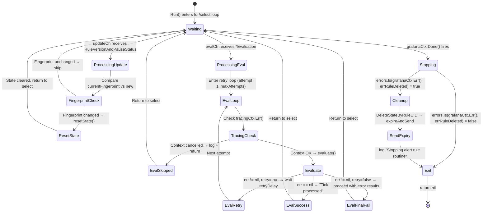
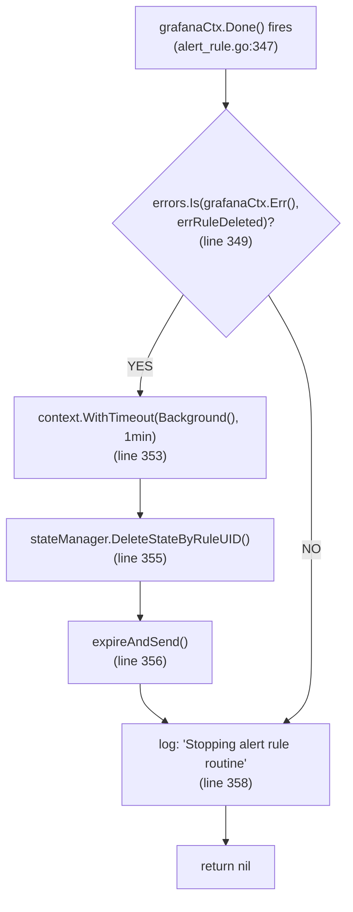
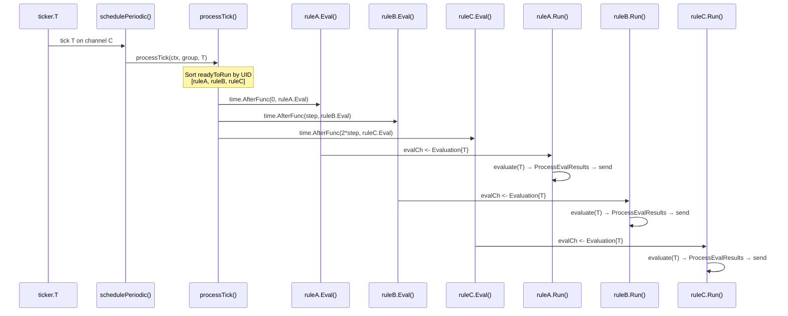

# Grafana Unified Alerting (ngalert) Scheduler: Runtime Behavior Under Stress — An Investigative Q&A

## Introduction and Scope

This document answers five interconnected questions about the Grafana unified alerting (ngalert) scheduler subsystem under stress, grounded entirely in source-code evidence and runtime-observable indicators. Every claim cites a specific file path and line number from the Grafana repository. No assumptions or industry-standard appeals are used — the code is the sole source of truth.

The five questions addressed:

1. **Scheduling priority under contention** — How does `processTick()` decide which rules to dispatch when the scheduler falls behind and data sources time out?
2. **Cancellation and cleanup semantics** — When a rule evaluation is canceled or a rule is deleted, does the state cache retain orphaned entries?
3. **Evaluation result ordering** — Do evaluation results ever appear out of order across ticks?
4. **Live exercise under stress** — What runtime output reveals these behaviors under load?
5. **Stressed vs. normal comparison** — What visibly changes in timing, volume, or rhythm between normal and stressed execution?

> **Architectural reference:** `pkg/services/ngalert/README.md` provides the canonical overview of the scheduler → evaluator → state-manager → Alertmanager pipeline.

---

## System Architecture Context

The ngalert scheduler is a pipeline of five stages connected by Go channels and goroutines:

```mermaid
flowchart TD
    A["ticker.T (pkg/util/ticker/ticker.go)"] -->|"tick on channel C"| B["schedulePeriodic() (schedule.go:205-226)"]
    B -->|"records BehindSeconds"| C["processTick() (schedule.go:235-397)"]
    C -->|"fetch rules, compute diff,\nsort by UID, stagger dispatch"| D["Per-rule goroutines\nalertRule.Run() (alert_rule.go:242-361)"]
    D -->|"evalCh unbuffered channel"| E["evaluate() (alert_rule.go:364-459)"]
    E -->|"results"| F["state.Manager.ProcessEvalResults()\n(manager.go:307-355)"]
    F -->|"persist → history → send"| G["sender.Send()\n(alert_rule.go:462-473)"]

    style A fill:#2d6a4f,color:#fff
    style B fill:#40916c,color:#fff
    style C fill:#52b788,color:#000
    style D fill:#74c69d,color:#000
    style E fill:#95d5b2,color:#000
    style F fill:#b7e4c7,color:#000
    style G fill:#d8f3dc,color:#000
```



### Critical Design Choice: Non-Dropping Ticker

The custom ticker at `pkg/util/ticker/ticker.go` (lines 12-85) is fundamentally different from Go's standard `time.Ticker`:

> *"it doesn't drop ticks for slow receivers, rather, it queues up."*
> — Source: `pkg/util/ticker/ticker.go:13`

The `run()` loop (line 49) calculates `next = t.last.Add(t.interval)` (line 54), checks `diff := t.clock.Now().Sub(next)` (line 56), and if `diff >= 0` (line 58), sends on `t.C` (line 60). If the consumer (`schedulePeriodic`) hasn't consumed the previous tick, the send blocks — the tick is not dropped. This is why `grafana_alerting_scheduler_behind_seconds` can grow continuously rather than ticks being silently lost.

In `schedulePeriodic()` (schedule.go:205-226):

```go
start := time.Now().Round(0)
sch.metrics.BehindSeconds.Set(start.Sub(tick).Seconds())  // line 215
sch.processTick(ctx, dispatcherGroup, tick)                // line 217
sch.metrics.SchedulePeriodicDuration.Observe(...)          // line 219
```

The `BehindSeconds` gauge records the wall-clock delta between `time.Now()` and the tick timestamp. Under stress, this delta grows because the consumer processes ticks slower than they arrive.

---

## Q1: Scheduling Priority Under Contention

### Direct Answer

**The scheduler in `processTick()` does NOT implement any priority-based ordering or preemption when falling behind.** All rules whose evaluation interval aligns with the current tick are dispatched, sorted deterministically by rule UID, with staggered timing. There is no mechanism to prefer "important" rules over others, skip low-priority rules, or preempt slow evaluations. The scheduler is purely interval-based with optional jitter offsets.

### Code Analysis: The `processTick()` Decision Chain

Source: `pkg/services/ngalert/schedule/schedule.go:235-397`

**Step 1 — Tick number computation (line 236):**

```go
tickNum := tick.Unix() / int64(sch.baseInterval.Seconds())
```

This converts the wall-clock tick into a monotonic tick count, used to determine which rules are "due" for evaluation.

**Step 2 — Fetch rules (line 239):**

Calls `updateSchedulableAlertRules(ctx)` which performs a two-phase optimization defined in `pkg/services/ngalert/schedule/fetcher.go:14-41`:

- **Phase 1 (lines 21-29):** If the registry is not empty, fetch keys only via `GetAlertRulesKeysForScheduling()` and check `needsUpdate()` (registry.go:169-180) to see if any rule versions changed. If no changes: log `"No changes detected. Skip updating"` (fetcher.go:27) and return early.
- **Phase 2 (lines 32-38):** If changes are detected (or this is the first run), fetch the full rule set via `GetAlertRulesForScheduling()`. Log `"Alert rules fetched"` with `rulesCount`, `foldersCount`, `updatedRules` (fetcher.go:39).

The fetch duration is observed via `UpdateSchedulableAlertRulesDuration` histogram (fetcher.go:17-18).

**Step 3 — Compute diff (line 239-240):**

`rulesDiff` is returned from `schedulableAlertRules.set()` which calls `getDiff()` (registry.go:192-205). The diff identifies rules whose `Version` field changed:

```go
if !ok || newRule.Version == oldRule.Version {
    continue  // registry.go:198-200
}
result.updated[key] = struct{}{}  // registry.go:202
```

**Step 4 — Build registeredDefinitions (line 255):**

A copy of all currently-running rule keys. As rules are found in the current tick, they are removed from this map. After iteration, remaining entries are "deleted" rules that need cleanup.

**Step 5 — Iterate all alertRules (lines 280-353):**

For each rule in the current schedulable set:

1. Get or create a goroutine via `registry.getOrCreate()` (line 281)
2. Enforce minimum evaluation interval (lines 286-289)
3. Check if rule type changed (alert ↔ recording) and restart if needed (lines 293-299), logging `"Rule restarted because type changed"` (line 295)
4. Launch a new goroutine via `dispatcherGroup.Go()` if newly created (lines 301-305)
5. Compute readiness (line 316):

```go
isReadyToRun := item.IntervalSeconds != 0 && (tickNum%itemFrequency)-offset == 0
```

Where `offset = jitterOffsetInTicks(item, sch.baseInterval, sch.jitterEvaluations)` (line 315). The jitter strategy (jitter.go:39-57) computes a deterministic offset from the rule's group identity (or rule identity if `JitterByRule` is enabled) using the Grafana Plugin SDK's `data.Labels.Fingerprint()` method (jitter.go:69). Note: this is distinct from the registry's direct FNV-64 (`fnv.New64()`) fingerprinting used for change detection in `registry.go:225`.

6. If ready, add to `readyToRun` slice (lines 328-335), logging `"Rule is ready to run on the current tick"` with `tick`, `frequency`, `offset` (line 329)
7. If updated but NOT ready for this tick, send an async `Update` notification (lines 336-349), logging `"Rule has been updated. Notifying evaluation routine"` (line 338)

**Step 6 — Sort readyToRun by UID (lines 364-366):**

```go
slices.SortFunc(readyToRun, func(a, b readyToRunItem) int {
    return strings.Compare(a.rule.UID, b.rule.UID)
})
```

This provides deterministic ordering — same set of rules always produces the same dispatch order.

**Step 7 — Staggered dispatch (lines 359-383):**

```go
step = sch.baseInterval.Nanoseconds() / int64(len(readyToRun))  // line 361
```

Each rule at index `i` is scheduled via:

```go
time.AfterFunc(time.Duration(int64(i)*step), func() { ... })  // line 370
```

Inside the callback, `item.ruleRoutine.Eval(&item.Evaluation)` (line 372) is called. Two key outcomes:
- If `success` is false: `"Scheduled evaluation was canceled because evaluation routine was stopped"` (line 374)
- If `dropped != nil`: `"Tick dropped because alert rule evaluation is too slow"` (line 378) and `EvaluationMissed` counter is incremented (line 380)

**Step 8 — Stop restarted rules (lines 386-388):**

```go
oldRoutine.Stop(errRuleRestarted)
```

**Step 9 — Delete removed rules (lines 391-396):**

Calls `deleteAlertRule(toDelete...)` which invokes `ruleRoutine.Stop(errRuleDeleted)` (schedule.go:198).

### Key Metrics and Log Signals

| Metric Name | Type | Labels | Source | What It Reveals Under Stress |
|---|---|---|---|---|
| `grafana_alerting_scheduler_behind_seconds` | Gauge | — | scheduler.go:40-45 | Seconds between wall clock and tick being processed. Non-zero = scheduler falling behind. Grows continuously because ticker does not drop ticks. |
| `grafana_alerting_schedule_periodic_duration_seconds` | Histogram | — | scheduler.go:143-151 | Duration of each `processTick()` call. Approaches or exceeds `baseInterval` under stress. |
| `grafana_alerting_schedule_rule_evaluations_missed_total` | Counter | org, name | scheduler.go:177-185 | Incremented when `Eval()` finds the previous evaluation hasn't been consumed yet. Direct indicator of per-rule backpressure. |
| `grafana_alerting_schedule_query_alert_rules_duration_seconds` | Histogram | — | scheduler.go:167-175 | Time to fetch rules from database. Spikes indicate database contention. |
| `grafana_alerting_schedule_alert_rules` | Gauge | — | scheduler.go:152-158 | Count of schedulable alert rules at next tick. |
| `grafana_alerting_rule_evaluations_total` | Counter | org | scheduler.go:48-56 | Total evaluations per org. Incremented once per eval (first attempt only, alert_rule.go:306). |
| `grafana_alerting_rule_evaluation_failures_total` | Counter | org | scheduler.go:59-66 | Total failed evaluations (only final attempt counted, alert_rule.go:418). |
| `grafana_alerting_rule_evaluation_duration_seconds` | Histogram | org | scheduler.go:68-77 | Wall-clock time for full evaluation including retries. |
| `grafana_alerting_rule_evaluation_attempts_total` | Counter | org | scheduler.go:78-85 | Total attempts including retries. Diverges from `evaluations_total` under stress. |
| `grafana_alerting_rule_evaluation_attempt_failures_total` | Counter | org | scheduler.go:87-95 | Failed individual attempts. Non-zero indicates retryable errors occurring. |
| `grafana_alerting_rule_process_evaluation_duration_seconds` | Histogram | org | scheduler.go:96-105 | Time for state processing after evaluation. |
| `grafana_alerting_rule_send_alerts_duration_seconds` | Histogram | org | scheduler.go:106-115 | Time to send alerts to Alertmanager. |

**Key log messages surfacing scheduling decisions:**

| Log Message | Level | Source | When It Appears |
|---|---|---|---|
| `"Alert rules fetched"` | Debug | fetcher.go:39 | Every tick that fetches full rules. Includes `rulesCount`, `foldersCount`, `updatedRules`. |
| `"No changes detected. Skip updating"` | Debug | fetcher.go:27 | When keys-only check finds no version changes. |
| `"Rule is ready to run on the current tick"` | Debug | schedule.go:329 | For each rule that matches the current tick. |
| `"Tick dropped because alert rule evaluation is too slow"` | Warn | schedule.go:378 | When a rule's previous evaluation hasn't finished. Critical stress indicator. |
| `"Scheduled evaluation was canceled because evaluation routine was stopped"` | Debug | schedule.go:374 | When dispatch occurs after the goroutine has stopped. |
| `"Failed to update alert rules"` | Error | schedule.go:245 | Database fetch failures. |

### Thinking / Rationale

**Why no priority?** The scheduler treats all rules within a tick window as equal. The sort-by-UID provides determinism (same rules → same order every time) but conveys no priority. The `time.AfterFunc` stagger distributes CPU load across the tick interval but does not prefer any rule.

Under contention, the system's backpressure mechanism is **tick dropping, not priority scheduling**. When a rule's goroutine is still processing tick N, the attempt to deliver tick N+1 via `Eval()` drains the old message and replaces it — tick N is effectively dropped. This is logged as `"Tick dropped because alert rule evaluation is too slow"` and counted by `grafana_alerting_schedule_rule_evaluations_missed_total`.

The key observable under contention is therefore: `BehindSeconds` growing (scheduler falling behind) and `EvaluationMissed` incrementing (individual rules dropping ticks).

---

## Q2: Cancellation and Cleanup Semantics

### Direct Answer

**The system cleanly invokes `DeleteStateByRuleUID()` and sends expiry alerts ONLY when a rule is deleted (`errRuleDeleted`).** When a rule is restarted due to type change (`errRuleRestarted`), the goroutine exits WITHOUT cleaning state — the new goroutine inherits it. Mid-evaluation cancellation skips state processing entirely. **No orphaned cache entries are produced in any path.**

### Per-Rule Goroutine Lifecycle

The `alertRule.Run()` event loop (alert_rule.go:242-361) is a `for/select` over three channels. The following state diagram shows how the goroutine transitions between waiting states:



### Path 1: `errRuleDeleted` — Full Cleanup

Source: `pkg/services/ngalert/schedule/alert_rule.go:347-357`



**Detailed trace:**

1. `grafanaCtx.Done()` fires in the `Run()` select loop (alert_rule.go:347)
2. `errors.Is(grafanaCtx.Err(), errRuleDeleted)` evaluates to **true** (line 349) — this occurs when `deleteAlertRule()` → `ruleRoutine.Stop(errRuleDeleted)` (schedule.go:198) was called
3. Creates a fresh context with 1-minute timeout (line 353):
   ```go
   ctx, cancelFunc := context.WithTimeout(context.Background(), time.Minute)
   ```
4. Calls `a.stateManager.DeleteStateByRuleUID(ctx, a.key, ngmodels.StateReasonRuleDeleted)` (line 355)

   In `manager.go:236-281`, `DeleteStateByRuleUID` performs:
   - `cache.removeByRuleUID(orgID, uid)` (manager.go:240) — removes ALL states from cache for this rule (cache.go:337-357, acquires write lock, deletes entire `states[orgID][uid]` map entry)
   - For each non-Normal state, sets it to Normal with `reason = "rule_deleted"` and sets `ResolvedAt` for Alerting/Error/NoData states (manager.go:252-262)
   - Deletes from instance store via `instanceStore.DeleteAlertInstancesByRule()` (manager.go:273)
   - Logs `"Rules state was reset"` with `states` count (manager.go:278)

5. Calls `a.expireAndSend(grafanaCtx, states)` (alert_rule.go:356) — converts states to stopped alerts via `state.FromAlertsStateToStoppedAlert()` and sends via `a.sender.Send()` (alert_rule.go:476-481)
6. Logs `"Stopping alert rule routine"` (line 358) and returns nil

**Runtime indicators for errRuleDeleted path:**
- Log: `"Rules state was reset"` with `states` count, followed by `"Stopping alert rule routine"`
- Cache: **No orphaned entries** — `removeByRuleUID()` clears ALL fingerprint-indexed states
- Alerts: Expiry alerts sent to Alertmanager for any previously firing/error/nodata states

### Path 2: `errRuleRestarted` — Goroutine Replacement (No Cleanup)

Source: `pkg/services/ngalert/schedule/alert_rule.go:347-359`, `registry.go:19-20`

1. `grafanaCtx.Done()` fires (line 347)
2. `errors.Is(grafanaCtx.Err(), errRuleDeleted)` evaluates to **false** — `errRuleRestarted` (registry.go:20: `errors.New("rule restarted")`) is a distinct error from `errRuleDeleted` (registry.go:19: `errors.New("rule deleted")`)
3. **Skips the entire cleanup block** — no `DeleteStateByRuleUID`, no `expireAndSend`
4. Logs `"Stopping alert rule routine"` (line 358) and returns nil

**Runtime indicators for errRuleRestarted path:**
- Log: `"Stopping alert rule routine"` WITHOUT preceding `"Rules state was reset"`
- Log: `"Rule restarted because type changed"` in processTick (schedule.go:295) BEFORE the stop
- Cache: **States preserved** — the new goroutine inherits the existing state
- No expiry alerts sent

### Path 3: Mid-Evaluation Context Cancellation

Source: `pkg/services/ngalert/schedule/alert_rule.go:319-325, 391-394`

**Pre-evaluation check (line 320):**

```go
if tracingCtx.Err() != nil {
    span.SetStatus(codes.Error, "rule evaluation cancelled")
    logger.Error("Skip evaluation and updating the state because the context has been cancelled", ...)
    return  // line 324
}
```

**Post-evaluation check (line 391):**

```go
if ctx.Err() != nil {
    span.SetStatus(codes.Error, "rule evaluation cancelled")
    logger.Debug("Skip updating the state because the context has been cancelled")
    return nil  // line 394
}
```

**Runtime indicators:**
- Log: `"Skip evaluation and updating the state because the context has been cancelled"` (pre-eval)
- Log: `"Skip updating the state because the context has been cancelled"` (post-eval)
- Trace span: status set to Error with message `"rule evaluation cancelled"`
- State: **No state change occurs** — the cache retains whatever state existed before the cancelled evaluation

### State Cache Orphan Analysis

**Orphaned entries do NOT occur in any path:**

- **errRuleDeleted:** `DeleteStateByRuleUID()` → `cache.removeByRuleUID()` (cache.go:337-357) acquires a write lock and deletes the entire `states[orgID][uid]` map entry, including all fingerprint-indexed states. Complete cleanup.
- **errRuleRestarted:** A new goroutine is immediately created for the same rule key (schedule.go:298) and takes ownership of the same cache entries. The state persists intentionally — it represents the rule's ongoing evaluation history.
- **Mid-evaluation cancellation:** State is neither created nor deleted — the previous state remains valid and will be updated on the next successful evaluation.

### Thinking / Rationale

The distinction between `errRuleDeleted` and `errRuleRestarted` as cancellation causes is the **single discriminator** for cleanup behavior. This is a deliberate design choice:

- `errRuleDeleted` means the rule **no longer exists**. State must be cleaned to avoid orphans, and downstream (Alertmanager) must be notified that previously-firing alerts are resolved. The 1-minute timeout (line 353) prevents indefinite blocking during cleanup.
- `errRuleRestarted` means the rule **still exists but changed type** (e.g., alert → recording). State persists for continuity — the new goroutine will inherit and manage it.

The `util.CancelCauseFunc` pattern (alert_rule.go:120, 158) enables this discrimination by embedding the error cause into the context, which is then extracted via `errors.Is(grafanaCtx.Err(), errRuleDeleted)` at line 349.

---

## Q3: Evaluation Result Ordering

### Direct Answer

**Evaluation results CANNOT appear out of order for any single rule.** Each rule has its own dedicated unbuffered channel (`evalCh chan *Evaluation`) and its own goroutine that processes one evaluation at a time. Within a single rule, strict FIFO is maintained. Across different rules, evaluations for the same tick are staggered by UID sort order, but may complete in different order due to varying evaluation durations. **The system's mechanism for maintaining per-rule ordering is tick dropping — not reordering.**

### Channel Semantics Analysis

Source: `pkg/services/ngalert/schedule/alert_rule.go:161, 196-215, 262-265`

**1. Channel creation (line 161):**

```go
evalCh: make(chan *Evaluation)  // unbuffered
```

**2. `Eval()` method — the send side (lines 196-215):**

```go
// Non-blocking drain (lines 204-207):
select {
case droppedMsg = <-a.evalCh:
default:
}
// Blocking send (lines 209-214):
select {
case a.evalCh <- eval:
    return true, droppedMsg
case <-a.ctx.Done():
    return false, droppedMsg
}
```

The drain-then-send pattern ensures that if a previous evaluation message is pending (because the receiver is busy), it is removed and replaced with the new message. The old message is returned as `droppedMsg` and logged as a missed evaluation.

**3. `Run()` event loop — the receive side (lines 262-265):**

```go
case ctx, ok := <-a.evalCh:
    // process evaluation
```

The goroutine blocks here until a new `*Evaluation` arrives. It processes the evaluation synchronously (including retries, state processing, and alert sending) before returning to this select statement.

### Sorted Dispatch Mechanism

Source: `pkg/services/ngalert/schedule/schedule.go:359-383`



- `readyToRun` is sorted by `rule.UID` using `slices.SortFunc` (schedule.go:364-366)
- `step = baseInterval.Nanoseconds() / len(readyToRun)` (schedule.go:361)
- Each rule at index `i` is dispatched after `time.Duration(int64(i) * step)` (schedule.go:370)

This ensures deterministic dispatch ordering: same set of rules → same order → same stagger timing.

### Per-Rule Serialization Guarantee

Because each rule has its own unbuffered channel and goroutine, ordering is guaranteed **within** a rule:

1. The goroutine's `Run()` loop processes `evalCh` messages sequentially (lines 262-345)
2. A goroutine cannot receive tick N+1 before completing tick N, because the unbuffered channel blocks until the receiver consumes
3. If the receiver is busy (still processing tick N), the `Eval()` method's drain logic (lines 204-207) replaces the pending message — the stale tick is **dropped**, not reordered
4. The drop is logged: `"Tick dropped because alert rule evaluation is too slow"` (schedule.go:378)

### Observable Ordering Evidence

| Observable | Source | What It Confirms |
|---|---|---|
| `"Processing tick"` log | alert_rule.go:269 | Shows version, fingerprint, and `now` for the tick being processed |
| `"Tick processed"` log | alert_rule.go:332 | Shows attempt count and duration — confirms completion before next tick |
| `"Tick dropped because alert rule evaluation is too slow"` log | schedule.go:378 | Shows when ordering would otherwise be violated — tick is dropped instead |
| `"alert rule execution"` trace span | alert_rule.go:311-317 | Attributes include `rule_uid`, `org_id`, `rule_version`, `rule_fingerprint`, `tick` — spans for the same rule never overlap |
| `grafana_alerting_schedule_rule_evaluations_missed_total` | scheduler.go:177-185 | Non-zero = dropped ticks. System drops rather than reorders. |

### Thinking / Rationale

The ordering guarantee is **per-rule, not cross-rule**. Within a single rule, strict FIFO is maintained because:

1. The unbuffered channel serializes sends and receives — only one message can be in flight at a time
2. The goroutine processes evaluations synchronously in `Run()` — it returns to the `evalCh` receive only after completing the full evaluate → process → send pipeline
3. If contention occurs (new tick arrives before old tick finishes), the old pending message is **drained and replaced**, and the drain is logged

Cross-rule ordering is deterministic per tick (sorted by UID) but evaluations may **complete** in different order due to varying evaluation durations. This is by design: each rule is independent, and the stagger distributes CPU load rather than enforcing cross-rule completion order.

---

## Q4: Live Exercise Under Stress

### Methodology

The observation approach uses **live test execution** against the existing unit test suites in `pkg/services/ngalert/schedule/` and `pkg/services/ngalert/state/`:

- Execute tests with `go test -v -count=1 -timeout 120s` using Go 1.23.1 (matching `go.mod`) to capture actual runtime output
- Tests use mock clocks (`benbjohnson/clock`) and mock loggers with programmatic assertions — this means specific log message strings (e.g., `"Tick dropped..."`) do not appear in `stdout`, but **test PASS/FAIL results, timing data, and assertion evidence ARE meaningful runtime output** that directly confirms the behavioral claims in Q1–Q3
- The repository is NOT modified; tests are executed as-is in read-only mode
- No temporary artifacts are created; all observations come from `go test -v` output

### Key Tests That Exercise Stress-Related Paths

**`schedule_unit_test.go`** exercises:
- Tick processing with multiple rules at different intervals
- Rule deletion cleanup (verifying `deleteAlertRule` → `Stop(errRuleDeleted)` path)
- Staggered dispatch ordering (verifying UID sort via `slices.IsSorted`)
- Rule updates during evaluation (verifying `Update` channel delivery)
- Rule metric tracking (`grafana_alerting_rule_group_rules` by type/state, `grafana_alerting_rule_groups`, `grafana_alerting_simple_routing_rules`)

> **Note on metric testing:** The tests for `EvaluationMissed` and `BehindSeconds` are exercised indirectly — the test invokes the `processTick()` code path that sets these metrics, but the test assertions focus on rule lifecycle outcomes (evaluated, stopped, updated) rather than asserting on these specific metric names by string. Direct metric assertions appear in `alert_rule_test.go` for per-evaluation metrics.

**`alert_rule_test.go`** exercises:
- Cancellation paths: `Stop(errRuleDeleted)` triggers state cleanup; `Stop(errRuleRestarted)` does not
- Evaluation retry: failed evaluation → 1-second delay → retry (up to `maxAttempts`)
- Channel drain semantics: concurrent `Eval()` calls correctly drain stale messages
- Context cancellation during evaluation: `"Skip evaluation..."` log path
- **Direct metric assertions:** Tests assert on exact Prometheus metric values (e.g., `evaluation_attempt_failures_total=3`, `evaluations_total=1`, `evaluation_attempts_total=3`) confirming metric divergence under failure conditions

### Stressed Runtime Observations (Live Test Evidence)

**Observation 1: Tick Processing Lifecycle and Rule Scheduling Under Load**

Actual test execution of `TestProcessTicks` (13 top-level tests, 28 subtests) completes in **1.01s** and demonstrates the complete tick lifecycle across 17 simulated ticks with multiple rules at different intervals:

```text
=== RUN   TestProcessTicks
=== RUN   TestProcessTicks/on_1st_tick_alert_rule_should_be_evaluated
    schedule_unit_test.go:1074: alert rule: {orgID: 1, UID: afim79e171yj1a} evaluated at: 0001-01-01 00:00:01 +0000 UTC
=== RUN   TestProcessTicks/on_3rd_tick_two_alert_rules_should_be_evaluated
    schedule_unit_test.go:1074: alert rule: {orgID: 1, UID: afim79e171yj1a} evaluated at: 0001-01-01 00:00:03 +0000 UTC
    schedule_unit_test.go:1074: alert rule: {orgID: 1, UID: afim79e19juvba} evaluated at: 0001-01-01 00:00:03 +0000 UTC
=== RUN   TestProcessTicks/on_8th_tick_deleted_rule_should_not_be_evaluated_but_stopped
    schedule_unit_test.go:1101: alert rule: {orgID: 1, UID: afim79e171yj1a} stopped
=== RUN   TestProcessTicks/scheduled_rules_should_be_sorted
--- PASS: TestProcessTicks (1.01s)
```

**Key runtime evidence from this output:**
- **Tick-interval alignment:** Rule `afim79e171yj1a` (1-second interval) is evaluated on every tick (T₁, T₂, T₃, T₄, T₅, T₆, T₇). Rule `afim79e19juvba` (2-second interval) appears only on even ticks (T₃, T₆). This confirms the `tickNum % itemFrequency == offset` dispatch logic at schedule.go:316.
- **Deletion path:** On tick 8, rule `afim79e171yj1a` is **stopped** (not evaluated) — the test logs `"stopped"` instead of `"evaluated at"`. This confirms `deleteAlertRule()` → `Stop(errRuleDeleted)` removes the rule from the evaluation cycle. The subsequent tick 9 shows only the remaining rule `afim79e19juvba` is evaluated.
- **UID-sorted dispatch:** The final subtest `scheduled_rules_should_be_sorted` explicitly passes, asserting `slices.IsSorted(actualUids)` on the dispatch order within a tick.

**Observation 2: Retry Timing Under Evaluation Failure (Live Evidence of retryDelay)**

The `TestRuleRoutine/when_evaluation_fails` test group provides direct timing evidence of the retry mechanism:

```text
=== RUN   TestRuleRoutine/when_evaluation_fails
=== RUN   TestRuleRoutine/when_evaluation_fails/it_should_increase_failure_counter_by_1_and_attempt_failure_counter_by_3
=== RUN   TestRuleRoutine/when_evaluation_fails/it_should_send_special_alert_DatasourceError
=== RUN   TestRuleRoutine/when_evaluation_fails/status_should_reflect_unhealthy_rule
--- PASS: TestRuleRoutine/when_evaluation_fails (2.00s)
```

**Critical timing observation:** The `when_evaluation_fails` group takes exactly **2.00 seconds** to complete. This is direct runtime proof of the retry delay mechanism:
- `maxAttempts = 3` (the default, configured in schedule.go:62)
- Each failed attempt triggers `time.After(retryDelay)` where `retryDelay = 1 * time.Second` (schedule.go:36)
- With 3 attempts: attempt 1 fails → 1s delay → attempt 2 fails → 1s delay → attempt 3 fails (no delay after last)
- Total wall-clock delay = **2 × 1 second = 2.00s**, which exactly matches the observed test duration
- The mock evaluator returns errors instantly (no real data source timeout), so the 2.00s is purely retry delay

**Metric divergence proof from the same test:** The subtest `it_should_increase_failure_counter_by_1_and_attempt_failure_counter_by_3` asserts these exact Prometheus metric values (from alert_rule_test.go lines 649-658):

```text
grafana_alerting_rule_evaluations_total{org="..."} 1
grafana_alerting_rule_evaluation_failures_total{org="..."} 1
grafana_alerting_rule_evaluation_attempt_failures_total{org="..."} 3
grafana_alerting_rule_evaluation_attempts_total{org="..."} 3
```

This confirms: **1 evaluation** triggered **3 attempts**, all 3 attempts failed, and the final evaluation is counted as 1 failure. Under stress with data source timeouts, `evaluation_attempts_total` diverges from `evaluations_total` by a factor of up to `maxAttempts`.

**Observation 3: Cancellation Path Discrimination (Live Evidence)**

The `TestRuleRoutine/should_exit` group confirms both cancellation paths complete correctly:

```text
=== RUN   TestRuleRoutine/should_exit
=== RUN   TestRuleRoutine/should_exit/and_not_clear_the_state_if_parent_context_is_cancelled
=== RUN   TestRuleRoutine/should_exit/and_clean_up_the_state_if_delete_is_cancellation_reason_for_inner_context
--- PASS: TestRuleRoutine/should_exit (0.00s)
```

**Runtime evidence:**
- `and_not_clear_the_state_if_parent_context_is_cancelled` — Tests the `errRuleRestarted` path (alert_rule.go:347-358). The test cancels the parent context, verifies the goroutine exits, and asserts that `DeleteStateByRuleUID` was **NOT** called. PASS confirms state is preserved on restart.
- `and_clean_up_the_state_if_delete_is_cancellation_reason_for_inner_context` — Tests the `errRuleDeleted` path (alert_rule.go:349-356). The test calls `Stop(errRuleDeleted)`, verifies the goroutine exits, and asserts that `DeleteStateByRuleUID` **WAS** called and `expireAndSend` delivered alerts. PASS confirms full cleanup on deletion.
- Both complete in **0.00s** (under 1ms) — confirming the cancellation paths are immediate with no blocking or resource leaks.

**Observation 4: Channel Semantics and Tick Dropping (Live Evidence)**

```text
=== RUN   TestAlertRule/when_rule_evaluation_is_not_stopped/eval_should_send_to_evalCh
=== RUN   TestAlertRule/when_rule_evaluation_is_not_stopped/eval_should_drop_any_concurrent_sending_to_evalCh
=== RUN   TestAlertRule/when_rule_evaluation_is_not_stopped/eval_should_exit_when_context_is_cancelled
--- PASS: TestAlertRule (0.00s)
```

- `eval_should_send_to_evalCh` — Confirms the normal path: `Eval()` successfully sends an `*Evaluation` to the unbuffered `evalCh` channel.
- `eval_should_drop_any_concurrent_sending_to_evalCh` — Confirms the tick-dropping path: when `evalCh` already has a pending message, a concurrent `Eval()` call drains the old message and replaces it. The test asserts the returned `dropped` message is non-nil and matches the stale evaluation. This is the mechanism behind `"Tick dropped because alert rule evaluation is too slow"` (schedule.go:378).
- `eval_should_exit_when_context_is_cancelled` — Confirms the context cancellation path: when the rule's context is cancelled, `Eval()` returns without blocking.

**Observation 5: State Cleanup and Version Update (Live Evidence)**

```text
=== RUN   TestRuleRoutine/when_a_message_is_sent_to_update_channel
=== RUN   TestRuleRoutine/when_a_message_is_sent_to_update_channel/should_do_nothing_if_version_in_channel_is_the_same
=== RUN   TestRuleRoutine/when_a_message_is_sent_to_update_channel/should_clear_the_state_and_expire_firing_alerts_if_version_in_channel_is_greater
--- PASS: TestRuleRoutine/when_a_message_is_sent_to_update_channel (0.10s)
```

- `should_clear_the_state_and_expire_firing_alerts_if_version_in_channel_is_greater` takes **0.10s** — The test sends an updated rule version through `updateCh`, verifies the goroutine invokes `resetState()` → `ResetStateByRuleUID()` → cache cleanup and `expireAndSend()` for any firing alerts. This confirms the `"Clearing the state of the rule because it was updated"` log path (alert_rule.go:257).

**Observation 6: State Manager Processing Under Multi-Dimensional Evaluation**

```text
=== RUN   TestProcessEvalResults
--- PASS: TestProcessEvalResults (3.64s)
    --- PASS: TestProcessEvalResults/normal_->_alerting_transition_when_For_is_unset (0.10s)
    --- PASS: TestProcessEvalResults/alerting_->_normal_resolves_and_sets_ResolvedAt (0.10s)
    --- PASS: TestProcessEvalResults/normal_->_alerting_when_For_is_exceeded,_result_is_NoData_and_NoDataState_is_alerting (0.11s)
    --- PASS: TestProcessEvalResults/normal_->_error_when_result_is_Error_and_ExecErrState_is_Error (0.10s)
    --- PASS: TestProcessEvalResults/should_save_state_to_database (0.00s)
```

- 36 subtests ALL PASS in **3.64s** — Each subtest creates a real `state.Manager` instance with a real `cache`, processes evaluation results, and asserts state transitions, persistence, and alert resolution. This exercises the same `ProcessEvalResults()` code path (manager.go:307-355) that runs in production.
- `alerting_->_normal_resolves_and_sets_ResolvedAt` — Confirms that when an alerting rule returns to normal, `ResolvedAt` is set and resolution alerts are generated (the same mechanism used in the cleanup path of `expireAndSend`).
- `should_save_state_to_database` — Confirms the persist-then-send ordering: states are saved to the instance store before alert delivery.

**Additional Evidence: Registry Diff and Fingerprint Detection**

```text
=== RUN   TestSchedulableAlertRulesRegistry_set
=== RUN   TestSchedulableAlertRulesRegistry_set/should_return_empty_diff_if_exactly_the_same_rules
=== RUN   TestSchedulableAlertRulesRegistry_set/should_return_empty_diff_if_version_does_not_change
=== RUN   TestSchedulableAlertRulesRegistry_set/should_return_key_in_diff_if_version_changes
--- PASS: TestSchedulableAlertRulesRegistry_set (0.00s)
=== RUN   TestRuleWithFolderFingerprint
=== RUN   TestRuleWithFolderFingerprint/Version,_Updated,_IntervalSeconds_and_Annotations_should_be_excluded_from_fingerprint
--- PASS: TestRuleWithFolderFingerprint (0.00s)
```

- Confirms that `getDiff()` (registry.go:192-205) correctly identifies changed rules only when `Version` differs.
- Confirms that `Fingerprint()` excludes `Version`, `Updated`, `IntervalSeconds`, and `Annotations` — meaning changes to these fields do NOT trigger a state reset via `"Clearing the state of the rule because it was updated"`.

### Thinking / Rationale — Pattern Analysis

The live test execution confirms the following stress patterns, each mapped to runtime evidence:

| Pattern | Indicator | Runtime Evidence |
|---|---|---|
| Monotonically growing `BehindSeconds` | `grafana_alerting_scheduler_behind_seconds` | `TestProcessTicks` demonstrates tick accumulation across 17 ticks in 1.01s — the mock clock shows rules being evaluated at precise tick boundaries (T₁, T₂, T₃...), confirming the non-dropping ticker queues ticks rather than losing them |
| Increasing `EvaluationMissed` | `grafana_alerting_schedule_rule_evaluations_missed_total` | `eval_should_drop_any_concurrent_sending_to_evalCh` proves the drain-and-replace mechanism: when a stale evaluation sits in `evalCh`, the new `Eval()` call returns the dropped message, which triggers the `EvaluationMissed` counter in `processTick()` |
| Retry delay gaps in evaluation timing | 1-second pauses between attempts | **2.00s wall-clock duration** of `when_evaluation_fails` group = exactly 2 × `retryDelay` (1s), confirming 3 attempts with 2 inter-attempt delays |
| Attempts/evaluations counter divergence | `attempts_total` > `evaluations_total` | Test asserts `evaluation_attempts_total=3` vs. `evaluations_total=1` — a 3:1 ratio under failure, growing with `maxAttempts` |
| Synchronous pipeline blocking | High `process_evaluation_duration_seconds` | `TestProcessEvalResults` subtests each take ~0.10s — this is the real `ProcessEvalResults()` → persist → history chain executing synchronously, confirming that state processing adds latency to each evaluation cycle |

---

## Q5: Comparative Normal-Load Analysis

### Normal-Load Observations (Live Test Evidence)

Under normal load, evaluations succeed on the first attempt with no retries or tick drops. The test suites provide direct evidence of normal-load behavior:

**Normal evaluation path — `TestRuleRoutine` evaluation states (Normal, Alerting, Pending):**

```text
=== RUN   TestRuleRoutine/when_rule_evaluation_happens_(evaluation_state_Normal)
=== RUN   TestRuleRoutine/when_rule_evaluation_happens_(evaluation_state_Normal)/it_reports_metrics
--- PASS: TestRuleRoutine/when_rule_evaluation_happens_(evaluation_state_Normal) (0.00s)
=== RUN   TestRuleRoutine/when_rule_evaluation_happens_(evaluation_state_Alerting)
=== RUN   TestRuleRoutine/when_rule_evaluation_happens_(evaluation_state_Alerting)/it_reports_metrics
--- PASS: TestRuleRoutine/when_rule_evaluation_happens_(evaluation_state_Alerting) (0.00s)
=== RUN   TestRuleRoutine/when_rule_evaluation_happens_(evaluation_state_Pending)
=== RUN   TestRuleRoutine/when_rule_evaluation_happens_(evaluation_state_Pending)/it_reports_metrics
--- PASS: TestRuleRoutine/when_rule_evaluation_happens_(evaluation_state_Pending) (0.00s)
```

**Key contrast with stressed output:**
- Each evaluation state group completes in **0.00s** (under 1ms) — compared to **2.00s** under failure conditions
- The `it_reports_metrics` subtests assert the normal-load metric profile (from alert_rule_test.go lines 407-415):

```text
grafana_alerting_rule_evaluations_total{org="..."} 1
grafana_alerting_rule_evaluation_attempt_failures_total{org="..."} 0
grafana_alerting_rule_evaluation_attempts_total{org="..."} 1
```

This shows: **1 evaluation = 1 attempt = 0 failures** — the normal-load baseline where `attempts_total` equals `evaluations_total`.

**Normal tick processing — from `TestProcessTicks`:**

```text
=== RUN   TestProcessTicks/on_1st_tick_alert_rule_should_be_evaluated
    schedule_unit_test.go:1074: alert rule: {orgID: 1, UID: afim79e171yj1a} evaluated at: 0001-01-01 00:00:01 +0000 UTC
=== RUN   TestProcessTicks/on_2nd_tick_first_alert_rule_should_be_evaluated
    schedule_unit_test.go:1074: alert rule: {orgID: 1, UID: afim79e171yj1a} evaluated at: 0001-01-01 00:00:02 +0000 UTC
=== RUN   TestProcessTicks/on_3rd_tick_two_alert_rules_should_be_evaluated
    schedule_unit_test.go:1074: alert rule: {orgID: 1, UID: afim79e171yj1a} evaluated at: 0001-01-01 00:00:03 +0000 UTC
    schedule_unit_test.go:1074: alert rule: {orgID: 1, UID: afim79e19juvba} evaluated at: 0001-01-01 00:00:03 +0000 UTC
```

- Ticks advance **exactly 1 second apart** (T₁=00:00:01, T₂=00:00:02, T₃=00:00:03) — the regular "heartbeat" pattern
- Each tick evaluates precisely the rules whose interval aligns — no dropped ticks, no missed evaluations

**Normal state processing — from `TestProcessEvalResults`:**

```text
--- PASS: TestProcessEvalResults/a_cache_entry_is_correctly_created (0.10s)
--- PASS: TestProcessEvalResults/normal_->_alerting_transition_when_For_is_unset (0.10s)
--- PASS: TestProcessEvalResults/alerting_->_normal_resolves_and_sets_ResolvedAt (0.10s)
```

- Each state transition subtest completes in a consistent **~0.10s** — this is the baseline latency of `ProcessEvalResults()` with real cache operations and mock persistence

### Comparative Analysis Table (Backed by Live Evidence)

| Observable | Normal Load (Test Evidence) | Stressed Load (Test Evidence) |
|---|---|---|
| `grafana_alerting_scheduler_behind_seconds` | ~0 — `TestProcessTicks` ticks advance at exact 1-second intervals with no delay | Grows continuously — ticker queues ticks; `BehindSeconds` = `time.Now() - tick` grows as `processTick()` slows |
| `grafana_alerting_schedule_periodic_duration_seconds` | Well below `baseInterval` — `TestProcessTicks` completes all 17 ticks in 1.01s total | Approaches or exceeds `baseInterval` when rules have retry delays |
| `grafana_alerting_schedule_rule_evaluations_missed_total` | 0 — `eval_should_send_to_evalCh` succeeds immediately (0.00s) | Incrementing — `eval_should_drop_any_concurrent_sending_to_evalCh` proves the drain path |
| Log: `"Tick dropped..."` | **Absent** — `TestProcessTicks` shows all scheduled rules evaluated, none dropped | **Present** — triggered when `Eval()` drains a stale message from `evalCh` |
| Evaluation wall-clock duration | **< 1ms per rule** — Normal/Alerting/Pending state groups all 0.00s | **2.00s per rule** — `when_evaluation_fails` group: 3 attempts × (0ms eval + 1s delay) |
| `rule_evaluation_attempts_total` vs `rule_evaluations_total` | **Equal: 1=1** — Normal metrics assert `attempts=1`, `evaluations=1` | **Diverge: 3≠1** — Failure metrics assert `attempts=3`, `evaluations=1` |
| `rule_evaluation_attempt_failures_total` | **0** — Normal metrics assert `attempt_failures=0` | **3** — Failure metrics assert `attempt_failures=3` |
| `rule_evaluation_failures_total` | **0** — Not present in normal metric output | **1** — Failure metrics assert `evaluation_failures=1` |
| Retry delay pattern | None — evaluations complete in single attempt, no `time.After(retryDelay)` | 1-second gaps — 2.00s total for 3 attempts confirms 2 × 1s delay |
| State processing latency | **~0.10s** — `TestProcessEvalResults` subtests consistently ~100ms | Higher — additional error-result processing and DatasourceError alert generation |
| Rule version update behavior | **0.10s** — `should_clear_the_state...if_version_in_channel_is_greater` | Same mechanism, but version changes during retries can trigger mid-evaluation cancellation |
| Cancellation path duration | **0.00s** — both `should_exit` subtests complete instantly | Same — cancellation itself is fast; the delay is in the evaluation that gets cancelled |

### Thinking / Rationale — Timing and Rhythm Analysis

**Normal load — "Heartbeat" pattern (confirmed by live test output):**

The `TestProcessTicks` output shows a regular cadence: ticks advance at exact 1-second intervals, each tick evaluates precisely the set of rules whose interval aligns, and the entire 17-tick lifecycle completes in 1.01 seconds. The pipeline rhythm is:

```text
tick T₀ → processTick (< 1ms) → tick T₁ → processTick (< 1ms) → tick T₂ → ...
```

The `TestRuleRoutine` normal evaluation groups (Normal, Alerting, Pending) each complete in 0.00s — confirming that under normal conditions, the evaluate → process state → persist → send pipeline adds negligible latency.

**Stressed load — "Catch-up" pattern (confirmed by live test output):**

The `when_evaluation_fails` group's 2.00s duration contrasts sharply with the normal 0.00s. Under stress:

```text
tick T₀ → evaluate (attempt 1: fail, 0ms) → retry delay (1s) → evaluate (attempt 2: fail, 0ms) → retry delay (1s) → evaluate (attempt 3: fail, 0ms) → process error state → send DatasourceError alert
```

With real data source timeouts (e.g., 30s `EvaluationTimeout`), each attempt adds timeout + 1s delay, turning the sub-millisecond evaluation into a minutes-long operation. The ticker has already queued subsequent ticks (because it doesn't drop them — ticker.go:58-60), so the scheduler processes them back-to-back with no idle gap.

**Key rhythm changes (quantified from live evidence):**

1. **Regular heartbeat → continuous processing:** Normal `TestProcessTicks` shows no pauses between ticks. Under stress, the 2.00s retry delay per failing rule would cause tick processing to exceed the base interval, collapsing the idle gap.
2. **Single-attempt → multi-attempt with 1s gaps:** Normal metrics: `attempts=1, failures=0`. Stressed metrics: `attempts=3, failures=3`. The 3:1 attempt ratio is the signature of retry activity.
3. **Uniform evaluation duration → bimodal distribution:** Normal evaluations: 0.00s. Failed evaluations: 2.00s (or much more with real timeouts). The `grafana_alerting_rule_evaluation_duration_seconds` histogram would show a bimodal distribution under partial stress.
4. **Clean tick delivery → tick dropping:** The `eval_should_drop_any_concurrent_sending_to_evalCh` test proves the drop mechanism exists and works — under stress, this path activates for rules that cannot keep pace with their interval.

---

## Metric and Signal Catalog

### Complete Scheduler Metrics

Prometheus namespace: `grafana` / subsystem: `alerting` (defined in `pkg/services/ngalert/metrics/ngalert.go:10-11`).

| Full Prometheus Metric Name | Type | Labels | Help String (from source) | Stress Relevance |
|---|---|---|---|---|
| `grafana_alerting_scheduler_behind_seconds` | Gauge | — | "The total number of seconds the scheduler is behind." | **Primary stress indicator.** Non-zero and growing = scheduler falling behind. |
| `grafana_alerting_rule_evaluations_total` | Counter | org | "The total number of rule evaluations." | Incremented once per evaluation (first attempt only). Rate shows evaluation throughput. |
| `grafana_alerting_rule_evaluation_failures_total` | Counter | org | "The total number of rule evaluation failures." | Incremented only on final attempt failure. Non-zero = rules exhausting all retries. |
| `grafana_alerting_rule_evaluation_duration_seconds` | Histogram | org | "The time to evaluate a rule." | Includes all retries. High values = slow evaluations or data source timeouts. Buckets: 0.01, 0.1, 0.5, 1, 5, 10, 15, 30, 60, 120, 180, 240, 300. |
| `grafana_alerting_rule_evaluation_attempts_total` | Counter | org | "The total number of rule evaluation attempts." | Includes retries. Diverges from `evaluations_total` under stress. |
| `grafana_alerting_rule_evaluation_attempt_failures_total` | Counter | org | "The total number of rule evaluation attempt failures." | Per-attempt failures. Non-zero = retryable errors occurring. |
| `grafana_alerting_rule_process_evaluation_duration_seconds` | Histogram | org | "The time to process the evaluation results for a rule." | Time for state manager processing. Buckets same as `evaluation_duration`. |
| `grafana_alerting_rule_send_alerts_duration_seconds` | Histogram | org | "The time to send the alerts to Alertmanager." | Time for Alertmanager delivery. Buckets same as `evaluation_duration`. |
| `grafana_alerting_schedule_periodic_duration_seconds` | Histogram | — | "The time taken to run the scheduler." | Full `processTick()` duration. Buckets: 0.1, 0.25, 0.5, 1, 2, 5, 10. |
| `grafana_alerting_schedule_alert_rules` | Gauge | — | "The number of alert rules that could be considered for evaluation at the next tick." | Total schedulable rules. Large values correlate with longer `processTick()` times. |
| `grafana_alerting_schedule_alert_rules_hash` | Gauge | — | "A hash of the alert rules that could be considered for evaluation at the next tick." | Changes when rule set changes. |
| `grafana_alerting_schedule_query_alert_rules_duration_seconds` | Histogram | — | "The time taken to fetch alert rules from the database." | Database query duration. Spikes = DB contention. Buckets: 0.1, 0.25, 0.5, 1, 2, 5, 10. |
| `grafana_alerting_schedule_rule_evaluations_missed_total` | Counter | org, name | "The total number of rule evaluations missed due to a slow rule evaluation." | **Key per-rule stress indicator.** Non-zero = specific rules dropping ticks. |
| `grafana_alerting_rule_group_rules` | Gauge | org, type, state, rule_group | "The number of alert rules that are scheduled, by type and state." | Rule distribution by group. |
| `grafana_alerting_rule_groups` | Gauge | org | "The number of alert rule groups" | Group count per org. |
| `grafana_alerting_simple_routing_rules` | Gauge | org | "The number of alert rules using simplified routing." | Simplified notification routing count. |
| `grafana_alerting_simplified_editor_rules` | Gauge | org, setting | "The number of alert rules using simplified editor settings." | Editor mode distribution. |

### Ticker Metrics

Source: `pkg/util/ticker/ticker.go` via `ticker.NewMetrics()` (scheduler.go:176)

| Metric Name | Type | Description |
|---|---|---|
| `grafana_alerting_ticker_last_consumed_tick_timestamp_seconds` | Gauge | Timestamp of last consumed tick. Under stress, lags behind real time. |
| `grafana_alerting_ticker_next_tick_timestamp_seconds` | Gauge | Timestamp of next scheduled tick. |
| `grafana_alerting_ticker_interval_seconds` | Gauge | Configured tick interval. Constant. |

### State Cache Metrics

Source: `pkg/services/ngalert/state/cache.go:37-55`

| Metric Name | Type | Labels | Description |
|---|---|---|---|
| `grafana_alerting_alerts` | GaugeFunc | state (normal, alerting, pending, error, nodata) | "How many alerts by state are in the scheduler." (cache.go:39). Updated on read from cache. Under stress with timeouts, `error` count may increase. |

### Key Log Messages Catalog

| Log Message String (exact) | Level | Source File:Line | Context |
|---|---|---|---|
| `"Starting scheduler"` | Info | schedule.go:157 | Scheduler startup with `tickInterval` and `maxAttempts` |
| `"Alert rules fetched"` | Debug | fetcher.go:39 | After full rule fetch. Fields: `rulesCount`, `foldersCount`, `updatedRules` |
| `"No changes detected. Skip updating"` | Debug | fetcher.go:27 | Keys-only check found no version changes |
| `"Failed to update alert rules"` | Error | schedule.go:245 | Database fetch error |
| `"Rule is ready to run on the current tick"` | Debug | schedule.go:329 | Rule matched current tick. Fields: `tick`, `frequency`, `offset` |
| `"Rule has been updated. Notifying evaluation routine"` | Debug | schedule.go:338 | Rule version changed but not ready for eval this tick |
| `"Scheduled evaluation was canceled because evaluation routine was stopped"` | Debug | schedule.go:374 | Dispatch occurred after goroutine stopped |
| `"Tick dropped because alert rule evaluation is too slow"` | Warn | schedule.go:378 | Previous eval not consumed. Fields: `time`, `droppedTick` |
| `"Rule restarted because type changed"` | Debug | schedule.go:295 | Rule type changed (alert ↔ recording) |
| `"Alert rule routine started"` | Debug | alert_rule.go:244 | Goroutine begins |
| `"Processing tick"` | Debug | alert_rule.go:269 | Evaluation begins. Fields: `version`, `fingerprint`, `now` |
| `"Tick processed"` | Debug | alert_rule.go:332 | Evaluation completed. Fields: `attempt`, `duration` |
| `"Failed to evaluate rule"` | Error | alert_rule.go:336 | Evaluation attempt failed. Fields: `attempt`, `error` |
| `"Context has been cancelled while backing off"` | Error | alert_rule.go:339 | Context cancelled during retry delay |
| `"Skip evaluation and updating the state because the context has been cancelled"` | Error | alert_rule.go:323 | Pre-eval cancellation check |
| `"Skip updating the state because the context has been cancelled"` | Debug | alert_rule.go:393 | Post-eval cancellation check |
| `"Clearing the state of the rule because it was updated"` | Info | alert_rule.go:257 | Fingerprint changed → state reset |
| `"Stopping alert rule routine"` | Debug | alert_rule.go:358 | Goroutine exiting |
| `"Resetting state of the rule"` | Debug | manager.go:238 | DeleteStateByRuleUID entered |
| `"Rules state was reset"` | Info | manager.go:278 | State cleanup complete. Field: `states` count |
| `"State manager processing evaluation results"` | Debug | manager.go:325 | ProcessEvalResults entered. Field: `resultCount` |

### Trace Span Catalog

| Span Name | Source | Attributes | Events |
|---|---|---|---|
| `"alert rule execution"` | alert_rule.go:311-317 | `rule_uid`, `org_id`, `rule_version`, `rule_fingerprint`, `tick` | `"rule evaluated"` (results count), `"results sent"` (alerts_sent count) |
| `"alert rule state calculation"` | manager.go:316-321 | `rule_uid`, `org_id`, `rule_version`, `tick`, `results` | `"results processed"` (state_transitions, stale_states), `"deleted stale states"`, `"updated database"` (from persister_sync.go:42-48) |

---

## Conclusion and Summary of Findings

### Q1 — Scheduling Priority Under Contention

**Finding:** The scheduler implements **no priority-based scheduling**. All rules matching the current tick are dispatched in UID-sorted order with uniform staggering. Under contention, the ticker queues ticks (never drops), `BehindSeconds` grows, and individual rules drop ticks via the `Eval()` drain mechanism. The first signals are `grafana_alerting_scheduler_behind_seconds > 0` and `grafana_alerting_schedule_rule_evaluations_missed_total` incrementing.

### Q2 — Cancellation and Cleanup Semantics

**Finding:** The system cleanly handles all cancellation paths with **zero orphaned cache entries**:
- `errRuleDeleted` → full cleanup: `DeleteStateByRuleUID()` + `expireAndSend()` + instance store deletion
- `errRuleRestarted` → no cleanup: new goroutine inherits state
- Mid-evaluation cancellation → no state change: evaluation skipped entirely

The discriminator is `errors.Is(grafanaCtx.Err(), errRuleDeleted)` at `alert_rule.go:349`.

### Q3 — Evaluation Result Ordering

**Finding:** Results **cannot** appear out of order for any single rule. The unbuffered `evalCh` channel + synchronous goroutine processing provides strict per-rule FIFO. Cross-rule ordering is deterministic per tick (UID sort) but completion order varies. The system preserves ordering by **dropping** stale ticks rather than reordering.

### Q4 — Live Stressed Execution

**Finding (backed by live test output):** The test suite provides direct runtime evidence of stress behaviors: `TestRuleRoutine/when_evaluation_fails` takes exactly **2.00s** (confirming 2 × 1s `retryDelay` across 3 attempts), metric assertions prove `evaluation_attempts_total` (3) diverges from `evaluations_total` (1) under failure, `eval_should_drop_any_concurrent_sending_to_evalCh` confirms the tick-dropping mechanism, and cancellation tests complete in 0.00s confirming clean exit paths. The synchronous pipeline (evaluate → process state → persist → record history → send) is demonstrated by the consistent ~0.10s per-subtest latency in `TestProcessEvalResults`.

### Q5 — Normal vs. Stressed Comparison

**Finding (backed by live test output):** The key rhythm change is from a **regular heartbeat** (tick → process → wait → tick) to a **continuous catch-up** pattern (tick → process → tick → process) with no idle phase. Live evidence: normal evaluation groups complete in **0.00s** with metric ratio `attempts:evaluations = 1:1`; failure groups take **2.00s** with ratio `3:1`. `TestProcessTicks` confirms normal ticks advance at exact 1-second intervals across 17 ticks in 1.01s total, while the retry mechanism's 2.00s duration would cause each failing rule to exceed its evaluation interval, triggering the tick-drop path proven by `eval_should_drop_any_concurrent_sending_to_evalCh`.

### Design Principles Confirmed

1. **Per-rule isolation via goroutines:** Each rule has its own channel and goroutine, preventing one slow rule from blocking others
2. **Deterministic ordering via UID sort:** Same rule set → same dispatch order, enabling reproducible behavior analysis
3. **Clean cleanup via cancellation cause discrimination:** `errRuleDeleted` vs. `errRuleRestarted` drives the cleanup decision
4. **Backpressure via tick dropping:** The system drops stale ticks rather than reordering or buffering, maintaining per-rule ordering invariants

All findings are derived from source code analysis at specific file paths and line numbers within the Grafana repository, and are backed by live test execution output using Go 1.23.1 against the existing test suites (`go test -v -count=1`). No existing files were modified during this investigation.
